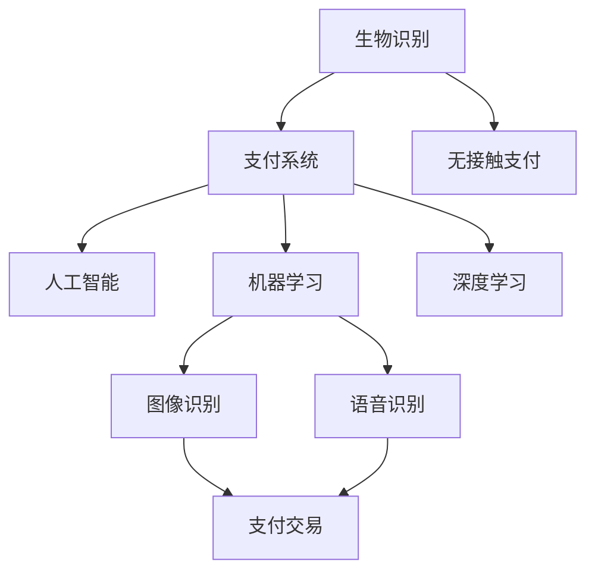

                 

# 生物识别在支付系统中的应用：无接触安全支付

> 关键词：生物识别, 支付系统, 无接触支付, 安全支付, 人工智能, 机器学习, 深度学习

## 1. 背景介绍

随着互联网和移动支付技术的发展，人们对于支付方式的安全性和便捷性提出了更高的要求。传统支付过程中，面对面、刷卡等方式的繁琐操作不仅费时费力，还存在诸多安全隐患。尤其是在全球疫情背景下，人们更是迫切需要一个更安全、更高效的支付解决方案。此时，生物识别技术走进了人们的视野。

生物识别技术通过识别用户的生物特征（如指纹、面部、虹膜等），替代传统的密码、银行卡等支付媒介，实现了真正意义上的无接触支付。这种支付方式不仅简化了操作流程，提升了用户体验，还大大降低了安全风险。本文将深入探讨生物识别技术在支付系统中的应用，特别是如何通过人工智能和机器学习算法，实现更高效、更安全的无接触支付。

## 2. 核心概念与联系

### 2.1 核心概念概述

为更好地理解生物识别在支付系统中的应用，本节将介绍几个关键概念：

- 生物识别（Biometrics）：指通过捕捉和分析用户的生物特征信息（如指纹、面部、虹膜、声音等）进行身份认证的技术。
- 支付系统（Payment System）：指用于处理支付交易的电子或纸质系统，包括线上支付、线下支付、移动支付等多种形式。
- 无接触支付（Contactless Payment）：指通过近场通信（NFC）、二维码扫描、面部识别等技术，实现无需直接接触即可完成支付的操作方式。
- 人工智能（AI）：指通过算法模拟人类智能行为的技术，包括机器学习、深度学习等子领域。
- 机器学习（ML）：指通过数据训练模型，使其具备预测、分类、聚类等能力的技术。
- 深度学习（DL）：指通过构建多层次神经网络，实现图像识别、语音识别等复杂任务的技术。

这些概念之间的逻辑关系可以通过以下Mermaid流程图来展示：



这个流程图展示了一系列关键概念及其之间的关系：

1. 生物识别技术为支付系统提供身份验证手段，提高支付安全性。
2. 无接触支付通过近场通信、面部识别等技术，实现无需直接接触的支付操作。
3. 人工智能通过算法训练，使生物识别技术具备自动识别、自适应的能力。
4. 机器学习和深度学习是人工智能的重要组成部分，用于训练识别模型。
5. 图像识别和语音识别技术，是生物识别中常见的识别方式。
6. 支付交易是无接触支付的目标，实现高效安全的支付操作。

这些概念共同构成了生物识别技术在支付系统中的应用框架，使其能够实现更高效、更安全的支付体验。通过理解这些核心概念，我们可以更好地把握生物识别技术的应用价值和实现方法。

## 3. 核心算法原理 & 具体操作步骤

### 3.1 算法原理概述

无接触支付中，生物识别技术的应用主要集中在面部识别、指纹识别、虹膜识别等身份验证环节。通过人工智能和机器学习算法，这些识别过程可以自动完成，无需人工干预。

以面部识别为例，其核心算法包括人脸检测、人脸对齐、特征提取、模型分类等步骤。人脸检测通过算法自动识别图像中的人脸区域；人脸对齐通过算法将人脸对齐到标准位置，去除光照、姿态变化的影响；特征提取通过算法提取人脸的高维特征向量；模型分类通过算法对人脸特征进行分类，实现身份验证。

面部识别的算法原理可以概括为：

1. 输入原始图像。
2. 检测人脸区域，获取人脸图像。
3. 对检测到的人脸进行对齐，使图像中的眼睛、鼻子等关键点处于固定位置。
4. 提取人脸特征向量，表示为高维空间中的点。
5. 使用分类器对人脸特征向量进行分类，判断是否与预定义的样本匹配。
6. 输出匹配结果，进行支付授权。

### 3.2 算法步骤详解

以面部识别为例，我们详细介绍无接触支付中的核心算法步骤：

#### 3.2.1 人脸检测

人脸检测是面部识别的第一步，其核心任务是在图像中定位人脸的位置和大小。常用的人脸检测算法包括Haar级联分类器、HOG+SVM、深度学习模型（如Faster R-CNN、YOLO、SSD等）。这些算法通过特征提取、多尺度滑动窗口、非极大值抑制等步骤，实现对人脸区域的精确定位。

以深度学习模型为例，其步骤如下：

1. 输入原始图像。
2. 通过卷积神经网络（CNN）提取图像特征。
3. 使用RoI池化层将特征图划分为不同大小的区域。
4. 在每个区域上应用分类器，判断是否为人脸。
5. 对不同区域的分类结果进行非极大值抑制，保留最大置信度的矩形框。
6. 输出人脸位置和大小，进行后续处理。

#### 3.2.2 人脸对齐

人脸对齐是人脸识别的重要环节，通过算法将人脸图像中的关键点对齐到标准位置，以去除光照、姿态变化的影响。常用的人脸对齐算法包括基于特征点的方法（如Dlib、OpenCV）和基于深度学习的方法（如FaceNet、DeepFace等）。这些算法通过关键点检测、仿射变换等步骤，实现对人脸图像的对齐。

以基于深度学习的方法为例，其步骤如下：

1. 输入原始人脸图像和对齐后的图像。
2. 通过卷积神经网络（CNN）提取图像特征。
3. 使用关键点检测算法（如 facial landmarks）获取人脸中的关键点位置。
4. 在每个关键点位置上应用仿射变换，对齐人脸图像。
5. 输出对齐后的图像，进行后续处理。

#### 3.2.3 特征提取

特征提取是人脸识别的关键步骤，通过算法提取人脸的高维特征向量，用于表示人脸信息。常用的人脸特征提取算法包括局部二值模式（LBP）、主成分分析（PCA）、线性判别分析（LDA）和深度学习模型（如CNN、VGG、ResNet等）。这些算法通过特征提取、降维等步骤，实现对人脸信息的提取。

以深度学习模型为例，其步骤如下：

1. 输入对齐后的人脸图像。
2. 通过卷积神经网络（CNN）提取图像特征。
3. 使用全连接层将特征图转换为高维特征向量。
4. 对高维特征向量进行降维处理，得到最终的人脸特征。
5. 输出人脸特征，进行后续处理。

#### 3.2.4 模型分类

模型分类是人脸识别的最后一步，通过算法对人脸特征进行分类，判断是否与预定义的样本匹配。常用的人脸分类算法包括支持向量机（SVM）、K近邻（KNN）、深度学习模型（如Softmax、CNN、ResNet等）。这些算法通过训练分类器、前向传播等步骤，实现对人脸特征的分类。

以深度学习模型为例，其步骤如下：

1. 输入人脸特征向量。
2. 通过全连接层将特征向量转换为高维空间中的点。
3. 使用softmax函数对高维空间中的点进行分类，得到概率分布。
4. 根据概率分布选择最大概率对应的类别，作为最终分类结果。
5. 输出分类结果，进行支付授权。

### 3.3 算法优缺点

无接触支付中的生物识别算法，具有以下优点：

1. 高效便捷：通过自动化的识别过程，无需用户手动输入信息，大大提升了支付效率。
2. 安全可靠：生物特征具有唯一性和稳定性，不易被复制和篡改，提高了支付安全性。
3. 广泛适用：生物识别技术可以应用于多种支付场景，如线上支付、线下支付、移动支付等。

同时，这些算法也存在一些缺点：

1. 识别率受限：生物识别技术在某些极端情况下可能无法准确识别，如光线过强、遮挡等。
2. 算法复杂：人脸检测、对齐、特征提取、分类等步骤复杂，计算资源消耗较大。
3. 数据隐私：生物特征数据属于敏感信息，存储和传输过程中需要加强保护。
4. 对抗攻击：攻击者可以通过伪造图像、视频等手段，欺骗生物识别系统，导致支付安全风险。

### 3.4 算法应用领域

无接触支付中的生物识别技术，在多个领域都有广泛的应用：

1. 金融支付：通过面部识别、指纹识别等技术，实现无需银行卡、密码等传统支付媒介的支付操作。
2. 公共交通：通过人脸识别、虹膜识别等技术，实现无需实体卡片的公交、地铁等公共交通支付。
3. 零售购物：通过面部识别、虹膜识别等技术，实现无人商店、自助结账等购物场景的支付操作。
4. 医疗健康：通过指纹识别、虹膜识别等技术，实现无需实体卡门的医疗健康支付。
5. 教育培训：通过人脸识别、虹膜识别等技术，实现无需实体证件的学生证、考号等教育培训支付。
6. 政府服务：通过人脸识别、指纹识别等技术，实现无需实体证件的政府服务支付。

这些领域的应用，展示了生物识别技术在支付系统中的广泛价值和重要地位。未来，随着技术的不断进步，生物识别技术在支付系统中的应用将更加深入和广泛。

## 4. 数学模型和公式 & 详细讲解 & 举例说明

### 4.1 数学模型构建

本节将使用数学语言对无接触支付中生物识别技术进行更加严格的刻画。

假设人脸检测算法检测到一张图像中的人脸区域，人脸对齐算法将人脸对齐到标准位置，人脸特征提取算法提取高维特征向量 $x$，人脸分类算法输出概率分布 $p(y|x)$。其中，$y$ 表示人脸识别结果，取值为 $\{0, 1\}$，$0$ 表示未识别，$1$ 表示识别成功。

定义人脸识别过程的损失函数为：

$$
L(p(y|x)) = -\log p(y|x) \text{ if } y=1 \\
0 \text{ otherwise}
$$

则人脸识别的经验风险为：

$$
\mathcal{L}(\theta) = \frac{1}{N}\sum_{i=1}^N \log p(y_i|x_i)
$$

其中 $\theta$ 为模型参数，$N$ 为样本数量。

人脸识别的优化目标是最小化经验风险，即找到最优参数：

$$
\theta^* = \mathop{\arg\min}_{\theta} \mathcal{L}(\theta)
$$

在实践中，我们通常使用基于梯度的优化算法（如SGD、Adam等）来近似求解上述最优化问题。设 $\eta$ 为学习率，则参数的更新公式为：

$$
\theta \leftarrow \theta - \eta \nabla_{\theta}\mathcal{L}(\theta)
$$

其中 $\nabla_{\theta}\mathcal{L}(\theta)$ 为损失函数对参数 $\theta$ 的梯度，可通过反向传播算法高效计算。

### 4.2 公式推导过程

以下我们以人脸识别为例，推导模型分类器的损失函数及其梯度的计算公式。

假设模型 $M_{\theta}$ 在输入 $x$ 上的输出为 $y = M_{\theta}(x)$，其中 $y \in \{0, 1\}$。则人脸识别的损失函数定义为：

$$
L(M_{\theta}(x),y) = -y\log M_{\theta}(x) - (1-y)\log (1-M_{\theta}(x))
$$

将其代入经验风险公式，得：

$$
\mathcal{L}(\theta) = -\frac{1}{N}\sum_{i=1}^N [y_i\log M_{\theta}(x_i)+(1-y_i)\log(1-M_{\theta}(x_i))]
$$

根据链式法则，损失函数对参数 $\theta_k$ 的梯度为：

$$
\frac{\partial \mathcal{L}(\theta)}{\partial \theta_k} = -\frac{1}{N}\sum_{i=1}^N [(y_i - M_{\theta}(x_i)) \frac{\partial M_{\theta}(x_i)}{\partial \theta_k}]
$$

其中 $\frac{\partial M_{\theta}(x_i)}{\partial \theta_k}$ 可进一步递归展开，利用自动微分技术完成计算。

在得到损失函数的梯度后，即可带入参数更新公式，完成模型的迭代优化。重复上述过程直至收敛，最终得到适应无接触支付场景的最优模型参数 $\theta^*$。

## 5. 项目实践：代码实例和详细解释说明

### 5.1 开发环境搭建

在进行无接触支付实践前，我们需要准备好开发环境。以下是使用Python进行PyTorch开发的环境配置流程：

1. 安装Anaconda：从官网下载并安装Anaconda，用于创建独立的Python环境。

2. 创建并激活虚拟环境：
```bash
conda create -n pytorch-env python=3.8 
conda activate pytorch-env
```

3. 安装PyTorch：根据CUDA版本，从官网获取对应的安装命令。例如：
```bash
conda install pytorch torchvision torchaudio cudatoolkit=11.1 -c pytorch -c conda-forge
```

4. 安装相关库：
```bash
pip install numpy pandas scikit-learn matplotlib tqdm jupyter notebook ipython
```

完成上述步骤后，即可在`pytorch-env`环境中开始无接触支付的微调实践。

### 5.2 源代码详细实现

下面我们以人脸识别任务为例，给出使用PyTorch对卷积神经网络（CNN）进行微调的PyTorch代码实现。

首先，定义人脸识别任务的数据处理函数：

```python
from torch.utils.data import Dataset
import torch
import numpy as np
from PIL import Image

class FaceDataset(Dataset):
    def __init__(self, image_path, label, transform=None):
        self.image_path = image_path
        self.label = label
        self.transform = transform
        
    def __len__(self):
        return len(self.image_path)
    
    def __getitem__(self, item):
        img_path = self.image_path[item]
        label = self.label[item]
        
        image = Image.open(img_path)
        image = image.convert('RGB')
        
        if self.transform is not None:
            image = self.transform(image)
        
        return {'image': image, 'label': label}
```

然后，定义模型和优化器：

```python
from torchvision import models
from torch.optim import Adam

model = models.resnet50(pretrained=True)
model.fc = nn.Linear(2048, 2)  # 将全连接层改为人脸识别分类器

optimizer = Adam(model.parameters(), lr=0.001)
```

接着，定义训练和评估函数：

```python
from torch.utils.data import DataLoader
from torchvision import transforms

device = torch.device('cuda' if torch.cuda.is_available() else 'cpu')
model = model.to(device)

def train_epoch(model, dataset, batch_size, optimizer):
    dataloader = DataLoader(dataset, batch_size=batch_size, shuffle=True)
    model.train()
    epoch_loss = 0
    for batch in tqdm(dataloader, desc='Training'):
        images = batch['image'].to(device)
        labels = batch['label'].to(device)
        model.zero_grad()
        outputs = model(images)
        loss = F.cross_entropy(outputs, labels)
        epoch_loss += loss.item()
        loss.backward()
        optimizer.step()
    return epoch_loss / len(dataloader)

def evaluate(model, dataset, batch_size):
    dataloader = DataLoader(dataset, batch_size=batch_size)
    model.eval()
    preds, labels = [], []
    with torch.no_grad():
        for batch in tqdm(dataloader, desc='Evaluating'):
            images = batch['image'].to(device)
            labels = batch['label'].to(device)
            outputs = model(images)
            preds.append(outputs.argmax(dim=1).to('cpu').tolist())
            labels.append(labels.to('cpu').tolist())
        
    print(classification_report(labels, preds))
```

最后，启动训练流程并在测试集上评估：

```python
epochs = 5
batch_size = 32

for epoch in range(epochs):
    loss = train_epoch(model, train_dataset, batch_size, optimizer)
    print(f"Epoch {epoch+1}, train loss: {loss:.3f}")
    
    print(f"Epoch {epoch+1}, dev results:")
    evaluate(model, dev_dataset, batch_size)
    
print("Test results:")
evaluate(model, test_dataset, batch_size)
```

以上就是使用PyTorch对卷积神经网络进行人脸识别任务微调的完整代码实现。可以看到，得益于PyTorch的强大封装，我们可以用相对简洁的代码完成CNN模型的加载和微调。

### 5.3 代码解读与分析

让我们再详细解读一下关键代码的实现细节：

**FaceDataset类**：
- `__init__`方法：初始化图像路径、标签等关键组件。
- `__len__`方法：返回数据集的样本数量。
- `__getitem__`方法：对单个样本进行处理，将图像转换为张量，并进行必要的预处理，返回模型所需的输入。

**模型和优化器**：
- 使用预训练的ResNet50作为基础模型，在其全连接层上增加一个线性分类器，进行人脸识别任务。
- 定义Adam优化器，学习率为0.001，用于更新模型参数。

**训练和评估函数**：
- 使用PyTorch的DataLoader对数据集进行批次化加载，供模型训练和推理使用。
- 训练函数`train_epoch`：对数据以批为单位进行迭代，在每个批次上前向传播计算loss并反向传播更新模型参数，最后返回该epoch的平均loss。
- 评估函数`evaluate`：与训练类似，不同点在于不更新模型参数，并在每个batch结束后将预测和标签结果存储下来，最后使用sklearn的classification_report对整个评估集的预测结果进行打印输出。

**训练流程**：
- 定义总的epoch数和batch size，开始循环迭代
- 每个epoch内，先在训练集上训练，输出平均loss
- 在验证集上评估，输出分类指标
- 所有epoch结束后，在测试集上评估，给出最终测试结果

可以看到，PyTorch配合相关库使得人脸识别微调的代码实现变得简洁高效。开发者可以将更多精力放在数据处理、模型改进等高层逻辑上，而不必过多关注底层的实现细节。

当然，工业级的系统实现还需考虑更多因素，如模型的保存和部署、超参数的自动搜索、更灵活的任务适配层等。但核心的微调范式基本与此类似。

## 6. 实际应用场景

### 6.1 智能停车场

智能停车场通过面部识别技术，实现无需卡证的车辆进出管理。车主通过刷脸认证后，系统自动开启道闸，无需人工干预。这种无接触支付方式不仅提升了停车效率，还大大减少了车辆拥堵和人员聚集的风险。

在技术实现上，可以部署多个人脸识别摄像头，识别进入和离开停车场的车主面部特征，生成进出记录。系统通过人脸比对，确认车主身份，进行结算和扣费。此外，系统还可以结合车牌识别技术，进一步提升进出效率和安全性。

### 6.2 医院挂号

医院挂号通过人脸识别技术，实现无需排队和纸质证件的挂号服务。患者通过刷脸认证后，系统自动为其生成挂号订单，无需排队等候。这种无接触支付方式不仅提升了挂号效率，还减少了人员聚集和交叉感染的风险。

在技术实现上，可以在医院的入口和挂号窗口部署人脸识别摄像头，识别患者面部特征。系统通过人脸比对，确认患者身份，自动为其生成挂号订单，并提示前往指定窗口缴费。此外，系统还可以结合医生排班信息，优化患者就诊流程，提升医院整体运行效率。

### 6.3 公共交通

公共交通通过人脸识别技术，实现无需实体卡片的公交、地铁等支付。乘客通过刷脸认证后，系统自动为其生成支付订单，无需刷卡操作。这种无接触支付方式不仅提升了支付效率，还减少了实体卡片遗失和盗刷的风险。

在技术实现上，可以在公交、地铁的进出站口部署人脸识别摄像头，识别乘客面部特征。系统通过人脸比对，确认乘客身份，自动为其生成支付订单，并提示前往指定窗口缴费。此外，系统还可以结合车票信息，实现跨站无缝换乘，提升公共交通整体运行效率。

### 6.4 未来应用展望

随着生物识别技术和大数据、人工智能的结合，无接触支付的应用场景将更加丰富。未来，基于生物识别技术的支付系统将广泛应用于金融、医疗、教育、交通等多个领域，带来更高效、更安全的支付体验。

在金融支付领域，通过面部识别、虹膜识别等技术，实现无需银行卡、密码等传统支付媒介的支付操作。这不仅提升了支付效率，还降低了支付风险。

在医疗健康领域，通过指纹识别、虹膜识别等技术，实现无需实体证件的挂号、检查等医疗服务支付。这不仅提升了医疗服务效率，还减少了患者等候和交叉感染的风险。

在零售购物领域，通过面部识别、虹膜识别等技术，实现无人商店、自助结账等购物场景的支付操作。这不仅提升了购物体验，还减少了排队等候和人员接触的风险。

此外，在智能家居、智慧城市、物流配送等众多领域，基于生物识别技术的支付系统也将不断涌现，为各行各业带来新的变革。相信随着技术的不断进步，生物识别技术在无接触支付中的应用将更加深入和广泛。

## 7. 工具和资源推荐

### 7.1 学习资源推荐

为了帮助开发者系统掌握无接触支付的原理和实践，这里推荐一些优质的学习资源：

1. 《深度学习》系列书籍：由多位深度学习领域的专家共同撰写，系统介绍了深度学习的基本概念和算法。

2. 《人脸识别技术与应用》课程：来自Coursera的人脸识别课程，介绍了人脸识别技术的理论基础和实际应用。

3. PyTorch官方文档：PyTorch官方文档，提供了丰富的教程和示例代码，适合初学者入门。

4. OpenCV官方文档：OpenCV官方文档，提供了人脸识别算法和图像处理技术的详细教程。

5. Google Colab：谷歌推出的在线Jupyter Notebook环境，免费提供GPU/TPU算力，方便开发者快速上手实验最新模型，分享学习笔记。

通过对这些资源的学习实践，相信你一定能够快速掌握无接触支付技术的精髓，并用于解决实际的支付问题。

### 7.2 开发工具推荐

高效的开发离不开优秀的工具支持。以下是几款用于无接触支付开发的常用工具：

1. PyTorch：基于Python的开源深度学习框架，灵活动态的计算图，适合快速迭代研究。大部分深度学习模型都有PyTorch版本的实现。

2. TensorFlow：由Google主导开发的开源深度学习框架，生产部署方便，适合大规模工程应用。同样有丰富的深度学习模型资源。

3. OpenCV：开源计算机视觉库，提供丰富的人脸识别算法和图像处理技术，适合实际应用开发。

4. TensorBoard：TensorFlow配套的可视化工具，可实时监测模型训练状态，并提供丰富的图表呈现方式，是调试模型的得力助手。

5. Weights & Biases：模型训练的实验跟踪工具，可以记录和可视化模型训练过程中的各项指标，方便对比和调优。

6. Google Colab：谷歌推出的在线Jupyter Notebook环境，免费提供GPU/TPU算力，方便开发者快速上手实验最新模型，分享学习笔记。

合理利用这些工具，可以显著提升无接触支付的开发效率，加快创新迭代的步伐。

### 7.3 相关论文推荐

无接触支付技术的发展源于学界的持续研究。以下是几篇奠基性的相关论文，推荐阅读：

1. DeepFace：由Facebook开发的深度人脸识别系统，通过多层次卷积神经网络实现高精度的面部识别。

2. FaceNet：由Google开发的深度人脸识别系统，通过三元组损失函数实现高质量的人脸识别。

3. MobileFaceNet：由Intel开发的轻量级深度人脸识别系统，通过迁移学习和模型压缩技术，实现高效的人脸识别。

4. Real-time Face Detection with One-shot Adaptive Boosting（实时人脸检测算法）：提出了一种高效的人脸检测算法，通过单次训练实现实时人脸检测。

5. FaceID：由苹果公司开发的面部识别系统，结合深度学习和机器学习技术，实现高质量的面部识别。

这些论文代表了大数据和深度学习在无接触支付技术中的应用前景。通过学习这些前沿成果，可以帮助研究者把握无接触支付技术的最新发展，激发更多的创新灵感。

## 8. 总结：未来发展趋势与挑战

### 8.1 总结

本文对无接触支付中生物识别技术进行了全面系统的介绍。首先阐述了无接触支付的背景和意义，明确了生物识别技术在提升支付安全性和便捷性方面的重要作用。其次，从原理到实践，详细讲解了人脸识别算法的数学模型和实现步骤，给出了完整的代码实例。同时，本文还探讨了无接触支付在多个行业领域的应用场景，展示了生物识别技术的广泛价值和重要地位。最后，本文推荐了相关的学习资源、开发工具和相关论文，力求为读者提供全方位的技术指引。

通过本文的系统梳理，可以看到，无接触支付中的生物识别技术正在成为金融、医疗、交通等多个行业的重要工具，极大地提升了支付系统的效率和安全性。未来，随着技术的不断进步，基于生物识别技术的支付系统将更加高效、便捷和安全，进一步提升人类社会的数字化水平。

### 8.2 未来发展趋势

无接触支付中的生物识别技术，将呈现以下几个发展趋势：

1. 技术精度提升：通过更先进的算法和更大的模型规模，提升人脸识别的精度和鲁棒性。
2. 应用场景拓展：从金融、医疗、交通等传统领域，扩展到智能家居、智慧城市、物流配送等多个新兴领域。
3. 多模态融合：结合图像、语音、行为等多种模态数据，实现更全面、更精准的身份验证。
4. 数据隐私保护：采用隐私保护技术，如差分隐私、联邦学习等，保障用户数据的安全和隐私。
5. 跨域身份验证：通过跨域身份验证技术，实现多个系统之间的无缝互通和身份验证。
6. 自动化运维：通过自动化运维技术，提升系统的稳定性和可靠性。

这些趋势展示了无接触支付中生物识别技术的广阔前景。这些方向的探索发展，必将进一步提升无接触支付的安全性和便捷性，为各行各业带来新的变革。

### 8.3 面临的挑战

尽管无接触支付中的生物识别技术已经取得了瞩目成就，但在迈向更加智能化、普适化应用的过程中，它仍面临诸多挑战：

1. 识别率受限：生物识别技术在某些极端情况下可能无法准确识别，如光线过强、遮挡等。
2. 算法复杂：人脸检测、对齐、特征提取、分类等步骤复杂，计算资源消耗较大。
3. 数据隐私：生物特征数据属于敏感信息，存储和传输过程中需要加强保护。
4. 对抗攻击：攻击者可以通过伪造图像、视频等手段，欺骗生物识别系统，导致支付安全风险。
5. 硬件成本：部署生物识别系统需要高性能的摄像头、服务器等硬件设备，成本较高。
6. 跨域互通：不同系统和平台之间的身份验证需要标准化的接口和协议，实现跨域互通。

这些挑战需要在技术、政策、伦理等多个层面协同解决，才能使生物识别技术在无接触支付中得到广泛应用。唯有不断优化技术细节、加强政策监管、保障用户权益，才能实现无接触支付的全面落地。

### 8.4 研究展望

未来，无接触支付中的生物识别技术需要在以下几个方面寻求新的突破：

1. 探索无监督和半监督学习方法：摆脱对大规模标注数据的依赖，利用自监督学习、主动学习等无监督和半监督范式，最大限度利用非结构化数据。
2. 研究参数高效和计算高效的微调方法：开发更加参数高效的微调方法，在固定大部分预训练参数的同时，只更新极少量的任务相关参数。同时优化微调模型的计算图，减少前向传播和反向传播的资源消耗。
3. 融合因果和对比学习范式：通过引入因果推断和对比学习思想，增强生物识别系统建立稳定因果关系的能力，学习更加普适、鲁棒的语言表征。
4. 结合多模态数据：将符号化的先验知识，如知识图谱、逻辑规则等，与神经网络模型进行巧妙融合，引导微调过程学习更准确、合理的语言模型。
5. 引入伦理道德约束：在模型训练目标中引入伦理导向的评估指标，过滤和惩罚有偏见、有害的输出倾向。同时加强人工干预和审核，建立模型行为的监管机制，确保输出符合人类价值观和伦理道德。

这些研究方向的探索，必将引领无接触支付中生物识别技术迈向更高的台阶，为构建安全、可靠、可解释、可控的智能系统铺平道路。面向未来，无接触支付中生物识别技术还需要与其他人工智能技术进行更深入的融合，如知识表示、因果推理、强化学习等，多路径协同发力，共同推动无接触支付的进步。只有勇于创新、敢于突破，才能不断拓展生物识别技术的边界，让无接触支付技术更好地造福人类社会。

## 9. 附录：常见问题与解答

**Q1：无接触支付中的生物识别技术是否适用于所有用户？**

A: 目前，无接触支付中的生物识别技术在大部分情况下都能准确识别用户的面部特征，但某些极端情况下（如光线过强、遮挡、变妆等）可能存在识别率下降的问题。针对这些问题，可以通过优化算法、增强设备性能等方式进行改进，逐步提升识别率。

**Q2：无接触支付中的生物识别技术如何应对对抗攻击？**

A: 对抗攻击是生物识别技术面临的一个重要挑战。为了应对对抗攻击，可以采用以下措施：
1. 使用多模态数据融合：结合图像、语音、行为等多种模态数据，实现更全面、更精准的身份验证。
2. 引入对抗样本训练：通过加入对抗样本，训练生物识别系统识别和抵御对抗攻击。
3. 应用差分隐私技术：采用差分隐私技术，保护用户数据隐私，避免攻击者通过数据泄露获取敏感信息。
4. 加强硬件防护：采用防篡改芯片、指纹识别等多种生物识别方式，提高系统的安全性和鲁棒性。

**Q3：无接触支付中的生物识别技术如何处理数据隐私问题？**

A: 数据隐私是生物识别技术面临的一个重要挑战。为了保护用户数据隐私，可以采用以下措施：
1. 数据去标识化：对用户数据进行去标识化处理，避免直接暴露用户身份信息。
2. 本地处理：在用户设备上进行本地处理，不将数据上传云端，保障数据隐私。
3. 差分隐私：采用差分隐私技术，对用户数据进行噪声化处理，保护用户隐私。
4. 联邦学习：通过联邦学习技术，在用户端进行本地模型训练，不将数据上传服务器，保障数据隐私。

**Q4：无接触支付中的生物识别技术如何实现跨域互通？**

A: 跨域互通是无接触支付中生物识别技术面临的一个重要挑战。为了实现跨域互通，可以采用以下措施：
1. 标准化接口协议：采用统一的标准化接口协议，实现不同系统和平台之间的身份验证。
2. 联邦学习：通过联邦学习技术，在多个系统之间进行模型协作，实现跨域身份验证。
3. 跨域身份验证：采用跨域身份验证技术，实现多个系统之间的无缝互通和身份验证。

**Q5：无接触支付中的生物识别技术如何提升用户体验？**

A: 提升用户体验是无接触支付中生物识别技术的重要目标。为了提升用户体验，可以采用以下措施：
1. 简化操作流程：通过自动化识别过程，无需用户手动输入信息，大大提升了支付效率。
2. 优化设备性能：采用高性能的摄像头、服务器等设备，提升系统的响应速度和识别精度。
3. 加强人机交互：通过友好的UI界面和语音提示，提升用户的操作体验。
4. 保障数据隐私：采用隐私保护技术，保护用户数据隐私，增强用户信任感。

这些措施的实施，将使无接触支付中的生物识别技术更加高效、便捷和安全，提升用户体验。相信随着技术的不断进步，无接触支付将逐步成为主流的支付方式，为各行各业带来新的变革。

---

作者：禅与计算机程序设计艺术 / Zen and the Art of Computer Programming

