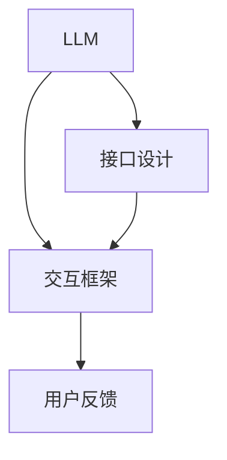

                 

# 用户友好的AI：LLM接口设计哲学

## 1. 背景介绍

在人工智能领域，语言模型（LLM）是推动自然语言处理（NLP）发展的核心动力之一。LLM如GPT-3、BERT等模型在回答问题、生成文本、情感分析等任务上表现出色，但它们通常以复杂的API和接口呈现，缺乏对普通用户的直观理解。为了使AI更贴近用户，设计易于使用的LLM接口至关重要。本博文将深入探讨如何设计用户友好的LLM接口，并通过一系列案例和实践建议，为开发者提供切实可行的指导。

## 2. 核心概念与联系

### 2.1 核心概念概述

- **语言模型（LLM）**：通过大规模无标签文本数据预训练，学习语言表示的模型。常见的LLM包括GPT系列、BERT、T5等。
- **接口设计**：系统提供给用户操作的抽象层，包括用户交互界面和API。用户友好的接口旨在简化操作流程，提高用户体验。
- **交互框架**：支持用户与LLM交互的底层技术架构，如RESTful API、WebSocket等。
- **用户反馈**：用户对接口使用体验的直接评价，是改进和优化接口的重要依据。

### 2.2 核心概念原理和架构的 Mermaid 流程图



此图展示了LLM接口设计的核心流程：LLM输出模型，通过接口设计和交互框架，实现用户与模型交互，并根据用户反馈不断优化接口。

## 3. 核心算法原理 & 具体操作步骤

### 3.1 算法原理概述

设计用户友好的LLM接口时，首先需要明确用户使用场景和期望目标，然后选择合适的算法和框架，最后实施具体的接口设计和测试流程。

- **场景分析**：分析目标用户群体、使用环境和任务目标，确定接口设计的基本方向。
- **算法选择**：选择合适的LLM模型和算法，以满足特定的任务需求。
- **接口设计**：定义用户交互界面和API接口，实现用户和LLM的互动。
- **测试优化**：通过用户反馈和性能测试，持续优化和迭代接口设计。

### 3.2 算法步骤详解

以下是详细的接口设计步骤：

1. **需求分析**：通过调研、问卷和访谈等方式，获取用户需求和使用场景。
2. **界面设计**：根据用户需求，设计直观易用的UI界面，包括图表、按钮、输入框等。
3. **API设计**：定义API接口，包括请求方式、参数格式、返回结果等。
4. **模型集成**：将选定的LLM模型集成到接口中，实现模型推理和响应。
5. **用户测试**：邀请目标用户使用接口，收集反馈和建议，持续优化接口设计。
6. **性能优化**：根据用户反馈和性能测试结果，优化算法和接口，提高响应速度和资源利用率。

### 3.3 算法优缺点

**优点**：
- 提高用户满意度：设计用户友好的接口，可以显著提升用户使用体验。
- 提高模型利用率：优化接口设计，可以更高效地利用模型资源。
- 促进用户参与：用户友好型接口容易上手，可鼓励用户更多参与和反馈。

**缺点**：
- 设计复杂度增加：设计出易于使用的接口需要更多的前期准备和分析工作。
- 维护成本增加：持续的优化和测试工作，可能增加维护成本。
- 可能不符合专业需求：过于简化的设计，可能无法满足特定专业用户的需求。

### 3.4 算法应用领域

用户友好的LLM接口设计不仅适用于一般性NLP应用，如问答、翻译、情感分析等，也广泛应用于专业领域，如医疗、金融、法律等。以下是具体应用案例：

- **医疗领域**：设计简单的界面，让用户输入症状描述，获得诊断建议和治疗方案。
- **金融领域**：使用户输入金融报告或新闻，获得市场分析和投资建议。
- **法律领域**：提供合同生成、法律咨询等功能的简化接口，方便非专业人士使用。

## 4. 数学模型和公式 & 详细讲解 & 举例说明

### 4.1 数学模型构建

假设用户输入为自然语言文本$X$，LLM输出的回答为$Y$，模型输入为$x$，输出为$y$，构建数学模型为：

$$
P(Y|X) = P(Y|x)
$$

其中$P(Y|x)$表示在给定输入$x$的情况下，LLM输出$Y$的概率分布。

### 4.2 公式推导过程

根据贝叶斯定理，可以得到：

$$
P(Y|X) = \frac{P(X|Y)P(Y)}{P(X)}
$$

进一步推导可得：

$$
P(X|Y) = \frac{P(X,Y)}{P(Y)}
$$

上式表示在给定$Y$的情况下，$X$的条件概率，即模型对输入文本$X$的生成概率。

### 4.3 案例分析与讲解

以金融领域的股市预测为例，用户输入当前市场数据和新闻报道，LLM输出股市走势预测。可以采用以下步骤：

1. 定义输入输出格式，如JSON格式。
2. 构建模型推理流程，实现文本处理和预测计算。
3. 设计用户交互界面，包括数据输入、预测展示等功能。
4. 进行用户测试，收集反馈并进行优化。

## 5. 项目实践：代码实例和详细解释说明

### 5.1 开发环境搭建

- **环境准备**：安装Python 3.8以上版本，并配置虚拟环境。
- **工具安装**：安装Flask、TensorFlow等必要库。
- **模型准备**：选择一个适合任务的预训练LLM模型，如BERT。

### 5.2 源代码详细实现

以下是一个简单的金融预测示例代码：

```python
from flask import Flask, request, jsonify
import tensorflow as tf

app = Flask(__name__)

# 加载BERT模型
model = tf.keras.Sequential([
    tf.keras.layers.Bidirectional(tf.keras.layers.LSTM(128)),
    tf.keras.layers.Dense(64, activation='relu'),
    tf.keras.layers.Dense(1)
])

# 加载预测数据
@app.route('/predict', methods=['POST'])
def predict():
    data = request.json
    x = tf.keras.preprocessing.sequence.pad_sequences([data['feature']], maxlen=100)
    y = model.predict(x)
    return jsonify({'prediction': y[0][0]})

if __name__ == '__main__':
    app.run(debug=True)
```

### 5.3 代码解读与分析

1. **Flask框架**：用于搭建API服务器，方便接口调用。
2. **BERT模型**：采用LSTM和Dense层构建预测模型，输入为市场数据，输出为预测结果。
3. **数据处理**：将用户输入数据转化为模型可接受的格式。
4. **预测调用**：通过POST请求，调用模型进行预测，并返回结果。

### 5.4 运行结果展示

运行代码后，可以使用如下命令测试API：

```
curl -X POST -H "Content-Type: application/json" -d '{"feature": [1.1, 2.2, 3.3, ...]}' http://localhost:5000/predict
```

## 6. 实际应用场景

### 6.1 智能客服

智能客服系统可以通过用户友好的LLM接口，帮助用户快速解决问题。用户输入问题，系统通过接口调用LLM，生成回答，并展示给用户。

### 6.2 个性化推荐

电商平台可以通过用户友好的LLM接口，根据用户输入的产品评论和行为数据，推荐符合用户兴趣的商品。用户输入搜索关键词，系统通过接口调用LLM，生成推荐结果，并提供给用户。

### 6.3 医疗咨询

在线医疗平台可以通过用户友好的LLM接口，根据用户输入的病情描述，提供初步诊断和治疗建议。用户输入症状，系统通过接口调用LLM，生成回答，并提供给用户。

### 6.4 未来应用展望

未来，用户友好的LLM接口将在更多领域得到应用：

- **智慧城市**：智能交通、环境监测等应用将利用用户友好的接口，实现人机交互。
- **教育**：在线教育平台可以通过用户友好的接口，提供个性化学习建议和作业批改。
- **社交媒体**：社交平台可以利用用户友好的接口，提供智能问答和内容推荐服务。

## 7. 工具和资源推荐

### 7.1 学习资源推荐

1. **书籍**：《深入浅出自然语言处理》《Python深度学习》
2. **在线课程**：Coursera上的"Natural Language Processing with Python"课程
3. **论文**：arXiv上的最新自然语言处理研究论文

### 7.2 开发工具推荐

1. **Flask**：轻量级Web框架，适合构建简单的API接口。
2. **TensorFlow**：强大的深度学习库，支持多种模型和算法。
3. **BERT模型**：Google开发的预训练模型，适合处理自然语言任务。

### 7.3 相关论文推荐

1. "Understanding the Difficulties of Interacting with AI"（理解与AI交互的困难）
2. "Designing User-Friendly AI Interfaces"（设计用户友好的AI界面）
3. "Practical Considerations for Interacting with LLMs"（与LLMs交互的实践考虑）

## 8. 总结：未来发展趋势与挑战

### 8.1 研究成果总结

用户友好的LLM接口设计是AI技术普及的关键。本博文系统介绍了接口设计的基本流程和关键技术，并通过实际案例展示了其应用效果。

### 8.2 未来发展趋势

1. **跨平台兼容性**：用户友好的接口将跨平台、跨设备提供一致的使用体验。
2. **智能化互动**：基于AI技术的界面将进一步智能化，提供个性化的交互体验。
3. **多模态融合**：结合语音、图像等多模态数据，实现更丰富的交互方式。

### 8.3 面临的挑战

1. **用户需求多样化**：不同用户的需求各异，接口设计需要灵活适应。
2. **算法复杂度高**：用户友好的接口需要复杂的算法支撑，需合理优化。
3. **数据隐私保护**：保护用户隐私，避免数据泄露。

### 8.4 研究展望

未来的研究应重点关注以下方向：

1. **用户行为分析**：通过用户行为数据分析，优化界面设计和算法。
2. **自然语言理解**：提高LLM对自然语言的处理能力，提升接口响应速度和准确率。
3. **智能反馈机制**：设计智能化的用户反馈机制，及时收集和处理用户意见。

## 9. 附录：常见问题与解答

**Q1：如何平衡接口易用性与复杂度？**

A: 在接口设计过程中，应确保用户易于理解和使用，但也要避免过于简化导致信息丢失。可通过分步引导、提示信息等方式，提升接口易用性。

**Q2：如何处理用户输入的错误数据？**

A: 设计错误处理机制，及时捕获和纠正用户输入的错误。可通过数据验证、提示信息等方式，减少错误输入。

**Q3：接口响应时间过长如何解决？**

A: 优化模型推理和数据处理流程，提高响应速度。可通过并行计算、缓存机制等方式，加快响应速度。

**Q4：如何保护用户隐私数据？**

A: 设计数据加密和匿名化处理机制，防止用户隐私泄露。可通过访问控制、数据加密等方式，保护用户隐私。

**Q5：如何评估用户反馈的有效性？**

A: 设计用户满意度调查和反馈收集机制，定期评估接口使用效果。可通过问卷调查、用户访谈等方式，收集用户反馈。

---

作者：禅与计算机程序设计艺术 / Zen and the Art of Computer Programming

