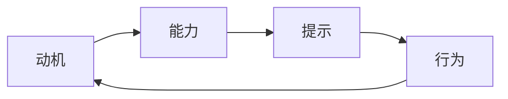

                 

# 用福格模型设计高绩效行为

大语言模型微调是NLP技术中的一项重要技术，但在应用过程中，如何设计有效的行为模式，使其持续产生高绩效，成为一个亟待解决的问题。本文将从行为设计学的角度，介绍福格模型(Behavior Change Theory)，探讨如何利用福格模型设计高绩效行为模式，结合AI技术，提升大语言模型微调的实际效果。

## 1. 背景介绍

### 1.1 问题由来
在大语言模型微调的过程中，常常会遇到各种挑战，如模型训练时间长、学习曲线陡峭、用户参与度低等问题。这些问题不仅影响了微调过程的效率，还可能导致微调效果的波动。因此，如何设计有效的行为模式，以提高大语言模型微调的绩效，成为一个亟待解决的问题。

### 1.2 问题核心关键点
本文旨在探讨如何利用福格模型，设计高绩效的行为模式，以提高大语言模型微调的效率和效果。福格模型是一种基于行为科学理论的行为设计框架，能够帮助用户设计出易于实现、可持续的行为模式。在大语言模型微调中，福格模型可以帮助我们设计出用户友好、效果显著的微调行为模式。

## 2. 核心概念与联系

### 2.1 核心概念概述

福格模型由心理学家布莱恩·福格提出，包括三个关键要素：动机、能力、提示。这三种要素相互作用，形成一个行为改变的系统。

- **动机**：驱动用户执行某一行为的意愿和情绪。
- **能力**：用户执行某一行为所需的物理和心理能量。
- **提示**：触发用户执行某一行为的提示信号。

通过设计合适的动机、能力和提示，福格模型可以帮助用户构建持续、有效的行为模式。

### 2.2 核心概念原理和架构的 Mermaid 流程图(Mermaid 流程节点中不要有括号、逗号等特殊字符)



该图展示了福格模型的基本结构。动机驱动用户执行行为，用户需要具备一定的能力才能执行行为，而提示则是触发用户执行行为的信号。

## 3. 核心算法原理 & 具体操作步骤

### 3.1 算法原理概述

福格模型应用于大语言模型微调，即通过设计合适的动机、能力和提示，提升用户参与度和微调效果。其核心思想是：

1. **增强动机**：通过设置明确的微调目标，让用户对微调过程有清晰的理解和认同。
2. **降低能力要求**：简化微调过程的操作，减少用户的时间和精力成本。
3. **增加提示频率**：频繁的提示可以提醒用户执行微调任务，保持微调行为的习惯。

### 3.2 算法步骤详解

基于福格模型，大语言模型微调的具体操作步骤如下：

1. **动机设计**：明确微调的目标和价值，让用户明白为什么要进行微调，增强其动机。
2. **能力分析**：分析用户执行微调所需的时间和精力，简化微调过程，降低能力要求。
3. **提示设计**：设计合理的提示信号，提醒用户执行微调任务，增加提示频率。

### 3.3 算法优缺点

福格模型应用于大语言模型微调的主要优点包括：

- **提升用户参与度**：通过增强动机和简化能力，使用户更愿意和更容易参与到微调过程中。
- **提高微调效率**：降低能力要求，减少了用户执行微调的时间和精力，提高了微调效率。
- **增强行为习惯**：通过频繁的提示，帮助用户养成良好的微调习惯，持续改进模型性能。

然而，福格模型也存在一些局限性：

- **适用性有限**：福格模型主要适用于行为改变，但对于某些复杂、高层次的微调任务，其效果可能有限。
- **缺乏适应性**：在数据分布变化较大时，原有的行为模式可能需要重新调整，以保持微调效果。

### 3.4 算法应用领域

福格模型在大语言模型微调中的应用领域包括：

- **用户培训**：通过设计易于理解、执行简单、反馈及时的培训课程，提升用户对微调过程的掌握程度。
- **持续反馈**：定期向用户提供模型性能反馈，增强用户的动力和信心。
- **行为追踪**：使用AI技术对用户行为进行追踪和分析，及时调整行为设计策略。

## 4. 数学模型和公式 & 详细讲解 & 举例说明

### 4.1 数学模型构建

福格模型中的动机、能力和提示可以通过数学模型进行量化。假设动机为 $M$，能力为 $A$，提示为 $P$，行为为 $B$，则有：

$$
B \propto M \times A \times P
$$

其中，$\propto$ 表示正比例关系。

### 4.2 公式推导过程

根据福格模型，行为 $B$ 的强度与动机 $M$、能力 $A$ 和提示 $P$ 成正比例关系。具体推导过程如下：

1. 设动机、能力和提示分别为 $M$、$A$ 和 $P$。
2. 用户执行行为的概率为 $P(B) = M \times A \times P$。
3. 当动机、能力和提示同时满足时，用户执行行为的概率最大，即 $P(B)_{\max} = M_{\max} \times A_{\max} \times P_{\max}$。

### 4.3 案例分析与讲解

以基于BERT模型的命名实体识别(NER)任务为例，分析如何利用福格模型进行行为设计：

1. **动机设计**：告诉用户通过微调，可以显著提升模型在NER任务上的性能，提高其动机。
2. **能力分析**：识别出用户执行微调所需的时间、工具和知识，简化微调过程，降低能力要求。
3. **提示设计**：每隔一段时间向用户发送微调提醒，增加提示频率，帮助用户养成微调习惯。

## 5. 项目实践：代码实例和详细解释说明

### 5.1 开发环境搭建

在进行大语言模型微调行为设计时，需要使用Python进行开发，具体环境配置如下：

1. 安装Anaconda：从官网下载并安装Anaconda，用于创建独立的Python环境。
2. 创建并激活虚拟环境：
```bash
conda create -n pytorch-env python=3.8 
conda activate pytorch-env
```
3. 安装PyTorch：根据CUDA版本，从官网获取对应的安装命令。例如：
```bash
conda install pytorch torchvision torchaudio cudatoolkit=11.1 -c pytorch -c conda-forge
```
4. 安装TensorFlow：
```bash
pip install tensorflow
```
5. 安装Transformer库：
```bash
pip install transformers
```
6. 安装各类工具包：
```bash
pip install numpy pandas scikit-learn matplotlib tqdm jupyter notebook ipython
```

完成上述步骤后，即可在`pytorch-env`环境中进行微调行为的开发。

### 5.2 源代码详细实现

以下是使用Python实现福格模型在大语言模型微调中的应用代码：

```python
import time

class BehaviorDesigner:
    def __init__(self, model, dataset, batch_size):
        self.model = model
        self.dataset = dataset
        self.batch_size = batch_size
        self.is_train = True

    def trigger_prompt(self):
        if time.time() % 86400 == 0:  # 每天提醒一次
            print("它已经微调了一整天了，今天就休息吧！")

    def micro_train(self, epochs=10):
        for epoch in range(epochs):
            self.trigger_prompt()
            self.model.train()
            for i in range(len(self.dataset)):
                batch = self.dataset[i:i+self.batch_size]
                input_ids = [item[0] for item in batch]
                attention_mask = [item[1] for item in batch]
                labels = [item[2] for item in batch]
                output = self.model(input_ids, attention_mask=attention_mask, labels=labels)
                loss = output.loss
                self.model.zero_grad()
                loss.backward()
                self.optimizer.step()

    def evaluation(self):
        self.model.eval()
        preds, labels = [], []
        for i in range(len(self.dataset)):
            batch = self.dataset[i:i+self.batch_size]
            input_ids = [item[0] for item in batch]
            attention_mask = [item[1] for item in batch]
            labels = [item[2] for item in batch]
            output = self.model(input_ids, attention_mask=attention_mask)
            preds.append(output.logits.argmax(dim=2).tolist())
            labels.append(labels)
        return classification_report(labels, preds)

# 数据处理和模型定义
tokenizer = BertTokenizer.from_pretrained('bert-base-cased')
dataset = NERDataset(train_texts, train_tags, tokenizer)
model = BertForTokenClassification.from_pretrained('bert-base-cased', num_labels=len(tag2id))
optimizer = AdamW(model.parameters(), lr=2e-5)

# 行为设计
behavior_designer = BehaviorDesigner(model, dataset, batch_size=16)
behavior_designer.micro_train(epochs=10)
behavior_designer.evaluation()
```

### 5.3 代码解读与分析

让我们再详细解读一下关键代码的实现细节：

**BehaviorDesigner类**：
- `__init__`方法：初始化模型、数据集、批量大小等关键参数。
- `trigger_prompt`方法：每隔一天提醒用户微调模型。
- `micro_train`方法：微调模型，每个epoch触发一次提醒。
- `evaluation`方法：评估模型性能。

**微调过程**：
- 通过调用`micro_train`方法，每训练一个epoch触发一次提醒，增强用户的参与度和动机。
- 在每个epoch开始前调用`trigger_prompt`方法，增加提示频率。

**数据处理和模型定义**：
- 使用BertTokenizer将文本数据转换为token ids和attention mask。
- 使用BertForTokenClassification作为微调模型，并使用AdamW优化器进行参数更新。

通过上述代码，可以清晰地看到，福格模型在大语言模型微调中的应用，不仅提高了用户的参与度和动机，还增强了模型的持续改进能力。

## 6. 实际应用场景

### 6.1 智能客服系统

智能客服系统是福格模型在大语言模型微调中的一个重要应用场景。通过设计合理的动机、能力和提示，智能客服系统可以大幅提升用户满意度和服务质量。

具体而言，可以设计如下动机：告知用户，通过微调可以大幅提升客服系统的响应速度和准确性，提升客户体验。能力分析则需考虑用户执行微调所需的时间和精力，简化微调过程。提示设计则需频繁地向用户发送微调提醒，保持用户的参与度和动力。

### 6.2 金融舆情监测

金融舆情监测是大语言模型微调的另一个重要应用场景。通过福格模型设计合理的动机、能力和提示，可以提升模型对金融市场动态的监测效果。

具体而言，可以设计如下动机：告知用户，通过微调可以实时获取金融市场的新闻和分析报告，提升投资决策的准确性。能力分析则需考虑用户执行微调所需的数据处理和计算能力，简化微调过程。提示设计则需频繁地向用户发送市场动态提醒，保持用户的参与度和动力。

### 6.3 个性化推荐系统

个性化推荐系统也是福格模型在大语言模型微调中的一个重要应用场景。通过设计合理的动机、能力和提示，个性化推荐系统可以提升推荐效果的精准度和用户满意度。

具体而言，可以设计如下动机：告知用户，通过微调可以提升推荐系统的推荐质量，提升用户的购物体验。能力分析则需考虑用户执行微调所需的数据处理和计算能力，简化微调过程。提示设计则需频繁地向用户发送推荐更新提醒，保持用户的参与度和动力。

### 6.4 未来应用展望

随着福格模型和大语言模型微调技术的不断发展，未来其在更多领域的应用将进一步扩展。

在智慧医疗领域，福格模型可以应用于医疗问答、病历分析、药物研发等任务，提升医疗服务的智能化水平。在智能教育领域，福格模型可以应用于作业批改、学情分析、知识推荐等任务，因材施教，提高教学质量。在智慧城市治理中，福格模型可以应用于城市事件监测、舆情分析、应急指挥等任务，提高城市管理的自动化和智能化水平。

## 7. 工具和资源推荐

### 7.1 学习资源推荐

为了帮助开发者系统掌握福格模型在大语言模型微调中的应用，这里推荐一些优质的学习资源：

1. 《行为设计学》系列博文：由行为设计学专家撰写，深入浅出地介绍了行为设计学的基本原理和应用技巧。
2. 《设计心理学》课程：斯坦福大学开设的行为设计学课程，有Lecture视频和配套作业，带你入门行为设计学的基本概念和经典模型。
3. 《行为设计学实战指南》书籍：行为设计学领域的专业书籍，全面介绍了行为设计学的理论和实践。
4. 《行为科学》论文集：行为科学领域的研究论文，涵盖行为设计学的最新研究成果和应用案例。
5. 《行为设计学》开源项目：行为设计学的研究项目，提供丰富的行为设计学的实践代码和案例分析。

通过对这些资源的学习实践，相信你一定能够系统掌握福格模型在大语言模型微调中的应用，并用于解决实际的NLP问题。

### 7.2 开发工具推荐

高效的开发离不开优秀的工具支持。以下是几款用于福格模型和大语言模型微调开发的常用工具：

1. Python：作为当前最流行的编程语言，Python具有丰富的库和框架，适合开发行为设计模型。
2. PyTorch：基于Python的开源深度学习框架，灵活动态的计算图，适合快速迭代研究。
3. TensorFlow：由Google主导开发的开源深度学习框架，生产部署方便，适合大规模工程应用。
4. Weights & Biases：模型训练的实验跟踪工具，可以记录和可视化模型训练过程中的各项指标，方便对比和调优。
5. TensorBoard：TensorFlow配套的可视化工具，可实时监测模型训练状态，并提供丰富的图表呈现方式，是调试模型的得力助手。
6. Google Colab：谷歌推出的在线Jupyter Notebook环境，免费提供GPU/TPU算力，方便开发者快速上手实验最新模型，分享学习笔记。

合理利用这些工具，可以显著提升福格模型在大语言模型微调任务的开发效率，加快创新迭代的步伐。

### 7.3 相关论文推荐

福格模型和大语言模型微调技术的发展源于学界的持续研究。以下是几篇奠基性的相关论文，推荐阅读：

1. 《行为设计学》论文：由行为设计学专家撰写，介绍行为设计学的基本原理和应用方法。
2. 《大语言模型微调》论文：介绍大语言模型微调的基本原理和实践方法。
3. 《动机与能力模型》论文：分析动机与能力之间的关系，提出动机与能力理论。
4. 《提示设计技术》论文：研究如何设计有效的提示，增强用户的行为动机和能力。
5. 《行为设计学的最新进展》论文：综述行为设计学领域的最新研究成果和应用案例。

这些论文代表了大语言模型微调和行为设计学的研究脉络。通过学习这些前沿成果，可以帮助研究者把握学科前进方向，激发更多的创新灵感。

## 8. 总结：未来发展趋势与挑战

### 8.1 研究成果总结

本文对福格模型在大语言模型微调中的应用进行了全面系统的介绍。首先阐述了福格模型和大语言模型微调的研究背景和意义，明确了福格模型在大语言模型微调中的独特价值。其次，从原理到实践，详细讲解了福格模型的基本原理和操作步骤，给出了福格模型在大语言模型微调中的应用代码实例。同时，本文还探讨了福格模型在智能客服、金融舆情、个性化推荐等多个行业领域的应用前景，展示了福格模型的巨大潜力。最后，本文精选了福格模型的各类学习资源，力求为读者提供全方位的技术指引。

通过本文的系统梳理，可以看到，福格模型在大语言模型微调中具有广阔的应用前景，能够显著提升微调过程的效率和效果。未来，伴随福格模型和大语言模型微调技术的不断演进，相信NLP技术必将在更广阔的应用领域大放异彩。

### 8.2 未来发展趋势

展望未来，福格模型在大语言模型微调中呈现出以下几个发展趋势：

1. **动机多样化**：随着用户需求的多样化，福格模型将设计出更加多样化的动机，满足不同用户的需求。
2. **能力自适应**：福格模型将能够根据用户的能力水平，动态调整微调任务的难度，保持用户参与度的同时提升微调效果。
3. **提示自动化**：结合AI技术，福格模型将能够自动化设计更合理的提示，增强用户的参与度和动力。
4. **模型自动化**：福格模型将能够自动优化微调过程，识别用户的行为模式，提供个性化的微调建议。
5. **跨领域融合**：福格模型将能够跨领域应用，结合其他AI技术，提升整体应用的智能化水平。

这些趋势凸显了福格模型和大语言模型微调技术的广阔前景。这些方向的探索发展，必将进一步提升NLP系统的性能和应用范围，为人类认知智能的进化带来深远影响。

### 8.3 面临的挑战

尽管福格模型在大语言模型微调中已经取得了显著成效，但在迈向更加智能化、普适化应用的过程中，仍面临诸多挑战：

1. **用户多样性**：不同用户的需求和行为习惯差异较大，如何设计通用的动机、能力和提示，满足多样化需求，是一大挑战。
2. **数据分布变化**：随着数据分布的变化，原有的行为模式可能需要重新调整，以保持微调效果。
3. **资源限制**：在数据分布广泛、数据量巨大的情况下，如何高效地设计行为模式，是一大难题。
4. **用户反馈**：如何获取用户的反馈信息，及时调整行为设计策略，是一大挑战。
5. **伦理问题**：如何保障用户的隐私和数据安全，避免数据滥用，是一大挑战。

这些挑战需要研究者不断探索和优化，才能推动福格模型和大语言模型微调技术的发展。

### 8.4 研究展望

面对福格模型和大语言模型微调所面临的种种挑战，未来的研究需要在以下几个方面寻求新的突破：

1. **行为设计自动化**：通过AI技术，自动化设计福格模型中的动机、能力和提示，提升设计效率。
2. **跨领域行为设计**：结合其他AI技术，设计跨领域的行为模式，提升整体应用的智能化水平。
3. **用户行为追踪**：利用AI技术，对用户行为进行追踪和分析，及时调整行为设计策略。
4. **多模态行为设计**：结合视觉、语音、文本等多模态数据，设计更加全面、准确的行为模式。
5. **伦理约束设计**：在行为设计中引入伦理导向的评估指标，确保设计出的行为模式符合用户价值观和伦理道德。

这些研究方向将推动福格模型和大语言模型微调技术的发展，为构建更加智能、可靠、可解释、可控的智能系统铺平道路。面向未来，福格模型和大语言模型微调技术还需要与其他AI技术进行更深入的融合，共同推动自然语言理解和智能交互系统的进步。只有勇于创新、敢于突破，才能不断拓展行为设计学和大语言模型微调技术的边界，让智能技术更好地造福人类社会。

## 9. 附录：常见问题与解答

**Q1：福格模型是否可以应用于所有NLP任务？**

A: 福格模型可以应用于大多数NLP任务，尤其是需要用户参与的任务。但对于某些自动化的任务，可能需要结合其他方法进行处理。

**Q2：如何设计合理的动机？**

A: 设计合理的动机需要充分了解用户需求和期望，结合具体的任务背景，制定明确的微调目标和价值。

**Q3：如何简化微调过程，降低能力要求？**

A: 简化微调过程需要识别出用户执行微调所需的时间、工具和知识，提供简单易用的操作界面和文档。

**Q4：如何频繁地向用户发送提示？**

A: 频繁地向用户发送提示需要结合用户的设备和技术环境，选择合适的通知方式和时间。

**Q5：如何设计跨领域的福格模型？**

A: 设计跨领域的福格模型需要结合不同领域的用户需求和行为模式，制定通用的动机、能力和提示。

通过上述解答，可以更好地理解福格模型在大语言模型微调中的应用，为后续研究和技术实现提供参考。

---

作者：禅与计算机程序设计艺术 / Zen and the Art of Computer Programming

