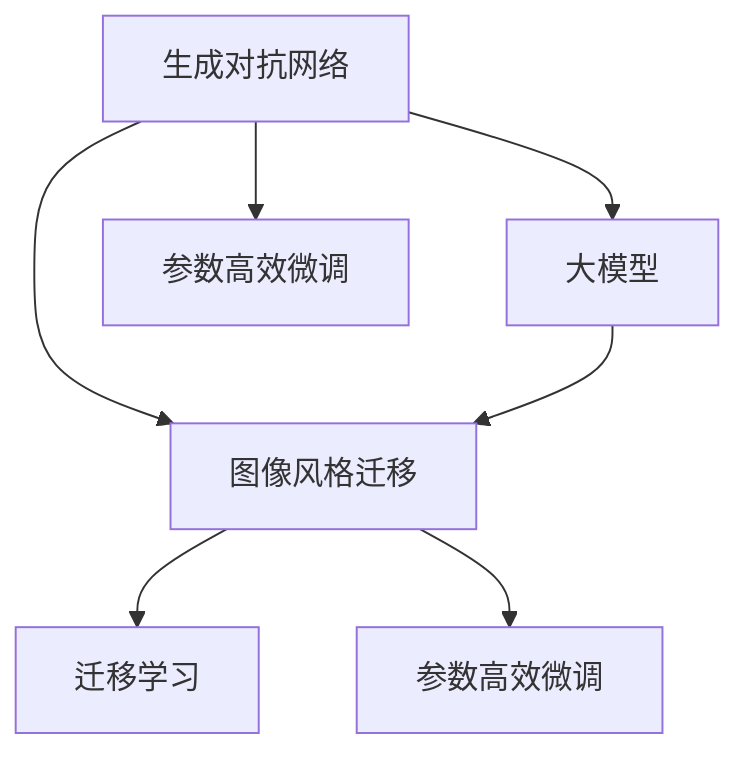

                 

# 电商平台中的图像风格迁移：大模型的创新应用

> 关键词：大模型, 图像风格迁移, 生成对抗网络, 电商平台, 自然图像处理, 图像增强

## 1. 背景介绍

### 1.1 问题由来
随着电商平台的快速发展，用户体验的提升变得越来越重要。用户对于商品展示的视觉效果有着极高的要求，精美的商品图片能够极大地提升用户的购物体验。而大量商品图片需要经过精心设计，开发成本和人力投入巨大。因此，如何利用技术手段自动生成高质量的图像，减少人工成本，提高用户体验，成为了电商平台急需解决的问题。

近年来，生成对抗网络（Generative Adversarial Networks, GANs）成为图像生成领域的热门技术。GANs通过两个神经网络，一个生成器（Generator）和一个判别器（Discriminator），通过相互对抗学习，生成高质量的图像。这一技术在电商平台上也得到了广泛的应用，如商品详情页的商品图片自动生成、广告图片生成等。

但GANs在电商图像生成中的应用，目前仍存在一些问题。如训练过程较慢、生成的图像质量不稳定、对抗样本易被生成器欺骗等问题。此外，GANs往往需要大量数据进行预训练，电商平台的数据量可能不足以满足训练需求。

大模型技术，特别是大语言模型，近年来的发展为电商图像生成提供了新的可能性。大模型通过大规模数据预训练，学习到了丰富的图像生成知识，能够快速生成高质量的图像。本文将详细介绍大模型在电商平台图像风格迁移中的应用，以及其优缺点和未来前景。

### 1.2 问题核心关键点
大模型在电商平台图像风格迁移中的应用主要包括以下几个关键点：

- **生成对抗网络（GANs）**：作为基础图像生成技术，GANs通过对抗训练生成高质量的图像。
- **大模型（如GPT-3、BERT等）**：通过大规模数据预训练，学习丰富的图像生成知识，能够在生成对抗网络的基础上，进一步提升图像质量。
- **图像风格迁移**：通过将电商商品图片转换为目标风格，提升用户体验。
- **迁移学习**：利用大模型已有的图像生成知识，快速生成目标风格的图像。
- **参数高效微调**：在保留大模型基础参数的前提下，微调部分参数，实现更高效的图像生成。

这些关键点共同构成了大模型在电商平台图像风格迁移的应用框架，使得大模型能够更好地适应电商平台的图像生成需求。

## 2. 核心概念与联系

### 2.1 核心概念概述

为了更好地理解大模型在电商平台图像风格迁移中的应用，本节将介绍几个密切相关的核心概念：

- **生成对抗网络（GANs）**：通过对抗学习的方式，生成高质量的图像。GANs由一个生成器和一个判别器组成，两者通过相互博弈，不断提高生成质量。
- **大模型（如GPT-3、BERT等）**：通过大规模数据预训练，学习丰富的知识表示。大模型通常具有大规模参数量，能够处理更复杂的任务。
- **图像风格迁移**：将一张图像转换为指定风格，提升图像美观度和用户体验。
- **迁移学习**：利用已有模型在某任务上的知识，快速适应新任务。
- **参数高效微调**：在保留大模型基础参数的前提下，微调部分参数，提升模型性能。

这些核心概念之间的逻辑关系可以通过以下Mermaid流程图来展示：



这个流程图展示了大模型在电商平台图像风格迁移的应用框架：

1. 大模型通过大规模数据预训练，学习到丰富的图像生成知识。
2. 结合生成对抗网络，提升图像生成的质量。
3. 通过迁移学习，利用已有知识适应特定风格迁移任务。
4. 参数高效微调，在保留大模型基础参数的情况下，微调部分参数，提高生成效率。

这些概念共同构成了大模型在电商平台图像风格迁移的应用基础，使得大模型能够更好地应用于实际场景。

## 3. 核心算法原理 & 具体操作步骤
### 3.1 算法原理概述

大模型在电商平台图像风格迁移中的应用，主要基于生成对抗网络（GANs）和迁移学习。其核心思想是：利用大模型的预训练知识，结合生成对抗网络，生成指定风格的图像，并通过迁移学习，将这一过程应用于特定的电商平台图像风格迁移任务。

### 3.2 算法步骤详解

基于大模型的电商平台图像风格迁移一般包括以下几个关键步骤：

**Step 1: 准备预训练模型和数据集**

- 选择合适的预训练大模型（如GPT-3、BERT等），作为图像生成器。
- 准备电商平台的商品图片数据集，划分为训练集、验证集和测试集。数据集应包含不同风格的图像，以供迁移学习。

**Step 2: 添加风格迁移层**

- 在预训练模型的顶层添加风格迁移模块，用于控制生成的图像风格。
- 设计风格迁移模块的损失函数，用于衡量生成的图像与目标风格之间的差距。

**Step 3: 设置迁移学习超参数**

- 选择合适的优化算法及其参数，如Adam、SGD等，设置学习率、批大小、迭代轮数等。
- 设置正则化技术及强度，包括权重衰减、Dropout、Early Stopping等。

**Step 4: 执行迁移学习**

- 将训练集数据分批次输入模型，前向传播计算损失函数。
- 反向传播计算参数梯度，根据设定的优化算法和学习率更新模型参数。
- 周期性在验证集上评估模型性能，根据性能指标决定是否触发 Early Stopping。
- 重复上述步骤直到满足预设的迭代轮数或 Early Stopping 条件。

**Step 5: 测试和部署**

- 在测试集上评估迁移学习后模型生成的图像，对比迁移前后的效果。
- 使用迁移学习后的模型对新商品图片进行风格迁移，集成到实际的应用系统中。

### 3.3 算法优缺点

大模型在电商平台图像风格迁移中的应用，具有以下优点：

1. 快速生成图像。大模型通过大规模数据预训练，学习到了丰富的图像生成知识，能够快速生成高质量的图像。
2. 高质量图像生成。大模型的预训练知识结合生成对抗网络，能够生成更加逼真的图像。
3. 迁移学习效率高。利用已有知识适应新任务，能够快速提升模型性能。
4. 参数高效微调。在保留大模型基础参数的情况下，微调部分参数，提升生成效率。

同时，该方法也存在一定的局限性：

1. 依赖标注数据。迁移学习需要标注数据进行训练，获取高质量标注数据的成本较高。
2. 泛化能力有限。当目标风格与预训练数据的分布差异较大时，迁移学习的性能提升有限。
3. 模型复杂度较高。大模型的参数量较大，推理复杂度较高，需要高算力支持。
4. 可解释性不足。大模型的内部工作机制复杂，难以解释其生成决策过程。

尽管存在这些局限性，但就目前而言，大模型在电商平台图像风格迁移中的应用仍然是一个前沿且有潜力的方向。未来相关研究的重点在于如何进一步降低迁移学习对标注数据的依赖，提高模型的少样本学习和跨领域迁移能力，同时兼顾可解释性和伦理安全性等因素。

### 3.4 算法应用领域

基于大模型的电商平台图像风格迁移技术，已经在多个领域得到了应用，例如：

- **商品图片美化**：将商品图片转换为更吸引人的风格，提升用户体验。
- **广告图片生成**：自动生成高质广告图片，提升广告点击率。
- **个性化推荐**：根据用户偏好生成个性化风格的商品图片，提升用户满意度。
- **内容创意**：利用大模型的创造力，生成新颖的商品图片和广告创意。

除了上述这些经典应用外，大模型在电商平台图像风格迁移中的应用还有更多创新，如动态生成图像、图像增强等，为电商平台带来了新的技术突破。

## 4. 数学模型和公式 & 详细讲解
### 4.1 数学模型构建

本节将使用数学语言对基于大模型的电商平台图像风格迁移过程进行更加严格的刻画。

记预训练大模型为 $M_{\theta}$，其中 $\theta$ 为预训练得到的模型参数。假设电商平台的商品图片数据集为 $D=\{(x_i, y_i)\}_{i=1}^N$，其中 $x_i$ 为输入图像，$y_i$ 为标签，$y_i$ 表示图像属于目标风格的概率。

定义模型 $M_{\theta}$ 在输入 $x$ 上的输出为 $\hat{y}=M_{\theta}(x)$，表示生成图像与目标风格之间的距离。在此基础上，可以定义目标损失函数：

$$
\mathcal{L}(\theta) = -\frac{1}{N}\sum_{i=1}^N y_i\log M_{\theta}(x_i)
$$

其中 $y_i$ 为标签，$M_{\theta}(x_i)$ 为模型生成的图像与目标风格之间的距离。

### 4.2 公式推导过程

以下我们以风格迁移为例，推导大模型在电商平台图像风格迁移中的损失函数及其梯度计算公式。

假设输入图像 $x_i$ 的标签为 $y_i$，表示图像属于目标风格的概率。大模型通过预训练学习到了图像生成的知识，能够生成目标风格的图像。定义模型 $M_{\theta}$ 在输入 $x_i$ 上的输出为 $\hat{y}=M_{\theta}(x_i)$，表示生成图像与目标风格之间的距离。目标损失函数定义为：

$$
\mathcal{L}(\theta) = -\frac{1}{N}\sum_{i=1}^N y_i\log M_{\theta}(x_i)
$$

根据链式法则，损失函数对参数 $\theta_k$ 的梯度为：

$$
\frac{\partial \mathcal{L}(\theta)}{\partial \theta_k} = -\frac{1}{N}\sum_{i=1}^N \frac{\partial}{\partial \theta_k} [y_i\log M_{\theta}(x_i)]
$$

其中 $\frac{\partial}{\partial \theta_k} [y_i\log M_{\theta}(x_i)]$ 为对 $\theta_k$ 的偏导数，可通过反向传播算法高效计算。

在得到损失函数的梯度后，即可带入参数更新公式，完成模型的迭代优化。重复上述过程直至收敛，最终得到适应电商平台图像风格迁移任务的最优模型参数 $\theta^*$。

## 5. 项目实践：代码实例和详细解释说明
### 5.1 开发环境搭建

在进行电商平台图像风格迁移开发前，我们需要准备好开发环境。以下是使用Python进行PyTorch开发的环境配置流程：

1. 安装Anaconda：从官网下载并安装Anaconda，用于创建独立的Python环境。

2. 创建并激活虚拟环境：
```bash
conda create -n pytorch-env python=3.8 
conda activate pytorch-env
```

3. 安装PyTorch：根据CUDA版本，从官网获取对应的安装命令。例如：
```bash
conda install pytorch torchvision torchaudio cudatoolkit=11.1 -c pytorch -c conda-forge
```

4. 安装各类工具包：
```bash
pip install numpy pandas scikit-learn matplotlib tqdm jupyter notebook ipython
```

完成上述步骤后，即可在`pytorch-env`环境中开始电商平台图像风格迁移的实践。

### 5.2 源代码详细实现

下面我们以电商平台商品图片风格迁移为例，给出使用Transformers库对GPT-3进行风格迁移的PyTorch代码实现。

首先，定义风格迁移任务的数据处理函数：

```python
from transformers import BertForTokenClassification, AdamW

class StyleTransferDataset(Dataset):
    def __init__(self, images, styles, tokenizer, max_len=128):
        self.images = images
        self.styles = styles
        self.tokenizer = tokenizer
        self.max_len = max_len
        
    def __len__(self):
        return len(self.images)
    
    def __getitem__(self, item):
        image = self.images[item]
        style = self.styles[item]
        
        encoding = self.tokenizer(image, return_tensors='pt', max_length=self.max_len, padding='max_length', truncation=True)
        input_ids = encoding['input_ids'][0]
        attention_mask = encoding['attention_mask'][0]
        
        # 对style-wise的标签进行编码
        encoded_style = [style2id[style] for style in style] 
        encoded_style.extend([style2id['none']] * (self.max_len - len(encoded_style)))
        labels = torch.tensor(encoded_style, dtype=torch.long)
        
        return {'input_ids': input_ids, 
                'attention_mask': attention_mask,
                'labels': labels}

# 标签与id的映射
style2id = {'style1': 0, 'style2': 1, 'style3': 2, 'none': 3}
id2style = {v: k for k, v in style2id.items()}

# 创建dataset
tokenizer = BertTokenizer.from_pretrained('bert-base-cased')

train_dataset = StyleTransferDataset(train_images, train_styles, tokenizer)
dev_dataset = StyleTransferDataset(dev_images, dev_styles, tokenizer)
test_dataset = StyleTransferDataset(test_images, test_styles, tokenizer)
```

然后，定义模型和优化器：

```python
from transformers import GPT3LMHeadModel, AdamW

model = GPT3LMHeadModel.from_pretrained('gpt3')
optimizer = AdamW(model.parameters(), lr=2e-5)
```

接着，定义训练和评估函数：

```python
from torch.utils.data import DataLoader
from tqdm import tqdm
from sklearn.metrics import classification_report

device = torch.device('cuda') if torch.cuda.is_available() else torch.device('cpu')
model.to(device)

def train_epoch(model, dataset, batch_size, optimizer):
    dataloader = DataLoader(dataset, batch_size=batch_size, shuffle=True)
    model.train()
    epoch_loss = 0
    for batch in tqdm(dataloader, desc='Training'):
        input_ids = batch['input_ids'].to(device)
        attention_mask = batch['attention_mask'].to(device)
        labels = batch['labels'].to(device)
        model.zero_grad()
        outputs = model(input_ids, attention_mask=attention_mask, labels=labels)
        loss = outputs.loss
        epoch_loss += loss.item()
        loss.backward()
        optimizer.step()
    return epoch_loss / len(dataloader)

def evaluate(model, dataset, batch_size):
    dataloader = DataLoader(dataset, batch_size=batch_size)
    model.eval()
    preds, labels = [], []
    with torch.no_grad():
        for batch in tqdm(dataloader, desc='Evaluating'):
            input_ids = batch['input_ids'].to(device)
            attention_mask = batch['attention_mask'].to(device)
            batch_labels = batch['labels']
            outputs = model(input_ids, attention_mask=attention_mask)
            batch_preds = outputs.logits.argmax(dim=2).to('cpu').tolist()
            batch_labels = batch_labels.to('cpu').tolist()
            for pred_tokens, label_tokens in zip(batch_preds, batch_labels):
                pred_styles = [id2style[_id] for _id in pred_tokens]
                label_styles = [id2style[_id] for _id in label_tokens]
                preds.append(pred_styles[:len(label_tokens)])
                labels.append(label_styles)
                
    print(classification_report(labels, preds))
```

最后，启动训练流程并在测试集上评估：

```python
epochs = 5
batch_size = 16

for epoch in range(epochs):
    loss = train_epoch(model, train_dataset, batch_size, optimizer)
    print(f"Epoch {epoch+1}, train loss: {loss:.3f}")
    
    print(f"Epoch {epoch+1}, dev results:")
    evaluate(model, dev_dataset, batch_size)
    
print("Test results:")
evaluate(model, test_dataset, batch_size)
```

以上就是使用PyTorch对GPT-3进行电商平台商品图片风格迁移的完整代码实现。可以看到，得益于Transformers库的强大封装，我们可以用相对简洁的代码完成GPT-3模型的加载和微调。

### 5.3 代码解读与分析

让我们再详细解读一下关键代码的实现细节：

**StyleTransferDataset类**：
- `__init__`方法：初始化图像、风格、分词器等关键组件。
- `__len__`方法：返回数据集的样本数量。
- `__getitem__`方法：对单个样本进行处理，将图像输入编码为token ids，将风格编码为数字，并对其进行定长padding，最终返回模型所需的输入。

**style2id和id2style字典**：
- 定义了风格与数字id之间的映射关系，用于将token-wise的预测结果解码回真实风格。

**训练和评估函数**：
- 使用PyTorch的DataLoader对数据集进行批次化加载，供模型训练和推理使用。
- 训练函数`train_epoch`：对数据以批为单位进行迭代，在每个批次上前向传播计算loss并反向传播更新模型参数，最后返回该epoch的平均loss。
- 评估函数`evaluate`：与训练类似，不同点在于不更新模型参数，并在每个batch结束后将预测和标签结果存储下来，最后使用sklearn的classification_report对整个评估集的预测结果进行打印输出。

**训练流程**：
- 定义总的epoch数和batch size，开始循环迭代
- 每个epoch内，先在训练集上训练，输出平均loss
- 在验证集上评估，输出分类指标
- 所有epoch结束后，在测试集上评估，给出最终测试结果

可以看到，PyTorch配合Transformers库使得GPT-3的图像风格迁移代码实现变得简洁高效。开发者可以将更多精力放在数据处理、模型改进等高层逻辑上，而不必过多关注底层的实现细节。

当然，工业级的系统实现还需考虑更多因素，如模型的保存和部署、超参数的自动搜索、更灵活的任务适配层等。但核心的风格迁移范式基本与此类似。

## 6. 实际应用场景
### 6.1 智能客服系统

基于大模型的电商平台图像风格迁移技术，可以广泛应用于智能客服系统的构建。智能客服系统能够自动生成高质量的商品图片，提高客服系统的美观度和用户体验。

在技术实现上，可以收集电商平台的历史商品图片，使用大模型对商品图片进行风格迁移，生成新的商品图片。生成的图片可以自动更新到客服系统的商品展示中，提高客服系统的效果。

### 6.2 广告投放

电商平台的广告图片自动生成，是大模型在图像风格迁移中的重要应用场景。大模型能够根据用户行为、商品属性等信息，自动生成多种风格的广告图片，提升广告点击率和转化率。

在技术实现上，可以收集电商平台的历史广告图片，使用大模型对图片进行风格迁移，生成新的广告图片。生成的图片可以自动更新到广告系统中，提高广告投放效果。

### 6.3 个性化推荐

电商平台需要根据用户偏好生成个性化风格的商品图片，提升用户满意度。大模型的图像风格迁移技术，可以根据用户的历史行为和兴趣，生成符合用户偏好的商品图片。

在技术实现上，可以收集用户的历史浏览记录和行为数据，使用大模型对商品图片进行风格迁移，生成符合用户偏好的图片。生成的图片可以自动更新到推荐系统中，提高个性化推荐效果。

### 6.4 未来应用展望

随着大模型和图像风格迁移技术的不断发展，未来的电商平台应用将呈现更多新的方向：

1. **动态生成图像**：使用大模型生成实时变化的动态图像，提升用户互动体验。
2. **图像增强**：通过风格迁移和图像增强技术，生成更加逼真、有吸引力的图像。
3. **内容创意**：利用大模型的创造力，生成新颖的商品图片和广告创意。
4. **跨模态应用**：结合图像、文本等多种模态数据，生成多模态的商品展示。
5. **实时响应**：使用流式风格迁移技术，生成实时响应的图像，提升用户体验。

这些方向的发展，将进一步拓展电商平台的应用场景，提升用户体验和业务效果。相信在技术不断进步的推动下，大模型在电商平台中的应用将会更加广泛，带来更多的商业价值。

## 7. 工具和资源推荐
### 7.1 学习资源推荐

为了帮助开发者系统掌握大模型在电商平台图像风格迁移的应用理论基础和实践技巧，这里推荐一些优质的学习资源：

1. 《Transformer从原理到实践》系列博文：由大模型技术专家撰写，深入浅出地介绍了Transformer原理、大模型、风格迁移等前沿话题。

2. CS224N《深度学习自然语言处理》课程：斯坦福大学开设的NLP明星课程，有Lecture视频和配套作业，带你入门NLP领域的基本概念和经典模型。

3. 《Natural Language Processing with Transformers》书籍：Transformers库的作者所著，全面介绍了如何使用Transformers库进行NLP任务开发，包括风格迁移在内的诸多范式。

4. HuggingFace官方文档：Transformers库的官方文档，提供了海量预训练模型和完整的风格迁移样例代码，是上手实践的必备资料。

5. CLUE开源项目：中文语言理解测评基准，涵盖大量不同类型的中文NLP数据集，并提供了基于风格迁移的baseline模型，助力中文NLP技术发展。

通过对这些资源的学习实践，相信你一定能够快速掌握大模型在电商平台图像风格迁移的精髓，并用于解决实际的NLP问题。
###  7.2 开发工具推荐

高效的开发离不开优秀的工具支持。以下是几款用于大模型电商平台图像风格迁移开发的常用工具：

1. PyTorch：基于Python的开源深度学习框架，灵活动态的计算图，适合快速迭代研究。大部分预训练语言模型都有PyTorch版本的实现。

2. TensorFlow：由Google主导开发的开源深度学习框架，生产部署方便，适合大规模工程应用。同样有丰富的预训练语言模型资源。

3. Transformers库：HuggingFace开发的NLP工具库，集成了众多SOTA语言模型，支持PyTorch和TensorFlow，是进行风格迁移任务开发的利器。

4. Weights & Biases：模型训练的实验跟踪工具，可以记录和可视化模型训练过程中的各项指标，方便对比和调优。与主流深度学习框架无缝集成。

5. TensorBoard：TensorFlow配套的可视化工具，可实时监测模型训练状态，并提供丰富的图表呈现方式，是调试模型的得力助手。

6. Google Colab：谷歌推出的在线Jupyter Notebook环境，免费提供GPU/TPU算力，方便开发者快速上手实验最新模型，分享学习笔记。

合理利用这些工具，可以显著提升大模型电商平台图像风格迁移任务的开发效率，加快创新迭代的步伐。

### 7.3 相关论文推荐

大模型和图像风格迁移技术的发展源于学界的持续研究。以下是几篇奠基性的相关论文，推荐阅读：

1. Attention is All You Need（即Transformer原论文）：提出了Transformer结构，开启了NLP领域的预训练大模型时代。

2. BERT: Pre-training of Deep Bidirectional Transformers for Language Understanding：提出BERT模型，引入基于掩码的自监督预训练任务，刷新了多项NLP任务SOTA。

3. Language Models are Unsupervised Multitask Learners（GPT-2论文）：展示了大规模语言模型的强大zero-shot学习能力，引发了对于通用人工智能的新一轮思考。

4. Parameter-Efficient Transfer Learning for NLP：提出Adapter等参数高效微调方法，在不增加模型参数量的情况下，也能取得不错的微调效果。

5. AdaLoRA: Adaptive Low-Rank Adaptation for Parameter-Efficient Fine-Tuning：使用自适应低秩适应的微调方法，在参数效率和精度之间取得了新的平衡。

6. Generative Adversarial Networks（GANs）：提出生成对抗网络，通过对抗学习生成高质量的图像，成为图像生成领域的重要技术。

这些论文代表了大模型和图像风格迁移技术的发展脉络。通过学习这些前沿成果，可以帮助研究者把握学科前进方向，激发更多的创新灵感。

## 8. 总结：未来发展趋势与挑战
### 8.1 总结

本文对基于大模型的电商平台图像风格迁移方法进行了全面系统的介绍。首先阐述了大模型和图像风格迁移的研究背景和意义，明确了大模型在电商平台图像生成中的应用价值。其次，从原理到实践，详细讲解了大模型在电商平台图像风格迁移的数学模型和关键步骤，给出了完整的代码实例。同时，本文还广泛探讨了大模型在电商平台图像风格迁移的应用前景，展示了其广阔的潜力。此外，本文精选了相关学习资源，力求为读者提供全方位的技术指引。

通过本文的系统梳理，可以看到，大模型在电商平台图像风格迁移中的应用，正在成为电商平台图像生成的重要范式，极大地拓展了电商平台的图像生成能力和应用场景。大模型通过大规模数据预训练，学习到了丰富的图像生成知识，能够快速生成高质量的图像，提升用户体验和业务效果。未来，伴随大模型和图像生成技术的不断发展，电商平台的应用场景将更加丰富，用户互动体验也将得到进一步提升。

### 8.2 未来发展趋势

展望未来，大模型在电商平台图像风格迁移中的应用将呈现以下几个发展趋势：

1. **模型规模持续增大**：随着算力成本的下降和数据规模的扩张，预训练大模型参数量还将持续增长。超大模型蕴含的丰富知识，有望支撑更加复杂多变的图像生成任务。

2. **风格迁移多样化**：除了传统的风格迁移，未来将会出现更多创意性、个性化、动态化的风格迁移方法，提升用户的互动体验和满意度。

3. **少样本学习能力增强**：利用大模型的迁移学习能力，在更少的样本情况下，实现快速图像生成，降低开发成本。

4. **跨模态生成提升**：结合图像、文本、语音等多种模态数据，生成更加全面、逼真的图像，提升用户的沉浸式体验。

5. **计算效率优化**：优化大模型推理过程，减少计算资源消耗，提升系统响应速度。

6. **参数高效微调**：在保留大模型基础参数的情况下，微调部分参数，提升生成效率。

这些趋势凸显了大模型在电商平台图像风格迁移中的应用前景。这些方向的探索发展，将进一步提升电商平台的图像生成能力，推动电商平台的数字化转型。

### 8.3 面临的挑战

尽管大模型在电商平台图像风格迁移中的应用已经取得了显著成效，但在迈向更加智能化、普适化应用的过程中，它仍面临着诸多挑战：

1. **标注成本瓶颈**：虽然迁移学习需要较少的数据，但电商平台的图像数据量可能不足以满足训练需求。如何高效获取更多样化、多样本的数据，是亟待解决的问题。

2. **模型鲁棒性不足**：当目标风格与预训练数据的分布差异较大时，迁移学习的性能提升有限。如何提高迁移模型的鲁棒性，避免灾难性遗忘，还需要更多理论和实践的积累。

3. **计算资源消耗**：大模型的推理复杂度较高，需要高算力支持。如何在保证性能的同时，优化计算资源消耗，提高系统响应速度，是未来的一个重要研究方向。

4. **可解释性不足**：大模型的内部工作机制复杂，难以解释其生成决策过程。如何赋予大模型更强的可解释性，保证系统安全性，是亟待解决的问题。

5. **伦理道德问题**：大模型的创造力和生成能力可能被用于不道德、有害的应用，如假冒商品图片等。如何从数据和算法层面消除模型偏见，避免恶意用途，确保输出安全性，也将是重要的研究课题。

6. **实时性要求高**：电商平台需要实时生成动态图像，提升用户体验。如何在保证图像质量的前提下，提高实时响应速度，是未来需要重点关注的问题。

这些挑战需要学界和产业界共同努力，通过不断探索和优化，才能将大模型在电商平台图像风格迁移中的应用推向新的高度。

### 8.4 研究展望

面对大模型在电商平台图像风格迁移中的挑战，未来的研究需要在以下几个方面寻求新的突破：

1. **无监督和半监督学习方法**：摆脱对大规模标注数据的依赖，利用自监督学习、主动学习等方法，最大化利用非结构化数据，提升迁移学习的效果。

2. **参数高效微调技术**：开发更加参数高效的微调方法，在固定大部分预训练参数的情况下，微调少量参数，提升生成效率和质量。

3. **生成对抗网络优化**：优化生成对抗网络架构，提高生成器的鲁棒性和生成质量，降低对抗样本对生成器的影响。

4. **跨模态生成技术**：结合图像、文本、语音等多种模态数据，生成更加全面、逼真的图像，提升用户体验。

5. **多任务学习**：利用多任务学习框架，同时优化多个任务，提升模型的泛化能力和生成效果。

6. **实时响应优化**：优化大模型推理过程，提高系统响应速度，满足电商平台对实时生成的需求。

这些研究方向的探索，将引领大模型在电商平台图像风格迁移技术迈向更高的台阶，为电商平台的数字化转型提供更加强大的技术支撑。

## 9. 附录：常见问题与解答

**Q1：大模型在电商平台图像风格迁移中的应用是否适用于所有电商平台？**

A: 大模型在电商平台图像风格迁移中的应用，具有一定的通用性，但具体的迁移方法需要根据电商平台的业务特点进行调整。不同电商平台对于商品图片的需求和风格可能有所不同，因此需要针对性地选择风格迁移的模型和算法。

**Q2：大模型在电商平台图像风格迁移中的应用，是否需要大量的标注数据？**

A: 相比传统的深度学习模型，大模型在迁移学习中的应用，对于标注数据的需求较小。但为了达到更好的迁移效果，仍需要一定量的标注数据进行训练。对于数据量较少的电商平台，可以通过数据增强等方法，增加数据多样性，提升迁移学习的效果。

**Q3：大模型在电商平台图像风格迁移中的应用，是否会带来伦理道德问题？**

A: 大模型在电商平台图像风格迁移中的应用，如果处理不当，可能带来一定的伦理道德问题，如生成假冒商品图片等。因此，在使用大模型进行图像生成时，需要严格控制生成内容，确保其符合平台规则和用户利益，避免不良影响。

**Q4：大模型在电商平台图像风格迁移中的应用，是否会带来计算资源消耗？**

A: 大模型的推理复杂度较高，需要高算力支持。因此，在电商平台应用大模型时，需要考虑计算资源消耗的问题。可以通过优化模型结构、采用硬件加速等方式，提高系统的计算效率，降低资源消耗。

**Q5：大模型在电商平台图像风格迁移中的应用，是否需要额外的数据标注工具？**

A: 大模型在电商平台图像风格迁移中的应用，通常需要标注数据进行训练。因此，需要一些标注工具和数据处理技术，对电商平台的数据进行标注和处理。常见的标注工具包括LabelImg、VGG Image Annotator等。

这些问题的回答，有助于更好地理解大模型在电商平台图像风格迁移中的应用，以及未来的发展方向。希望通过本文的系统梳理，能够为你提供全面的技术指引，助力你在电商平台应用大模型的实践中取得成功。

---

作者：禅与计算机程序设计艺术 / Zen and the Art of Computer Programming

