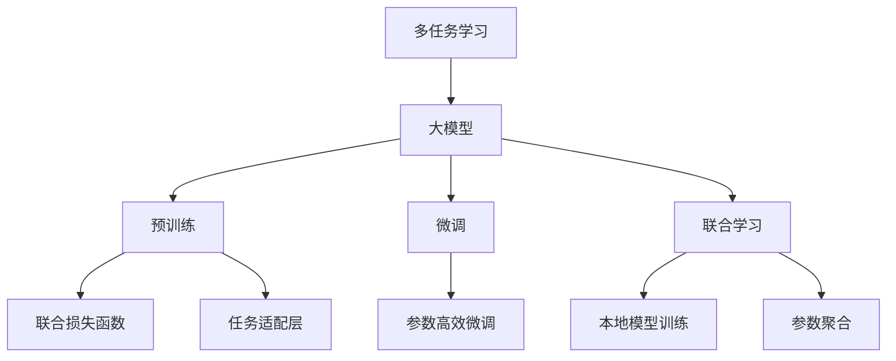

                 

# 电商平台中的多任务学习：大模型解决方案

## 1. 背景介绍

### 1.1 问题由来

随着电子商务平台的飞速发展，如何精准预测用户行为、提升推荐系统效果、优化广告投放策略，成为电商企业亟需解决的痛点。传统的机器学习算法往往单一任务为单位进行建模，难以充分利用用户数据中的多维信息。而多任务学习(Multitask Learning, MTL)作为一种新兴的技术，能够整合多源任务之间的共性信息，最大化利用用户数据，提升模型效果。

多任务学习在电商领域的典型应用场景包括：

- **用户行为预测**：预测用户点击、购买、流失等行为，为用户提供个性化推荐。
- **商品推荐**：利用用户浏览历史、点击行为、评论反馈等数据，推荐用户可能感兴趣的商品。
- **广告投放优化**：根据用户兴趣、行为、地理位置等特征，优化广告投放策略，提升广告效果和ROI。

### 1.2 问题核心关键点

多任务学习通过共享知识库的方式，将多个相关任务的模型同时进行训练，以达到更好的泛化能力和泛化效率。具体来说，多任务学习在电商平台中的核心关键点包括：

- **数据多源性**：电商平台的各个模块和场景中，如推荐系统、广告系统、搜索系统等，都存在大量的数据源，可以用于训练多任务模型。
- **模型共享性**：多任务模型共享特征提取器和低层参数，通过特征共享减少冗余信息，提升模型性能。
- **任务关联性**：各个任务之间可能存在一定的关联性，如用户浏览行为可能影响其购买决策，利用这种关联性提升模型泛化能力。
- **损失函数设计**：多任务学习需要设计联合损失函数，以平衡不同任务之间的权重和贡献，避免一个任务主导另一个任务的情况发生。

### 1.3 问题研究意义

研究电商平台中的多任务学习，对电商企业的智能化转型和竞争力的提升具有重要意义：

- **提升用户体验**：通过个性化推荐和精准预测，提高用户满意度和留存率。
- **优化广告效果**：通过联合优化多源数据，提高广告投放的精准性和效果。
- **数据高效利用**：多任务学习能够充分利用电商平台中的多种数据源，提升数据利用率和模型效果。
- **加速创新迭代**：多任务学习框架支持快速构建和迭代多种模型，加速电商平台的业务创新和迭代。
- **支撑生态系统**：多任务学习能够构建更加复杂的业务生态系统，增强电商平台的竞争力。

## 2. 核心概念与联系

### 2.1 核心概念概述

为更好地理解电商平台中的多任务学习，本节将介绍几个密切相关的核心概念：

- **多任务学习**：在多个相关任务上同时训练模型，通过共享知识库提升模型泛化能力。多任务学习包括有监督、无监督、半监督等多种形式。
- **大模型**：指具有亿级参数规模的预训练语言模型，如BERT、GPT等。大模型通过在海量数据上进行预训练，学习到丰富的语言表示，能够支持多种NLP任务。
- **预训练**：指在大规模无标签文本语料上进行自监督学习任务训练语言模型的过程。预训练使得模型学习到语言的通用表示。
- **微调(Fine-tuning)**：指在预训练模型的基础上，使用下游任务的少量标注数据，通过有监督学习优化模型在该任务上的性能。
- **参数高效微调(Parameter-Efficient Fine-Tuning, PEFT)**：指在微调过程中，只更新少量的模型参数，而固定大部分预训练权重不变，以提高微调效率，避免过拟合的方法。
- **联合学习(Federated Learning)**：指多个设备或客户端本地训练模型，并将本地模型参数汇总更新，以协同优化模型参数的方法。

这些核心概念之间的逻辑关系可以通过以下Mermaid流程图来展示：



这个流程图展示了大模型在多任务学习中的核心概念及其之间的关系：

1. 多任务学习通过共享知识库的方式，利用大模型的预训练特征进行多个相关任务的联合优化。
2. 大模型通过预训练学习到通用的语言表示，可用于多源任务的微调。
3. 联合学习指多个客户端或设备本地训练模型，通过参数聚合进行全局优化。
4. 预训练与微调相结合，能够利用大模型的广泛知识进行多任务学习，提升模型效果。
5. 任务适配层和联合损失函数，为多任务学习提供更加灵活和高效的实现方式。

这些概念共同构成了大模型在电商平台中多任务学习的基本框架，使得多任务学习能够在电商平台上广泛应用。

## 3. 核心算法原理 & 具体操作步骤
### 3.1 算法原理概述

多任务学习的大模型解决方案，通过联合优化多个相关任务的目标函数，共享预训练模型的低层参数，以提升模型泛化能力和泛化效率。假设多任务学习中的任务数为 $K$，任务 $i$ 的训练样本为 $D_i$，对应的任务损失函数为 $\ell_i(\theta)$，其中 $\theta$ 为模型的参数向量。多任务学习的优化目标为：

$$
\min_{\theta} \sum_{i=1}^K \lambda_i \ell_i(\theta)
$$

其中 $\lambda_i$ 为任务 $i$ 的权重系数，用于平衡不同任务的重要性。在电商平台的实际应用中，常见的联合损失函数设计包括：

- **独立联合学习(Independent Joint Training)**：每个任务独立训练，但共享预训练模型的低层参数。每个任务的目标函数为 $\ell_i(\theta) = \frac{1}{N_i} \sum_{x,y \in D_i} L_i(M_{\theta}(x),y)$。
- **共享联合学习(Shared Joint Training)**：共享预训练模型的所有层，通过联合优化所有任务的目标函数。每个任务的目标函数为 $\ell_i(\theta) = \frac{1}{N_i} \sum_{x,y \in D_i} L_i(M_{\theta}(x),y)$。

### 3.2 算法步骤详解

基于多任务学习的大模型解决方案，通常包括以下几个关键步骤：

**Step 1: 准备预训练模型和数据集**
- 选择合适的预训练语言模型 $M_{\theta}$ 作为初始化参数，如 BERT、GPT等。
- 准备电商平台中的多个相关任务的训练集，包括用户行为、商品推荐、广告投放等，划分为训练集、验证集和测试集。

**Step 2: 定义任务适配层**
- 根据具体任务，设计合适的任务适配层，如全连接层、注意力机制等，用于连接预训练模型的顶层和任务特定输出。
- 对于分类任务，通常在顶层添加线性分类器和交叉熵损失函数。
- 对于生成任务，通常使用语言模型的解码器输出概率分布，并以负对数似然为损失函数。

**Step 3: 设置联合学习超参数**
- 选择合适的优化算法及其参数，如 AdamW、SGD 等，设置学习率、批大小、迭代轮数等。
- 设置任务之间的权重系数，平衡不同任务的重要性。
- 设置联合损失函数的参数，如不同任务的目标函数比例。

**Step 4: 执行联合训练**
- 将各个任务的训练样本分批次输入模型，前向传播计算联合损失函数。
- 反向传播计算参数梯度，根据设定的优化算法和学习率更新模型参数。
- 周期性在验证集上评估模型性能，根据性能指标决定是否触发 Early Stopping。
- 重复上述步骤直到满足预设的迭代轮数或 Early Stopping 条件。

**Step 5: 测试和部署**
- 在测试集上评估联合训练后模型 $M_{\hat{\theta}}$ 的性能，对比联合训练前后的精度提升。
- 使用联合训练后的模型对新样本进行推理预测，集成到实际的应用系统中。
- 持续收集新的数据，定期重新联合训练模型，以适应数据分布的变化。

以上是基于多任务学习的大模型解决方案的一般流程。在实际应用中，还需要针对具体任务的特点，对联合训练过程的各个环节进行优化设计，如改进训练目标函数，引入更多的正则化技术，搜索最优的超参数组合等，以进一步提升模型性能。

### 3.3 算法优缺点

基于多任务学习的大模型解决方案，具有以下优点：

1. **数据高效利用**：多任务学习能够充分利用电商平台中的多种数据源，提升数据利用率和模型效果。
2. **模型泛化能力强**：通过共享知识库，多任务学习模型在多个相关任务上都能取得不错的性能。
3. **快速迭代优化**：多任务学习框架支持快速构建和迭代多种模型，加速电商平台的业务创新和迭代。
4. **提升业务价值**：通过联合优化多个任务，提升推荐系统、广告投放等业务的综合性能，实现业务价值的最大化。

同时，该方法也存在一定的局限性：

1. **数据质量和一致性要求高**：多任务学习需要多个相关任务的数据质量和分布一致，否则模型的效果可能受到负面影响。
2. **模型复杂度增加**：多任务学习模型的参数量可能较大，模型训练和推理的计算资源需求增加。
3. **任务关联性处理复杂**：不同任务之间的关联性处理复杂，需要考虑如何平衡不同任务的目标函数，避免一个任务主导另一个任务的情况发生。
4. **模型解释性不足**：多任务学习模型较为复杂，难以解释其内部工作机制和决策逻辑。
5. **伦理和安全性问题**：电商平台的业务数据涉及用户隐私，多任务学习模型需要考虑数据隐私保护和伦理安全问题。

尽管存在这些局限性，但就目前而言，多任务学习的大模型解决方案仍然是最主流的多任务学习范式。未来相关研究的重点在于如何进一步降低模型复杂度，提高数据一致性和模型的可解释性，同时兼顾隐私保护和安全性等因素。

### 3.4 算法应用领域

基于大模型解决方案的多任务学习，在电商平台的各个场景中都有广泛的应用，例如：

- **个性化推荐系统**：利用用户行为、商品评价、广告点击等多源数据，联合优化推荐模型，提高推荐效果。
- **广告投放优化**：结合用户兴趣、行为、地理位置等特征，联合优化广告投放策略，提升广告效果和ROI。
- **库存管理**：通过预测用户购买行为，联合优化库存管理策略，提高库存周转率和销售额。
- **客户服务**：结合用户反馈和聊天记录，联合优化客户服务系统，提升客户满意度和留存率。
- **市场分析**：通过多任务联合分析，预测市场趋势和用户需求变化，支持企业决策制定。

除了上述这些经典应用外，多任务学习在电商平台的创新应用中，如商品图像分类、用户画像构建、价格预测等，也在不断涌现，为电商平台的智能化转型提供新的技术路径。

## 4. 数学模型和公式 & 详细讲解 & 举例说明
### 4.1 数学模型构建

本节将使用数学语言对基于多任务学习的大模型解决方案进行更加严格的刻画。

记多任务学习中的预训练语言模型为 $M_{\theta}$，其中 $\theta$ 为预训练得到的模型参数。假设电商平台中的 $K$ 个任务分别为 $T_1, T_2, \ldots, T_K$，对应的训练集为 $D_i=\{(x_{i,j},y_{i,j})\}_{j=1}^{N_i}, x_{i,j} \in \mathcal{X}_i, y_{i,j} \in \mathcal{Y}_i$。多任务学习的优化目标为：

$$
\min_{\theta} \sum_{i=1}^K \lambda_i \ell_i(\theta)
$$

其中 $\ell_i(\theta)$ 为任务 $i$ 的损失函数，$\lambda_i$ 为任务 $i$ 的权重系数。常见的损失函数包括交叉熵损失、均方误差损失等。

在实践中，我们通常使用基于梯度的优化算法（如AdamW、SGD等）来近似求解上述最优化问题。设 $\eta$ 为学习率，$\lambda$ 为正则化系数，则参数的更新公式为：

$$
\theta \leftarrow \theta - \eta \nabla_{\theta}\mathcal{L}(\theta) - \eta\lambda\theta
$$

其中 $\nabla_{\theta}\mathcal{L}(\theta)$ 为联合损失函数对参数 $\theta$ 的梯度，可通过反向传播算法高效计算。

### 4.2 公式推导过程

以下我们以电商平台的商品推荐任务为例，推导多任务联合损失函数及其梯度的计算公式。

假设商品推荐任务的目标是预测用户对每个商品 $x_j$ 的购买概率 $p_j$，真实标签 $y_{i,j} \in \{0,1\}$。使用多任务学习模型 $M_{\theta}$ 对商品 $x_j$ 进行预测，输出概率分布 $\hat{p}_j = M_{\theta}(x_j)$。多任务联合损失函数定义为：

$$
\ell(\theta) = \sum_{i=1}^K \lambda_i \sum_{j=1}^{N_i} [y_{i,j}\log \hat{p}_j + (1-y_{i,j})\log (1-\hat{p}_j)]
$$

将其代入联合优化目标，得：

$$
\min_{\theta} \sum_{i=1}^K \lambda_i \sum_{j=1}^{N_i} [y_{i,j}\log \hat{p}_j + (1-y_{i,j})\log (1-\hat{p}_j)]
$$

根据链式法则，联合损失函数对参数 $\theta_k$ 的梯度为：

$$
\frac{\partial \ell(\theta)}{\partial \theta_k} = \sum_{i=1}^K \lambda_i \sum_{j=1}^{N_i} \frac{\partial \ell_i(\theta)}{\partial \theta_k}
$$

其中 $\frac{\partial \ell_i(\theta)}{\partial \theta_k}$ 可进一步递归展开，利用自动微分技术完成计算。

在得到联合损失函数的梯度后，即可带入参数更新公式，完成模型的迭代优化。重复上述过程直至收敛，最终得到适应电商平台多任务联合训练的最优模型参数 $\theta^*$。

## 5. 项目实践：代码实例和详细解释说明
### 5.1 开发环境搭建

在进行多任务学习实践前，我们需要准备好开发环境。以下是使用Python进行PyTorch开发的环境配置流程：

1. 安装Anaconda：从官网下载并安装Anaconda，用于创建独立的Python环境。

2. 创建并激活虚拟环境：
```bash
conda create -n pytorch-env python=3.8 
conda activate pytorch-env
```

3. 安装PyTorch：根据CUDA版本，从官网获取对应的安装命令。例如：
```bash
conda install pytorch torchvision torchaudio cudatoolkit=11.1 -c pytorch -c conda-forge
```

4. 安装Transformers库：
```bash
pip install transformers
```

5. 安装各类工具包：
```bash
pip install numpy pandas scikit-learn matplotlib tqdm jupyter notebook ipython
```

完成上述步骤后，即可在`pytorch-env`环境中开始多任务学习实践。

### 5.2 源代码详细实现

下面我们以电商平台中的商品推荐任务为例，给出使用Transformers库对BERT模型进行多任务学习的PyTorch代码实现。

首先，定义商品推荐任务的数据处理函数：

```python
from transformers import BertTokenizer
from torch.utils.data import Dataset
import torch

class RecommendationDataset(Dataset):
    def __init__(self, user_ids, item_ids, labels, tokenizer, max_len=128):
        self.user_ids = user_ids
        self.item_ids = item_ids
        self.labels = labels
        self.tokenizer = tokenizer
        self.max_len = max_len
        
    def __len__(self):
        return len(self.user_ids)
    
    def __getitem__(self, item):
        user_id = self.user_ids[item]
        item_id = self.item_ids[item]
        label = self.labels[item]
        
        encoding = self.tokenizer(user_id, item_id, return_tensors='pt', max_length=self.max_len, padding='max_length', truncation=True)
        input_ids = encoding['input_ids'][0]
        attention_mask = encoding['attention_mask'][0]
        return {'user_id': user_id, 
                'item_id': item_id,
                'labels': label,
                'input_ids': input_ids, 
                'attention_mask': attention_mask}
```

然后，定义模型和优化器：

```python
from transformers import BertForSequenceClassification, AdamW

model = BertForSequenceClassification.from_pretrained('bert-base-cased', num_labels=2)

optimizer = AdamW(model.parameters(), lr=2e-5)
```

接着，定义训练和评估函数：

```python
from torch.utils.data import DataLoader
from tqdm import tqdm
from sklearn.metrics import classification_report

device = torch.device('cuda') if torch.cuda.is_available() else torch.device('cpu')
model.to(device)

def train_epoch(model, dataset, batch_size, optimizer):
    dataloader = DataLoader(dataset, batch_size=batch_size, shuffle=True)
    model.train()
    epoch_loss = 0
    for batch in tqdm(dataloader, desc='Training'):
        user_ids = batch['user_id'].to(device)
        item_ids = batch['item_id'].to(device)
        labels = batch['labels'].to(device)
        model.zero_grad()
        outputs = model(user_ids, item_ids)
        loss = outputs.loss
        epoch_loss += loss.item()
        loss.backward()
        optimizer.step()
    return epoch_loss / len(dataloader)

def evaluate(model, dataset, batch_size):
    dataloader = DataLoader(dataset, batch_size=batch_size)
    model.eval()
    preds, labels = [], []
    with torch.no_grad():
        for batch in tqdm(dataloader, desc='Evaluating'):
            user_ids = batch['user_id'].to(device)
            item_ids = batch['item_id'].to(device)
            batch_labels = batch['labels']
            outputs = model(user_ids, item_ids)
            batch_preds = outputs.logits.argmax(dim=1).to('cpu').tolist()
            batch_labels = batch_labels.to('cpu').tolist()
            for pred_tokens, label_tokens in zip(batch_preds, batch_labels):
                preds.append(pred_tokens)
                labels.append(label_tokens)
                
    print(classification_report(labels, preds))
```

最后，启动训练流程并在测试集上评估：

```python
epochs = 5
batch_size = 16

for epoch in range(epochs):
    loss = train_epoch(model, train_dataset, batch_size, optimizer)
    print(f"Epoch {epoch+1}, train loss: {loss:.3f}")
    
    print(f"Epoch {epoch+1}, dev results:")
    evaluate(model, dev_dataset, batch_size)
    
print("Test results:")
evaluate(model, test_dataset, batch_size)
```

以上就是使用PyTorch对BERT进行商品推荐任务的多任务学习的完整代码实现。可以看到，得益于Transformers库的强大封装，我们可以用相对简洁的代码完成BERT模型的多任务学习。

### 5.3 代码解读与分析

让我们再详细解读一下关键代码的实现细节：

**RecommendationDataset类**：
- `__init__`方法：初始化用户ID、商品ID、标签等关键组件。
- `__len__`方法：返回数据集的样本数量。
- `__getitem__`方法：对单个样本进行处理，将用户ID和商品ID输入编码为token ids，同时输出标签，并进行定长padding。

**模型和优化器定义**：
- 使用PyTorch的BertForSequenceClassification定义序列分类模型，用于预测用户对商品的购买意愿。
- 选择AdamW优化器，设置学习率为2e-5。

**训练和评估函数**：
- 使用PyTorch的DataLoader对数据集进行批次化加载，供模型训练和推理使用。
- 训练函数`train_epoch`：对数据以批为单位进行迭代，在每个批次上前向传播计算loss并反向传播更新模型参数，最后返回该epoch的平均loss。
- 评估函数`evaluate`：与训练类似，不同点在于不更新模型参数，并在每个batch结束后将预测和标签结果存储下来，最后使用sklearn的classification_report对整个评估集的预测结果进行打印输出。

**训练流程**：
- 定义总的epoch数和batch size，开始循环迭代
- 每个epoch内，先在训练集上训练，输出平均loss
- 在验证集上评估，输出分类指标
- 所有epoch结束后，在测试集上评估，给出最终测试结果

可以看到，PyTorch配合Transformers库使得BERT的多任务学习代码实现变得简洁高效。开发者可以将更多精力放在数据处理、模型改进等高层逻辑上，而不必过多关注底层的实现细节。

当然，工业级的系统实现还需考虑更多因素，如模型的保存和部署、超参数的自动搜索、更灵活的任务适配层等。但核心的多任务学习范式基本与此类似。

## 6. 实际应用场景
### 6.1 智能客服系统

基于大模型解决方案的多任务学习，可以广泛应用于智能客服系统的构建。传统客服往往需要配备大量人力，高峰期响应缓慢，且一致性和专业性难以保证。而使用多任务学习训练的多任务模型，可以7x24小时不间断服务，快速响应客户咨询，用自然流畅的语言解答各类常见问题。

在技术实现上，可以收集企业内部的历史客服对话记录，将问题和最佳答复构建成监督数据，在此基础上对预训练多任务模型进行联合优化。多任务模型能够自动理解用户意图，匹配最合适的答案模板进行回复。对于客户提出的新问题，还可以接入检索系统实时搜索相关内容，动态组织生成回答。如此构建的智能客服系统，能大幅提升客户咨询体验和问题解决效率。

### 6.2 金融舆情监测

金融机构需要实时监测市场舆论动向，以便及时应对负面信息传播，规避金融风险。传统的人工监测方式成本高、效率低，难以应对网络时代海量信息爆发的挑战。基于大模型解决方案的多任务学习技术，为金融舆情监测提供了新的解决方案。

具体而言，可以收集金融领域相关的新闻、报道、评论等文本数据，并对其进行主题标注和情感标注。在此基础上对预训练语言模型进行联合优化，使其能够自动判断文本属于何种主题，情感倾向是正面、中性还是负面。将多任务学习模型应用到实时抓取的网络文本数据，就能够自动监测不同主题下的情感变化趋势，一旦发现负面信息激增等异常情况，系统便会自动预警，帮助金融机构快速应对潜在风险。

### 6.3 个性化推荐系统

当前的推荐系统往往只依赖用户的历史行为数据进行物品推荐，无法深入理解用户的真实兴趣偏好。基于多任务学习的大模型解决方案，个性化推荐系统可以更好地挖掘用户行为背后的语义信息，从而提供更精准、多样的推荐内容。

在实践中，可以收集用户浏览、点击、评论、分享等行为数据，提取和用户交互的物品标题、描述、标签等文本内容。将文本内容作为模型输入，用户的后续行为（如是否点击、购买等）作为监督信号，在此基础上联合优化预训练语言模型。多任务学习模型能够从文本内容中准确把握用户的兴趣点。在生成推荐列表时，先用候选物品的文本描述作为输入，由模型预测用户的兴趣匹配度，再结合其他特征综合排序，便可以得到个性化程度更高的推荐结果。

### 6.4 未来应用展望

随着多任务学习和大模型技术的发展，多任务学习在电商平台的落地应用前景广阔。

在智慧医疗领域，基于多任务学习的大模型解决方案可以为医学影像分析、疾病预测、药品推荐等提供支持，提升医疗服务的智能化水平，辅助医生诊疗，加速新药开发进程。

在智能教育领域，多任务学习技术可应用于作业批改、学情分析、知识推荐等方面，因材施教，促进教育公平，提高教学质量。

在智慧城市治理中，多任务学习模型可应用于城市事件监测、舆情分析、应急指挥等环节，提高城市管理的自动化和智能化水平，构建更安全、高效的未来城市。

此外，在企业生产、社会治理、文娱传媒等众多领域，基于多任务学习的大模型解决方案也将不断涌现，为经济社会发展注入新的动力。相信随着技术的日益成熟，多任务学习将成为电商平台的智能化转型和竞争力的重要支撑，推动电商平台的业务创新和创新。

## 7. 工具和资源推荐
### 7.1 学习资源推荐

为了帮助开发者系统掌握多任务学习和大模型技术的理论基础和实践技巧，这里推荐一些优质的学习资源：

1. 《Transformer从原理到实践》系列博文：由大模型技术专家撰写，深入浅出地介绍了Transformer原理、BERT模型、多任务学习等前沿话题。

2. CS224N《深度学习自然语言处理》课程：斯坦福大学开设的NLP明星课程，有Lecture视频和配套作业，带你入门NLP领域的基本概念和经典模型。

3. 《Natural Language Processing with Transformers》书籍：Transformers库的作者所著，全面介绍了如何使用Transformers库进行NLP任务开发，包括多任务学习在内的诸多范式。

4. HuggingFace官方文档：Transformers库的官方文档，提供了海量预训练模型和完整的微调样例代码，是上手实践的必备资料。

5. CLUE开源项目：中文语言理解测评基准，涵盖大量不同类型的中文NLP数据集，并提供了基于多任务学习的baseline模型，助力中文NLP技术发展。

通过对这些资源的学习实践，相信你一定能够快速掌握多任务学习和大模型的精髓，并用于解决实际的NLP问题。
###  7.2 开发工具推荐

高效的开发离不开优秀的工具支持。以下是几款用于多任务学习和大模型开发的常用工具：

1. PyTorch：基于Python的开源深度学习框架，灵活动态的计算图，适合快速迭代研究。大部分预训练语言模型都有PyTorch版本的实现。

2. TensorFlow：由Google主导开发的开源深度学习框架，生产部署方便，适合大规模工程应用。同样有丰富的预训练语言模型资源。

3. Transformers库：HuggingFace开发的NLP工具库，集成了众多SOTA语言模型，支持PyTorch和TensorFlow，是进行多任务学习和大模型开发的利器。

4. Weights & Biases：模型训练的实验跟踪工具，可以记录和可视化模型训练过程中的各项指标，方便对比和调优。与主流深度学习框架无缝集成。

5. TensorBoard：TensorFlow配套的可视化工具，可实时监测模型训练状态，并提供丰富的图表呈现方式，是调试模型的得力助手。

6. Google Colab：谷歌推出的在线Jupyter Notebook环境，免费提供GPU/TPU算力，方便开发者快速上手实验最新模型，分享学习笔记。

合理利用这些工具，可以显著提升多任务学习和大模型微调任务的开发效率，加快创新迭代的步伐。

### 7.3 相关论文推荐

多任务学习和大模型技术的发展源于学界的持续研究。以下是几篇奠基性的相关论文，推荐阅读：

1. Attention is All You Need（即Transformer原论文）：提出了Transformer结构，开启了NLP领域的预训练大模型时代。

2. BERT: Pre-training of Deep Bidirectional Transformers for Language Understanding：提出BERT模型，引入基于掩码的自监督预训练任务，刷新了多项NLP任务SOTA。

3. Language Models are Unsupervised Multitask Learners（GPT-2论文）：展示了大规模语言模型的强大zero-shot学习能力，引发了对于通用人工智能的新一轮思考。

4. Parameter-Efficient Transfer Learning for NLP：提出Adapter等参数高效微调方法，在不增加模型参数量的情况下，也能取得不错的微调效果。

5. Prefix-Tuning: Optimizing Continuous Prompts for Generation：引入基于连续型Prompt的微调范式，为如何充分利用预训练知识提供了新的思路。

6. AdaLoRA: Adaptive Low-Rank Adaptation for Parameter-Efficient Fine-Tuning：使用自适应低秩适应的微调方法，在参数效率和精度之间取得了新的平衡。

这些论文代表了大模型和多任务学习的发展脉络。通过学习这些前沿成果，可以帮助研究者把握学科前进方向，激发更多的创新灵感。

## 8. 总结：未来发展趋势与挑战
### 8.1 总结

本文对基于多任务学习的大模型解决方案进行了全面系统的介绍。首先阐述了多任务学习和大模型在电商平台中的应用背景和意义，明确了多任务学习在大模型联合优化中的核心价值。其次，从原理到实践，详细讲解了多任务学习和大模型的数学原理和关键步骤，给出了多任务学习任务开发的完整代码实例。同时，本文还广泛探讨了多任务学习在大模型在电商平台的实际应用场景，展示了多任务学习范式的巨大潜力。

通过本文的系统梳理，可以看到，基于大模型的多任务学习方法正在成为电商平台的智能化转型和竞争力的重要支撑，极大地拓展了电商平台的智能化应用边界，催生了更多的落地场景。未来，伴随预训练语言模型和多任务学习方法的持续演进，相信多任务学习技术将在更多领域得到应用，为社会经济的数字化转型提供新的技术路径。

### 8.2 未来发展趋势

展望未来，多任务学习在大模型中的发展趋势主要体现在以下几个方面：

1. **模型规模持续增大**：随着算力成本的下降和数据规模的扩张，预训练语言模型的参数量还将持续增长。超大规模语言模型蕴含的丰富语言知识，有望支撑更加复杂多变的任务微调。

2. **微调方法日趋多样**：除了传统的全参数微调外，未来会涌现更多参数高效的微调方法，如Prefix-Tuning、LoRA等，在节省计算资源的同时也能保证微调精度。

3. **联合学习成为常态**：随着边缘计算设备的普及，联合学习将成为多任务学习的主流范式，支持更大规模数据的多源联合训练。

4. **持续学习成为可能**：在实时数据流的驱动下，多任务学习模型需要持续学习新知识以保持性能。如何在不遗忘原有知识的同时，高效吸收新样本信息，将成为重要的研究课题。

5. **多模态微调崛起**：未来的多任务学习不仅聚焦于文本数据，还会拓展到图像、视频、语音等多模态数据微调。多模态信息的融合，将显著提升语言模型对现实世界的理解和建模能力。

6. **模型通用性增强**：经过海量数据的预训练和多任务任务的微调，未来的语言模型将具备更强大的常识推理和跨领域迁移能力，逐步迈向通用人工智能(AGI)的目标。

以上趋势凸显了大模型和多任务学习技术的广阔前景。这些方向的探索发展，必将进一步提升多任务学习模型的性能和应用范围，为社会经济的智能化转型提供新的技术路径。

### 8.3 面临的挑战

尽管多任务学习和大模型技术已经取得了瞩目成就，但在迈向更加智能化、普适化应用的过程中，它仍面临着诸多挑战：

1. **数据质量和一致性要求高**：多任务学习需要多个相关任务的数据质量和分布一致，否则模型的效果可能受到负面影响。

2. **模型复杂度增加**：多任务学习模型的参数量可能较大，模型训练和推理的计算资源需求增加。

3. **任务关联性处理复杂**：不同任务之间的关联性处理复杂，需要考虑如何平衡不同任务的目标函数，避免一个任务主导另一个任务的情况发生。

4. **模型解释性不足**：多任务学习模型较为复杂，难以解释其内部工作机制和决策逻辑。

5. **伦理和安全性问题**：电商平台的业务数据涉及用户隐私，多任务学习模型需要考虑数据隐私保护和伦理安全问题。

尽管存在这些局限性，但就目前而言，多任务学习的大模型解决方案仍然是最主流的多任务学习范式。未来相关研究的重点在于如何进一步降低模型复杂度，提高数据一致性和模型的可解释性，同时兼顾隐私保护和安全性等因素。

### 8.4 研究展望

面对多任务学习和大模型技术面临的种种挑战，未来的研究需要在以下几个方面寻求新的突破：

1. **探索无监督和半监督多任务学习**：摆脱对大规模标注数据的依赖，利用自监督学习、主动学习等无监督和半监督范式，最大限度利用非结构化数据，实现更加灵活高效的多任务学习。

2. **研究参数高效和计算高效的多任务学习范式**：开发更加参数高效的微调方法，在固定大部分预训练参数的同时，只更新极少量的任务相关参数。同时优化多任务学习的计算图，减少前向传播和反向传播的资源消耗，实现更加轻量级、实时性的部署。

3. **融合因果和对比学习范式**：通过引入因果推断和对比学习思想，增强多任务学习模型建立稳定因果关系的能力，学习更加普适、鲁棒的语言表征，从而提升模型泛化性和抗干扰能力。

4. **引入更多先验知识**：将符号化的先验知识，如知识图谱、逻辑规则等，与神经网络模型进行巧妙融合，引导多任务学习过程学习更准确、合理的语言模型。同时加强不同模态数据的整合，实现视觉、语音等多模态信息与文本信息的协同建模。

5. **结合因果分析和博弈论工具**：将因果分析方法引入多任务学习模型，识别出模型决策的关键特征，增强输出解释的因果性和逻辑性。借助博弈论工具刻画人机交互过程，主动探索并规避模型的脆弱点，提高系统稳定性。

6. **纳入伦理道德约束**：在模型训练目标中引入伦理导向的评估指标，过滤和惩罚有偏见、有害的输出倾向。同时加强人工干预和审核，建立模型行为的监管机制，确保输出符合人类价值观和伦理道德。

这些研究方向的探索，必将引领多任务学习和大模型技术迈向更高的台阶，为构建安全、可靠、可解释、可控的智能系统铺平道路。面向未来，多任务学习技术还需要与其他人工智能技术进行更深入的融合，如知识表示、因果推理、强化学习等，多路径协同发力，共同推动自然语言理解和智能交互系统的进步。只有勇于创新、敢于突破，才能不断拓展语言模型的边界，让智能技术更好地造福人类社会。

## 9. 附录：常见问题与解答
**Q1：大模型和微调在多任务学习中起什么作用？**

A: 大模型在多任务学习中起到知识库和特征提取器的作用，通过预训练学习到丰富的语言表示，用于多任务学习模型的共享。而微调则用于联合优化多个任务，提升模型在特定任务上的性能。通过大模型和微调的结合，多任务学习模型能够在多个相关任务上取得不错的泛化能力。

**Q2：多任务学习在电商平台中的应用场景有哪些？**

A: 多任务学习在电商平台中的应用场景包括个性化推荐系统、商品推荐、广告投放优化、库存管理、客户服务、市场分析等。通过多任务联合优化，多任务学习模型能够充分利用电商平台中的多种数据源，提升推荐系统、广告投放等业务的综合性能。

**Q3：多任务学习中如何设计联合损失函数？**

A: 多任务学习的联合损失函数通常包含多个独立任务的目标函数，每个任务的目标函数根据具体任务的设计而异。例如，对于推荐系统，联合损失函数可以设计为交叉熵损失或均方误差损失的加权和。需要根据具体任务的特点，设计合适的联合损失函数，平衡不同任务的重要性。

**Q4：多任务学习中如何处理数据不平衡问题？**

A: 数据不平衡问题在多任务学习中较为常见，可以采用以下方法进行缓解：
1. 数据增强：对少数类数据进行数据增强，如扩充样本、生成合成数据等。
2. 重采样：对少数类数据进行重采样，如过采样、欠采样等。
3. 权重调整：通过调整不同任务的目标函数权重，使得少数类任务的贡献增加。
4. 集成学习：通过集成多个模型的预测结果，缓解数据不平衡问题。

这些方法可以灵活组合，根据具体任务的数据分布特点进行优化。

**Q5：多任务学习中如何处理过拟合问题？**

A: 过拟合是多任务学习中常见的挑战，可以采用以下方法进行缓解：
1. 正则化：使用L2正则、Dropout等正则化技术，防止模型过度拟合训练数据。
2. 早停策略：在验证集上设置阈值，一旦验证集上的性能不再提升，立即停止训练。
3. 数据增强：通过回译、近义替换等方式扩充训练集。
4. 对抗训练：加入对抗样本，提高模型的鲁棒性。
5. 模型压缩：通过参数剪枝、量化等技术，减少模型复杂度。

这些方法可以针对具体任务进行优化，最大限度地提升多任务学习模型的泛化能力。

**Q6：多任务学习中如何设计任务适配层？**

A: 任务适配层的设计需要根据具体任务进行定制。常见的适配层包括：
1. 分类任务：顶层添加线性分类器，使用交叉熵损失函数。
2. 回归任务：顶层添加线性回归器，使用均方误差损失函数。
3. 序列标注任务：顶层添加注意力机制或CRF层，使用交叉熵损失函数。
4. 生成任务：使用语言模型的解码器输出概率分布，以负对数似然为损失函数。

任务适配层的设计需要考虑如何将预训练模型输出的表示映射到目标任务的输出空间，同时保持预训练模型的知识共享。

---

作者：禅与计算机程序设计艺术 / Zen and the Art of Computer Programming

