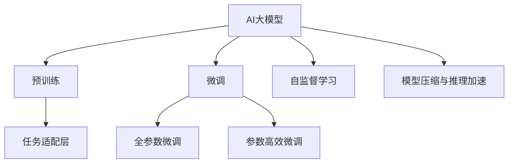

                 

# 电商平台中的多任务推荐：AI大模型的优势

> 关键词：多任务推荐, AI大模型, 电商平台, 个性化推荐系统, 冷启动, 模型压缩, 推理加速, 自监督学习

## 1. 背景介绍

### 1.1 问题由来

随着电商平台的快速发展，个性化推荐系统逐渐成为电商营销中不可或缺的核心技术。推荐算法不仅能提升用户购物体验，还能增加平台销售额，成为各大电商平台争相研究的重点。然而，传统的推荐算法往往只能针对单一的推荐任务进行优化，且需要大量用户行为数据进行训练，难以解决冷启动等问题。

近年来，AI大模型的出现为多任务推荐系统带来了新的突破。通过预训练语言模型在大型无标签数据上学习广泛的语义知识，利用微调技术将模型适配到电商平台的多个推荐任务上，可以实现跨任务共享和互补，最大化利用数据价值，并快速适应新用户，提升整体推荐效果。

### 1.2 问题核心关键点

多任务推荐系统的关键在于如何通过AI大模型优化多个推荐任务，并综合考虑不同任务之间的关联和影响，从而实现更全面、更准确的推荐。具体而言：

- **多任务共享与互补**：如何通过多任务学习，让不同推荐任务之间共享知识，同时保留任务特有的信息，提升整体推荐性能。
- **冷启动问题**：对于新用户或新商品，如何通过AI大模型预训练与微调，快速生成初步推荐，并逐步优化推荐结果。
- **模型压缩与推理加速**：如何在保持高性能推荐的同时，对大模型进行压缩和优化，降低推理计算成本，提高实际部署效率。
- **自监督学习**：如何利用无标签数据进行预训练，提升模型的语言理解能力，并利用自监督学习范式，提升模型对推荐任务的适应性。

## 2. 核心概念与联系

### 2.1 核心概念概述

为更好地理解基于AI大模型的多任务推荐方法，本节将介绍几个密切相关的核心概念：

- **AI大模型**：以Transformer架构为代表的大规模预训练语言模型，如BERT、GPT等。通过在大规模无标签数据上进行预训练，学习到广泛的语义知识，具备强大的语言理解和生成能力。
- **多任务推荐**：在电商平台中，推荐系统需要同时处理多个推荐任务，如商品推荐、用户推荐、搜索推荐等。通过多任务学习，将不同任务的知识相互补充，提升推荐效果。
- **冷启动问题**：对于新用户或新商品，由于缺乏行为数据，传统推荐算法难以提供准确推荐。多任务推荐系统可以利用预训练知识和新数据进行微调，快速生成推荐。
- **自监督学习**：利用无标签数据进行预训练，让模型自动学习语言特征，提升其在推荐任务上的表现。
- **模型压缩与推理加速**：对预训练模型进行裁剪、量化等操作，降低推理计算成本，提高实际部署效率。

这些核心概念之间的逻辑关系可以通过以下Mermaid流程图来展示：



这个流程图展示了大语言模型在多任务推荐系统中的核心作用：

1. 大语言模型通过预训练获得基础能力。
2. 微调是对预训练模型进行任务特定的优化，可以分为全参数微调和参数高效微调（PEFT）。
3. 通过自监督学习，利用无标签数据进行预训练。
4. 利用模型压缩与推理加速技术，提升模型推理效率。

这些概念共同构成了多任务推荐系统的核心框架，使得AI大模型能够在一个平台内同时处理多个推荐任务，提升推荐效果。

## 3. 核心算法原理 & 具体操作步骤
### 3.1 算法原理概述

基于AI大模型的多任务推荐系统，本质上是一个有监督的细粒度迁移学习过程。其核心思想是：利用预训练语言模型在大型无标签数据上学习到的语义知识，通过微调技术将模型适配到电商平台的多个推荐任务上，使得模型输出能够匹配不同任务的标签，从而实现多任务推荐。

形式化地，假设预训练模型为 $M_{\theta}$，其中 $\theta$ 为预训练得到的模型参数。给定电商平台的不同推荐任务 $T=\{T_1, T_2, ..., T_k\}$ 的标注数据集 $D=\{(x_i, y_i)\}_{i=1}^N$，多任务推荐的目标是找到新的模型参数 $\hat{\theta}$，使得：

$$
\hat{\theta}=\mathop{\arg\min}_{\theta} \sum_{t=1}^{k} \mathcal{L}(M_{\theta}, D_t)
$$

其中 $\mathcal{L}$ 为针对任务 $T_t$ 设计的损失函数，用于衡量模型预测输出与真实标签之间的差异。常见的损失函数包括交叉熵损失、均方误差损失等。

通过梯度下降等优化算法，微调过程不断更新模型参数 $\theta$，最小化损失函数 $\mathcal{L}$，使得模型输出逼近真实标签。由于 $\theta$ 已经通过预训练获得了较好的初始化，因此即便在多个任务上进行微调，也能较快收敛到理想的模型参数 $\hat{\theta}$。

### 3.2 算法步骤详解

基于AI大模型的多任务推荐系统一般包括以下几个关键步骤：

**Step 1: 准备预训练模型和数据集**
- 选择合适的预训练语言模型 $M_{\theta}$ 作为初始化参数，如 BERT、GPT等。
- 准备电商平台的不同推荐任务 $T$ 的标注数据集 $D$，划分为训练集、验证集和测试集。一般要求标注数据与预训练数据的分布不要差异过大。

**Step 2: 添加任务适配层**
- 根据不同推荐任务的输出格式，在预训练模型顶层设计合适的输出层和损失函数。
- 对于分类任务，通常在顶层添加线性分类器和交叉熵损失函数。
- 对于排序任务，通常使用语言模型的解码器输出概率分布，并以负对数似然为损失函数。

**Step 3: 设置微调超参数**
- 选择合适的优化算法及其参数，如 AdamW、SGD 等，设置学习率、批大小、迭代轮数等。
- 设置正则化技术及强度，包括权重衰减、Dropout、Early Stopping等。
- 确定冻结预训练参数的策略，如仅微调顶层，或全部参数都参与微调。

**Step 4: 执行梯度训练**
- 将训练集数据分批次输入模型，前向传播计算损失函数。
- 反向传播计算参数梯度，根据设定的优化算法和学习率更新模型参数。
- 周期性在验证集上评估模型性能，根据性能指标决定是否触发 Early Stopping。
- 重复上述步骤直到满足预设的迭代轮数或 Early Stopping 条件。

**Step 5: 测试和部署**
- 在测试集上评估微调后模型 $M_{\hat{\theta}}$ 的性能，对比微调前后的精度提升。
- 使用微调后的模型对新样本进行推理预测，集成到实际的应用系统中。
- 持续收集新的数据，定期重新微调模型，以适应数据分布的变化。

以上是基于AI大模型的多任务推荐系统的一般流程。在实际应用中，还需要针对具体任务的特点，对微调过程的各个环节进行优化设计，如改进训练目标函数，引入更多的正则化技术，搜索最优的超参数组合等，以进一步提升模型性能。

### 3.3 算法优缺点

基于AI大模型的多任务推荐系统具有以下优点：

1. 通用适用。适用于电商平台的多个推荐任务，设计简单的任务适配层即可实现多任务推荐。
2. 快速适配新任务。通过微调技术，模型能够快速适应新任务，无需从头开发。
3. 多任务共享知识。通过多任务学习，不同任务之间共享预训练知识，提升整体推荐效果。
4. 性能提升显著。在多个推荐任务上，基于AI大模型的推荐系统往往能够取得比传统方法更高的精度。

同时，该方法也存在一定的局限性：

1. 对标注数据依赖大。微调的效果很大程度上取决于标注数据的质量和数量，获取高质量标注数据的成本较高。
2. 模型过大。预训练语言模型往往规模庞大，需要较高的计算资源和存储资源。
3. 推理速度慢。尽管模型精度高，但推理计算成本较高，特别是在大规模用户场景下，影响用户体验。

尽管存在这些局限性，但就目前而言，基于AI大模型的多任务推荐方法仍是大规模电商平台推荐系统的核心范式。未来相关研究的重点在于如何进一步降低对标注数据的依赖，提高模型推理效率，同时兼顾可解释性和伦理安全性等因素。

### 3.4 算法应用领域

基于AI大模型的多任务推荐系统，在电商平台中的应用场景已经非常广泛，包括但不限于：

- 商品推荐：根据用户浏览、购买历史，推荐用户可能感兴趣的商品。
- 用户推荐：根据用户行为数据，推荐用户可能感兴趣的其他用户。
- 搜索推荐：根据用户搜索关键词，推荐可能相关的商品。
- 热点推荐：根据实时数据，推荐当前热门商品。
- 个性化推荐：根据用户个性化需求，推荐定制化商品。

除了上述这些经典任务外，AI大模型在电商平台的推荐系统中的应用还包括广告投放优化、推荐系统算法优化、推荐结果实时更新等创新方向，为电商推荐系统带来了全新的突破。

## 4. 数学模型和公式 & 详细讲解
### 4.1 数学模型构建

本节将使用数学语言对基于AI大模型的多任务推荐过程进行更加严格的刻画。

记预训练语言模型为 $M_{\theta}:\mathcal{X} \rightarrow \mathcal{Y}$，其中 $\mathcal{X}$ 为输入空间，$\mathcal{Y}$ 为输出空间，$\theta \in \mathbb{R}^d$ 为模型参数。假设电商平台的不同推荐任务 $T=\{T_1, T_2, ..., T_k\}$ 的标注数据集分别为 $D_t=\{(x_{ti}, y_{ti})\}_{i=1}^{N_t}$，其中 $x_{ti} \in \mathcal{X}, y_{ti} \in \mathcal{Y}_t$。

定义模型 $M_{\theta}$ 在数据样本 $(x,y)$ 上的损失函数为 $\ell(M_{\theta}(x),y)$，则在数据集 $D_t$ 上的经验风险为：

$$
\mathcal{L}_t(\theta) = \frac{1}{N_t}\sum_{i=1}^{N_t} \ell(M_{\theta}(x_{ti}),y_{ti})
$$

多任务推荐的目标是最小化所有任务的经验风险之和：

$$
\mathcal{L}(\theta) = \sum_{t=1}^{k} \mathcal{L}_t(\theta)
$$

在实践中，我们通常使用基于梯度的优化算法（如SGD、Adam等）来近似求解上述最优化问题。设 $\eta$ 为学习率，$\lambda$ 为正则化系数，则参数的更新公式为：

$$
\theta \leftarrow \theta - \eta \nabla_{\theta}\mathcal{L}(\theta) - \eta\lambda\theta
$$

其中 $\nabla_{\theta}\mathcal{L}(\theta)$ 为损失函数对参数 $\theta$ 的梯度，可通过反向传播算法高效计算。

### 4.2 公式推导过程

以下我们以电商平台的商品推荐任务为例，推导交叉熵损失函数及其梯度的计算公式。

假设模型 $M_{\theta}$ 在输入 $x$ 上的输出为 $\hat{y}=M_{\theta}(x) \in [0,1]$，表示商品 $x$ 被用户 $y$ 点击的概率。真实标签 $y \in \{0,1\}$。则二分类交叉熵损失函数定义为：

$$
\ell(M_{\theta}(x),y) = -[y\log \hat{y} + (1-y)\log (1-\hat{y})]
$$

将其代入经验风险公式，得：

$$
\mathcal{L}_t(\theta) = -\frac{1}{N_t}\sum_{i=1}^{N_t} [y_{ti}\log M_{\theta}(x_{ti})+(1-y_{ti})\log(1-M_{\theta}(x_{ti}))
$$

根据链式法则，损失函数对参数 $\theta_k$ 的梯度为：

$$
\frac{\partial \mathcal{L}_t(\theta)}{\partial \theta_k} = -\frac{1}{N_t}\sum_{i=1}^{N_t} (\frac{y_{ti}}{M_{\theta}(x_{ti})}-\frac{1-y_{ti}}{1-M_{\theta}(x_{ti})}) \frac{\partial M_{\theta}(x_{ti})}{\partial \theta_k}
$$

其中 $\frac{\partial M_{\theta}(x_{ti})}{\partial \theta_k}$ 可进一步递归展开，利用自动微分技术完成计算。

在得到损失函数的梯度后，即可带入参数更新公式，完成模型的迭代优化。重复上述过程直至收敛，最终得到适应电商平台推荐任务的最优模型参数 $\theta^*$。

## 5. 项目实践：代码实例和详细解释说明
### 5.1 开发环境搭建

在进行多任务推荐系统开发前，我们需要准备好开发环境。以下是使用Python进行PyTorch开发的环境配置流程：

1. 安装Anaconda：从官网下载并安装Anaconda，用于创建独立的Python环境。

2. 创建并激活虚拟环境：
```bash
conda create -n pytorch-env python=3.8 
conda activate pytorch-env
```

3. 安装PyTorch：根据CUDA版本，从官网获取对应的安装命令。例如：
```bash
conda install pytorch torchvision torchaudio cudatoolkit=11.1 -c pytorch -c conda-forge
```

4. 安装Transformers库：
```bash
pip install transformers
```

5. 安装各类工具包：
```bash
pip install numpy pandas scikit-learn matplotlib tqdm jupyter notebook ipython
```

完成上述步骤后，即可在`pytorch-env`环境中开始多任务推荐系统的开发。

### 5.2 源代码详细实现

下面以商品推荐任务为例，给出使用Transformers库对BERT模型进行多任务推荐的PyTorch代码实现。

首先，定义商品推荐任务的数据处理函数：

```python
from transformers import BertTokenizer
from torch.utils.data import Dataset
import torch

class RecommendationDataset(Dataset):
    def __init__(self, user_ids, item_ids, clicks, tokenizer, max_len=128):
        self.user_ids = user_ids
        self.item_ids = item_ids
        self.clicks = clicks
        self.tokenizer = tokenizer
        self.max_len = max_len
        
    def __len__(self):
        return len(self.user_ids)
    
    def __getitem__(self, item):
        user_id = self.user_ids[item]
        item_id = self.item_ids[item]
        click = self.clicks[item]
        
        encoding = self.tokenizer("click user item", return_tensors='pt', max_length=self.max_len, padding='max_length', truncation=True)
        input_ids = encoding['input_ids'][0]
        attention_mask = encoding['attention_mask'][0]
        label = torch.tensor(click, dtype=torch.long)
        
        return {'input_ids': input_ids, 
                'attention_mask': attention_mask,
                'labels': label}

# 创建dataset
tokenizer = BertTokenizer.from_pretrained('bert-base-cased')

train_dataset = RecommendationDataset(train_user_ids, train_item_ids, train_clicks, tokenizer)
dev_dataset = RecommendationDataset(dev_user_ids, dev_item_ids, dev_clicks, tokenizer)
test_dataset = RecommendationDataset(test_user_ids, test_item_ids, test_clicks, tokenizer)
```

然后，定义模型和优化器：

```python
from transformers import BertForTokenClassification, AdamW

model = BertForTokenClassification.from_pretrained('bert-base-cased', num_labels=2)

optimizer = AdamW(model.parameters(), lr=2e-5)
```

接着，定义训练和评估函数：

```python
from torch.utils.data import DataLoader
from tqdm import tqdm
from sklearn.metrics import classification_report

device = torch.device('cuda') if torch.cuda.is_available() else torch.device('cpu')
model.to(device)

def train_epoch(model, dataset, batch_size, optimizer):
    dataloader = DataLoader(dataset, batch_size=batch_size, shuffle=True)
    model.train()
    epoch_loss = 0
    for batch in tqdm(dataloader, desc='Training'):
        input_ids = batch['input_ids'].to(device)
        attention_mask = batch['attention_mask'].to(device)
        labels = batch['labels'].to(device)
        model.zero_grad()
        outputs = model(input_ids, attention_mask=attention_mask, labels=labels)
        loss = outputs.loss
        epoch_loss += loss.item()
        loss.backward()
        optimizer.step()
    return epoch_loss / len(dataloader)

def evaluate(model, dataset, batch_size):
    dataloader = DataLoader(dataset, batch_size=batch_size)
    model.eval()
    preds, labels = [], []
    with torch.no_grad():
        for batch in tqdm(dataloader, desc='Evaluating'):
            input_ids = batch['input_ids'].to(device)
            attention_mask = batch['attention_mask'].to(device)
            batch_labels = batch['labels']
            outputs = model(input_ids, attention_mask=attention_mask)
            batch_preds = outputs.logits.argmax(dim=2).to('cpu').tolist()
            batch_labels = batch_labels.to('cpu').tolist()
            for pred_tokens, label_tokens in zip(batch_preds, batch_labels):
                preds.append(pred_tokens[:len(label_tokens)])
                labels.append(label_tokens)
                
    print(classification_report(labels, preds))
```

最后，启动训练流程并在测试集上评估：

```python
epochs = 5
batch_size = 16

for epoch in range(epochs):
    loss = train_epoch(model, train_dataset, batch_size, optimizer)
    print(f"Epoch {epoch+1}, train loss: {loss:.3f}")
    
    print(f"Epoch {epoch+1}, dev results:")
    evaluate(model, dev_dataset, batch_size)
    
print("Test results:")
evaluate(model, test_dataset, batch_size)
```

以上就是使用PyTorch对BERT进行多任务推荐任务开发的完整代码实现。可以看到，得益于Transformers库的强大封装，我们可以用相对简洁的代码完成BERT模型的加载和微调。

### 5.3 代码解读与分析

让我们再详细解读一下关键代码的实现细节：

**RecommendationDataset类**：
- `__init__`方法：初始化用户id、商品id、点击次数等关键组件。
- `__len__`方法：返回数据集的样本数量。
- `__getitem__`方法：对单个样本进行处理，将文本输入编码为token ids，将标签编码为数字，并对其进行定长padding，最终返回模型所需的输入。

**训练和评估函数**：
- 使用PyTorch的DataLoader对数据集进行批次化加载，供模型训练和推理使用。
- 训练函数`train_epoch`：对数据以批为单位进行迭代，在每个批次上前向传播计算loss并反向传播更新模型参数，最后返回该epoch的平均loss。
- 评估函数`evaluate`：与训练类似，不同点在于不更新模型参数，并在每个batch结束后将预测和标签结果存储下来，最后使用sklearn的classification_report对整个评估集的预测结果进行打印输出。

**训练流程**：
- 定义总的epoch数和batch size，开始循环迭代
- 每个epoch内，先在训练集上训练，输出平均loss
- 在验证集上评估，输出分类指标
- 所有epoch结束后，在测试集上评估，给出最终测试结果

可以看到，PyTorch配合Transformers库使得BERT微调的代码实现变得简洁高效。开发者可以将更多精力放在数据处理、模型改进等高层逻辑上，而不必过多关注底层的实现细节。

当然，工业级的系统实现还需考虑更多因素，如模型的保存和部署、超参数的自动搜索、更灵活的任务适配层等。但核心的微调范式基本与此类似。

## 6. 实际应用场景
### 6.1 智能客服系统

基于AI大模型的多任务推荐技术，可以广泛应用于智能客服系统的构建。传统客服往往需要配备大量人力，高峰期响应缓慢，且一致性和专业性难以保证。而使用多任务推荐模型，可以7x24小时不间断服务，快速响应客户咨询，用自然流畅的语言解答各类常见问题。

在技术实现上，可以收集企业内部的历史客服对话记录，将问题和最佳答复构建成监督数据，在此基础上对预训练模型进行微调。微调后的模型能够自动理解用户意图，匹配最合适的答案模板进行回复。对于客户提出的新问题，还可以接入检索系统实时搜索相关内容，动态组织生成回答。如此构建的智能客服系统，能大幅提升客户咨询体验和问题解决效率。

### 6.2 金融舆情监测

金融机构需要实时监测市场舆论动向，以便及时应对负面信息传播，规避金融风险。传统的人工监测方式成本高、效率低，难以应对网络时代海量信息爆发的挑战。基于AI大模型的文本分类和情感分析技术，为金融舆情监测提供了新的解决方案。

具体而言，可以收集金融领域相关的新闻、报道、评论等文本数据，并对其进行主题标注和情感标注。在此基础上对预训练语言模型进行微调，使其能够自动判断文本属于何种主题，情感倾向是正面、中性还是负面。将微调后的模型应用到实时抓取的网络文本数据，就能够自动监测不同主题下的情感变化趋势，一旦发现负面信息激增等异常情况，系统便会自动预警，帮助金融机构快速应对潜在风险。

### 6.3 个性化推荐系统

当前的推荐系统往往只依赖用户的历史行为数据进行物品推荐，无法深入理解用户的真实兴趣偏好。基于AI大模型的多任务推荐系统可以更好地挖掘用户行为背后的语义信息，从而提供更精准、多样的推荐内容。

在实践中，可以收集用户浏览、点击、评论、分享等行为数据，提取和用户交互的物品标题、描述、标签等文本内容。将文本内容作为模型输入，用户的后续行为（如是否点击、购买等）作为监督信号，在此基础上微调预训练语言模型。微调后的模型能够从文本内容中准确把握用户的兴趣点。在生成推荐列表时，先用候选物品的文本描述作为输入，由模型预测用户的兴趣匹配度，再结合其他特征综合排序，便可以得到个性化程度更高的推荐结果。

### 6.4 未来应用展望

随着AI大模型和微调方法的不断发展，基于多任务推荐范式将在更多领域得到应用，为传统行业带来变革性影响。

在智慧医疗领域，基于多任务推荐的医疗问答、病历分析、药物研发等应用将提升医疗服务的智能化水平，辅助医生诊疗，加速新药开发进程。

在智能教育领域，多任务推荐技术可应用于作业批改、学情分析、知识推荐等方面，因材施教，促进教育公平，提高教学质量。

在智慧城市治理中，多任务推荐模型可应用于城市事件监测、舆情分析、应急指挥等环节，提高城市管理的自动化和智能化水平，构建更安全、高效的未来城市。

此外，在企业生产、社会治理、文娱传媒等众多领域，基于AI大模型的多任务推荐应用也将不断涌现，为传统行业带来新的技术路径。相信随着技术的日益成熟，多任务推荐范式将成为人工智能落地应用的重要手段，推动人工智能向更广阔的领域加速渗透。

## 7. 工具和资源推荐
### 7.1 学习资源推荐

为了帮助开发者系统掌握AI大模型在多任务推荐中的应用，这里推荐一些优质的学习资源：

1. 《Transformer from Beginner to Expert》系列博文：由大模型技术专家撰写，深入浅出地介绍了Transformer原理、BERT模型、多任务学习等前沿话题。

2. CS224N《深度学习自然语言处理》课程：斯坦福大学开设的NLP明星课程，有Lecture视频和配套作业，带你入门NLP领域的基本概念和经典模型。

3. 《Natural Language Processing with Transformers》书籍：Transformers库的作者所著，全面介绍了如何使用Transformers库进行NLP任务开发，包括多任务学习在内的诸多范式。

4. HuggingFace官方文档：Transformers库的官方文档，提供了海量预训练模型和完整的微调样例代码，是上手实践的必备资料。

5. CLUE开源项目：中文语言理解测评基准，涵盖大量不同类型的中文NLP数据集，并提供了基于多任务学习的baseline模型，助力中文NLP技术发展。

通过对这些资源的学习实践，相信你一定能够快速掌握AI大模型在多任务推荐中的应用，并用于解决实际的NLP问题。
###  7.2 开发工具推荐

高效的开发离不开优秀的工具支持。以下是几款用于多任务推荐系统开发的常用工具：

1. PyTorch：基于Python的开源深度学习框架，灵活动态的计算图，适合快速迭代研究。大部分预训练语言模型都有PyTorch版本的实现。

2. TensorFlow：由Google主导开发的开源深度学习框架，生产部署方便，适合大规模工程应用。同样有丰富的预训练语言模型资源。

3. Transformers库：HuggingFace开发的NLP工具库，集成了众多SOTA语言模型，支持PyTorch和TensorFlow，是进行多任务推荐任务开发的利器。

4. Weights & Biases：模型训练的实验跟踪工具，可以记录和可视化模型训练过程中的各项指标，方便对比和调优。与主流深度学习框架无缝集成。

5. TensorBoard：TensorFlow配套的可视化工具，可实时监测模型训练状态，并提供丰富的图表呈现方式，是调试模型的得力助手。

6. Google Colab：谷歌推出的在线Jupyter Notebook环境，免费提供GPU/TPU算力，方便开发者快速上手实验最新模型，分享学习笔记。

合理利用这些工具，可以显著提升多任务推荐任务的开发效率，加快创新迭代的步伐。

### 7.3 相关论文推荐

AI大模型和微调技术的发展源于学界的持续研究。以下是几篇奠基性的相关论文，推荐阅读：

1. Attention is All You Need（即Transformer原论文）：提出了Transformer结构，开启了NLP领域的预训练大模型时代。

2. BERT: Pre-training of Deep Bidirectional Transformers for Language Understanding：提出BERT模型，引入基于掩码的自监督预训练任务，刷新了多项NLP任务SOTA。

3. Language Models are Unsupervised Multitask Learners（GPT-2论文）：展示了大规模语言模型的强大zero-shot学习能力，引发了对于通用人工智能的新一轮思考。

4. Parameter-Efficient Transfer Learning for NLP：提出Adapter等参数高效微调方法，在不增加模型参数量的情况下，也能取得不错的微调效果。

5. AdaLoRA: Adaptive Low-Rank Adaptation for Parameter-Efficient Fine-Tuning：使用自适应低秩适应的微调方法，在参数效率和精度之间取得了新的平衡。

这些论文代表了大模型和多任务推荐技术的发展脉络。通过学习这些前沿成果，可以帮助研究者把握学科前进方向，激发更多的创新灵感。

## 8. 总结：未来发展趋势与挑战

### 8.1 总结

本文对基于AI大模型的多任务推荐系统进行了全面系统的介绍。首先阐述了多任务推荐系统的问题由来和核心关键点，明确了多任务推荐系统在电商平台中的独特价值。其次，从原理到实践，详细讲解了多任务推荐算法的数学模型和关键步骤，给出了多任务推荐任务开发的完整代码实例。同时，本文还广泛探讨了多任务推荐系统在智能客服、金融舆情、个性化推荐等多个行业领域的应用前景，展示了多任务推荐范式的巨大潜力。此外，本文精选了多任务推荐技术的各类学习资源，力求为读者提供全方位的技术指引。

通过本文的系统梳理，可以看到，基于AI大模型的多任务推荐系统正在成为电商推荐系统的核心范式，极大地拓展了推荐系统的应用边界，提升了推荐效果。未来，伴随预训练语言模型和微调方法的持续演进，相信多任务推荐技术必将在更多领域得到应用，为传统行业带来变革性影响。

### 8.2 未来发展趋势

展望未来，基于AI大模型的多任务推荐系统将呈现以下几个发展趋势：

1. 模型规模持续增大。随着算力成本的下降和数据规模的扩张，预训练语言模型的参数量还将持续增长。超大规模语言模型蕴含的丰富语义知识，有望支撑更加复杂多变的推荐任务。

2. 多任务共享与互补更加深入。未来将通过更高级的多任务学习范式，进一步提升不同任务之间的知识共享和互补，最大化利用数据价值。

3. 冷启动问题得到解决。通过预训练知识和新数据进行微调，多任务推荐系统能够快速生成初步推荐，并逐步优化推荐结果。

4. 模型压缩与推理加速技术更加成熟。随着压缩算法和加速技术的不断优化，多任务推荐模型将能够更高效地部署到生产环境中，提升用户体验。

5. 自监督学习得到广泛应用。利用无标签数据进行预训练，提升模型的语言理解能力，并利用自监督学习范式，提升模型对推荐任务的适应性。

6. 多模态推荐兴起。将视觉、语音等多模态信息与文本信息进行融合，提升推荐模型的多感官融合能力，为用户提供更加全面和个性化的推荐服务。

以上趋势凸显了基于AI大模型的多任务推荐系统的广阔前景。这些方向的探索发展，必将进一步提升多任务推荐系统的性能和应用范围，为电商推荐系统带来新的突破。

### 8.3 面临的挑战

尽管基于AI大模型的多任务推荐系统已经取得了显著进展，但在迈向更加智能化、普适化应用的过程中，它仍面临着诸多挑战：

1. 标注成本瓶颈。尽管多任务推荐系统对标注数据的依赖较小，但对于长尾应用场景，标注数据的获取成本依然较高。如何进一步降低多任务推荐系统对标注数据的依赖，将是一大难题。

2. 模型鲁棒性不足。面对域外数据时，多任务推荐系统的泛化性能往往大打折扣。对于测试样本的微小扰动，模型的预测也容易发生波动。如何提高多任务推荐模型的鲁棒性，避免灾难性遗忘，还需要更多理论和实践的积累。

3. 推理速度慢。尽管模型精度高，但推理计算成本较高，特别是在大规模用户场景下，影响用户体验。如何优化多任务推荐模型的推理速度，提升实际部署效率，将是重要的优化方向。

4. 可解释性不足。当前多任务推荐模型更像是"黑盒"系统，难以解释其内部工作机制和决策逻辑。对于医疗、金融等高风险应用，算法的可解释性和可审计性尤为重要。如何赋予多任务推荐模型更强的可解释性，将是亟待攻克的难题。

5. 安全性有待保障。预训练语言模型难免会学习到有偏见、有害的信息，通过微调传递到推荐任务，产生误导性、歧视性的输出，给实际应用带来安全隐患。如何从数据和算法层面消除模型偏见，避免恶意用途，确保输出的安全性，也将是重要的研究课题。

6. 知识整合能力不足。现有的多任务推荐模型往往局限于任务内数据，难以灵活吸收和运用更广泛的先验知识。如何让多任务推荐过程更好地与外部知识库、规则库等专家知识结合，形成更加全面、准确的信息整合能力，还有很大的想象空间。

正视多任务推荐面临的这些挑战，积极应对并寻求突破，将是大语言模型微调走向成熟的必由之路。相信随着学界和产业界的共同努力，这些挑战终将一一被克服，多任务推荐技术必将在构建人机协同的智能时代中扮演越来越重要的角色。

### 8.4 未来突破

面对多任务推荐系统所面临的种种挑战，未来的研究需要在以下几个方面寻求新的突破：

1. 探索无监督和半监督多任务推荐方法。摆脱对大规模标注数据的依赖，利用自监督学习、主动学习等无监督和半监督范式，最大限度利用非结构化数据，实现更加灵活高效的多任务推荐。

2. 研究参数高效和多任务高效的多任务推荐范式。开发更加参数高效的微调方法，在固定大部分预训练参数的同时，只更新极少量的任务相关参数。同时优化多任务推荐模型的计算图，减少前向传播和反向传播的资源消耗，实现更加轻量级、实时性的部署。

3. 引入因果学习和对比学习范式。通过引入因果推断和对比学习思想，增强多任务推荐模型建立稳定因果关系的能力，学习更加普适、鲁棒的语言表征，从而提升模型泛化性和抗干扰能力。

4. 引入更多先验知识。将符号化的先验知识，如知识图谱、逻辑规则等，与神经网络模型进行巧妙融合，引导多任务推荐过程学习更准确、合理的语言模型。同时加强不同模态数据的整合，实现视觉、语音等多模态信息与文本信息的协同建模。

5. 结合因果分析和博弈论工具。将因果分析方法引入多任务推荐模型，识别出模型决策的关键特征，增强输出解释的因果性和逻辑性。借助博弈论工具刻画人机交互过程，主动探索并规避模型的脆弱点，提高系统稳定性。

6. 纳入伦理道德约束。在模型训练目标中引入伦理导向的评估指标，过滤和惩罚有偏见、有害的输出倾向。同时加强人工干预和审核，建立模型行为的监管机制，确保输出符合人类价值观和伦理道德。

这些研究方向的探索，必将引领基于AI大模型的多任务推荐技术迈向更高的台阶，为构建安全、可靠、可解释、可控的智能系统铺平道路。面向未来，基于AI大模型的多任务推荐技术还需要与其他人工智能技术进行更深入的融合，如知识表示、因果推理、强化学习等，多路径协同发力，共同推动自然语言理解和智能交互系统的进步。只有勇于创新、敢于突破，才能不断拓展语言模型的边界，让智能技术更好地造福人类社会。

## 9. 附录：常见问题与解答

**Q1：多任务推荐系统与传统推荐系统有何不同？**

A: 多任务推荐系统与传统推荐系统最大的不同在于其能够同时处理多个推荐任务，并将不同任务的知识相互补充，提升整体推荐效果。而传统推荐系统往往只能针对单一的推荐任务进行优化，难以解决冷启动等问题。

**Q2：多任务推荐系统如何利用预训练知识？**

A: 多任务推荐系统通过预训练语言模型在大型无标签数据上学习广泛的语义知识，利用微调技术将模型适配到电商平台的多个推荐任务上，使得模型输出能够匹配不同任务的标签，从而实现多任务推荐。

**Q3：多任务推荐系统在实际部署中面临哪些问题？**

A: 多任务推荐系统在实际部署中面临的主要问题包括：
1. 标注成本：尽管对标注数据的依赖较小，但标注数据的获取成本依然较高。
2. 模型鲁棒性：面对域外数据时，模型的泛化性能可能大打折扣。
3. 推理速度：尽管模型精度高，但推理计算成本较高。
4. 可解释性：模型更像是"黑盒"系统，难以解释其内部工作机制和决策逻辑。
5. 安全性：模型可能学习到有偏见、有害的信息，给实际应用带来安全隐患。
6. 知识整合：模型往往局限于任务内数据，难以灵活吸收和运用更广泛的先验知识。

**Q4：多任务推荐系统如何优化推荐结果？**

A: 多任务推荐系统可以通过以下方法优化推荐结果：
1. 数据增强：通过回译、近义替换等方式扩充训练集。
2. 正则化：使用L2正则、Dropout、Early Stopping等防止过拟合。
3. 对抗训练：引入对抗样本，提高模型鲁棒性。
4. 参数高效微调：只调整少量参数，减小过拟合风险。
5. 多模型集成：训练多个推荐模型，取平均输出，抑制过拟合。

**Q5：多任务推荐系统在电商平台的实际应用有哪些？**

A: 多任务推荐系统在电商平台中的应用包括但不限于：
1. 商品推荐：根据用户浏览、购买历史，推荐用户可能感兴趣的商品。
2. 用户推荐：根据用户行为数据，推荐用户可能感兴趣的其他用户。
3. 搜索推荐：根据用户搜索关键词，推荐可能相关的商品。
4. 热点推荐：根据实时数据，推荐当前热门商品。
5. 个性化推荐：根据用户个性化需求，推荐定制化商品。

这些应用展示了多任务推荐系统在电商平台中的广泛应用，为用户提供了更全面、个性化的推荐服务。

---

作者：禅与计算机程序设计艺术 / Zen and the Art of Computer Programming

