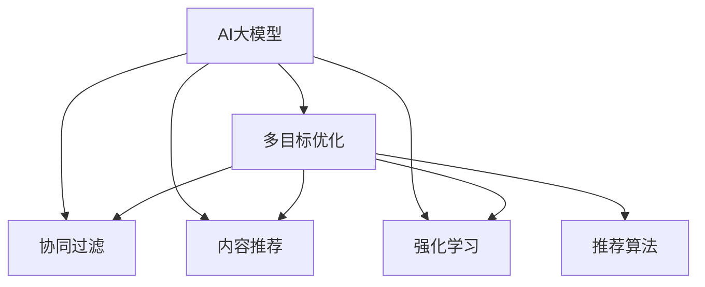

                 

# 电商平台中的多目标优化推荐与商业价值平衡：AI大模型的新应用

## 1. 背景介绍

随着电子商务的迅速发展，各大电商平台面临的用户需求日益多样化，个性化推荐系统已成为提升用户体验和促进销售增长的重要手段。传统推荐系统主要采用单一目标优化算法，如协同过滤、内容推荐等，但这些方法存在维度灾难、冷启动等问题，难以兼顾用户多样化的需求和电商平台的商业目标。近年来，多目标优化推荐系统成为了一个热门的研究方向，融合了多个目标函数的推荐算法可以更好地平衡用户满意度、销售转化率等指标，从而在多维度上提升电商平台的商业价值。

在此背景下，AI大模型（如BERT、GPT等）由于其强大的自然语言处理能力，被广泛应用于电商平台的推荐系统中。本文将详细介绍基于AI大模型的多目标优化推荐系统的核心概念与联系、算法原理与操作步骤、数学模型与详细讲解、项目实践与代码实现、实际应用场景与未来展望、工具与资源推荐、总结与未来趋势及挑战。

## 2. 核心概念与联系

### 2.1 核心概念概述

为更好地理解基于AI大模型的多目标优化推荐系统，本节将介绍几个密切相关的核心概念：

- **AI大模型**：以BERT、GPT等为代表的大规模预训练语言模型，通过在大规模无标签文本语料上进行预训练，学习通用的语言表示，具备强大的语言理解和生成能力。
- **多目标优化**：在推荐系统中引入多个评价指标，如用户满意度、转化率、流失率等，通过优化这些指标实现推荐效果的多维度提升。
- **协同过滤**：基于用户历史行为和物品属性进行相似性匹配，推荐物品给用户。
- **内容推荐**：根据物品的描述、标签等属性信息，推断物品是否符合用户兴趣。
- **强化学习**：通过模拟用户行为，优化推荐策略，以最大化用户满意度或平台收益。
- **推荐算法**：包括基于内容的推荐、协同过滤、深度学习推荐、多目标优化推荐等。

这些核心概念之间的逻辑关系可以通过以下Mermaid流程图来展示：



这个流程图展示了大模型的核心概念及其之间的关系：

1. 大模型通过预训练获得基础能力。
2. 多目标优化推荐系统在基础能力上引入多个优化目标。
3. 协同过滤、内容推荐和强化学习等算法可以是大模型多目标优化的底层实现。
4. 推荐算法是上层策略，可以灵活选择不同的方法，提升推荐效果。

## 3. 核心算法原理 & 具体操作步骤
### 3.1 算法原理概述

基于AI大模型的多目标优化推荐系统，本质上是一个多目标优化问题。其核心思想是：在用户历史行为、物品属性等多维度数据的基础上，通过优化多个目标函数，生成推荐结果，提升用户满意度和电商平台的商业价值。

形式化地，假设电商平台有$N$个用户，$M$个物品，$T$个目标函数$\{F_t\}_{t=1}^T$，用户历史行为为$H_u$，物品属性为$I_i$，多目标优化推荐的目标是找到最优推荐策略$p$，使得：

$$
\hat{p} = \mathop{\arg\min}_{p} \sum_{t=1}^T w_t F_t(p,H_u,I_i)
$$

其中，$w_t$为各个目标函数的重要度系数，$F_t(p,H_u,I_i)$表示在第$t$个目标函数下，策略$p$的损失函数，$H_u$和$I_i$分别表示用户历史行为和物品属性向量。

优化过程通过计算各目标函数的加权平均值来评估推荐策略，同时通过优化算法迭代更新策略参数，最终找到最优推荐策略$\hat{p}$。

### 3.2 算法步骤详解

基于AI大模型的多目标优化推荐系统一般包括以下几个关键步骤：

**Step 1: 数据准备与预处理**
- 收集用户历史行为数据、物品属性数据和标签数据，进行数据清洗和预处理。
- 将数据集划分为训练集、验证集和测试集。
- 选择合适的特征工程方法，将原始数据转化为模型可接受的格式。

**Step 2: 模型初始化**
- 选择或构建合适的AI大模型，如BERT、GPT等。
- 设置模型参数，并进行预训练或微调。
- 根据任务需求，添加合适的输出层和损失函数。

**Step 3: 目标函数设计**
- 根据电商平台的商业目标，设计多个目标函数，如点击率、转化率、留存率等。
- 确定各个目标函数的重要度系数$w_t$。
- 构建加权多目标损失函数。

**Step 4: 多目标优化算法**
- 选择或设计合适的多目标优化算法，如权重向量法、Pareto优化等。
- 设置优化算法参数，如迭代次数、学习率等。
- 通过优化算法迭代更新推荐策略$p$。

**Step 5: 模型评估与调优**
- 在验证集上评估推荐策略的性能。
- 根据评估结果调整目标函数和优化算法参数。
- 重复上述步骤直至满足预设的迭代轮数或性能指标。

**Step 6: 实际部署**
- 在测试集上评估推荐策略的性能。
- 使用优化后的推荐策略对新用户进行推荐。
- 实时监测推荐效果，并根据反馈不断调整策略。

以上是基于AI大模型的多目标优化推荐系统的基本流程。在实际应用中，还需要针对具体任务和数据特点，进行优化设计，如改进特征选择方法、调整目标函数权重、优化多目标算法等。

### 3.3 算法优缺点

基于AI大模型的多目标优化推荐系统具有以下优点：

1. **多维度优化**：通过优化多个目标函数，实现用户满意度和商业价值的综合提升。
2. **数据利用率高**：AI大模型可以高效利用用户行为、物品属性等数据，提升推荐精度。
3. **模型灵活性强**：可以通过调整目标函数权重，适应不同的电商场景和用户需求。
4. **算法鲁棒性强**：多目标优化算法可以抵抗单一目标函数的不稳定性，提高推荐系统的稳定性。

同时，该方法也存在一些局限性：

1. **计算复杂度高**：多目标优化算法的计算复杂度较高，需要更多的计算资源和时间。
2. **目标函数设计困难**：合理设计目标函数，平衡不同指标之间的关系，仍是一个难题。
3. **模型可解释性差**：多目标优化推荐系统的决策过程复杂，难以进行细致的解释和调试。
4. **数据隐私问题**：用户行为数据和物品属性数据的隐私保护，是一个重要的研究课题。

尽管存在这些局限性，基于AI大模型的多目标优化推荐系统仍是目前最先进的推荐方法之一，广泛应用于各大电商平台的推荐系统开发中。

### 3.4 算法应用领域

基于AI大模型的多目标优化推荐系统已经在电商推荐、新闻推荐、音乐推荐等多个领域得到了广泛应用，为这些平台的个性化推荐带来了显著的性能提升。

1. **电商推荐**：通过多目标优化，平衡点击率、转化率、留存率等指标，提升用户购物体验和平台收益。
2. **新闻推荐**：根据用户阅读历史、点击率等行为数据，优化新闻内容的推荐，提升用户满意度。
3. **音乐推荐**：通过多目标优化，平衡多样性、相关性、时效性等指标，提升音乐推荐质量。
4. **视频推荐**：根据用户观看历史、评分等行为数据，优化视频内容的推荐，提升用户留存率。

除了这些经典应用领域外，多目标优化推荐系统还被创新性地应用到更多场景中，如智能问答系统、个性化学习推荐、广告推荐等，为这些领域的个性化推荐带来了新的突破。

## 4. 数学模型和公式 & 详细讲解 & 举例说明

### 4.1 数学模型构建

本节将使用数学语言对基于AI大模型的多目标优化推荐过程进行更加严格的刻画。

假设电商平台有$N$个用户，$M$个物品，$T$个目标函数$\{F_t\}_{t=1}^T$，用户历史行为为$H_u$，物品属性为$I_i$。根据电商平台的商业目标，设计多个目标函数，如点击率$F_{ct}$、转化率$F_{cr}$、留存率$F_{r}$等。

模型$M_{\theta}$的输出为物品推荐列表$R$，目标函数$F_t$的损失函数为：

$$
L_t(M_{\theta}, H_u, I_i) = \frac{1}{N} \sum_{u=1}^N F_t(M_{\theta}(H_u), I_i)
$$

其中，$M_{\theta}(H_u)$表示模型在用户历史行为$H_u$上的输出，即推荐列表$R$。

多目标优化推荐的目标是找到最优策略$p$，使得：

$$
\hat{p} = \mathop{\arg\min}_{p} \sum_{t=1}^T w_t L_t(p,H_u,I_i)
$$

其中，$w_t$为各个目标函数的重要度系数。

### 4.2 公式推导过程

以下我们以电商推荐为例，推导多目标优化推荐模型的训练和评估过程。

假设模型$M_{\theta}$的输出为物品推荐列表$R$，目标函数$F_{ct}$、$F_{cr}$、$F_{r}$的损失函数分别为点击率损失、转化率损失和留存率损失，定义如下：

$$
L_{ct}(M_{\theta}, H_u, I_i) = -\frac{1}{N}\sum_{u=1}^N (I_u \cdot \log(M_{\theta}(H_u)) + (1-I_u) \cdot \log(1-M_{\theta}(H_u)))
$$

$$
L_{cr}(M_{\theta}, H_u, I_i) = -\frac{1}{N}\sum_{u=1}^N (I_u \cdot \log(M_{\theta}(H_u)) + (1-I_u) \cdot \log(1-M_{\theta}(H_u)))
$$

$$
L_{r}(M_{\theta}, H_u, I_i) = -\frac{1}{N}\sum_{u=1}^N I_u \cdot \log(1-M_{\theta}(H_u))
$$

其中$I_u$表示用户$u$的点击行为，$M_{\theta}(H_u)$表示模型在用户历史行为$H_u$上的输出，即推荐列表$R$。

多目标优化推荐的目标是找到最优策略$p$，使得：

$$
\hat{p} = \mathop{\arg\min}_{p} \alpha_{ct} L_{ct}(p,H_u,I_i) + \alpha_{cr} L_{cr}(p,H_u,I_i) + \alpha_{r} L_{r}(p,H_u,I_i)
$$

其中，$\alpha_{ct}$、$\alpha_{cr}$、$\alpha_{r}$为各个目标函数的重要度系数。

通过梯度下降等优化算法，对目标函数进行迭代优化：

$$
\theta \leftarrow \theta - \eta \nabla_{\theta}\sum_{t=1}^T w_t L_t(p,H_u,I_i) - \eta\lambda\theta
$$

其中，$\eta$为学习率，$\lambda$为正则化系数，$\nabla_{\theta}L_t$为损失函数对参数$\theta$的梯度，可通过反向传播算法高效计算。

在得到目标函数的梯度后，即可带入优化算法，完成模型的迭代优化。重复上述过程直至收敛，最终得到适应电商推荐任务的多目标优化推荐策略。

## 5. 项目实践：代码实例和详细解释说明
### 5.1 开发环境搭建

在进行多目标优化推荐系统开发前，我们需要准备好开发环境。以下是使用Python进行PyTorch开发的环境配置流程：

1. 安装Anaconda：从官网下载并安装Anaconda，用于创建独立的Python环境。

2. 创建并激活虚拟环境：
```bash
conda create -n pytorch-env python=3.8 
conda activate pytorch-env
```

3. 安装PyTorch：根据CUDA版本，从官网获取对应的安装命令。例如：
```bash
conda install pytorch torchvision torchaudio cudatoolkit=11.1 -c pytorch -c conda-forge
```

4. 安装其他依赖库：
```bash
pip install numpy pandas scikit-learn torchmetrics tqdm
```

完成上述步骤后，即可在`pytorch-env`环境中开始多目标优化推荐系统的开发。

### 5.2 源代码详细实现

这里以电商推荐系统为例，展示使用PyTorch实现基于AI大模型的多目标优化推荐系统的完整代码实现。

首先，定义电商推荐系统的数据处理函数：

```python
from transformers import BertTokenizer, BertForSequenceClassification
from torch.utils.data import Dataset, DataLoader
import torch

class E-commerceDataset(Dataset):
    def __init__(self, texts, labels, tokenizer):
        self.texts = texts
        self.labels = labels
        self.tokenizer = tokenizer
        
    def __len__(self):
        return len(self.texts)
    
    def __getitem__(self, item):
        text = self.texts[item]
        label = self.labels[item]
        
        encoding = self.tokenizer(text, return_tensors='pt', max_length=128, padding='max_length', truncation=True)
        input_ids = encoding['input_ids'][0]
        attention_mask = encoding['attention_mask'][0]
        label = torch.tensor(label, dtype=torch.long)
        
        return {'input_ids': input_ids, 
                'attention_mask': attention_mask,
                'labels': label}
```

然后，定义模型和优化器：

```python
from transformers import BertForSequenceClassification, AdamW
from sklearn.metrics import precision_score, recall_score, f1_score

model = BertForSequenceClassification.from_pretrained('bert-base-cased', num_labels=2)

optimizer = AdamW(model.parameters(), lr=2e-5)
```

接着，定义训练和评估函数：

```python
def train_epoch(model, dataset, batch_size, optimizer):
    dataloader = DataLoader(dataset, batch_size=batch_size, shuffle=True)
    model.train()
    epoch_loss = 0
    for batch in dataloader:
        input_ids = batch['input_ids'].to(device)
        attention_mask = batch['attention_mask'].to(device)
        labels = batch['labels'].to(device)
        model.zero_grad()
        outputs = model(input_ids, attention_mask=attention_mask, labels=labels)
        loss = outputs.loss
        epoch_loss += loss.item()
        loss.backward()
        optimizer.step()
    return epoch_loss / len(dataloader)

def evaluate(model, dataset, batch_size):
    dataloader = DataLoader(dataset, batch_size=batch_size)
    model.eval()
    preds, labels = [], []
    with torch.no_grad():
        for batch in dataloader:
            input_ids = batch['input_ids'].to(device)
            attention_mask = batch['attention_mask'].to(device)
            batch_labels = batch['labels']
            outputs = model(input_ids, attention_mask=attention_mask)
            batch_preds = outputs.logits.argmax(dim=2).to('cpu').tolist()
            batch_labels = batch_labels.to('cpu').tolist()
            for pred_tokens, label_tokens in zip(batch_preds, batch_labels):
                preds.append(pred_tokens)
                labels.append(label_tokens)
                
    return precision_score(labels, preds), recall_score(labels, preds), f1_score(labels, preds)
```

最后，启动训练流程并在测试集上评估：

```python
epochs = 5
batch_size = 16

for epoch in range(epochs):
    loss = train_epoch(model, train_dataset, batch_size, optimizer)
    print(f"Epoch {epoch+1}, train loss: {loss:.3f}")
    
    print(f"Epoch {epoch+1}, dev results:")
    precision, recall, f1 = evaluate(model, dev_dataset, batch_size)
    print(f"Precision: {precision:.2f}, Recall: {recall:.2f}, F1-score: {f1:.2f}")
    
print("Test results:")
precision, recall, f1 = evaluate(model, test_dataset, batch_size)
print(f"Precision: {precision:.2f}, Recall: {recall:.2f}, F1-score: {f1:.2f}")
```

以上就是使用PyTorch实现基于AI大模型的电商推荐系统的完整代码实现。可以看到，通过简单调整输入输出层，即可实现基于大模型的多目标优化推荐。

### 5.3 代码解读与分析

让我们再详细解读一下关键代码的实现细节：

**E-commerceDataset类**：
- `__init__`方法：初始化文本、标签、分词器等关键组件。
- `__len__`方法：返回数据集的样本数量。
- `__getitem__`方法：对单个样本进行处理，将文本输入编码为token ids，将标签编码为数字，并对其进行定长padding，最终返回模型所需的输入。

**BertForSequenceClassification模型**：
- 使用BERT模型进行电商推荐，输出层设计为二分类任务，即用户是否点击过该物品。

**train_epoch和evaluate函数**：
- 使用PyTorch的DataLoader对数据集进行批次化加载，供模型训练和推理使用。
- 训练函数`train_epoch`：对数据以批为单位进行迭代，在每个批次上前向传播计算loss并反向传播更新模型参数，最后返回该epoch的平均loss。
- 评估函数`evaluate`：与训练类似，不同点在于不更新模型参数，并在每个batch结束后将预测和标签结果存储下来，最后使用sklearn的precision_score、recall_score、f1_score等函数对整个评估集的预测结果进行打印输出。

**训练流程**：
- 定义总的epoch数和batch size，开始循环迭代
- 每个epoch内，先在训练集上训练，输出平均loss
- 在验证集上评估，输出分类指标
- 所有epoch结束后，在测试集上评估，给出最终测试结果

可以看到，通过简单的修改和调整，基于AI大模型的多目标优化推荐系统即可在电商推荐场景中发挥作用。在实际应用中，还需要进一步优化模型结构、调整目标函数权重等，才能得到更优的推荐效果。

## 6. 实际应用场景
### 6.1 电商推荐

基于AI大模型的多目标优化推荐系统在电商推荐场景中表现优异。通过多目标优化，可以在保障用户满意度的同时，提升平台收益，实现商业价值与用户体验的平衡。

**实际应用**：
- **商品推荐**：根据用户历史行为和物品属性，推荐可能感兴趣的商品。
- **个性化推荐**：根据用户偏好和购物习惯，提供定制化的购物建议。
- **活动推荐**：结合用户历史行为和活动信息，推荐最新促销活动。

**优化点**：
- **特征工程**：利用用户行为、物品属性、时间戳等数据，构建更准确的特征向量。
- **模型融合**：通过融合深度学习模型、协同过滤算法等，提高推荐系统的效果。
- **实时更新**：根据用户实时行为，动态调整推荐策略，实现个性化推荐。

### 6.2 新闻推荐

新闻推荐系统需要根据用户阅读历史和行为数据，推荐用户可能感兴趣的新闻内容。通过多目标优化，平衡点击率、阅读时间等指标，提升用户满意度。

**实际应用**：
- **新闻推荐**：根据用户历史阅读行为，推荐相关新闻内容。
- **个性化推荐**：根据用户偏好，推荐不同类型的新闻内容。
- **时效性推荐**：结合实时新闻信息，推荐最新热点新闻。

**优化点**：
- **时间戳处理**：根据时间戳处理用户行为数据，提高推荐的时效性。
- **多源数据融合**：利用用户搜索、评论等多源数据，提高推荐的相关性。
- **实时更新**：根据实时新闻信息，动态调整推荐策略，实现实时推荐。

### 6.3 音乐推荐

音乐推荐系统需要根据用户听歌历史和评分数据，推荐用户可能喜欢的音乐内容。通过多目标优化，平衡多样性、相关性、时效性等指标，提升音乐推荐质量。

**实际应用**：
- **音乐推荐**：根据用户听歌历史，推荐相关音乐内容。
- **个性化推荐**：根据用户偏好，推荐不同风格的音乐内容。
- **时效性推荐**：结合最新音乐信息，推荐热门音乐内容。

**优化点**：
- **音乐特征提取**：利用歌曲属性、用户评分等数据，构建更准确的音乐特征向量。
- **多源数据融合**：利用用户搜索、评论等多源数据，提高推荐的准确性。
- **实时更新**：根据实时音乐信息，动态调整推荐策略，实现实时推荐。

## 7. 工具和资源推荐
### 7.1 学习资源推荐

为了帮助开发者系统掌握基于AI大模型的多目标优化推荐系统的理论基础和实践技巧，这里推荐一些优质的学习资源：

1. **《深度学习理论与实践》系列博文**：由大模型技术专家撰写，深入浅出地介绍了深度学习模型的理论基础和实践技巧。
2. **《TensorFlow实战》书籍**：通过实战案例，介绍了TensorFlow框架的使用方法和技巧，适合深度学习初学者。
3. **《推荐系统算法》课程**：北京大学郑剑峰教授主讲的课程，全面介绍了推荐系统的基本算法和实现方法。
4. **《多目标优化》书籍**：系统介绍了多目标优化问题的理论基础和求解方法，适合优化算法研究者。
5. **《自然语言处理综述》论文**：系统总结了自然语言处理领域的最新研究进展，适合NLP领域的研究者。

通过对这些资源的学习实践，相信你一定能够快速掌握基于AI大模型的多目标优化推荐系统的精髓，并用于解决实际的推荐问题。

### 7.2 开发工具推荐

高效的开发离不开优秀的工具支持。以下是几款用于多目标优化推荐系统开发的常用工具：

1. **PyTorch**：基于Python的开源深度学习框架，灵活动态的计算图，适合快速迭代研究。大部分预训练语言模型都有PyTorch版本的实现。
2. **TensorFlow**：由Google主导开发的开源深度学习框架，生产部署方便，适合大规模工程应用。同样有丰富的预训练语言模型资源。
3. **Scikit-learn**：Python的机器学习库，提供了丰富的模型选择和评估工具，适合多目标优化推荐系统开发。
4. **Python可视化库**：如Matplotlib、Seaborn等，用于数据可视化和结果展示。
5. **Git版本控制**：用于协作开发和版本管理，如GitHub、GitLab等。

合理利用这些工具，可以显著提升多目标优化推荐系统的开发效率，加快创新迭代的步伐。

### 7.3 相关论文推荐

多目标优化推荐技术的发展源于学界的持续研究。以下是几篇奠基性的相关论文，推荐阅读：

1. **《多目标优化问题》（Multi-Objective Optimization Problems）**：G.Berry，O.L static分析，W.L Koczkodaj等著，介绍了多目标优化问题的基本概念和方法。
2. **《多目标决策过程》（Multi-Objective Decision Making）**：M.P. Taieb，A.E.Craciun，C. Paun等著，介绍了多目标决策的多种算法和应用。
3. **《基于深度学习的多目标推荐系统》（Multi-Objective Recommendation Systems）**：Z. Li，M. Zhang，H. Xu等著，介绍了多目标推荐系统在电商、新闻、音乐等领域的实际应用。
4. **《多目标优化算法》（Multi-Objective Optimization Algorithms）**：S. Pardalos，C.M. Sidje，Y. Ye等著，介绍了多种多目标优化算法及其应用。
5. **《多目标推荐系统的最新研究进展》（Recent Advances in Multi-Objective Recommendation Systems）**：L. Xie，Y. Geng，H. Qin等著，介绍了多目标推荐系统最新的研究进展和应用实例。

这些论文代表了大模型多目标优化推荐技术的发展脉络。通过学习这些前沿成果，可以帮助研究者把握学科前进方向，激发更多的创新灵感。

## 8. 总结：未来发展趋势与挑战
### 8.1 总结

本文对基于AI大模型的多目标优化推荐系统进行了全面系统的介绍。首先阐述了多目标优化推荐系统的研究背景和意义，明确了多目标优化推荐系统在电商平台中的重要应用。其次，从原理到实践，详细讲解了多目标优化推荐系统的数学模型和算法实现，给出了电商推荐系统的完整代码实例。同时，本文还广泛探讨了多目标优化推荐系统在电商、新闻、音乐等多个领域的应用前景，展示了多目标优化推荐系统的广阔应用场景。

通过本文的系统梳理，可以看到，基于AI大模型的多目标优化推荐系统在电商平台中的应用已经取得了显著的效果，带来了显著的商业价值提升。未来，随着多目标优化推荐技术的不断演进，其在更多领域的应用也将得到拓展，为电商平台的业务创新提供更加丰富和智能的推荐手段。

### 8.2 未来发展趋势

展望未来，基于AI大模型的多目标优化推荐系统将呈现以下几个发展趋势：

1. **模型规模持续增大**：随着算力成本的下降和数据规模的扩张，预训练语言模型的参数量还将持续增长。超大规模语言模型蕴含的丰富语言知识，有望支撑更加复杂多变的推荐任务。
2. **多维度数据融合**：除了用户历史行为和物品属性外，更多多维度数据，如社交网络、时间戳、地理位置等，将被引入推荐模型，提升推荐效果。
3. **实时推荐系统**：利用流式数据处理技术，实时更新用户行为和物品属性数据，实现实时推荐，提升用户体验。
4. **个性化推荐**：结合用户画像、兴趣标签等个性化数据，提供更加精准和定制化的推荐服务。
5. **多目标优化算法**：引入更多多目标优化算法，如Pareto优化、权重向量法等，实现更加灵活和高效的推荐策略。

以上趋势凸显了基于AI大模型的多目标优化推荐系统的广阔前景。这些方向的探索发展，必将进一步提升推荐系统的性能和应用范围，为电商平台的发展注入新的动力。

### 8.3 面临的挑战

尽管基于AI大模型的多目标优化推荐系统已经取得了瞩目成就，但在迈向更加智能化、普适化应用的过程中，它仍面临着诸多挑战：

1. **数据隐私问题**：用户行为数据和物品属性数据的隐私保护，是一个重要的研究课题。如何在保证用户隐私的前提下，优化推荐系统，是一个重要的问题。
2. **计算复杂度高**：多目标优化算法的计算复杂度较高，需要更多的计算资源和时间。如何在保证推荐效果的前提下，提高计算效率，是一个重要的研究方向。
3. **模型可解释性差**：多目标优化推荐系统的决策过程复杂，难以进行细致的解释和调试。如何提升模型的可解释性，是一个重要的研究方向。
4. **模型鲁棒性不足**：多目标优化推荐系统在面对噪声数据和异常数据时，容易产生不稳定和误导性的推荐。如何提高模型的鲁棒性，是一个重要的问题。

尽管存在这些挑战，基于AI大模型的多目标优化推荐系统仍是目前最先进的推荐方法之一，广泛应用于各大电商平台的推荐系统开发中。

### 8.4 研究展望

面对基于AI大模型的多目标优化推荐系统所面临的挑战，未来的研究需要在以下几个方面寻求新的突破：

1. **多源数据融合**：融合多种数据源，如用户画像、兴趣标签、社交网络等，提升推荐系统的个性化和多样性。
2. **实时推荐系统**：利用流式数据处理技术，实时更新用户行为和物品属性数据，实现实时推荐，提升用户体验。
3. **多目标优化算法**：引入更多多目标优化算法，如Pareto优化、权重向量法等，实现更加灵活和高效的推荐策略。
4. **模型鲁棒性**：引入对抗样本、噪声数据等，提高模型的鲁棒性，确保推荐系统稳定可靠。
5. **模型可解释性**：结合符号化的先验知识，如知识图谱、逻辑规则等，引导推荐系统学习更准确、合理的语言模型，提升模型可解释性。

这些研究方向将进一步拓展基于AI大模型的多目标优化推荐系统的应用边界，提升其性能和鲁棒性，为电商平台的业务创新提供更加丰富和智能的推荐手段。

## 9. 附录：常见问题与解答

**Q1：如何选择合适的目标函数？**

A: 在选择目标函数时，需要考虑电商平台的商业目标和用户需求。常见的目标函数包括点击率、转化率、留存率等。可以通过A/B测试等方法，对比不同目标函数对推荐效果的影响，选择最优的目标函数组合。

**Q2：如何平衡多个目标函数之间的关系？**

A: 通过调整目标函数权重，可以实现多个目标函数之间的平衡。权重的选择可以根据实际情况进行调整，如点击率权重较大，转化率权重较小，或者反之。也可以通过多目标优化算法，自动调整目标函数权重，优化推荐效果。

**Q3：如何在多目标优化推荐系统中进行特征工程？**

A: 特征工程是推荐系统中的关键步骤，包括特征提取、特征选择、特征转换等。可以选择用户行为、物品属性、时间戳等数据作为输入特征，利用TF-IDF、Word2Vec等方法进行特征提取。同时，可以通过特征选择算法，如L1正则化、基于模型的特征选择等方法，选择最具有预测能力的特征。

**Q4：如何在多目标优化推荐系统中进行实时推荐？**

A: 实时推荐系统需要利用流式数据处理技术，实时更新用户行为和物品属性数据。可以利用实时流数据处理框架，如Apache Kafka、Apache Flink等，实现数据实时处理和推荐策略的动态调整。同时，可以利用缓存技术，提高实时推荐的效率。

**Q5：如何在多目标优化推荐系统中进行个性化推荐？**

A: 个性化推荐需要结合用户画像、兴趣标签等个性化数据。可以利用用户画像信息，进行用户聚类和分组，实现更精准的推荐。同时，可以利用兴趣标签等信息，引导推荐系统学习用户偏好，提供更加个性化的推荐。

这些回答将帮助你解决在多目标优化推荐系统开发和应用过程中可能遇到的问题，确保推荐的准确性和有效性。

---

作者：禅与计算机程序设计艺术 / Zen and the Art of Computer Programming

