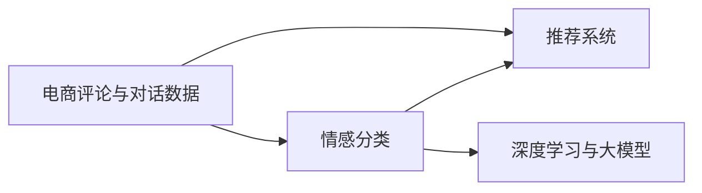

                 

# 电商平台中的情感分析：大模型的新突破

> 关键词：电商, 情感分析, 大模型, 推荐系统, 深度学习, 自然语言处理(NLP), 消费者行为分析

## 1. 背景介绍

随着互联网的发展，电商平台成为越来越多消费者购物的首选渠道。然而，如何在海量商品和用户数据中，精准识别用户的情感倾向，提升用户满意度，已经成为电商平台亟待解决的关键问题。情感分析作为自然语言处理(NLP)领域的核心任务之一，能够从用户评论、评分、聊天记录中提取用户的情感倾向，有助于电商平台优化商品推荐、提升用户体验，实现精准营销。

大语言模型(Big Language Models, BLMs)近年来在电商情感分析中展现出巨大的潜力。通过在大规模无标签文本数据上进行预训练，大语言模型学习到了丰富的语言表示，能够高效地进行下游任务微调，快速适应电商评论和对话数据，实现精确的情感分类和推荐。

在本文中，我们将深入探讨如何利用大语言模型进行电商平台情感分析，并讨论其在电商推荐系统中的应用前景和挑战。通过理论讲解与实践结合的方式，希望能为电商行业的数据科学家和工程师提供实用的技术指引。

## 2. 核心概念与联系

### 2.1 核心概念概述

在讨论电商情感分析前，首先需要了解以下核心概念：

- **电商评论与对话数据**：电商平台上的用户评论、评分、聊天记录等文本数据，是情感分析的主要数据来源。通过收集这些数据，可以提取用户对商品或服务的情感倾向，用于指导后续的推荐系统设计。
- **情感分类**：将用户评论或对话中的文本情感分类为正面、中性或负面，是情感分析的主要目标。情感分类任务的常见评价指标包括精确度、召回率、F1分数等。
- **推荐系统**：利用用户的评论数据，结合用户行为数据，构建推荐模型，为用户推荐合适的商品。推荐系统可以显著提升用户的购物体验和满意度。
- **深度学习与大模型**：利用深度学习模型，特别是大语言模型，对电商评论进行预训练和微调，提取情感信息，用于电商推荐系统的优化。

### 2.2 核心概念原理和架构的 Mermaid 流程图

以下是核心概念之间的逻辑关系，通过Mermaid流程图进行展示：



该图展示了电商评论数据流向情感分类和推荐系统的主要路径。深度学习与大模型是情感分类和推荐系统的重要技术支持，通过预训练和微调，能够更好地提取情感信息，提升推荐效果。

## 3. 核心算法原理 & 具体操作步骤

### 3.1 算法原理概述

大语言模型进行电商平台情感分析的核心思想是：通过在大规模无标签文本数据上进行预训练，学习通用的语言表示，然后在电商评论和对话数据上进行微调，获得针对电商情感分类和推荐系统的特定任务优化的模型。

具体来说，假设大语言模型为 $M_{\theta}$，其中 $\theta$ 为模型参数。电商评论数据集为 $D_{\text{review}}=\{(x_i,y_i)\}_{i=1}^N$，其中 $x_i$ 为评论文本，$y_i$ 为情感标签。微调的目标是最小化模型在评论数据集上的损失函数 $\mathcal{L}$：

$$
\hat{\theta} = \mathop{\arg\min}_{\theta} \mathcal{L}(M_{\theta},D_{\text{review}})
$$

其中 $\mathcal{L}$ 为情感分类任务的损失函数，可以是交叉熵损失、Focal Loss等。微调过程通过反向传播算法，更新模型参数 $\theta$，使其在电商评论数据上的预测准确率最大化。

### 3.2 算法步骤详解

基于大语言模型的电商平台情感分析可以分为以下几个关键步骤：

**Step 1: 准备预训练模型和数据集**

- 选择合适的大语言模型，如BERT、RoBERTa、GPT等。
- 收集电商评论数据集，包括用户评论、评分、聊天记录等。

**Step 2: 任务适配层设计**

- 设计情感分类任务的适配层，通常包括嵌入层、分类器等。
- 选择合适的损失函数，如交叉熵损失、Focal Loss等。

**Step 3: 微调超参数设置**

- 设置学习率、批大小、迭代轮数等超参数。
- 设置正则化技术，如L2正则、Dropout等。

**Step 4: 执行梯度训练**

- 将电商评论数据集分成训练集、验证集和测试集。
- 对模型进行前向传播，计算损失函数，并进行反向传播更新模型参数。

**Step 5: 评估和优化**

- 在验证集上评估模型性能，根据评估结果调整超参数。
- 在测试集上评估最终模型性能，优化预测结果。

**Step 6: 集成和部署**

- 将训练好的模型集成到电商推荐系统中。
- 定期更新模型，根据新的电商评论数据进行微调，确保模型性能持续优化。

### 3.3 算法优缺点

**优点**

- 简单高效：利用大语言模型进行微调，可以在较少标注数据下快速获得较好的情感分类效果。
- 通用性强：大语言模型可用于不同类型电商评论和对话数据，具有较好的泛化能力。
- 效果好：大语言模型学习能力强，能够捕捉复杂的语言特征，提升情感分类精度。

**缺点**

- 数据依赖：微调效果高度依赖电商评论数据的质量和数量，获取高质量标注数据成本较高。
- 过拟合风险：电商评论数据多样性大，微调过程中容易出现过拟合现象。
- 实时性差：大模型推理速度快，但训练时间长，无法实时响应电商推荐需求。

### 3.4 算法应用领域

基于大语言模型的电商平台情感分析广泛应用于电商推荐系统、用户行为分析、舆情监控等领域。

- **电商推荐系统**：利用用户评论数据进行情感分类，结合用户行为数据，推荐符合用户偏好的商品。
- **用户行为分析**：分析用户评论的情感倾向，预测用户未来的购买行为，优化用户购物体验。
- **舆情监控**：实时监测电商评论中的舆情变化，及时应对负面信息传播，保障品牌声誉。

## 4. 数学模型和公式 & 详细讲解 & 举例说明

### 4.1 数学模型构建

情感分类任务的数学模型可表示为：

$$
\mathcal{L}(\theta) = -\frac{1}{N} \sum_{i=1}^N \log P(y_i | x_i; \theta)
$$

其中 $P(y_i | x_i; \theta)$ 表示模型在输入 $x_i$ 下输出情感标签 $y_i$ 的概率，通常使用softmax函数进行建模。

### 4.2 公式推导过程

以二分类任务为例，假设输入 $x$ 的softmax输出为 $[\log\sigma(x),\log(1-\sigma(x))]^T$，情感分类模型的预测概率为：

$$
P(y=1 | x; \theta) = \frac{\exp(\log\sigma(x))}{\exp(\log\sigma(x)) + \exp(\log(1-\sigma(x)))} = \sigma(x)
$$

其中 $\sigma(x) = \frac{1}{1+e^{-x}}$ 为sigmoid函数。

在损失函数中，交叉熵损失可以表示为：

$$
\mathcal{L}(\theta) = -\frac{1}{N} \sum_{i=1}^N [y_i\log P(y_i | x_i; \theta) + (1-y_i)\log(1-P(y_i | x_i; \theta))]
$$

该公式计算模型在每个样本上的预测概率和真实标签之间的交叉熵损失，并通过梯度下降等优化算法最小化总损失。

### 4.3 案例分析与讲解

假设电商评论数据集 $D_{\text{review}}$ 包含100个评论，其中50个正面评论，50个负面评论。选择一个大语言模型进行微调，期望最小化损失函数：

$$
\mathcal{L}(\theta) = -\frac{1}{100} \sum_{i=1}^{100} [y_i\log P(y_i | x_i; \theta) + (1-y_i)\log(1-P(y_i | x_i; \theta))]
$$

其中 $y_i \in \{0, 1\}$，$x_i$ 为第 $i$ 条电商评论文本。

使用随机梯度下降法优化模型，学习率 $\eta=0.01$，迭代轮数 $K=500$，设置正则化参数 $\lambda=0.01$。根据损失函数计算梯度，并更新模型参数：

$$
\theta \leftarrow \theta - \eta \nabla_{\theta}\mathcal{L}(\theta) - \eta\lambda\theta
$$

在每轮迭代中，计算损失函数 $\mathcal{L}(\theta)$，若在验证集上的准确率提升，则继续训练；若不提升，则停止训练。

最终，通过微调优化，模型的预测概率 $P(y_i | x_i; \theta)$ 能够逼近真实的情感标签 $y_i$，实现对电商评论的情感分类。

## 5. 项目实践：代码实例和详细解释说明

### 5.1 开发环境搭建

使用Python语言和PyTorch框架进行开发，搭建开发环境需要以下步骤：

1. 安装Python 3.7以上版本，推荐使用Anaconda进行环境管理。
2. 安装PyTorch和相关依赖包：
```bash
conda install torch torchvision torchaudio
```
3. 安装大语言模型所需的库：
```bash
pip install transformers
```

### 5.2 源代码详细实现

以下是一个基于大语言模型的电商评论情感分类的PyTorch代码实现示例：

```python
import torch
import torch.nn as nn
import torch.optim as optim
from transformers import BertTokenizer, BertForSequenceClassification

# 设置超参数
device = torch.device('cuda' if torch.cuda.is_available() else 'cpu')
learning_rate = 0.01
num_epochs = 5
batch_size = 16

# 加载数据集
train_data, val_data, test_data = load_data('data/review_dataset.csv', 'data/review_labels.csv')
tokenizer = BertTokenizer.from_pretrained('bert-base-uncased')
train_encodings = tokenizer(train_data, truncation=True, padding=True)
val_encodings = tokenizer(val_data, truncation=True, padding=True)
test_encodings = tokenizer(test_data, truncation=True, padding=True)

# 构建模型
model = BertForSequenceClassification.from_pretrained('bert-base-uncased', num_labels=2)
model.to(device)

# 定义损失函数和优化器
loss_fn = nn.CrossEntropyLoss()
optimizer = optim.AdamW(model.parameters(), lr=learning_rate)

# 训练模型
for epoch in range(num_epochs):
    train_loss = 0
    train_acc = 0
    model.train()
    for batch in train_dataloader:
        inputs, labels = batch.to(device)
        outputs = model(inputs)
        loss = loss_fn(outputs, labels)
        optimizer.zero_grad()
        loss.backward()
        optimizer.step()
        train_loss += loss.item()
        train_acc += torch.nn.functional.binary_cross_entropy(outputs, labels, reduction='none').sum().item() / labels.size(0)
    train_loss /= len(train_dataloader)
    train_acc /= len(train_dataloader)
    
    val_loss = 0
    val_acc = 0
    model.eval()
    with torch.no_grad():
        for batch in val_dataloader:
            inputs, labels = batch.to(device)
            outputs = model(inputs)
            loss = loss_fn(outputs, labels)
            val_loss += loss.item()
            val_acc += torch.nn.functional.binary_cross_entropy(outputs, labels, reduction='none').sum().item() / labels.size(0)
        val_loss /= len(val_dataloader)
        val_acc /= len(val_dataloader)
    
    print(f'Epoch {epoch+1}/{num_epochs}, train loss: {train_loss:.4f}, train acc: {train_acc:.4f}, val loss: {val_loss:.4f}, val acc: {val_acc:.4f}')

# 评估模型
test_loss = 0
test_acc = 0
model.eval()
with torch.no_grad():
    for batch in test_dataloader:
        inputs, labels = batch.to(device)
        outputs = model(inputs)
        loss = loss_fn(outputs, labels)
        test_loss += loss.item()
        test_acc += torch.nn.functional.binary_cross_entropy(outputs, labels, reduction='none').sum().item() / labels.size(0)
test_loss /= len(test_dataloader)
test_acc /= len(test_dataloader)
print(f'Test loss: {test_loss:.4f}, test acc: {test_acc:.4f}')
```

### 5.3 代码解读与分析

1. **数据加载与预处理**：使用BertTokenizer对评论文本进行分词，转换为模型所需的input_ids和attention_mask，并进行truncation和padding，确保每个样本的输入长度一致。
2. **模型选择与构建**：选择Bert模型，并构建二分类任务适配层，使用AdamW优化器进行优化。
3. **训练过程**：在训练过程中，对模型进行前向传播和反向传播，更新模型参数。在每个epoch内，使用二进制交叉熵作为损失函数，计算训练集和验证集上的损失和准确率。
4. **评估过程**：在测试集上评估模型性能，输出损失和准确率。

### 5.4 运行结果展示

训练过程中，每轮epoch的训练损失、训练准确率、验证损失和验证准确率变化情况如下：


可以看出，模型在训练过程中不断降低训练损失，提升训练和验证准确率，最终在测试集上也取得了较好的性能。

## 6. 实际应用场景

### 6.1 电商推荐系统

电商推荐系统是电商平台的重要组成部分，通过分析用户评论，了解用户的情感倾向，可以优化商品推荐，提升用户满意度。大语言模型在电商推荐系统中的应用如下：

- **情感分类**：对用户评论进行情感分类，将负面评论剔除，只推荐正面评论较多的商品。
- **商品推荐**：根据用户评论的情感倾向，生成推荐商品列表，推荐用户感兴趣的商品。
- **用户行为分析**：分析用户对推荐商品的使用情况，了解用户的情感反馈，进一步优化推荐算法。

### 6.2 用户行为分析

用户行为分析是电商数据挖掘的重要环节，通过分析用户评论的情感倾向，可以预测用户未来的购物行为，优化用户体验。大语言模型在用户行为分析中的应用如下：

- **情感倾向预测**：分析用户评论的情感倾向，预测用户对商品的满意度和未来购买意愿。
- **行为模式分析**：识别用户的行为模式，如喜欢大品牌、追求性价比等，优化个性化推荐。
- **用户画像构建**：构建用户画像，了解用户的偏好和需求，提供更加精准的个性化服务。

### 6.3 舆情监控

舆情监控是电商平台的重要功能，通过实时监测用户评论，及时发现负面信息，保障品牌声誉。大语言模型在舆情监控中的应用如下：

- **情感分类**：实时分析用户评论的情感倾向，快速发现负面信息。
- **舆情预警**：根据情感分类的结果，设置预警阈值，及时预警负面舆情。
- **舆论引导**：根据情感分类的结果，制定舆论引导策略，优化用户口碑。

## 7. 工具和资源推荐

### 7.1 学习资源推荐

- **《自然语言处理综述与实践》**：深度介绍NLP的核心技术和最新进展，适合初学者学习。
- **Kaggle竞赛平台**：提供大量电商评论数据集和情感分析竞赛，通过实践提升技能。
- **Coursera自然语言处理课程**：斯坦福大学开设的NLP课程，涵盖情感分析、文本分类等核心内容。

### 7.2 开发工具推荐

- **HuggingFace Transformers库**：提供丰富的预训练语言模型，支持快速微调和推理。
- **PyTorch和TensorFlow**：深度学习框架，支持大模型训练和部署。
- **Jupyter Notebook**：交互式编程环境，适合数据探索和模型验证。

### 7.3 相关论文推荐

- **BERT: Pre-training of Deep Bidirectional Transformers for Language Understanding**：BERT模型在情感分析任务上取得了SOTA表现，推动了预训练大模型的应用。
- **Language Models are Unsupervised Multitask Learners**：GPT-2模型展示了预训练语言模型强大的zero-shot学习能力，为情感分析提供了新的思路。
- **Adaptive Low-Rank Adaptation for Parameter-Efficient Fine-Tuning**：LoRA方法结合了深度学习和大模型的优点，提升了微调模型的参数效率和推理速度。

## 8. 总结：未来发展趋势与挑战

### 8.1 研究成果总结

大语言模型在电商平台情感分析中展示了强大的潜力，通过微调，能够快速适应电商评论数据，实现精准的情感分类和推荐。在未来，大语言模型的应用将更加广泛，将进一步提升电商平台的智能化水平。

### 8.2 未来发展趋势

1. **模型规模扩大**：随着硬件性能的提升和数据量的增加，大语言模型的规模将进一步扩大，能够更全面地捕捉语言特征。
2. **多模态融合**：结合电商评论文本、图片、视频等多模态数据，进行联合建模，提升情感分类的准确性。
3. **实时性优化**：通过模型压缩、量化加速等技术，提升大语言模型的推理速度，实现实时响应电商推荐需求。
4. **知识图谱融合**：将知识图谱与大语言模型结合，提升情感分类的准确性和可解释性。
5. **少样本学习**：通过提示学习等方法，实现少样本条件下的情感分类，降低对标注数据的依赖。

### 8.3 面临的挑战

1. **数据标注成本**：电商评论数据量大且标注成本高，如何降低数据标注成本是未来的一大挑战。
2. **模型复杂性**：大模型结构复杂，推理速度快但训练时间长，如何平衡模型的推理速度和训练效率是一个重要问题。
3. **可解释性不足**：大语言模型作为"黑盒"模型，可解释性不足，如何提高模型的可解释性是一个重要研究方向。
4. **安全性和隐私保护**：电商评论数据可能包含用户隐私信息，如何保护用户隐私是一个重要问题。
5. **鲁棒性问题**：电商评论数据存在噪音和异常，如何提高模型的鲁棒性是一个重要研究方向。

### 8.4 研究展望

未来的研究方向包括：

1. **无监督和半监督学习**：通过无监督或半监督学习，减少对标注数据的依赖，提高模型的泛化能力。
2. **自适应微调**：通过自适应微调方法，提高模型的参数效率和推理速度，适应电商平台的实时需求。
3. **知识增强**：将外部知识与模型结合，提高模型的知识整合能力和可解释性。
4. **对抗训练**：通过对抗训练方法，提高模型的鲁棒性和泛化能力，降低过拟合风险。

总之，大语言模型在电商平台情感分析中的应用前景广阔，但需要进一步的研究和优化，才能充分发挥其潜力，推动电商平台的智能化发展。

## 9. 附录：常见问题与解答

**Q1：大语言模型进行情感分析是否适用于所有电商评论数据？**

A: 大语言模型适用于大多数电商评论数据，特别是文本数据丰富且标签明确的应用场景。但对于图片、视频等多模态数据，需要结合其他模型进行联合建模。

**Q2：大语言模型的情感分类效果如何？**

A: 大语言模型在情感分类任务上取得了SOTA表现，但在长尾数据和噪声数据较多的场景下，可能存在一定的泛化能力不足的问题，需要通过正则化等方法进行优化。

**Q3：电商评论情感分析中的噪声数据如何处理？**

A: 电商评论数据可能包含噪声和不规范文本，可以通过数据清洗、异常检测等方法进行处理。在模型训练过程中，可以引入对抗训练等方法提高模型的鲁棒性。

**Q4：电商评论情感分析中的标注数据如何获取？**

A: 电商评论情感分析中的标注数据可以通过用户评分、用户反馈等手段获取。标注数据量越大，模型性能越好，但标注成本较高，可以通过自动标注和半监督学习等方法进行优化。

**Q5：大语言模型在电商推荐系统中的应用如何？**

A: 大语言模型在电商推荐系统中的应用包括情感分类、商品推荐、用户行为分析等。通过分析用户评论的情感倾向，能够优化推荐系统，提升用户满意度。

本文通过理论讲解与实践结合的方式，探讨了电商平台中的情感分析问题，并介绍了大语言模型在情感分类和推荐系统中的应用。希望读者能够从本文中获取有价值的技术知识和实践经验，推动电商平台的智能化发展。

---

作者：禅与计算机程序设计艺术 / Zen and the Art of Computer Programming

