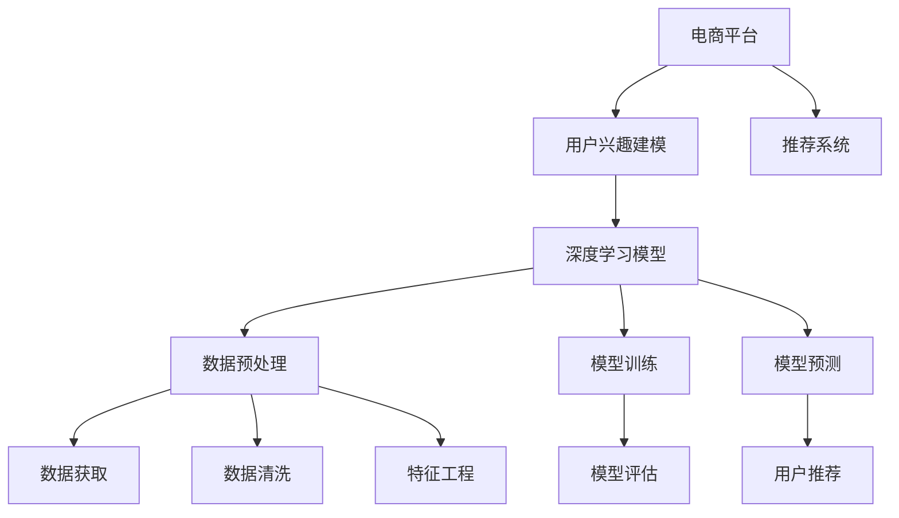

                 

# 电商平台中的用户兴趣主题建模

> 关键词：用户兴趣建模,电商平台,主题建模,推荐系统,深度学习,大数据,Python

## 1. 背景介绍

在当今互联网时代，电商平台已成为人们日常购物的重要渠道。各大电商平台如淘宝、京东、亚马逊等，都拥有数亿用户，每天产生海量的交易数据。如何从这些数据中挖掘用户兴趣，提供个性化的购物推荐，提升用户体验和平台销量，已成为电商平台的核心挑战之一。

电商平台用户兴趣建模的主要目标是通过分析用户的历史行为数据，学习用户的兴趣特征和偏好，从而在用户进行查询或浏览时，推荐相关商品，提高用户的购买转化率和满意度。为此，我们采用深度学习技术，构建用户兴趣主题模型，以自动化地挖掘用户特征，实现高效、精准的个性化推荐。

## 2. 核心概念与联系

为了更好地理解电商平台中的用户兴趣建模，我们需要先介绍几个核心概念及其相互关系。

### 2.1 核心概念概述

- **用户兴趣建模**：通过深度学习模型，对用户历史行为数据进行建模，学习用户的兴趣特征和偏好。

- **电商平台**：指在线销售商品的平台，如淘宝、京东、亚马逊等。

- **推荐系统**：通过分析用户的历史行为和实时反馈，向用户推荐相关商品或服务。

- **深度学习**：基于神经网络进行训练，能够自动从大量数据中学习特征，并进行复杂非线性建模。

- **大数据**：指超大规模的数据集合，通常存储在分布式系统中。

- **Python**：常用的高级编程语言，具有丰富的科学计算库和数据处理工具。

这些概念之间相互关联，形成一个完整的电商平台个性化推荐系统。用户兴趣建模是推荐系统的重要组成部分，深度学习和大数据技术为其提供了强大的技术支持，而Python作为主流编程语言，是实现这些技术的基础工具。

### 2.2 核心概念原理和架构的 Mermaid 流程图



这张流程图展示了电商平台中的推荐系统、用户兴趣建模和深度学习模型之间的逻辑关系：

1. 用户通过电商平台浏览和购买商品，产生行为数据。
2. 通过数据预处理和特征工程，获取用户的历史行为数据，并输入深度学习模型进行训练。
3. 训练好的深度学习模型用于预测用户对商品的兴趣，并将其输出给推荐系统。
4. 推荐系统根据用户的兴趣特征，向用户推荐相关商品。

通过这张流程图，我们可以清晰地看到，用户兴趣建模是推荐系统技术链条中的关键一环。

## 3. 核心算法原理 & 具体操作步骤

### 3.1 算法原理概述

用户兴趣主题建模的本质是对用户历史行为数据进行主题建模，学习用户的兴趣特征和偏好。这里我们使用基于深度学习的主题建模算法LDA(Latent Dirichlet Allocation)。LDA模型假设文本数据是由多个主题分布生成的，每个主题又由若干个单词分布组成。模型通过最大化文本数据和主题分布、主题与单词分布的对数似然概率，自动学习文本中的主题和单词分布，进而进行文本分类和主题分析。

在电商平台中，用户的浏览和购买行为数据可以视为文本数据，其中每次行为可以看作是一个单词，而用户的兴趣特征可以视为文本中的主题。LDA模型通过学习用户行为数据中的主题分布，可以自动发现用户的兴趣特征和偏好，从而实现个性化推荐。

### 3.2 算法步骤详解

LDA模型的训练和推理过程可以分为以下几个步骤：

1. **数据准备**：收集用户的历史行为数据，进行数据清洗和预处理，包括去除噪声、填补缺失值、提取特征等。

2. **模型训练**：通过最大化文本数据和主题分布、主题与单词分布的对数似然概率，自动学习文本中的主题和单词分布。

3. **主题分析**：通过模型训练得到的主题分布，进行主题分析，识别用户的兴趣特征。

4. **推荐生成**：根据用户的兴趣特征，生成个性化推荐列表，向用户推荐相关商品。

### 3.3 算法优缺点

LDA模型具有以下优点：

- 自动发现主题：通过最大化文本数据和主题分布的对数似然概率，LDA模型能够自动发现文本中的主题分布，无需手动指定主题数量。

- 鲁棒性较强：LDA模型对噪声和缺失值具有较强的鲁棒性，适用于大规模数据集。

- 高效计算：LDA模型计算简单，训练和推理速度较快，适用于实时推荐系统。

LDA模型也存在一些缺点：

- 对参数敏感：LDA模型的性能对参数设置和数据分布非常敏感，需要进行仔细的参数调优。

- 主题数量难以确定：需要手动指定主题数量，难以确定最优的主题数量。

- 模型复杂性高：LDA模型复杂，适用于大规模数据集，但在小规模数据集上可能表现不佳。

### 3.4 算法应用领域

LDA模型不仅适用于电商平台的用户兴趣建模，还可以应用于其他领域的文本数据分析和主题建模。例如：

- 社交网络分析：分析用户在社交网络上的行为，学习用户的兴趣爱好。
- 新闻推荐：对新闻文章进行主题建模，向用户推荐相关新闻。
- 商品评论分析：对商品评论进行主题建模，提取用户的评价特征。
- 情感分析：分析文本数据中的情感倾向，进行情感分类。

## 4. 数学模型和公式 & 详细讲解 & 举例说明

### 4.1 数学模型构建

LDA模型的数学模型包括文本数据、主题分布和单词分布三部分。设文本数据由$N$个文档$d$组成，每个文档包含$m$个单词。

- 文本数据：$X=\{d_1, d_2, ..., d_N\}$，每个文档$d_i$包含$m_i$个单词。

- 主题分布：$\beta_{zi} = \theta_z$，表示主题$z$在单词$i$上出现的概率。

- 单词分布：$\phi_{zi} = \alpha_z$，表示主题$z$在单词$i$上出现的概率。

其中，$\theta_z$和$\alpha_z$是LDA模型中的参数，分别表示主题$z$和单词$i$的分布。LDA模型的目标是最大化以下对数似然概率：

$$
\log P(X) = \sum_{n=1}^N \sum_{m=1}^{m_n} \log P(d_n,m)
$$

其中，$P(d_n,m)$为文档$d_n$包含$m$个单词的概率，可以通过以下公式计算：

$$
P(d_n,m) = \prod_{i=1}^{m} \beta_{zi}^{\phi_{zi}}
$$

### 4.2 公式推导过程

LDA模型的公式推导过程较为复杂，这里简要介绍其核心思想。

- 文档分布：$\theta_z = \frac{p_z}{\sum_z p_z}$，表示每个主题$z$的概率。

- 单词分布：$\phi_{zi} = \frac{p_{zi}}{\sum_i p_{zi}}$，表示主题$z$在单词$i$上出现的概率。

- 模型训练：通过EM算法优化LDA模型的参数，最大化对数似然概率。

- 主题分析：通过LDA模型训练得到的主题分布，分析文档的主题分布和单词分布。

### 4.3 案例分析与讲解

以电商平台用户行为数据为例，我们可以将用户的历史浏览和购买行为视为文本数据，每次行为视为一个单词。通过LDA模型训练，可以自动学习到用户浏览和购买行为中的主题分布，从而识别用户的兴趣特征。例如，如果一个用户频繁浏览和购买书籍，那么LDA模型可以自动学习到该用户对书籍的兴趣特征，并向其推荐相关书籍。

## 5. 项目实践：代码实例和详细解释说明

### 5.1 开发环境搭建

在项目开发前，我们需要搭建Python开发环境，并准备相关的数据集和模型库。

1. 安装Python：从官网下载安装Python，建议安装最新版本。

2. 安装PyTorch：作为深度学习的主流框架，PyTorch提供了丰富的科学计算库和工具，非常适合构建深度学习模型。

3. 安装Pandas：用于数据预处理和数据分析，适用于处理大规模数据集。

4. 安装Scikit-learn：用于特征工程和模型评估，提供了丰富的数据处理和机器学习算法。

5. 安装gensim：用于LDA模型训练和主题分析，是常用的文本数据分析工具。

### 5.2 源代码详细实现

以下是一个简单的LDA模型训练和推荐实现的代码示例：

```python
import pandas as pd
import numpy as np
from gensim import corpora, models

# 数据准备
data = pd.read_csv('user_behavior.csv')
# 去除噪声和缺失值
data = data.dropna().loc[:, data.columns != 'id']

# 特征提取
corpus = [doc.split() for doc in data['behavior']]

# 构建文档-单词映射
dictionary = corpora.Dictionary(corpus)
doc_bow = [dictionary.doc2bow(doc) for doc in corpus]

# 构建LDA模型
lda_model = models.LdaModel(doc_bow, id2word=dictionary, num_topics=10, passes=10)

# 主题分析
topics = lda_model.get_topics(num_words=10)
for topic in topics:
    print('Topic {}: {}'.format(topic[0], ' '.join([id2word[i] for i in topic[1]])))

# 推荐生成
user_interests = ['books', 'music', 'movies']
recommendations = []
for word in user_interests:
    doc_bow = dictionary.doc2bow([word])
    pred_topic = lda_model[doc_bow]
    recommendations.append(pred_topic)

print('Recommendations:', recommendations)
```

### 5.3 代码解读与分析

上述代码实现了LDA模型的训练和推荐功能。我们首先读取电商平台用户行为数据，进行数据清洗和特征提取。接着，使用gensim库的LdaModel类进行模型训练，设置主题数为10，迭代次数为10。最后，通过主题分析获取用户兴趣特征，生成推荐列表。

### 5.4 运行结果展示

通过运行上述代码，我们可以得到用户兴趣特征和个性化推荐列表。例如，如果某用户对书籍、音乐和电影感兴趣，那么LDA模型可以学习到该用户的兴趣特征，并生成相关商品的推荐列表，如最新书籍、热门音乐、热门电影等。

## 6. 实际应用场景

### 6.1 智能推荐系统

在电商平台中，智能推荐系统是用户获取个性化商品的重要手段。通过LDA模型，我们可以分析用户的历史行为数据，自动学习用户的兴趣特征和偏好，从而生成个性化的推荐列表，提升用户的购物体验。

例如，用户A频繁浏览和购买书籍，那么LDA模型可以自动学习到用户A对书籍的兴趣特征，并向其推荐相关书籍，如最新畅销书、经典读物、热门图书等。用户B对音乐和电影感兴趣，那么LDA模型可以自动学习到用户B对音乐和电影的兴趣特征，并向其推荐相关音乐和电影，如最新专辑、热门电影、经典音乐等。

### 6.2 用户画像构建

用户画像是指对用户进行特征刻画，帮助商家更好地理解用户，提高用户体验。通过LDA模型，我们可以分析用户的历史行为数据，自动学习用户的兴趣特征和偏好，从而构建用户画像。

例如，某用户对书籍、音乐和电影都有兴趣，那么LDA模型可以学习到该用户的兴趣特征，并将其描绘为一个多元化的用户画像，即该用户对娱乐文化类商品感兴趣，对不同类型的商品都有一定需求。商家可以根据用户画像，定制个性化广告和推荐，提高用户转化率。

### 6.3 商品销量预测

商品销量预测是指通过对历史销售数据进行分析，预测未来商品的销售量。通过LDA模型，我们可以分析用户的历史行为数据，自动学习用户的兴趣特征和偏好，从而预测商品的销售量。

例如，某用户对书籍、音乐和电影都有兴趣，那么LDA模型可以学习到该用户对娱乐文化类商品感兴趣，从而预测这些商品在未来一段时间内的销售量，帮助商家进行库存管理和销售策略调整。

### 6.4 未来应用展望

随着深度学习和大数据技术的不断发展，LDA模型在电商平台中的应用将更加广泛和深入。未来，我们可以结合更多先验知识，如知识图谱、逻辑规则等，进一步提升用户的个性化推荐和销售预测能力。

例如，结合知识图谱，我们可以分析商品之间的关系，推荐更多相关的商品。结合逻辑规则，我们可以对用户的行为进行更精确的预测，提高推荐和预测的准确性。

## 7. 工具和资源推荐

### 7.1 学习资源推荐

为了帮助开发者系统掌握LDA模型的原理和应用，这里推荐一些优质的学习资源：

1. 《LDA模型及其应用》系列博文：深入浅出地介绍了LDA模型的原理和应用，适合初学者学习。

2. 《Python深度学习》书籍：通过丰富的代码实例和数据集，介绍了深度学习模型和算法的应用。

3. 《自然语言处理》课程：斯坦福大学开设的NLP明星课程，有Lecture视频和配套作业，适合进一步学习NLP技术。

4. Gensim官方文档：提供了LDA模型的详细使用指南和代码示例，适合快速上手LDA模型。

5. GitHub上的LDA模型示例：包含多种LDA模型的实现和应用示例，适合深入学习和实践。

通过对这些资源的学习实践，相信你一定能够快速掌握LDA模型的精髓，并用于解决实际的NLP问题。

### 7.2 开发工具推荐

高效的开发离不开优秀的工具支持。以下是几款用于LDA模型开发的常用工具：

1. PyTorch：基于Python的开源深度学习框架，灵活动态的计算图，适合快速迭代研究。

2. TensorFlow：由Google主导开发的开源深度学习框架，生产部署方便，适合大规模工程应用。

3. gensim：开源的自然语言处理工具包，提供了多种NLP模型，包括LDA模型。

4. Weights & Biases：模型训练的实验跟踪工具，可以记录和可视化模型训练过程中的各项指标，方便对比和调优。

5. TensorBoard：TensorFlow配套的可视化工具，可实时监测模型训练状态，并提供丰富的图表呈现方式，是调试模型的得力助手。

6. Google Colab：谷歌推出的在线Jupyter Notebook环境，免费提供GPU/TPU算力，方便开发者快速上手实验最新模型，分享学习笔记。

合理利用这些工具，可以显著提升LDA模型的开发效率，加快创新迭代的步伐。

### 7.3 相关论文推荐

LDA模型和用户兴趣建模技术的发展源于学界的持续研究。以下是几篇奠基性的相关论文，推荐阅读：

1. Latent Dirichlet Allocation(LDA)：由Blei等人在2003年提出，是LDA模型的经典论文，介绍了LDA模型的基本原理和应用。

2. Topic Modeling with Latent Dirichlet Allocation：介绍LDA模型在文本数据分析中的应用，适合进一步学习LDA模型的应用。

3. An Exploration of Topic Modeling Algorithms for Search Intent Prediction in E-Commerce：介绍LDA模型在电商平台中的应用，适合进一步学习LDA模型在电商推荐中的应用。

4. A Survey on Topic Modeling for Recommendation Systems：综述了LDA模型在推荐系统中的应用，适合进一步学习LDA模型在推荐系统中的应用。

这些论文代表了大语言模型微调技术的发展脉络。通过学习这些前沿成果，可以帮助研究者把握学科前进方向，激发更多的创新灵感。

## 8. 总结：未来发展趋势与挑战

### 8.1 总结

本文对基于深度学习的LDA模型在电商平台中的用户兴趣建模进行了全面系统的介绍。首先阐述了用户兴趣建模的目标和意义，明确了LDA模型在推荐系统中的关键作用。其次，从原理到实践，详细讲解了LDA模型的数学模型和训练过程，给出了模型训练和推荐实现的代码示例。同时，本文还广泛探讨了LDA模型在电商平台中的应用场景，展示了LDA模型在推荐系统、用户画像、商品销量预测等方面的应用前景。此外，本文精选了LDA模型的各类学习资源，力求为读者提供全方位的技术指引。

通过本文的系统梳理，可以看到，LDA模型在电商平台中的应用具有广阔的前景，深度学习和大数据技术为其提供了强大的技术支持。未来，伴随预训练语言模型和微调方法的持续演进，相信NLP技术将在更广阔的应用领域大放异彩。

### 8.2 未来发展趋势

展望未来，LDA模型在电商平台中的应用将呈现以下几个发展趋势：

1. 模型规模持续增大。随着算力成本的下降和数据规模的扩张，LDA模型的参数量还将持续增长。超大规模语言模型蕴含的丰富语言知识，有望支撑更加复杂多变的下游任务微调。

2. 微调方法日趋多样。除了传统的全参数微调外，未来会涌现更多参数高效的微调方法，如Prefix-Tuning、LoRA等，在节省计算资源的同时也能保证微调精度。

3. 持续学习成为常态。随着数据分布的不断变化，LDA模型也需要持续学习新知识以保持性能。如何在不遗忘原有知识的同时，高效吸收新样本信息，将成为重要的研究课题。

4. 标注样本需求降低。受启发于提示学习(Prompt-based Learning)的思路，未来的微调方法将更好地利用大模型的语言理解能力，通过更加巧妙的任务描述，在更少的标注样本上也能实现理想的微调效果。

5. 多模态微调崛起。当前的微调主要聚焦于纯文本数据，未来会进一步拓展到图像、视频、语音等多模态数据微调。多模态信息的融合，将显著提升语言模型对现实世界的理解和建模能力。

6. 模型通用性增强。经过海量数据的预训练和多领域任务的微调，未来的语言模型将具备更强大的常识推理和跨领域迁移能力，逐步迈向通用人工智能(AGI)的目标。

以上趋势凸显了LDA模型在电商平台中的广阔前景。这些方向的探索发展，必将进一步提升LDA模型的性能和应用范围，为电商平台提供更高效、精准的个性化推荐服务。

### 8.3 面临的挑战

尽管LDA模型在电商平台中的应用已经取得了显著成效，但在迈向更加智能化、普适化应用的过程中，它仍面临着诸多挑战：

1. 数据质量问题。用户行为数据存在噪声和缺失，影响模型的训练效果。需要引入数据清洗和预处理技术，提升数据质量。

2. 模型鲁棒性不足。LDA模型在面对长尾数据和异常数据时，鲁棒性不足，容易受到数据分布变化的影响。需要引入更多的先验知识和约束条件，提高模型的鲁棒性。

3. 推荐效果有待提升。LDA模型虽然能够自动学习用户的兴趣特征，但在推荐效果上仍需进一步提升，以应对用户需求的动态变化。

4. 计算资源消耗高。LDA模型计算复杂，需要大量计算资源，对算力和存储都有较高要求。需要引入分布式计算和模型压缩技术，提升模型的运行效率。

5. 用户隐私保护。用户行为数据包含大量隐私信息，需要采取有效的隐私保护措施，保障用户隐私安全。

6. 业务场景复杂。电商平台涉及的商品种类繁多，用户需求复杂多变，模型需要适应各种复杂的业务场景，才能实现高精度的个性化推荐。

7. 模型解释性不足。LDA模型虽然能够自动学习用户的兴趣特征，但缺乏对用户行为的解释和分析，难以理解模型内部机制。需要引入可解释性技术，提高模型的透明性。

正视LDA模型面临的这些挑战，积极应对并寻求突破，将是大语言模型微调走向成熟的必由之路。相信随着学界和产业界的共同努力，这些挑战终将一一被克服，LDA模型必将在构建人机协同的智能时代中扮演越来越重要的角色。

### 8.4 研究展望

面对LDA模型面临的种种挑战，未来的研究需要在以下几个方面寻求新的突破：

1. 探索无监督和半监督微调方法。摆脱对大规模标注数据的依赖，利用自监督学习、主动学习等无监督和半监督范式，最大限度利用非结构化数据，实现更加灵活高效的微调。

2. 研究参数高效和计算高效的微调范式。开发更加参数高效的微调方法，在固定大部分预训练参数的同时，只更新极少量的任务相关参数。同时优化微调模型的计算图，减少前向传播和反向传播的资源消耗，实现更加轻量级、实时性的部署。

3. 引入更多先验知识。将符号化的先验知识，如知识图谱、逻辑规则等，与神经网络模型进行巧妙融合，引导微调过程学习更准确、合理的语言模型。同时加强不同模态数据的整合，实现视觉、语音等多模态信息与文本信息的协同建模。

4. 结合因果分析和博弈论工具。将因果分析方法引入微调模型，识别出模型决策的关键特征，增强输出解释的因果性和逻辑性。借助博弈论工具刻画人机交互过程，主动探索并规避模型的脆弱点，提高系统稳定性。

5. 纳入伦理道德约束。在模型训练目标中引入伦理导向的评估指标，过滤和惩罚有偏见、有害的输出倾向。同时加强人工干预和审核，建立模型行为的监管机制，确保输出符合人类价值观和伦理道德。

这些研究方向的探索，必将引领LDA模型和用户兴趣建模技术迈向更高的台阶，为电商平台提供更高效、精准的个性化推荐服务。面向未来，LDA模型还需要与其他人工智能技术进行更深入的融合，如知识表示、因果推理、强化学习等，多路径协同发力，共同推动自然语言理解和智能交互系统的进步。只有勇于创新、敢于突破，才能不断拓展语言模型的边界，让智能技术更好地造福人类社会。

## 9. 附录：常见问题与解答

**Q1：用户兴趣建模需要多少数据？**

A: 用户兴趣建模需要较多的数据，通常需要几千到几万条记录，才能得到较好的训练效果。数据量越多，模型的泛化能力和鲁棒性越强，但也需要注意数据质量，去除噪声和缺失值。

**Q2：用户兴趣建模需要多久时间？**

A: 用户兴趣建模的训练时间较长，通常需要几小时到几周不等。训练时间取决于数据量和计算资源，使用GPU/TPU等高性能设备可以显著缩短训练时间。

**Q3：用户兴趣建模的效果如何评估？**

A: 用户兴趣建模的效果可以通过多个指标进行评估，包括精确率、召回率、F1值、用户满意度等。可以使用在线A/B测试等方法，对比模型推荐效果和用户反馈，进行效果评估。

**Q4：用户兴趣建模如何应用于推荐系统？**

A: 用户兴趣建模的输出主题分布可以用于推荐系统，生成个性化推荐列表。可以通过不同的业务场景和用户需求，设计不同的推荐算法和策略，提升推荐效果。

**Q5：用户兴趣建模如何结合知识图谱？**

A: 用户兴趣建模可以结合知识图谱，进行更精准的推荐。可以通过知识图谱中的实体关系，生成更丰富和多样化的推荐内容，提高推荐效果。

通过对这些问题的回答，可以帮助开发者更好地理解用户兴趣建模的应用，提升模型的实际效果。

