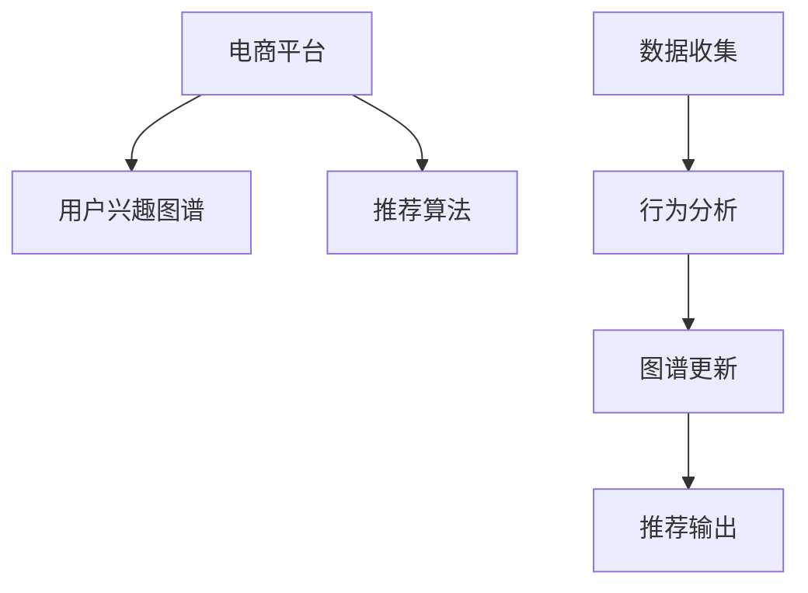

                 

# 电商平台中的用户兴趣图谱更新机制

> 关键词：电商平台, 用户兴趣图谱, 实时更新, 推荐算法, 协同过滤, 深度学习

## 1. 背景介绍

随着互联网电商的迅猛发展，电商平台已经成为了我们日常购物的重要渠道。然而，面对海量商品和个性化需求的挑战，如何提高推荐系统的精准性和用户体验，成为了电商平台亟待解决的问题。

推荐系统通过分析和理解用户的购买历史、浏览行为等数据，为其推荐感兴趣的商品，极大地提升了电商平台的销售转化率。而用户兴趣图谱（User Interest Graph, UIG）作为推荐系统中的核心组件，记录了用户对于不同商品的兴趣权重和关联关系，是实现个性化推荐的基础。

然而，用户兴趣图谱的构建和更新是一个复杂而动态的过程。电商平台需要不断地收集和分析用户的交互数据，更新图谱中的关联和权重，才能保证推荐结果的及时性和准确性。因此，用户兴趣图谱的实时更新机制成为电商平台推荐系统的核心挑战之一。

## 2. 核心概念与联系

### 2.1 核心概念概述

在深入探讨电商平台中的用户兴趣图谱更新机制之前，我们先对核心概念进行简要介绍：

- **电商平台**：以互联网为平台，通过电子交易方式实现商品买卖的商业模式。
- **用户兴趣图谱（UIG）**：记录用户对于不同商品的兴趣权重和关联关系，是推荐系统的核心组件。
- **实时更新**：电商平台需要不断地收集和分析用户的交互数据，动态更新用户兴趣图谱，保证推荐结果的时效性。
- **推荐算法**：利用用户兴趣图谱中的信息，为用户推荐感兴趣的商品，包括协同过滤、基于内容的推荐、深度学习等算法。

这些概念之间存在密切的联系。电商平台的推荐系统依赖于用户兴趣图谱的构建和实时更新，而推荐算法的应用则是在图谱基础之上进行推荐。用户兴趣图谱的准确性和时效性直接影响到推荐算法的性能。

### 2.2 核心概念原理和架构的 Mermaid 流程图



这个流程图展示了电商平台中的核心组件及其相互关系。电商平台通过收集用户的行为数据，进行分析和挖掘，更新用户兴趣图谱，并应用推荐算法为用户推荐商品。

## 3. 核心算法原理 & 具体操作步骤

### 3.1 算法原理概述

用户兴趣图谱的实时更新机制基于协同过滤和深度学习算法，旨在动态调整用户与商品之间的关联关系和兴趣权重，以适应用户兴趣的变化和市场趋势的更新。

协同过滤算法通过分析用户行为数据，找出兴趣相似的用户群体，基于他们的共同兴趣推荐商品。深度学习算法则通过构建神经网络模型，学习用户与商品之间的复杂关系，实现更准确的推荐。

协同过滤算法和深度学习算法在实际应用中往往相互结合，构建混合推荐系统，综合利用两种算法的优势，实现更精确的推荐。

### 3.2 算法步骤详解

用户兴趣图谱的更新步骤如下：

1. **数据收集**：收集用户的行为数据，包括浏览、点击、购买等记录。

2. **行为分析**：对收集到的行为数据进行预处理和特征提取，构建用户行为矩阵和商品特征向量。

3. **图谱更新**：利用协同过滤和深度学习算法，更新用户兴趣图谱中的关联关系和兴趣权重。

4. **推荐输出**：根据更新后的图谱，应用推荐算法为用户推荐商品。

### 3.3 算法优缺点

用户兴趣图谱的实时更新机制具有以下优点：

- **精准推荐**：通过动态更新图谱，能够更好地捕捉用户兴趣的变化，提供更精准的推荐结果。
- **用户体验**：实时更新机制能够及时响应用户行为变化，提升用户的购物体验。

同时，该机制也存在一些缺点：

- **计算复杂度高**：实时更新需要频繁处理海量数据，计算复杂度较高。
- **冷启动问题**：对于新用户和新商品，图谱的初始化需要更多时间和数据。
- **数据质量要求高**：行为数据的准确性和完整性直接影响图谱的更新效果。

### 3.4 算法应用领域

用户兴趣图谱的实时更新机制不仅在电商平台中得到广泛应用，还在社交媒体、在线教育、金融服务等领域中发挥着重要作用。

在社交媒体中，用户兴趣图谱用于推荐兴趣相投的朋友和内容，提升用户的社交体验。在线教育平台则利用用户学习行为数据，动态更新推荐内容，提高学习效率。金融服务领域中，实时更新的用户图谱帮助金融机构分析用户风险偏好，提供个性化金融服务。

## 4. 数学模型和公式 & 详细讲解 & 举例说明

### 4.1 数学模型构建

用户兴趣图谱的构建和更新可以表示为一个图模型，其中用户和商品作为图中的节点，用户对商品的兴趣权重作为边权重。

设用户集合为 $U$，商品集合为 $I$，用户 $u$ 对商品 $i$ 的兴趣权重为 $w_{ui}$。构建的图模型 $G=(U,I,E)$ 中的边 $e$ 代表用户与商品的关联关系，权重 $w_e$ 表示用户对商品的兴趣强度。

### 4.2 公式推导过程

用户兴趣图谱的更新可以采用基于协同过滤的算法，如基于矩阵分解的算法，其中基于用户-物品矩阵分解的公式如下：

$$
\min_{P,Q} \frac{1}{2} ||Y-PQ||_F^2 + \lambda_1 ||P||_F^2 + \lambda_2 ||Q||_F^2
$$

其中，$Y$ 为用户-物品评分矩阵，$P$ 为用户特征矩阵，$Q$ 为商品特征矩阵，$\lambda_1$ 和 $\lambda_2$ 为正则化参数。

基于深度学习的推荐算法可以采用神经网络模型，如基于神经协同过滤（NeuMF）的模型，其结构如图：


### 4.3 案例分析与讲解

以Amazon为例，Amazon利用协同过滤和深度学习算法，动态更新用户兴趣图谱，提升推荐效果。

Amazon首先收集用户的浏览、点击、购买等行为数据，构建用户行为矩阵和商品特征向量。然后，应用协同过滤算法，找出兴趣相似的用户群体，基于他们的共同兴趣推荐商品。同时，利用深度学习算法，构建神经网络模型，学习用户与商品之间的复杂关系，实现更准确的推荐。

通过动态更新用户兴趣图谱，Amazon实现了实时推荐，提升了用户的购物体验和平台的销售转化率。

## 5. 项目实践：代码实例和详细解释说明

### 5.1 开发环境搭建

在项目实践中，我们通常使用Python进行开发，安装以下依赖包：

- pandas：用于数据处理和分析
- numpy：用于数学计算
- scipy：用于优化和统计分析
- scikit-learn：用于机器学习
- tensorflow或PyTorch：用于深度学习
- networkx：用于图模型构建和分析

```bash
pip install pandas numpy scipy scikit-learn tensorflow pytorch networkx
```

### 5.2 源代码详细实现

以下是一个基于矩阵分解的协同过滤算法的示例代码：

```python
import numpy as np
import pandas as pd

# 构建用户-物品评分矩阵
Y = np.random.rand(10000, 1000)

# 初始化用户特征矩阵和物品特征矩阵
P = np.random.rand(10000, 50)
Q = np.random.rand(1000, 50)

# 损失函数定义
def loss(P, Q, Y):
    return np.linalg.norm(Y - np.dot(P, Q)) ** 2 / 2

# 正则化函数定义
def reg(P, Q):
    return np.linalg.norm(P) ** 2 + np.linalg.norm(Q) ** 2

# 优化算法
def optimize(P, Q, Y, alpha, beta):
    for i in range(100):
        P_grad = np.dot(Q.T, Q) + alpha * P
        Q_grad = np.dot(P, P.T) + beta * Q
        P -= learning_rate * P_grad
        Q -= learning_rate * Q_grad
    return P, Q

# 主程序
learning_rate = 0.01
alpha = 0.01
beta = 0.01

P, Q = optimize(P, Q, Y, alpha, beta)
print(P)
print(Q)
```

### 5.3 代码解读与分析

以上代码展示了基于矩阵分解的协同过滤算法的实现过程。其中，`P` 和 `Q` 为用户特征矩阵和商品特征矩阵，`Y` 为用户-物品评分矩阵。通过优化损失函数，更新特征矩阵 `P` 和 `Q`，实现对用户兴趣图谱的动态更新。

## 6. 实际应用场景

### 6.1 电商平台推荐系统

在电商平台中，用户兴趣图谱的实时更新机制是推荐系统的核心。通过动态更新用户图谱，电商平台能够更好地捕捉用户兴趣的变化，提供个性化的商品推荐，提升用户的购物体验和平台的销售转化率。

### 6.2 在线广告投放

在线广告投放也需要实时更新用户兴趣图谱，根据用户的浏览和点击行为，动态调整广告投放策略，提高广告的点击率和转化率。

### 6.3 社交媒体推荐系统

在社交媒体中，用户兴趣图谱用于推荐兴趣相投的朋友和内容，提升用户的社交体验。实时更新机制能够及时响应用户行为变化，提供个性化的推荐。

## 7. 工具和资源推荐

### 7.1 学习资源推荐

- 《推荐系统实战》书籍：介绍了推荐系统的基本原理和多种推荐算法，适合初学者入门。
- 《深度学习》书籍：详细讲解了深度学习的基础知识和应用场景，为深度学习推荐算法的学习提供了理论基础。
- 《Python推荐系统》课程：由斯坦福大学开设，深入浅出地介绍了推荐系统的算法和实现。

### 7.2 开发工具推荐

- Jupyter Notebook：开源的交互式开发环境，方便进行代码编写和数据分析。
- Google Colab：谷歌提供的免费云平台，支持GPU和TPU算力，方便进行大规模实验。
- TensorBoard：TensorFlow配套的可视化工具，实时监测模型训练状态，提供丰富的图表呈现方式。

### 7.3 相关论文推荐

- *Personalized Top-K Recommendation via Matrix Factorization*：介绍了基于矩阵分解的协同过滤算法。
- *Neural Collaborative Filtering*：提出了基于深度学习的协同过滤算法，实现了更精确的推荐。

## 8. 总结：未来发展趋势与挑战

### 8.1 研究成果总结

本文详细介绍了电商平台中的用户兴趣图谱更新机制，展示了协同过滤和深度学习算法在图谱更新中的实际应用。通过动态更新用户图谱，电商平台能够实现实时推荐，提升用户购物体验和销售转化率。

### 8.2 未来发展趋势

未来，电商平台中的用户兴趣图谱更新机制将呈现以下几个发展趋势：

1. **多模态融合**：结合用户的多模态数据，如图像、视频、文本等，构建更全面、准确的图谱。
2. **实时性增强**：通过优化算法，进一步提升图谱更新的实时性和响应速度。
3. **跨领域应用**：将图谱更新机制应用于更多领域，如在线广告、社交媒体等，实现更广泛的个性化推荐。
4. **协同学习**：利用多个平台的用户数据，协同学习用户兴趣，提升推荐精度。

### 8.3 面临的挑战

尽管用户兴趣图谱的实时更新机制在电商平台中取得了显著效果，但仍面临一些挑战：

1. **数据质量**：行为数据的准确性和完整性直接影响图谱的更新效果，需要更好的数据采集和清洗技术。
2. **计算资源**：实时更新需要频繁处理海量数据，计算复杂度较高，需要更高效的算法和设备支持。
3. **冷启动问题**：对于新用户和新商品，图谱的初始化需要更多时间和数据。
4. **隐私保护**：用户的隐私保护问题需要得到充分考虑，如何在保证用户隐私的前提下进行图谱更新，是一个重要研究方向。

### 8.4 研究展望

未来的研究需要从以下几个方面进行突破：

1. **优化算法**：开发更高效的算法，提升图谱更新的实时性和准确性。
2. **多模态融合**：结合用户的多模态数据，构建更全面、准确的图谱。
3. **协同学习**：利用多个平台的用户数据，协同学习用户兴趣，提升推荐精度。
4. **隐私保护**：研究如何在保证用户隐私的前提下进行图谱更新，保护用户数据安全。

## 9. 附录：常见问题与解答

**Q1: 用户兴趣图谱的实时更新机制是否适用于所有电商平台？**

A: 用户兴趣图谱的实时更新机制适用于大多数电商平台，但需要根据不同平台的特性进行优化。对于数据量较小、用户行为模式相对固定的平台，图谱更新机制可能效果不如预期。

**Q2: 如何处理用户行为数据中的异常值和缺失值？**

A: 对于用户行为数据中的异常值和缺失值，通常采用数据清洗和补全技术进行处理。数据清洗可以剔除明显异常的记录，补全可以采用均值、中位数等方法进行填补。

**Q3: 用户兴趣图谱的更新频率如何设定？**

A: 用户兴趣图谱的更新频率需要根据平台特性和用户行为模式进行设定。通常情况下，每日或每小时更新一次可以较好地捕捉用户兴趣的变化。

**Q4: 实时更新机制对电商平台的安全性和隐私保护有哪些影响？**

A: 实时更新机制可能会带来一定的安全性和隐私保护风险。为了保护用户隐私，平台需要采用数据脱敏、访问控制等技术，防止数据泄露和滥用。

**Q5: 如何衡量用户兴趣图谱的更新效果？**

A: 衡量用户兴趣图谱的更新效果可以通过以下指标：点击率、转化率、用户满意度等。通过对比更新前后的推荐效果，评估图谱更新的效果。

通过本文的系统梳理，可以看到，用户兴趣图谱的实时更新机制是电商平台推荐系统的核心，通过动态更新图谱，实现个性化推荐，提升用户购物体验和平台销售转化率。未来，随着技术的不断进步，图谱更新机制将更加高效、精准，为用户带来更好的电商体验。

