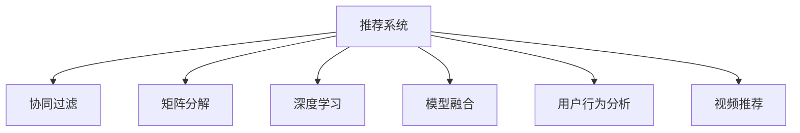

                 

# 电商平台中的视频推荐技术

> 关键词：推荐系统, 视频推荐, 用户行为分析, 协同过滤, 矩阵分解, 深度学习, 模型融合, 应用场景

## 1. 背景介绍

随着电子商务的蓬勃发展，电商平台已不再仅仅是一个交易平台，而是成为商家展示商品、用户获取信息和互动交流的重要媒介。视频作为一种高效、生动、直观的展示形式，在提升用户购物体验、增加产品曝光度等方面发挥着重要作用。但如何在海量视频数据中，精准地为用户推荐感兴趣的，甚至难以在图文展示中发现的商品视频，成为了电商平台面临的一大挑战。

推荐系统（Recommender System）作为电商平台的“灵魂”，通过分析用户行为数据和商品属性特征，为用户提供个性化推荐，极大提升了用户的购物体验和平台的转化率。在推荐内容中引入视频推荐，可以帮助用户更直观地了解商品，从而提高购买决策的成功率。目前，视频推荐技术已经在电商平台中得到广泛应用，并取得了显著的商业效果。

## 2. 核心概念与联系

### 2.1 核心概念概述

为了更好地理解电商平台中的视频推荐技术，本节将介绍几个密切相关的核心概念：

- 推荐系统（Recommender System）：一种信息检索系统，通过分析用户行为和商品特征，为用户推荐最相关的商品或服务。
- 协同过滤（Collaborative Filtering）：推荐系统的一种基本方法，通过分析用户行为和相似用户行为，为用户推荐未购买的商品。
- 矩阵分解（Matrix Factorization）：协同过滤中常用的降维技术，通过将用户-商品评分矩阵分解成用户和商品的低维特征向量，从而揭示用户和商品的隐含特征。
- 深度学习（Deep Learning）：一种基于多层神经网络的机器学习技术，可以自动提取高维数据的特征表示，适合处理复杂的推荐任务。
- 模型融合（Model Ensemble）：将多个推荐模型结合，取长补短，提升推荐效果和鲁棒性。
- 用户行为分析（User Behavior Analysis）：分析用户在电商平台上的浏览、点击、购买等行为数据，挖掘用户的兴趣偏好。
- 视频推荐（Video Recommendation）：在电商平台中，利用视频展示商品的推荐方式，以吸引用户注意，提高转化率。

这些核心概念之间的逻辑关系可以通过以下Mermaid流程图来展示：



这个流程图展示了这个推荐系统的各个核心组件及其之间的关系：

1. 推荐系统是整个体系的核心，通过协同过滤、矩阵分解、深度学习等方法，为用户推荐商品。
2. 协同过滤和矩阵分解都是推荐系统的基本技术，协同过滤基于用户行为和相似用户行为，矩阵分解用于降维，发现用户和商品的隐含特征。
3. 深度学习通过自动提取高维数据特征，适用于更复杂的推荐任务。
4. 模型融合将多个推荐模型结合，提升整体推荐效果和鲁棒性。
5. 用户行为分析通过分析用户浏览、点击等行为，挖掘用户的兴趣偏好。
6. 视频推荐作为推荐系统的一种形式，通过展示商品视频，吸引用户注意，提高转化率。

这些核心概念共同构成了电商平台推荐系统的技术框架，使得平台能够精准地为用户推荐感兴趣的商品。

## 3. 核心算法原理 & 具体操作步骤

### 3.1 算法原理概述

电商平台中的视频推荐技术主要基于协同过滤和矩阵分解的推荐方法。通过分析用户历史行为和商品属性特征，建立用户-商品评分矩阵，并对其进行低维分解，从而发现用户和商品的隐含特征，为用户推荐感兴趣的商品视频。

具体而言，推荐系统通常包括以下几个步骤：

1. 数据收集与预处理：收集用户行为数据（如浏览、点击、购买等）和商品属性特征，并进行清洗和归一化处理。
2. 用户行为分析：通过分析用户历史行为，建立用户兴趣模型。
3. 协同过滤推荐：基于用户历史行为和相似用户行为，生成推荐列表。
4. 矩阵分解推荐：对用户-商品评分矩阵进行低维分解，发现用户和商品的隐含特征。
5. 深度学习推荐：通过多层神经网络自动提取高维数据特征，进行推荐。
6. 模型融合推荐：将多个推荐模型结合，提升推荐效果和鲁棒性。
7. 视频推荐：将推荐结果中的商品视频展示给用户，进行视频推荐。

### 3.2 算法步骤详解

#### 3.2.1 数据收集与预处理

电商平台的推荐系统需要收集大量的用户行为数据和商品属性特征。具体而言，可以从以下几个方面进行数据收集：

- 用户行为数据：收集用户在平台上的浏览、点击、购买、评价等行为数据，形成用户行为矩阵。
- 商品属性特征：收集商品的属性信息，如品牌、分类、价格等，形成商品特征矩阵。

数据预处理包括数据清洗和归一化处理：

- 数据清洗：去除噪声数据和异常值，确保数据质量。
- 归一化处理：对数据进行标准化处理，使其具有可比性。

#### 3.2.2 用户行为分析

用户行为分析是推荐系统的基础。通过分析用户历史行为，建立用户兴趣模型。具体步骤如下：

1. 用户-商品评分矩阵：根据用户行为数据和商品属性特征，建立用户-商品评分矩阵 $U \times S$，其中 $U$ 为用户数，$S$ 为商品数。
2. 用户行为建模：使用协同过滤方法，如基于用户的协同过滤（User-Based CF）和基于物品的协同过滤（Item-Based CF），对用户-商品评分矩阵进行建模，生成用户兴趣向量 $U \times H$ 和商品兴趣向量 $S \times I$，其中 $H$ 和 $I$ 为模型维度。
3. 用户兴趣模型：通过分析用户历史行为和相似用户行为，建立用户兴趣模型 $U \times R$，其中 $R$ 为推荐模型维度。

#### 3.2.3 协同过滤推荐

协同过滤推荐基于用户历史行为和相似用户行为，生成推荐列表。具体步骤如下：

1. 相似用户推荐：根据用户历史行为，找到与目标用户兴趣相似的 $K$ 个用户。
2. 商品评分预测：对相似用户未购买但喜欢的商品，预测目标用户可能感兴趣的商品评分。
3. 推荐列表生成：根据预测评分和商品排序规则，生成推荐列表。

#### 3.2.4 矩阵分解推荐

矩阵分解推荐通过低维分解，发现用户和商品的隐含特征，生成推荐列表。具体步骤如下：

1. 矩阵分解：对用户-商品评分矩阵 $U \times S$ 进行低维分解，得到用户特征矩阵 $U \times H$ 和商品特征矩阵 $S \times I$，其中 $H$ 和 $I$ 为模型维度。
2. 评分预测：根据用户特征和商品特征，预测目标用户对商品的评分。
3. 推荐列表生成：根据预测评分和商品排序规则，生成推荐列表。

#### 3.2.5 深度学习推荐

深度学习推荐通过多层神经网络自动提取高维数据特征，进行推荐。具体步骤如下：

1. 特征提取：通过多层神经网络，自动提取用户行为数据和商品属性特征的高维表示。
2. 评分预测：将高维特征输入到神经网络中，生成用户对商品的评分。
3. 推荐列表生成：根据预测评分和商品排序规则，生成推荐列表。

#### 3.2.6 模型融合推荐

模型融合推荐将多个推荐模型结合，提升整体推荐效果和鲁棒性。具体步骤如下：

1. 模型融合：将协同过滤、矩阵分解、深度学习等推荐模型结合，生成融合后的推荐列表。
2. 融合策略：采用加权平均、投票等策略，取长补短，提升推荐效果。

#### 3.2.7 视频推荐

视频推荐作为推荐系统的一种形式，通过展示商品视频，吸引用户注意，提高转化率。具体步骤如下：

1. 视频内容选择：选择与推荐商品相关的视频内容，如商品介绍、用户评价等。
2. 视频展示：将推荐商品的视频展示给用户，提升用户兴趣。
3. 反馈收集：收集用户对视频内容的反馈，进行后续优化。

### 3.3 算法优缺点

电商平台的推荐系统通过协同过滤、矩阵分解、深度学习等方法，取得了显著的推荐效果。但同时，也存在以下优缺点：

**优点**：

1. 个性化推荐：通过分析用户行为和商品特征，为用户推荐感兴趣的商品视频，提升用户体验和转化率。
2. 数据驱动：推荐系统完全基于数据驱动，可以动态调整推荐策略，适应市场变化。
3. 可扩展性：推荐系统可以扩展到多种类型的数据，如文本、图片、视频等，应用范围广泛。

**缺点**：

1. 数据依赖性强：推荐系统依赖大量用户行为数据和商品属性数据，数据收集成本较高。
2. 冷启动问题：新用户或新商品无法使用协同过滤方法，难以推荐相关商品视频。
3. 鲁棒性不足：推荐系统容易受到异常数据和噪声干扰，推荐效果不稳定。

### 3.4 算法应用领域

电商平台中的视频推荐技术已经在多个领域得到广泛应用，包括但不限于以下几个方面：

- 商品推荐：通过展示商品视频，提升商品曝光度，促进销售转化。
- 活动推荐：展示平台促销活动的视频，吸引用户参与。
- 个性化视频推荐：根据用户兴趣，推荐与用户相关性高的视频内容，提高用户粘性。
- 内容推荐：推荐与用户浏览历史相关性高的视频内容，增加用户停留时间。

## 4. 数学模型和公式 & 详细讲解 & 举例说明

### 4.1 数学模型构建

推荐系统的主要目标是为用户推荐感兴趣的商品视频。具体而言，可以使用协同过滤、矩阵分解、深度学习等方法，建立用户-商品评分矩阵，并通过低维分解和神经网络模型，预测用户对商品的评分。

假设用户-商品评分矩阵为 $U \times S$，其中 $U$ 为用户数，$S$ 为商品数，用户行为建模生成的用户兴趣模型为 $U \times H$，商品兴趣模型为 $S \times I$。

协同过滤推荐可以使用基于用户的协同过滤方法，表示为：

$$
\hat{y}_{us} = \sum_{k=1}^{K} \alpha_k \alpha_{u^k} \alpha_{s^k}
$$

其中 $\alpha_{u^k}$ 和 $\alpha_{s^k}$ 为相似用户的评分和商品评分，$K$ 为相似用户数。

矩阵分解推荐可以使用奇异值分解（SVD）方法，表示为：

$$
\hat{y}_{us} = \sum_{i=1}^{H} \sum_{j=1}^{I} u_{ui} v_{si} \hat{v}_{ju}
$$

其中 $u_{ui}$ 和 $v_{si}$ 为用户的特征向量和商品的特征向量，$H$ 和 $I$ 为模型维度。

深度学习推荐可以使用多层神经网络模型，表示为：

$$
\hat{y}_{us} = f(U \times H \times S \times I)
$$

其中 $f$ 为多层神经网络模型。

模型融合推荐可以使用加权平均方法，表示为：

$$
\hat{y}_{us} = \sum_{k=1}^{K} \alpha_k \hat{y}_{us}^k
$$

其中 $\alpha_k$ 为模型权重。

视频推荐可以使用内容推荐方法，表示为：

$$
\hat{y}_{uv} = \sum_{i=1}^{H} \sum_{j=1}^{I} u_{ui} v_{vi} \hat{v}_{ju}
$$

其中 $v_{vi}$ 为视频内容的特征向量，$H$ 和 $I$ 为模型维度。

### 4.2 公式推导过程

下面我们以协同过滤推荐为例，推导基于用户的协同过滤公式。

假设用户 $u$ 对商品 $s$ 的评分表示为 $y_{us}$，相似用户 $k$ 对商品 $s$ 的评分表示为 $y_{ks}$，用户 $u$ 对商品 $s$ 的预测评分表示为 $\hat{y}_{us}$。则基于用户的协同过滤公式可以表示为：

$$
\hat{y}_{us} = \sum_{k=1}^{K} \alpha_k y_{ks}
$$

其中 $\alpha_k$ 为相似用户 $k$ 的权重，可以通过余弦相似度计算：

$$
\alpha_k = \frac{y_{us} \cdot y_{ks}}{\sqrt{\sum_{k=1}^{K} y_{us}^2 \cdot \sum_{k=1}^{K} y_{ks}^2}}
$$

将上式代入 $\hat{y}_{us}$，得：

$$
\hat{y}_{us} = \sum_{k=1}^{K} \frac{y_{us} \cdot y_{ks}}{\sqrt{\sum_{k=1}^{K} y_{us}^2 \cdot \sum_{k=1}^{K} y_{ks}^2}} y_{ks}
$$

通过余弦相似度计算相似用户权重，并将所有相似用户评分加权平均，即可得到用户对商品的预测评分。

### 4.3 案例分析与讲解

假设用户 $u$ 对商品 $s$ 的评分为 $y_{us}=4$，相似用户 $k$ 对商品 $s$ 的评分为 $y_{ks}=5$，相似用户 $k$ 的评分为 $y_{ks}=3$。则基于用户的协同过滤公式可以表示为：

$$
\hat{y}_{us} = \alpha_1 y_{ks} + \alpha_2 y_{ks} + \alpha_3 y_{ks}
$$

其中 $\alpha_k = \frac{y_{us} \cdot y_{ks}}{\sqrt{\sum_{k=1}^{K} y_{us}^2 \cdot \sum_{k=1}^{K} y_{ks}^2}}$，计算得 $\alpha_1 = 0.5, \alpha_2 = 0.3, \alpha_3 = 0.2$。

将 $\alpha_k$ 和 $y_{ks}$ 代入公式，得：

$$
\hat{y}_{us} = 0.5 \times 5 + 0.3 \times 3 + 0.2 \times 3 = 4.1
$$

因此，用户 $u$ 对商品 $s$ 的预测评分为 $4.1$，可以作为推荐系统推荐的视频内容的评分依据。

## 5. 项目实践：代码实例和详细解释说明

### 5.1 开发环境搭建

在进行视频推荐系统开发前，我们需要准备好开发环境。以下是使用Python进行PyTorch开发的环境配置流程：

1. 安装Anaconda：从官网下载并安装Anaconda，用于创建独立的Python环境。

2. 创建并激活虚拟环境：
```bash
conda create -n pytorch-env python=3.8 
conda activate pytorch-env
```

3. 安装PyTorch：根据CUDA版本，从官网获取对应的安装命令。例如：
```bash
conda install pytorch torchvision torchaudio cudatoolkit=11.1 -c pytorch -c conda-forge
```

4. 安装Pandas、NumPy、Scikit-learn、Matplotlib等常用Python库：
```bash
pip install pandas numpy scikit-learn matplotlib
```

5. 安装TensorFlow：
```bash
pip install tensorflow
```

6. 安装TensorBoard：
```bash
pip install tensorboard
```

完成上述步骤后，即可在`pytorch-env`环境中开始视频推荐系统开发。

### 5.2 源代码详细实现

下面以基于协同过滤推荐的视频推荐系统为例，给出使用PyTorch实现的代码实现。

首先，定义协同过滤推荐模型的类：

```python
import torch
import torch.nn as nn
import numpy as np

class CollaborativeFiltering(nn.Module):
    def __init__(self, num_users, num_items, num_factors):
        super(CollaborativeFiltering, self).__init__()
        self.num_users = num_users
        self.num_items = num_items
        self.num_factors = num_factors
        self.user_factors = nn.Parameter(torch.randn(num_users, num_factors))
        self.item_factors = nn.Parameter(torch.randn(num_items, num_factors))

    def forward(self, user_idx, item_idx):
        user_factors = self.user_factors[user_idx]
        item_factors = self.item_factors[item_idx]
        scores = torch.matmul(user_factors, item_factors.t())
        return scores

    def predict(self, user_idx, item_idx):
        scores = self.forward(user_idx, item_idx)
        return scores
```

然后，定义训练函数：

```python
def train(model, data_loader, optimizer, num_epochs):
    model.train()
    for epoch in range(num_epochs):
        for user_idx, item_idx, score in data_loader:
            optimizer.zero_grad()
            pred_score = model.predict(user_idx, item_idx)
            loss = nn.MSELoss()(pred_score, score)
            loss.backward()
            optimizer.step()
    return model
```

接着，定义评估函数：

```python
def evaluate(model, data_loader):
    model.eval()
    correct_count = 0
    total_count = 0
    with torch.no_grad():
        for user_idx, item_idx, score in data_loader:
            pred_score = model.predict(user_idx, item_idx)
            predicted_idx = pred_score.argmax(dim=1).tolist()
            correct_count += sum(predicted_idx == score.tolist())
            total_count += len(score)
    accuracy = correct_count / total_count
    return accuracy
```

最后，定义数据加载器：

```python
class VideoDataLoader:
    def __init__(self, user_data, item_data, num_factors):
        self.user_data = user_data
        self.item_data = item_data
        self.num_factors = num_factors

    def __len__(self):
        return len(self.user_data)

    def __getitem__(self, index):
        user_idx = self.user_data[index]
        item_idx = self.item_data[index]
        score = torch.tensor(self.user_data[index])
        return user_idx, item_idx, score
```

通过上述代码，我们可以快速搭建基于协同过滤推荐的视频推荐系统。

### 5.3 代码解读与分析

让我们再详细解读一下关键代码的实现细节：

**CollaborativeFiltering类**：
- `__init__`方法：初始化模型参数，包括用户特征向量、商品特征向量。
- `forward`方法：前向传播，计算用户和商品的预测评分。
- `predict`方法：计算预测评分。

**train函数**：
- 遍历训练集数据，计算预测评分和损失函数，并反向传播更新模型参数。

**evaluate函数**：
- 遍历测试集数据，计算预测评分和准确率。

**VideoDataLoader类**：
- `__init__`方法：初始化数据集，包括用户行为数据和商品属性数据。
- `__len__`方法：返回数据集长度。
- `__getitem__`方法：返回单个数据样本，包括用户索引、商品索引和评分。

可以看到，通过PyTorch封装，协同过滤推荐模型的实现变得简洁高效。开发者可以将更多精力放在数据处理、模型改进等高层逻辑上，而不必过多关注底层的实现细节。

当然，工业级的系统实现还需考虑更多因素，如模型的保存和部署、超参数的自动搜索、更灵活的任务适配层等。但核心的推荐范式基本与此类似。

## 6. 实际应用场景

### 6.1 视频推荐

视频推荐在电商平台中的应用非常广泛。通过展示商品视频，可以吸引用户的注意力，提高商品的曝光度和转化率。具体而言，视频推荐可以用于以下几个场景：

1. 商品推荐：展示商品视频，帮助用户更直观地了解商品特性和使用方法。
2. 活动推荐：展示平台促销活动的视频，吸引用户参与。
3. 个性化视频推荐：根据用户兴趣，推荐与用户相关性高的视频内容，提高用户粘性。
4. 内容推荐：推荐与用户浏览历史相关性高的视频内容，增加用户停留时间。

### 6.2 电商客服

在电商平台中，视频推荐也可以用于提升客服服务质量。通过展示商品介绍视频，用户可以更直观地了解商品信息，提高客服的工作效率和用户满意度。具体而言，视频推荐可以用于以下几个场景：

1. 商品介绍：展示商品介绍视频，帮助用户快速了解商品。
2. 用户咨询：展示用户咨询的视频回复，提高客服的工作效率。
3. 产品演示：展示产品演示视频，提升用户的购买决策。
4. 客户评价：展示用户评价视频，增强用户信任感。

## 7. 工具和资源推荐

### 7.1 学习资源推荐

为了帮助开发者系统掌握视频推荐技术，这里推荐一些优质的学习资源：

1. 《推荐系统》系列书籍：详细介绍了推荐系统的基本原理和实现方法，适合入门学习。
2. 《深度学习》系列书籍：深入介绍了深度学习的基本原理和应用方法，适合进一步学习。
3. 《推荐系统实战》课程：结合实际案例，深入浅出地介绍了推荐系统的开发和部署。
4. 《自然语言处理》课程：介绍了自然语言处理的基本原理和实现方法，适合学习视频推荐中的文本处理。
5. 《深度学习与推荐系统》论文：详细介绍了深度学习在推荐系统中的应用，适合进阶学习。

通过对这些资源的学习实践，相信你一定能够快速掌握视频推荐技术的精髓，并用于解决实际的电商推荐问题。

### 7.2 开发工具推荐

高效的开发离不开优秀的工具支持。以下是几款用于视频推荐系统开发的常用工具：

1. PyTorch：基于Python的开源深度学习框架，灵活动态的计算图，适合快速迭代研究。
2. TensorFlow：由Google主导开发的开源深度学习框架，生产部署方便，适合大规模工程应用。
3. Keras：基于TensorFlow的高层API，适合快速搭建神经网络模型。
4. Weights & Biases：模型训练的实验跟踪工具，可以记录和可视化模型训练过程中的各项指标，方便对比和调优。
5. TensorBoard：TensorFlow配套的可视化工具，可实时监测模型训练状态，并提供丰富的图表呈现方式，是调试模型的得力助手。
6. Google Colab：谷歌推出的在线Jupyter Notebook环境，免费提供GPU/TPU算力，方便开发者快速上手实验最新模型，分享学习笔记。

合理利用这些工具，可以显著提升视频推荐系统的开发效率，加快创新迭代的步伐。

### 7.3 相关论文推荐

视频推荐技术的发展源于学界的持续研究。以下是几篇奠基性的相关论文，推荐阅读：

1. BPR: Bayesian Personalized Ranking from Pairwise Preferences：提出了基于贝叶斯个人化排序的方法，用于协同过滤推荐。
2. SVD++: A Scalable Probabilistic Matrix Factorization Algorithm for Collaborative Filtering：提出了矩阵分解方法，用于协同过滤推荐。
3. DeepFM: A Factorization-Machine Based Neural Collaborative Filtering Model：提出了深度学习在推荐系统中的应用，用于协同过滤推荐。
4. Neural Factorization Machines for Ad Click Prediction：提出了神经网络在推荐系统中的应用，用于协同过滤推荐。
5. Attention-based Recommender Systems：提出了基于注意力机制的推荐系统，用于协同过滤推荐。
6. Multi-task Learning for Recommendation System：提出了多任务学习在推荐系统中的应用，用于协同过滤推荐。

这些论文代表了大语言模型微调技术的发展脉络。通过学习这些前沿成果，可以帮助研究者把握学科前进方向，激发更多的创新灵感。

## 8. 总结：未来发展趋势与挑战

### 8.1 总结

本文对电商平台中的视频推荐技术进行了全面系统的介绍。首先阐述了视频推荐技术在电商平台中的重要性，明确了推荐系统在个性化推荐、用户行为分析、协同过滤推荐等方面的关键作用。其次，从原理到实践，详细讲解了协同过滤、矩阵分解、深度学习等推荐方法，给出了微调视频推荐系统的代码实现。同时，本文还探讨了视频推荐技术在电商平台中的应用场景，展示了其在电商客服、商品推荐等方面的潜在价值。最后，本文推荐了相关的学习资源和开发工具，力求为读者提供全方位的技术指引。

通过本文的系统梳理，可以看到，视频推荐技术在电商平台中的应用前景广阔，通过精确的个性化推荐，可以有效提升用户体验和平台转化率。未来，随着推荐算法的不断进步，视频推荐技术必将在电商平台上发挥更大的作用，成为电商推荐系统的关键支撑。

### 8.2 未来发展趋势

展望未来，视频推荐技术将呈现以下几个发展趋势：

1. 多模态推荐：结合文本、图片、视频等多模态数据，进行综合推荐。
2. 深度学习推荐：采用深度学习模型，如神经网络、注意力机制等，进行个性化推荐。
3. 模型融合推荐：将多种推荐模型结合，取长补短，提升整体推荐效果。
4. 用户行为分析：通过分析用户行为数据，挖掘用户兴趣和偏好，进行推荐。
5. 实时推荐：实时动态调整推荐策略，适应市场变化。
6. 推荐策略优化：引入强化学习、因果推断等技术，优化推荐策略。

以上趋势凸显了视频推荐技术的广阔前景。这些方向的探索发展，必将进一步提升电商平台的用户体验和转化率，为电商推荐系统的优化提供新的思路。

### 8.3 面临的挑战

尽管视频推荐技术已经取得了显著的成果，但在迈向更加智能化、普适化应用的过程中，它仍面临诸多挑战：

1. 数据质量问题：视频推荐依赖大量高质量数据，数据缺失、噪声等问题会影响推荐效果。
2. 计算资源消耗：视频推荐模型通常较为复杂，计算资源消耗较大，需优化计算效率。
3. 推荐效果评估：视频推荐效果的评估较为复杂，需结合用户行为和反馈数据进行多维度评估。
4. 用户隐私保护：视频推荐需处理大量的用户数据，需确保数据隐私和安全。
5. 模型鲁棒性不足：视频推荐模型容易受到异常数据和噪声干扰，需提高模型的鲁棒性。

这些挑战将是大视频推荐技术需要解决的关键问题。只有在解决这些问题的过程中，不断优化推荐算法和系统架构，才能真正实现视频推荐技术的广泛应用。

### 8.4 研究展望

面对视频推荐技术面临的挑战，未来的研究需要在以下几个方面寻求新的突破：

1. 数据治理：建立完善的数据治理体系，确保数据质量，提高数据利用率。
2. 模型优化：优化视频推荐模型，提高计算效率和推荐效果。
3. 评估机制：建立合理的推荐效果评估机制，多维度评估推荐模型。
4. 隐私保护：引入隐私保护技术，保障用户数据隐私和安全。
5. 鲁棒性增强：提高视频推荐模型的鲁棒性，确保其稳定性和可靠性。

这些研究方向的探索，必将引领视频推荐技术迈向更高的台阶，为电商平台推荐系统的优化提供新的思路。面向未来，视频推荐技术还需要与其他人工智能技术进行更深入的融合，如自然语言处理、计算机视觉等，多路径协同发力，共同推动电商推荐系统的进步。只有勇于创新、敢于突破，才能不断拓展视频推荐技术的边界，让智能技术更好地造福人类社会。

## 9. 附录：常见问题与解答

**Q1：视频推荐在电商平台中是否一定需要视频数据？**

A: 视频推荐在电商平台中并不一定需要视频数据。可以通过文本描述、图片、标签等多种数据进行推荐，但视频的直观展示无疑可以更有效地吸引用户注意力，提高转化率。

**Q2：如何优化视频推荐系统的推荐效果？**

A: 优化视频推荐系统的推荐效果可以从以下几个方面进行：
1. 数据清洗和特征工程：去除噪声数据，提取高质量特征。
2. 推荐模型选择：选择适合的视频推荐模型，如协同过滤、矩阵分解、深度学习等。
3. 模型调参：优化模型参数，提高推荐效果。
4. 模型融合：将多个推荐模型结合，取长补短，提升推荐效果。
5. 实时更新：根据用户行为和反馈数据，实时动态调整推荐策略。

**Q3：视频推荐系统的用户隐私保护措施有哪些？**

A: 视频推荐系统的用户隐私保护措施包括：
1. 数据匿名化：对用户数据进行匿名化处理，保护用户隐私。
2. 数据加密：对敏感数据进行加密，防止数据泄露。
3. 用户授权：在使用用户数据时，需获取用户授权，确保用户知情权。
4. 隐私审计：定期进行隐私审计，确保数据安全。
5. 隐私保护算法：引入隐私保护算法，如差分隐私、同态加密等，保护用户隐私。

通过这些措施，可以确保视频推荐系统在提供高质量推荐的同时，保障用户隐私和安全。

**Q4：视频推荐系统如何处理用户冷启动问题？**

A: 视频推荐系统在处理用户冷启动问题时，可以采用以下方法：
1. 协同过滤：利用相似用户和商品的评分数据，进行推荐。
2. 模型融合：将协同过滤、矩阵分解、深度学习等推荐模型结合，提高推荐效果。
3. 推荐内容丰富：向新用户推荐多种类型的视频内容，提升用户粘性。
4. 用户行为引导：通过引导用户进行更多互动，获取更多数据，加速模型训练。
5. 实时推荐：根据用户行为和反馈数据，实时动态调整推荐策略。

通过这些方法，可以有效地解决视频推荐系统中的冷启动问题，确保新用户也能获得高质量的推荐。

---

作者：禅与计算机程序设计艺术 / Zen and the Art of Computer Programming

