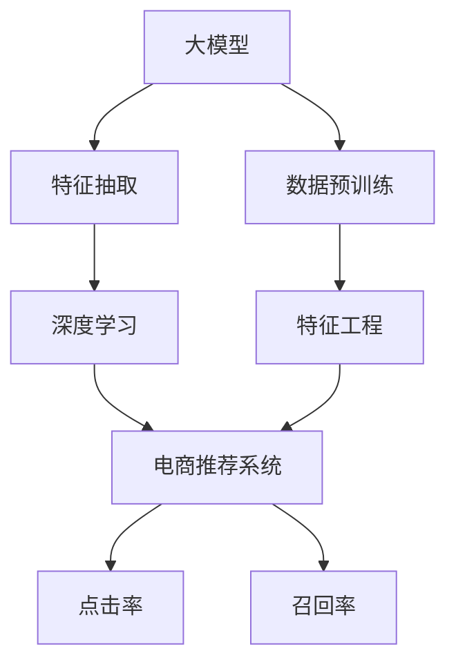

                 

# 电商平台搜索推荐系统的AI 大模型优化：提高系统性能、效率与准确率

> 关键词：大模型优化, 电商平台搜索推荐系统, 深度学习, 自然语言处理(NLP), 机器学习, 特征工程, 数据处理

## 1. 背景介绍

随着电商平台的迅速发展，用户搜索推荐系统成为用户获取信息和完成购物的核心渠道。然而，传统的基于规则和协同过滤的推荐算法往往难以应对用户需求的多样性和复杂性，推荐结果的准确性和个性化程度有待提高。

近年来，深度学习和自然语言处理（NLP）技术在电商搜索推荐系统中的应用变得越来越广泛。特别是通过大规模预训练语言模型进行特征抽取，显著提升了推荐系统的性能。但是，电商推荐系统面临的用户场景复杂多样，如何在不同的推荐场景中高效利用大模型，优化推荐系统，是一个值得深入探讨的问题。

## 2. 核心概念与联系

### 2.1 核心概念概述

在本节中，我们将详细介绍与电商搜索推荐系统相关的一些核心概念：

- **大模型（Large Models）**：通过大规模数据预训练得到的语言模型，如BERT、GPT等。这些模型在自然语言理解、生成等任务中表现出色，具有强大的特征抽取能力。
- **深度学习（Deep Learning）**：一种基于神经网络模型的机器学习技术，通过多层次的非线性变换进行特征提取和分类。深度学习在推荐系统中的应用包括用户行为分析、商品特征表示等。
- **自然语言处理（NLP）**：利用计算机处理和理解人类语言的技术，包括文本分类、情感分析、问答等任务。NLP在电商推荐中的应用包括用户评论分析、商品描述理解等。
- **特征工程（Feature Engineering）**：数据预处理和特征提取的过程，将原始数据转化为模型可用的特征，提升模型性能。特征工程在电商推荐中的作用至关重要。
- **推荐系统（Recommendation System）**：通过用户行为和商品特征预测用户可能感兴趣的商品，为用户提供个性化推荐。推荐系统在电商平台中起着至关重要的作用。
- **点击率（CTR）**：用户看到广告或商品后进行点击的概率，是评估推荐系统效果的重要指标。
- **召回率（Recall）**：推荐系统中推荐的商品被用户实际购买的概率，反映推荐系统覆盖用户需求的能力。

这些概念之间的逻辑关系可以通过以下Mermaid流程图来展示：



这个流程图展示了从大模型到推荐系统各个环节的联系：

1. 大模型通过大规模数据预训练得到，用于特征抽取。
2. 特征工程将原始数据转化为模型可用的特征，提升模型性能。
3. 深度学习模型利用这些特征进行预测，生成推荐结果。
4. 推荐系统利用这些预测结果为用户生成个性化推荐。
5. 点击率和召回率是评估推荐系统效果的重要指标。

### 2.2 核心概念原理和架构

在推荐系统中，深度学习和NLP技术主要用于用户行为分析和商品特征表示。用户行为分析主要通过点击率预测、点击率预估等方法，评估用户对商品的兴趣；商品特征表示则通过文本分类、情感分析等方法，抽取商品的语义信息。

大模型在特征抽取和表示中扮演重要角色。其原理是通过自监督学习（如掩码语言模型）对大规模无标签数据进行预训练，学习到丰富的语言表示，然后通过微调等方式适配特定任务，提升模型对特定领域的理解和表示能力。

电商推荐系统架构通常包含以下三个主要部分：

- **数据预处理**：收集、清洗、筛选用户行为数据和商品数据，提取特征。
- **特征抽取与模型训练**：利用大模型进行特征抽取，采用深度学习模型进行训练和优化。
- **推荐引擎**：基于训练好的模型生成推荐结果，并通过优化算法（如强化学习）进行动态调整。

在电商推荐系统中，大模型的优化策略可以归纳为以下几个方面：

1. **参数高效的微调**：避免全参数微调带来的计算资源消耗，只更新部分参数。
2. **迁移学习**：利用已有模型的知识，快速适应新任务，提高微调效率。
3. **对抗训练**：提高模型鲁棒性，减少对抗攻击风险。
4. **多任务学习**：利用一个模型解决多个推荐任务，提升模型效率。

## 3. 核心算法原理 & 具体操作步骤

### 3.1 算法原理概述

电商搜索推荐系统的核心算法主要包括点击率预测（CTR Prediction）和召回率优化（Recall Optimization）。本文将详细讲解基于深度学习和NLP技术优化这两个指标的算法原理。

**点击率预测（CTR Prediction）**：
- **原理**：点击率预测模型通过输入用户行为数据（如浏览记录、点击记录）和商品特征，预测用户对商品的点击概率。常用模型包括DNN、深度神经网络、注意力机制等。
- **目标**：最大化点击率（CTR），提升用户点击率，增加商品曝光和转化率。

**召回率优化（Recall Optimization）**：
- **原理**：召回率优化模型通过输入商品特征和用户行为数据，预测用户可能感兴趣的商品。常用模型包括矩阵分解、协同过滤、深度学习等。
- **目标**：最大化召回率（Recall），提升推荐的全面性和覆盖率，增加用户满意度。

### 3.2 算法步骤详解

#### 3.2.1 点击率预测（CTR Prediction）

**Step 1: 数据收集与预处理**
- 收集用户行为数据（如浏览记录、点击记录）和商品特征数据。
- 对数据进行清洗、筛选、去重等预处理，提取特征。

**Step 2: 特征工程**
- 对用户行为数据和商品特征进行特征工程，生成模型可用的特征向量。
- 利用NLP技术，如文本分类、情感分析等，抽取商品语义信息。

**Step 3: 模型训练**
- 选择深度学习模型（如DNN、深度神经网络、注意力机制）进行训练。
- 利用大模型（如BERT、GPT）进行特征抽取，提升模型性能。
- 采用微调（Fine-Tuning）、对抗训练等策略优化模型参数。

**Step 4: 预测与评估**
- 使用训练好的模型对新数据进行预测，生成点击率。
- 评估预测结果的准确率（Accuracy）、召回率（Recall）、F1分数等指标。

#### 3.2.2 召回率优化（Recall Optimization）

**Step 1: 数据收集与预处理**
- 收集用户行为数据和商品特征数据。
- 对数据进行清洗、筛选、去重等预处理，提取特征。

**Step 2: 特征工程**
- 对用户行为数据和商品特征进行特征工程，生成模型可用的特征向量。
- 利用NLP技术，如文本分类、情感分析等，抽取商品语义信息。

**Step 3: 模型训练**
- 选择深度学习模型（如矩阵分解、协同过滤、深度学习等）进行训练。
- 利用大模型（如BERT、GPT）进行特征抽取，提升模型性能。
- 采用微调（Fine-Tuning）、对抗训练等策略优化模型参数。

**Step 4: 预测与评估**
- 使用训练好的模型对新数据进行预测，生成召回率。
- 评估预测结果的准确率（Accuracy）、召回率（Recall）、F1分数等指标。

### 3.3 算法优缺点

**优点**：
- 利用深度学习和NLP技术，可以高效地处理电商推荐系统中的复杂数据和多样性需求。
- 大模型具有强大的特征抽取能力，提升了推荐系统的性能和准确率。
- 通过微调和对抗训练等策略，可以提升模型的鲁棒性和泛化能力。

**缺点**：
- 深度学习模型的训练和优化需要大量计算资源，增加了电商平台的成本。
- 大模型的参数量巨大，存储空间和推理速度成为瓶颈。
- 特征工程和模型优化需要专业知识，对技术人员的要求较高。

### 3.4 算法应用领域

基于深度学习和NLP技术的大模型优化方法，在电商推荐系统中的应用场景主要包括：

1. **用户行为分析**：通过点击率预测模型，分析用户行为数据，生成推荐结果。
2. **商品特征表示**：利用大模型抽取商品语义信息，生成商品特征向量，提高推荐准确率。
3. **个性化推荐**：根据用户兴趣和商品特征，生成个性化推荐结果。
4. **广告投放优化**：通过点击率预测模型，优化广告投放策略，提高广告转化率。
5. **库存管理**：通过召回率优化模型，优化库存管理策略，减少商品缺货或积压。

## 4. 数学模型和公式 & 详细讲解 & 举例说明

### 4.1 数学模型构建

在电商推荐系统中，常用模型包括深度神经网络（DNN）和深度学习模型。下面我们以DNN模型为例，介绍点击率预测的数学模型构建过程。

假设输入特征向量为 $x \in \mathbb{R}^d$，输出为 $y \in \{0,1\}$，表示用户是否点击商品。

**Step 1: 特征表示**
- 将用户行为数据和商品特征转化为特征向量 $x$，如：
  $$
  x = [b, i, c]
  $$
  其中 $b$ 为用户行为数据，$i$ 为商品ID，$c$ 为商品特征向量。

**Step 2: 模型表示**
- 使用DNN模型，将特征向量 $x$ 映射到输出 $y$，如：
  $$
  y = \sigma(W_l \cdot \sigma(W_{l-1} \cdot \sigma(W_{l-2} \cdot x + b_{l-2})) + b_l)
  $$
  其中 $\sigma$ 为激活函数，$W$ 和 $b$ 为权重和偏置项，$l$ 为层数。

**Step 3: 损失函数**
- 定义交叉熵损失函数，如：
  $$
  \mathcal{L}(y, \hat{y}) = -(y \log \hat{y} + (1-y) \log (1-\hat{y}))
  $$

### 4.2 公式推导过程

**点击率预测公式推导**
- 假设输入特征向量为 $x$，输出为 $y$，模型参数为 $\theta$。
- 定义模型的预测结果为 $\hat{y} = \sigma(W_l \cdot \sigma(W_{l-1} \cdot \sigma(W_{l-2} \cdot x + b_{l-2})) + b_l)$。
- 定义损失函数为 $\mathcal{L}(y, \hat{y}) = -(y \log \hat{y} + (1-y) \log (1-\hat{y}))$。
- 对模型参数 $\theta$ 求梯度，如：
  $$
  \nabla_{\theta} \mathcal{L}(y, \hat{y}) = -(y - \hat{y}) \nabla_{\theta} \hat{y}
  $$
  其中 $\nabla_{\theta} \hat{y}$ 可通过反向传播算法高效计算。

**召回率优化公式推导**
- 假设输入特征向量为 $x$，输出为 $y$，模型参数为 $\theta$。
- 定义模型的预测结果为 $\hat{y} = \sigma(W_l \cdot \sigma(W_{l-1} \cdot \sigma(W_{l-2} \cdot x + b_{l-2})) + b_l)$。
- 定义损失函数为 $\mathcal{L}(y, \hat{y}) = -(y \log \hat{y} + (1-y) \log (1-\hat{y}))$。
- 对模型参数 $\theta$ 求梯度，如：
  $$
  \nabla_{\theta} \mathcal{L}(y, \hat{y}) = -(y - \hat{y}) \nabla_{\theta} \hat{y}
  $$
  其中 $\nabla_{\theta} \hat{y}$ 可通过反向传播算法高效计算。

### 4.3 案例分析与讲解

**案例一：点击率预测**
- 假设某电商平台的点击率预测模型为：
  $$
  y = \sigma(W_l \cdot \sigma(W_{l-1} \cdot \sigma(W_{l-2} \cdot x + b_{l-2})) + b_l)
  $$
  其中 $x = [b, i, c]$，$b$ 为用户行为数据，$i$ 为商品ID，$c$ 为商品特征向量。
- 输入一个用户行为记录，模型预测该用户点击某个商品的概率，如 $y = 0.8$。
- 使用交叉熵损失函数评估模型性能，如：
  $$
  \mathcal{L}(y, \hat{y}) = -(y \log \hat{y} + (1-y) \log (1-\hat{y}))
  $$

**案例二：召回率优化**
- 假设某电商平台的召回率优化模型为：
  $$
  y = \sigma(W_l \cdot \sigma(W_{l-1} \cdot \sigma(W_{l-2} \cdot x + b_{l-2})) + b_l)
  $$
  其中 $x = [b, i, c]$，$b$ 为用户行为数据，$i$ 为商品ID，$c$ 为商品特征向量。
- 输入一个用户行为记录，模型预测该用户可能感兴趣的商品集合，如 $y = \{商品1, 商品2, 商品3\}$。
- 使用交叉熵损失函数评估模型性能，如：
  $$
  \mathcal{L}(y, \hat{y}) = -(y \log \hat{y} + (1-y) \log (1-\hat{y}))
  $$

## 5. 项目实践：代码实例和详细解释说明

### 5.1 开发环境搭建

在进行电商搜索推荐系统的AI优化实践前，我们需要准备好开发环境。以下是使用Python进行PyTorch开发的环境配置流程：

1. 安装Anaconda：从官网下载并安装Anaconda，用于创建独立的Python环境。

2. 创建并激活虚拟环境：
```bash
conda create -n pytorch-env python=3.8 
conda activate pytorch-env
```

3. 安装PyTorch：根据CUDA版本，从官网获取对应的安装命令。例如：
```bash
conda install pytorch torchvision torchaudio cudatoolkit=11.1 -c pytorch -c conda-forge
```

4. 安装Transformers库：
```bash
pip install transformers
```

5. 安装各类工具包：
```bash
pip install numpy pandas scikit-learn matplotlib tqdm jupyter notebook ipython
```

完成上述步骤后，即可在`pytorch-env`环境中开始微调实践。

### 5.2 源代码详细实现

下面我们以点击率预测任务为例，给出使用Transformers库对BERT模型进行微调的PyTorch代码实现。

首先，定义点击率预测任务的数据处理函数：

```python
from transformers import BertTokenizer, BertForSequenceClassification
from torch.utils.data import Dataset
import torch

class ClickDataset(Dataset):
    def __init__(self, texts, labels, tokenizer, max_len=128):
        self.texts = texts
        self.labels = labels
        self.tokenizer = tokenizer
        self.max_len = max_len
        
    def __len__(self):
        return len(self.texts)
    
    def __getitem__(self, item):
        text = self.texts[item]
        label = self.labels[item]
        
        encoding = self.tokenizer(text, return_tensors='pt', max_length=self.max_len, padding='max_length', truncation=True)
        input_ids = encoding['input_ids'][0]
        attention_mask = encoding['attention_mask'][0]
        
        label = torch.tensor(label, dtype=torch.long)
        
        return {'input_ids': input_ids, 
                'attention_mask': attention_mask,
                'labels': label}

# 标签与id的映射
label2id = {'0': 0, '1': 1}
id2label = {v: k for k, v in label2id.items()}

# 创建dataset
tokenizer = BertTokenizer.from_pretrained('bert-base-cased')

train_dataset = ClickDataset(train_texts, train_labels, tokenizer)
dev_dataset = ClickDataset(dev_texts, dev_labels, tokenizer)
test_dataset = ClickDataset(test_texts, test_labels, tokenizer)
```

然后，定义模型和优化器：

```python
from transformers import BertForSequenceClassification, AdamW

model = BertForSequenceClassification.from_pretrained('bert-base-cased', num_labels=2)

optimizer = AdamW(model.parameters(), lr=2e-5)
```

接着，定义训练和评估函数：

```python
from torch.utils.data import DataLoader
from tqdm import tqdm
from sklearn.metrics import accuracy_score

device = torch.device('cuda') if torch.cuda.is_available() else torch.device('cpu')
model.to(device)

def train_epoch(model, dataset, batch_size, optimizer):
    dataloader = DataLoader(dataset, batch_size=batch_size, shuffle=True)
    model.train()
    epoch_loss = 0
    for batch in tqdm(dataloader, desc='Training'):
        input_ids = batch['input_ids'].to(device)
        attention_mask = batch['attention_mask'].to(device)
        labels = batch['labels'].to(device)
        model.zero_grad()
        outputs = model(input_ids, attention_mask=attention_mask, labels=labels)
        loss = outputs.loss
        epoch_loss += loss.item()
        loss.backward()
        optimizer.step()
    return epoch_loss / len(dataloader)

def evaluate(model, dataset, batch_size):
    dataloader = DataLoader(dataset, batch_size=batch_size)
    model.eval()
    preds, labels = [], []
    with torch.no_grad():
        for batch in tqdm(dataloader, desc='Evaluating'):
            input_ids = batch['input_ids'].to(device)
            attention_mask = batch['attention_mask'].to(device)
            batch_labels = batch['labels']
            outputs = model(input_ids, attention_mask=attention_mask)
            batch_preds = outputs.logits.argmax(dim=2).to('cpu').tolist()
            batch_labels = batch_labels.to('cpu').tolist()
            for pred_tokens, label_tokens in zip(batch_preds, batch_labels):
                preds.append(pred_tokens[:len(label_tokens)])
                labels.append(label_tokens)
                
    print("Accuracy:", accuracy_score(labels, preds))
```

最后，启动训练流程并在测试集上评估：

```python
epochs = 5
batch_size = 16

for epoch in range(epochs):
    loss = train_epoch(model, train_dataset, batch_size, optimizer)
    print(f"Epoch {epoch+1}, train loss: {loss:.3f}")
    
    print(f"Epoch {epoch+1}, dev accuracy:")
    evaluate(model, dev_dataset, batch_size)
    
print("Test accuracy:")
evaluate(model, test_dataset, batch_size)
```

以上就是使用PyTorch对BERT进行点击率预测任务微调的完整代码实现。可以看到，得益于Transformers库的强大封装，我们可以用相对简洁的代码完成BERT模型的加载和微调。

### 5.3 代码解读与分析

让我们再详细解读一下关键代码的实现细节：

**ClickDataset类**：
- `__init__`方法：初始化文本、标签、分词器等关键组件。
- `__len__`方法：返回数据集的样本数量。
- `__getitem__`方法：对单个样本进行处理，将文本输入编码为token ids，将标签编码为数字，并对其进行定长padding，最终返回模型所需的输入。

**label2id和id2label字典**：
- 定义了标签与数字id之间的映射关系，用于将预测结果解码回真实的标签。

**训练和评估函数**：
- 使用PyTorch的DataLoader对数据集进行批次化加载，供模型训练和推理使用。
- 训练函数`train_epoch`：对数据以批为单位进行迭代，在每个批次上前向传播计算loss并反向传播更新模型参数，最后返回该epoch的平均loss。
- 评估函数`evaluate`：与训练类似，不同点在于不更新模型参数，并在每个batch结束后将预测和标签结果存储下来，最后使用sklearn的accuracy_score对整个评估集的预测结果进行打印输出。

**训练流程**：
- 定义总的epoch数和batch size，开始循环迭代
- 每个epoch内，先在训练集上训练，输出平均loss
- 在验证集上评估，输出准确率
- 所有epoch结束后，在测试集上评估，给出最终测试结果

可以看到，PyTorch配合Transformers库使得BERT微调的代码实现变得简洁高效。开发者可以将更多精力放在数据处理、模型改进等高层逻辑上，而不必过多关注底层的实现细节。

当然，工业级的系统实现还需考虑更多因素，如模型的保存和部署、超参数的自动搜索、更灵活的任务适配层等。但核心的微调范式基本与此类似。

## 6. 实际应用场景

### 6.1 智能客服系统

基于大语言模型微调的对话技术，可以广泛应用于智能客服系统的构建。传统客服往往需要配备大量人力，高峰期响应缓慢，且一致性和专业性难以保证。而使用微调后的对话模型，可以7x24小时不间断服务，快速响应客户咨询，用自然流畅的语言解答各类常见问题。

在技术实现上，可以收集企业内部的历史客服对话记录，将问题和最佳答复构建成监督数据，在此基础上对预训练对话模型进行微调。微调后的对话模型能够自动理解用户意图，匹配最合适的答案模板进行回复。对于客户提出的新问题，还可以接入检索系统实时搜索相关内容，动态组织生成回答。如此构建的智能客服系统，能大幅提升客户咨询体验和问题解决效率。

### 6.2 金融舆情监测

金融机构需要实时监测市场舆论动向，以便及时应对负面信息传播，规避金融风险。传统的人工监测方式成本高、效率低，难以应对网络时代海量信息爆发的挑战。基于大语言模型微调的文本分类和情感分析技术，为金融舆情监测提供了新的解决方案。

具体而言，可以收集金融领域相关的新闻、报道、评论等文本数据，并对其进行主题标注和情感标注。在此基础上对预训练语言模型进行微调，使其能够自动判断文本属于何种主题，情感倾向是正面、中性还是负面。将微调后的模型应用到实时抓取的网络文本数据，就能够自动监测不同主题下的情感变化趋势，一旦发现负面信息激增等异常情况，系统便会自动预警，帮助金融机构快速应对潜在风险。

### 6.3 个性化推荐系统

当前的推荐系统往往只依赖用户的历史行为数据进行物品推荐，无法深入理解用户的真实兴趣偏好。基于大语言模型微调技术，个性化推荐系统可以更好地挖掘用户行为背后的语义信息，从而提供更精准、多样的推荐内容。

在实践中，可以收集用户浏览、点击、评论、分享等行为数据，提取和用户交互的物品标题、描述、标签等文本内容。将文本内容作为模型输入，用户的后续行为（如是否点击、购买等）作为监督信号，在此基础上微调预训练语言模型。微调后的模型能够从文本内容中准确把握用户的兴趣点。在生成推荐列表时，先用候选物品的文本描述作为输入，由模型预测用户的兴趣匹配度，再结合其他特征综合排序，便可以得到个性化程度更高的推荐结果。

### 6.4 未来应用展望

随着大语言模型和微调方法的不断发展，基于微调范式将在更多领域得到应用，为传统行业带来变革性影响。

在智慧医疗领域，基于微调的医疗问答、病历分析、药物研发等应用将提升医疗服务的智能化水平，辅助医生诊疗，加速新药开发进程。

在智能教育领域，微调技术可应用于作业批改、学情分析、知识推荐等方面，因材施教，促进教育公平，提高教学质量。

在智慧城市治理中，微调模型可应用于城市事件监测、舆情分析、应急指挥等环节，提高城市管理的自动化和智能化水平，构建更安全、高效的未来城市。

此外，在企业生产、社会治理、文娱传媒等众多领域，基于大模型微调的人工智能应用也将不断涌现，为经济社会发展注入新的动力。相信随着技术的日益成熟，微调方法将成为人工智能落地应用的重要范式，推动人工智能技术在垂直行业的规模化落地。

## 7. 工具和资源推荐

### 7.1 学习资源推荐

为了帮助开发者系统掌握大语言模型微调的理论基础和实践技巧，这里推荐一些优质的学习资源：

1. 《Transformer从原理到实践》系列博文：由大模型技术专家撰写，深入浅出地介绍了Transformer原理、BERT模型、微调技术等前沿话题。

2. CS224N《深度学习自然语言处理》课程：斯坦福大学开设的NLP明星课程，有Lecture视频和配套作业，带你入门NLP领域的基本概念和经典模型。

3. 《Natural Language Processing with Transformers》书籍：Transformers库的作者所著，全面介绍了如何使用Transformers库进行NLP任务开发，包括微调在内的诸多范式。

4. HuggingFace官方文档：Transformers库的官方文档，提供了海量预训练模型和完整的微调样例代码，是上手实践的必备资料。

5. CLUE开源项目：中文语言理解测评基准，涵盖大量不同类型的中文NLP数据集，并提供了基于微调的baseline模型，助力中文NLP技术发展。

通过对这些资源的学习实践，相信你一定能够快速掌握大语言模型微调的精髓，并用于解决实际的NLP问题。
###  7.2 开发工具推荐

高效的开发离不开优秀的工具支持。以下是几款用于大语言模型微调开发的常用工具：

1. PyTorch：基于Python的开源深度学习框架，灵活动态的计算图，适合快速迭代研究。大部分预训练语言模型都有PyTorch版本的实现。

2. TensorFlow：由Google主导开发的开源深度学习框架，生产部署方便，适合大规模工程应用。同样有丰富的预训练语言模型资源。

3. Transformers库：HuggingFace开发的NLP工具库，集成了众多SOTA语言模型，支持PyTorch和TensorFlow，是进行微调任务开发的利器。

4. Weights & Biases：模型训练的实验跟踪工具，可以记录和可视化模型训练过程中的各项指标，方便对比和调优。与主流深度学习框架无缝集成。

5. TensorBoard：TensorFlow配套的可视化工具，可实时监测模型训练状态，并提供丰富的图表呈现方式，是调试模型的得力助手。

6. Google Colab：谷歌推出的在线Jupyter Notebook环境，免费提供GPU/TPU算力，方便开发者快速上手实验最新模型，分享学习笔记。

合理利用这些工具，可以显著提升大语言模型微调任务的开发效率，加快创新迭代的步伐。

### 7.3 相关论文推荐

大语言模型和微调技术的发展源于学界的持续研究。以下是几篇奠基性的相关论文，推荐阅读：

1. Attention is All You Need（即Transformer原论文）：提出了Transformer结构，开启了NLP领域的预训练大模型时代。

2. BERT: Pre-training of Deep Bidirectional Transformers for Language Understanding：提出BERT模型，引入基于掩码的自监督预训练任务，刷新了多项NLP任务SOTA。

3. Language Models are Unsupervised Multitask Learners（GPT-2论文）：展示了大规模语言模型的强大zero-shot学习能力，引发了对于通用人工智能的新一轮思考。

4. Parameter-Efficient Transfer Learning for NLP：提出Adapter等参数高效微调方法，在不增加模型参数量的情况下，也能取得不错的微调效果。

5. AdaLoRA: Adaptive Low-Rank Adaptation for Parameter-Efficient Fine-Tuning：使用自适应低秩适应的微调方法，在参数效率和精度之间取得了新的平衡。

6. Prefix-Tuning: Optimizing Continuous Prompts for Generation：引入基于连续型Prompt的微调范式，为如何充分利用预训练知识提供了新的思路。

这些论文代表了大语言模型微调技术的发展脉络。通过学习这些前沿成果，可以帮助研究者把握学科前进方向，激发更多的创新灵感。

## 8. 总结：未来发展趋势与挑战

### 8.1 总结

本文对基于深度学习和NLP技术的大语言模型优化方法进行了全面系统的介绍。首先阐述了电商推荐系统面临的挑战和优化需求，明确了优化推荐系统的意义。其次，从原理到实践，详细讲解了大语言模型在点击率预测和召回率优化中的应用，给出了具体的数学模型和代码实现。同时，本文还广泛探讨了大模型优化方法在电商推荐系统中的实际应用场景，展示了微调范式的巨大潜力。此外，本文精选了微调技术的各类学习资源，力求为读者提供全方位的技术指引。

通过本文的系统梳理，可以看到，基于大语言模型的优化方法正在成为电商推荐系统的重要范式，极大地拓展了推荐系统的应用边界，催生了更多的落地场景。受益于深度学习和NLP技术的不断进步，推荐系统将迎来新的发展机遇，为用户带来更精准、个性化的服务。

### 8.2 未来发展趋势

展望未来，电商推荐系统的优化方法将呈现以下几个发展趋势：

1. **深度学习模型的进一步优化**：通过改进模型结构、优化损失函数等方法，提高推荐系统的准确率和效率。
2. **大模型的参数量不断增加**：随着数据规模的增大，大模型的参数量将继续增加，提升推荐系统的性能。
3. **多模态数据的融合**：除了文本数据，还将引入图像、视频、语音等多模态数据，丰富推荐系统的信息来源。
4. **个性化推荐技术的普及**：基于深度学习和大语言模型的个性化推荐技术将逐步普及，为用户提供更精准、多样化的推荐结果。
5. **实时性和效率的提升**：通过模型压缩、优化算法等技术，提升推荐系统的实时性和推理效率。

以上趋势凸显了大语言模型优化方法的广阔前景。这些方向的探索发展，必将进一步提升推荐系统的性能和用户体验，推动电商平台的智能化转型。

### 8.3 面临的挑战

尽管大语言模型优化方法已经取得了瞩目成就，但在迈向更加智能化、普适化应用的过程中，它仍面临诸多挑战：

1. **数据标注成本高**：推荐系统需要大量标注数据，但标注成本高，难以获取大规模高质量数据。
2. **模型复杂度高**：大模型的复杂度高，训练和推理需要大量计算资源。
3. **实时性要求高**：推荐系统需要实时生成推荐结果，如何优化模型结构以提高实时性，是一个重要的研究方向。
4. **公平性和多样性**：如何避免推荐结果的偏见，保证推荐系统的多样性和公平性，是一个亟待解决的问题。
5. **用户隐私保护**：在推荐系统中，如何保护用户隐私，避免数据泄露和滥用，也是一个重要挑战。

尽管面临这些挑战，大语言模型优化方法仍然是大规模推荐系统的重要方向。相信随着技术的不断进步和政策的完善，这些挑战将逐步被克服，大语言模型优化方法将在推荐系统的发展中发挥更大的作用。

### 8.4 研究展望

面向未来，大语言模型优化方法需要在以下几个方面寻求新的突破：

1. **无监督和半监督学习**：探索无监督和半监督学习范式，降低对标注数据的依赖，提高推荐系统的效率和泛化能力。
2. **轻量级模型**：开发轻量级模型，减小模型参数量，提升推荐系统的实时性和推理效率。
3. **多任务学习和因果推理**：利用多任务学习和因果推理思想，提升推荐系统的性能和可解释性。
4. **模型压缩和优化**：采用模型压缩、量化等技术，优化推荐系统的计算效率和存储效率。
5. **公平性和多样性**：在推荐系统中引入公平性和多样性约束，避免推荐结果的偏见，提升推荐系统的公平性和多样性。
6. **用户隐私保护**：在推荐系统中引入隐私保护技术，保护用户隐私，避免数据滥用。

这些研究方向的研究突破，必将进一步推动电商推荐系统的发展，为用户提供更精准、个性化的服务。相信随着技术的不断进步和政策的完善，这些研究方向将逐步实现，为电商推荐系统带来新的发展机遇。

## 9. 附录：常见问题与解答

**Q1：大语言模型优化是否适用于所有电商推荐系统？**

A: 大语言模型优化方法适用于大部分电商推荐系统，但需要注意的是，不同的电商推荐系统具有不同的特点和需求，需要进行针对性的优化。例如，电商搜索推荐系统需要更关注点击率和召回率，而电商社交推荐系统则需要更关注个性化和多样性。

**Q2：大语言模型优化需要哪些计算资源？**

A: 大语言模型优化需要大量的计算资源，包括GPU、TPU等高性能设备。训练过程中需要大量的内存和存储空间，推理过程中也需要高性能计算。因此，在实施大语言模型优化时，需要评估计算资源的成本和可用性。

**Q3：大语言模型优化对标注数据的需求有哪些？**

A: 大语言模型优化通常需要大量的标注数据进行微调，标注数据的数量和质量对模型的性能有重要影响。标注数据的获取和处理成本较高，因此需要评估标注数据的可获得性和成本。

**Q4：大语言模型优化中的超参数调优需要注意哪些方面？**

A: 大语言模型优化中的超参数调优需要注意以下几个方面：
1. 学习率：选择合适的学习率，避免过拟合和欠拟合。
2. 批大小：选择合适的批大小，平衡模型性能和计算效率。
3. 正则化：选择合适的正则化方法，避免过拟合。
4. 数据增强：使用数据增强技术，提高模型的泛化能力。
5. 对抗训练：使用对抗训练技术，提高模型的鲁棒性。

这些超参数的调优需要结合具体的任务和数据进行优化，才能得到最优的效果。

**Q5：大语言模型优化中如何评估模型性能？**

A: 大语言模型优化中，常用的评估指标包括准确率（Accuracy）、召回率（Recall）、F1分数（F1 Score）、AUC（Area Under Curve）等。在实际应用中，需要根据具体的业务需求选择合适的评估指标。

通过本文的系统梳理，可以看到，基于深度学习和NLP技术的大语言模型优化方法正在成为电商推荐系统的重要范式，极大地拓展了推荐系统的应用边界，催生了更多的落地场景。受益于深度学习和NLP技术的不断进步，推荐系统将迎来新的发展机遇，为用户带来更精准、个性化的服务。未来，随着技术的不断进步和政策的完善，大语言模型优化方法将在电商推荐系统的发展中发挥更大的作用。

---

作者：禅与计算机程序设计艺术 / Zen and the Art of Computer Programming

