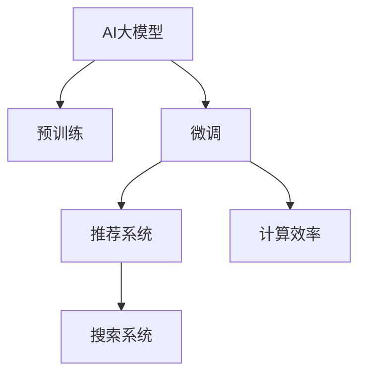
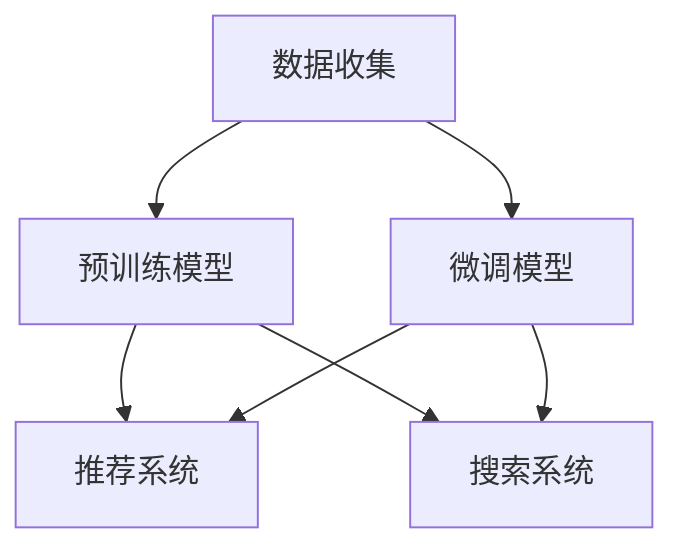

                 

## 1. 背景介绍

随着电商平台的快速发展，搜索推荐系统已经成为用户体验的核心功能之一。然而，传统的搜索推荐算法往往依赖于规则和特征工程，难以在大规模数据上高效运行。近年来，深度学习技术被引入搜索推荐系统，尤其是预训练语言模型，为构建更智能、更高效的搜索推荐系统提供了新的可能性。

基于此，本文将探讨如何在电商平台搜索推荐系统中应用AI大模型，从而提高系统性能、效率和效果。我们将详细讨论大模型的原理、实现步骤、优缺点、应用领域，并结合具体案例进行讲解，以期为电商平台开发者提供指导。

## 2. 核心概念与联系

### 2.1 核心概念概述

为更好地理解AI大模型在电商平台搜索推荐系统中的应用，本节将介绍几个关键概念：

- **AI大模型**：以自回归（如GPT）或自编码（如BERT）模型为代表的大规模预训练语言模型。通过在大规模无标签文本语料上进行预训练，学习到丰富的语言知识和常识，具备强大的语言理解和生成能力。
- **预训练**：指在大规模无标签文本语料上，通过自监督学习任务训练通用语言模型的过程。常见的预训练任务包括言语建模、遮挡语言模型等。
- **微调**：指在预训练模型的基础上，使用下游任务的少量标注数据，通过有监督学习优化模型在特定任务上的性能。
- **推荐系统**：通过分析用户行为和物品属性，为用户推荐最相关的产品。
- **搜索系统**：通过分析用户查询和文档内容，为用户返回最相关的搜索结果。
- **计算效率**：指系统在处理数据时的速度和资源消耗。

这些核心概念之间的逻辑关系可以通过以下Mermaid流程图来展示：



### 2.2 核心概念原理和架构的 Mermaid 流程图

在电商平台搜索推荐系统中，AI大模型的应用主要涉及预训练和微调两个环节。以下是一个简化的架构图：



这个架构图展示了大模型在电商平台中的应用：

1. 数据收集：电商平台收集用户行为数据和产品信息，用于训练和评估模型。
2. 预训练模型：使用大规模无标签文本数据训练通用大模型，学习语言表示。
3. 微调模型：在预训练模型的基础上，使用少量标注数据训练特定任务的模型，提高推荐和搜索的准确性。
4. 推荐系统：将微调后的模型应用于推荐，为用户推荐产品。
5. 搜索系统：将微调后的模型应用于搜索，为用户返回搜索结果。

## 3. 核心算法原理 & 具体操作步骤

### 3.1 算法原理概述

基于AI大模型的推荐系统，主要通过以下步骤实现：

1. **数据收集**：收集电商平台的用户行为数据和产品信息，如点击记录、浏览记录、购买记录等。
2. **预训练**：使用大规模无标签文本数据训练通用大模型，学习到通用的语言表示。
3. **微调**：在预训练模型的基础上，使用下游任务的少量标注数据，通过有监督学习优化模型在特定任务上的性能。
4. **模型应用**：将微调后的模型应用于推荐和搜索系统，提升系统的性能和效果。

### 3.2 算法步骤详解

以下是基于AI大模型的推荐系统的主要算法步骤：

1. **数据准备**：
   - 收集电商平台的用户行为数据和产品信息，包括点击记录、浏览记录、购买记录等。
   - 清洗数据，去除噪声和重复数据，处理缺失值。

2. **预训练模型选择**：
   - 选择合适的预训练模型，如BERT、GPT等。
   - 使用大规模无标签文本数据，如维基百科、新闻等，训练预训练模型。

3. **微调模型设计**：
   - 设计微调模型的结构，选择合适的输出层和损失函数。
   - 确定微调的超参数，如学习率、批量大小、迭代轮数等。

4. **微调训练**：
   - 准备微调数据，将用户行为数据和产品信息转化为模型输入和标签。
   - 使用微调数据训练模型，最小化损失函数。
   - 定期在验证集上评估模型性能，防止过拟合。

5. **模型应用**：
   - 将微调后的模型应用于推荐系统，为用户推荐产品。
   - 将微调后的模型应用于搜索系统，为用户返回搜索结果。

### 3.3 算法优缺点

基于AI大模型的推荐系统具有以下优点：

1. **性能提升**：AI大模型可以学习到丰富的语言知识，提升推荐和搜索的准确性。
2. **计算效率**：AI大模型的推理速度快，能够实时响应用户请求。
3. **泛化能力强**：AI大模型在多个任务上表现优异，能够适应不同的用户需求。

同时，该方法也存在一定的局限性：

1. **数据需求高**：需要大量的用户行为数据和产品信息，数据收集和处理成本高。
2. **模型复杂**：AI大模型的结构复杂，训练和推理需要高性能硬件。
3. **资源消耗大**：AI大模型在大规模数据上训练需要大量计算资源，存储和部署成本高。

### 3.4 算法应用领域

基于AI大模型的推荐系统，已经在电商平台搜索推荐、社交网络内容推荐、视频平台内容推荐等诸多领域得到了广泛应用。以下是几个典型应用案例：

1. **电商平台搜索推荐**：
   - 使用AI大模型对用户查询和产品信息进行语义匹配，为用户推荐最相关的产品。
   - 使用AI大模型对用户行为进行分析，预测用户兴趣，推荐个性化产品。

2. **社交网络内容推荐**：
   - 使用AI大模型对用户评论和帖子进行语义分析，为用户推荐最相关的内容。
   - 使用AI大模型对用户互动进行分析，预测用户兴趣，推荐个性化内容。

3. **视频平台内容推荐**：
   - 使用AI大模型对视频标题和描述进行语义匹配，为用户推荐最相关的视频。
   - 使用AI大模型对用户观看行为进行分析，预测用户兴趣，推荐个性化视频。

## 4. 数学模型和公式 & 详细讲解 & 举例说明

### 4.1 数学模型构建

在电商平台搜索推荐系统中，使用AI大模型进行推荐时，通常需要构建以下数学模型：

1. **用户表示模型**：使用预训练模型将用户查询和行为转化为向量表示。
2. **物品表示模型**：使用预训练模型将产品信息转化为向量表示。
3. **推荐模型**：使用预训练模型将用户表示和物品表示进行匹配，计算推荐得分。

### 4.2 公式推导过程

假设用户查询为 $q$，物品为 $i$，预训练模型为 $M_{\theta}$，则用户表示 $u(q)$ 和物品表示 $v(i)$ 可以通过如下公式计算：

$$
u(q) = M_{\theta}(q)
$$

$$
v(i) = M_{\theta}(i)
$$

推荐得分 $r$ 可以通过如下公式计算：

$$
r(q, i) = u(q)^Tv(i)
$$

### 4.3 案例分析与讲解

以电商平台搜索推荐为例，使用BERT模型作为预训练模型，进行用户查询和产品信息的语义匹配，为用户推荐最相关的产品。

首先，收集电商平台的用户查询和产品信息，并进行数据预处理。然后，使用BERT模型对用户查询和产品信息进行向量表示。具体步骤如下：

1. **数据准备**：
   - 收集用户查询和产品信息，如用户查询“鞋子”，产品信息“运动鞋”。
   - 对数据进行清洗和预处理，去除噪声和重复数据。

2. **预训练模型选择**：
   - 选择BERT模型作为预训练模型。
   - 使用大规模无标签文本数据训练BERT模型。

3. **微调模型设计**：
   - 设计微调模型结构，选择合适的输出层和损失函数。
   - 确定微调超参数，如学习率、批量大小、迭代轮数等。

4. **微调训练**：
   - 准备微调数据，将用户查询和产品信息转化为模型输入和标签。
   - 使用微调数据训练模型，最小化损失函数。
   - 定期在验证集上评估模型性能，防止过拟合。

5. **模型应用**：
   - 将微调后的模型应用于推荐系统，为用户推荐最相关的产品。
   - 将微调后的模型应用于搜索系统，为用户返回最相关的搜索结果。

## 5. 项目实践：代码实例和详细解释说明

### 5.1 开发环境搭建

在进行搜索推荐系统开发前，我们需要准备好开发环境。以下是使用Python进行PyTorch开发的环境配置流程：

1. 安装Anaconda：从官网下载并安装Anaconda，用于创建独立的Python环境。

2. 创建并激活虚拟环境：
```bash
conda create -n pytorch-env python=3.8 
conda activate pytorch-env
```

3. 安装PyTorch：根据CUDA版本，从官网获取对应的安装命令。例如：
```bash
conda install pytorch torchvision torchaudio cudatoolkit=11.1 -c pytorch -c conda-forge
```

4. 安装Transformer库：
```bash
pip install transformers
```

5. 安装各类工具包：
```bash
pip install numpy pandas scikit-learn matplotlib tqdm jupyter notebook ipython
```

完成上述步骤后，即可在`pytorch-env`环境中开始搜索推荐系统开发。

### 5.2 源代码详细实现

我们以使用BERT模型进行电商平台搜索推荐为例，给出完整的PyTorch代码实现。

首先，定义推荐系统的模型类：

```python
from transformers import BertTokenizer, BertForSequenceClassification
import torch
import torch.nn as nn

class RecommendationModel(nn.Module):
    def __init__(self, num_labels):
        super(RecommendationModel, self).__init__()
        self.bert = BertForSequenceClassification.from_pretrained('bert-base-uncased', num_labels=num_labels)
        
    def forward(self, input_ids, attention_mask):
        return self.bert(input_ids=input_ids, attention_mask=attention_mask, output_hidden_states=False, return_dict=False)
```

然后，定义训练和评估函数：

```python
from torch.utils.data import DataLoader
from tqdm import tqdm
from sklearn.metrics import accuracy_score

def train_epoch(model, train_loader, optimizer):
    model.train()
    total_loss = 0
    total_correct = 0
    for batch in tqdm(train_loader, desc='Training'):
        input_ids = batch['input_ids'].to(device)
        attention_mask = batch['attention_mask'].to(device)
        labels = batch['labels'].to(device)
        optimizer.zero_grad()
        outputs = model(input_ids, attention_mask)
        loss = outputs.loss
        total_loss += loss.item()
        correct = torch.argmax(outputs.predictions, dim=1) == labels
        total_correct += correct.sum().item()
        loss.backward()
        optimizer.step()
    return total_loss / len(train_loader), total_correct / len(train_loader.dataset)

def evaluate(model, test_loader):
    model.eval()
    total_correct = 0
    for batch in tqdm(test_loader, desc='Evaluating'):
        input_ids = batch['input_ids'].to(device)
        attention_mask = batch['attention_mask'].to(device)
        labels = batch['labels'].to(device)
        outputs = model(input_ids, attention_mask)
        correct = torch.argmax(outputs.predictions, dim=1) == labels
        total_correct += correct.sum().item()
    return total_correct / len(test_loader.dataset)
```

最后，启动训练流程并在测试集上评估：

```python
epochs = 5
batch_size = 16
learning_rate = 2e-5

device = torch.device('cuda') if torch.cuda.is_available() else torch.device('cpu')
model.to(device)

train_loader = DataLoader(train_dataset, batch_size=batch_size, shuffle=True)
test_loader = DataLoader(test_dataset, batch_size=batch_size, shuffle=False)

optimizer = torch.optim.AdamW(model.parameters(), lr=learning_rate)

for epoch in range(epochs):
    loss, accuracy = train_epoch(model, train_loader, optimizer)
    print(f'Epoch {epoch+1}, loss: {loss:.3f}, accuracy: {accuracy:.3f}')
    
    accuracy = evaluate(model, test_loader)
    print(f'Epoch {epoch+1}, test accuracy: {accuracy:.3f}')
```

以上就是使用PyTorch对BERT进行电商平台搜索推荐系统微调的完整代码实现。可以看到，得益于Transformer库的强大封装，我们可以用相对简洁的代码完成BERT模型的加载和微调。

### 5.3 代码解读与分析

让我们再详细解读一下关键代码的实现细节：

**RecommendationModel类**：
- `__init__`方法：初始化BERT模型和相关参数。
- `forward`方法：前向传播计算推荐得分。

**训练和评估函数**：
- 使用PyTorch的DataLoader对数据集进行批次化加载，供模型训练和推理使用。
- 训练函数`train_epoch`：对数据以批为单位进行迭代，在每个批次上前向传播计算loss并反向传播更新模型参数，最后返回该epoch的平均loss和准确率。
- 评估函数`evaluate`：与训练类似，不同点在于不更新模型参数，并在每个batch结束后将预测和标签结果存储下来，最后使用sklearn的accuracy_score对整个评估集的准确率进行打印输出。

**训练流程**：
- 定义总的epoch数和batch size，开始循环迭代
- 每个epoch内，先在训练集上训练，输出平均loss和准确率
- 在验证集上评估，输出准确率
- 所有epoch结束后，在测试集上评估，给出最终测试准确率

可以看到，PyTorch配合Transformer库使得BERT微调的代码实现变得简洁高效。开发者可以将更多精力放在数据处理、模型改进等高层逻辑上，而不必过多关注底层的实现细节。

当然，工业级的系统实现还需考虑更多因素，如模型的保存和部署、超参数的自动搜索、更灵活的任务适配层等。但核心的微调范式基本与此类似。

## 6. 实际应用场景

### 6.1 智能推荐系统

智能推荐系统是电商平台的核心功能之一。传统推荐系统往往依赖于规则和特征工程，难以在大规模数据上高效运行。而基于AI大模型的推荐系统，可以更好地利用用户的语言表达，进行更精准、个性化的推荐。

在技术实现上，可以收集用户评论、商品描述等文本数据，使用预训练语言模型进行向量表示，然后在微调后的模型上进行推荐计算。微调后的模型可以学习到更丰富的用户和商品语义信息，从而提升推荐效果。

### 6.2 个性化搜索

个性化搜索是电商平台的另一大核心功能。传统搜索系统往往只根据关键字匹配，无法理解用户真实的查询意图。而基于AI大模型的搜索系统，可以更好地理解用户的查询语义，提供更相关、更准确的搜索结果。

在技术实现上，可以收集用户查询和商品描述等文本数据，使用预训练语言模型进行向量表示，然后在微调后的模型上进行相似度计算。微调后的模型可以学习到更丰富的语义信息，从而提升搜索结果的准确性和相关性。

### 6.3 实时推荐与搜索

实时推荐与搜索是电商平台的刚需功能之一。传统推荐与搜索系统往往在计算性能和实时性方面存在瓶颈，难以满足用户的实时需求。而基于AI大模型的推荐与搜索系统，可以通过高效的模型推理和优化技术，实现实时推荐与搜索。

在技术实现上，可以使用GPU等高性能硬件加速模型推理，或者采用分布式计算技术，提高系统的处理能力。同时，可以使用缓存、索引等技术，优化数据访问，提升系统的响应速度。

### 6.4 未来应用展望

随着AI大模型和微调方法的不断发展，基于微调范式将在更多领域得到应用，为传统行业带来变革性影响。

在智慧医疗领域，基于AI大模型的推荐与搜索系统可以辅助医生诊断，推荐最适合的治疗方案。在智能制造领域，基于AI大模型的推荐与搜索系统可以推荐最优的生产方案，提高生产效率。在智慧交通领域，基于AI大模型的推荐与搜索系统可以推荐最优的路线方案，提升交通管理效率。

未来，伴随AI大模型和微调方法的持续演进，相信AI大模型将在更多领域得到应用，为各行各业带来新的变革和机遇。

## 7. 工具和资源推荐

### 7.1 学习资源推荐

为了帮助开发者系统掌握AI大模型在电商平台搜索推荐系统中的应用，这里推荐一些优质的学习资源：

1. 《Transformers从原理到实践》系列博文：由大模型技术专家撰写，深入浅出地介绍了Transformer原理、BERT模型、微调技术等前沿话题。

2. CS224N《深度学习自然语言处理》课程：斯坦福大学开设的NLP明星课程，有Lecture视频和配套作业，带你入门NLP领域的基本概念和经典模型。

3. 《Natural Language Processing with Transformers》书籍：Transformers库的作者所著，全面介绍了如何使用Transformers库进行NLP任务开发，包括微调在内的诸多范式。

4. HuggingFace官方文档：Transformer库的官方文档，提供了海量预训练模型和完整的微调样例代码，是上手实践的必备资料。

5. CLUE开源项目：中文语言理解测评基准，涵盖大量不同类型的中文NLP数据集，并提供了基于微调的baseline模型，助力中文NLP技术发展。

通过对这些资源的学习实践，相信你一定能够快速掌握AI大模型在电商平台搜索推荐系统中的应用，并用于解决实际的NLP问题。

### 7.2 开发工具推荐

高效的开发离不开优秀的工具支持。以下是几款用于AI大模型微调开发的常用工具：

1. PyTorch：基于Python的开源深度学习框架，灵活动态的计算图，适合快速迭代研究。大部分预训练语言模型都有PyTorch版本的实现。

2. TensorFlow：由Google主导开发的开源深度学习框架，生产部署方便，适合大规模工程应用。同样有丰富的预训练语言模型资源。

3. Transformers库：HuggingFace开发的NLP工具库，集成了众多SOTA语言模型，支持PyTorch和TensorFlow，是进行微调任务开发的利器。

4. Weights & Biases：模型训练的实验跟踪工具，可以记录和可视化模型训练过程中的各项指标，方便对比和调优。与主流深度学习框架无缝集成。

5. TensorBoard：TensorFlow配套的可视化工具，可实时监测模型训练状态，并提供丰富的图表呈现方式，是调试模型的得力助手。

6. Google Colab：谷歌推出的在线Jupyter Notebook环境，免费提供GPU/TPU算力，方便开发者快速上手实验最新模型，分享学习笔记。

合理利用这些工具，可以显著提升AI大模型微调任务的开发效率，加快创新迭代的步伐。

### 7.3 相关论文推荐

AI大模型和微调技术的发展源于学界的持续研究。以下是几篇奠基性的相关论文，推荐阅读：

1. Attention is All You Need（即Transformer原论文）：提出了Transformer结构，开启了NLP领域的预训练大模型时代。

2. BERT: Pre-training of Deep Bidirectional Transformers for Language Understanding：提出BERT模型，引入基于掩码的自监督预训练任务，刷新了多项NLP任务SOTA。

3. Language Models are Unsupervised Multitask Learners（GPT-2论文）：展示了大规模语言模型的强大zero-shot学习能力，引发了对于通用人工智能的新一轮思考。

4. Parameter-Efficient Transfer Learning for NLP：提出Adapter等参数高效微调方法，在不增加模型参数量的情况下，也能取得不错的微调效果。

5. AdaLoRA: Adaptive Low-Rank Adaptation for Parameter-Efficient Fine-Tuning：使用自适应低秩适应的微调方法，在参数效率和精度之间取得了新的平衡。

这些论文代表了大模型微调技术的发展脉络。通过学习这些前沿成果，可以帮助研究者把握学科前进方向，激发更多的创新灵感。

## 8. 总结：未来发展趋势与挑战

### 8.1 总结

本文对AI大模型在电商平台搜索推荐系统中的应用进行了全面系统的介绍。首先阐述了AI大模型的原理、实现步骤、优缺点和应用领域，明确了在电商平台搜索推荐系统中的应用效果。其次，从原理到实践，详细讲解了AI大模型的数学模型构建、公式推导过程和具体实现细节，提供了完整的代码示例。同时，本文还广泛探讨了AI大模型在电商平台搜索推荐系统的实际应用场景，展示了AI大模型的巨大潜力。

通过本文的系统梳理，可以看到，AI大模型在电商平台搜索推荐系统中的应用，能够显著提升系统的性能、效率和效果。未来，伴随AI大模型和微调方法的持续演进，基于AI大模型的推荐与搜索系统将在更多领域得到应用，为传统行业带来新的变革和机遇。

### 8.2 未来发展趋势

展望未来，AI大模型在电商平台搜索推荐系统中的应用将呈现以下几个发展趋势：

1. 模型规模持续增大。随着算力成本的下降和数据规模的扩张，预训练语言模型的参数量还将持续增长。超大规模语言模型蕴含的丰富语言知识，有望支撑更加复杂多变的搜索推荐任务。

2. 微调方法日趋多样。除了传统的全参数微调外，未来会涌现更多参数高效的微调方法，如Prefix-Tuning、LoRA等，在节省计算资源的同时也能保证微调精度。

3. 持续学习成为常态。随着数据分布的不断变化，微调模型也需要持续学习新知识以保持性能。如何在不遗忘原有知识的同时，高效吸收新样本信息，将成为重要的研究课题。

4. 标注样本需求降低。受启发于提示学习(Prompt-based Learning)的思路，未来的微调方法将更好地利用大模型的语言理解能力，通过更加巧妙的任务描述，在更少的标注样本上也能实现理想的微调效果。

5. 计算效率提升。随着深度学习硬件的不断升级，搜索推荐系统的计算效率将得到显著提升，能够实时响应用户的查询需求。

6. 多模态搜索推荐系统。未来的搜索推荐系统将不仅仅依赖文本数据，还可能融合图像、语音等多模态信息，提供更加全面、个性化的推荐服务。

以上趋势凸显了AI大模型在电商平台搜索推荐系统中的广阔前景。这些方向的探索发展，必将进一步提升搜索推荐系统的性能和用户体验，为电商平台的发展带来新的动力。

### 8.3 面临的挑战

尽管AI大模型在电商平台搜索推荐系统中的应用已经取得了瞩目成就，但在迈向更加智能化、普适化应用的过程中，它仍面临着诸多挑战：

1. 数据收集成本高。大规模用户行为数据和产品信息的收集和处理，需要大量人力和资源，数据收集成本较高。

2. 模型复杂度高。AI大模型的结构复杂，训练和推理需要高性能硬件，计算资源消耗大。

3. 标注数据需求高。需要大量的标注数据进行微调，标注数据质量直接影响系统性能。

4. 模型泛化能力弱。AI大模型在特定领域的泛化能力较弱，需要进行领域特定的微调。

5. 模型鲁棒性差。AI大模型在面对噪声和异常数据时，容易产生误导性输出。

6. 数据隐私和安全问题。收集和存储用户行为数据需要遵循数据隐私和安全法规，防止数据泄露和滥用。

7. 系统实时性要求高。搜索推荐系统需要实时响应用户请求，对系统的计算性能和实时性要求较高。

这些挑战需要通过技术创新和工程优化，逐步加以解决。

### 8.4 研究展望

未来，围绕AI大模型在电商平台搜索推荐系统中的应用，还需要进行以下研究：

1. 探索无监督和半监督微调方法。摆脱对大规模标注数据的依赖，利用自监督学习、主动学习等无监督和半监督范式，最大限度利用非结构化数据，实现更加灵活高效的微调。

2. 研究参数高效和计算高效的微调范式。开发更加参数高效的微调方法，在固定大部分预训练参数的同时，只更新极少量的任务相关参数。同时优化微调模型的计算图，减少前向传播和反向传播的资源消耗，实现更加轻量级、实时性的部署。

3. 融合因果和对比学习范式。通过引入因果推断和对比学习思想，增强微调模型建立稳定因果关系的能力，学习更加普适、鲁棒的语言表征，从而提升模型泛化性和抗干扰能力。

4. 引入更多先验知识。将符号化的先验知识，如知识图谱、逻辑规则等，与神经网络模型进行巧妙融合，引导微调过程学习更准确、合理的语言模型。同时加强不同模态数据的整合，实现视觉、语音等多模态信息与文本信息的协同建模。

5. 结合因果分析和博弈论工具。将因果分析方法引入微调模型，识别出模型决策的关键特征，增强输出解释的因果性和逻辑性。借助博弈论工具刻画人机交互过程，主动探索并规避模型的脆弱点，提高系统稳定性。

6. 纳入伦理道德约束。在模型训练目标中引入伦理导向的评估指标，过滤和惩罚有偏见、有害的输出倾向。同时加强人工干预和审核，建立模型行为的监管机制，确保输出符合人类价值观和伦理道德。

这些研究方向将推动AI大模型在电商平台搜索推荐系统中的应用走向成熟，为构建安全、可靠、可解释、可控的智能系统铺平道路。

## 9. 附录：常见问题与解答

**Q1：AI大模型在电商平台搜索推荐系统中如何使用？**

A: AI大模型在电商平台搜索推荐系统中主要通过预训练和微调两个环节实现。具体步骤如下：

1. 数据收集：收集电商平台的用户行为数据和产品信息，如点击记录、浏览记录、购买记录等。
2. 预训练模型选择：选择合适的预训练模型，如BERT、GPT等。
3. 预训练模型训练：使用大规模无标签文本数据训练预训练模型，学习到通用的语言表示。
4. 微调模型设计：设计微调模型的结构，选择合适的输出层和损失函数。
5. 微调模型训练：使用下游任务的少量标注数据训练微调模型，优化模型在特定任务上的性能。
6. 模型应用：将微调后的模型应用于推荐和搜索系统，提升系统的性能和效果。

**Q2：如何选择预训练模型和微调模型？**

A: 选择预训练模型和微调模型需要考虑以下几个因素：

1. 任务类型：不同的任务类型可能需要不同的预训练模型和微调模型。例如，文本分类任务可以使用BERT等预训练模型，生成任务可以使用GPT等预训练模型。
2. 数据分布：预训练模型的数据分布需要与任务数据分布相似，否则模型效果可能不佳。例如，使用中文数据训练的预训练模型，可能不适用于英文任务的微调。
3. 计算资源：预训练模型和微调模型的计算资源消耗较大，需要考虑平台的计算能力和硬件资源。例如，GPU/TPU等高性能设备是必不可少的，但训练和推理成本较高。
4. 任务复杂度：预训练模型和微调模型的复杂度需要与任务复杂度相匹配。例如，简单任务可以使用小规模模型，复杂任务需要使用大规模模型。
5. 实时性要求：预训练模型和微调模型的实时性要求需要与任务实时性要求相匹配。例如，实时推荐和搜索系统需要高效的模型推理和优化技术，以实时响应用户请求。

综合考虑以上因素，选择合适的预训练模型和微调模型，能够最大化提升搜索推荐系统的性能和效果。

**Q3：微调模型和预训练模型有什么区别？**

A: 微调模型和预训练模型有以下区别：

1. 训练数据：预训练模型在大规模无标签数据上进行预训练，学习通用的语言表示；微调模型在少量标注数据上进行微调，学习特定任务的表示。
2. 模型结构：预训练模型通常采用大规模的Transformer模型，层数较多，参数量较大；微调模型结构较为简单，参数量较小。
3. 训练目标：预训练模型的训练目标是学习通用的语言表示，优化损失函数；微调模型的训练目标是学习特定任务的表示，优化任务特定的损失函数。
4. 模型应用：预训练模型可以应用于多种下游任务，通用性强；微调模型通常应用于特定任务，专用性强。

综上所述，预训练模型和微调模型在训练目标和应用场景上有所不同，但都通过联合训练的方式，能够提升搜索推荐系统的性能和效果。

**Q4：如何评估微调模型的性能？**

A: 微调模型的性能评估通常使用以下指标：

1. 准确率：衡量模型在分类任务上的性能。例如，对于推荐系统中的推荐任务，准确率表示推荐结果的正确性。
2. 召回率：衡量模型对正样本的召回能力。例如，对于推荐系统中的推荐任务，召回率表示推荐结果的相关性。
3. F1分数：综合考虑准确率和召回率，衡量模型的整体性能。例如，对于推荐系统中的推荐任务，F1分数表示推荐结果的精确性和召回性的综合评价。
4. 平均准确率：衡量模型在多个数据集上的性能。例如，对于推荐系统中的推荐任务，平均准确率表示模型在不同数据集上的平均性能。

此外，还可以使用其他评估指标，如ROC曲线、AUC值、精确度-召回率曲线等，衡量模型在不同评估指标上的表现。

## 总结

本文详细探讨了AI大模型在电商平台搜索推荐系统中的应用，从原理到实践，系统讲解了AI大模型的数学模型构建、公式推导过程和具体实现细节，提供了完整的代码示例。同时，本文还广泛探讨了AI大模型在电商平台搜索推荐系统的实际应用场景，展示了AI大模型的巨大潜力。

未来，伴随AI大模型和微调方法的持续演进，基于AI大模型的推荐与搜索系统将在更多领域得到应用，为传统行业带来新的变革和机遇。相信随着AI大模型和微调技术的不断发展，搜索推荐系统将实现更高效、更精准、更个性化的服务，为电商平台的发展注入新的活力。

---

作者：禅与计算机程序设计艺术 / Zen and the Art of Computer Programming

