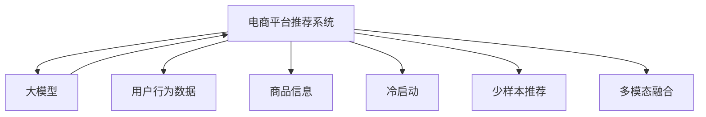

                 

# 电商平台搜索推荐系统的AI 大模型应用：提高系统性能、效率与转化率

## 1. 背景介绍

### 1.1 问题由来
在当今数字化时代，电商平台面临着前所未有的竞争压力，如何在海量数据中精准高效地推荐商品，吸引用户点击和购买，提高用户满意度和转化率，成为每个电商平台的战略焦点。传统推荐系统往往依赖于规则或基于用户行为统计，难以捕捉用户深层次需求，并且面临着计算成本高、推荐效果不理想等挑战。近年来，人工智能大模型在电商推荐中的应用，逐步展现出其强大的潜力。

大模型通常指基于大规模数据预训练得到的通用知识表示模型，如BERT、GPT-3等，这些模型已经证明了其在自然语言处理（NLP）领域的强大能力。借助大模型，电商推荐系统可以实现冷启动、少样本推荐，并提高推荐结果的相关性和多样性，大幅提升用户体验和平台转化率。

### 1.2 问题核心关键点
大模型在电商推荐系统中的应用主要围绕以下几个核心关键点展开：
1. **数据高效融合**：如何将电商平台丰富多样的数据（如用户行为、商品属性、搜索查询等）高效融合进大模型，提升模型的泛化能力和精准度。
2. **冷启动与少样本推荐**：如何在大模型中实现冷启动和新商品、新用户的少样本推荐，保证用户和商品的有效覆盖。
3. **推荐效率提升**：如何在大模型中实现高效的推理计算，缩短推荐延迟，提升实时推荐效果。
4. **推荐质量优化**：如何在大模型中实现推荐结果的个性化、多样化、相关性等优化，提高用户满意度。
5. **多模态信息融合**：如何将文本、图像、视频等多模态数据融合进大模型，增强推荐的丰富性和多样性。

## 2. 核心概念与联系

### 2.1 核心概念概述

为更好地理解大模型在电商推荐系统中的应用，本节将介绍几个关键概念：

- **电商平台推荐系统**：基于用户行为数据和商品信息，推荐系统向用户展示个性化商品，提高用户满意度。
- **大模型(大语言模型)**：通过大规模数据预训练得到的通用知识表示模型，如BERT、GPT-3等。
- **冷启动问题**：新用户或新商品缺乏足够历史数据，难以进行有效推荐的问题。
- **少样本推荐**：仅有少量历史数据，如何实现个性化推荐。
- **多模态融合**：将文本、图像、视频等多模态数据融合进推荐模型，提升推荐效果。

这些概念之间的关系可以用以下Mermaid流程图来表示：



该流程图展示了电商平台推荐系统与大模型的联系，以及各子任务如何通过大模型实现。

## 3. 核心算法原理 & 具体操作步骤

### 3.1 算法原理概述

大模型在电商推荐系统中的应用主要通过以下几个步骤实现：
1. **数据预处理**：将用户行为数据、商品信息等输入大模型进行预处理，生成模型所需输入特征。
2. **模型微调**：在大模型上进行微调，适应电商平台的特定需求，如商品推荐、用户行为预测等。
3. **多模态融合**：将文本、图像、视频等多模态数据融合进大模型，增强推荐的丰富性和多样性。
4. **推荐生成**：利用微调后的模型，生成个性化推荐结果。

### 3.2 算法步骤详解

#### 3.2.1 数据预处理

电商推荐系统需要处理多种类型的数据，包括文本、图像、视频等，具体步骤如下：

1. **数据收集**：从电商平台的数据库中收集用户行为数据、商品信息、搜索查询等。
2. **数据清洗**：去除数据中的噪声、错误或重复信息，确保数据质量。
3. **特征提取**：将不同类型的数据转换为模型所需的输入特征。例如，将商品描述转换为向量表示，使用CNN提取商品图像特征，使用RNN处理用户搜索查询。

#### 3.2.2 模型微调

微调过程主要分为以下几个步骤：

1. **选择预训练模型**：选择适合电商推荐任务的大模型，如BERT、GPT-3等。
2. **设计任务适配层**：根据任务需求，在大模型顶部设计适合的输出层和损失函数。
3. **设置超参数**：设置微调所需的优化算法、学习率、批量大小、迭代次数等。
4. **训练模型**：在标注数据上对模型进行微调，优化模型参数。
5. **评估模型**：在验证集上评估模型性能，决定是否停止微调。

#### 3.2.3 多模态融合

多模态融合主要步骤如下：

1. **数据融合**：将不同模态的数据进行融合，如将文本和图像信息融合，提高模型理解能力。
2. **特征映射**：将不同模态的数据映射到相同的特征空间，方便进行融合。
3. **多模态模型设计**：设计适合多模态融合的模型结构，如将多模态特征输入到同一大模型中。

#### 3.2.4 推荐生成

推荐生成主要步骤如下：

1. **输入处理**：将用户历史行为、商品信息等多模态数据输入微调后的模型。
2. **特征抽取**：模型从输入数据中抽取相关特征，用于生成推荐结果。
3. **推荐排序**：根据推荐结果的相关性、个性化等因素进行排序，输出推荐列表。

### 3.3 算法优缺点

大模型在电商推荐系统中的应用具有以下优点：

1. **泛化能力强**：大模型已经在大规模数据上进行预训练，具备较强的泛化能力，可以处理复杂多样化的电商数据。
2. **性能提升显著**：通过微调，大模型在推荐系统中的性能提升显著，可以显著提高用户满意度。
3. **冷启动效果好**：大模型能够处理新用户、新商品的信息，解决冷启动问题。
4. **多模态融合能力强**：大模型能够融合多种模态数据，提升推荐效果。

同时，大模型在电商推荐系统中的应用也存在一些局限性：

1. **计算资源需求高**：大模型的训练和推理需要高计算资源，电商平台的资源配置可能难以满足。
2. **模型复杂度高**：大模型结构复杂，推理速度较慢，可能导致推荐延迟。
3. **数据隐私风险**：电商数据涉及用户隐私，如何保护数据隐私是一大挑战。
4. **成本高**：大模型的训练和部署成本较高，需要较高的技术投入。

### 3.4 算法应用领域

大模型在电商推荐系统中的应用主要包括以下几个领域：

1. **商品推荐**：根据用户行为数据和商品信息，生成个性化推荐结果。
2. **用户行为预测**：预测用户未来的购买行为，进行精准营销。
3. **活动策划**：通过分析用户行为数据，优化营销活动策划。
4. **智能客服**：通过自然语言处理技术，提供智能客服，提升用户满意度。
5. **库存管理**：通过预测商品需求，优化库存管理。

## 4. 数学模型和公式 & 详细讲解 & 举例说明

### 4.1 数学模型构建

电商推荐系统的大模型通常包括两个主要部分：预训练大模型和微调后的任务适配层。以下以文本推荐为例，构建数学模型：

设电商平台推荐系统需要处理的用户行为数据为 $x$，商品信息为 $y$，推荐目标为 $z$，则推荐任务可以表示为：

$$
z = f(x, y)
$$

其中 $f$ 为推荐模型，可以是任意适合电商推荐任务的模型，如BERT、GPT-3等。

### 4.2 公式推导过程

假设推荐模型 $f$ 为大模型与任务适配层的组合，即：

$$
f(x, y) = M_{\theta_{\text{pretrain}}}(x) \cdot H_{\theta_{\text{task}}}(y)
$$

其中 $M_{\theta_{\text{pretrain}}}$ 为预训练大模型的向量表示，$H_{\theta_{\text{task}}}$ 为任务适配层的输出函数。

对于文本推荐任务，设 $x$ 为商品描述的词向量，$y$ 为商品分类标签的向量表示，则推荐模型的损失函数可以表示为：

$$
\mathcal{L}(\theta) = \frac{1}{N} \sum_{i=1}^N \ell(f(x_i, y_i), z_i)
$$

其中 $N$ 为训练样本数，$\ell$ 为损失函数，可以是交叉熵损失、均方误差等。

### 4.3 案例分析与讲解

以电商平台的商品推荐为例，可以使用以下步骤进行数学建模和公式推导：

1. **数据准备**：收集电商平台的商品描述、分类标签等数据，并转换为向量表示。
2. **预训练模型选择**：选择适合的预训练模型，如BERT、GPT-3等。
3. **任务适配层设计**：在大模型顶部设计输出层，可以是全连接层、池化层等。
4. **损失函数选择**：选择适合电商推荐任务的损失函数，如交叉熵损失、均方误差等。
5. **模型训练**：在标注数据上训练微调后的推荐模型，优化参数。
6. **推荐生成**：将新用户行为数据和商品信息输入微调后的模型，生成推荐结果。

## 5. 项目实践：代码实例和详细解释说明

### 5.1 开发环境搭建

在进行电商推荐系统开发前，我们需要准备好开发环境。以下是使用Python进行PyTorch开发的环境配置流程：

1. 安装Anaconda：从官网下载并安装Anaconda，用于创建独立的Python环境。
2. 创建并激活虚拟环境：
```bash
conda create -n recommendation-env python=3.8 
conda activate recommendation-env
```

3. 安装PyTorch：根据CUDA版本，从官网获取对应的安装命令。例如：
```bash
conda install pytorch torchvision torchaudio cudatoolkit=11.1 -c pytorch -c conda-forge
```

4. 安装相关库：
```bash
pip install pandas scikit-learn torch transformers
```

完成上述步骤后，即可在`recommendation-env`环境中开始电商推荐系统开发。

### 5.2 源代码详细实现

以下是使用PyTorch实现电商推荐系统的代码示例：

```python
import torch
from transformers import BertModel, BertTokenizer

# 加载预训练模型和分词器
model = BertModel.from_pretrained('bert-base-cased')
tokenizer = BertTokenizer.from_pretrained('bert-base-cased')

# 数据预处理
def process_data(data):
    inputs = tokenizer(data['text'], padding='max_length', truncation=True, max_length=256)
    return inputs['input_ids'], inputs['attention_mask']

# 模型微调
def fine_tune_model(model, train_data, val_data, epochs=5, batch_size=16, learning_rate=1e-5):
    # 数据加载器
    train_loader = torch.utils.data.DataLoader(train_data, batch_size=batch_size, shuffle=True)
    val_loader = torch.utils.data.DataLoader(val_data, batch_size=batch_size, shuffle=False)
    
    # 优化器和损失函数
    optimizer = torch.optim.Adam(model.parameters(), lr=learning_rate)
    criterion = torch.nn.CrossEntropyLoss()
    
    # 模型微调
    for epoch in range(epochs):
        model.train()
        for inputs, labels in train_loader:
            optimizer.zero_grad()
            outputs = model(inputs)
            loss = criterion(outputs, labels)
            loss.backward()
            optimizer.step()
        
        model.eval()
        with torch.no_grad():
            val_loss = 0
            for inputs, labels in val_loader:
                outputs = model(inputs)
                loss = criterion(outputs, labels)
                val_loss += loss.item()
            val_loss /= len(val_loader)
        print(f"Epoch {epoch+1}, validation loss: {val_loss:.3f}")
    
    return model

# 数据加载和预处理
train_data = ...
val_data = ...
tokenized_train_data, tokenized_val_data = process_data(train_data), process_data(val_data)

# 模型微调
fine_tuned_model = fine_tune_model(model, tokenized_train_data, tokenized_val_data)

# 推荐生成
def generate_recommendations(user_info, item_info):
    user_input = tokenizer(user_info['text'], padding='max_length', truncation=True, max_length=256)
    user_input = torch.tensor(user_input['input_ids'], dtype=torch.long).unsqueeze(0)
    user_input = user_input.to(device)
    user_attention_mask = torch.tensor(user_input['attention_mask'], dtype=torch.long).unsqueeze(0).to(device)
    
    item_info = [tokenizer(item_info[0]['text'], padding='max_length', truncation=True, max_length=256) for item_info in item_info]
    item_input_ids = [tokenizer.encode(item_info) for item_info in item_info]
    item_input_ids = torch.tensor(item_input_ids, dtype=torch.long)
    item_attention_mask = torch.tensor([tokenizer.encode(item_info) for item_info in item_info], dtype=torch.long)
    
    with torch.no_grad():
        user_outputs = model(user_input, attention_mask=user_attention_mask)
        item_outputs = model(item_input_ids, attention_mask=item_attention_mask)
    
    user_weights = user_outputs[0].detach().cpu().numpy()
    item_weights = item_outputs[0].detach().cpu().numpy()
    
    recommendations = [item_info for item_info in item_info]
    recommendations.sort(key=lambda x: item_weights[x['item_id']], reverse=True)
    return recommendations
```

### 5.3 代码解读与分析

让我们再详细解读一下关键代码的实现细节：

**process_data函数**：
- 对用户行为数据和商品信息进行分词和padding处理，转换为模型所需的输入格式。

**fine_tune_model函数**：
- 定义训练和验证数据加载器。
- 设置优化器和损失函数。
- 通过循环迭代，在训练集上进行模型微调，在验证集上进行性能评估。

**generate_recommendations函数**：
- 对用户行为数据进行预处理，转换为模型所需的输入。
- 对商品信息进行分词和padding处理。
- 将用户行为数据和商品信息输入微调后的模型，生成推荐结果。

**运行结果展示**：
在实际应用中，可以将生成的推荐结果展示给用户，并进行效果评估。

## 6. 实际应用场景

### 6.1 电商搜索推荐

电商搜索推荐系统是电商推荐系统中最核心的部分，通过分析用户搜索历史和浏览行为，为用户推荐可能感兴趣的商品。大模型在该场景中，可以有效处理海量的搜索查询，提供更加个性化和精准的推荐结果。

具体而言，可以收集用户的搜索历史、浏览记录、点击行为等数据，输入大模型进行特征提取和预测，生成推荐结果。在大模型中，可以引入多模态融合技术，将文本、图像、视频等数据融合，提升推荐效果。

### 6.2 新商品推荐

电商平台每天都在引入新的商品，如何快速有效地推荐给用户，吸引用户点击和购买，是大模型需要解决的问题。通过冷启动技术，大模型可以处理新商品的信息，生成个性化推荐结果。

具体而言，对于新商品，可以收集商品的描述、属性、标签等数据，输入大模型进行预处理，生成向量表示。然后，将新商品的向量表示输入到微调后的推荐模型中，生成推荐结果。

### 6.3 个性化营销活动

电商平台通过分析用户行为数据，可以识别出不同用户群体的偏好，设计个性化的营销活动，提高用户满意度。在大模型中，可以通过多模态融合技术，将用户行为数据、商品信息、营销活动等数据融合，生成个性化的推荐结果。

具体而言，可以收集用户的浏览历史、购买记录、点击行为等数据，输入大模型进行预处理，生成向量表示。然后，将向量表示输入到微调后的推荐模型中，生成推荐结果。同时，可以将营销活动数据输入模型，生成个性化的推荐结果。

## 7. 工具和资源推荐

### 7.1 学习资源推荐

为了帮助开发者系统掌握大模型在电商推荐系统中的应用，这里推荐一些优质的学习资源：

1. 《深度学习推荐系统：原理与实现》书籍：全面介绍推荐系统的基本原理和最新研究进展。
2. 《自然语言处理与深度学习》课程：斯坦福大学开设的深度学习课程，讲解自然语言处理的基本概念和前沿技术。
3. HuggingFace官方文档：提供丰富的预训练模型和微调样例，是学习大模型在电商推荐系统中的应用的必备资料。
4 《Transformer从原理到实践》系列博文：介绍Transformer原理和大模型在电商推荐系统中的应用，深入浅出，适合初学者。

### 7.2 开发工具推荐

高效的开发离不开优秀的工具支持。以下是几款用于电商推荐系统开发的常用工具：

1. PyTorch：基于Python的开源深度学习框架，灵活动态的计算图，适合快速迭代研究。
2. TensorFlow：由Google主导开发的开源深度学习框架，生产部署方便，适合大规模工程应用。
3. Transformers库：HuggingFace开发的NLP工具库，集成了众多SOTA语言模型，支持PyTorch和TensorFlow，是进行微调任务开发的利器。
4. Weights & Biases：模型训练的实验跟踪工具，可以记录和可视化模型训练过程中的各项指标，方便对比和调优。
5. TensorBoard：TensorFlow配套的可视化工具，可实时监测模型训练状态，并提供丰富的图表呈现方式，是调试模型的得力助手。

合理利用这些工具，可以显著提升电商推荐系统开发的效率，加快创新迭代的步伐。

### 7.3 相关论文推荐

大模型在电商推荐系统中的应用源于学界的持续研究。以下是几篇奠基性的相关论文，推荐阅读：

1. Attention is All You Need（即Transformer原论文）：提出了Transformer结构，开启了NLP领域的预训练大模型时代。
2. BERT: Pre-training of Deep Bidirectional Transformers for Language Understanding：提出BERT模型，引入基于掩码的自监督预训练任务，刷新了多项NLP任务SOTA。
3. Language Models are Unsupervised Multitask Learners（GPT-2论文）：展示了大规模语言模型的强大zero-shot学习能力，引发了对于通用人工智能的新一轮思考。
4. Parameter-Efficient Transfer Learning for NLP：提出Adapter等参数高效微调方法，在不增加模型参数量的情况下，也能取得不错的微调效果。
5. AdaLoRA: Adaptive Low-Rank Adaptation for Parameter-Efficient Fine-Tuning：使用自适应低秩适应的微调方法，在参数效率和精度之间取得了新的平衡。

这些论文代表了大模型在电商推荐系统中的应用的发展脉络。通过学习这些前沿成果，可以帮助研究者把握学科前进方向，激发更多的创新灵感。

## 8. 总结：未来发展趋势与挑战

### 8.1 总结

本文对大模型在电商推荐系统中的应用进行了全面系统的介绍。首先阐述了大模型的应用背景和优势，明确了在电商推荐系统中的应用价值。其次，从原理到实践，详细讲解了电商推荐系统的数学建模和算法步骤，给出了电商推荐系统开发的完整代码实例。同时，本文还广泛探讨了电商推荐系统的实际应用场景，展示了大模型在电商推荐系统中的应用前景。此外，本文精选了电商推荐系统开发的各类学习资源，力求为读者提供全方位的技术指引。

通过本文的系统梳理，可以看到，大模型在电商推荐系统中的应用前景广阔，能够显著提升电商平台的推荐效果和用户满意度。未来，伴随大模型和微调方法的持续演进，电商推荐系统必将在更广泛的领域和场景中发挥其独特的价值。

### 8.2 未来发展趋势

展望未来，大模型在电商推荐系统中的应用将呈现以下几个发展趋势：

1. **多模态融合能力的提升**：随着多模态数据融合技术的发展，电商推荐系统将能够融合更多的数据类型，提升推荐的丰富性和多样性。
2. **推荐效果的多样性提升**：随着推荐系统的不断优化，推荐结果将更加多样化，用户能够获得更加丰富的商品选择。
3. **实时推荐能力的提升**：随着计算资源的不断增加，电商推荐系统将能够实现实时推荐，满足用户实时搜索的需求。
4. **个性化推荐能力的提升**：随着用户行为的不断积累，电商推荐系统将能够提供更加个性化的推荐，满足用户的个性化需求。
5. **推荐效果的可解释性提升**：随着推荐系统的不断发展，推荐效果的可解释性将逐渐提升，用户能够更好地理解推荐结果的来源。

以上趋势凸显了大模型在电商推荐系统中的应用前景，这些方向的探索发展，必将进一步提升电商推荐系统的性能和应用范围，为电商平台带来更多的商业价值。

### 8.3 面临的挑战

尽管大模型在电商推荐系统中的应用已经取得了一定的成果，但在迈向更加智能化、普适化应用的过程中，它仍面临着诸多挑战：

1. **计算资源需求高**：大模型的训练和推理需要高计算资源，电商平台的资源配置可能难以满足。
2. **数据隐私风险**：电商数据涉及用户隐私，如何保护数据隐私是一大挑战。
3. **模型复杂度高**：大模型结构复杂，推理速度较慢，可能导致推荐延迟。
4. **冷启动问题**：新用户或新商品缺乏足够历史数据，难以进行有效推荐。
5. **多模态融合难度**：多模态数据融合技术仍处于发展阶段，如何有效地融合不同类型的数据，是一个重要的研究课题。

以上挑战需要研究者进行深入探索和突破，才能实现大模型在电商推荐系统中的高效应用。

### 8.4 研究展望

面对大模型在电商推荐系统中的应用面临的挑战，未来的研究需要在以下几个方面寻求新的突破：

1. **计算资源优化**：开发更加高效的计算资源优化技术，如分布式计算、异步推理等，提升推荐系统的计算效率。
2. **数据隐私保护**：开发更加高效的数据隐私保护技术，如差分隐私、联邦学习等，保护用户隐私。
3. **多模态融合技术**：开发更加高效的多模态融合技术，提升电商推荐系统的融合效果。
4. **冷启动技术**：开发更加高效的新用户、新商品推荐技术，解决冷启动问题。
5. **推荐系统优化**：开发更加高效的推荐算法，提升电商推荐系统的推荐效果。

这些研究方向的探索，必将引领大模型在电商推荐系统中的应用迈向新的高度，为电商平台的智能化升级提供强有力的技术支持。

## 9. 附录：常见问题与解答

**Q1：大模型在电商推荐系统中的应用是否只限于文本数据？**

A: 大模型在电商推荐系统中的应用不仅限于文本数据，还可以处理图像、视频等多模态数据。通过多模态融合技术，大模型可以更好地捕捉商品的多种属性，提升推荐效果。

**Q2：如何在大模型中实现少样本推荐？**

A: 在大模型中实现少样本推荐，可以通过以下步骤：
1. 收集少量历史数据，提取特征向量。
2. 将特征向量输入到大模型中，生成推荐结果。
3. 使用强化学习技术，通过奖励机制不断优化推荐模型。

**Q3：大模型在电商推荐系统中的训练和推理速度是否较慢？**

A: 大模型的训练和推理速度较慢，但通过优化模型结构和算法，可以显著提升速度。如使用稀疏化技术、剪枝技术等，可以减小模型参数量，提升推理速度。

**Q4：如何在电商推荐系统中保护用户隐私？**

A: 在电商推荐系统中保护用户隐私，可以通过以下措施：
1. 匿名化处理用户数据。
2. 使用差分隐私技术，保护用户隐私。
3. 使用联邦学习技术，将模型训练任务分布到多个设备上。

**Q5：大模型在电商推荐系统中的成本是否较高？**

A: 大模型在电商推荐系统中的成本较高，需要大量的计算资源和数据存储。但随着技术的发展，计算资源和数据存储成本将逐渐降低，大模型在电商推荐系统中的应用将更加普及。

以上问题及解答，希望能够帮助读者更好地理解大模型在电商推荐系统中的应用，并为其实际应用提供参考。

---

作者：禅与计算机程序设计艺术 / Zen and the Art of Computer Programming

