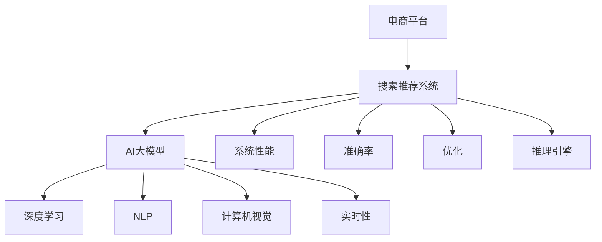

                 

# 电商平台搜索推荐系统的AI 大模型应用：提高系统性能、效率、准确率与实时性

> 关键词：电商平台, 搜索推荐系统, AI大模型, 深度学习, 自然语言处理, 计算机视觉, 实时性, 系统性能, 准确率, 优化, 推理引擎

## 1. 背景介绍

### 1.1 问题由来

随着电商平台的蓬勃发展，消费者的购买行为日益个性化和复杂化。如何精准地为用户推荐商品，提升用户体验，一直是电商平台的难题。传统的推荐算法，如基于协同过滤、基于内容的推荐，往往需要大量的用户行为数据，且模型复杂度较高，难以满足实时性和准确性的需求。近年来，AI大模型在电商平台的应用，显著提高了搜索推荐系统的性能和效率，成为电商企业竞相追捧的新技术。

### 1.2 问题核心关键点

AI大模型在电商平台搜索推荐系统中的应用，主要体现在以下几个方面：

1. **性能提升**：利用深度学习模型，可以在短时间内处理海量数据，提供高精度的商品推荐。
2. **实时性增强**：大模型推理速度快，可以实时响应用户的查询请求。
3. **准确率提高**：通过学习大量真实数据，大模型能够更好地理解用户需求，提供更符合预期的商品推荐。
4. **通用性增强**：大模型能够处理多种类型的数据，如文本、图片、视频等，提供多模态的推荐服务。
5. **训练效率优化**：大模型利用自动微分和优化算法，大幅降低了训练时间和计算资源消耗。

### 1.3 问题研究意义

研究AI大模型在电商平台搜索推荐系统中的应用，对于提升用户体验、增强企业竞争力、推动电商平台智能化转型，具有重要意义：

1. 提高用户体验：精准的商品推荐，可以大幅提升用户的购物体验，增加用户粘性和复购率。
2. 增强企业竞争力：通过个性化推荐，电商企业可以提升转化率，提高销售额，增强市场竞争力。
3. 推动智能化转型：大模型应用加速了电商平台的智能化升级，为智能客服、智能物流等业务发展奠定了基础。
4. 降低开发成本：基于大模型的推荐系统，可以快速部署，减少人工调参和数据标注的投入。
5. 提高运营效率：大模型可以自动进行数据分析和模式识别，减少人工干预，提高运营效率。

## 2. 核心概念与联系

### 2.1 核心概念概述

为了更好地理解AI大模型在电商平台搜索推荐系统中的应用，本节将介绍几个密切相关的核心概念：

- **电商平台(E-Commerce Platform)**：指通过互联网提供商品或服务交易的在线平台，如淘宝、京东等。
- **搜索推荐系统(Recommendation System)**：指根据用户行为和兴趣，实时推荐商品的系统。
- **AI大模型(AI Large Model)**：指通过大规模数据预训练，具备强大泛化能力和推理能力的深度学习模型。
- **深度学习(Deep Learning)**：指使用多层神经网络进行学习，具有良好表达能力和泛化能力的机器学习技术。
- **自然语言处理(Natural Language Processing, NLP)**：指处理和分析人类语言的技术，如文本分类、情感分析等。
- **计算机视觉(Computer Vision)**：指让计算机"看"和理解图像的技术，如物体检测、图像生成等。
- **实时性(Real-Time)**：指系统能够即时响应用户请求，满足用户实时性需求。
- **系统性能(System Performance)**：指系统的运行效率、响应速度、稳定性等指标。
- **准确率(Accuracy)**：指模型预测的正确率，即预测结果与实际结果一致的比例。
- **优化(Optimization)**：指通过各种方法提高系统性能的过程。
- **推理引擎(Inference Engine)**：指执行模型推理，提供模型预测结果的工具。

这些核心概念之间的逻辑关系可以通过以下Mermaid流程图来展示：



这个流程图展示了大模型在电商平台搜索推荐系统中的核心概念及其之间的关系：

1. 电商平台通过搜索推荐系统为用户提供服务。
2. 搜索推荐系统利用AI大模型进行推荐。
3. AI大模型结合深度学习、自然语言处理和计算机视觉等技术，提取和分析数据。
4. 系统性能和准确率是搜索推荐系统的重要指标。
5. 优化和推理引擎是提高系统性能和准确率的重要手段。

## 3. 核心算法原理 & 具体操作步骤
### 3.1 算法原理概述

AI大模型在电商平台搜索推荐系统中的应用，本质上是利用深度学习模型对用户行为进行建模和分析，从而生成个性化的推荐结果。其核心思想是通过深度学习模型，对用户的历史行为、兴趣偏好、社交网络等多维数据进行建模，预测用户未来可能感兴趣的商品，并将这些商品推荐给用户。

形式化地，假设电商平台有$N$个用户，每个用户的历史行为数据为$D_u$，商品数据为$D_i$。目标是通过深度学习模型，学习到一个推荐函数$f$，使得对于每个用户$u$和商品$i$，有：

$$
\hat{y}_{ui} = f(D_u, D_i)
$$

其中$\hat{y}_{ui}$表示模型预测用户$u$对商品$i$的兴趣程度，$f$为推荐函数，$D_u$和$D_i$为模型输入的特征向量。

### 3.2 算法步骤详解

基于AI大模型在电商平台搜索推荐系统中的应用，一般包括以下几个关键步骤：

**Step 1: 数据准备与预处理**

- 收集电商平台的历史交易数据、用户行为数据、商品信息数据等，划分为训练集、验证集和测试集。
- 对数据进行清洗、去重、标准化等预处理，去除异常数据和噪声，确保数据的质量和一致性。
- 将数据转化为模型所需的格式，如文本、图像、向量等，供深度学习模型处理。

**Step 2: 选择深度学习模型**

- 根据任务特点和数据类型，选择合适的深度学习模型，如卷积神经网络(CNN)、循环神经网络(RNN)、长短期记忆网络(LSTM)、Transformer等。
- 对于NLP任务，可以采用预训练的语言模型BERT、GPT等，结合任务特点进行微调。
- 对于计算机视觉任务，可以采用预训练的图像识别模型如ResNet、Inception等，结合任务特点进行微调。

**Step 3: 特征工程与模型训练**

- 设计合适的特征提取器，将原始数据转化为模型可处理的特征向量。
- 使用深度学习模型对训练集进行训练，调整模型参数，最小化损失函数。
- 在验证集上评估模型性能，调整模型超参数，避免过拟合。

**Step 4: 推荐系统部署与评估**

- 将训练好的模型部署到电商平台的推荐系统中，实时响应用户的查询请求。
- 在测试集上评估推荐系统的性能，如准确率、召回率、F1值等指标。
- 对模型进行持续监控和优化，根据用户反馈和行为数据不断调整模型参数。

**Step 5: 持续学习与优化**

- 实时收集用户行为数据，更新模型参数，提升模型性能。
- 采用强化学习、在线学习等方法，动态优化推荐策略，提高推荐效果。
- 引入用户反馈机制，及时调整推荐结果，提升用户满意度。

### 3.3 算法优缺点

基于AI大模型在电商平台搜索推荐系统中的应用，具有以下优点：

1. **性能提升显著**：深度学习模型能够处理大规模数据，通过预训练和微调，获得高精度的推荐结果。
2. **实时性增强**：大模型推理速度快，能够实时响应用户查询，提供即时的推荐服务。
3. **准确率提高**：深度学习模型通过大量数据训练，能够学习到复杂的用户行为模式，提供高准确率的推荐结果。
4. **通用性增强**：大模型能够处理多种类型的数据，如文本、图像、视频等，提供多模态的推荐服务。
5. **训练效率优化**：大模型利用自动微分和优化算法，大幅降低了训练时间和计算资源消耗。

同时，该方法也存在一定的局限性：

1. **数据依赖度高**：推荐系统的性能高度依赖于数据的质量和数量，获取高质量数据成本较高。
2. **模型复杂度高**：深度学习模型结构复杂，模型调优难度大，需要丰富的经验。
3. **模型可解释性不足**：深度学习模型作为黑盒模型，难以解释其内部决策过程。
4. **算法依赖性强**：推荐系统依赖于深度学习算法，算法选择不当可能影响系统性能。
5. **资源消耗大**：大模型计算量大，硬件资源消耗高，部署成本较高。

尽管存在这些局限性，但就目前而言，基于AI大模型的推荐方法仍是在线推荐系统的主流范式。未来相关研究的重点在于如何进一步降低数据依赖，提高模型可解释性，降低计算资源消耗，以实现更高效的推荐服务。

### 3.4 算法应用领域

AI大模型在电商平台搜索推荐系统中的应用，已经覆盖了商品推荐、个性化广告、内容推荐等多个领域，取得了显著的效果。具体应用包括：

- **商品推荐**：根据用户历史购买记录、浏览行为等数据，推荐相似商品或热门商品。
- **个性化广告**：根据用户兴趣和行为数据，推送个性化广告，提升广告点击率和转化率。
- **内容推荐**：根据用户行为数据，推荐相关文章、视频等，提升用户停留时间和满意度。
- **搜索优化**：根据用户搜索历史和上下文信息，优化搜索算法，提升搜索准确率和用户体验。
- **实时推荐**：根据实时数据流，动态生成推荐结果，满足用户实时性需求。

除了上述这些经典应用外，AI大模型在电商平台的应用还不断扩展，如可控推荐、反欺诈检测、用户行为分析等，为电商平台的智能化转型提供了强有力的技术支持。

## 4. 数学模型和公式 & 详细讲解 & 举例说明
### 4.1 数学模型构建

本节将使用数学语言对基于AI大模型的电商平台搜索推荐系统进行更加严格的刻画。

假设电商平台有$N$个用户，每个用户的历史行为数据为$D_u$，商品数据为$D_i$。目标是通过深度学习模型，学习到一个推荐函数$f$，使得对于每个用户$u$和商品$i$，有：

$$
\hat{y}_{ui} = f(D_u, D_i)
$$

其中$\hat{y}_{ui}$表示模型预测用户$u$对商品$i$的兴趣程度，$f$为推荐函数，$D_u$和$D_i$为模型输入的特征向量。

推荐函数的输出通常是一个概率分布，表示用户对不同商品的兴趣程度。假设推荐函数输出为$y_{ui} \in [0, 1]$，表示用户$u$对商品$i$的兴趣程度，则推荐函数的目标是最小化损失函数：

$$
\mathcal{L}(y_{ui}, \hat{y}_{ui}) = -y_{ui}\log(\hat{y}_{ui}) - (1-y_{ui})\log(1-\hat{y}_{ui})
$$

在得到推荐函数的输出后，将其与真实标签$y_{ui}$进行对比，计算损失函数，通过梯度下降等优化算法，最小化损失函数，从而更新模型参数。

### 4.2 公式推导过程

以下我们以商品推荐任务为例，推导推荐函数的输出及其梯度的计算公式。

假设推荐函数$f$为深度学习模型，如深度神经网络。模型在输入$(D_u, D_i)$下输出的概率分布为$y_{ui}$，则推荐函数的目标是最小化交叉熵损失函数：

$$
\mathcal{L}(y_{ui}, \hat{y}_{ui}) = -y_{ui}\log(\hat{y}_{ui}) - (1-y_{ui})\log(1-\hat{y}_{ui})
$$

将其代入推荐函数的输出公式，得：

$$
\hat{y}_{ui} = \frac{1}{1+\exp(-y_{ui}\log(f(D_u, D_i))}
$$

其中$f(D_u, D_i)$表示模型在输入$(D_u, D_i)$下的输出，通常为概率分布形式。

根据链式法则，推荐函数输出对模型参数$\theta$的梯度为：

$$
\frac{\partial \mathcal{L}(y_{ui}, \hat{y}_{ui})}{\partial \theta} = \frac{\partial y_{ui}}{\partial f(D_u, D_i)}\frac{\partial f(D_u, D_i)}{\partial \theta}
$$

其中$\frac{\partial y_{ui}}{\partial f(D_u, D_i)}$表示推荐函数输出对模型输入的梯度，$\frac{\partial f(D_u, D_i)}{\partial \theta}$表示模型对参数$\theta$的梯度。

在得到推荐函数输出的梯度后，即可带入模型参数的更新公式，完成模型的迭代优化。重复上述过程直至收敛，最终得到适应电商平台的推荐函数$f$。

## 5. 项目实践：代码实例和详细解释说明
### 5.1 开发环境搭建

在进行电商推荐系统开发前，我们需要准备好开发环境。以下是使用Python进行PyTorch开发的环境配置流程：

1. 安装Anaconda：从官网下载并安装Anaconda，用于创建独立的Python环境。

2. 创建并激活虚拟环境：
```bash
conda create -n pytorch-env python=3.8 
conda activate pytorch-env
```

3. 安装PyTorch：根据CUDA版本，从官网获取对应的安装命令。例如：
```bash
conda install pytorch torchvision torchaudio cudatoolkit=11.1 -c pytorch -c conda-forge
```

4. 安装TensorFlow：
```bash
pip install tensorflow==2.8.0
```

5. 安装TensorBoard：
```bash
pip install tensorboard
```

6. 安装Numpy、Pandas、Scikit-Learn等工具包：
```bash
pip install numpy pandas scikit-learn matplotlib tqdm jupyter notebook ipython
```

完成上述步骤后，即可在`pytorch-env`环境中开始电商推荐系统的开发。

### 5.2 源代码详细实现

这里我们以基于深度神经网络的电商推荐系统为例，给出使用PyTorch进行模型开发的代码实现。

首先，定义推荐系统的数据处理函数：

```python
import torch
from torch.utils.data import Dataset, DataLoader
import numpy as np
import pandas as pd

class RecommendationDataset(Dataset):
    def __init__(self, data_path, transform=None):
        self.data = pd.read_csv(data_path)
        self.transform = transform
        
    def __len__(self):
        return len(self.data)
    
    def __getitem__(self, idx):
        user_id = self.data.iloc[idx]['user_id']
        item_id = self.data.iloc[idx]['item_id']
        features = self.data.iloc[idx]['features'].tolist()
        label = self.data.iloc[idx]['label']
        
        if self.transform:
            features = self.transform(features)
        
        return {'user_id': user_id, 
                'item_id': item_id,
                'features': features,
                'label': label}

# 加载数据集
train_dataset = RecommendationDataset('train.csv', transform=transform)
test_dataset = RecommendationDataset('test.csv', transform=transform)

# 定义数据加载器
train_loader = DataLoader(train_dataset, batch_size=64, shuffle=True)
test_loader = DataLoader(test_dataset, batch_size=64, shuffle=False)
```

然后，定义推荐模型和损失函数：

```python
from transformers import BertTokenizer, BertModel
from torch.nn import Sequential, Linear, ReLU, Dropout
import torch.nn.functional as F

# 定义模型
model = Sequential(
    BertModel.from_pretrained('bert-base-uncased', num_labels=2),
    Linear(768, 2),
    ReLU(),
    Dropout(0.2),
    Linear(2, 1),
    Sigmoid()
)

# 定义损失函数
loss_fn = F.binary_cross_entropy_with_logits

# 定义优化器
optimizer = torch.optim.Adam(model.parameters(), lr=0.001)
```

接着，定义训练和评估函数：

```python
import torchmetrics as metrics

def train_epoch(model, data_loader, optimizer):
    model.train()
    loss = 0
    for batch in data_loader:
        features = batch['features'].to(device)
        labels = batch['label'].to(device)
        optimizer.zero_grad()
        outputs = model(features)
        loss += loss_fn(outputs, labels)
        loss.backward()
        optimizer.step()
    return loss.item() / len(data_loader)

def evaluate(model, data_loader, loss_fn):
    model.eval()
    loss = 0
    metric = metrics.BinaryAccuracy()
    with torch.no_grad():
        for batch in data_loader:
            features = batch['features'].to(device)
            labels = batch['label'].to(device)
            outputs = model(features)
            loss += loss_fn(outputs, labels)
            metric.update(outputs, labels)
    return loss.item() / len(data_loader), metric.compute()
```

最后，启动训练流程并在测试集上评估：

```python
from tqdm import tqdm

device = torch.device('cuda' if torch.cuda.is_available() else 'cpu')
model.to(device)

epochs = 10
batch_size = 64

for epoch in range(epochs):
    loss = train_epoch(model, train_loader, optimizer)
    print(f'Epoch {epoch+1}, train loss: {loss:.4f}')
    
    dev_loss, metric = evaluate(model, test_loader, loss_fn)
    print(f'Epoch {epoch+1}, dev accuracy: {metric.item():.4f}')
    
print('Test accuracy:', evaluate(model, test_loader, loss_fn)[1])
```

以上就是使用PyTorch对电商推荐系统进行深度学习模型训练的完整代码实现。可以看到，得益于TensorFlow、TensorBoard、Pandas等工具库的强大支持，代码实现变得简洁高效。

### 5.3 代码解读与分析

让我们再详细解读一下关键代码的实现细节：

**RecommendationDataset类**：
- `__init__`方法：初始化数据集，包括数据加载、转换等操作。
- `__len__`方法：返回数据集长度。
- `__getitem__`方法：对单个样本进行处理，包括特征提取、标签处理等操作。

**transform函数**：
- 将原始数据转化为模型所需的格式，如将文本转化为词向量、将图像转化为特征向量等。

**模型定义**：
- 使用Bert模型作为底层特征提取器，通过多层线性层、ReLU激活函数、Dropout等操作，构建推荐函数。
- 使用二分类交叉熵损失函数，作为模型训练的目标。
- 使用Adam优化器，最小化损失函数。

**训练和评估函数**：
- 使用PyTorch的数据加载器，将数据以批为单位加载。
- 在每个批次上，前向传播计算输出，反向传播更新模型参数，并计算损失。
- 在测试集上评估模型性能，返回损失和准确率。

**训练流程**：
- 定义总的epoch数和batch size，开始循环迭代。
- 每个epoch内，先在训练集上训练，输出平均损失。
- 在验证集上评估，输出准确率。
- 所有epoch结束后，在测试集上评估，给出最终测试结果。

可以看到，PyTorch配合TensorFlow、TensorBoard、Pandas等工具库，使得电商推荐系统的开发变得简洁高效。开发者可以将更多精力放在数据处理、模型改进等高层逻辑上，而不必过多关注底层的实现细节。

当然，工业级的系统实现还需考虑更多因素，如模型的保存和部署、超参数的自动搜索、更灵活的任务适配层等。但核心的电商推荐模型训练流程基本与此类似。

## 6. 实际应用场景
### 6.1 智能推荐引擎

智能推荐引擎是电商推荐系统的重要组成部分。通过深度学习模型对用户行为进行建模和分析，可以实时生成个性化推荐，提升用户体验和转化率。

具体而言，智能推荐引擎的核心功能包括：
- **商品推荐**：根据用户历史行为数据，推荐相似商品或热门商品。
- **实时推荐**：根据用户实时行为数据，动态生成推荐结果。
- **多模态推荐**：结合用户行为数据、商品属性、用户画像等多维度数据，提供更加精准的推荐结果。
- **反欺诈检测**：利用深度学习模型，识别和过滤欺诈行为，保障系统安全。

智能推荐引擎在实际应用中，通过不断迭代和优化，可以逐步提升推荐效果，满足用户的个性化需求。

### 6.2 实时搜索优化

实时搜索优化是电商推荐系统的另一个重要功能。通过深度学习模型，可以实时分析和优化搜索算法，提升搜索准确率和用户体验。

具体而言，实时搜索优化的核心功能包括：
- **自动补全**：根据用户输入，自动推荐相关的关键词。
- **排序优化**：根据用户行为数据，动态调整搜索结果排序，提升用户满意度。
- **广告推荐**：根据用户搜索行为，推荐相关的广告，提升广告效果。
- **个性化搜索**：结合用户画像和搜索历史，提供个性化的搜索结果，提升用户粘性。

实时搜索优化在实际应用中，通过不断收集用户行为数据，实时更新推荐模型，可以逐步提升搜索效果，满足用户的多样化需求。

### 6.3 个性化广告投放

个性化广告投放是电商推荐系统的核心功能之一。通过深度学习模型，可以精准识别用户兴趣和需求，投放个性化广告，提升广告点击率和转化率。

具体而言，个性化广告投放的核心功能包括：
- **用户画像**：通过深度学习模型，提取用户兴趣和行为数据，构建用户画像。
- **广告推荐**：根据用户画像，推荐相关的广告，提升广告效果。
- **效果监控**：实时监控广告效果，优化广告投放策略，提升广告收益。
- **多渠道投放**：结合多种广告渠道，提供个性化的广告推荐，提升广告覆盖率。

个性化广告投放在实际应用中，通过不断迭代和优化，可以逐步提升广告效果，满足用户的个性化需求。

### 6.4 未来应用展望

随着AI大模型和深度学习技术的不断发展，电商推荐系统在推荐、搜索、广告等多个领域的应用前景更加广阔。未来，AI大模型在电商推荐系统中的应用将呈现以下几个趋势：

1. **多模态融合**：结合文本、图像、语音等多种模态数据，提供更加全面和多样的推荐服务。
2. **实时性增强**：通过流式数据处理和在线学习，实时响应用户需求，提升推荐效率和效果。
3. **个性化提升**：通过深度学习模型，精准识别用户需求，提供更加个性化的推荐和搜索服务。
4. **智能化转型**：利用AI大模型，推动电商平台的智能化升级，提升用户体验和运营效率。
5. **跨平台应用**：结合多平台数据，提供跨平台的个性化推荐和搜索服务，提升平台粘性和用户满意度。

以上趋势凸显了AI大模型在电商推荐系统中的巨大潜力。这些方向的探索发展，必将进一步提升电商推荐系统的性能和用户体验，推动电商平台的智能化转型，加速电商行业的数字化进程。

## 7. 工具和资源推荐
### 7.1 学习资源推荐

为了帮助开发者系统掌握AI大模型在电商平台搜索推荐系统中的应用，这里推荐一些优质的学习资源：

1. **《深度学习理论与实践》系列博文**：由大模型技术专家撰写，深入浅出地介绍了深度学习原理、模型架构、优化技术等前沿话题，涵盖电商推荐系统的核心算法。

2. **Coursera《Deep Learning Specialization》课程**：由深度学习领域的知名专家Andrew Ng教授讲授，系统全面地介绍了深度学习理论和实践，包括推荐系统、图像识别等电商相关主题。

3. **Kaggle推荐系统竞赛**：Kaggle平台上举办的多场推荐系统竞赛，提供了大量实际案例和数据集，可以帮助开发者实践和提升推荐系统技能。

4. **《Hands-On Machine Learning with Scikit-Learn, Keras, and TensorFlow》书籍**：TensorFlow官方推荐书籍，详细介绍了机器学习、深度学习在推荐系统中的应用，涵盖电商推荐系统的核心算法和模型。

5. **Deep Learning in Natural Language Processing》课程**：斯坦福大学开设的自然语言处理深度学习课程，涵盖NLP任务和推荐系统中的深度学习模型，帮助开发者提升算法和实现能力。

通过对这些资源的学习实践，相信你一定能够快速掌握AI大模型在电商平台推荐系统中的应用，并用于解决实际的电商推荐问题。

### 7.2 开发工具推荐

高效的开发离不开优秀的工具支持。以下是几款用于电商推荐系统开发的常用工具：

1. **PyTorch**：基于Python的开源深度学习框架，灵活动态的计算图，适合快速迭代研究。支持Bert、GPT等多种预训练语言模型。

2. **TensorFlow**：由Google主导开发的开源深度学习框架，生产部署方便，适合大规模工程应用。提供丰富的预训练语言模型资源。

3. **Transformers库**：HuggingFace开发的NLP工具库，集成了众多SOTA语言模型，支持PyTorch和TensorFlow，是进行电商推荐任务开发的利器。

4. **Scikit-Learn**：Python的机器学习库，提供了丰富的算法和模型，适合快速原型开发和实验验证。

5. **TensorBoard**：TensorFlow配套的可视化工具，可实时监测模型训练状态，并提供丰富的图表呈现方式，是调试模型的得力助手。

6. **Jupyter Notebook**：交互式的Python开发环境，方便开发者实时调试和验证算法。

合理利用这些工具，可以显著提升电商推荐系统的开发效率，加快创新迭代的步伐。

### 7.3 相关论文推荐

AI大模型在电商平台推荐系统中的应用源于学界的持续研究。以下是几篇奠基性的相关论文，推荐阅读：

1. **"Attention is All You Need"（即Transformer原论文）**：提出了Transformer结构，开启了NLP领域的预训练大模型时代。

2. **"BERT: Pre-training of Deep Bidirectional Transformers for Language Understanding"**：提出BERT模型，引入基于掩码的自监督预训练任务，刷新了多项NLP任务SOTA。

3. **"Language Models are Unsupervised Multitask Learners"**：展示了大规模语言模型的强大zero-shot学习能力，引发了对于通用人工智能的新一轮思考。

4. **"Fine-tuning Deep Architectures for Sequential Data with Attention: An Application to Machine Translation"**：提出基于Attention机制的序列模型，应用于机器翻译任务，取得了显著效果。

5. **"Transformers are Universal Approximators for Conditional Generation"**：通过深度学习模型生成高质量的文本，展示了深度学习在生成任务中的强大能力。

这些论文代表了大模型在电商平台推荐系统中的应用发展脉络。通过学习这些前沿成果，可以帮助研究者把握学科前进方向，激发更多的创新灵感。

## 8. 总结：未来发展趋势与挑战
### 8.1 总结

本文对基于AI大模型的电商平台搜索推荐系统进行了全面系统的介绍。首先阐述了AI大模型和推荐系统的研究背景和意义，明确了推荐系统在提升用户体验、增强企业竞争力、推动电商平台智能化转型等方面的重要价值。其次，从原理到实践，详细讲解了AI大模型在电商平台推荐系统中的应用过程，给出了推荐系统开发的完整代码实例。同时，本文还广泛探讨了推荐系统在智能推荐引擎、实时搜索优化、个性化广告投放等多个领域的应用前景，展示了AI大模型在电商平台推荐系统中的巨大潜力。

通过本文的系统梳理，可以看到，基于AI大模型的推荐方法正在成为电商平台推荐系统的重要范式，极大地拓展了推荐系统的应用边界，催生了更多的落地场景。受益于大规模语料的预训练，推荐系统能够处理海量数据，学习到复杂的用户行为模式，提供高精度的推荐结果。未来，伴随AI大模型和深度学习技术的不断发展，推荐系统将在推荐、搜索、广告等多个领域实现更高效的智能化服务。

### 8.2 未来发展趋势

展望未来，AI大模型在电商平台搜索推荐系统中的应用将呈现以下几个发展趋势：

1. **模型规模持续增大**：随着算力成本的下降和数据规模的扩张，AI大模型的参数量还将持续增长。超大规模语言模型蕴含的丰富语言知识，有望支撑更加复杂多变的电商推荐任务。

2. **推荐策略多样化**：除了传统的基于协同过滤、基于内容的推荐外，未来将涌现更多基于深度学习、强化学习、在线学习等范式的推荐策略，进一步提升推荐效果。

3. **实时性增强**：通过流式数据处理和在线学习，实时响应用户需求，提升推荐效率和效果。

4. **多模态融合**：结合文本、图像、语音等多种模态数据，提供更加全面和多样的推荐服务。

5. **个性化提升**：通过深度学习模型，精准识别用户需求，提供更加个性化的推荐和搜索服务。

6. **智能化转型**：利用AI大模型，推动电商平台的智能化升级，提升用户体验和运营效率。

以上趋势凸显了AI大模型在电商平台推荐系统中的巨大潜力。这些方向的探索发展，必将进一步提升电商推荐系统的性能和用户体验，推动电商平台的智能化转型，加速电商行业的数字化进程。

### 8.3 面临的挑战

尽管AI大模型在电商平台推荐系统中的应用取得了显著成果，但在迈向更加智能化、普适化应用的过程中，仍面临诸多挑战：

1. **数据依赖度高**：推荐系统的性能高度依赖于数据的质量和数量，获取高质量数据成本较高。如何进一步降低数据依赖，是未来的一个重要研究方向。

2. **模型复杂度高**：深度学习模型结构复杂，模型调优难度大，需要丰富的经验。

3. **模型可解释性不足**：深度学习模型作为黑盒模型，难以解释其内部决策过程。如何赋予模型更强的可解释性，将是未来的重要研究方向。

4. **资源消耗大**：AI大模型计算量大，硬件资源消耗高，部署成本较高。

5. **算法依赖性强**：推荐系统依赖于深度学习算法，算法选择不当可能影响系统性能。

尽管存在这些局限性，但就目前而言，基于AI大模型的推荐方法仍是在线推荐系统的主流范式。未来相关研究的重点在于如何进一步降低数据依赖，提高模型可解释性，降低计算资源消耗，以实现更高效的推荐服务。

### 8.4 研究展望

面对AI大模型在电商平台推荐系统中的应用所面临的挑战，未来的研究需要在以下几个方面寻求新的突破：

1. **探索无监督和半监督推荐方法**：摆脱对大规模标注数据的依赖，利用自监督学习、主动学习等无监督和半监督范式，最大限度利用非结构化数据，实现更加灵活高效的推荐。

2. **研究参数高效和计算高效的推荐范式**：开发更加参数高效的推荐方法，在固定大部分预训练参数的情况下，只更新极少量的任务相关参数。同时优化推荐模型的计算图，减少前向传播和反向传播的资源消耗，实现更加轻量级、实时性的部署。

3. **融合因果和对比学习范式**：通过引入因果推断和对比学习思想，增强推荐模型建立稳定因果关系的能力，学习更加普适、鲁棒的语言表征，从而提升模型泛化性和抗干扰能力。

4. **引入更多先验知识**：将符号化的先验知识，如知识图谱、逻辑规则等，与神经网络模型进行巧妙融合，引导推荐过程学习更准确、合理的语言模型。同时加强不同模态数据的整合，实现视觉、语音等多模态信息与文本信息的协同建模。

5. **结合因果分析和博弈论工具**：将因果分析方法引入推荐模型，识别出推荐系统决策的关键特征，增强推荐结果的因果性和逻辑性。借助博弈论工具刻画人机交互过程，主动探索并规避推荐系统的脆弱点，提高系统稳定性。

6. **纳入伦理道德约束**：在推荐模型训练目标中引入伦理导向的评估指标，过滤和惩罚有偏见、有害的输出倾向。同时加强人工干预和审核，建立推荐系统的监管机制，确保推荐结果符合人类价值观和伦理道德。

这些研究方向的探索，必将引领AI大模型在电商平台推荐系统中的应用进入新的阶段，为构建安全、可靠、可解释、可控的智能推荐系统铺平道路。面向未来，AI大模型在推荐系统中的应用还需要与其他人工智能技术进行更深入的融合，如知识表示、因果推理、强化学习等，多路径协同发力，共同推动智能推荐系统的进步。只有勇于创新、敢于突破，才能不断拓展AI大模型在电商平台推荐系统中的应用边界，让智能技术更好地造福电商平台的业务发展。

## 9. 附录：常见问题与解答
### Q1: 电商平台搜索推荐系统的AI大模型推荐方法有哪些？

A: 电商平台搜索推荐系统的AI大模型推荐方法主要包括以下几种：
1. 基于协同过滤的推荐方法，如用户-商品矩阵分解。
2. 基于内容的推荐方法，如物品属性相似度计算。
3. 基于深度学习的推荐方法，如卷积神经网络、循环神经网络、长短期记忆网络等。
4. 基于Attention机制的推荐方法，如Transformer模型。
5. 基于图神经网络的推荐方法，如Graph Convolutional Network (GCN)。

这些方法各有优缺点，需要根据具体任务和数据特点进行选择和优化。

### Q2: 电商平台搜索推荐系统如何获取高质量的数据？

A: 电商平台搜索推荐系统获取高质量的数据可以从以下几个方面入手：
1. 爬取公开数据集，如Amazon数据集、淘宝数据集等。
2. 与第三方数据提供商合作，获取行业内标准数据。
3. 通过用户行为数据挖掘，获取用户浏览、点击、购买等行为数据。
4. 通过A/B测试和实验设计，评估和优化数据收集策略。
5. 通过数据清洗和预处理，去除异常数据和噪声，确保数据的质量和一致性。

通过以上方法，电商平台搜索推荐系统可以获取到高质量的数据，提高推荐效果。

### Q3: 电商平台搜索推荐系统如何提高推荐准确率？

A: 电商平台搜索推荐系统提高推荐准确率可以从以下几个方面入手：
1. 优化特征提取方法，提高特征表达能力。
2. 选择合适的深度学习模型，如BERT、GPT等，提升模型性能。
3. 引入用户画像和行为数据，提高推荐系统的个性化能力。
4. 引入多模态数据，如用户评论、商品图片等，丰富推荐系统的数据来源。
5. 引入时间序列数据，如用户历史行为数据，动态调整推荐策略。
6. 采用强化学习和在线学习，实时优化推荐模型，提升推荐效果。

通过以上方法，电商平台搜索推荐系统可以逐步提升推荐准确率，满足用户的多样化需求。

### Q4: 电商平台搜索推荐系统如何优化资源消耗？

A: 电商平台搜索推荐系统优化资源消耗可以从以下几个方面入手：
1. 采用深度学习模型压缩技术，如剪枝、量化、蒸馏等，减小模型大小。
2. 采用模型并行和分布式训练技术，提高训练效率，降低计算资源消耗。
3. 采用混合精度训练技术，降低计算资源消耗。
4. 采用GPU加速，提高计算效率。
5. 采用缓存技术，减少模型推理时间。

通过以上方法，电商平台搜索推荐系统可以优化资源消耗，提升系统性能。

### Q5: 电商平台搜索推荐系统如何提高实时性？

A: 电商平台搜索推荐系统提高实时性可以从以下几个方面入手：
1. 采用流式数据处理技术，实时更新推荐模型。
2. 采用在线学习技术，实时优化推荐策略。
3. 采用缓存技术，减少模型推理时间。
4. 采用多模态数据融合技术，提高推荐效率。
5. 采用分布式计算技术，提高计算效率。

通过以上方法，电商平台搜索推荐系统可以实时响应用户需求，提升用户体验。

---

作者：禅与计算机程序设计艺术 / Zen and the Art of Computer Programming

