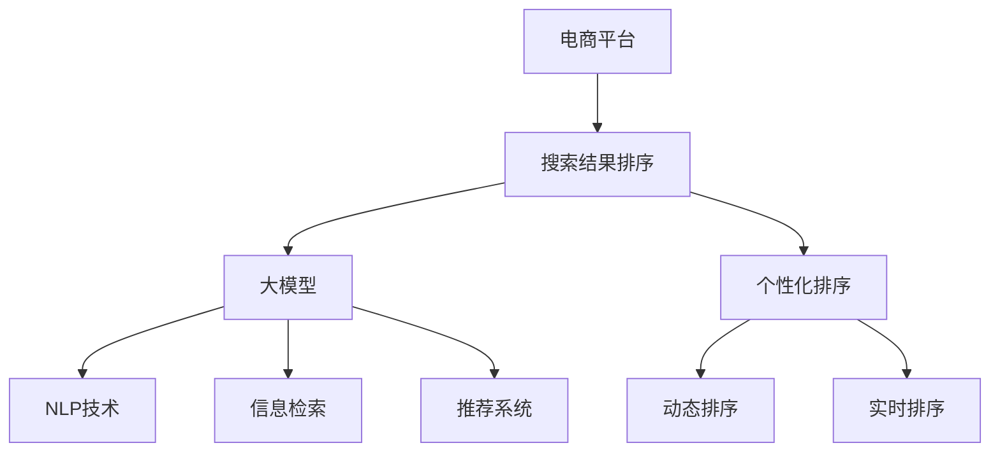

                 

# 电商平台搜索结果排序：AI大模型的新算法

> 关键词：电商平台, 搜索结果排序, 大模型, AI算法, 自然语言处理(NLP), 信息检索, 推荐系统

## 1. 背景介绍

### 1.1 问题由来
随着电商平台的快速发展，如何有效地为用户提供最相关、最满意的搜索结果，成为平台竞争力的一个关键指标。传统的基于关键词匹配和文本相似度计算的搜索排序算法，往往难以充分利用商品的多维信息（如价格、评价、销量等）和用户的多样需求（如价格敏感度、品牌偏好等）。为此，电商平台迫切需要引入更为先进的技术，以提升搜索结果的准确性和用户满意度。

### 1.2 问题核心关键点
目前，基于AI技术的搜索排序算法，通过深度学习模型和大语言模型，在处理海量数据、捕捉商品和用户的多维度特征上，具备明显的优势。这些模型不仅能进行自然语言理解，还能学习用户行为数据，提供个性化的搜索结果。但模型构建、训练和部署的复杂性也成为平台采用这些技术的一大挑战。

### 1.3 问题研究意义
高效、准确的搜索结果排序算法，能够显著提升用户满意度，增加用户停留时间和购物转化率，直接关系到电商平台的商业成功。利用AI大模型进行搜索排序，可以更好地利用数据，优化排序策略，实现个性化、智能化的搜索结果排序，进而推动电商平台向更加智能、高效、个性化的方向发展。

## 2. 核心概念与联系

### 2.1 核心概念概述

为更好地理解基于AI大模型的电商平台搜索结果排序算法，本节将介绍几个密切相关的核心概念：

- 电商平台：指通过互联网进行商品展示、交易的在线平台，涵盖在线商店、第三方市场等多种形式。
- 搜索结果排序：指在用户输入搜索词后，电商平台从商品库中筛选并排序展示相关商品的过程。
- 大模型：指基于深度学习技术，通过大规模数据预训练得到的通用语言模型，具备强大的语言理解和生成能力。
- 自然语言处理(NLP)：指利用计算机处理、理解和生成自然语言的技术，包括词法分析、句法分析、语义分析、生成等。
- 信息检索：指从大规模数据集或文献库中，快速检索出满足用户查询需求的相关信息。
- 推荐系统：指利用用户行为数据和商品特征数据，向用户推荐感兴趣的商品或内容的技术。

这些核心概念之间的逻辑关系可以通过以下Mermaid流程图来展示：



这个流程图展示了大模型在电商平台搜索结果排序中的核心作用：

1. 电商平台通过大模型理解用户输入的搜索词。
2. 大模型结合NLP技术，抽取并理解商品标题、描述等信息。
3. 大模型使用信息检索技术，从商品库中快速筛选相关商品。
4. 大模型结合推荐系统，预测用户对商品的兴趣，优化排序结果。
5. 搜索结果排序算法，根据用户行为和商品特征进行个性化、动态、实时排序。

这些核心概念共同构成了电商平台搜索排序的完整框架，使其能够为用户提供高效、满意的搜索结果。

## 3. 核心算法原理 & 具体操作步骤

### 3.1 算法原理概述

基于AI大模型的电商平台搜索结果排序算法，本质上是一个复杂的多任务学习过程。其核心思想是：将用户搜索词和商品信息，输入到预训练的大模型中，通过模型的语义理解和学习用户行为特征，为每个商品打分，并按照分数高低进行排序。

形式化地，假设搜索词为 $Q$，商品信息为 $\{P_i\}_{i=1}^N$，其中 $P_i$ 包括标题、描述、评价等信息。预训练大模型为 $M_{\theta}$，其中 $\theta$ 为预训练得到的模型参数。排序算法目标是最小化排序损失函数 $\mathcal{L}$，即：

$$
\mathcal{L}(Q, \{P_i\}) = \min_{\theta} \sum_{i=1}^N \ell(Q, P_i)
$$

其中 $\ell(Q, P_i)$ 为评估用户输入搜索词 $Q$ 与商品 $P_i$ 相关性的损失函数，可通过自然语言处理技术和推荐系统等方法设计。

### 3.2 算法步骤详解

基于AI大模型的电商平台搜索结果排序算法一般包括以下几个关键步骤：

**Step 1: 数据预处理**

- 收集用户搜索记录和商品信息，整理成训练数据集 $D=\{(Q_i, \{P_i\}_i)\}_{i=1}^N$。
- 对商品信息进行清洗和结构化处理，提取商品的关键特征。
- 对搜索词进行分词和词性标注，以便输入到大模型中进行处理。

**Step 2: 模型选择与适配**

- 选择合适的预训练语言模型 $M_{\theta}$，如BERT、GPT等。
- 在模型顶层添加分类器或评分器，适应排序任务的需求。
- 选择适当的优化算法和超参数，如AdamW、SGD等，以及学习率、批大小、迭代轮数等。

**Step 3: 模型训练**

- 使用训练数据集 $D$，将搜索词 $Q_i$ 和商品 $P_i$ 作为输入，输入到大模型中计算得分 $s_i$。
- 对得分 $s_i$ 进行归一化处理，得到排序分数。
- 通过梯度下降等优化算法更新模型参数 $\theta$，最小化排序损失函数 $\mathcal{L}$。

**Step 4: 排序与反馈**

- 根据排序分数对商品进行排序，返回前 $K$ 个商品作为搜索结果。
- 根据用户对搜索结果的反馈（如点击、浏览、购买等行为），对排序算法进行迭代优化，提升排序精度。

### 3.3 算法优缺点

基于AI大模型的电商平台搜索结果排序算法具有以下优点：

1. 高效性：利用预训练大模型的语义理解能力，可以快速处理和分析大量文本数据，提升排序效率。
2. 准确性：大模型具备强大的自然语言处理能力，能准确理解用户输入和商品信息，提高排序的准确性。
3. 可扩展性：基于预训练大模型的微调方法，可以轻松适应不同的商品类型和用户需求，提升算法的通用性。
4. 个性化：结合推荐系统，能够根据用户行为数据和商品特征，实现个性化的搜索结果排序。

同时，该算法也存在一些局限性：

1. 数据依赖：排序算法的表现高度依赖于训练数据的覆盖率和质量。
2. 模型复杂性：大模型的复杂性增加了算法的部署和维护难度。
3. 训练成本：大模型的训练和微调需要大量的计算资源和时间。
4. 对抗攻击：大模型可能存在对抗性漏洞，导致排序结果被恶意干扰。

尽管存在这些局限性，但总体而言，基于AI大模型的搜索排序算法，在处理电商平台的搜索排序问题上，具有显著优势，值得广泛应用和研究。

### 3.4 算法应用领域

基于AI大模型的电商平台搜索结果排序算法，主要应用于以下领域：

- 电商搜索：提升用户搜索结果的相关性和满意度，缩短购物路径。
- 推荐系统：结合用户行为数据，提供个性化的商品推荐。
- 广告投放：根据用户兴趣和行为，优化广告展示效果。
- 内容推荐：对新闻、视频、音乐等媒体内容进行个性化推荐。
- 客户服务：通过自然语言处理技术，实现智能客服和虚拟助手。

这些领域的应用，使得AI大模型在电商平台中的应用前景广阔，具有显著的社会和经济价值。

## 4. 数学模型和公式 & 详细讲解 & 举例说明

### 4.1 数学模型构建

本节将使用数学语言对基于AI大模型的电商平台搜索结果排序算法进行更加严格的刻画。

记搜索词为 $Q$，商品信息为 $\{P_i\}_{i=1}^N$。预训练大模型为 $M_{\theta}$，其中 $\theta$ 为预训练得到的模型参数。排序算法目标是最小化排序损失函数 $\mathcal{L}$，即：

$$
\mathcal{L}(Q, \{P_i\}) = \min_{\theta} \sum_{i=1}^N \ell(Q, P_i)
$$

其中 $\ell(Q, P_i)$ 为评估用户输入搜索词 $Q$ 与商品 $P_i$ 相关性的损失函数。常见的损失函数包括交叉熵损失、余弦相似度损失、加权平均损失等。

### 4.2 公式推导过程

以下我们以交叉熵损失函数为例，推导基于AI大模型的电商平台搜索结果排序算法。

假设搜索词 $Q$ 和商品 $P_i$ 分别编码为 $x$ 和 $y$，大模型 $M_{\theta}$ 的输出为 $s_i$。交叉熵损失函数定义为：

$$
\ell(Q, P_i) = -[y\log s_i + (1-y)\log (1-s_i)]
$$

将上式代入排序损失函数，得：

$$
\mathcal{L}(Q, \{P_i\}) = -\frac{1}{N}\sum_{i=1}^N [y_i\log s_i + (1-y_i)\log(1-s_i)]
$$

其中 $y_i \in \{0,1\}$ 表示商品 $P_i$ 是否为搜索结果。

在得到损失函数后，即可带入优化算法求解。假设优化算法为AdamW，学习率为 $\eta$，则模型参数的更新公式为：

$$
\theta \leftarrow \theta - \eta \nabla_{\theta}\mathcal{L}(Q, \{P_i\}) - \eta\lambda\theta
$$

其中 $\nabla_{\theta}\mathcal{L}(Q, \{P_i\})$ 为损失函数对模型参数的梯度，可通过反向传播算法高效计算。

### 4.3 案例分析与讲解

假设某电商平台希望使用大模型进行搜索结果排序。在模型选择上，可以选择BERT作为预训练语言模型，在模型顶层添加一个线性分类器，用于评估每个商品与搜索词的相关性。训练集 $D$ 包括用户的搜索记录和对应的商品信息。

模型的输入为搜索词 $Q$ 和商品信息 $P_i$，输出为每个商品的相关性分数 $s_i$。具体实现中，可以使用HuggingFace提供的Transformers库，实现BERT模型的微调。微调过程中，使用交叉熵损失函数作为优化目标，通过AdamW优化器进行训练，逐步优化模型参数。

在模型训练结束后，根据每个商品的得分 $s_i$ 进行排序，返回前 $K$ 个商品作为搜索结果。同时，平台可以实时收集用户对搜索结果的反馈数据，如点击、浏览、购买等，进一步优化排序算法。

## 5. 项目实践：代码实例和详细解释说明

### 5.1 开发环境搭建

在进行基于AI大模型的电商平台搜索结果排序实践前，我们需要准备好开发环境。以下是使用Python进行PyTorch开发的环境配置流程：

1. 安装Anaconda：从官网下载并安装Anaconda，用于创建独立的Python环境。

2. 创建并激活虚拟环境：
```bash
conda create -n pytorch-env python=3.8 
conda activate pytorch-env
```

3. 安装PyTorch：根据CUDA版本，从官网获取对应的安装命令。例如：
```bash
conda install pytorch torchvision torchaudio cudatoolkit=11.1 -c pytorch -c conda-forge
```

4. 安装Transformers库：
```bash
pip install transformers
```

5. 安装各类工具包：
```bash
pip install numpy pandas scikit-learn matplotlib tqdm jupyter notebook ipython
```

完成上述步骤后，即可在`pytorch-env`环境中开始微调实践。

### 5.2 源代码详细实现

下面我们以电商搜索排序任务为例，给出使用Transformers库对BERT模型进行微调的PyTorch代码实现。

首先，定义排序任务的数据处理函数：

```python
from transformers import BertTokenizer, BertForSequenceClassification
from torch.utils.data import Dataset
import torch

class SearchDataset(Dataset):
    def __init__(self, search_records, product_info, tokenizer, max_len=128):
        self.search_records = search_records
        self.product_info = product_info
        self.tokenizer = tokenizer
        self.max_len = max_len
        
    def __len__(self):
        return len(self.search_records)
    
    def __getitem__(self, item):
        search_record = self.search_records[item]
        product = self.product_info[item]
        
        # 将搜索记录和商品信息合并成一行文本
        text = search_record + product['title'] + product['description']
        encoding = self.tokenizer(text, return_tensors='pt', max_length=self.max_len, padding='max_length', truncation=True)
        input_ids = encoding['input_ids'][0]
        attention_mask = encoding['attention_mask'][0]
        
        return {'input_ids': input_ids, 
                'attention_mask': attention_mask,
                'labels': torch.tensor([1 if product['title'] in search_record else 0], dtype=torch.long)}
```

然后，定义模型和优化器：

```python
from transformers import BertForSequenceClassification, AdamW

model = BertForSequenceClassification.from_pretrained('bert-base-cased', num_labels=2)

optimizer = AdamW(model.parameters(), lr=2e-5)
```

接着，定义训练和评估函数：

```python
from torch.utils.data import DataLoader
from tqdm import tqdm
from sklearn.metrics import classification_report

device = torch.device('cuda') if torch.cuda.is_available() else torch.device('cpu')
model.to(device)

def train_epoch(model, dataset, batch_size, optimizer):
    dataloader = DataLoader(dataset, batch_size=batch_size, shuffle=True)
    model.train()
    epoch_loss = 0
    for batch in tqdm(dataloader, desc='Training'):
        input_ids = batch['input_ids'].to(device)
        attention_mask = batch['attention_mask'].to(device)
        labels = batch['labels'].to(device)
        model.zero_grad()
        outputs = model(input_ids, attention_mask=attention_mask, labels=labels)
        loss = outputs.loss
        epoch_loss += loss.item()
        loss.backward()
        optimizer.step()
    return epoch_loss / len(dataloader)

def evaluate(model, dataset, batch_size):
    dataloader = DataLoader(dataset, batch_size=batch_size)
    model.eval()
    preds, labels = [], []
    with torch.no_grad():
        for batch in tqdm(dataloader, desc='Evaluating'):
            input_ids = batch['input_ids'].to(device)
            attention_mask = batch['attention_mask'].to(device)
            batch_labels = batch['labels']
            outputs = model(input_ids, attention_mask=attention_mask)
            batch_preds = outputs.logits.argmax(dim=2).to('cpu').tolist()
            batch_labels = batch_labels.to('cpu').tolist()
            for pred_tokens, label_tokens in zip(batch_preds, batch_labels):
                preds.append(pred_tokens)
                labels.append(label_tokens)
                
    print(classification_report(labels, preds))
```

最后，启动训练流程并在测试集上评估：

```python
epochs = 5
batch_size = 16

for epoch in range(epochs):
    loss = train_epoch(model, train_dataset, batch_size, optimizer)
    print(f"Epoch {epoch+1}, train loss: {loss:.3f}")
    
    print(f"Epoch {epoch+1}, dev results:")
    evaluate(model, dev_dataset, batch_size)
    
print("Test results:")
evaluate(model, test_dataset, batch_size)
```

以上就是使用PyTorch对BERT进行电商搜索排序任务的完整代码实现。可以看到，得益于Transformers库的强大封装，我们可以用相对简洁的代码完成BERT模型的加载和微调。

### 5.3 代码解读与分析

让我们再详细解读一下关键代码的实现细节：

**SearchDataset类**：
- `__init__`方法：初始化搜索记录、商品信息、分词器等关键组件。
- `__len__`方法：返回数据集的样本数量。
- `__getitem__`方法：对单个样本进行处理，将搜索记录和商品信息合并成一行文本，输入到分词器中得到token ids，并将标签编码为数字，进行定长padding，最终返回模型所需的输入。

**标签编码**：
- 将商品标题是否在搜索记录中出现作为标签，标签为0或1。

**模型和优化器**：
- 使用BertForSequenceClassification模型，添加线性分类器，用于评估每个商品的相关性。
- 使用AdamW优化器，设置学习率。

**训练和评估函数**：
- 使用PyTorch的DataLoader对数据集进行批次化加载，供模型训练和推理使用。
- 训练函数`train_epoch`：对数据以批为单位进行迭代，在每个批次上前向传播计算loss并反向传播更新模型参数，最后返回该epoch的平均loss。
- 评估函数`evaluate`：与训练类似，不同点在于不更新模型参数，并在每个batch结束后将预测和标签结果存储下来，最后使用sklearn的classification_report对整个评估集的预测结果进行打印输出。

**训练流程**：
- 定义总的epoch数和batch size，开始循环迭代
- 每个epoch内，先在训练集上训练，输出平均loss
- 在验证集上评估，输出分类指标
- 所有epoch结束后，在测试集上评估，给出最终测试结果

可以看到，PyTorch配合Transformers库使得BERT微调的代码实现变得简洁高效。开发者可以将更多精力放在数据处理、模型改进等高层逻辑上，而不必过多关注底层的实现细节。

当然，工业级的系统实现还需考虑更多因素，如模型的保存和部署、超参数的自动搜索、更灵活的任务适配层等。但核心的微调范式基本与此类似。

## 6. 实际应用场景

### 6.1 智能客服系统

基于大模型的电商平台搜索结果排序算法，可以广泛应用于智能客服系统的构建。传统客服往往需要配备大量人力，高峰期响应缓慢，且一致性和专业性难以保证。而使用微调后的排序算法，可以7x24小时不间断服务，快速响应客户咨询，用自然流畅的语言回答各类常见问题。

在技术实现上，可以收集用户的历史客服对话记录，将问题-回答对作为监督数据，训练排序模型学习匹配答案。微调后的排序模型能够自动理解用户意图，匹配最合适的答案模板进行回复。对于客户提出的新问题，还可以接入检索系统实时搜索相关内容，动态组织生成回答。如此构建的智能客服系统，能大幅提升客户咨询体验和问题解决效率。

### 6.2 金融舆情监测

金融机构需要实时监测市场舆论动向，以便及时应对负面信息传播，规避金融风险。传统的人工监测方式成本高、效率低，难以应对网络时代海量信息爆发的挑战。基于大语言模型微调的文本分类和情感分析技术，为金融舆情监测提供了新的解决方案。

具体而言，可以收集金融领域相关的新闻、报道、评论等文本数据，并对其进行主题标注和情感标注。在此基础上对预训练语言模型进行微调，使其能够自动判断文本属于何种主题，情感倾向是正面、中性还是负面。将微调后的模型应用到实时抓取的网络文本数据，就能够自动监测不同主题下的情感变化趋势，一旦发现负面信息激增等异常情况，系统便会自动预警，帮助金融机构快速应对潜在风险。

### 6.3 个性化推荐系统

当前的推荐系统往往只依赖用户的历史行为数据进行物品推荐，无法深入理解用户的真实兴趣偏好。基于大语言模型微调技术，个性化推荐系统可以更好地挖掘用户行为背后的语义信息，从而提供个性化的推荐内容。

在实践中，可以收集用户浏览、点击、评论、分享等行为数据，提取和用户交互的物品标题、描述、标签等文本内容。将文本内容作为模型输入，用户的后续行为（如是否点击、购买等）作为监督信号，在此基础上微调预训练语言模型。微调后的模型能够从文本内容中准确把握用户的兴趣点。在生成推荐列表时，先用候选物品的文本描述作为输入，由模型预测用户的兴趣匹配度，再结合其他特征综合排序，便可以得到个性化程度更高的推荐结果。

### 6.4 未来应用展望

随着大语言模型微调技术的发展，基于AI的电商平台搜索结果排序算法将在更多领域得到应用，为传统行业带来变革性影响。

在智慧医疗领域，基于微调的搜索排序算法，可以帮助医生快速找到相关医学文献和病历资料，提升诊疗效率。

在智能教育领域，微调技术可应用于作业批改、学情分析、知识推荐等方面，因材施教，促进教育公平，提高教学质量。

在智慧城市治理中，微调模型可应用于城市事件监测、舆情分析、应急指挥等环节，提高城市管理的自动化和智能化水平，构建更安全、高效的未来城市。

此外，在企业生产、社会治理、文娱传媒等众多领域，基于大模型微调的AI应用也将不断涌现，为经济社会发展注入新的动力。相信随着技术的日益成熟，微调方法将成为AI技术落地应用的重要范式，推动AI技术向更广阔的领域加速渗透。

## 7. 工具和资源推荐

### 7.1 学习资源推荐

为了帮助开发者系统掌握基于AI大模型的电商平台搜索结果排序算法，这里推荐一些优质的学习资源：

1. 《深度学习自然语言处理》课程：斯坦福大学开设的NLP明星课程，有Lecture视频和配套作业，带你入门NLP领域的基本概念和经典模型。

2. CS224N《深度学习自然语言处理》书籍：深度学习领域的经典教材，涵盖自然语言处理的基本原理和高级技术，适合深入学习。

3. 《Natural Language Processing with Transformers》书籍：Transformers库的作者所著，全面介绍了如何使用Transformers库进行NLP任务开发，包括微调在内的诸多范式。

4. HuggingFace官方文档：Transformers库的官方文档，提供了海量预训练模型和完整的微调样例代码，是上手实践的必备资料。

5. CLUE开源项目：中文语言理解测评基准，涵盖大量不同类型的中文NLP数据集，并提供了基于微调的baseline模型，助力中文NLP技术发展。

通过对这些资源的学习实践，相信你一定能够快速掌握基于AI大模型的电商平台搜索结果排序算法的精髓，并用于解决实际的NLP问题。

### 7.2 开发工具推荐

高效的开发离不开优秀的工具支持。以下是几款用于大模型微调开发的常用工具：

1. PyTorch：基于Python的开源深度学习框架，灵活动态的计算图，适合快速迭代研究。大部分预训练语言模型都有PyTorch版本的实现。

2. TensorFlow：由Google主导开发的开源深度学习框架，生产部署方便，适合大规模工程应用。同样有丰富的预训练语言模型资源。

3. Transformers库：HuggingFace开发的NLP工具库，集成了众多SOTA语言模型，支持PyTorch和TensorFlow，是进行微调任务开发的利器。

4. Weights & Biases：模型训练的实验跟踪工具，可以记录和可视化模型训练过程中的各项指标，方便对比和调优。与主流深度学习框架无缝集成。

5. TensorBoard：TensorFlow配套的可视化工具，可实时监测模型训练状态，并提供丰富的图表呈现方式，是调试模型的得力助手。

6. Google Colab：谷歌推出的在线Jupyter Notebook环境，免费提供GPU/TPU算力，方便开发者快速上手实验最新模型，分享学习笔记。

合理利用这些工具，可以显著提升大模型微调的开发效率，加快创新迭代的步伐。

### 7.3 相关论文推荐

大语言模型和微调技术的发展源于学界的持续研究。以下是几篇奠基性的相关论文，推荐阅读：

1. Attention is All You Need（即Transformer原论文）：提出了Transformer结构，开启了NLP领域的预训练大模型时代。

2. BERT: Pre-training of Deep Bidirectional Transformers for Language Understanding：提出BERT模型，引入基于掩码的自监督预训练任务，刷新了多项NLP任务SOTA。

3. Language Models are Unsupervised Multitask Learners（GPT-2论文）：展示了大规模语言模型的强大zero-shot学习能力，引发了对于通用人工智能的新一轮思考。

4. Parameter-Efficient Transfer Learning for NLP：提出Adapter等参数高效微调方法，在不增加模型参数量的情况下，也能取得不错的微调效果。

5. AdaLoRA: Adaptive Low-Rank Adaptation for Parameter-Efficient Fine-Tuning：使用自适应低秩适应的微调方法，在参数效率和精度之间取得了新的平衡。

这些论文代表了大语言模型微调技术的发展脉络。通过学习这些前沿成果，可以帮助研究者把握学科前进方向，激发更多的创新灵感。

## 8. 总结：未来发展趋势与挑战

### 8.1 总结

本文对基于AI大模型的电商平台搜索结果排序算法进行了全面系统的介绍。首先阐述了电商平台搜索排序问题的背景和意义，明确了AI大模型在此类问题上发挥的关键作用。其次，从原理到实践，详细讲解了算法的基本流程和关键步骤，给出了微调任务开发的完整代码实例。同时，本文还广泛探讨了算法在电商搜索、金融舆情、个性化推荐等多个行业领域的应用前景，展示了算法的广阔前景。

通过本文的系统梳理，可以看到，基于AI大模型的搜索排序算法，在电商平台中的应用前景广阔，具有显著的社会和经济价值。未来，伴随大模型的不断演进和优化，该算法有望在更多应用场景中发挥重要作用。

### 8.2 未来发展趋势

展望未来，基于AI大模型的电商平台搜索结果排序算法将呈现以下几个发展趋势：

1. 模型规模持续增大。随着算力成本的下降和数据规模的扩张，预训练大模型的参数量还将持续增长。超大规模语言模型蕴含的丰富语言知识，有望支撑更加复杂多变的搜索排序问题。

2. 微调方法日趋多样。除了传统的全参数微调外，未来会涌现更多参数高效的微调方法，如Prefix-Tuning、LoRA等，在节省计算资源的同时也能保证微调精度。

3. 持续学习成为常态。随着数据分布的不断变化，微调模型也需要持续学习新知识以保持性能。如何在不遗忘原有知识的同时，高效吸收新样本信息，将成为重要的研究课题。

4. 标注样本需求降低。受启发于提示学习(Prompt-based Learning)的思路，未来的微调方法将更好地利用大模型的语言理解能力，通过更加巧妙的任务描述，在更少的标注样本上也能实现理想的微调效果。

5. 对抗攻击抵御。大模型可能存在对抗性漏洞，导致搜索结果被恶意干扰。如何提高模型的鲁棒性，避免对抗攻击，也是未来亟待解决的问题。

6. 模型通用性增强。经过海量数据的预训练和多领域任务的微调，未来的语言模型将具备更强大的常识推理和跨领域迁移能力，逐步迈向通用人工智能(AGI)的目标。

以上趋势凸显了基于AI大模型的搜索排序算法的广阔前景。这些方向的探索发展，必将进一步提升算法的效果和性能，为电商平台带来更大的价值。

### 8.3 面临的挑战

尽管基于AI大模型的搜索排序算法已经取得了瞩目成就，但在迈向更加智能化、普适化应用的过程中，它仍面临着诸多挑战：

1. 数据依赖。排序算法的表现高度依赖于训练数据的覆盖率和质量。

2. 模型复杂性。大模型的复杂性增加了算法的部署和维护难度。

3. 训练成本。大模型的训练和微调需要大量的计算资源和时间。

4. 对抗攻击。大模型可能存在对抗性漏洞，导致搜索结果被恶意干扰。

5. 推理效率。大模型尽管精度高，但在实际部署时往往面临推理速度慢、内存占用大等效率问题。

6. 可解释性。当前大模型更像是"黑盒"系统，难以解释其内部工作机制和决策逻辑。

尽管存在这些挑战，但总体而言，基于AI大模型的搜索排序算法，在处理电商平台的搜索排序问题上，具有显著优势，值得广泛应用和研究。

### 8.4 研究展望

面对大模型排序算法面临的种种挑战，未来的研究需要在以下几个方面寻求新的突破：

1. 探索无监督和半监督微调方法。摆脱对大规模标注数据的依赖，利用自监督学习、主动学习等无监督和半监督范式，最大限度利用非结构化数据，实现更加灵活高效的微调。

2. 研究参数高效和计算高效的微调范式。开发更加参数高效的微调方法，在固定大部分预训练参数的同时，只更新极少量的任务相关参数。同时优化微调模型的计算图，减少前向传播和反向传播的资源消耗，实现更加轻量级、实时性的部署。

3. 融合因果和对比学习范式。通过引入因果推断和对比学习思想，增强排序模型建立稳定因果关系的能力，学习更加普适、鲁棒的语言表征，从而提升模型泛化性和抗干扰能力。

4. 引入更多先验知识。将符号化的先验知识，如知识图谱、逻辑规则等，与神经网络模型进行巧妙融合，引导排序过程学习更准确、合理的语言模型。同时加强不同模态数据的整合，实现视觉、语音等多模态信息与文本信息的协同建模。

5. 结合因果分析和博弈论工具。将因果分析方法引入排序模型，识别出模型决策的关键特征，增强输出解释的因果性和逻辑性。借助博弈论工具刻画人机交互过程，主动探索并规避模型的脆弱点，提高系统稳定性。

6. 纳入伦理道德约束。在模型训练目标中引入伦理导向的评估指标，过滤和惩罚有偏见、有害的输出倾向。同时加强人工干预和审核，建立模型行为的监管机制，确保输出符合人类价值观和伦理道德。

这些研究方向的探索，必将引领基于AI大模型的搜索排序算法向更高的台阶发展，为电商平台带来更大的价值。面向未来，算法还需与其他人工智能技术进行更深入的融合，如知识表示、因果推理、强化学习等，多路径协同发力，共同推动自然语言理解和智能交互系统的进步。只有勇于创新、敢于突破，才能不断拓展语言模型的边界，让智能技术更好地造福人类社会。

## 9. 附录：常见问题与解答

**Q1：基于AI大模型的搜索排序算法是否适用于所有电商平台？**

A: 基于AI大模型的搜索排序算法，在大多数电商平台中都能取得不错的效果，特别是对于数据量较大的平台。但对于一些小型或特殊类型的平台，如低频商品交易平台，可能需要进一步针对性地设计和优化模型。

**Q2：微调过程中如何选择合适的学习率？**

A: 微调的学习率一般要比预训练时小1-2个数量级，如果使用过大的学习率，容易破坏预训练权重，导致过拟合。一般建议从1e-5开始调参，逐步减小学习率，直至收敛。也可以使用warmup策略，在开始阶段使用较小的学习率，再逐渐过渡到预设值。

**Q3：在电商平台中，如何评估搜索排序算法的性能？**

A: 电商平台的搜索排序算法性能通常通过以下指标来评估：
1. 点击率(Click-Through Rate, CTR)：用户点击搜索结果的频率。
2. 转化率(Conversion Rate, CR)：用户点击后完成购买的比例。
3. 平均点击率(Click-Through Rate, CTR)：用户点击与展示的比例。
4. 平均转化率(Conversion Rate, CR)：用户完成购买与展示的比例。
5. 展示率(Impression Rate, IR)：搜索结果展示的频率。
6. 相关度(Relatedness)：搜索结果与用户输入的匹配度。

这些指标通常会结合业务需求进行定义和调整。

**Q4：如何缓解搜索排序算法中的冷启动问题？**

A: 冷启动问题是指在用户历史数据不足的情况下，搜索结果排序难以准确。缓解冷启动问题的方法包括：
1. 引入先验知识：将商品的属性、类别等先验信息作为输入，提升排序精度。
2. 用户画像建模：构建用户画像，基于用户兴趣和行为特征进行排序。
3. 增强学习能力：引入强化学习、对抗学习等方法，提升模型对新数据的适应能力。
4. 动态更新：实时更新模型参数，根据新数据动态调整排序策略。

通过这些方法，可以在一定程度上缓解冷启动问题，提升排序算法的鲁棒性和泛化能力。

**Q5：搜索排序算法在实际部署中需要注意哪些问题？**

A: 搜索排序算法在实际部署中需要注意以下几个问题：
1. 性能优化：优化模型推理速度，降低内存占用，提高响应速度。
2. 系统架构：设计高效的系统架构，保证高并发和高吞吐。
3. 数据安全：确保数据传输和存储的安全性，防止数据泄露和攻击。
4. 反馈机制：建立用户反馈机制，根据用户行为进行持续优化。
5. 模型监控：实时监控模型性能和稳定状态，及时发现和修复问题。

合理解决这些问题，可以确保搜索排序算法在实际部署中稳定高效地运行。

---

作者：禅与计算机程序设计艺术 / Zen and the Art of Computer Programming

