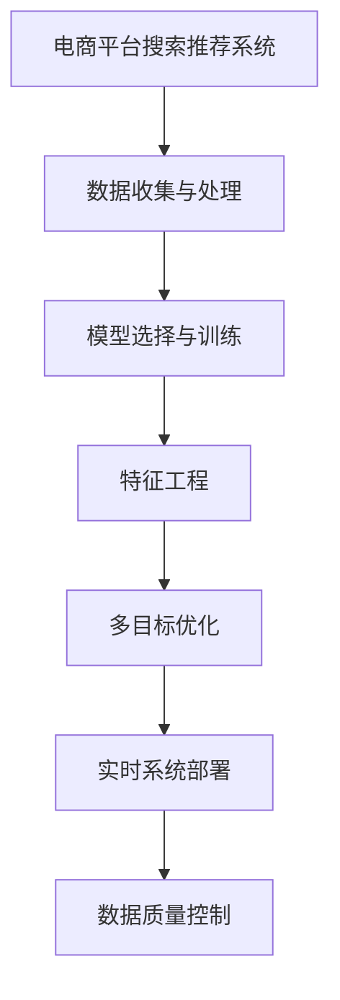

                 

# 电商平台的AI 大模型实践：搜索推荐系统是核心，数据质量与处理能力

## 1. 背景介绍

### 1.1 问题由来

随着电商平台的迅速发展，用户体验成为竞争的关键因素之一。如何通过算法优化提升用户体验，成为电商平台亟需解决的问题。特别是搜索推荐系统，作为用户获取商品信息的重要入口，其表现直接影响平台的转化率、用户粘性及市场竞争力。为此，各大电商平台纷纷引入人工智能技术，通过搜索推荐系统的优化，提升用户体验，增加用户满意度。

近年来，基于深度学习技术的大型预训练模型在NLP领域取得了重大突破。其强大的语言理解和生成能力，使得它在电商平台的搜索推荐系统中得到了广泛应用。特别是在中文电商领域，由于中文分词和理解难度高，传统的机器学习模型在处理中文电商搜索数据时存在诸多限制，而预训练模型则以其强大的语言建模能力，能够有效解决这些问题，提升推荐系统的准确性。

### 1.2 问题核心关键点

电商平台搜索推荐系统涉及到的核心关键点包括：

- 用户行为数据的收集与处理：通过点击、浏览、购买等行为数据，收集用户偏好信息，并进行预处理，生成可被模型使用的特征。
- 模型选择与训练：选择合适的预训练语言模型，在电商平台数据上进行微调，优化模型参数。
- 多目标优化：在提升准确性的同时，保证模型效率和成本控制，平衡算法复杂度与业务需求。
- 数据质量控制：保证数据的准确性和多样性，避免模型过拟合和泛化能力不足。
- 实时系统部署：将训练好的模型部署到线上实时系统，实现高效的推荐服务。

本文将聚焦于基于大模型的电商搜索推荐系统，介绍其核心技术原理、操作步骤和实践案例，并探讨其在电商平台中的应用前景与挑战。

## 2. 核心概念与联系

### 2.1 核心概念概述

为了更好地理解电商平台搜索推荐系统的核心技术，我们需要明确以下概念：

- **电商平台搜索推荐系统**：指基于用户行为数据，通过算法计算，为每位用户推荐最适合的商品信息，提升用户购买体验的系统。

- **大模型**：指经过大规模无监督训练，具备强大语言表示能力的深度学习模型，如BERT、GPT等。

- **预训练与微调**：预训练是指在大规模无标签数据上进行训练，学习通用的语言表示；微调是指在特定任务数据上，通过有监督学习进一步优化模型，以适应具体应用场景。

- **特征工程**：指通过数据处理和特征选择，将原始用户行为数据转换为模型可理解的输入特征。

- **多目标优化**：指在优化算法中同时考虑准确率、召回率、实时性、成本等多个目标，寻找综合最优解。

- **实时系统部署**：指将训练好的模型嵌入到电商平台的实时搜索推荐系统中，实现高效服务。

- **数据质量控制**：指通过数据清洗、标注、归一化等手段，保证数据的准确性和多样性，提高模型的泛化能力。

这些概念之间的联系可以通过以下Mermaid流程图来展示：



该流程图展示了搜索推荐系统的核心流程：从数据收集与处理开始，经过模型选择与训练、特征工程、多目标优化和实时系统部署，最终实现高效推荐服务，并保证数据质量。

## 3. 核心算法原理 & 具体操作步骤

### 3.1 算法原理概述

电商平台搜索推荐系统通常采用如下算法流程：

1. **数据收集与处理**：收集用户行为数据，进行数据清洗和预处理，生成特征向量。
2. **模型选择与训练**：选择合适的预训练语言模型，在电商平台数据上进行微调。
3. **特征工程**：对处理后的数据进行特征选择和编码，生成适合模型输入的特征向量。
4. **多目标优化**：在模型优化过程中，同时考虑准确率、召回率、实时性、成本等多个目标，寻找最优解。
5. **实时系统部署**：将训练好的模型嵌入到电商平台的实时搜索推荐系统中，实现高效推荐服务。
6. **数据质量控制**：通过数据清洗、标注、归一化等手段，保证数据的准确性和多样性。

### 3.2 算法步骤详解

**Step 1: 数据收集与处理**

电商平台的推荐系统依赖于大量的用户行为数据，包括浏览历史、点击行为、购买记录等。这些数据需要经过预处理，生成模型可接受的输入特征。

- **数据清洗**：去除重复、无效、异常数据，保证数据的完整性和一致性。
- **特征选择**：选取对推荐效果有显著影响的特征，减少模型复杂度，提升模型泛化能力。
- **归一化与标准化**：对特征值进行归一化处理，避免某些特征值过大导致模型不稳定。

**Step 2: 模型选择与训练**

选择合适的预训练语言模型，在电商平台数据上进行微调，优化模型参数。

- **模型选择**：选择合适的预训练语言模型，如BERT、GPT等，根据任务需求进行微调。
- **数据集划分**：将数据集划分为训练集、验证集和测试集，保证模型在验证集和测试集上的泛化能力。
- **训练流程**：使用Adam等优化算法，设置学习率、批大小等超参数，最小化损失函数，更新模型参数。

**Step 3: 特征工程**

对处理后的数据进行特征选择和编码，生成适合模型输入的特征向量。

- **特征编码**：将文本特征、数值特征等编码成向量，生成特征矩阵。
- **特征降维**：使用PCA、LDA等方法对特征矩阵进行降维，减少特征维度，提高计算效率。
- **特征组合**：对特征进行组合，生成更具表达力的特征。

**Step 4: 多目标优化**

在模型优化过程中，同时考虑准确率、召回率、实时性、成本等多个目标，寻找最优解。

- **损失函数设计**：根据任务需求，设计合适的损失函数，如交叉熵、余弦相似度等。
- **多目标优化算法**：使用SMOTE、ADA等算法，在模型训练过程中，平衡多个目标。

**Step 5: 实时系统部署**

将训练好的模型嵌入到电商平台的实时搜索推荐系统中，实现高效推荐服务。

- **模型嵌入**：将模型嵌入到电商平台的实时系统中，实现高效推荐。
- **实时数据处理**：实时处理用户查询请求，快速返回推荐结果。
- **系统优化**：通过负载均衡、缓存技术等手段，优化系统性能，提升用户体验。

**Step 6: 数据质量控制**

通过数据清洗、标注、归一化等手段，保证数据的准确性和多样性。

- **数据标注**：对数据进行标注，生成高质量的训练集。
- **数据增强**：通过数据增强技术，扩充训练集，提高模型泛化能力。
- **数据监控**：实时监控数据质量，保证数据的准确性和多样性。

### 3.3 算法优缺点

电商平台的搜索推荐系统基于大模型的微调方法具有以下优点：

1. **效率高**：在大模型基础上，微调所需的标注数据较少，能够快速适应新场景，提升推荐效率。
2. **效果显著**：大模型具有强大的语言表示能力，能够在少量数据上获得较优的推荐效果。
3. **可解释性强**：大模型的预训练过程可解释，能够帮助业务人员理解模型的决策过程，提升决策透明度。
4. **扩展性强**：大模型具有良好的可扩展性，能够快速适应不同领域的推荐需求。

但同时也存在一些缺点：

1. **对标注数据依赖高**：微调过程需要高质量的标注数据，标注成本较高。
2. **计算资源消耗大**：大模型训练和微调所需计算资源较大，对硬件要求较高。
3. **模型过拟合风险高**：数据量较少时，模型可能出现过拟合现象，泛化能力不足。
4. **实时性要求高**：实时推荐需要高性能计算资源，对系统架构和部署要求较高。
5. **模型复杂度高**：大模型参数量较大，导致推理速度较慢，增加系统复杂度。

### 3.4 算法应用领域

电商平台搜索推荐系统在大模型微调技术的应用领域主要包括：

- **商品推荐**：根据用户浏览历史、购买记录等数据，推荐可能感兴趣的商品。
- **个性化推荐**：根据用户个性化特征，推荐符合其喜好的商品。
- **搜索排序**：根据用户搜索词，推荐相关商品，优化搜索体验。
- **广告推荐**：推荐符合用户兴趣的广告，提升广告效果。
- **内容推荐**：推荐相关内容，提升平台粘性。

## 4. 数学模型和公式 & 详细讲解 & 举例说明

### 4.1 数学模型构建

电商平台的搜索推荐系统通常采用如下数学模型：

$$
\hat{y} = f(\mathbf{x}, \theta)
$$

其中，$\hat{y}$ 为推荐结果，$\mathbf{x}$ 为输入特征向量，$f$ 为模型函数，$\theta$ 为模型参数。

### 4.2 公式推导过程

以商品推荐为例，模型的输入特征包括用户历史浏览记录、浏览时长、购买记录等。模型输出为一个概率分布，表示每个商品被推荐的可能性。

假设模型输出为 $\hat{y} = [p_1, p_2, ..., p_n]$，其中 $p_i$ 为商品 $i$ 被推荐的可能性。则模型的损失函数为：

$$
\mathcal{L}(\theta) = \frac{1}{N}\sum_{i=1}^N \log p_i
$$

其中 $N$ 为样本数。

模型的优化目标是：

$$
\theta^* = \mathop{\arg\min}_{\theta} \mathcal{L}(\theta)
$$

通过梯度下降等优化算法，最小化损失函数，更新模型参数。

### 4.3 案例分析与讲解

以商品推荐为例，假设有一个电商平台，用户 $u$ 的历史浏览记录为 $[x_1, x_2, ..., x_n]$，购买记录为 $[y_1, y_2, ..., y_m]$。平台希望推荐商品 $i$ 给用户 $u$。

1. **数据收集**：收集用户 $u$ 的历史浏览记录和购买记录，生成特征向量 $\mathbf{x}$。
2. **模型选择与训练**：选择BERT模型，在电商平台数据上进行微调，生成推荐模型 $f(\mathbf{x}, \theta)$。
3. **特征工程**：对用户特征进行编码，生成特征向量 $\mathbf{x}$。
4. **多目标优化**：在模型优化过程中，同时考虑准确率、召回率、实时性、成本等多个目标，寻找最优解。
5. **实时系统部署**：将训练好的模型嵌入到电商平台的实时系统中，实现高效推荐。
6. **数据质量控制**：通过数据清洗、标注、归一化等手段，保证数据的准确性和多样性。

## 5. 项目实践：代码实例和详细解释说明

### 5.1 开发环境搭建

在进行电商平台的搜索推荐系统开发前，我们需要准备好开发环境。以下是使用Python进行PyTorch开发的环境配置流程：

1. 安装Anaconda：从官网下载并安装Anaconda，用于创建独立的Python环境。

2. 创建并激活虚拟环境：
```bash
conda create -n pytorch-env python=3.8 
conda activate pytorch-env
```

3. 安装PyTorch：根据CUDA版本，从官网获取对应的安装命令。例如：
```bash
conda install pytorch torchvision torchaudio cudatoolkit=11.1 -c pytorch -c conda-forge
```

4. 安装TensorFlow：由Google主导开发的开源深度学习框架，生产部署方便，适合大规模工程应用。同样有丰富的预训练语言模型资源。

5. 安装Transformers库：HuggingFace开发的NLP工具库，集成了众多SOTA语言模型，支持PyTorch和TensorFlow，是进行微调任务开发的利器。

6. 安装各类工具包：
```bash
pip install numpy pandas scikit-learn matplotlib tqdm jupyter notebook ipython
```

完成上述步骤后，即可在`pytorch-env`环境中开始搜索推荐系统的开发。

### 5.2 源代码详细实现

这里我们以基于BERT模型的电商商品推荐系统为例，给出使用Transformers库进行模型训练的PyTorch代码实现。

```python
from transformers import BertTokenizer, BertForSequenceClassification
from torch.utils.data import Dataset
import torch

class ItemDataset(Dataset):
    def __init__(self, items, labels):
        self.items = items
        self.labels = labels
        self.tokenizer = BertTokenizer.from_pretrained('bert-base-cased')
        
    def __len__(self):
        return len(self.items)
    
    def __getitem__(self, item):
        item = self.items[item]
        label = self.labels[item]
        
        encoding = self.tokenizer(item, return_tensors='pt', truncation=True)
        input_ids = encoding['input_ids']
        attention_mask = encoding['attention_mask']
        
        return {'input_ids': input_ids, 
                'attention_mask': attention_mask,
                'labels': torch.tensor(label, dtype=torch.long)}
```

接着，定义模型和优化器：

```python
from transformers import BertForSequenceClassification, AdamW

model = BertForSequenceClassification.from_pretrained('bert-base-cased', num_labels=1)

optimizer = AdamW(model.parameters(), lr=2e-5)
```

然后，定义训练和评估函数：

```python
from torch.utils.data import DataLoader
from tqdm import tqdm

device = torch.device('cuda') if torch.cuda.is_available() else torch.device('cpu')
model.to(device)

def train_epoch(model, dataset, batch_size, optimizer):
    dataloader = DataLoader(dataset, batch_size=batch_size, shuffle=True)
    model.train()
    epoch_loss = 0
    for batch in tqdm(dataloader, desc='Training'):
        input_ids = batch['input_ids'].to(device)
        attention_mask = batch['attention_mask'].to(device)
        labels = batch['labels'].to(device)
        model.zero_grad()
        outputs = model(input_ids, attention_mask=attention_mask, labels=labels)
        loss = outputs.loss
        epoch_loss += loss.item()
        loss.backward()
        optimizer.step()
    return epoch_loss / len(dataloader)

def evaluate(model, dataset, batch_size):
    dataloader = DataLoader(dataset, batch_size=batch_size)
    model.eval()
    preds, labels = [], []
    with torch.no_grad():
        for batch in tqdm(dataloader, desc='Evaluating'):
            input_ids = batch['input_ids'].to(device)
            attention_mask = batch['attention_mask'].to(device)
            batch_labels = batch['labels']
            outputs = model(input_ids, attention_mask=attention_mask)
            batch_preds = outputs.logits.argmax(dim=1).to('cpu').tolist()
            batch_labels = batch_labels.to('cpu').tolist()
            for pred, label in zip(batch_preds, batch_labels):
                preds.append(pred)
                labels.append(label)
                
    return preds, labels

epochs = 5
batch_size = 16

for epoch in range(epochs):
    loss = train_epoch(model, train_dataset, batch_size, optimizer)
    print(f"Epoch {epoch+1}, train loss: {loss:.3f}")
    
    preds, labels = evaluate(model, test_dataset, batch_size)
    print(classification_report(labels, preds))
    
print("Test results:")
preds, labels = evaluate(model, test_dataset, batch_size)
print(classification_report(labels, preds))
```

以上就是使用PyTorch对BERT模型进行电商商品推荐任务微调的完整代码实现。可以看到，得益于Transformers库的强大封装，我们可以用相对简洁的代码完成BERT模型的加载和微调。

### 5.3 代码解读与分析

让我们再详细解读一下关键代码的实现细节：

**ItemDataset类**：
- `__init__`方法：初始化商品数据、标签和分词器等组件。
- `__len__`方法：返回数据集的样本数量。
- `__getitem__`方法：对单个样本进行处理，将商品信息转换为token ids，生成模型可接受的输入。

**BertForSequenceClassification和AdamW**：
- `BertForSequenceClassification`：定义序列分类模型，用于商品推荐任务。
- `AdamW`：优化器，使用AdamW算法最小化损失函数。

**train_epoch和evaluate函数**：
- `train_epoch`：在训练集上迭代，计算每个批次的损失，并更新模型参数。
- `evaluate`：在测试集上评估模型性能，返回预测和标签。

**epochs、batch_size**：
- `epochs`：定义训练轮数。
- `batch_size`：定义每个批次的样本数量。

**训练流程**：
- 每个epoch内，先在训练集上训练，输出平均损失。
- 在测试集上评估，输出预测结果。
- 所有epoch结束后，在测试集上评估，输出测试结果。

可以看到，PyTorch配合Transformers库使得BERT微调的代码实现变得简洁高效。开发者可以将更多精力放在数据处理、模型改进等高层逻辑上，而不必过多关注底层的实现细节。

## 6. 实际应用场景

### 6.1 智能客服系统

基于大模型的电商搜索推荐系统，可以广泛应用于智能客服系统中。智能客服系统能够通过用户查询，推荐相关商品，提供快速响应和个性化服务，提升客户体验。

在技术实现上，可以收集用户历史查询记录，将查询转化为向量，作为模型输入，推荐可能感兴趣的商品。通过实时更新模型，智能客服系统能够动态生成推荐结果，提升服务效果。

### 6.2 推荐系统优化

电商平台商品推荐系统利用大模型进行优化，能够提升推荐精度，减少误导性推荐，提升用户满意度。通过优化模型参数，引入更高效的特征编码方式，可以进一步提升推荐系统的准确性和多样性，避免用户疲劳和过度推荐。

### 6.3 实时搜索排序

电商平台的实时搜索排序系统利用大模型，能够实时处理用户查询请求，返回相关商品，提升搜索体验。通过优化模型，引入动态调整的排序算法，可以更好地满足用户搜索需求，提升平台转化率。

### 6.4 未来应用展望

随着大模型和微调技术的不断发展，基于大模型的电商搜索推荐系统将呈现更多应用场景，为电商平台带来新的价值。

在智慧物流领域，基于大模型的搜索推荐系统可以辅助仓库管理，优化物流路径，提升物流效率。

在金融领域，基于大模型的搜索推荐系统可以推荐相关理财产品，提升金融服务体验。

在教育领域，基于大模型的搜索推荐系统可以推荐相关课程，提升学习效果。

总之，基于大模型的电商搜索推荐系统将为各行各业带来新的价值，推动NLP技术在垂直行业的应用。未来，随着大模型的规模和性能不断提升，搜索推荐系统将能够更好地满足用户需求，推动电商平台的创新发展。

## 7. 工具和资源推荐

### 7.1 学习资源推荐

为了帮助开发者系统掌握大语言模型微调的理论基础和实践技巧，这里推荐一些优质的学习资源：

1. 《Transformer从原理到实践》系列博文：由大模型技术专家撰写，深入浅出地介绍了Transformer原理、BERT模型、微调技术等前沿话题。

2. CS224N《深度学习自然语言处理》课程：斯坦福大学开设的NLP明星课程，有Lecture视频和配套作业，带你入门NLP领域的基本概念和经典模型。

3. 《Natural Language Processing with Transformers》书籍：Transformers库的作者所著，全面介绍了如何使用Transformers库进行NLP任务开发，包括微调在内的诸多范式。

4. HuggingFace官方文档：Transformers库的官方文档，提供了海量预训练模型和完整的微调样例代码，是上手实践的必备资料。

5. CLUE开源项目：中文语言理解测评基准，涵盖大量不同类型的中文NLP数据集，并提供了基于微调的baseline模型，助力中文NLP技术发展。

通过对这些资源的学习实践，相信你一定能够快速掌握大语言模型微调的精髓，并用于解决实际的NLP问题。

### 7.2 开发工具推荐

高效的开发离不开优秀的工具支持。以下是几款用于大语言模型微调开发的常用工具：

1. PyTorch：基于Python的开源深度学习框架，灵活动态的计算图，适合快速迭代研究。大部分预训练语言模型都有PyTorch版本的实现。

2. TensorFlow：由Google主导开发的开源深度学习框架，生产部署方便，适合大规模工程应用。同样有丰富的预训练语言模型资源。

3. Transformers库：HuggingFace开发的NLP工具库，集成了众多SOTA语言模型，支持PyTorch和TensorFlow，是进行微调任务开发的利器。

4. Weights & Biases：模型训练的实验跟踪工具，可以记录和可视化模型训练过程中的各项指标，方便对比和调优。与主流深度学习框架无缝集成。

5. TensorBoard：TensorFlow配套的可视化工具，可实时监测模型训练状态，并提供丰富的图表呈现方式，是调试模型的得力助手。

6. Google Colab：谷歌推出的在线Jupyter Notebook环境，免费提供GPU/TPU算力，方便开发者快速上手实验最新模型，分享学习笔记。

合理利用这些工具，可以显著提升大语言模型微调任务的开发效率，加快创新迭代的步伐。

### 7.3 相关论文推荐

大语言模型和微调技术的发展源于学界的持续研究。以下是几篇奠基性的相关论文，推荐阅读：

1. Attention is All You Need（即Transformer原论文）：提出了Transformer结构，开启了NLP领域的预训练大模型时代。

2. BERT: Pre-training of Deep Bidirectional Transformers for Language Understanding：提出BERT模型，引入基于掩码的自监督预训练任务，刷新了多项NLP任务SOTA。

3. Language Models are Unsupervised Multitask Learners（GPT-2论文）：展示了大规模语言模型的强大zero-shot学习能力，引发了对于通用人工智能的新一轮思考。

4. Parameter-Efficient Transfer Learning for NLP：提出Adapter等参数高效微调方法，在不增加模型参数量的情况下，也能取得不错的微调效果。

5. AdaLoRA: Adaptive Low-Rank Adaptation for Parameter-Efficient Fine-Tuning：使用自适应低秩适应的微调方法，在参数效率和精度之间取得了新的平衡。

6. Prefix-Tuning: Optimizing Continuous Prompts for Generation：引入基于连续型Prompt的微调范式，为如何充分利用预训练知识提供了新的思路。

这些论文代表了大语言模型微调技术的发展脉络。通过学习这些前沿成果，可以帮助研究者把握学科前进方向，激发更多的创新灵感。

## 8. 总结：未来发展趋势与挑战

### 8.1 总结

本文对基于大模型的电商搜索推荐系统进行了全面系统的介绍。首先阐述了电商平台的搜索推荐系统涉及到的核心关键点，介绍了大模型和微调技术的基本原理，详细讲解了微调的过程，并给出了实际应用案例。

通过本文的系统梳理，可以看到，基于大模型的电商搜索推荐系统能够通过微调技术，提升推荐系统的准确性和多样性，提升用户体验，增加用户满意度。大模型微调技术的发展，为电商平台带来了新的价值，推动NLP技术在垂直行业的应用。

### 8.2 未来发展趋势

展望未来，大模型微调技术将呈现以下几个发展趋势：

1. 模型规模持续增大。随着算力成本的下降和数据规模的扩张，预训练语言模型的参数量还将持续增长。超大规模语言模型蕴含的丰富语言知识，有望支撑更加复杂多变的推荐任务。

2. 微调方法日趋多样。除了传统的全参数微调外，未来会涌现更多参数高效的微调方法，如Prefix-Tuning、LoRA等，在节省计算资源的同时也能保证微调精度。

3. 持续学习成为常态。随着数据分布的不断变化，微调模型也需要持续学习新知识以保持性能。如何在不遗忘原有知识的同时，高效吸收新样本信息，将成为重要的研究课题。

4. 标注样本需求降低。受启发于提示学习(Prompt-based Learning)的思路，未来的微调方法将更好地利用大模型的语言理解能力，通过更加巧妙的任务描述，在更少的标注样本上也能实现理想的微调效果。

5. 模型通用性增强。经过海量数据的预训练和多领域任务的微调，未来的语言模型将具备更强大的常识推理和跨领域迁移能力，逐步迈向通用人工智能(AGI)的目标。

以上趋势凸显了大模型微调技术的广阔前景。这些方向的探索发展，必将进一步提升搜索推荐系统的性能和应用范围，为电商平台带来新的价值。

### 8.3 面临的挑战

尽管大语言模型微调技术已经取得了瞩目成就，但在迈向更加智能化、普适化应用的过程中，它仍面临着诸多挑战：

1. 标注成本瓶颈。虽然微调大大降低了标注数据的需求，但对于长尾应用场景，难以获得充足的高质量标注数据，成为制约微调性能的瓶颈。如何进一步降低微调对标注样本的依赖，将是一大难题。

2. 模型鲁棒性不足。当前微调模型面对域外数据时，泛化性能往往大打折扣。对于测试样本的微小扰动，微调模型的预测也容易发生波动。如何提高微调模型的鲁棒性，避免灾难性遗忘，还需要更多理论和实践的积累。

3. 推理效率有待提高。大规模语言模型虽然精度高，但在实际部署时往往面临推理速度慢、内存占用大等效率问题。如何在保证性能的同时，简化模型结构，提升推理速度，优化资源占用，将是重要的优化方向。

4. 可解释性亟需加强。当前微调模型更像是"黑盒"系统，难以解释其内部工作机制和决策逻辑。对于医疗、金融等高风险应用，算法的可解释性和可审计性尤为重要。如何赋予微调模型更强的可解释性，将是亟待攻克的难题。

5. 安全性有待保障。预训练语言模型难免会学习到有偏见、有害的信息，通过微调传递到下游任务，产生误导性、歧视性的输出，给实际应用带来安全隐患。如何从数据和算法层面消除模型偏见，避免恶意用途，确保输出的安全性，也将是重要的研究课题。

6. 知识整合能力不足。现有的微调模型往往局限于任务内数据，难以灵活吸收和运用更广泛的先验知识。如何让微调过程更好地与外部知识库、规则库等专家知识结合，形成更加全面、准确的信息整合能力，还有很大的想象空间。

正视微调面临的这些挑战，积极应对并寻求突破，将是大语言模型微调走向成熟的必由之路。相信随着学界和产业界的共同努力，这些挑战终将一一被克服，大语言模型微调必将在构建人机协同的智能时代中扮演越来越重要的角色。

### 8.4 研究展望

面对大语言模型微调所面临的挑战，未来的研究需要在以下几个方面寻求新的突破：

1. 探索无监督和半监督微调方法。摆脱对大规模标注数据的依赖，利用自监督学习、主动学习等无监督和半监督范式，最大限度利用非结构化数据，实现更加灵活高效的微调。

2. 研究参数高效和计算高效的微调范式。开发更加参数高效的微调方法，在固定大部分预训练参数的同时，只更新极少量的任务相关参数。同时优化微调模型的计算图，减少前向传播和反向传播的资源消耗，实现更加轻量级、实时性的部署。

3. 融合因果和对比学习范式。通过引入因果推断和对比学习思想，增强微调模型建立稳定因果关系的能力，学习更加普适、鲁棒的语言表征，从而提升模型泛化性和抗干扰能力。

4. 引入更多先验知识。将符号化的先验知识，如知识图谱、逻辑规则等，与神经网络模型进行巧妙融合，引导微调过程学习更准确、合理的语言模型。同时加强不同模态数据的整合，实现视觉、语音等多模态信息与文本信息的协同建模。

5. 结合因果分析和博弈论工具。将因果分析方法引入微调模型，识别出模型决策的关键特征，增强输出解释的因果性和逻辑性。借助博弈论工具刻画人机交互过程，主动探索并规避模型的脆弱点，提高系统稳定性。

6. 纳入伦理道德约束。在模型训练目标中引入伦理导向的评估指标，过滤和惩罚有偏见、有害的输出倾向。同时加强人工干预和审核，建立模型行为的监管机制，确保输出符合人类价值观和伦理道德。

这些研究方向的探索，必将引领大语言模型微调技术迈向更高的台阶，为构建安全、可靠、可解释、可控的智能系统铺平道路。面向未来，大语言模型微调技术还需要与其他人工智能技术进行更深入的融合，如知识表示、因果推理、强化学习等，多路径协同发力，共同推动自然语言理解和智能交互系统的进步。只有勇于创新、敢于突破，才能不断拓展语言模型的边界，让智能技术更好地造福人类社会。

## 9. 附录：常见问题与解答

**Q1：大语言模型微调是否适用于所有NLP任务？**

A: 大语言模型微调在大多数NLP任务上都能取得不错的效果，特别是对于数据量较小的任务。但对于一些特定领域的任务，如医学、法律等，仅仅依靠通用语料预训练的模型可能难以很好地适应。此时需要在特定领域语料上进一步预训练，再进行微调，才能获得理想效果。此外，对于一些需要时效性、个性化很强的任务，如对话、推荐等，微调方法也需要针对性的改进优化。

**Q2：微调过程中如何选择合适的学习率？**

A: 微调的学习率一般要比预训练时小1-2个数量级，如果使用过大的学习率，容易破坏预训练权重，导致过拟合。一般建议从1e-5开始调参，逐步减小学习率，直至收敛。也可以使用warmup策略，在开始阶段使用较小的学习率，再逐渐过渡到预设值。需要注意的是，不同的优化器(如AdamW、Adafactor等)以及不同的学习率调度策略，可能需要设置不同的学习率阈值。

**Q3：采用大模型微调时会面临哪些资源瓶颈？**

A: 目前主流的预训练大模型动辄以亿计的参数规模，对算力、内存、存储都提出了很高的要求。GPU/TPU等高性能设备是必不可少的，但即便如此，超大批次的训练和推理也可能遇到显存不足的问题。因此需要采用一些资源优化技术，如梯度积累、混合精度训练、模型并行等，来突破硬件瓶颈。同时，模型的存储和读取也可能占用大量时间和空间，需要采用模型压缩、稀疏化存储等方法进行优化。

**Q4：如何缓解微调过程中的过拟合问题？**

A: 过拟合是微调面临的主要挑战，尤其是在标注数据不足的情况下。常见的缓解策略包括：

1. 数据增强：通过回译、近义替换等方式扩充训练集
2. 正则化：使用L2正则、Dropout、Early Stopping等避免过拟合
3. 对抗训练：引入对抗样本，提高模型鲁棒性
4. 参数高效微调：只调整少量参数(如Adapter、Prefix等)，减小过拟合风险
5. 多模型集成：训练多个微调模型，取平均输出，抑制过拟合

这些策略往往需要根据具体任务和数据特点进行灵活组合。只有在数据、模型、训练、推理等各环节进行全面优化，才能最大限度地发挥大模型微调的威力。

**Q5：微调模型在落地部署时需要注意哪些问题？**

A: 将微调模型转化为实际应用，还需要考虑以下因素：

1. 模型裁剪：去除不必要的层和参数，减小模型尺寸，加快推理速度
2. 量化加速：将浮点模型转为定点模型，压缩存储空间，提高计算效率
3. 服务化封装：将模型封装为标准化服务接口，便于集成调用
4. 弹性伸缩：根据请求流量动态调整资源配置，平衡服务质量和成本
5. 监控告警：实时采集系统指标，设置异常告警阈值，确保服务稳定性
6. 安全防护：采用访问鉴权、数据脱敏等措施，保障数据和模型安全

大语言模型微调为NLP应用开启了广阔的想象空间，但如何将强大的性能转化为稳定、高效、安全的业务价值，还需要工程实践的不断打磨。唯有从数据、算法、工程、业务等多个维度协同发力，才能真正实现人工智能技术在垂直行业的规模化落地。总之，微调需要开发者根据具体任务，不断迭代和优化模型、数据和算法，方能得到理想的效果。

---

作者：禅与计算机程序设计艺术 / Zen and the Art of Computer Programming

