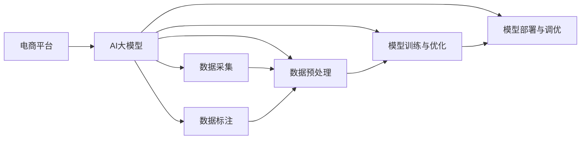

                 

# 电商平台的AI 大模型实践：搜索推荐系统是核心，数据质量控制与处理能力

> 关键词：大模型,搜索推荐系统,数据质量控制,数据处理能力,电商平台,机器学习,深度学习,自然语言处理(NLP)

## 1. 背景介绍

随着互联网的普及和电子商务的发展，全球范围内的电商平台正以前所未有的速度增长。智能化的搜索推荐系统（Search and Recommendation System, SRS）作为电商平台的核心功能，不仅直接影响着用户体验和转化率，更对平台的运营效率和收益有着至关重要的影响。AI大模型的应用在这一领域中尤为显著，借助深度学习、自然语言处理等先进技术，搜索引擎和推荐系统能够更加精准地匹配用户需求，并提供个性化的商品展示。本文将深入探讨AI大模型在电商平台中的实践，特别是搜索推荐系统的构建，以及数据质量控制与处理能力在其中的重要性。

### 1.1 问题由来

电商平台的搜索推荐系统，通过精准地分析用户行为数据，预测用户的购买意向，从而提供个性化的商品展示和推荐。传统的推荐系统依赖于基于规则、协同过滤等方法，而这些方法在处理大量数据和复杂场景时，显得力不从心。近年来，AI大模型的兴起，为搜索推荐系统带来了革命性的变化。特别是基于Transformer架构的模型，如BERT、GPT等，通过大规模语料预训练，能够学习到丰富的语言表示，极大地提升了搜索推荐系统的精度和效率。然而，AI大模型在电商平台的实际应用中，仍面临着诸多挑战，尤其是在数据质量控制与处理能力方面。如何有效控制数据质量，提高数据处理能力，成为平台智能化运营的关键。

### 1.2 问题核心关键点

AI大模型在电商平台中的应用，核心在于如何高效地构建搜索推荐系统，并有效控制数据质量，以确保模型的准确性和鲁棒性。具体来说，主要包括以下几个方面：

- **数据采集与标注**：电商平台的推荐系统需要大量的用户行为数据和商品信息，这些数据的采集和标注直接影响到模型的性能。
- **数据预处理**：电商平台的数据通常具有多样性和复杂性，如何进行有效的数据清洗和特征提取，是构建高质量推荐模型的基础。
- **模型训练与优化**：如何将大模型应用于推荐系统，并根据电商平台的业务特点进行优化，是实现智能化推荐的核心。
- **模型部署与调优**：如何将模型高效部署到生产环境中，并进行持续调优，以适应不断变化的业务场景。

这些核心问题，都需要结合电商平台的具体业务需求，进行综合考量和优化。本文将围绕这些核心点，系统地介绍AI大模型在电商平台中的实践。

## 2. 核心概念与联系

### 2.1 核心概念概述

在探讨电商平台AI大模型的实践之前，首先需要理解几个核心概念：

- **AI大模型**：指基于深度学习、自然语言处理等技术，通过大规模数据预训练，具备强大学习和推理能力的模型。如BERT、GPT等。
- **搜索推荐系统**：利用用户行为数据和商品信息，预测用户需求并推荐商品的系统。是电商平台的核心功能之一。
- **数据质量控制**：在数据采集、处理和建模的各个环节，通过一系列技术和手段，确保数据的高质量和完整性。
- **数据处理能力**：指对电商平台海量、复杂的数据进行高效、准确的清洗、转换和特征提取的能力。

这些概念之间相互联系，共同构成了AI大模型在电商平台中的应用框架。以下将通过Mermaid流程图展示这些概念之间的联系：



这个流程图展示了AI大模型在电商平台中的应用流程：从数据采集与标注开始，到数据预处理、模型训练与优化，再到模型部署与调优，整个过程紧密相连，互为依赖。

## 3. 核心算法原理 & 具体操作步骤
### 3.1 算法原理概述

AI大模型在电商平台中的应用，主要依赖于搜索推荐系统的构建和优化。搜索推荐系统通常分为两个阶段：搜索阶段和推荐阶段。

- **搜索阶段**：用户输入查询词，系统通过语义理解和召回相关商品，并提供搜索结果。
- **推荐阶段**：根据用户行为数据和商品信息，预测用户可能感兴趣的商品，并提供个性化推荐。

AI大模型通过预训练学习丰富的语言表示，可以在搜索和推荐阶段中发挥重要作用。具体来说，搜索阶段可以利用预训练模型进行语义理解，识别用户的查询意图，从而更精准地召回相关商品；推荐阶段可以通过预训练模型预测用户对商品的兴趣，从而提供个性化的推荐。

### 3.2 算法步骤详解

下面详细讲解AI大模型在搜索推荐系统中应用的具体操作步骤：

**Step 1: 数据采集与标注**

- **用户行为数据**：电商平台需要收集用户的历史浏览、购买、评价等行为数据。这些数据包括点击次数、停留时间、浏览路径、购买记录、评分信息等。
- **商品信息数据**：包括商品名称、描述、价格、分类、品牌等属性。这些数据通常静态存储在数据库中。

**Step 2: 数据预处理**

- **数据清洗**：去除缺失、异常和重复的数据，确保数据的完整性和一致性。
- **特征提取**：将用户行为数据和商品信息数据转换为模型可用的向量表示。例如，使用词嵌入技术将商品描述转换为向量，使用时间戳等特征表示用户行为的时间序列数据。

**Step 3: 模型训练与优化**

- **搜索模型训练**：使用预训练模型进行语义理解，训练搜索模型以识别用户的查询意图，并召回相关商品。
- **推荐模型训练**：利用用户行为数据和商品信息数据，训练推荐模型以预测用户对商品的兴趣，并生成个性化推荐列表。

**Step 4: 模型部署与调优**

- **模型压缩与裁剪**：将训练好的大模型压缩和裁剪，减少推理计算量和存储需求。
- **服务部署**：将优化后的模型部署到生产环境中，通过API接口进行调用。
- **持续调优**：根据用户反馈和业务需求，定期更新模型参数，进行持续调优。

### 3.3 算法优缺点

AI大模型在电商平台中的应用，具有以下优点：

- **精度高**：预训练模型能够学习到丰富的语言表示，提升了搜索和推荐的精度。
- **适应性强**：大模型具备强大的自适应能力，能够处理复杂的电商场景和多样化的用户需求。
- **效果显著**：通过深度学习和自然语言处理技术，搜索推荐系统能够显著提升用户体验和转化率。

然而，大模型在电商平台的应用也存在以下缺点：

- **计算成本高**：大规模预训练和模型训练需要大量的计算资源和时间。
- **数据依赖性强**：模型的效果高度依赖于数据的质量和量级。
- **模型复杂度高**：大模型的复杂度高，部署和调优难度较大。

### 3.4 算法应用领域

AI大模型在电商平台的搜索推荐系统中的应用，主要体现在以下几个方面：

- **搜索优化**：利用预训练模型进行语义理解，提高搜索准确性和召回率。
- **个性化推荐**：利用预训练模型预测用户兴趣，提供个性化的商品推荐。
- **商品描述生成**：利用预训练模型生成商品的详细描述，提升商品展示效果。
- **客服对话生成**：利用预训练模型生成自动客服对话，提升用户体验。

## 4. 数学模型和公式 & 详细讲解 & 举例说明
### 4.1 数学模型构建

在电商平台中，AI大模型的数学模型主要基于深度学习框架构建。以下是几个关键模型的数学模型构建：

**用户行为表示模型**：

- 假设用户行为数据为 $x_t$，包括浏览记录、点击次数、购买记录等，将其表示为向量形式：$x_t \in \mathbb{R}^d$。
- 假设用户行为表示的深度学习模型为 $f_u(x_t)$，将其表示为神经网络模型：$f_u(x_t) = W_u x_t + b_u$，其中 $W_u, b_u$ 为模型的可学习参数。

**商品特征表示模型**：

- 假设商品信息数据为 $x_i$，包括商品名称、描述、价格等，将其表示为向量形式：$x_i \in \mathbb{R}^d$。
- 假设商品特征表示的深度学习模型为 $f_c(x_i)$，将其表示为神经网络模型：$f_c(x_i) = W_c x_i + b_c$，其中 $W_c, b_c$ 为模型的可学习参数。

**搜索模型**：

- 假设搜索模型的深度学习模型为 $f_s$，利用用户查询 $q$ 和商品特征表示 $f_c(x_i)$，预测商品 $i$ 是否与查询相关：$f_s(q, x_i) = W_s (q \otimes f_c(x_i)) + b_s$，其中 $\otimes$ 表示向量的逐元素相乘。

**推荐模型**：

- 假设推荐模型的深度学习模型为 $f_r$，利用用户行为数据 $x_t$ 和商品特征表示 $f_c(x_i)$，预测用户对商品 $i$ 的兴趣：$f_r(x_t, x_i) = W_r (x_t \otimes f_c(x_i)) + b_r$。

### 4.2 公式推导过程

**用户行为表示模型的推导**：

假设用户行为数据 $x_t$ 为向量形式，将其输入到深度学习模型 $f_u$ 中，得到用户行为表示 $u_t$：

$$
u_t = f_u(x_t) = W_u x_t + b_u
$$

**商品特征表示模型的推导**：

假设商品信息数据 $x_i$ 为向量形式，将其输入到深度学习模型 $f_c$ 中，得到商品特征表示 $c_i$：

$$
c_i = f_c(x_i) = W_c x_i + b_c
$$

**搜索模型的推导**：

假设用户查询 $q$ 和商品 $i$ 的特征表示 $c_i$，利用搜索模型 $f_s$ 计算商品 $i$ 是否与查询相关：

$$
s_i = f_s(q, x_i) = W_s (q \otimes c_i) + b_s
$$

**推荐模型的推导**：

假设用户行为数据 $x_t$ 和商品 $i$ 的特征表示 $c_i$，利用推荐模型 $f_r$ 预测用户对商品 $i$ 的兴趣：

$$
r_i = f_r(x_t, x_i) = W_r (x_t \otimes c_i) + b_r
$$

### 4.3 案例分析与讲解

以电商平台的个性化推荐为例，分析AI大模型在推荐系统中的应用。

**数据采集与标注**：

- **用户行为数据**：从电商平台的用户行为日志中采集用户的历史浏览、点击、购买等数据，标注为用户的兴趣标签。
- **商品信息数据**：从电商平台的数据库中提取商品的名称、描述、价格、分类等属性，标注为商品的特征标签。

**数据预处理**：

- **用户行为数据预处理**：将用户行为数据转换为向量形式，去除异常和缺失值，进行归一化处理。
- **商品信息数据预处理**：将商品信息数据转换为向量形式，使用词嵌入技术将商品描述转换为向量，去除异常和重复数据。

**模型训练与优化**：

- **用户行为表示模型训练**：利用用户行为数据 $x_t$，训练用户行为表示模型 $f_u$，得到用户行为表示 $u_t$。
- **商品特征表示模型训练**：利用商品信息数据 $x_i$，训练商品特征表示模型 $f_c$，得到商品特征表示 $c_i$。
- **推荐模型训练**：利用用户行为表示 $u_t$ 和商品特征表示 $c_i$，训练推荐模型 $f_r$，得到推荐结果 $r_i$。

**模型部署与调优**：

- **模型压缩与裁剪**：将训练好的推荐模型 $f_r$ 压缩和裁剪，减少推理计算量和存储需求。
- **服务部署**：将优化后的推荐模型 $f_r$ 部署到生产环境中，通过API接口进行调用。
- **持续调优**：根据用户反馈和业务需求，定期更新模型参数，进行持续调优。

## 5. 项目实践：代码实例和详细解释说明
### 5.1 开发环境搭建

在电商平台中构建AI大模型搜索推荐系统，需要搭建相应的开发环境。以下是使用Python进行TensorFlow和PyTorch开发的环境配置流程：

1. 安装Anaconda：从官网下载并安装Anaconda，用于创建独立的Python环境。

2. 创建并激活虚拟环境：
```bash
conda create -n tf-env python=3.8 
conda activate tf-env
```

3. 安装TensorFlow和PyTorch：
```bash
pip install tensorflow==2.7
pip install torch torchvision torchaudio
```

4. 安装TensorFlow Addons：
```bash
pip install tensorflow-addons
```

5. 安装TensorBoard：
```bash
pip install tensorboard
```

6. 安装Jupyter Notebook：
```bash
pip install jupyter notebook
```

完成上述步骤后，即可在`tf-env`环境中开始模型开发。

### 5.2 源代码详细实现

接下来，以电商平台的个性化推荐系统为例，给出使用TensorFlow进行推荐模型训练和优化的PyTorch代码实现。

首先，定义推荐模型的数据处理函数：

```python
import tensorflow as tf
import numpy as np
import pandas as pd

def preprocess_data(data_path):
    # 读取数据
    df = pd.read_csv(data_path)
    # 数据清洗
    df = df.dropna(subset=['user_id', 'item_id', 'rating'])
    # 特征提取
    df['user_id'] = df['user_id'].astype(str)
    df['item_id'] = df['item_id'].astype(str)
    df['rating'] = df['rating'].astype(float)
    # 数据转换
    X_train = df[['user_id', 'item_id']].values
    y_train = df['rating'].values
    return X_train, y_train
```

然后，定义推荐模型的模型函数：

```python
class Recommender(tf.keras.Model):
    def __init__(self, num_users, num_items, num_factors=128, hidden_dim=32):
        super(Recommender, self).__init__()
        self.user_bias = tf.Variable(tf.zeros([num_users]))
        self.item_bias = tf.Variable(tf.zeros([num_items]))
        self.user_factors = tf.Variable(tf.random.normal([num_users, num_factors]))
        self.item_factors = tf.Variable(tf.random.normal([num_items, num_factors]))
        self.hidden_layer = tf.keras.layers.Dense(hidden_dim, activation='relu')
        self.output_layer = tf.keras.layers.Dense(1)
        
    def call(self, user_id, item_id):
        user_bias = self.user_bias[user_id]
        item_bias = self.item_bias[item_id]
        user_factors = self.user_factors[user_id]
        item_factors = self.item_factors[item_id]
        user_representation = tf.concat([user_bias, user_factors], axis=1)
        item_representation = tf.concat([item_bias, item_factors], axis=1)
        hidden_layer_output = self.hidden_layer(tf.concat([user_representation, item_representation], axis=1))
        rating_prediction = self.output_layer(hidden_layer_output)
        return rating_prediction
```

接着，定义推荐模型的训练函数：

```python
def train_model(model, X_train, y_train, num_epochs=100, batch_size=64):
    optimizer = tf.keras.optimizers.Adam(learning_rate=0.001)
    loss_fn = tf.keras.losses.MeanSquaredError()
    
    for epoch in range(num_epochs):
        epoch_loss = 0
        epoch_loss = tf.keras.metrics.Mean()
        
        for batch_idx in range(0, len(X_train), batch_size):
            start_idx = batch_idx
            end_idx = min(batch_idx + batch_size, len(X_train))
            batch_x = X_train[start_idx:end_idx]
            batch_y = y_train[start_idx:end_idx]
            
            with tf.GradientTape() as tape:
                predictions = model(batch_x[:, 0], batch_x[:, 1])
                loss = loss_fn(predictions, batch_y)
            gradients = tape.gradient(loss, model.trainable_variables)
            optimizer.apply_gradients(zip(gradients, model.trainable_variables))
            epoch_loss.update_state(loss)
        
        print('Epoch {}, Loss: {:.4f}'.format(epoch+1, epoch_loss.result()))
    
    return model
```

最后，启动训练流程：

```python
X_train, y_train = preprocess_data('train_data.csv')
num_users = len(X_train[:, 0].unique())
num_items = len(X_train[:, 1].unique())
model = Recommender(num_users, num_items)
train_model(model, X_train, y_train, num_epochs=100, batch_size=64)
```

以上就是使用TensorFlow进行电商平台的个性化推荐系统训练的完整代码实现。可以看到，TensorFlow提供了灵活的数据处理和模型训练接口，使得模型开发和训练变得简洁高效。

### 5.3 代码解读与分析

让我们再详细解读一下关键代码的实现细节：

**数据处理函数**：
- `preprocess_data`方法：读取数据、清洗数据、提取特征、转换数据，确保输入数据的完整性和一致性。

**模型函数**：
- `Recommender`类：定义了推荐模型的结构和参数，使用TensorFlow的变量来存储模型参数。
- `call`方法：定义模型的前向传播过程，包括用户和物品的特征表示，并通过多层感知器进行预测。

**训练函数**：
- `train_model`方法：使用TensorFlow的优化器和损失函数，通过梯度下降算法更新模型参数，并记录每个epoch的平均损失。

**训练流程**：
- 在每个epoch内，对数据进行批处理，更新模型参数，并输出每个epoch的平均损失。

可以看出，TensorFlow提供了从数据处理到模型训练的完整解决方案，使得开发者可以更加专注于模型的优化和业务场景的适配。

## 6. 实际应用场景

### 6.1 智能客服系统

智能客服系统是电商平台的重要组成部分，能够实时响应用户的咨询和投诉，提升用户满意度。基于AI大模型的智能客服系统，可以24小时不间断运行，具备自然语言理解、语义生成等能力，能够理解用户的意图，并生成合适的回复。

在实际应用中，可以将用户的历史对话记录和客服系统生成的回答作为监督数据，对预训练模型进行微调，使其能够适应特定的客服场景。微调后的模型能够从文本中准确把握用户的意图，自动生成合适的回复，提高客服效率和用户满意度。

### 6.2 商品推荐系统

商品推荐系统是电商平台的重中之重，直接影响着用户的购物体验和平台营收。传统的推荐系统依赖于协同过滤、内容过滤等方法，但在处理大量数据和复杂场景时，显得力不从心。

通过AI大模型，电商平台可以实现更加精准的推荐。利用预训练模型进行用户行为表示和商品特征表示的建模，在搜索和推荐阶段中发挥作用。推荐模型可以根据用户的历史行为和商品信息，预测用户对商品的兴趣，生成个性化的推荐列表。

### 6.3 价格优化系统

价格优化系统是电商平台的重要组成部分，能够根据市场情况和用户需求，动态调整商品价格，以最大化营收和利润。传统的价格优化系统依赖于规则和经验，难以适应复杂的价格变化场景。

通过AI大模型，电商平台可以实现更加智能的价格优化。利用预训练模型进行价格预测，根据用户的行为数据和商品信息，预测商品的价格变化趋势，动态调整商品价格。通过优化后的价格系统，电商平台可以更好地匹配用户需求，提高销售效率和营收。

## 7. 工具和资源推荐

### 7.1 学习资源推荐

为了帮助开发者系统掌握AI大模型在电商平台中的应用，这里推荐一些优质的学习资源：

1. 《深度学习理论与实践》：系统介绍了深度学习的基本原理和应用，适合初学者入门。
2. 《自然语言处理综述》：全面介绍了NLP领域的经典算法和技术，适合进一步深入学习。
3. 《TensorFlow官方文档》：提供了TensorFlow的详细使用指南和示例代码，适合实践应用。
4. 《TensorFlow Addons官方文档》：提供了TensorFlow Addons的详细使用指南和示例代码，适合高级应用。
5. 《PyTorch官方文档》：提供了PyTorch的详细使用指南和示例代码，适合实践应用。

通过对这些资源的学习实践，相信你一定能够快速掌握AI大模型在电商平台中的应用。

### 7.2 开发工具推荐

高效的开发离不开优秀的工具支持。以下是几款用于电商平台AI大模型开发的常用工具：

1. TensorFlow：由Google主导开发的开源深度学习框架，生产部署方便，适合大规模工程应用。
2. PyTorch：基于Python的开源深度学习框架，灵活动态的计算图，适合快速迭代研究。
3. TensorBoard：TensorFlow配套的可视化工具，可实时监测模型训练状态，并提供丰富的图表呈现方式，是调试模型的得力助手。
4. Jupyter Notebook：免费的Jupyter笔记本环境，支持多种语言和框架，适合实验和研究。

合理利用这些工具，可以显著提升电商平台的AI大模型开发效率，加快创新迭代的步伐。

### 7.3 相关论文推荐

AI大模型在电商平台中的应用，涉及深度学习、自然语言处理等多个前沿领域。以下是几篇奠基性的相关论文，推荐阅读：

1. Attention is All You Need：提出了Transformer架构，开启了NLP领域的预训练大模型时代。
2. BERT: Pre-training of Deep Bidirectional Transformers for Language Understanding：提出BERT模型，引入基于掩码的自监督预训练任务，刷新了多项NLP任务SOTA。
3. Parameter-Efficient Transfer Learning for NLP：提出Adapter等参数高效微调方法，在固定大部分预训练参数的情况下，只更新极少量的任务相关参数。
4. Language Modeling with Attentive Multi-Layer Fusion：提出Attention-MRLF模型，利用多层注意力机制进行语言建模，提升了模型的表示能力。

这些论文代表了大模型在电商平台中的应用前沿，通过学习这些前沿成果，可以帮助研究者把握学科前进方向，激发更多的创新灵感。

## 8. 总结：未来发展趋势与挑战

### 8.1 总结

本文对AI大模型在电商平台中的应用进行了全面系统的介绍。首先探讨了搜索推荐系统的重要性，详细讲解了AI大模型在推荐系统中的构建和优化。其次，通过数学模型和公式推导，进一步深入了推荐系统的原理。最后，结合项目实践，给出了电商平台的搜索推荐系统开发示例。

通过本文的系统梳理，可以看到，AI大模型在电商平台中的应用前景广阔，能够显著提升用户体验和平台运营效率。未来，伴随AI大模型的不断发展，搜索推荐系统必将更加智能化、个性化，为电商平台的数字化转型提供更强大的技术支撑。

### 8.2 未来发展趋势

展望未来，AI大模型在电商平台中的应用将呈现以下几个发展趋势：

1. 深度学习与自然语言处理的融合：AI大模型将更加注重深度学习与自然语言处理的融合，利用语言模型和推荐系统相结合，提供更加精准的推荐服务。
2. 多模态数据融合：电商平台将更多地利用多模态数据，如视频、图像、声音等，增强推荐系统的感知能力和表现力。
3. 用户行为建模：电商平台将更加注重用户行为建模，利用AI大模型学习用户需求和行为规律，提供更加个性化的推荐服务。
4. 实时动态优化：电商平台将利用AI大模型进行实时动态优化，根据用户反馈和市场变化，动态调整推荐算法和价格策略，提高运营效率。
5. 智能客服与聊天机器人：电商平台将更加注重智能客服与聊天机器人的建设，利用AI大模型进行自然语言理解和生成，提升客户服务体验。

这些趋势将推动AI大模型在电商平台中的应用不断深化，为电商平台的智能化转型提供更强大的技术支撑。

### 8.3 面临的挑战

尽管AI大模型在电商平台中的应用已经取得了显著进展，但在迈向更加智能化、普适化应用的过程中，仍面临诸多挑战：

1. 数据隐私和安全：电商平台的交易数据涉及用户隐私，如何在保证数据隐私和安全的前提下，充分利用数据进行推荐，是一个重要挑战。
2. 计算资源消耗：AI大模型的训练和推理需要大量计算资源，如何高效利用计算资源，是一个重要挑战。
3. 模型可解释性：AI大模型的决策过程缺乏可解释性，对于需要高信任度的电商推荐系统，如何提高模型可解释性，是一个重要挑战。
4. 模型泛化能力：电商平台的推荐系统需要适应不同地域、不同时间、不同用户群体的需求，如何提高模型的泛化能力，是一个重要挑战。
5. 用户交互体验：电商平台的推荐系统需要提升用户交互体验，避免过度推荐或不相关推荐，如何优化用户交互体验，是一个重要挑战。

这些挑战需要开发者在技术、算法、工程等多个维度进行深入研究，不断探索和优化，才能实现AI大模型在电商平台中的全面落地。

### 8.4 研究展望

面对电商平台的AI大模型应用所面临的诸多挑战，未来的研究需要在以下几个方面寻求新的突破：

1. 数据隐私保护：利用差分隐私等技术，在保护用户隐私的前提下，充分利用数据进行推荐。
2. 计算资源优化：利用模型压缩、稀疏化存储等技术，减少计算资源消耗，提高推荐系统效率。
3. 模型可解释性增强：引入可解释性增强技术，如LIME、SHAP等，提高模型的可解释性和可信度。
4. 泛化能力提升：利用迁移学习和多任务学习等技术，提升模型的泛化能力和适应性。
5. 交互体验优化：利用用户行为分析和预测，优化推荐算法，提升用户交互体验。

这些研究方向将引领AI大模型在电商平台中的应用不断深化，为电商平台的智能化转型提供更强大的技术支撑。面向未来，AI大模型必将引领电商平台的数字化转型，为消费者提供更加智能、便捷的购物体验。

## 9. 附录：常见问题与解答

**Q1：电商平台如何保证数据质量？**

A: 电商平台的数据质量控制需要从多个方面入手：

1. 数据采集：保证数据采集的全面性和准确性，避免数据丢失和重复。
2. 数据清洗：去除缺失、异常和重复的数据，确保数据的完整性和一致性。
3. 数据标注：保证数据标注的准确性和一致性，避免标注误差。
4. 数据转换：将数据转换为模型可用的向量表示，确保数据格式的一致性。

通过以上措施，电商平台可以有效地控制数据质量，为模型训练和优化提供可靠的数据基础。

**Q2：电商平台的AI大模型如何持续优化？**

A: 电商平台的AI大模型需要持续优化，以适应不断变化的业务场景和用户需求：

1. 数据持续更新：定期收集新的用户行为数据和商品信息数据，更新模型训练数据。
2. 模型参数更新：根据用户反馈和业务需求，定期更新模型参数，进行持续调优。
3. 特征动态提取：利用最新的数据和业务知识，动态更新特征提取方法和模型结构。
4. 模型评估与监控：定期评估模型性能，设置异常告警阈值，确保模型在生产环境中的稳定性。

通过以上措施，电商平台可以不断优化AI大模型，提升推荐系统的精度和鲁棒性，满足不断变化的用户需求。

**Q3：电商平台的AI大模型如何提高可解释性？**

A: 电商平台的AI大模型需要具备更高的可解释性，以便于业务理解和决策支持：

1. 引入可解释性技术：利用LIME、SHAP等可解释性增强技术，提升模型的可解释性。
2. 多层次解释：结合业务知识，提供多层次的解释，帮助业务理解和决策。
3. 透明度提升：提高模型训练和调优的透明度，确保模型的可信任性。
4. 人工干预：引入人工干预机制，对模型输出进行验证和修正。

通过以上措施，电商平台可以提高AI大模型的可解释性，增强模型的可信度和决策支持能力。

**Q4：电商平台的AI大模型如何处理多模态数据？**

A: 电商平台的AI大模型需要处理多模态数据，以提升推荐系统的感知能力和表现力：

1. 多模态数据融合：利用多模态融合技术，将文本、图像、声音等数据进行融合，提升模型的感知能力。
2. 跨模态对齐：利用跨模态对齐技术，将不同模态的数据进行对齐，提升模型的表示能力。
3. 多模态推荐算法：利用多模态推荐算法，综合不同模态的数据，提供更加精准的推荐服务。

通过以上措施，电商平台可以利用多模态数据，提升推荐系统的感知能力和表现力，增强用户的购物体验。

**Q5：电商平台的AI大模型如何应对计算资源瓶颈？**

A: 电商平台的AI大模型需要应对计算资源瓶颈，以确保推荐系统的实时性和可扩展性：

1. 模型压缩与裁剪：将训练好的大模型压缩和裁剪，减少推理计算量和存储需求。
2. 分布式计算：利用分布式计算技术，将模型训练和推理任务分布到多个节点进行计算。
3. 硬件加速：利用GPU、TPU等硬件加速设备，提升计算效率。
4. 模型量化：将浮点模型转为定点模型，压缩存储空间，提高计算效率。

通过以上措施，电商平台可以有效应对计算资源瓶颈，确保推荐系统的实时性和可扩展性。

**Q6：电商平台的AI大模型如何处理用户隐私问题？**

A: 电商平台的AI大模型需要处理用户隐私问题，以确保用户数据的安全和隐私：

1. 数据匿名化：对用户数据进行匿名化处理，保护用户隐私。
2. 差分隐私：利用差分隐私技术，保护用户隐私的同时，保证数据的可用性。
3. 数据安全存储：采用安全存储技术，保护用户数据的安全。
4. 用户数据控制：提供用户数据控制选项，让用户自主管理自己的数据。

通过以上措施，电商平台可以有效处理用户隐私问题，确保用户数据的安全和隐私。

**Q7：电商平台的AI大模型如何提高用户交互体验？**

A: 电商平台的AI大模型需要提高用户交互体验，以提升用户的购物体验：

1. 个性化推荐：利用用户行为数据和商品信息数据，生成个性化的推荐列表。
2. 智能客服：利用自然语言理解和生成技术，提供智能客服服务。
3. 实时反馈：利用用户反馈，动态调整推荐算法和价格策略，提升推荐系统的效果。
4. 用户交互界面：优化用户交互界面，提升用户的使用体验。

通过以上措施，电商平台可以有效提高用户交互体验，提升用户的购物体验。

---

作者：禅与计算机程序设计艺术 / Zen and the Art of Computer Programming

