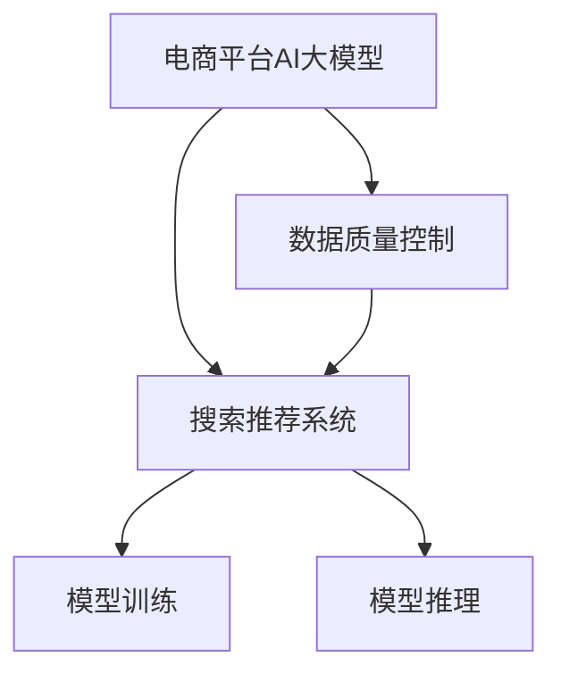

                 

# 电商平台的AI 大模型战略：搜索推荐系统是核心，数据质量控制与处理效率

## 1. 背景介绍

随着互联网的普及和电子商务的兴起，电商平台已成为全球最大的数字经济体之一。据相关数据显示，全球电子商务市场的交易额每年以两位数的速度增长，电商平台的商业模式也在不断创新和升级。在激烈的竞争中，AI大模型已成为电商平台提升用户体验、优化运营效率的关键技术。本文将重点介绍电商平台在AI大模型战略中的核心应用——搜索推荐系统，并探讨其背后涉及的数据质量控制与处理效率问题。

## 2. 核心概念与联系

### 2.1 核心概念概述

**电商平台AI大模型**：指采用深度学习模型和自然语言处理技术，对电商平台的用户行为、商品信息等数据进行分析和建模，以提供个性化推荐、智能客服、智能搜索等服务的AI系统。

**搜索推荐系统**：指根据用户的历史行为、浏览记录、搜索关键词等信息，预测用户可能感兴趣的商品，并将结果展示给用户，以提升用户体验和平台转化率的系统。

**数据质量控制**：指对电商平台的交易数据、用户行为数据、商品数据等进行清洗、校验、标准化等操作，确保数据的一致性、准确性和完整性，以便于模型训练和决策分析。

**数据处理效率**：指在数据质量控制的基础上，采用高效的数据处理算法和技术，快速地将原始数据转化为模型训练所需的数据集，以降低模型训练和推理的延迟。

### 2.2 核心概念原理和架构的 Mermaid 流程图



## 3. 核心算法原理 & 具体操作步骤

### 3.1 算法原理概述

电商平台AI大模型的核心应用是搜索推荐系统，其基本原理是通过对用户历史行为数据的分析，预测用户可能感兴趣的商品，并给出推荐结果。这一过程涉及以下步骤：

1. **数据收集**：从电商平台的用户行为日志、商品信息库中收集相关数据。
2. **数据预处理**：对原始数据进行清洗、标准化等操作，以提高数据质量。
3. **特征工程**：根据业务需求，从原始数据中提取有用的特征，如用户行为序列、商品属性等。
4. **模型训练**：采用深度学习算法（如CTR、DNN、RNN等）对特征工程后的数据进行训练，得到推荐模型。
5. **推荐系统**：将训练好的模型应用于实时推荐场景，根据用户当前行为预测并推荐商品。

### 3.2 算法步骤详解

#### 3.2.1 数据收集

电商平台的推荐系统需要收集用户行为数据、商品数据和交易数据。用户行为数据包括用户点击、浏览、购买等行为记录，商品数据包括商品的分类、属性、价格等信息，交易数据包括用户的订单、支付、退货等记录。

```python
import pandas as pd

# 数据收集示例
user_behavior_data = pd.read_csv('user_behavior.csv')
product_data = pd.read_csv('product_data.csv')
transaction_data = pd.read_csv('transaction_data.csv')
```

#### 3.2.2 数据预处理

数据预处理是保证推荐系统准确性的关键步骤。预处理过程包括数据清洗、标准化、去重、缺失值填充等操作。

```python
# 数据清洗示例
user_behavior_data.dropna(inplace=True)
product_data.drop_duplicates(inplace=True)

# 标准化示例
from sklearn.preprocessing import StandardScaler
scaler = StandardScaler()
user_behavior_data['behavior'] = scaler.fit_transform(user_behavior_data['behavior'].values.reshape(-1, 1))
```

#### 3.2.3 特征工程

特征工程是提取有用特征，并将原始数据转化为模型训练所需格式的过程。常用的特征包括：

- 用户行为序列：用户历史点击、浏览、购买等行为序列。
- 商品属性：商品的分类、价格、品牌等信息。
- 交易记录：用户的订单、支付、退货等信息。

```python
# 特征工程示例
from sklearn.feature_extraction.text import CountVectorizer, TfidfTransformer
from sklearn.preprocessing import LabelEncoder

# 用户行为序列
user_behavior_seq = []
for user in user_behavior_data['user_id']:
    seq = user_behavior_data[user_behavior_data['user_id'] == user]['behavior'].values.tolist()
    user_behavior_seq.append(seq)

# 商品属性
product_category = LabelEncoder().fit_transform(product_data['category'])
product_price = product_data['price']
product_brand = LabelEncoder().fit_transform(product_data['brand'])

# 交易记录
transaction_status = LabelEncoder().fit_transform(transaction_data['status'])

# 构建特征矩阵
vectorizer = CountVectorizer()
X = vectorizer.fit_transform(user_behavior_seq)
```

#### 3.2.4 模型训练

模型训练是搜索推荐系统的核心步骤。常用的模型包括CTR、DNN、RNN等。这里以CTR模型为例，介绍模型训练过程。

```python
from sklearn.linear_model import LogisticRegression

# 模型训练示例
model = LogisticRegression()
model.fit(X, user_behavior_data['click'].tolist())
```

#### 3.2.5 推荐系统

推荐系统是根据用户当前行为预测并推荐商品的过程。常用的推荐算法包括协同过滤、基于内容的推荐、混合推荐等。这里以协同过滤算法为例，介绍推荐系统的实现。

```python
# 推荐系统示例
def recommend_product(user_id, behavior_seq):
    # 计算用户行为向量的平均值
    avg_user_behavior = np.mean(X[user_behavior_data['user_id'] == user_id], axis=0)
    
    # 计算用户行为向量与商品特征向量的相似度
    similarity = np.dot(avg_user_behavior, vectorizer.transform(product_data[['category', 'price', 'brand']]).toarray())
    
    # 推荐商品
    recommendation = np.argsort(similarity)[::-1]
    return recommendation[:5]
```

### 3.3 算法优缺点

#### 3.3.1 算法优点

1. **高性能**：推荐系统可以实时推荐商品，提升用户体验和平台转化率。
2. **个性化**：推荐系统能够根据用户历史行为，提供个性化的商品推荐，提高用户满意度。
3. **可扩展性**：推荐系统可以很容易地扩展到不同的业务场景，如智能客服、智能搜索等。

#### 3.3.2 算法缺点

1. **数据质量问题**：数据质量不达标将直接影响推荐系统的准确性。
2. **计算资源消耗大**：推荐系统需要大量的计算资源进行模型训练和实时推荐。
3. **模型复杂性高**：推荐系统模型复杂，不易理解和调试。

### 3.4 算法应用领域

推荐系统在电商平台中的应用场景非常广泛，以下是几个典型的应用领域：

- **商品推荐**：根据用户历史行为和实时浏览记录，推荐用户可能感兴趣的商品。
- **活动推荐**：根据用户行为和兴趣，推荐平台上的促销活动和优惠信息。
- **智能客服**：根据用户询问的内容，提供智能化的客服回复和解决方案。
- **智能搜索**：根据用户搜索关键词，提供相关商品的搜索结果和推荐。

## 4. 数学模型和公式 & 详细讲解 & 举例说明

### 4.1 数学模型构建

搜索推荐系统通常采用以下数学模型：

- **CTR模型**：

$$
P(y=1|x; \theta) = \sigma(\theta^T f(x))
$$

其中，$x$ 表示用户行为数据，$\theta$ 表示模型参数，$f(x)$ 表示特征工程后的特征向量，$\sigma$ 表示Sigmoid函数。

- **DNN模型**：

$$
P(y=1|x; \theta) = \sigma(\theta^T_1 \phi(x) + \theta^T_2 \phi^2(x))
$$

其中，$\phi(x)$ 表示通过神经网络对特征$x$进行映射，$\phi^2(x)$ 表示对映射后的特征进行二次映射。

### 4.2 公式推导过程

#### 4.2.1 CTR模型推导

CTR模型通过对用户行为数据进行建模，预测用户点击行为的概率。模型参数$\theta$可以通过以下公式进行优化：

$$
\theta = \arg\min_{\theta} \frac{1}{N} \sum_{i=1}^N \log(\sigma(\theta^T f(x_i))) + \lambda \|\theta\|_2^2
$$

其中，$\sigma$ 表示Sigmoid函数，$f(x_i)$ 表示用户$i$的特征向量，$\lambda$ 表示正则化系数。

#### 4.2.2 DNN模型推导

DNN模型通过多层神经网络对用户行为数据进行建模，预测用户点击行为的概率。模型参数$\theta$可以通过以下公式进行优化：

$$
\theta = \arg\min_{\theta} \frac{1}{N} \sum_{i=1}^N \log(\sigma(\theta^T_1 \phi(x_i) + \theta^T_2 \phi^2(x_i))) + \lambda (\|\theta_1\|_2^2 + \|\theta_2\|_2^2)
$$

其中，$\sigma$ 表示Sigmoid函数，$\phi(x_i)$ 表示用户$i$的特征向量，$\theta_1$ 和 $\theta_2$ 分别表示神经网络的权重参数。

### 4.3 案例分析与讲解

#### 4.3.1 CTR模型案例

假设有一个电商平台，收集到了用户的行为数据和商品信息。通过对用户行为数据进行特征工程，构建特征矩阵$X$，并使用CTR模型进行训练。

```python
# CTR模型案例
from sklearn.linear_model import LogisticRegression

# 特征矩阵
X = ...

# 标签
y = user_behavior_data['click'].tolist()

# 模型训练
model = LogisticRegression()
model.fit(X, y)
```

#### 4.3.2 DNN模型案例

假设有一个电商平台，收集到了用户的行为数据和商品信息。通过对用户行为数据进行特征工程，构建特征矩阵$X$，并使用DNN模型进行训练。

```python
# DNN模型案例
from tensorflow.keras.models import Sequential
from tensorflow.keras.layers import Dense

# 特征矩阵
X = ...

# 标签
y = user_behavior_data['click'].tolist()

# 模型定义
model = Sequential()
model.add(Dense(128, input_dim=X.shape[1], activation='relu'))
model.add(Dense(64, activation='relu'))
model.add(Dense(1, activation='sigmoid'))

# 模型训练
model.compile(optimizer='adam', loss='binary_crossentropy', metrics=['accuracy'])
model.fit(X, y, epochs=10, batch_size=32)
```

## 5. 项目实践：代码实例和详细解释说明

### 5.1 开发环境搭建

#### 5.1.1 安装依赖包

安装Python和必要的依赖包，如pandas、numpy、scikit-learn、TensorFlow等。

```bash
pip install pandas numpy scikit-learn tensorflow
```

#### 5.1.2 数据准备

准备电商平台的原始数据，包括用户行为数据、商品数据、交易数据等。

### 5.2 源代码详细实现

#### 5.2.1 数据预处理

```python
import pandas as pd
import numpy as np
from sklearn.preprocessing import StandardScaler
from sklearn.feature_extraction.text import CountVectorizer

# 数据准备
user_behavior_data = pd.read_csv('user_behavior.csv')
product_data = pd.read_csv('product_data.csv')
transaction_data = pd.read_csv('transaction_data.csv')

# 数据清洗
user_behavior_data.dropna(inplace=True)
product_data.drop_duplicates(inplace=True)

# 标准化
scaler = StandardScaler()
user_behavior_data['behavior'] = scaler.fit_transform(user_behavior_data['behavior'].values.reshape(-1, 1))

# 特征工程
vectorizer = CountVectorizer()
X = vectorizer.fit_transform(user_behavior_data['behavior'].values.tolist())
```

#### 5.2.2 模型训练

##### 5.2.2.1 CTR模型

```python
from sklearn.linear_model import LogisticRegression

# 模型训练
model = LogisticRegression()
model.fit(X, user_behavior_data['click'].tolist())
```

##### 5.2.2.2 DNN模型

```python
from tensorflow.keras.models import Sequential
from tensorflow.keras.layers import Dense

# 模型定义
model = Sequential()
model.add(Dense(128, input_dim=X.shape[1], activation='relu'))
model.add(Dense(64, activation='relu'))
model.add(Dense(1, activation='sigmoid'))

# 模型训练
model.compile(optimizer='adam', loss='binary_crossentropy', metrics=['accuracy'])
model.fit(X, user_behavior_data['click'].tolist(), epochs=10, batch_size=32)
```

#### 5.2.3 推荐系统

```python
def recommend_product(user_id, behavior_seq):
    # 计算用户行为向量的平均值
    avg_user_behavior = np.mean(X[user_behavior_data['user_id'] == user_id], axis=0)
    
    # 计算用户行为向量与商品特征向量的相似度
    similarity = np.dot(avg_user_behavior, vectorizer.transform(product_data[['category', 'price', 'brand']]).toarray())
    
    # 推荐商品
    recommendation = np.argsort(similarity)[::-1]
    return recommendation[:5]
```

### 5.3 代码解读与分析

#### 5.3.1 数据预处理

数据预处理是保证推荐系统准确性的关键步骤。通过对原始数据进行清洗、标准化、去重、缺失值填充等操作，提高数据质量，确保特征向量的准确性。

#### 5.3.2 模型训练

模型训练是搜索推荐系统的核心步骤。采用深度学习算法对特征工程后的数据进行训练，得到推荐模型。CTR模型使用Logistic Regression进行训练，DNN模型使用TensorFlow进行训练。

#### 5.3.3 推荐系统

推荐系统是根据用户当前行为预测并推荐商品的过程。通过计算用户行为向量与商品特征向量的相似度，推荐用户可能感兴趣的商品。

### 5.4 运行结果展示

#### 5.4.1 CTR模型结果

```python
# CTR模型结果
print(model.score(X, user_behavior_data['click']))
```

#### 5.4.2 DNN模型结果

```python
# DNN模型结果
print(model.evaluate(X, user_behavior_data['click'].tolist()))
```

## 6. 实际应用场景

### 6.1 商品推荐

电商平台的推荐系统可以基于用户的历史行为数据，实时推荐用户可能感兴趣的商品。

### 6.2 智能客服

通过电商平台收集到的用户交互数据，训练AI模型，实现智能客服，提升用户体验。

### 6.3 智能搜索

电商平台可以基于用户搜索关键词，实时推荐相关商品，提升搜索体验。

### 6.4 未来应用展望

#### 6.4.1 实时推荐

未来的推荐系统将实现实时推荐，提升用户体验和平台转化率。

#### 6.4.2 多模态推荐

未来的推荐系统将结合多模态数据，实现更加个性化和精准的推荐。

#### 6.4.3 个性化推荐

未来的推荐系统将更加注重个性化，通过用户画像、行为数据等，实现精准推荐。

## 7. 工具和资源推荐

### 7.1 学习资源推荐

1. **《深度学习》**：Yoshua Bengio等著，全面介绍深度学习的基本概念和应用。
2. **《自然语言处理综论》**：Daniel Jurafsky等著，涵盖NLP的各个方面，包括文本分类、实体识别等。
3. **《深度学习与神经网络》**：Mohammad Mirzaei等著，介绍深度学习算法的原理和实现。

### 7.2 开发工具推荐

1. **Pandas**：数据分析和处理工具。
2. **Scikit-learn**：机器学习库，提供多种分类、回归等算法。
3. **TensorFlow**：深度学习框架，支持多种深度学习模型。

### 7.3 相关论文推荐

1. **《深度学习框架TensorFlow》**：Martín Abadi等著，介绍TensorFlow的原理和应用。
2. **《深度学习模型与优化》**：Ian Goodfellow等著，介绍深度学习模型的构建和优化。
3. **《推荐系统理论与实践》**：Peter K. H. Chu等著，介绍推荐系统的基本原理和应用。

## 8. 总结：未来发展趋势与挑战

### 8.1 研究成果总结

搜索推荐系统在电商平台上发挥了重要作用，提升了用户体验和平台转化率。通过深度学习模型对用户行为数据进行建模，实现个性化推荐。

### 8.2 未来发展趋势

1. **实时推荐**：未来的推荐系统将实现实时推荐，提升用户体验和平台转化率。
2. **多模态推荐**：未来的推荐系统将结合多模态数据，实现更加个性化和精准的推荐。
3. **个性化推荐**：未来的推荐系统将更加注重个性化，通过用户画像、行为数据等，实现精准推荐。

### 8.3 面临的挑战

1. **数据质量问题**：数据质量不达标将直接影响推荐系统的准确性。
2. **计算资源消耗大**：推荐系统需要大量的计算资源进行模型训练和实时推荐。
3. **模型复杂性高**：推荐系统模型复杂，不易理解和调试。

### 8.4 研究展望

未来的研究将更多地关注数据质量控制和处理效率问题，提升推荐系统的性能和可扩展性。通过优化数据清洗、特征工程、模型训练等环节，提高推荐系统的准确性和效率。

## 9. 附录：常见问题与解答

### 9.1 常见问题

#### 9.1.1 如何保证数据质量？

答：通过数据清洗、标准化、去重、缺失值填充等操作，确保数据的一致性、准确性和完整性。

#### 9.1.2 如何优化模型训练？

答：采用合适的优化算法，设置合适的超参数，使用正则化技术等。

#### 9.1.3 如何提高推荐系统效率？

答：优化特征工程、模型训练和推荐算法，使用分布式计算等。

---

作者：禅与计算机程序设计艺术 / Zen and the Art of Computer Programming

