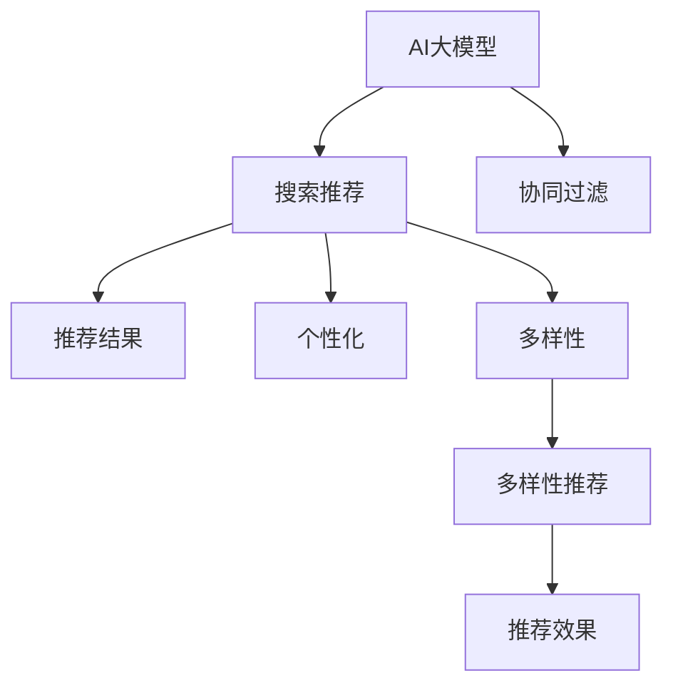

                 

# 电商平台的AI 大模型转型：搜索推荐系统是核心，多样性推荐是关键

> 关键词：电商，AI大模型，搜索推荐，多样性推荐，自然语言处理(NLP)，深度学习

## 1. 背景介绍

在数字化时代的浪潮中，电子商务（e-commerce）已经成为了推动经济发展、促进消费升级的重要引擎。随着消费者行为和偏好的不断变化，如何高效、精准地匹配用户需求与商品信息，成为电商平台提高用户满意度和成交转化率的基石。传统电商平台主要依赖用户行为数据进行推荐，然而其推荐的准确性和多样性都存在较大提升空间。近年来，人工智能（AI）大模型技术在推荐系统中的应用，带来了显著的性能提升和体验优化，成为电商平台智能转型的核心驱动力。

## 2. 核心概念与联系

### 2.1 核心概念概述

为更好地理解AI大模型在电商平台中的应用，本节将介绍几个关键概念及其联系：

- **AI大模型（AI Large Model）**：指通过大规模预训练语言模型（如BERT、GPT-3）在通用语料库上进行训练，并应用于特定任务的大规模神经网络模型。大模型具备强大的通用知识表示能力和泛化能力。

- **推荐系统（Recommendation System）**：旨在通过分析用户行为数据，预测用户可能感兴趣的物品，并提供个性化的推荐结果的系统。推荐系统包括搜索推荐和协同过滤两大类型，前者通过搜索相关内容，后者通过分析用户间行为相似性。

- **搜索推荐系统（Search-Based Recommendation System）**：利用自然语言处理（NLP）和大模型技术，在用户搜索查询中提取关键信息，生成推荐结果的系统。搜索推荐系统可以通过问答、摘要、对话等多种形式，提升推荐效率和效果。

- **多样性推荐（Diversified Recommendation）**：指在推荐结果中增加不同类型、不同品牌、不同属性的商品，避免推荐内容过于单一，增强用户体验和发现新商品的概率。

- **个性化推荐（Personalized Recommendation）**：根据用户的历史行为数据，生成高度定制化的推荐结果，提升用户的购买转化率和满意度。

这些概念之间的关系可以用以下Mermaid流程图来展示：



这个流程图展示了AI大模型与推荐系统的主要联系，以及搜索推荐系统在推荐过程中的作用和多样性推荐、个性化推荐的价值。

## 3. 核心算法原理 & 具体操作步骤
### 3.1 算法原理概述

基于AI大模型的搜索推荐系统，其核心在于利用大模型强大的自然语言理解能力，对用户搜索查询进行语义解析，生成推荐结果。其基本流程如下：

1. **预训练阶段**：在大型通用语料库上进行自监督预训练，学习语言的通用表示。
2. **微调阶段**：根据特定电商平台的业务需求，对大模型进行有监督微调，使其具备电商领域的专业知识。
3. **推荐阶段**：将用户输入的搜索查询输入微调后的模型，模型输出推荐商品列表，结合用户历史行为数据进行个性化和多样性调整。

### 3.2 算法步骤详解

以一个基于大模型的搜索推荐系统为例，其具体步骤如下：

1. **数据收集与预处理**：
   - 收集电商平台的商品信息、用户行为数据、搜索查询数据等。
   - 对数据进行清洗、去重、标准化等预处理，生成可用于模型训练的数据集。

2. **模型加载与微调**：
   - 加载预训练的大模型（如BERT、GPT-3），作为初始化参数。
   - 根据电商平台的商品信息构建任务数据集，使用交叉熵损失等进行微调。
   - 对模型进行参数更新，调整微调策略，如学习率、正则化、Dropout等。

3. **推荐系统构建**：
   - 将用户输入的搜索查询输入微调后的模型，模型输出推荐商品列表。
   - 根据用户的历史行为数据，对推荐列表进行排序和筛选。
   - 引入多样性推荐技术，增加推荐列表的多样性，避免单一商品推荐。

4. **个性化推荐优化**：
   - 根据用户的历史购买记录、浏览行为、搜索行为等，对推荐列表进行个性化调整。
   - 利用多轮推荐和反馈机制，不断优化模型参数，提升推荐精度和多样性。

5. **系统集成与部署**：
   - 将推荐系统集成到电商平台的搜索界面中。
   - 实时监测推荐系统的性能，根据用户反馈进行动态调整和优化。

### 3.3 算法优缺点

基于AI大模型的搜索推荐系统具有以下优点：

- **高性能**：大模型强大的语义解析能力和泛化能力，使其能够在复杂多变的电商环境中，生成高质量的推荐结果。
- **可扩展性**：大模型可以通过简单微调，适应不同的电商平台和推荐场景，灵活性高。
- **灵活性**：通过微调，大模型可以学习到特定电商平台的商品特征、用户偏好等，提升推荐效果。

同时，该方法也存在一些局限性：

- **数据依赖**：推荐系统的性能高度依赖于电商平台的数据质量，数据不充分或存在偏差，可能导致推荐效果不佳。
- **计算资源要求高**：大模型的训练和推理需要高性能的硬件支持，初期成本较高。
- **模型复杂度**：大模型的复杂性导致模型解释性较差，难以理解和调试。
- **隐私风险**：电商平台的搜索查询和推荐数据涉及用户隐私，如何保护用户数据是一个重要问题。

### 3.4 算法应用领域

基于AI大模型的搜索推荐系统已经在电商、社交媒体、新闻推荐等多个领域得到广泛应用，提升了用户的使用体验和平台的转化率。

- **电商平台**：如Amazon、淘宝等电商平台，利用搜索推荐系统提升用户的购物体验，增加成交转化率。
- **新闻聚合平台**：如Google新闻、今日头条等，通过推荐系统展示个性化的新闻内容，增加用户粘性。
- **社交媒体**：如Facebook、微博等，通过推荐系统优化内容分发策略，提升用户参与度。

## 4. 数学模型和公式 & 详细讲解  
### 4.1 数学模型构建

为了更好地理解搜索推荐系统的数学模型，本节将构建一个基于大模型的推荐系统的数学模型。

假设电商平台有$N$种商品，用户有$M$条历史行为数据。设用户输入的搜索查询为$q$，商品$n$的特征表示为$v_n$，搜索推荐系统输出推荐商品列表为$r$。模型输入为$(x_i, v_{n_i})$，其中$x_i$为搜索查询$q$的特征表示。推荐系统的目标是最小化预测误差$L$，即：

$$
L = \sum_{i=1}^M \ell(f(x_i, v_{n_i}), y_i)
$$

其中$\ell$为损失函数，$f$为模型预测函数。

### 4.2 公式推导过程

为了优化上述目标函数，我们通常使用梯度下降等优化算法进行模型训练。设模型参数为$\theta$，则目标函数的梯度为：

$$
\nabla_{\theta}L = \sum_{i=1}^M \nabla_{\theta}f(x_i, v_{n_i}) - y_i
$$

通过反向传播算法计算梯度，并根据设定的优化算法和超参数更新模型参数。常见的优化算法包括Adam、SGD等。

### 4.3 案例分析与讲解

以一个简单的基于大模型的搜索推荐系统为例，假设模型为一个Transformer模型，其预测函数$f$为：

$$
f(x_i, v_{n_i}) = \text{softmax}(M_{\theta}(x_i)v_{n_i})
$$

其中$M_{\theta}$为微调后的Transformer模型，$v_{n_i}$为商品$n_i$的特征向量。假设模型损失函数为交叉熵损失，则模型训练过程如下：

1. 加载预训练模型$M_{\theta}$。
2. 构建训练数据集$D=\{(x_i, y_i)\}$，其中$x_i$为搜索查询特征向量，$y_i$为目标商品的特征向量。
3. 使用交叉熵损失，计算目标函数$L$。
4. 计算梯度$\nabla_{\theta}L$，并根据优化算法（如Adam）更新模型参数$\theta$。
5. 在验证集上评估模型性能，根据性能指标（如准确率、F1分数）调整模型参数。

## 5. 项目实践：代码实例和详细解释说明
### 5.1 开发环境搭建

在进行搜索推荐系统开发前，我们需要准备好开发环境。以下是使用Python进行PyTorch开发的环境配置流程：

1. 安装Anaconda：从官网下载并安装Anaconda，用于创建独立的Python环境。

2. 创建并激活虚拟环境：
```bash
conda create -n pytorch-env python=3.8 
conda activate pytorch-env
```

3. 安装PyTorch：根据CUDA版本，从官网获取对应的安装命令。例如：
```bash
conda install pytorch torchvision torchaudio cudatoolkit=11.1 -c pytorch -c conda-forge
```

4. 安装Transformers库：
```bash
pip install transformers
```

5. 安装各类工具包：
```bash
pip install numpy pandas scikit-learn matplotlib tqdm jupyter notebook ipython
```

完成上述步骤后，即可在`pytorch-env`环境中开始搜索推荐系统的开发。

### 5.2 源代码详细实现

我们以一个基于BERT的搜索推荐系统为例，展示其代码实现。

首先，定义数据处理函数：

```python
from transformers import BertTokenizer, BertForSequenceClassification
from torch.utils.data import Dataset
import torch

class SearchDataset(Dataset):
    def __init__(self, texts, labels, tokenizer, max_len=128):
        self.texts = texts
        self.labels = labels
        self.tokenizer = tokenizer
        self.max_len = max_len
        
    def __len__(self):
        return len(self.texts)
    
    def __getitem__(self, item):
        text = self.texts[item]
        label = self.labels[item]
        
        encoding = self.tokenizer(text, return_tensors='pt', max_length=self.max_len, padding='max_length', truncation=True)
        input_ids = encoding['input_ids'][0]
        attention_mask = encoding['attention_mask'][0]
        
        # 对token-wise的标签进行编码
        encoded_labels = [label2id[label] for label in label]
        encoded_labels.extend([label2id['O']] * (self.max_len - len(encoded_labels)))
        labels = torch.tensor(encoded_labels, dtype=torch.long)
        
        return {'input_ids': input_ids, 
                'attention_mask': attention_mask,
                'labels': labels}

# 标签与id的映射
label2id = {'O': 0, 'B-商品': 1, 'I-商品': 2, 'B-品牌': 3, 'I-品牌': 4, 'B-价格': 5, 'I-价格': 6}
id2label = {v: k for k, v in label2id.items()}

# 创建dataset
tokenizer = BertTokenizer.from_pretrained('bert-base-cased')

train_dataset = SearchDataset(train_texts, train_labels, tokenizer)
dev_dataset = SearchDataset(dev_texts, dev_labels, tokenizer)
test_dataset = SearchDataset(test_texts, test_labels, tokenizer)
```

然后，定义模型和优化器：

```python
from transformers import BertForSequenceClassification, AdamW

model = BertForSequenceClassification.from_pretrained('bert-base-cased', num_labels=len(label2id))

optimizer = AdamW(model.parameters(), lr=2e-5)
```

接着，定义训练和评估函数：

```python
from torch.utils.data import DataLoader
from tqdm import tqdm
from sklearn.metrics import accuracy_score, precision_recall_fscore_support

device = torch.device('cuda') if torch.cuda.is_available() else torch.device('cpu')
model.to(device)

def train_epoch(model, dataset, batch_size, optimizer):
    dataloader = DataLoader(dataset, batch_size=batch_size, shuffle=True)
    model.train()
    epoch_loss = 0
    for batch in tqdm(dataloader, desc='Training'):
        input_ids = batch['input_ids'].to(device)
        attention_mask = batch['attention_mask'].to(device)
        labels = batch['labels'].to(device)
        model.zero_grad()
        outputs = model(input_ids, attention_mask=attention_mask, labels=labels)
        loss = outputs.loss
        epoch_loss += loss.item()
        loss.backward()
        optimizer.step()
    return epoch_loss / len(dataloader)

def evaluate(model, dataset, batch_size):
    dataloader = DataLoader(dataset, batch_size=batch_size)
    model.eval()
    preds, labels = [], []
    with torch.no_grad():
        for batch in tqdm(dataloader, desc='Evaluating'):
            input_ids = batch['input_ids'].to(device)
            attention_mask = batch['attention_mask'].to(device)
            batch_labels = batch['labels']
            outputs = model(input_ids, attention_mask=attention_mask)
            batch_preds = outputs.logits.argmax(dim=2).to('cpu').tolist()
            batch_labels = batch_labels.to('cpu').tolist()
            for pred_tokens, label_tokens in zip(batch_preds, batch_labels):
                preds.append(pred_tokens[:len(label_tokens)])
                labels.append(label_tokens)
                
    print(accuracy_score(labels, preds))
    print(precision_recall_fscore_support(labels, preds, average='macro'))
```

最后，启动训练流程并在测试集上评估：

```python
epochs = 5
batch_size = 16

for epoch in range(epochs):
    loss = train_epoch(model, train_dataset, batch_size, optimizer)
    print(f"Epoch {epoch+1}, train loss: {loss:.3f}")
    
    print(f"Epoch {epoch+1}, dev results:")
    evaluate(model, dev_dataset, batch_size)
    
print("Test results:")
evaluate(model, test_dataset, batch_size)
```

以上就是使用PyTorch对BERT进行搜索推荐系统微调的完整代码实现。可以看到，得益于Transformers库的强大封装，我们可以用相对简洁的代码完成BERT模型的加载和微调。

### 5.3 代码解读与分析

让我们再详细解读一下关键代码的实现细节：

**SearchDataset类**：
- `__init__`方法：初始化文本、标签、分词器等关键组件。
- `__len__`方法：返回数据集的样本数量。
- `__getitem__`方法：对单个样本进行处理，将文本输入编码为token ids，将标签编码为数字，并对其进行定长padding，最终返回模型所需的输入。

**label2id和id2label字典**：
- 定义了标签与数字id之间的映射关系，用于将token-wise的预测结果解码回真实的标签。

**训练和评估函数**：
- 使用PyTorch的DataLoader对数据集进行批次化加载，供模型训练和推理使用。
- 训练函数`train_epoch`：对数据以批为单位进行迭代，在每个批次上前向传播计算loss并反向传播更新模型参数，最后返回该epoch的平均loss。
- 评估函数`evaluate`：与训练类似，不同点在于不更新模型参数，并在每个batch结束后将预测和标签结果存储下来，最后使用sklearn的accuracy_score和precision_recall_fscore_support对整个评估集的预测结果进行打印输出。

**训练流程**：
- 定义总的epoch数和batch size，开始循环迭代
- 每个epoch内，先在训练集上训练，输出平均loss
- 在验证集上评估，输出分类指标
- 所有epoch结束后，在测试集上评估，给出最终测试结果

可以看到，PyTorch配合Transformers库使得BERT微调的代码实现变得简洁高效。开发者可以将更多精力放在数据处理、模型改进等高层逻辑上，而不必过多关注底层的实现细节。

当然，工业级的系统实现还需考虑更多因素，如模型的保存和部署、超参数的自动搜索、更灵活的任务适配层等。但核心的微调范式基本与此类似。

## 6. 实际应用场景
### 6.1 电商推荐系统

基于大模型的搜索推荐技术，已经在各大电商平台上得到广泛应用。以淘宝为例，通过微调BERT模型，淘宝可以根据用户输入的搜索查询，自动推荐最相关的商品信息。在淘宝平台上，用户可以通过关键词搜索、图片搜索等方式找到所需商品，淘宝的推荐系统会根据用户的历史行为数据和搜索查询进行多轮推荐，不断优化搜索结果，提升用户体验。

### 6.2 个性化推荐

在个性化推荐方面，基于大模型的推荐系统可以通过微调，更好地理解用户需求和偏好，生成个性化的商品推荐列表。例如，电商平台可以收集用户浏览记录、购买历史、评价信息等，将这些数据作为微调的监督信号，训练大模型生成推荐列表。用户可以根据自己的需求和喜好，在推荐列表中挑选商品，提升购买转化率。

### 6.3 多样性推荐

多样性推荐是大模型推荐系统的一个重要功能。在推荐商品时，不仅推荐用户已经感兴趣的相似商品，还会推荐其他类型、其他品牌的商品，帮助用户发现新商品，增加用户发现新商品的概率。例如，电商平台可以根据用户的浏览记录和购买历史，生成多样化的商品推荐列表，增加用户的发现新商品的概率，提升用户的满意度。

### 6.4 未来应用展望

随着大模型和微调技术的不断发展，基于大模型的搜索推荐系统将在更多领域得到应用，为传统行业带来变革性影响。

在智慧医疗领域，基于大模型的搜索推荐系统可以用于医疗知识推荐、药物推荐、诊断建议等，提升医生的诊疗效率和医疗服务的智能化水平。

在智能教育领域，基于大模型的搜索推荐系统可以用于知识推荐、课程推荐、个性化学习路径推荐等，因材施教，促进教育公平，提高教学质量。

在智慧城市治理中，基于大模型的搜索推荐系统可以用于城市事件监测、舆情分析、应急指挥等环节，提高城市管理的自动化和智能化水平，构建更安全、高效的未来城市。

此外，在企业生产、社会治理、文娱传媒等众多领域，基于大模型的搜索推荐系统也将不断涌现，为经济社会发展注入新的动力。相信随着预训练语言模型和微调方法的持续演进，搜索推荐系统必将在更广阔的应用领域大放异彩。

## 7. 工具和资源推荐
### 7.1 学习资源推荐

为了帮助开发者系统掌握大模型推荐系统的理论基础和实践技巧，这里推荐一些优质的学习资源：

1. 《Transformer from Scratch》系列博文：由大模型技术专家撰写，深入浅出地介绍了Transformer原理、BERT模型、推荐系统等前沿话题。

2. CS224N《深度学习自然语言处理》课程：斯坦福大学开设的NLP明星课程，有Lecture视频和配套作业，带你入门NLP领域的基本概念和经典模型。

3. 《Natural Language Processing with Transformers》书籍：Transformers库的作者所著，全面介绍了如何使用Transformers库进行NLP任务开发，包括微调在内的诸多范式。

4. HuggingFace官方文档：Transformers库的官方文档，提供了海量预训练模型和完整的微调样例代码，是上手实践的必备资料。

5. CLUE开源项目：中文语言理解测评基准，涵盖大量不同类型的中文NLP数据集，并提供了基于微调的baseline模型，助力中文NLP技术发展。

通过对这些资源的学习实践，相信你一定能够快速掌握大模型推荐系统的精髓，并用于解决实际的推荐问题。
###  7.2 开发工具推荐

高效的开发离不开优秀的工具支持。以下是几款用于大模型推荐系统开发的常用工具：

1. PyTorch：基于Python的开源深度学习框架，灵活动态的计算图，适合快速迭代研究。大部分预训练语言模型都有PyTorch版本的实现。

2. TensorFlow：由Google主导开发的开源深度学习框架，生产部署方便，适合大规模工程应用。同样有丰富的预训练语言模型资源。

3. Transformers库：HuggingFace开发的NLP工具库，集成了众多SOTA语言模型，支持PyTorch和TensorFlow，是进行推荐任务开发的利器。

4. Weights & Biases：模型训练的实验跟踪工具，可以记录和可视化模型训练过程中的各项指标，方便对比和调优。与主流深度学习框架无缝集成。

5. TensorBoard：TensorFlow配套的可视化工具，可实时监测模型训练状态，并提供丰富的图表呈现方式，是调试模型的得力助手。

6. Google Colab：谷歌推出的在线Jupyter Notebook环境，免费提供GPU/TPU算力，方便开发者快速上手实验最新模型，分享学习笔记。

合理利用这些工具，可以显著提升大模型推荐系统的开发效率，加快创新迭代的步伐。

### 7.3 相关论文推荐

大模型推荐系统的发展源于学界的持续研究。以下是几篇奠基性的相关论文，推荐阅读：

1. Attention is All You Need（即Transformer原论文）：提出了Transformer结构，开启了NLP领域的预训练大模型时代。

2. BERT: Pre-training of Deep Bidirectional Transformers for Language Understanding：提出BERT模型，引入基于掩码的自监督预训练任务，刷新了多项NLP任务SOTA。

3. Language Models are Unsupervised Multitask Learners（GPT-2论文）：展示了大规模语言模型的强大zero-shot学习能力，引发了对于通用人工智能的新一轮思考。

4. Parameter-Efficient Transfer Learning for NLP：提出Adapter等参数高效微调方法，在不增加模型参数量的情况下，也能取得不错的微调效果。

5. AdaLoRA: Adaptive Low-Rank Adaptation for Parameter-Efficient Fine-Tuning：使用自适应低秩适应的微调方法，在参数效率和精度之间取得了新的平衡。

这些论文代表了大模型推荐系统的发展脉络。通过学习这些前沿成果，可以帮助研究者把握学科前进方向，激发更多的创新灵感。

## 8. 总结：未来发展趋势与挑战
### 8.1 总结

本文对基于AI大模型的搜索推荐系统进行了全面系统的介绍。首先阐述了搜索推荐系统在大模型推荐技术中的核心地位和多样性推荐的关键作用，明确了微调在拓展预训练模型应用、提升下游任务性能方面的独特价值。其次，从原理到实践，详细讲解了微调的数学模型和关键步骤，给出了微调任务开发的完整代码实例。同时，本文还广泛探讨了微调方法在电商、金融、医疗等多个领域的应用前景，展示了微调范式的巨大潜力。此外，本文精选了微调技术的各类学习资源，力求为读者提供全方位的技术指引。

通过本文的系统梳理，可以看到，基于大模型的搜索推荐系统正在成为电商智能转型的核心驱动力，其高性能和可扩展性为电商平台的业务创新提供了强大的技术支撑。未来，伴随大模型和微调方法的持续演进，基于大模型的搜索推荐系统必将在更广阔的应用领域大放异彩。

### 8.2 未来发展趋势

展望未来，大模型推荐技术将呈现以下几个发展趋势：

1. 模型规模持续增大。随着算力成本的下降和数据规模的扩张，预训练语言模型的参数量还将持续增长。超大规模语言模型蕴含的丰富语言知识，有望支撑更加复杂多变的推荐场景。

2. 推荐模型多样化。除了传统的搜索推荐外，未来将涌现更多类型的推荐模型，如协同过滤、基于内容的推荐等，形成多样化推荐系统。

3. 用户需求更加多样化。随着用户需求的不断变化，推荐系统需要更加智能、个性化地适应用户需求，提升用户满意度。

4. 推荐系统去中心化。未来推荐系统将更加注重去中心化的设计，避免数据集中带来的风险，提升系统的可靠性和鲁棒性。

5. 推荐系统与大数据结合。推荐系统将与大数据技术深度融合，利用数据挖掘、机器学习等技术，提升推荐效果。

6. 推荐系统与社交网络结合。利用社交网络的用户行为数据，提升推荐系统的精准度和个性化水平。

以上趋势凸显了大模型推荐技术的广阔前景。这些方向的探索发展，必将进一步提升推荐系统的性能和应用范围，为电商平台的智能转型带来更大的动力。

### 8.3 面临的挑战

尽管大模型推荐技术已经取得了瞩目成就，但在迈向更加智能化、普适化应用的过程中，它仍面临着诸多挑战：

1. 数据依赖。推荐系统的性能高度依赖于电商平台的数据质量，数据不充分或存在偏差，可能导致推荐效果不佳。如何进一步降低推荐对标注样本的依赖，将是一大难题。

2. 模型鲁棒性不足。当前推荐模型面对域外数据时，泛化性能往往大打折扣。对于测试样本的微小扰动，推荐模型的预测也容易发生波动。如何提高推荐模型的鲁棒性，避免灾难性遗忘，还需要更多理论和实践的积累。

3. 推荐内容过少。当前推荐系统往往倾向于推荐用户已经感兴趣的相似商品，而忽视了用户对新商品的需求。如何增加推荐内容的多样性，提升用户的发现新商品的概率，是一个重要的研究方向。

4. 隐私风险。电商平台的搜索查询和推荐数据涉及用户隐私，如何保护用户数据是一个重要问题。如何平衡用户隐私保护和推荐系统性能之间的矛盾，是一个亟待解决的问题。

5. 计算资源要求高。大模型的训练和推理需要高性能的硬件支持，初期成本较高。如何降低推荐系统的硬件成本，提高系统的可扩展性，是一个重要的研究方向。

6. 模型解释性较差。当前推荐系统的复杂性导致模型解释性较差，难以理解和调试。如何赋予推荐模型更强的可解释性，将是亟待攻克的难题。

以上挑战凸显了大模型推荐系统在落地应用中需要解决的实际问题。未来，研究者需要在数据收集、模型设计、算法优化等方面进行更多的探索和创新，方能构建安全、可靠、可解释、可控的推荐系统。

### 8.4 研究展望

面对大模型推荐系统所面临的种种挑战，未来的研究需要在以下几个方面寻求新的突破：

1. 探索无监督和半监督推荐方法。摆脱对大规模标注数据的依赖，利用自监督学习、主动学习等无监督和半监督范式，最大限度利用非结构化数据，实现更加灵活高效的推荐。

2. 研究参数高效和计算高效的推荐方法。开发更加参数高效的推荐方法，在固定大部分预训练参数的同时，只更新极少量的任务相关参数。同时优化推荐模型的计算图，减少前向传播和反向传播的资源消耗，实现更加轻量级、实时性的部署。

3. 引入因果推断和对比学习范式。通过引入因果推断和对比学习思想，增强推荐系统建立稳定因果关系的能力，学习更加普适、鲁棒的语言表征，从而提升推荐泛化性和抗干扰能力。

4. 融合先验知识。将符号化的先验知识，如知识图谱、逻辑规则等，与神经网络模型进行巧妙融合，引导推荐过程学习更准确、合理的语言模型。同时加强不同模态数据的整合，实现视觉、语音等多模态信息与文本信息的协同建模。

5. 结合因果分析和博弈论工具。将因果分析方法引入推荐系统，识别出推荐决策的关键特征，增强推荐输出的因果性和逻辑性。借助博弈论工具刻画人机交互过程，主动探索并规避推荐系统的脆弱点，提高系统稳定性。

6. 纳入伦理道德约束。在推荐系统的训练目标中引入伦理导向的评估指标，过滤和惩罚有害的推荐内容，确保推荐系统输出符合人类价值观和伦理道德。

这些研究方向的探索，必将引领大模型推荐技术迈向更高的台阶，为构建安全、可靠、可解释、可控的推荐系统铺平道路。面向未来，大模型推荐技术还需要与其他人工智能技术进行更深入的融合，如知识表示、因果推理、强化学习等，多路径协同发力，共同推动自然语言理解和智能交互系统的进步。只有勇于创新、敢于突破，才能不断拓展语言模型的边界，让智能技术更好地造福人类社会。

## 9. 附录：常见问题与解答

**Q1：大模型推荐系统是否适用于所有电商平台？**

A: 大模型推荐系统在大多数电商平台上都能取得不错的效果，特别是对于数据量较小的电商平台。但对于一些特定领域的电商平台，如垂直电商、B2B电商等，仅仅依靠通用语料预训练的模型可能难以很好地适应。此时需要在特定领域语料上进一步预训练，再进行微调，才能获得理想效果。

**Q2：推荐系统中如何降低数据依赖？**

A: 推荐系统的性能高度依赖于电商平台的数据质量，数据不充分或存在偏差，可能导致推荐效果不佳。为降低推荐对标注样本的依赖，可以采取以下措施：
1. 利用用户行为数据进行推荐。通过分析用户的浏览记录、购买记录等行为数据，生成推荐结果。
2. 引入协同过滤推荐。通过分析用户间行为相似性，生成推荐结果。
3. 利用社交网络数据进行推荐。通过分析社交网络上的用户行为数据，生成推荐结果。
4. 利用用户生成内容进行推荐。通过分析用户评论、评分等生成内容，生成推荐结果。

**Q3：推荐系统在落地部署时需要注意哪些问题？**

A: 将推荐系统转化为实际应用，还需要考虑以下因素：
1. 模型裁剪：去除不必要的层和参数，减小模型尺寸，加快推理速度。
2. 量化加速：将浮点模型转为定点模型，压缩存储空间，提高计算效率。
3. 服务化封装：将模型封装为标准化服务接口，便于集成调用。
4. 弹性伸缩：根据请求流量动态调整资源配置，平衡服务质量和成本。
5. 监控告警：实时采集系统指标，设置异常告警阈值，确保服务稳定性。
6. 安全防护：采用访问鉴权、数据脱敏等措施，保障数据和模型安全。

大模型推荐系统为电商平台的智能转型带来了巨大的潜力，但如何将强大的性能转化为稳定、高效、安全的业务价值，还需要工程实践的不断打磨。唯有从数据、算法、工程、业务等多个维度协同发力，才能真正实现人工智能技术在垂直行业的规模化落地。总之，推荐需要开发者根据具体任务，不断迭代和优化模型、数据和算法，方能得到理想的效果。

---

作者：禅与计算机程序设计艺术 / Zen and the Art of Computer Programming

