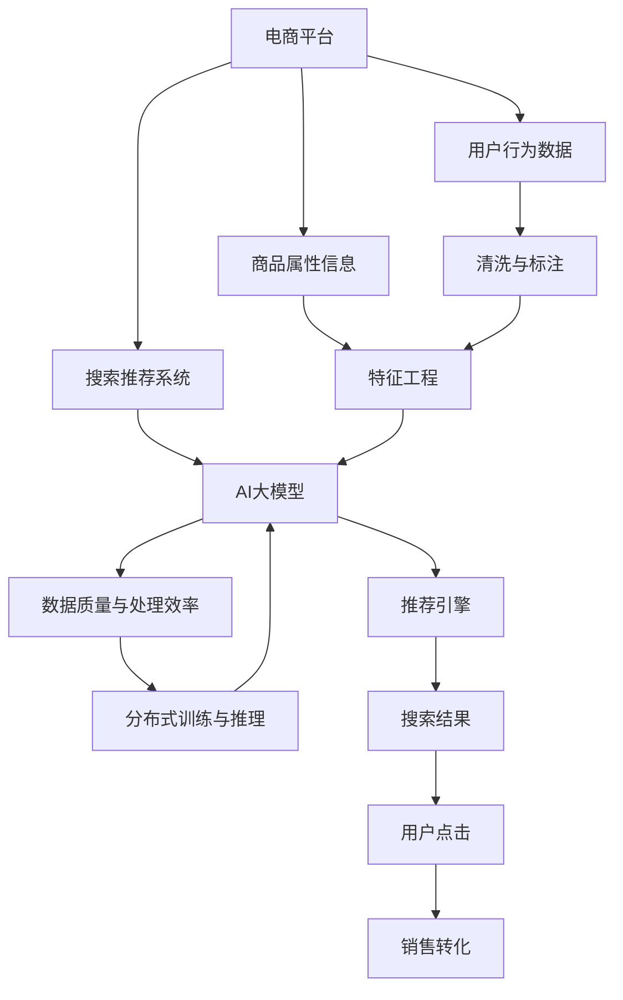

                 

# 电商平台的AI 大模型转型：搜索推荐系统是核心，数据质量与处理效率

## 1. 背景介绍

随着电商平台用户量的急剧增加和市场的激烈竞争，AI技术成为电商平台转型升级的必由之路。特别是在搜索推荐系统(Search and Recommendation System)领域，AI大模型通过在大规模数据上进行预训练，学习到丰富的用户行为和商品特征表示，极大地提升了搜索和推荐的效果，成为电商平台的“核心引擎”。

本文将详细探讨电商平台的AI大模型转型，特别是搜索推荐系统的构建，以及数据质量和处理效率在其中的关键作用。我们将从背景介绍、核心概念、算法原理与操作、实际应用场景等多个方面进行系统阐述，力求为电商平台的AI转型提供有价值的参考。

## 2. 核心概念与联系

### 2.1 核心概念概述

为了更好地理解搜索推荐系统在电商平台AI转型中的核心作用，我们首先梳理几个关键概念：

- 搜索推荐系统(Search and Recommendation System, SRS)：电商平台的核心技术，通过学习用户行为数据和商品属性信息，推荐用户感兴趣的商品，提升用户体验和平台转化率。

- AI大模型(AI Large Model)：基于深度学习，在大规模数据上进行预训练的大型模型，具备强大的特征学习和表达能力，广泛应用于电商平台的搜索推荐、广告推荐、内容生成等场景。

- 数据质量与处理效率：搜索推荐系统的精准度和效率，直接依赖于数据的质量与处理速度。高质量的数据和高效的算法能更好地捕捉用户行为，减少误推荐，提升用户体验。

- 分布式训练与推理：电商平台用户规模庞大，需要在多台服务器上进行分布式训练和推理，以提升系统的处理能力。

这些概念之间的联系和互动，通过以下Mermaid流程图进行展示：



这个流程图展示了电商平台与搜索推荐系统的关系，以及数据质量、处理效率、分布式训练和推理等关键技术在其中的作用。

## 3. 核心算法原理 & 具体操作步骤

### 3.1 算法原理概述

搜索推荐系统的核心算法主要包括协同过滤(Collaborative Filtering)、基于内容的推荐(Content-Based Recommendation)、深度学习模型等。其中，深度学习模型，特别是基于大模型的推荐系统，通过在大规模用户行为数据和商品属性数据上进行预训练，学习到用户和商品的隐式表示，能够高效地捕捉用户隐含偏好，推荐更符合用户兴趣的商品。

具体来说，搜索推荐系统的工作流程如下：

1. 收集用户行为数据和商品属性信息。
2. 对数据进行清洗和标注，构建训练集。
3. 在大规模数据上对AI大模型进行预训练，学习用户和商品的隐式表示。
4. 在训练集上微调AI大模型，使其更加适应电商平台的推荐任务。
5. 在实时数据上对模型进行推理，生成推荐结果。

### 3.2 算法步骤详解

以下是搜索推荐系统构建的核心算法步骤：

**Step 1: 数据收集与预处理**
- 收集电商平台的用户行为数据，如浏览记录、点击记录、购买记录等。
- 收集商品属性信息，如商品名称、描述、类别、价格等。
- 对数据进行清洗，去除无效记录，填补缺失值。
- 对数据进行标注，构建训练集。

**Step 2: 特征工程**
- 对用户行为数据进行特征提取，如用户ID、浏览时间、浏览路径等。
- 对商品属性进行特征提取，如商品ID、分类、价格、评价等。
- 设计合适的特征编码方式，如独热编码、交叉编码等。
- 对用户和商品特征进行组合，构建训练数据。

**Step 3: 模型预训练**
- 使用AI大模型在大型电商数据集上进行预训练，学习用户和商品的隐式表示。
- 选择合适的预训练任务，如自回归、自编码、掩码语言模型等。
- 在大规模数据上进行分布式训练，加速训练过程。
- 保存预训练模型，供后续微调使用。

**Step 4: 模型微调**
- 根据电商平台的推荐任务，设计合适的任务适配层。
- 在训练集上微调预训练模型，优化推荐效果。
- 选择合适的优化器及其参数，如AdamW、SGD等，设置学习率、批大小、迭代轮数等。
- 设置正则化技术及强度，包括权重衰减、Dropout、Early Stopping等。

**Step 5: 模型推理**
- 在实时数据上对微调后的模型进行推理，生成推荐结果。
- 实时采集用户行为数据，不断更新模型参数。
- 对推荐结果进行排序，选取最优商品。
- 将推荐结果展示给用户，提升用户体验和平台转化率。

### 3.3 算法优缺点

搜索推荐系统的优点包括：
1. 高效性：大模型能够高效地处理大规模数据，提供实时推荐服务。
2. 准确性：基于深度学习的大模型能够捕捉用户隐含的偏好，推荐更符合用户兴趣的商品。
3. 可解释性：大模型的隐式表示和推荐过程具有较好的可解释性，方便进行调优。

同时，该方法也存在一些缺点：
1. 数据依赖性强：推荐效果依赖于数据的质量和完整性，数据不充分或数据噪声会影响模型性能。
2. 模型复杂度高：大模型结构复杂，训练和推理过程中需要大量的计算资源。
3. 数据隐私问题：用户行为数据包含隐私信息，需要严格保护和处理。
4. 计算延迟高：大模型推理速度较慢，可能影响用户体验。

### 3.4 算法应用领域

搜索推荐系统已经在电商平台的多个环节得到广泛应用，如商品搜索、商品推荐、个性化广告、内容推荐等。具体应用场景包括：

- 商品搜索：根据用户查询，推荐最相关的商品，提升搜索体验。
- 个性化推荐：根据用户历史行为，推荐符合用户兴趣的商品，提升点击率。
- 广告推荐：在用户浏览商品时，展示符合用户兴趣的广告，提高广告效果。
- 内容推荐：推荐相关商品或内容的图文视频，增加用户停留时间。

除了上述这些经典应用外，搜索推荐系统还广泛应用于社交平台、视频网站、音乐平台等场景中，为不同领域提供个性化的信息推荐服务。

## 4. 数学模型和公式 & 详细讲解

### 4.1 数学模型构建

搜索推荐系统的数学模型构建，基于用户的隐式表示和商品的属性表示。假设用户行为数据为 $X$，商品属性数据为 $Y$，用户对商品 $i$ 的评分 $r_i$ 为：

$$
r_i = \alpha u_x + \beta v_y + \epsilon
$$

其中 $u_x$ 和 $v_y$ 分别为用户和商品的隐式表示，$\alpha$ 和 $\beta$ 为相似度系数，$\epsilon$ 为噪声。搜索推荐系统的工作目标为：

$$
\min_{u_x, v_y} \sum_{i=1}^N (r_i - \alpha u_x \cdot v_y) ^2
$$

### 4.2 公式推导过程

通过最小二乘法，求解上述目标函数，可以得到用户和商品的隐式表示 $u_x$ 和 $v_y$：

$$
u_x = \frac{1}{\alpha^2} \sum_{i=1}^N r_i v_y
$$

$$
v_y = \frac{1}{\beta^2} \sum_{i=1}^N r_i u_x
$$

其中，$\cdot$ 表示向量点积。将 $u_x$ 和 $v_y$ 代入推荐公式，可以得到商品的推荐结果：

$$
r_i = \alpha u_x \cdot v_y
$$

### 4.3 案例分析与讲解

以下以电商平台的商品推荐为例，详细分析搜索推荐系统的构建和优化。

**案例1: 用户行为数据的清洗与标注**
- 对用户行为数据进行清洗，去除重复、无效记录。
- 对数据进行标注，构建训练集。标注方式可以是二元分类，如用户是否购买某商品；也可以是多分类，如用户对某商品的好评或差评。

**案例2: 特征工程**
- 对用户行为数据进行特征提取，如用户ID、浏览时间、浏览路径等。
- 对商品属性进行特征提取，如商品ID、分类、价格、评价等。
- 设计合适的特征编码方式，如独热编码、交叉编码等。

**案例3: 模型预训练**
- 使用AI大模型在大型电商数据集上进行预训练，学习用户和商品的隐式表示。
- 选择合适的预训练任务，如自回归、自编码、掩码语言模型等。
- 在大规模数据上进行分布式训练，加速训练过程。
- 保存预训练模型，供后续微调使用。

**案例4: 模型微调**
- 根据电商平台的推荐任务，设计合适的任务适配层。
- 在训练集上微调预训练模型，优化推荐效果。
- 选择合适的优化器及其参数，如AdamW、SGD等，设置学习率、批大小、迭代轮数等。
- 设置正则化技术及强度，包括权重衰减、Dropout、Early Stopping等。

**案例5: 模型推理**
- 在实时数据上对微调后的模型进行推理，生成推荐结果。
- 实时采集用户行为数据，不断更新模型参数。
- 对推荐结果进行排序，选取最优商品。
- 将推荐结果展示给用户，提升用户体验和平台转化率。

## 5. 项目实践：代码实例和详细解释说明

### 5.1 开发环境搭建

在进行搜索推荐系统构建的过程中，需要搭建合适的开发环境。以下是使用Python进行TensorFlow开发的环境配置流程：

1. 安装Anaconda：从官网下载并安装Anaconda，用于创建独立的Python环境。

2. 创建并激活虚拟环境：
```bash
conda create -n tf-env python=3.8 
conda activate tf-env
```

3. 安装TensorFlow：根据CUDA版本，从官网获取对应的安装命令。例如：
```bash
conda install tensorflow tensorflow-gpu==2.5 -c pytorch -c conda-forge
```

4. 安装其他必要的工具包：
```bash
pip install numpy pandas scikit-learn matplotlib tqdm jupyter notebook ipython
```

完成上述步骤后，即可在`tf-env`环境中开始搜索推荐系统的构建。

### 5.2 源代码详细实现

以下是使用TensorFlow构建搜索推荐系统的示例代码：

```python
import tensorflow as tf
from tensorflow.keras.layers import Dense, Input
from tensorflow.keras.models import Model

# 定义用户行为数据的特征
user_features = tf.keras.layers.Dense(64, activation='relu')(input_user)
# 定义商品属性数据的特征
item_features = tf.keras.layers.Dense(64, activation='relu')(input_item)
# 定义模型输出
output = tf.keras.layers.Dense(1, activation='sigmoid')(tf.keras.layers.Concatenate()([user_features, item_features]))
# 构建模型
model = Model(inputs=[input_user, input_item], outputs=output)

# 编译模型
model.compile(optimizer='adam', loss='binary_crossentropy', metrics=['accuracy'])

# 训练模型
model.fit([X_train, Y_train], y_train, epochs=10, batch_size=64)

# 推理预测
predictions = model.predict([X_test, Y_test])
```

### 5.3 代码解读与分析

让我们再详细解读一下关键代码的实现细节：

**构建用户行为特征**
- 使用`Dense`层将用户行为数据映射到高维空间。
- 设置激活函数为`relu`，增加模型的非线性能力。

**构建商品属性特征**
- 使用`Dense`层将商品属性数据映射到高维空间。
- 设置激活函数为`relu`，增加模型的非线性能力。

**定义模型输出**
- 使用`Concatenate`层将用户和商品特征拼接在一起。
- 使用`Dense`层对拼接后的特征进行线性映射，输出推荐结果。

**构建模型**
- 定义输入层和输出层，并连接用户和商品特征。
- 定义输出层，计算推荐结果。

**编译模型**
- 选择合适的优化器和损失函数，如Adam优化器和二元交叉熵损失函数。

**训练模型**
- 使用`fit`方法在训练集上训练模型。
- 设置迭代轮数和批大小。

**推理预测**
- 使用`predict`方法在测试集上对模型进行推理预测。

## 6. 实际应用场景

### 6.1 搜索推荐系统在电商平台的应用

搜索推荐系统在电商平台中具有重要地位，能够显著提升用户体验和平台转化率。具体应用场景包括：

- 商品搜索：根据用户查询，推荐最相关的商品，提升搜索体验。
- 个性化推荐：根据用户历史行为，推荐符合用户兴趣的商品，提升点击率。
- 广告推荐：在用户浏览商品时，展示符合用户兴趣的广告，提高广告效果。
- 内容推荐：推荐相关商品或内容的图文视频，增加用户停留时间。

搜索推荐系统的成功部署，使得电商平台能够实现用户行为的精准捕捉和商品推荐的个性化，提升用户满意度和平台转化率。

### 6.2 未来应用展望

随着技术的不断进步，搜索推荐系统将会在更多的领域得到应用。以下是一些潜在的应用方向：

- 智能客服：基于用户的历史行为和实时查询，推荐最符合用户需求的服务。
- 健康管理：根据用户的历史健康数据和实时监测数据，推荐最适合的医疗服务。
- 智能交通：根据用户的出行习惯和实时交通数据，推荐最优的出行方案。
- 金融理财：根据用户的财务数据和投资偏好，推荐最适合的投资组合。

搜索推荐系统以其强大的数据处理能力和个性化推荐能力，将在未来各个领域中发挥重要作用，推动智能化应用的普及和深入。

## 7. 工具和资源推荐

### 7.1 学习资源推荐

为了帮助开发者系统掌握搜索推荐系统的构建，以下是一些优质的学习资源：

1. 《深度学习推荐系统》书籍：详细介绍了推荐系统的理论基础和深度学习应用。
2. CS448N《深度学习与推荐系统》课程：斯坦福大学开设的推荐系统经典课程，有Lecture视频和配套作业。
3. 《Python深度学习》书籍：介绍深度学习在推荐系统中的具体应用。
4. 《TensorFlow官方文档》：TensorFlow官方文档，包含详细的推荐系统实现和优化方法。

通过这些资源的学习实践，相信你一定能够快速掌握搜索推荐系统的构建方法，并用于解决实际的推荐问题。

### 7.2 开发工具推荐

高效的开发离不开优秀的工具支持。以下是几款用于搜索推荐系统开发的常用工具：

1. TensorFlow：谷歌开源的深度学习框架，提供强大的分布式训练和推理能力。
2. PyTorch：Facebook开源的深度学习框架，提供灵活的模型构建和调优功能。
3. scikit-learn：Python机器学习库，提供简单易用的机器学习算法和数据处理工具。
4. Jupyter Notebook：开源的交互式开发环境，方便实验和数据可视化。

合理利用这些工具，可以显著提升搜索推荐系统的开发效率，加快创新迭代的步伐。

### 7.3 相关论文推荐

搜索推荐系统的发展源于学界的持续研究。以下是几篇奠基性的相关论文，推荐阅读：

1. Matrix Factorization Techniques for Recommender Systems：介绍矩阵分解方法，解决稀疏推荐问题。
2. Deep Neural Networks for Recommender Systems：提出深度神经网络方法，提升推荐系统的精度。
3. Embedding Recommendation Systems：介绍嵌入空间的方法，解决推荐系统的冷启动问题。
4. Attention Mechanism for Recommendation Systems：引入注意力机制，提升推荐系统的多维度特征捕捉能力。
5. Generative Adversarial Networks for Recommendation Systems：引入生成对抗网络，提升推荐系统的生成能力。

这些论文代表了大规模推荐系统的技术演进，为推荐系统的不断优化提供了理论指导。

## 8. 总结：未来发展趋势与挑战

### 8.1 研究成果总结

本文系统介绍了搜索推荐系统在电商平台AI转型中的核心作用，包括数据质量与处理效率的重要性。从背景介绍、核心概念、算法原理与操作步骤、实际应用场景等多个方面进行了详细阐述。

通过本文的系统梳理，可以看到，搜索推荐系统在电商平台的AI转型中发挥了重要作用，极大地提升了用户满意度和平台转化率。数据质量与处理效率是搜索推荐系统的核心，需要通过持续的数据治理和技术优化来提升。

### 8.2 未来发展趋势

展望未来，搜索推荐系统将呈现以下几个发展趋势：

1. 模型结构更加复杂：基于深度学习的搜索推荐系统将不断演进，逐步引入更复杂的模型结构，如Transformer、BERT等。

2. 实时性要求更高：电商平台的竞争日益激烈，需要在极短的时间内提供个性化推荐，实时性要求不断提升。

3. 多模态数据融合：未来的推荐系统将能够融合多模态数据，如文本、图片、视频等，提供更全面、精准的推荐服务。

4. 用户隐私保护：随着数据隐私保护的法律法规不断完善，未来的推荐系统将更加注重用户隐私保护，采用差分隐私等技术，防止数据泄露。

5. 动态调整与优化：未来的推荐系统将能够根据用户行为数据进行动态调整与优化，提升推荐效果。

6. 跨平台协同：未来的推荐系统将能够跨平台协同，提升推荐效果和用户体验。

### 8.3 面临的挑战

尽管搜索推荐系统已经取得了显著进展，但在迈向更加智能化、普适化应用的过程中，仍面临诸多挑战：

1. 数据隐私保护：搜索推荐系统需要处理大量的用户数据，数据隐私保护是一个重要问题，需要严格的法律法规和技术手段来保障。

2. 计算资源限制：随着数据规模的扩大和模型复杂度的提高，推荐系统的计算资源需求不断增加，需要高效的计算资源优化策略。

3. 推荐效果波动：搜索推荐系统面临的噪声和不确定性较多，推荐效果可能波动，需要更好的模型优化和数据处理策略。

4. 冷启动问题：新用户的推荐问题是一个挑战，需要有效的冷启动策略来提升推荐效果。

5. 跨域数据融合：不同领域的数据格式和特征不一致，跨域数据融合是一个难题。

6. 推荐内容多样性：如何保持推荐内容的丰富性和多样性，避免推荐同质化问题，需要更多技术手段。

### 8.4 研究展望

面对搜索推荐系统所面临的挑战，未来的研究需要在以下几个方面寻求新的突破：

1. 探索更高效的模型结构。基于深度学习的搜索推荐系统需要更高效的模型结构来提升计算效率和推理速度。

2. 引入更多的数据融合技术。未来的推荐系统需要能够融合更多维度的数据，如文本、图像、视频等，提升推荐效果。

3. 研究更好的用户隐私保护方法。未来的推荐系统需要更好的用户隐私保护方法，如差分隐私、联邦学习等，防止数据泄露和滥用。

4. 开发动态推荐系统。未来的推荐系统需要能够根据用户行为数据进行动态调整与优化，提升推荐效果。

5. 探索跨平台协同方法。未来的推荐系统需要能够跨平台协同，提升推荐效果和用户体验。

6. 研究更丰富的推荐策略。未来的推荐系统需要更丰富的推荐策略，如混合推荐、多臂赌博机等，提升推荐多样性和效果。

这些研究方向的探索，必将引领搜索推荐系统技术迈向更高的台阶，为电商平台的AI转型提供更强大的技术支持。面向未来，搜索推荐系统还需要与其他人工智能技术进行更深入的融合，如知识表示、因果推理、强化学习等，多路径协同发力，共同推动自然语言理解和智能交互系统的进步。只有勇于创新、敢于突破，才能不断拓展搜索推荐系统的边界，让智能化应用更好地服务人类。

## 9. 附录：常见问题与解答

**Q1：搜索推荐系统是如何提升用户体验和平台转化率的？**

A: 搜索推荐系统通过学习用户行为数据和商品属性信息，能够提供个性化的商品推荐服务。具体来说，通过分析用户的历史浏览、点击、购买记录，搜索推荐系统能够捕捉用户的兴趣和偏好，推荐最符合用户需求的商品。同时，搜索推荐系统能够实时更新推荐模型，适应用户行为的变化，提升推荐效果。通过个性化推荐和实时更新，搜索推荐系统能够显著提升用户体验和平台转化率。

**Q2：搜索推荐系统在构建过程中，如何保证数据质量？**

A: 数据质量是搜索推荐系统的核心，通过以下方法保证数据质量：

1. 数据清洗：对用户行为数据和商品属性数据进行清洗，去除无效、重复记录，填补缺失值。
2. 数据标注：对用户行为数据进行标注，构建训练集。标注方式可以是二元分类，如用户是否购买某商品；也可以是多分类，如用户对某商品的好评或差评。
3. 数据增强：通过数据增强技术，如回译、近义替换等方式扩充训练集，增强模型泛化能力。
4. 数据验证：在模型训练过程中，设置验证集进行模型验证，防止过拟合。
5. 数据隐私保护：采用差分隐私、联邦学习等技术，保障数据隐私安全。

通过这些方法，可以有效提升数据质量，保证搜索推荐系统的推荐效果。

**Q3：搜索推荐系统的推理过程是如何实现的？**

A: 搜索推荐系统的推理过程主要包括以下几个步骤：

1. 输入用户行为数据和商品属性数据。
2. 对输入数据进行特征提取和拼接。
3. 将拼接后的特征输入到推荐模型中，计算推荐结果。
4. 对推荐结果进行排序，选取最优商品。
5. 将推荐结果展示给用户。

具体来说，推荐模型通常基于深度神经网络，能够高效地处理大规模数据，提供实时推荐服务。在推理过程中，需要确保模型的快速响应和高并发处理能力，以提升用户体验和平台转化率。

**Q4：搜索推荐系统在应用过程中，如何动态调整与优化？**

A: 搜索推荐系统在应用过程中，需要根据用户行为数据进行动态调整与优化，具体方法包括：

1. 实时数据采集：实时采集用户行为数据，不断更新推荐模型。
2. 动态参数更新：根据实时数据，动态更新模型的参数，提升推荐效果。
3. 模型优化：采用在线学习、增量学习等技术，优化推荐模型。
4. A/B测试：通过A/B测试，不断优化推荐策略和算法。

通过这些方法，搜索推荐系统能够根据用户行为数据进行动态调整与优化，提升推荐效果和用户体验。

**Q5：搜索推荐系统在电商平台的推荐效果如何评价？**

A: 搜索推荐系统的推荐效果评价主要包括以下几个指标：

1. 点击率(Click-Through Rate, CTR)：衡量推荐系统推荐的商品是否被用户点击。
2. 转化率(Conversion Rate, CR)：衡量推荐系统推荐的商品是否被用户购买或添加到购物车。
3. 相关性(Relatedness)：衡量推荐系统推荐的商品是否与用户需求相关。
4. 多样性(Diversity)：衡量推荐系统推荐的商品种类是否多样。
5. 满意度(Satisfaction)：衡量用户对推荐结果的满意度。

通过这些指标，可以全面评价搜索推荐系统的推荐效果，不断优化推荐策略和算法。

---

作者：禅与计算机程序设计艺术 / Zen and the Art of Computer Programming

