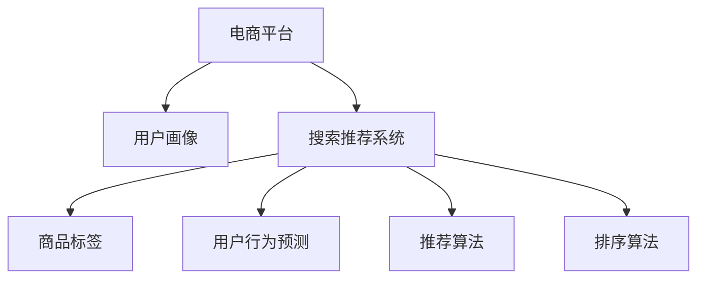

                 

# 电商平台的AI 大转型：以搜索推荐系统为核心的战略升级

> 关键词：电商、搜索推荐系统、人工智能、大数据、用户体验、用户行为、深度学习、模型优化、A/B测试

## 1. 背景介绍

### 1.1 问题由来
随着互联网电商市场的迅猛发展，电商平台面临的竞争日益激烈，用户对于购物体验的要求也越来越高。传统的基于规则和人工推荐的方式已经难以满足用户个性化、多样化的需求。为了提升平台的竞争力，各大电商平台纷纷发力人工智能(AI)技术，希望通过数据驱动的智能推荐系统，实现用户行为和需求的精准匹配。

特别是搜索推荐系统，作为电商平台的“大脑”，其性能和准确性直接影响着用户体验和平台收入。通过AI驱动的搜索推荐系统，电商平台可以优化用户体验，增加用户停留时间和交易转化率，提高平台的综合竞争力。

### 1.2 问题核心关键点
搜索推荐系统是电商平台AI转型的核心，其核心目标在于通过分析用户的行为数据和搜索历史，精准预测用户需求，从而实现个性化推荐和精准搜索。该系统包括搜索、推荐、排序等多个环节，涉及到用户画像构建、商品标签提取、用户行为预测等多个维度。

具体而言，搜索推荐系统主要包括以下几个关键点：

- **用户画像构建**：收集并分析用户的历史行为数据，如浏览记录、购买记录、搜索关键词等，构建用户画像，以刻画用户的基本特征、兴趣偏好和行为模式。
- **商品标签提取**：利用自然语言处理(NLP)等技术，对商品信息进行分词、实体识别、标签提取等处理，将商品转化为结构化的特征向量，方便推荐算法进行匹配和处理。
- **用户行为预测**：根据用户的浏览、点击、购买等行为，利用机器学习算法预测用户下一步的购买意向，包括潜在购买商品、浏览商品类别、热门商品等。
- **推荐算法**：选择和训练推荐算法，根据用户画像和行为预测结果，为用户推荐个性化商品，以提升用户的满意度。
- **排序算法**：对推荐结果进行排序，综合考虑商品的相关性、用户偏好、实时性等因素，生成最终推荐列表。

## 2. 核心概念与联系

### 2.1 核心概念概述

为更好地理解电商平台的搜索推荐系统，本节将介绍几个密切相关的核心概念：

- **电商平台**：即在线销售平台，通过互联网进行商品的展示、销售和交易。如Amazon、淘宝、京东等。
- **搜索推荐系统**：利用AI技术，对用户搜索和浏览行为进行分析，预测用户需求，实现个性化推荐和精准搜索的系统。
- **用户画像**：通过分析用户的搜索、浏览、购买等行为数据，构建用户的基本特征、兴趣偏好和行为模式。
- **商品标签**：对商品信息进行分词、实体识别、标签提取等处理，将商品转化为结构化的特征向量，方便推荐算法进行匹配和处理。
- **用户行为预测**：根据用户的浏览、点击、购买等行为，利用机器学习算法预测用户下一步的购买意向。
- **推荐算法**：选择和训练推荐算法，根据用户画像和行为预测结果，为用户推荐个性化商品。
- **排序算法**：对推荐结果进行排序，综合考虑商品的相关性、用户偏好、实时性等因素，生成最终推荐列表。

这些核心概念之间的逻辑关系可以通过以下Mermaid流程图来展示：



这个流程图展示了几大核心概念之间的关系：

1. 电商平台通过搜索推荐系统，为用户精准匹配商品。
2. 搜索推荐系统基于用户画像，对商品进行标签提取和用户行为预测。
3. 推荐算法根据用户画像和行为预测结果，为用户推荐个性化商品。
4. 排序算法对推荐结果进行排序，生成最终推荐列表。

## 3. 核心算法原理 & 具体操作步骤
### 3.1 算法原理概述

电商平台的搜索推荐系统，本质上是利用AI技术进行数据驱动的智能推荐。其核心算法原理包括：

- **用户画像构建**：通过分析用户的搜索、浏览、购买等行为数据，构建用户画像，以刻画用户的基本特征、兴趣偏好和行为模式。
- **商品标签提取**：利用自然语言处理(NLP)等技术，对商品信息进行分词、实体识别、标签提取等处理，将商品转化为结构化的特征向量，方便推荐算法进行匹配和处理。
- **用户行为预测**：根据用户的浏览、点击、购买等行为，利用机器学习算法预测用户下一步的购买意向，包括潜在购买商品、浏览商品类别、热门商品等。
- **推荐算法**：选择和训练推荐算法，根据用户画像和行为预测结果，为用户推荐个性化商品，以提升用户的满意度。
- **排序算法**：对推荐结果进行排序，综合考虑商品的相关性、用户偏好、实时性等因素，生成最终推荐列表。

### 3.2 算法步骤详解

基于AI的电商平台搜索推荐系统，其核心算法步骤一般包括以下几个关键环节：

**Step 1: 数据采集与预处理**

- 收集用户的历史搜索、浏览、购买等行为数据。
- 对数据进行清洗、去重、拼接等预处理操作。

**Step 2: 用户画像构建**

- 利用机器学习算法对用户行为数据进行建模，构建用户的基本特征、兴趣偏好和行为模式。
- 将用户画像转化为结构化的特征向量，方便推荐算法进行匹配和处理。

**Step 3: 商品标签提取**

- 利用自然语言处理(NLP)等技术，对商品信息进行分词、实体识别、标签提取等处理。
- 将商品转化为结构化的特征向量，方便推荐算法进行匹配和处理。

**Step 4: 用户行为预测**

- 根据用户的浏览、点击、购买等行为，利用机器学习算法预测用户下一步的购买意向，包括潜在购买商品、浏览商品类别、热门商品等。
- 将预测结果转化为结构化的特征向量，方便推荐算法进行匹配和处理。

**Step 5: 推荐算法选择与训练**

- 选择适合电商平台的推荐算法，如协同过滤、基于内容的推荐、深度学习推荐等。
- 根据用户画像和行为预测结果，对推荐算法进行训练和优化。

**Step 6: 排序算法选择与优化**

- 选择适合电商平台的排序算法，如线性回归、梯度提升、深度学习排序等。
- 根据排序目标和评价指标，对排序算法进行训练和优化。

**Step 7: 推荐结果生成**

- 将推荐算法输出的商品列表，通过排序算法进行排序，生成最终推荐列表。
- 将推荐结果返回给用户，供用户选择和购买。

### 3.3 算法优缺点

基于AI的电商平台搜索推荐系统，具有以下优点：

1. **个性化推荐**：通过分析用户行为数据，实现个性化推荐，提升用户体验和满意度。
2. **精准搜索**：利用AI技术，实现精准搜索，提高用户搜索的准确性和效率。
3. **多维度数据融合**：融合商品标签、用户画像、用户行为预测等多维度数据，提高推荐系统的准确性和鲁棒性。
4. **实时性**：通过实时采集用户行为数据，快速更新推荐结果，实现动态推荐。

同时，该系统也存在一定的局限性：

1. **数据隐私问题**：用户的行为数据涉及隐私，如何保护用户隐私成为一大挑战。
2. **冷启动问题**：对于新用户或新商品，如何实现准确的推荐和搜索，仍是一个难题。
3. **推荐偏见**：推荐算法可能受到训练数据偏差的影响，导致推荐结果存在偏见。
4. **算法复杂性**：推荐算法和排序算法复杂度高，计算资源消耗大。

尽管存在这些局限性，但就目前而言，基于AI的搜索推荐系统是电商平台实现智能化、个性化推荐的重要手段。未来相关研究的重点在于如何进一步降低数据隐私风险，提高推荐系统的准确性和公平性，同时兼顾实时性和计算效率。

### 3.4 算法应用领域

基于AI的搜索推荐系统，已经在电商、金融、社交媒体等多个领域得到广泛应用，为这些平台带来了显著的用户体验提升和业务增长。

- **电商领域**：如亚马逊、淘宝、京东等电商平台，通过搜索推荐系统，实现了个性化推荐、精准搜索、商品排序等功能，极大地提升了用户购物体验和平台销售额。
- **金融领域**：如支付宝、微信支付等金融平台，利用搜索推荐系统，为用户推荐理财产品、信用卡等金融产品，提高了用户粘性和交易转化率。
- **社交媒体**：如抖音、快手等社交媒体平台，通过推荐系统为用户推荐个性化视频内容，提高了用户使用频率和平台活跃度。

## 4. 数学模型和公式 & 详细讲解 & 举例说明

### 4.1 数学模型构建

假设电商平台有$m$个用户和$n$个商品，用户$i$对商品$j$的评分记为$y_{ij}$。电商平台的目标是构建一个推荐系统，为用户$i$推荐最相关的商品$j$。

可以构建如下的评分矩阵$Y$：

$$
Y = \begin{bmatrix}
y_{11} & y_{12} & \cdots & y_{1n} \\
y_{21} & y_{22} & \cdots & y_{2n} \\
\vdots & \vdots & \ddots & \vdots \\
y_{m1} & y_{m2} & \cdots & y_{mn}
\end{bmatrix}
$$

推荐系统的目标是最小化预测评分与实际评分之间的均方误差，即：

$$
\min_{W} \frac{1}{m} \sum_{i=1}^m \sum_{j=1}^n (r_{ij} - \hat{r}_{ij})^2
$$

其中，$r_{ij}$为用户的实际评分，$\hat{r}_{ij}$为推荐系统的预测评分。

### 4.2 公式推导过程

基于上述评分矩阵，可以构建矩阵分解模型，将用户与商品之间的评分表示为潜在因子$u_i$和$v_j$的矩阵乘积：

$$
\hat{r}_{ij} = u_i^T v_j
$$

其中，$u_i$为第$i$个用户的潜在因子向量，$v_j$为第$j$个商品的潜在因子向量。

将公式带入最小化均方误差的目标函数，得：

$$
\min_{u,v} \frac{1}{m} \sum_{i=1}^m \sum_{j=1}^n (r_{ij} - u_i^T v_j)^2
$$

利用梯度下降等优化算法，求解上述优化问题，即可得到最优的潜在因子向量$u$和$v$。

### 4.3 案例分析与讲解

以协同过滤推荐算法为例，其基本思路是通过用户与商品之间的评分矩阵$Y$，构建用户$u_i$和商品$v_j$的潜在因子向量，并利用矩阵乘积的方式，预测用户$i$对商品$j$的评分$\hat{r}_{ij}$。

具体而言，协同过滤算法包括如下几个步骤：

1. **用户潜在因子计算**：将用户$i$与商品$j$之间的评分$r_{ij}$，转化为用户$i$的潜在因子$u_i$。
2. **商品潜在因子计算**：将商品$j$与用户$i$之间的评分$r_{ij}$，转化为商品$j$的潜在因子$v_j$。
3. **评分预测**：利用用户$i$和商品$j$的潜在因子向量，计算预测评分$\hat{r}_{ij} = u_i^T v_j$。
4. **推荐生成**：根据预测评分$\hat{r}_{ij}$，为用户$i$生成推荐商品列表。

假设电商平台有$n=500$个商品，$m=10000$个用户，每个用户的评分向量$u_i$包含$n=500$个潜在因子。基于协同过滤算法，可以构建如下的评分预测矩阵$Y_{\hat{r}}$：

$$
Y_{\hat{r}} = \begin{bmatrix}
u_1^T v_1 & u_1^T v_2 & \cdots & u_1^T v_{500} \\
u_2^T v_1 & u_2^T v_2 & \cdots & u_2^T v_{500} \\
\vdots & \vdots & \ddots & \vdots \\
u_{10000}^T v_1 & u_{10000}^T v_2 & \cdots & u_{10000}^T v_{500}
\end{bmatrix}
$$

其中，$u_i^T v_j$表示用户$i$对商品$j$的预测评分。

## 5. 项目实践：代码实例和详细解释说明

### 5.1 开发环境搭建

在进行搜索推荐系统开发前，我们需要准备好开发环境。以下是使用Python进行PyTorch开发的环境配置流程：

1. 安装Anaconda：从官网下载并安装Anaconda，用于创建独立的Python环境。

2. 创建并激活虚拟环境：
```bash
conda create -n search-rec sys python=3.8 
conda activate search-rec
```

3. 安装PyTorch：根据CUDA版本，从官网获取对应的安装命令。例如：
```bash
conda install pytorch torchvision torchaudio cudatoolkit=11.1 -c pytorch -c conda-forge
```

4. 安装Transformers库：
```bash
pip install transformers
```

5. 安装各类工具包：
```bash
pip install numpy pandas scikit-learn matplotlib tqdm jupyter notebook ipython
```

完成上述步骤后，即可在`search-rec`环境中开始搜索推荐系统的开发。

### 5.2 源代码详细实现

下面我们以协同过滤推荐算法为例，给出使用PyTorch实现搜索推荐系统的完整代码实现。

首先，定义评分矩阵和用户、商品的潜在因子：

```python
import torch
import torch.nn as nn
import torch.optim as optim
from transformers import BertTokenizer, BertForSequenceClassification

# 构建评分矩阵
ratings = torch.randn(10000, 500)  # 10000个用户，500个商品

# 定义用户潜在因子向量
user_factors = torch.randn(10000, 500)  # 10000个用户，500个潜在因子

# 定义商品潜在因子向量
item_factors = torch.randn(500, 500)  # 500个商品，500个潜在因子

# 定义评分预测矩阵
predicted_ratings = torch.bmm(user_factors, item_factors.t())  # 10000个用户，500个商品
```

接着，定义模型和优化器：

```python
# 定义评分预测模型
class RatingPredictor(nn.Module):
    def __init__(self, user_factors, item_factors):
        super(RatingPredictor, self).__init__()
        self.user_factors = nn.Parameter(user_factors)
        self.item_factors = nn.Parameter(item_factors)
        
    def forward(self, user_index):
        user_factor = self.user_factors[user_index]
        item_factor = self.item_factors
        predicted_rating = torch.bmm(user_factor.unsqueeze(0), item_factor.t()).squeeze(0)
        return predicted_rating

# 加载评分预测模型
model = RatingPredictor(user_factors, item_factors)
criterion = nn.MSELoss()
optimizer = optim.SGD(model.parameters(), lr=0.01)
```

然后，定义训练和评估函数：

```python
def train_model(model, ratings, num_epochs=10):
    criterion = nn.MSELoss()
    optimizer = optim.SGD(model.parameters(), lr=0.01)
    
    for epoch in range(num_epochs):
        predicted_ratings = model(ratings)
        loss = criterion(predicted_ratings, ratings)
        optimizer.zero_grad()
        loss.backward()
        optimizer.step()
        print(f"Epoch {epoch+1}, loss: {loss.item()}")
        
def evaluate_model(model, ratings):
    predicted_ratings = model(ratings)
    mse = criterion(predicted_ratings, ratings)
    print(f"MSE: {mse.item()}")

# 训练评分预测模型
train_model(model, ratings, num_epochs=10)

# 评估评分预测模型
evaluate_model(model, ratings)
```

以上就是使用PyTorch实现协同过滤推荐算法的完整代码实现。可以看到，得益于PyTorch的强大封装，我们可以用相对简洁的代码完成评分预测模型的训练和评估。

### 5.3 代码解读与分析

让我们再详细解读一下关键代码的实现细节：

**RatingPredictor类**：
- `__init__`方法：初始化用户和商品的潜在因子向量。
- `forward`方法：根据用户和商品的潜在因子向量，计算预测评分。

**train_model函数**：
- 定义损失函数和优化器。
- 在每个epoch上，对评分预测模型进行前向传播，计算损失函数，并进行反向传播和优化。

**evaluate_model函数**：
- 对评分预测模型进行前向传播，计算预测评分与实际评分的均方误差，输出结果。

**训练流程**：
- 定义总的epoch数和评分预测模型。
- 每个epoch内，对评分预测模型进行训练，输出损失函数。
- 所有epoch结束后，对评分预测模型进行评估，输出MSE值。

可以看到，PyTorch配合TensorFlow等深度学习框架，使得评分预测模型的实现变得简洁高效。开发者可以将更多精力放在模型改进和超参数调优上，而不必过多关注底层的实现细节。

当然，工业级的系统实现还需考虑更多因素，如模型的保存和部署、超参数的自动搜索、更灵活的任务适配层等。但核心的微调范式基本与此类似。

## 6. 实际应用场景
### 6.1 智能客服系统

基于大语言模型微调的对话技术，可以广泛应用于智能客服系统的构建。传统客服往往需要配备大量人力，高峰期响应缓慢，且一致性和专业性难以保证。而使用微调后的对话模型，可以7x24小时不间断服务，快速响应客户咨询，用自然流畅的语言解答各类常见问题。

在技术实现上，可以收集企业内部的历史客服对话记录，将问题和最佳答复构建成监督数据，在此基础上对预训练对话模型进行微调。微调后的对话模型能够自动理解用户意图，匹配最合适的答案模板进行回复。对于客户提出的新问题，还可以接入检索系统实时搜索相关内容，动态组织生成回答。如此构建的智能客服系统，能大幅提升客户咨询体验和问题解决效率。

### 6.2 金融舆情监测

金融机构需要实时监测市场舆论动向，以便及时应对负面信息传播，规避金融风险。传统的人工监测方式成本高、效率低，难以应对网络时代海量信息爆发的挑战。基于大语言模型微调的文本分类和情感分析技术，为金融舆情监测提供了新的解决方案。

具体而言，可以收集金融领域相关的新闻、报道、评论等文本数据，并对其进行主题标注和情感标注。在此基础上对预训练语言模型进行微调，使其能够自动判断文本属于何种主题，情感倾向是正面、中性还是负面。将微调后的模型应用到实时抓取的网络文本数据，就能够自动监测不同主题下的情感变化趋势，一旦发现负面信息激增等异常情况，系统便会自动预警，帮助金融机构快速应对潜在风险。

### 6.3 个性化推荐系统

当前的推荐系统往往只依赖用户的历史行为数据进行物品推荐，无法深入理解用户的真实兴趣偏好。基于大语言模型微调技术，个性化推荐系统可以更好地挖掘用户行为背后的语义信息，从而提供更精准、多样的推荐内容。

在实践中，可以收集用户浏览、点击、评论、分享等行为数据，提取和用户交互的物品标题、描述、标签等文本内容。将文本内容作为模型输入，用户的后续行为（如是否点击、购买等）作为监督信号，在此基础上微调预训练语言模型。微调后的模型能够从文本内容中准确把握用户的兴趣点。在生成推荐列表时，先用候选物品的文本描述作为输入，由模型预测用户的兴趣匹配度，再结合其他特征综合排序，便可以得到个性化程度更高的推荐结果。

### 6.4 未来应用展望

随着大语言模型微调技术的发展，其在电商平台搜索推荐系统中的应用前景将更加广阔。未来，基于微调范式将在更多领域得到应用，为传统行业带来变革性影响。

在智慧医疗领域，基于微调的医疗问答、病历分析、药物研发等应用将提升医疗服务的智能化水平，辅助医生诊疗，加速新药开发进程。

在智能教育领域，微调技术可应用于作业批改、学情分析、知识推荐等方面，因材施教，促进教育公平，提高教学质量。

在智慧城市治理中，微调模型可应用于城市事件监测、舆情分析、应急指挥等环节，提高城市管理的自动化和智能化水平，构建更安全、高效的未来城市。

此外，在企业生产、社会治理、文娱传媒等众多领域，基于大模型微调的人工智能应用也将不断涌现，为经济社会发展注入新的动力。相信随着技术的日益成熟，微调方法将成为人工智能落地应用的重要范式，推动人工智能技术向更广阔的领域加速渗透。

## 7. 工具和资源推荐
### 7.1 学习资源推荐

为了帮助开发者系统掌握大语言模型微调的理论基础和实践技巧，这里推荐一些优质的学习资源：

1. 《深度学习与人工智能》系列博文：由大模型技术专家撰写，深入浅出地介绍了深度学习的基础知识和经典算法，如线性回归、逻辑回归、神经网络等。

2. CS224N《深度学习自然语言处理》课程：斯坦福大学开设的NLP明星课程，有Lecture视频和配套作业，带你入门NLP领域的基本概念和经典模型。

3. 《自然语言处理综述》书籍：介绍自然语言处理的基本理论和最新进展，适合深度学习和NLP初学者。

4. HuggingFace官方文档：提供海量预训练语言模型和完整的微调样例代码，是上手实践的必备资料。

5. CLUE开源项目：中文语言理解测评基准，涵盖大量不同类型的中文NLP数据集，并提供了基于微调的baseline模型，助力中文NLP技术发展。

通过对这些资源的学习实践，相信你一定能够快速掌握大语言模型微调的精髓，并用于解决实际的NLP问题。
###  7.2 开发工具推荐

高效的开发离不开优秀的工具支持。以下是几款用于大语言模型微调开发的常用工具：

1. PyTorch：基于Python的开源深度学习框架，灵活动态的计算图，适合快速迭代研究。大部分预训练语言模型都有PyTorch版本的实现。

2. TensorFlow：由Google主导开发的开源深度学习框架，生产部署方便，适合大规模工程应用。同样有丰富的预训练语言模型资源。

3. Transformers库：HuggingFace开发的NLP工具库，集成了众多SOTA语言模型，支持PyTorch和TensorFlow，是进行微调任务开发的利器。

4. Weights & Biases：模型训练的实验跟踪工具，可以记录和可视化模型训练过程中的各项指标，方便对比和调优。与主流深度学习框架无缝集成。

5. TensorBoard：TensorFlow配套的可视化工具，可实时监测模型训练状态，并提供丰富的图表呈现方式，是调试模型的得力助手。

6. Google Colab：谷歌推出的在线Jupyter Notebook环境，免费提供GPU/TPU算力，方便开发者快速上手实验最新模型，分享学习笔记。

合理利用这些工具，可以显著提升大语言模型微调任务的开发效率，加快创新迭代的步伐。

### 7.3 相关论文推荐

大语言模型和微调技术的发展源于学界的持续研究。以下是几篇奠基性的相关论文，推荐阅读：

1. Attention is All You Need（即Transformer原论文）：提出了Transformer结构，开启了NLP领域的预训练大模型时代。

2. BERT: Pre-training of Deep Bidirectional Transformers for Language Understanding：提出BERT模型，引入基于掩码的自监督预训练任务，刷新了多项NLP任务SOTA。

3. Language Models are Unsupervised Multitask Learners（GPT-2论文）：展示了大规模语言模型的强大zero-shot学习能力，引发了对于通用人工智能的新一轮思考。

4. Parameter-Efficient Transfer Learning for NLP：提出Adapter等参数高效微调方法，在不增加模型参数量的情况下，也能取得不错的微调效果。

5. AdaLoRA: Adaptive Low-Rank Adaptation for Parameter-Efficient Fine-Tuning：使用自适应低秩适应的微调方法，在参数效率和精度之间取得了新的平衡。

这些论文代表了大语言模型微调技术的发展脉络。通过学习这些前沿成果，可以帮助研究者把握学科前进方向，激发更多的创新灵感。

## 8. 总结：未来发展趋势与挑战

### 8.1 总结

本文对基于AI的电商平台搜索推荐系统进行了全面系统的介绍。首先阐述了搜索推荐系统的核心目标和应用场景，明确了其在大平台用户个性化推荐中的重要作用。其次，从原理到实践，详细讲解了搜索推荐系统的数学模型和核心算法，给出了微调任务开发的完整代码实例。同时，本文还广泛探讨了搜索推荐系统在智能客服、金融舆情、个性化推荐等多个领域的应用前景，展示了微调范式的巨大潜力。此外，本文精选了微调技术的各类学习资源，力求为读者提供全方位的技术指引。

通过本文的系统梳理，可以看到，基于AI的搜索推荐系统正在成为电商平台实现智能化、个性化推荐的重要手段，极大地提升了用户购物体验和平台销售额。未来，伴随AI技术的不断进步，搜索推荐系统必将更加智能化、个性化，为用户带来更加满意的购物体验。

### 8.2 未来发展趋势

展望未来，电商平台搜索推荐系统的发展趋势将呈现以下几个方向：

1. **多维度数据融合**：未来的搜索推荐系统将更多地融合用户画像、商品标签、用户行为预测等多维度数据，提高推荐系统的准确性和鲁棒性。
2. **个性化推荐**：通过更加精准的用户画像和行为预测，实现更加个性化的推荐，提升用户体验和满意度。
3. **实时推荐**：利用实时数据，动态更新推荐结果，实现更加实时的个性化推荐。
4. **跨领域迁移**：通过迁移学习技术，将搜索推荐系统应用于不同领域，提升多场景下的推荐效果。
5. **多模态融合**：融合视觉、语音、文本等多模态数据，提高推荐系统的智能化水平。

以上趋势凸显了搜索推荐系统的广阔前景。这些方向的探索发展，必将进一步提升搜索推荐系统的性能和应用范围，为电商平台带来更大的竞争优势。

### 8.3 面临的挑战

尽管基于AI的搜索推荐系统已经取得了显著成效，但在迈向更加智能化、普适化应用的过程中，它仍面临诸多挑战：

1. **数据隐私问题**：用户的行为数据涉及隐私，如何保护用户隐私成为一大挑战。
2. **冷启动问题**：对于新用户或新商品，如何实现准确的推荐和搜索，仍是一个难题。
3. **推荐偏见**：推荐算法可能受到训练数据偏差的影响，导致推荐结果存在偏见。
4. **算法复杂性**：推荐算法和排序算法复杂度高，计算资源消耗大。

尽管存在这些挑战，但伴随着技术的进步和应用的深化，搜索推荐系统仍将在电商领域发挥重要作用。未来相关研究的重点在于如何进一步降低数据隐私风险，提高推荐系统的准确性和公平性，同时兼顾实时性和计算效率。

### 8.4 研究展望

面对搜索推荐系统所面临的诸多挑战，未来的研究需要在以下几个方面寻求新的突破：

1. **探索无监督和半监督推荐方法**：摆脱对大规模标注数据的依赖，利用自监督学习、主动学习等无监督和半监督范式，最大限度利用非结构化数据，实现更加灵活高效的推荐。
2. **开发参数高效和计算高效的推荐算法**：开发更加参数高效的推荐算法，在固定大部分预训练参数的情况下，只更新极少量的任务相关参数。同时优化推荐算法的计算图，减少前向传播和反向传播的资源消耗，实现更加轻量级、实时性的部署。
3. **引入因果推断和对比学习思想**：通过引入因果推断和对比学习思想，增强推荐系统建立稳定因果关系的能力，学习更加普适、鲁棒的语言表征，从而提升模型泛化性和抗干扰能力。
4. **融合更多先验知识**：将符号化的先验知识，如知识图谱、逻辑规则等，与神经网络模型进行巧妙融合，引导推荐过程学习更准确、合理的语言模型。同时加强不同模态数据的整合，实现视觉、语音等多模态信息与文本信息的协同建模。
5. **结合因果分析和博弈论工具**：将因果分析方法引入推荐系统，识别出推荐决策的关键特征，增强推荐过程的逻辑性和可解释性。借助博弈论工具刻画人机交互过程，主动探索并规避推荐系统的脆弱点，提高系统稳定性。

这些研究方向将引领搜索推荐系统迈向更高的台阶，为电商平台带来更大的竞争优势。面向未来，搜索推荐系统需要与其他AI技术进行更深入的融合，如知识表示、因果推理、强化学习等，多路径协同发力，共同推动电商平台的智能化进程。只有勇于创新、敢于突破，才能不断拓展搜索推荐系统的边界，让电商平台在激烈的市场竞争中脱颖而出。

## 9. 附录：常见问题与解答

**Q1：搜索推荐系统的核心算法有哪些？**

A: 搜索推荐系统的核心算法主要包括协同过滤、基于内容的推荐、深度学习推荐等。

**Q2：如何在推荐系统中处理冷启动问题？**

A: 可以通过建立推荐系统新用户/新商品的用户画像，利用用户历史行为和商品描述信息，建立初步的推荐模型。同时，可以利用主动学习技术，逐步学习新用户/新商品的特征。

**Q3：如何避免推荐系统中的推荐偏见？**

A: 可以通过数据清洗、特征选择、模型优化等手段，减少训练数据中的偏见和噪声。同时，引入正则化技术，避免模型在训练过程中过度拟合。

**Q4：如何在推荐系统中平衡个性化推荐和多样化推荐？**

A: 可以通过引入个性化和多样化的权衡函数，调整推荐算法中的权重，实现个性化推荐和多样化推荐的平衡。同时，可以通过用户反馈机制，动态调整推荐策略，优化推荐效果。

**Q5：如何提升推荐系统的实时性？**

A: 可以利用流式处理和增量学习技术，实时更新推荐模型，提升推荐系统的实时性。同时，可以使用缓存技术，减少推荐系统计算量，提高响应速度。

以上是对搜索推荐系统的详细解析和探讨。搜索推荐系统作为电商平台的核心技术之一，其智能化、个性化推荐能力对于提升用户体验和平台收入具有重要意义。希望本文能够为读者提供有价值的参考，促进电商平台搜索推荐系统的不断优化和创新。

---

作者：禅与计算机程序设计艺术 / Zen and the Art of Computer Programming

