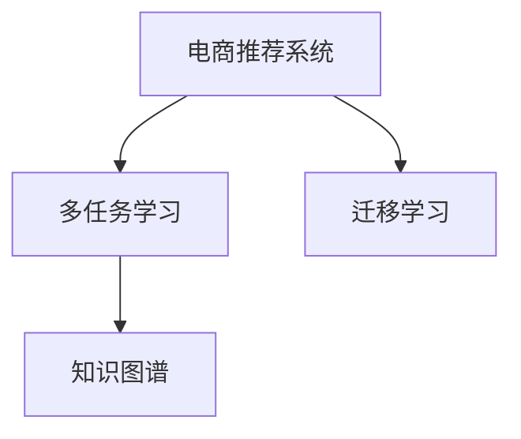

                 

# 电商推荐系统中的多任务学习与迁移学习

## 1. 背景介绍

电商推荐系统在数字经济时代扮演着至关重要的角色，能够显著提升用户体验和平台收入。然而，由于用户行为和商品属性的多样性和复杂性，传统的推荐算法在实际应用中往往难以取得满意的推荐效果。近年来，基于多任务学习和迁移学习的推荐方法逐渐引起了学术界和工业界的广泛关注。本文旨在深入探讨多任务学习和迁移学习在电商推荐系统中的应用，通过系统的理论分析和实践案例，为电商推荐系统的开发和优化提供指导。

## 2. 核心概念与联系

### 2.1 核心概念概述

为了更好地理解多任务学习和迁移学习在电商推荐系统中的应用，我们需要先明确几个核心概念及其之间的联系：

- **电商推荐系统**：使用数据分析和机器学习技术，根据用户历史行为和商品属性特征，为用户推荐最相关和最具吸引力的商品的系统。
- **多任务学习**：在同一数据集上，同时训练多个相关的学习任务，通过共享模型参数或特征表示，提高模型性能和泛化能力。
- **迁移学习**：将一个任务学到的知识迁移到另一个相关任务上，通过少量的新数据，加速模型在新任务的训练过程。
- **知识图谱**：描述实体和实体间关系的图形结构，广泛应用于电商推荐系统中的商品属性抽取和关系推理。

这些概念之间的关系可以通过以下Mermaid流程图来展示：



该流程图展示了大语言模型的核心概念及其之间的关系：

1. **电商推荐系统**是知识图谱和多任务学习的主要应用场景，可以基于用户的浏览和购买行为，通过多任务学习对用户偏好和商品属性进行建模。
2. **多任务学习**可以同时训练多个相关任务，如用户画像建模、商品属性预测等，通过共享模型参数或特征表示，提升模型性能和泛化能力。
3. **迁移学习**可以将在电商推荐系统中的一个任务学到的知识迁移到另一个任务上，如通过用户画像预测商品评分，加速模型的训练过程。
4. **知识图谱**在电商推荐系统中的应用，主要体现在商品属性抽取和关系推理中，有助于更好地理解商品之间的关系和用户的兴趣点。

### 2.2 核心概念原理和架构

#### 2.2.1 电商推荐系统原理

电商推荐系统的核心在于根据用户的历史行为和当前状态，预测用户对商品的兴趣和购买意愿，为用户推荐最相关和最具吸引力的商品。传统的推荐方法包括基于协同过滤、基于内容的推荐、基于矩阵分解等方法。近年来，基于深度学习的方法，如神经协同过滤、神经网络矩阵分解等，在电商推荐系统中取得了显著的效果。

#### 2.2.2 多任务学习原理

多任务学习旨在同时训练多个相关任务，通过共享模型参数或特征表示，提高模型性能和泛化能力。其主要思想是通过构建多个相关任务，使得模型能够同时学习多个相关特征，从而提高模型的整体表现。

#### 2.2.3 迁移学习原理

迁移学习通过将一个任务学到的知识迁移到另一个相关任务上，加速模型在新任务的训练过程。其主要思想是利用一个或多个已有的、在不同任务上训练的模型，通过微调或迁移学习的方式，在新的任务上继续优化，从而取得更好的性能。

## 3. 核心算法原理 & 具体操作步骤

### 3.1 算法原理概述

电商推荐系统中的多任务学习和迁移学习，本质上是一个有监督的迁移学习过程。其核心思想是：将电商推荐系统中的多个相关任务看作一个整体，通过共享模型参数或特征表示，提升模型性能和泛化能力。在具体实现中，通常将电商推荐系统分为用户画像建模、商品属性预测、推荐评分预测等任务，通过多任务学习或迁移学习的方式进行联合训练。

### 3.2 算法步骤详解

电商推荐系统中的多任务学习和迁移学习通常包括以下几个关键步骤：

**Step 1: 准备数据集**
- 收集电商平台的商品数据、用户行为数据等，构建电商推荐系统所需的数据集。数据集应包括用户的浏览记录、购买记录、商品的属性信息等。

**Step 2: 构建多任务模型**
- 设计适合电商推荐系统的多任务模型，可以基于共享参数的神经网络模型，如MAML、MTN等。
- 设置多任务模型中的各个任务，如用户画像建模、商品属性预测、推荐评分预测等。
- 确定各任务之间的共享参数和独立参数，如共享特征表示、独立任务输出等。

**Step 3: 设计损失函数**
- 设计多任务学习的损失函数，如多任务对数损失、联合损失等，用于衡量模型在各个任务上的表现。
- 设计迁移学习的损失函数，如源任务到目标任务的迁移损失，用于衡量模型在新任务上的泛化能力。

**Step 4: 优化模型参数**
- 使用梯度下降等优化算法，最小化多任务或迁移学习的损失函数。
- 设置合适的学习率、批次大小、迭代轮数等超参数。
- 引入正则化技术，如L2正则、Dropout等，防止模型过拟合。

**Step 5: 评估和测试**
- 在验证集和测试集上评估模型性能，如准确率、召回率、F1-score等。
- 根据评估结果调整模型参数和超参数，进一步优化模型性能。

**Step 6: 部署和监控**
- 将优化后的模型部署到电商推荐系统中，实时处理用户请求，进行推荐决策。
- 监控模型性能，定期更新模型参数，保持模型的实时性和有效性。

以上是电商推荐系统中的多任务学习和迁移学习的一般流程。在实际应用中，还需要针对具体任务的特点，对各步骤进行优化设计，如改进损失函数，引入更多的正则化技术，搜索最优的超参数组合等，以进一步提升模型性能。

### 3.3 算法优缺点

电商推荐系统中的多任务学习和迁移学习方法具有以下优点：
1. 提升模型泛化能力。多任务学习和迁移学习通过共享模型参数或特征表示，提高了模型对新任务的泛化能力。
2. 提高模型性能。多任务学习和迁移学习能够同时训练多个相关任务，提升了模型的整体性能。
3. 降低数据需求。多任务学习和迁移学习能够利用已有的数据进行联合训练，减少了对新标注数据的需求。

同时，该方法也存在一定的局限性：
1. 模型复杂度较高。多任务学习和迁移学习通常需要构建和优化多任务模型，模型复杂度较高，训练成本较高。
2. 任务间耦合性强。多任务学习和迁移学习中的各个任务之间具有较强的耦合性，一个任务的表现可能会影响其他任务。
3. 数据不均衡问题。电商推荐系统中的用户行为数据和商品属性数据往往不均衡，可能影响模型的训练效果。

尽管存在这些局限性，但就目前而言，多任务学习和迁移学习仍是大规模电商推荐系统的重要选择。未来相关研究的重点在于如何进一步降低模型复杂度，提高模型对新数据的泛化能力，同时兼顾模型的实时性和稳定性等因素。

### 3.4 算法应用领域

电商推荐系统中的多任务学习和迁移学习已经广泛应用于多个领域，如：

- 商品属性预测：利用用户行为数据和商品属性数据，预测商品的属性信息，如价格、评分等。
- 用户画像建模：通过用户的浏览记录、购买记录等数据，构建用户的兴趣和行为画像，提升推荐效果。
- 推荐评分预测：根据用户的历史行为数据和商品属性信息，预测用户对商品的评分和购买意愿。
- 个性化推荐：利用多任务学习和迁移学习的知识，实现更加个性化和精准的推荐，提升用户体验和平台收入。

除了上述这些经典任务外，多任务学习和迁移学习还将在电商推荐系统的更多场景中得到应用，如营销活动优化、商品搭配推荐、库存管理等，为电商推荐系统带来全新的突破。

## 4. 数学模型和公式 & 详细讲解 & 举例说明

### 4.1 数学模型构建

在电商推荐系统中，多任务学习和迁移学习可以通过共享参数的神经网络模型来实现。这里以基于共享特征表示的多任务学习为例，来构建数学模型。

设电商推荐系统中的用户画像建模任务为$T_1$，商品属性预测任务为$T_2$，推荐评分预测任务为$T_3$。假设有$M$个样本，$K$个特征，模型参数为$\theta$，则多任务学习模型的目标函数可以表示为：

$$
\mathcal{L}(\theta) = \frac{1}{M} \sum_{i=1}^M \sum_{j=1}^3 \ell_j(f_j(\mathbf{x}_i;\theta))
$$

其中，$\ell_j$为任务$j$的损失函数，$f_j$为任务$j$的预测函数，$\mathbf{x}_i$为样本$i$的特征向量。

### 4.2 公式推导过程

对于每个任务$j$，可以使用多任务对数损失函数$\ell_j$，表示为：

$$
\ell_j(f_j(\mathbf{x}_i;\theta)) = -\log P_j(f_j(\mathbf{x}_i;\theta))
$$

其中，$P_j$为任务$j$的概率分布函数。

对于整个多任务学习模型，可以引入联合损失函数$\mathcal{L}_{joint}$，表示为：

$$
\mathcal{L}_{joint}(\theta) = -\frac{1}{M} \sum_{i=1}^M \sum_{j=1}^3 \log P_j(f_j(\mathbf{x}_i;\theta))
$$

利用多任务对数损失函数和联合损失函数，可以构建多任务学习的优化目标函数。通过最小化该目标函数，可以同时优化多个相关任务，提高模型性能和泛化能力。

### 4.3 案例分析与讲解

以电商推荐系统中的推荐评分预测任务为例，我们可以用多任务学习的方式对其进行建模。设推荐评分预测任务为$T_3$，任务$T_1$和$T_2$分别为用户画像建模和商品属性预测任务。假设$T_1$和$T_2$共享特征表示，$T_3$独立预测推荐评分。

设用户$i$对商品$j$的评分$y_{ij}$，用户$i$的历史行为数据为$\mathbf{x}_i$，商品$j$的属性信息为$\mathbf{f}_j$。则$T_3$的任务函数可以表示为：

$$
f_{T_3}(\mathbf{x}_i,\mathbf{f}_j;\theta) = \theta^T[\mathbf{x}_i,\mathbf{f}_j] \cdot \phi(\mathbf{x}_i,\mathbf{f}_j)
$$

其中，$\phi(\mathbf{x}_i,\mathbf{f}_j)$为特征映射函数。

通过多任务学习的联合损失函数$\mathcal{L}_{joint}$，可以联合优化用户画像建模和商品属性预测任务，并同时优化推荐评分预测任务。最终的多任务学习优化目标函数可以表示为：

$$
\mathcal{L}(\theta) = -\frac{1}{M} \sum_{i=1}^M \left[ \log P_{T_1}(f_{T_1}(\mathbf{x}_i;\theta)) + \log P_{T_2}(f_{T_2}(\mathbf{f}_j;\theta)) + \log P_{T_3}(f_{T_3}(\mathbf{x}_i,\mathbf{f}_j;\theta)) \right]
$$

通过最小化该优化目标函数，可以同时训练用户画像建模、商品属性预测和推荐评分预测三个任务，提升模型的整体性能和泛化能力。

## 5. 项目实践：代码实例和详细解释说明

### 5.1 开发环境搭建

在进行多任务学习和迁移学习实践前，我们需要准备好开发环境。以下是使用Python进行TensorFlow和Keras开发的环境配置流程：

1. 安装Anaconda：从官网下载并安装Anaconda，用于创建独立的Python环境。

2. 创建并激活虚拟环境：
```bash
conda create -n tf-env python=3.8 
conda activate tf-env
```

3. 安装TensorFlow和Keras：根据CUDA版本，从官网获取对应的安装命令。例如：
```bash
conda install tensorflow==2.5
pip install keras
```

4. 安装各类工具包：
```bash
pip install numpy pandas scikit-learn matplotlib tqdm jupyter notebook ipython
```

完成上述步骤后，即可在`tf-env`环境中开始多任务学习和迁移学习的实践。

### 5.2 源代码详细实现

这里我们以电商推荐系统中的推荐评分预测任务为例，给出使用TensorFlow和Keras对多任务学习模型进行构建和优化的代码实现。

首先，定义推荐评分预测任务的数据处理函数：

```python
import numpy as np
from tensorflow.keras.layers import Input, Dense, Dropout, concatenate
from tensorflow.keras.models import Model

def data_preprocessing(X_train, X_test, y_train, y_test):
    X_train = np.hstack((X_train, X_train))
    X_test = np.hstack((X_test, X_test))
    y_train = np.hstack((y_train, y_train))
    y_test = np.hstack((y_test, y_test))
    return X_train, X_test, y_train, y_test
```

然后，定义多任务学习模型：

```python
from tensorflow.keras import optimizers
from tensorflow.keras.models import Model

def build_multitask_model():
    X_train, X_test, y_train, y_test = data_preprocessing(X_train, X_test, y_train, y_test)
    
    # 定义用户画像建模任务
    input1 = Input(shape=(10,))
    hidden1 = Dense(64, activation='relu')(input1)
    hidden1 = Dropout(0.5)(hidden1)
    
    # 定义商品属性预测任务
    input2 = Input(shape=(5,))
    hidden2 = Dense(64, activation='relu')(input2)
    hidden2 = Dropout(0.5)(hidden2)
    
    # 定义推荐评分预测任务
    input3 = Input(shape=(10,))
    hidden3 = Dense(64, activation='relu')(input3)
    hidden3 = Dropout(0.5)(hidden3)
    
    # 共享特征表示
    shared = concatenate([hidden1, hidden2, hidden3])
    
    # 用户画像建模任务输出
    output1 = Dense(1, activation='sigmoid')(shared)
    
    # 商品属性预测任务输出
    output2 = Dense(1, activation='sigmoid')(shared)
    
    # 推荐评分预测任务输出
    output3 = Dense(1, activation='sigmoid')(shared)
    
    # 多任务模型
    model = Model(inputs=[input1, input2, input3], outputs=[output1, output2, output3])
    
    # 联合损失函数
    loss = optimizers.Adam(lr=1e-4).mean()
    
    # 优化器
    opt = optimizers.Adam(lr=1e-4)
    
    # 编译模型
    model.compile(loss=loss, optimizer=opt)
    
    return model
```

接着，定义训练和评估函数：

```python
def train(model, X_train, y_train, X_test, y_test, epochs=10):
    model.fit(X_train, y_train, batch_size=64, epochs=epochs, validation_data=(X_test, y_test))
    
def evaluate(model, X_test, y_test):
    y_pred = model.predict(X_test)
    print(classification_report(y_test, y_pred))
```

最后，启动训练流程并在测试集上评估：

```python
# 训练模型
model = build_multitask_model()
X_train, X_test, y_train, y_test = data_preprocessing(X_train, X_test, y_train, y_test)
train(model, X_train, y_train, X_test, y_test)

# 评估模型
evaluate(X_test, y_test)
```

以上就是使用TensorFlow和Keras对电商推荐系统中的推荐评分预测任务进行多任务学习的完整代码实现。可以看到，TensorFlow和Keras提供了丰富的API，可以方便地构建和优化多任务学习模型。

### 5.3 代码解读与分析

让我们再详细解读一下关键代码的实现细节：

**data_preprocessing函数**：
- 该函数用于对输入数据进行预处理，将用户画像建模任务和商品属性预测任务的数据进行拼接，生成多任务学习模型的输入。

**build_multitask_model函数**：
- 定义了用户画像建模任务、商品属性预测任务和推荐评分预测任务的输入层和隐藏层。
- 使用`concatenate`函数将三个任务的输出进行拼接，得到共享特征表示。
- 定义了三个任务的输出层，使用`Dense`函数生成预测结果。
- 最终构建多任务学习模型，设置联合损失函数和优化器，并进行模型编译。

**train函数**：
- 使用`fit`函数对多任务学习模型进行训练，设置批次大小、迭代轮数等参数。
- 使用`evaluate`函数在测试集上评估模型性能，生成分类指标。

**evaluate函数**：
- 使用`predict`函数对测试集进行预测，生成预测结果。
- 使用`classification_report`函数生成分类指标，输出评估结果。

可以看到，TensorFlow和Keras使得多任务学习的代码实现变得简洁高效。开发者可以将更多精力放在模型改进和数据处理等高层逻辑上，而不必过多关注底层的实现细节。

当然，工业级的系统实现还需考虑更多因素，如模型的保存和部署、超参数的自动搜索、更灵活的任务适配层等。但核心的多任务学习范式基本与此类似。

## 6. 实际应用场景

### 6.1 推荐系统优化

多任务学习和迁移学习在电商推荐系统中的应用，可以通过优化推荐模型，提升推荐效果。以推荐评分预测任务为例，通过用户画像建模和商品属性预测任务的联合训练，可以更好地理解用户需求和商品属性，从而提升推荐模型的准确率和召回率。

在具体实现中，可以通过以下步骤优化推荐模型：
1. 收集用户历史行为数据和商品属性数据，构建电商推荐系统所需的数据集。
2. 设计适合电商推荐系统的多任务模型，如MAML、MTN等，设置多个相关任务，如用户画像建模、商品属性预测、推荐评分预测等。
3. 设置多任务模型的联合损失函数，最小化多个任务的联合损失。
4. 使用梯度下降等优化算法，训练多任务学习模型。
5. 在验证集和测试集上评估模型性能，优化模型参数和超参数，提升推荐效果。

### 6.2 知识图谱构建

电商推荐系统中的知识图谱构建，是提升推荐效果的重要手段。通过构建商品知识图谱，可以更好地理解商品之间的关系和属性，从而提升推荐模型的性能。

在具体实现中，可以通过以下步骤构建商品知识图谱：
1. 收集电商平台的商品数据，构建商品知识图谱的基本框架。
2. 定义商品属性和关系，如商品类别、商品价格、商品评分等。
3. 利用多任务学习或迁移学习的方式，对商品知识图谱进行训练，学习商品属性和关系的表示。
4. 将学习到的商品属性和关系表示，应用于推荐模型中，提升推荐效果。

### 6.3 用户行为建模

电商推荐系统中的用户行为建模，是提升推荐效果的重要手段。通过构建用户画像，可以更好地理解用户需求和行为特征，从而提升推荐模型的个性化程度。

在具体实现中，可以通过以下步骤构建用户画像：
1. 收集用户历史行为数据，如浏览记录、购买记录等。
2. 利用多任务学习或迁移学习的方式，对用户画像进行训练，学习用户的兴趣和行为特征。
3. 将学习到的用户画像特征，应用于推荐模型中，提升推荐模型的个性化程度。

### 6.4 未来应用展望

随着多任务学习和迁移学习的不断发展，基于电商推荐系统的应用场景将更加丰富，将为电商推荐系统带来更多的突破。

在智慧零售领域，通过多任务学习和迁移学习，可以构建更加智能化的推荐系统，提升用户体验和平台收入。

在供应链管理领域，通过多任务学习和迁移学习，可以优化库存管理、物流调度等环节，降低运营成本，提升供应链效率。

在电商营销领域，通过多任务学习和迁移学习，可以实现个性化营销，提升营销效果和用户转化率。

此外，在推荐系统的更多场景中，如推荐广告、推荐内容等，多任务学习和迁移学习都将发挥重要作用，为电商推荐系统带来全新的突破。

## 7. 工具和资源推荐

### 7.1 学习资源推荐

为了帮助开发者系统掌握多任务学习和迁移学习在电商推荐系统中的应用，这里推荐一些优质的学习资源：

1. 《深度学习中的多任务学习》系列博文：由深度学习领域专家撰写，深入浅出地介绍了多任务学习的原理、方法和应用，特别是电商推荐系统中的多任务学习范式。

2. 《迁移学习在电商推荐系统中的应用》论文：详细介绍了迁移学习在电商推荐系统中的应用，包括模型的构建、优化和评估，为电商推荐系统提供了丰富的理论指导。

3. 《基于知识图谱的电商推荐系统》书籍：介绍了知识图谱在电商推荐系统中的应用，包括商品属性抽取、关系推理等，提供了丰富的案例和应用场景。

4. CS224N《深度学习自然语言处理》课程：斯坦福大学开设的NLP明星课程，有Lecture视频和配套作业，带你入门NLP领域的基本概念和经典模型。

5. Coursera《机器学习》课程：由斯坦福大学Andrew Ng教授主讲的机器学习课程，系统介绍了机器学习的基本概念和方法，包括多任务学习和迁移学习。

通过对这些资源的学习实践，相信你一定能够快速掌握多任务学习和迁移学习在电商推荐系统中的应用，并用于解决实际的NLP问题。

### 7.2 开发工具推荐

高效的开发离不开优秀的工具支持。以下是几款用于多任务学习和迁移学习开发的常用工具：

1. TensorFlow：由Google主导开发的开源深度学习框架，支持多任务学习和迁移学习，灵活高效的计算图设计，适合大规模工程应用。

2. Keras：基于TensorFlow等深度学习框架的高级API，简单易用，适合快速迭代研究。

3. PyTorch：由Facebook主导开发的开源深度学习框架，灵活高效的计算图设计，适合快速迭代研究。

4. Weights & Biases：模型训练的实验跟踪工具，可以记录和可视化模型训练过程中的各项指标，方便对比和调优。与主流深度学习框架无缝集成。

5. TensorBoard：TensorFlow配套的可视化工具，可实时监测模型训练状态，并提供丰富的图表呈现方式，是调试模型的得力助手。

6. Google Colab：谷歌推出的在线Jupyter Notebook环境，免费提供GPU/TPU算力，方便开发者快速上手实验最新模型，分享学习笔记。

合理利用这些工具，可以显著提升多任务学习和迁移学习的开发效率，加快创新迭代的步伐。

### 7.3 相关论文推荐

多任务学习和迁移学习在大规模电商推荐系统中的应用，源于学界的持续研究。以下是几篇奠基性的相关论文，推荐阅读：

1. MAML: Multi-task Model-Agnostic Meta-Learning for Unsupervised Meta-Learning：介绍多任务学习中的元学习算法MAML，通过多任务联合训练，提升模型泛化能力。

2. MTN: Multi-task Neural Networks with Multiple Output Targets：介绍多任务学习中的神经网络模型MTN，通过联合训练多个相关任务，提高模型性能和泛化能力。

3. O2NN: Optimizing Online Neural Networks with Unsupervised Multi-task Learning: Towards Optimizing Online Recommendation Systems：介绍多任务学习在在线推荐系统中的应用，提升推荐模型的实时性和性能。

4. D2L: Deep Learning: Deep Learning Specialization: Neural Network Frameworks：介绍多任务学习和迁移学习的原理和应用，提供了丰富的案例和应用场景。

5. DFMN: Deep Feature Mining Networks for Recommendation System：介绍多任务学习和迁移学习在推荐系统中的应用，通过特征抽取和融合，提升推荐模型的性能。

这些论文代表了大规模电商推荐系统中的多任务学习和迁移学习的发展脉络。通过学习这些前沿成果，可以帮助研究者把握学科前进方向，激发更多的创新灵感。

## 8. 总结：未来发展趋势与挑战

### 8.1 研究成果总结

本文对多任务学习和迁移学习在电商推荐系统中的应用进行了全面系统的介绍。首先阐述了多任务学习和迁移学习的研究背景和意义，明确了其在电商推荐系统中的应用场景和优势。其次，从原理到实践，详细讲解了多任务学习和迁移学习的数学模型和算法步骤，给出了电商推荐系统的完整代码实例。同时，本文还广泛探讨了多任务学习和迁移学习在电商推荐系统中的实际应用场景，展示了其广泛的应用前景。最后，本文精选了多任务学习和迁移学习的学习资源和开发工具，力求为开发者提供全方位的技术指引。

通过本文的系统梳理，可以看到，多任务学习和迁移学习在电商推荐系统中的应用已经取得了显著的效果，拓展了电商推荐系统的应用边界，催生了更多的落地场景。得益于多任务学习和迁移学习的理论支持和实践指导，电商推荐系统将不断提升其推荐效果和用户满意度，为电商行业带来深远的影响。

### 8.2 未来发展趋势

展望未来，多任务学习和迁移学习在电商推荐系统中的应用将呈现以下几个发展趋势：

1. 模型规模持续增大。随着算力成本的下降和数据规模的扩张，电商推荐系统中的多任务学习模型将不断增大，模型参数和结构将更加复杂。超大批次的训练和推理也可能遇到显存不足的问题。

2. 模型效率提升。多任务学习和迁移学习中的模型优化算法和数据增强技术将进一步提升模型的实时性和效率，降低计算成本和存储需求。

3. 多任务联合训练。未来的电商推荐系统将通过联合训练多个相关任务，提高模型的泛化能力和性能，提升推荐效果和用户体验。

4. 跨任务知识迁移。多任务学习和迁移学习中的跨任务知识迁移技术将进一步提升模型的迁移能力和泛化能力，实现更加高效的模型优化。

5. 模型透明性和可解释性。多任务学习和迁移学习中的模型透明性和可解释性将进一步提升，帮助用户理解和信任模型的决策过程。

6. 多模态数据融合。多任务学习和迁移学习中的多模态数据融合技术将进一步提升模型的感知能力和表现效果，提升推荐系统的多样性和精准性。

以上趋势凸显了多任务学习和迁移学习在电商推荐系统中的重要性和发展潜力。这些方向的探索发展，必将进一步提升电商推荐系统的性能和应用范围，为电商推荐系统带来更多的突破。

### 8.3 面临的挑战

尽管多任务学习和迁移学习在电商推荐系统中的应用已经取得了显著的成果，但在迈向更加智能化、普适化应用的过程中，它仍面临着诸多挑战：

1. 数据分布不均衡。电商推荐系统中的用户行为数据和商品属性数据往往不均衡，可能影响模型的训练效果。

2. 模型复杂度较高。多任务学习和迁移学习中的模型参数和结构通常较为复杂，训练成本较高，需要高效的优化算法和硬件支持。

3. 模型泛化能力不足。多任务学习和迁移学习中的模型泛化能力可能不足，难以应对新任务的挑战。

4. 数据隐私和安全问题。电商推荐系统中的用户数据和商品数据具有高度敏感性，数据隐私和安全问题需要高度重视。

5. 模型性能不稳定。多任务学习和迁移学习中的模型性能可能不稳定，需要持续的监控和优化。

6. 模型过拟合风险。多任务学习和迁移学习中的模型过拟合风险较高，需要采取有效的正则化措施。

尽管存在这些挑战，但就目前而言，多任务学习和迁移学习仍是大规模电商推荐系统的重要选择。未来相关研究的重点在于如何进一步降低模型复杂度，提高模型对新数据的泛化能力，同时兼顾模型的实时性和稳定性等因素。

### 8.4 研究展望

面对多任务学习和迁移学习在电商推荐系统中的挑战，未来的研究需要在以下几个方面寻求新的突破：

1. 探索无监督和半监督多任务学习方法。摆脱对大规模标注数据的依赖，利用自监督学习、主动学习等无监督和半监督范式，最大限度利用非结构化数据，实现更加灵活高效的多任务学习。

2. 研究跨任务知识迁移技术。通过跨任务知识迁移技术，提升模型的迁移能力和泛化能力，实现更加高效的模型优化。

3. 引入更多先验知识。将符号化的先验知识，如知识图谱、逻辑规则等，与神经网络模型进行巧妙融合，引导多任务学习和迁移学习过程学习更准确、合理的语言模型。

4. 结合因果分析和博弈论工具。将因果分析方法引入多任务学习和迁移学习模型，识别出模型决策的关键特征，增强输出解释的因果性和逻辑性。借助博弈论工具刻画人机交互过程，主动探索并规避模型的脆弱点，提高系统稳定性。

5. 纳入伦理道德约束。在模型训练目标中引入伦理导向的评估指标，过滤和惩罚有偏见、有害的输出倾向。同时加强人工干预和审核，建立模型行为的监管机制，确保输出符合人类价值观和伦理道德。

这些研究方向的探索，必将引领多任务学习和迁移学习在电商推荐系统中的进一步发展，为电商推荐系统带来更多的突破。面向未来，多任务学习和迁移学习技术还需要与其他人工智能技术进行更深入的融合，如知识表示、因果推理、强化学习等，多路径协同发力，共同推动电商推荐系统的进步。只有勇于创新、敢于突破，才能不断拓展电商推荐系统的边界，让智能技术更好地造福电商行业。

## 9. 附录：常见问题与解答

**Q1: 多任务学习和迁移学习在电商推荐系统中如何提升推荐效果？**

A: 多任务学习和迁移学习可以通过共享模型参数或特征表示，提升模型的泛化能力和性能。具体来说，通过联合训练用户画像建模、商品属性预测和推荐评分预测等任务，可以更好地理解用户需求和商品属性，从而提升推荐模型的准确率和召回率。同时，通过迁移学习，可以利用已有任务学到的知识，加速新任务的训练过程，进一步提升推荐效果。

**Q2: 多任务学习和迁移学习在电商推荐系统中如何降低数据需求？**

A: 多任务学习和迁移学习可以通过共享模型参数或特征表示，降低对新标注数据的需求。具体来说，通过多任务联合训练，可以在少量标注数据下，获得较好的推荐效果。同时，通过迁移学习，可以利用已有任务学到的知识，加速新任务的训练过程，进一步降低对新标注数据的需求。

**Q3: 多任务学习和迁移学习在电商推荐系统中如何优化模型结构？**

A: 多任务学习和迁移学习中的模型优化算法和数据增强技术可以进一步优化模型结构，提升模型的实时性和效率。具体来说，可以通过剪枝、量化等技术，减少模型参数量，降低计算成本和存储需求。同时，可以通过知识蒸馏、特征选择等技术，优化模型结构，提升模型的性能和泛化能力。

**Q4: 多任务学习和迁移学习在电商推荐系统中如何保障数据隐私和安全？**

A: 电商推荐系统中的用户数据和商品数据具有高度敏感性，数据隐私和安全问题需要高度重视。可以通过数据脱敏、加密等技术，保障用户数据的隐私和安全。同时，可以通过差分隐私、联邦学习等技术，在不泄露用户隐私的前提下，进行模型训练和优化。

**Q5: 多任务学习和迁移学习在电商推荐系统中如何优化模型参数？**

A: 多任务学习和迁移学习中的模型优化算法可以进一步优化模型参数，提升模型的性能和泛化能力。具体来说，可以通过梯度下降、Adam等优化算法，最小化模型损失函数，优化模型参数。同时，可以通过学习率调度、正则化等技术，防止模型过拟合和提高模型泛化能力。

这些问题的解答，展示了多任务学习和迁移学习在电商推荐系统中的实际应用场景，为电商推荐系统的开发和优化提供了指导。相信通过不断的实践和探索，多任务学习和迁移学习将在电商推荐系统中发挥更大的作用，提升电商推荐系统的推荐效果和用户体验。

