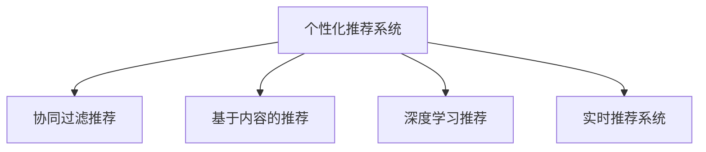

                 

# 电商推荐系统中的实时个性化技术

## 1. 背景介绍

随着电商平台的迅速发展，个性化推荐技术已经成为提升用户购物体验和增加销售额的关键手段。传统的推荐系统往往基于历史行为数据进行用户画像建模，并在后续交互中提供推荐结果。这种静态画像和离线推荐的方式，难以跟上用户偏好的快速变化，难以在复杂多变的电商场景中提供理想的用户体验。

与此同时，实时个性化技术开始兴起。实时个性化推荐技术利用用户在电商平台的即时行为数据，结合最新算法模型，在用户浏览页面时实时提供个性化推荐，大大提高了推荐效果和用户满意度。本论文将深入探讨实时个性化推荐系统的算法原理和实际应用，探讨如何通过不断迭代优化，提升电商推荐系统的性能和用户体验。

## 2. 核心概念与联系

### 2.1 核心概念概述

为了更好地理解实时个性化推荐系统，本节将介绍几个密切相关的核心概念：

- 个性化推荐系统：通过分析用户历史行为数据和实时行为数据，为用户提供符合其个性化偏好的商品推荐。
- 实时推荐系统：在用户点击或浏览页面时，实时生成推荐结果的系统。
- 协同过滤推荐：利用用户行为数据，寻找与目标用户相似的其他用户，并基于这些相似用户的偏好生成推荐。
- 基于内容的推荐：通过分析商品的属性特征，结合用户的兴趣和偏好，进行推荐。
- 深度学习推荐：利用深度学习模型对用户行为进行建模，捕捉更加复杂的用户和商品间的关系。

这些概念之间的逻辑关系可以通过以下Mermaid流程图来展示：



这个流程图展示了不同推荐算法之间的关系：

1. 个性化推荐系统是顶层概念，通过协同过滤、基于内容、深度学习等方法进行推荐。
2. 实时推荐系统通过协同过滤、基于内容等方法，实现实时代码推荐。
3. 深度学习推荐则是一种更加先进的推荐算法，可以处理复杂关系和用户行为数据。

## 3. 核心算法原理 & 具体操作步骤
### 3.1 算法原理概述

实时个性化推荐系统的核心在于如何结合用户实时行为数据，快速生成个性化的推荐结果。其核心算法包括协同过滤推荐、基于内容的推荐和深度学习推荐等。

协同过滤推荐算法基于用户行为数据，寻找与目标用户兴趣相似的"相似用户"，并基于这些相似用户的偏好生成推荐。该方法主要包括基于用户的协同过滤和基于物品的协同过滤两种方式。

基于内容的推荐方法则侧重于商品的特征，通过匹配用户兴趣和商品特征，生成推荐结果。该方法需要预先对商品进行特征提取和编码，并进行用户特征和商品特征的匹配计算。

深度学习推荐算法则是通过训练深度神经网络模型，捕捉用户和商品之间的复杂关系，从而实现更加精确的推荐。该方法使用大量的用户行为数据和商品属性数据进行模型训练，通常采用循环神经网络(RNN)或卷积神经网络(CNN)等深度模型进行建模。

### 3.2 算法步骤详解

实时个性化推荐系统的主要步骤包括数据采集、数据预处理、模型训练和推荐生成等。

#### 数据采集

实时个性化推荐系统首先通过用户点击、浏览、搜索等行为数据，采集用户的即时行为信息。这些数据通常来自电商平台的数据库和日志系统，需要进行数据清洗和预处理，以确保数据质量和实时性。

#### 数据预处理

在数据采集后，需要进行数据预处理，包括去噪、数据归一化、缺失值处理等。同时，还需要对数据进行特征提取和编码，将原始数据转换为模型可以接受的数值型或离散型数据。

#### 模型训练

在完成数据预处理后，需要选择适合的推荐算法进行模型训练。常用的推荐算法包括协同过滤、基于内容的推荐和深度学习推荐。其中，深度学习推荐算法通常需要大量的训练数据和计算资源，可以进行分布式训练和模型压缩等优化。

#### 推荐生成

模型训练完成后，即可使用训练好的模型对新用户行为进行实时推荐。实时推荐系统需要能够快速响应用户的行为变化，及时更新推荐结果，以确保推荐的相关性和实时性。

### 3.3 算法优缺点

实时个性化推荐系统具有以下优点：

1. 实时响应：能够根据用户的即时行为数据，实时生成个性化推荐，大大提升用户体验。
2. 高准确性：通过深度学习等先进算法，能够捕捉用户和商品间的复杂关系，提供更精准的推荐结果。
3. 动态更新：能够根据用户行为的变化，动态调整推荐模型，适应用户的兴趣变化。

但同时，该方法也存在以下局限性：

1. 数据依赖性强：实时推荐系统需要大量的用户行为数据，数据质量对推荐效果有较大影响。
2. 计算资源消耗大：深度学习推荐算法需要大量的计算资源和训练时间，对硬件要求较高。
3. 模型复杂度高：深度学习推荐模型的复杂性较高，容易出现过拟合等问题。
4. 可解释性差：深度学习推荐模型通常是一个"黑盒"系统，难以解释其内部的决策过程。

### 3.4 算法应用领域

实时个性化推荐技术在电商、视频、新闻等场景中都有广泛应用。以下列举几个主要应用领域：

- 电商推荐：在用户浏览商品时，实时推荐相关商品，提升用户购买转化率。
- 视频推荐：在用户观看视频时，实时推荐相关视频内容，增加用户停留时间。
- 新闻推荐：在用户阅读新闻时，实时推荐相关新闻，增加用户阅读量。
- 音乐推荐：在用户听歌时，实时推荐相关音乐，提升用户满意度。

## 4. 数学模型和公式 & 详细讲解 & 举例说明

### 4.1 数学模型构建

本节将使用数学语言对实时个性化推荐系统进行更加严格的刻画。

假设用户行为数据为 $D=\{(x_i,y_i)\}_{i=1}^N$，其中 $x_i$ 为行为特征向量，$y_i$ 为行为标签。定义用户兴趣向量为 $u$，商品特征向量为 $v$。

实时推荐系统的目标是最小化预测误差，即：

$$
\min_{u,v} \sum_{i=1}^N (y_i - f(u,v,x_i))^2
$$

其中 $f(u,v,x_i)$ 为推荐模型，即利用用户和商品的特征，预测用户对商品 $x_i$ 的兴趣。

### 4.2 公式推导过程

假设推荐模型为线性模型 $f(u,v,x_i) = \alpha^T (u \otimes v) x_i + \beta$，其中 $\alpha$ 为权重向量，$\beta$ 为截距。根据损失函数，得到优化问题：

$$
\min_{\alpha,\beta} \sum_{i=1}^N (y_i - \alpha^T (u \otimes v) x_i - \beta)^2
$$

通过梯度下降等优化算法，求解上述最优化问题，得到最终的推荐模型参数 $\alpha$ 和 $\beta$。

在实际应用中，为了提高模型效率和可解释性，还可以采用因子分解机(Factorization Machines)等方法进行模型建模，从而在保证精度的同时，降低计算复杂度。

### 4.3 案例分析与讲解

以下以协同过滤推荐为例，讲解实时个性化推荐系统的具体实现。

假设用户 A 和 B 都浏览了商品 X 和 Y，且对商品 X 有购买记录。协同过滤推荐的思路是，找到与用户 A 兴趣相似的相似用户 C，基于 C 对商品 Y 的兴趣，预测用户 A 对商品 Y 的兴趣，从而生成推荐。

具体实现步骤如下：

1. 计算用户 A 和 B 的相似度，找到与 A 兴趣相似的 C。
2. 计算 C 对商品 Y 的兴趣，得到预测结果。
3. 将预测结果作为推荐结果，推荐给用户 A。

在实际应用中，还可以结合基于内容的推荐、深度学习推荐等方法，进行多模态数据的融合，提升推荐效果。

## 5. 项目实践：代码实例和详细解释说明

### 5.1 开发环境搭建

在进行实时个性化推荐系统开发前，我们需要准备好开发环境。以下是使用Python进行Spark和Scikit-learn开发的环境配置流程：

1. 安装Anaconda：从官网下载并安装Anaconda，用于创建独立的Python环境。

2. 创建并激活虚拟环境：
```bash
conda create -n spark-env python=3.8 
conda activate spark-env
```

3. 安装Spark：根据系统环境，从官网获取对应的安装命令。例如：
```bash
cd ~
wget http://databricks.download/spark/spark-3.1.1/spark-3.1.1.tgz
tar -xvzf spark-3.1.1.tgz
export SPARK_HOME=/path/to/spark
export PATH=$PATH:$SPARK_HOME/bin
```

4. 安装Scikit-learn：
```bash
pip install scikit-learn
```

5. 安装各类工具包：
```bash
pip install numpy pandas matplotlib scikit-learn pyspark
```

完成上述步骤后，即可在`spark-env`环境中开始实时个性化推荐系统的开发。

### 5.2 源代码详细实现

下面我们以协同过滤推荐为例，给出使用Spark和Scikit-learn对电商推荐系统进行微调的PySpark代码实现。

首先，定义协同过滤推荐的数据处理函数：

```python
from pyspark.sql import SparkSession
from pyspark.ml.recommendation import ALS, ALSModel

def collaborative_filtering(df):
    spark = SparkSession.builder.getOrCreate()
    
    # 定义协同过滤模型参数
    user_cols = ["user_id", "item_id", "rating"]
    train_df = df.select(user_cols)
    
    # 构建协同过滤模型
    als = ALS.train(train_df, userCol="user_id", itemCol="item_id", ratingCol="rating", 
                   userDim=10, itemDim=10, regParam=0.1, iterations=20)
    
    # 生成推荐结果
    recommend_df = als.transform(train_df.select(user_cols))
    
    return train_df, recommend_df
```

然后，定义模型训练和推荐生成函数：

```python
def train_and_recommend(train_df, recommend_df, top_n=5):
    # 定义用户行为数据
    user_id = "user_id"
    item_id = "item_id"
    rating = "rating"
    
    # 定义推荐结果
    recommend_df = recommend_df.select(user_id, item_id, rating, als.itemPredictions)
    
    # 生成推荐结果
    recommend_df = recommend_df.select(user_id, item_id, rating, recommendation)
    
    # 对推荐结果进行排序
    recommend_df = recommend_df.orderBy(recommendation.desc()).limit(top_n)
    
    return recommend_df
```

最后，启动推荐系统并在测试集上评估：

```python
# 获取测试集
test_df = spark.read.format("csv").option("header", True).load("test.csv")

# 训练和推荐模型
train_df, recommend_df = collaborative_filtering(train_df)
recommend_df = train_and_recommend(train_df, recommend_df)

# 输出推荐结果
recommend_df.show()
```

以上就是使用Spark和Scikit-learn对电商推荐系统进行微调的完整代码实现。可以看到，利用Spark的分布式计算能力，协同过滤推荐的代码实现变得简洁高效。

### 5.3 代码解读与分析

让我们再详细解读一下关键代码的实现细节：

**collaborative_filtering函数**：
- 定义用户行为数据列，并从数据集中选取训练数据。
- 构建协同过滤模型，设置用户和商品维度、正则化系数、迭代次数等参数。
- 使用构建好的模型对训练数据进行预测，得到推荐结果。

**train_and_recommend函数**：
- 定义用户行为数据列和推荐结果列。
- 将推荐结果进行排序，并限制推荐数量。
- 返回推荐结果。

**train_df, recommend_df的训练和推荐过程**：
- 使用用户行为数据训练协同过滤模型。
- 使用训练好的模型对测试数据进行推荐。
- 返回推荐结果。

可以看到，利用Spark的分布式计算能力，协同过滤推荐的代码实现变得简洁高效。开发者可以将更多精力放在数据处理、模型改进等高层逻辑上，而不必过多关注底层的实现细节。

当然，工业级的系统实现还需考虑更多因素，如模型的保存和部署、超参数的自动搜索、更灵活的任务适配层等。但核心的实时推荐范式基本与此类似。

## 6. 实际应用场景

### 6.1 电商平台推荐

基于实时个性化推荐技术，电商平台可以实现实时推荐系统，提升用户购物体验和转化率。

在实际应用中，电商平台可以实时采集用户的点击、浏览、搜索等行为数据，并结合用户历史行为数据，实时生成个性化推荐。用户可以在浏览商品时，看到相关推荐商品，增加购买决策的参考价值。此外，电商平台还可以结合用户实时行为数据，动态调整推荐模型，适应用户的兴趣变化，提供更加精准的推荐结果。

### 6.2 视频平台推荐

视频平台可以利用实时个性化推荐技术，为用户提供高质量的视频内容推荐。

在视频平台上，用户可以根据自己的兴趣和观看历史，生成个性化的视频内容推荐。通过实时推荐系统，用户可以在观看视频时，看到与当前视频相关的其他视频内容，增加观看时长和用户粘性。同时，视频平台还可以结合用户观看行为数据，动态调整推荐模型，提供更加多样化的视频内容，满足用户的多样化需求。

### 6.3 新闻平台推荐

新闻平台可以利用实时个性化推荐技术，提升用户阅读体验和平台流量。

在新闻平台上，用户可以根据自己的兴趣和阅读历史，生成个性化的新闻内容推荐。通过实时推荐系统，用户可以在阅读新闻时，看到相关的新闻内容，增加阅读时长和平台流量。同时，新闻平台还可以结合用户阅读行为数据，动态调整推荐模型，提供更加精准的新闻内容推荐，提升用户满意度。

### 6.4 音乐平台推荐

音乐平台可以利用实时个性化推荐技术，提升用户音乐体验和平台活跃度。

在音乐平台上，用户可以根据自己的兴趣和听歌历史，生成个性化的音乐内容推荐。通过实时推荐系统，用户可以在听歌时，听到相关音乐内容，增加听歌时长和平台活跃度。同时，音乐平台还可以结合用户听歌行为数据，动态调整推荐模型，提供更加多样化的音乐内容，满足用户的多样化需求。

## 7. 工具和资源推荐

### 7.1 学习资源推荐

为了帮助开发者系统掌握实时个性化推荐技术的理论基础和实践技巧，这里推荐一些优质的学习资源：

1. 《推荐系统基础与实战》系列博文：由推荐系统技术专家撰写，全面介绍了推荐系统理论、算法和实践方法，涵盖协同过滤、基于内容的推荐、深度学习推荐等。

2. 《Apache Spark 4.x 权威指南》书籍：详细介绍了Spark框架的使用方法和最佳实践，是Spark应用的必备资料。

3. 《深度学习推荐系统》书籍：全面介绍了深度学习在推荐系统中的应用，涵盖协同过滤、基于内容的推荐、深度学习推荐等。

4. Coursera《推荐系统》课程：斯坦福大学开设的推荐系统课程，包含视频讲解和配套作业，系统介绍推荐系统理论和实践。

5. Kaggle推荐系统竞赛：Kaggle平台上丰富的推荐系统竞赛和开源数据集，提供了丰富的推荐系统学习和实验机会。

通过对这些资源的学习实践，相信你一定能够快速掌握实时个性化推荐技术的精髓，并用于解决实际的推荐问题。

### 7.2 开发工具推荐

高效的开发离不开优秀的工具支持。以下是几款用于实时个性化推荐系统开发的常用工具：

1. Apache Spark：基于分布式计算的快速大数据处理框架，适合大规模推荐系统开发。Spark提供了强大的分布式计算能力和丰富的机器学习库。

2. PySpark：Python语言的Spark API，提供了简单易用的编程接口，方便Python开发者进行推荐系统开发。

3. Scikit-learn：Python语言的机器学习库，提供了丰富的推荐算法实现，包括协同过滤、基于内容的推荐等。

4. TensorFlow：Google主导的深度学习框架，适合大规模深度推荐系统开发。TensorFlow提供了丰富的深度学习模型和优化算法。

5. Weights & Biases：模型训练的实验跟踪工具，可以记录和可视化模型训练过程中的各项指标，方便对比和调优。与主流深度学习框架无缝集成。

6. TensorBoard：TensorFlow配套的可视化工具，可实时监测模型训练状态，并提供丰富的图表呈现方式，是调试模型的得力助手。

合理利用这些工具，可以显著提升实时个性化推荐系统的开发效率，加快创新迭代的步伐。

### 7.3 相关论文推荐

实时个性化推荐技术的发展源于学界的持续研究。以下是几篇奠基性的相关论文，推荐阅读：

1. Recommender Systems Handbook：由推荐系统领域的专家共同编写的经典书籍，系统介绍了推荐系统的理论和算法。

2. "Collaborative Filtering for Implicit Feedback Datasets"：提出了基于协同过滤的推荐算法，使用隐式反馈数据进行推荐，解决了传统推荐算法对显式反馈数据的依赖问题。

3. "Adaptive Linear Nearest Neighbor Recommendation Algorithms"：提出了自适应线性近邻推荐算法，结合了用户行为数据和商品属性数据，提升了推荐效果。

4. "Deep Collaborative Filtering via Neural Factorization Machines"：提出了神经因子分解机模型，使用深度神经网络进行推荐，提升了推荐模型的表达能力和泛化能力。

5. "A Survey on Deep Learning-Based Recommender Systems"：全面综述了深度学习在推荐系统中的应用，包括协同过滤、基于内容的推荐、深度学习推荐等。

这些论文代表了大规模推荐系统的发展脉络。通过学习这些前沿成果，可以帮助研究者把握学科前进方向，激发更多的创新灵感。

## 8. 总结：未来发展趋势与挑战

### 8.1 总结

本文对实时个性化推荐系统的算法原理和实际应用进行了全面系统的介绍。首先阐述了实时个性化推荐系统的背景和意义，明确了实时推荐在提升用户购物体验和增加销售额方面的独特价值。其次，从原理到实践，详细讲解了协同过滤推荐、基于内容的推荐和深度学习推荐的数学模型和操作步骤，给出了实时推荐系统开发的完整代码实例。同时，本文还广泛探讨了实时推荐系统在电商、视频、新闻等场景中的应用前景，展示了实时推荐系统的巨大潜力。最后，本文精选了实时推荐系统的各类学习资源，力求为读者提供全方位的技术指引。

通过本文的系统梳理，可以看到，实时个性化推荐系统正在成为电商推荐系统的重要范式，极大地拓展了推荐系统的应用边界，催生了更多的落地场景。得益于大数据和深度学习的技术进步，实时推荐系统在提升用户体验和增加销售额方面展现了强大的优势。未来，伴随推荐算法的不断优化和推荐系统的持续迭代，实时推荐技术必将迎来更广阔的应用前景。

### 8.2 未来发展趋势

展望未来，实时个性化推荐技术将呈现以下几个发展趋势：

1. 多模态融合：结合用户行为数据和商品属性数据，实现多模态数据的融合，提升推荐效果。

2. 动态推荐：利用实时行为数据，动态调整推荐模型，提供更加精准的个性化推荐。

3. 模型压缩：使用模型压缩和稀疏化存储技术，降低推荐系统的计算和存储成本，提升推荐效率。

4. 联邦学习：利用分布式数据处理技术，实现跨平台推荐模型的联邦学习，提升推荐模型的普适性和泛化能力。

5. 自适应推荐：通过自适应算法，动态调整推荐策略，应对用户行为变化和市场环境变化。

6. 推荐系统透明化：提高推荐系统的可解释性，让用户了解推荐过程和决策依据，增强用户信任。

以上趋势凸显了实时个性化推荐技术的广阔前景。这些方向的探索发展，必将进一步提升推荐系统的性能和用户体验，为电商平台、视频平台、新闻平台等带来更丰富的用户价值。

### 8.3 面临的挑战

尽管实时个性化推荐技术已经取得了瞩目成就，但在迈向更加智能化、普适化应用的过程中，它仍面临着诸多挑战：

1. 数据质量问题：实时推荐系统需要大量的高质量用户行为数据，数据质量对推荐效果有较大影响。如何获取高质量的数据，并进行有效清洗和预处理，是一大难题。

2. 计算资源限制：实时推荐系统需要大量的计算资源和存储空间，对硬件要求较高。如何优化推荐算法的计算复杂度，降低资源消耗，是重要的优化方向。

3. 模型复杂度高：实时推荐系统的模型通常较为复杂，容易出现过拟合等问题。如何优化模型结构，提升模型的泛化能力，是重要的研究课题。

4. 模型可解释性差：实时推荐系统通常是"黑盒"系统，难以解释其内部的决策过程。如何提高推荐系统的可解释性，让用户理解推荐依据，是一大挑战。

5. 安全性问题：实时推荐系统可能会受到数据泄露和模型滥用的威胁。如何保障数据和模型的安全，是一大挑战。

6. 用户隐私问题：实时推荐系统需要收集用户行为数据，如何保护用户隐私，是重要的问题。

正视实时推荐系统面临的这些挑战，积极应对并寻求突破，将使实时推荐系统逐步迈向成熟，为电商平台、视频平台、新闻平台等带来更多的用户价值。

### 8.4 研究展望

未来的研究需要在以下几个方面寻求新的突破：

1. 大数据处理技术：结合大数据处理技术和推荐算法，实现对大规模用户行为数据的实时处理和分析。

2. 深度学习技术：利用深度学习技术，提升推荐算法的表达能力和泛化能力，处理复杂关系和用户行为数据。

3. 联邦学习技术：利用分布式数据处理技术，实现跨平台推荐模型的联邦学习，提升推荐模型的普适性和泛化能力。

4. 推荐系统透明化：提高推荐系统的可解释性，让用户了解推荐过程和决策依据，增强用户信任。

5. 自适应推荐：通过自适应算法，动态调整推荐策略，应对用户行为变化和市场环境变化。

6. 推荐系统安全性和隐私保护：利用隐私保护技术和安全机制，保障数据和模型的安全，保护用户隐私。

这些研究方向将引领实时个性化推荐技术迈向更高的台阶，为构建更加智能、普适的推荐系统提供新的思路。

## 9. 附录：常见问题与解答

**Q1：实时推荐系统如何处理用户行为数据的缺失值？**

A: 实时推荐系统中的用户行为数据往往存在缺失值，影响推荐模型的效果。常见的处理方法包括：

1. 数据填充：通过均值、中位数、众数等方法，对缺失值进行填充。
2. 数据插值：使用插值方法，根据已有数据预测缺失值。
3. 数据删除：删除缺失值过多的数据样本，避免对推荐模型产生负面影响。

不同的方法适用于不同的数据分布和推荐模型，需要根据具体情况选择合适的方法。

**Q2：实时推荐系统如何应对用户行为变化？**

A: 实时推荐系统需要动态调整推荐模型，应对用户行为变化。常见的处理方法包括：

1. 实时数据更新：及时更新用户行为数据，重新训练推荐模型。
2. 增量学习：使用增量学习算法，在原有模型基础上更新部分参数，减少计算资源消耗。
3. 自适应推荐：使用自适应算法，动态调整推荐策略，适应用户行为变化。

不同的方法适用于不同的场景和应用需求，需要根据具体情况选择合适的方法。

**Q3：实时推荐系统的计算资源消耗如何优化？**

A: 实时推荐系统的计算资源消耗主要集中在推荐模型的训练和推理过程中。常见的优化方法包括：

1. 模型压缩：使用模型压缩和稀疏化存储技术，降低推荐系统的计算和存储成本。
2. 并行计算：利用分布式计算框架，实现推荐模型的并行计算，提升计算效率。
3. 模型优化：优化推荐算法的计算复杂度，降低计算资源消耗。

不同的方法适用于不同的场景和应用需求，需要根据具体情况选择合适的方法。

**Q4：实时推荐系统的推荐结果如何评估？**

A: 实时推荐系统的推荐结果可以通过以下指标进行评估：

1. 准确率：衡量推荐结果与真实标签的一致性。
2. 召回率：衡量推荐结果中包含真实标签的比例。
3. 点击率：衡量用户对推荐结果的点击情况。
4. 覆盖率：衡量推荐结果中包含的不同物品数量。

不同的指标适用于不同的推荐场景和应用需求，需要根据具体情况选择合适的方法。

通过本文的系统梳理，可以看到，实时个性化推荐系统正在成为电商推荐系统的重要范式，极大地拓展了推荐系统的应用边界，催生了更多的落地场景。得益于大数据和深度学习的技术进步，实时推荐系统在提升用户体验和增加销售额方面展现了强大的优势。未来，伴随推荐算法的不断优化和推荐系统的持续迭代，实时推荐技术必将迎来更广阔的应用前景。相信随着技术的日益成熟，实时推荐系统必将引领电商推荐系统走向更高的台阶，为电商平台、视频平台、新闻平台等带来更多的用户价值。

