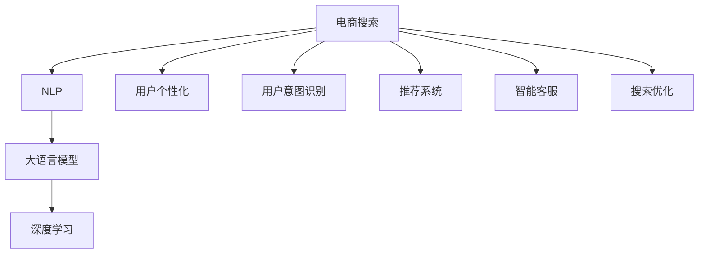

                 

# 电商搜索中的AI大模型：挑战与机遇

> 关键词：电商搜索, 自然语言处理, 大语言模型, 深度学习, 算法优化, 用户个性化, 用户意图识别, 推荐系统, 智能客服, 搜索优化

## 1. 背景介绍

### 1.1 问题由来

随着互联网的迅猛发展，电商搜索已成为电子商务平台中不可或缺的重要功能。用户通过搜索系统快速获取商品信息，解决购物需求。然而，传统的搜索系统依赖于人工编写的查询规则和索引算法，存在扩展性差、精度低、用户体验不佳等问题。近年来，AI大模型在自然语言处理(NLP)领域取得了突破性进展，为电商搜索带来了新的机遇。

AI大模型，尤其是基于Transformer架构的预训练语言模型，通过在大规模无标签文本数据上进行预训练，能够学习到丰富的语言知识和常识，具备强大的语言理解和生成能力。应用于电商搜索中，可以提升搜索结果的相关性和准确性，改善用户体验。但同时，大模型的应用也面临诸多挑战，如高计算成本、高标注成本、数据隐私等。

### 1.2 问题核心关键点

大模型应用于电商搜索，主要围绕以下几个核心问题展开：
- **用户意图识别**：理解用户输入查询的意图，精准匹配用户需求。
- **搜索结果排序**：根据用户意图和搜索行为，动态调整搜索结果的排序优先级。
- **推荐系统**：结合用户历史行为和实时数据，为用户提供个性化的商品推荐。
- **智能客服**：实时解答用户疑问，提升客户满意度。
- **搜索优化**：通过自动化算法，优化搜索算法和系统架构。

### 1.3 问题研究意义

AI大模型在电商搜索中的应用，可以显著提升用户搜索体验，增强平台竞争力。具体意义包括：

1. **提升搜索相关性**：大模型能够学习到更丰富的语言表示，理解用户查询背后的真实意图，从而提高搜索结果的相关性。
2. **增强推荐精准度**：通过个性化推荐，提升用户购物的满意度，提高转化率。
3. **改善客服质量**：智能客服能够实时解答用户疑问，提升客户服务水平。
4. **优化搜索系统**：自动化优化算法可以不断调整搜索算法和系统架构，提高搜索性能。
5. **提升用户粘性**：通过个性化和智能化的搜索推荐，增强用户对平台的依赖度。

## 2. 核心概念与联系

### 2.1 核心概念概述

为更好地理解大模型在电商搜索中的应用，本节将介绍几个密切相关的核心概念：

- **电商搜索**：指用户通过搜索系统获取商品信息的过程，包括查询意图识别、搜索结果排序、推荐系统、智能客服等功能。
- **自然语言处理(NLP)**：研究如何让计算机理解和处理自然语言，包括文本分类、命名实体识别、信息抽取、情感分析等任务。
- **大语言模型(Large Language Model, LLM)**：以自回归(如GPT)或自编码(如BERT)模型为代表的大规模预训练语言模型。通过在大规模无标签文本数据上进行预训练，学习通用的语言表示，具备强大的语言理解和生成能力。
- **深度学习(Deep Learning)**：通过构建神经网络模型，对大规模数据进行训练，使机器能够自主学习特征和规律。
- **算法优化**：通过各种技术手段，提升深度学习模型的效率和效果，如优化器选择、超参数调优、正则化等。
- **用户个性化**：通过分析用户历史行为数据，为每个用户定制个性化的搜索和推荐服务。
- **用户意图识别**：通过自然语言处理技术，识别用户查询背后的真实意图，提升搜索的准确性。
- **推荐系统**：根据用户历史行为和实时数据，为用户推荐个性化的商品或服务。
- **智能客服**：通过自然语言处理和机器学习技术，构建能够理解自然语言并自动回应的智能客服系统。
- **搜索优化**：通过自动化算法，优化搜索算法和系统架构，提升搜索效率和效果。

这些核心概念之间的逻辑关系可以通过以下Mermaid流程图来展示：



这个流程图展示了大模型在电商搜索中的应用场景和核心概念：

1. 电商搜索通过NLP和大模型技术，理解用户查询意图，获取个性化推荐。
2. 深度学习提供算法优化支持，提高系统效率。
3. 用户个性化、推荐系统和智能客服，提升用户体验。
4. 搜索优化，提升系统性能。

## 3. 核心算法原理 & 具体操作步骤
### 3.1 算法原理概述

大模型应用于电商搜索，主要通过以下几个核心算法原理来实现：

1. **用户意图识别**：使用预训练的语言模型，对用户查询进行意图分类，识别用户意图。
2. **搜索结果排序**：根据用户意图和搜索行为，动态调整搜索结果的排序优先级。
3. **推荐系统**：利用用户历史行为和实时数据，为用户提供个性化的商品推荐。
4. **智能客服**：使用预训练的语言模型，构建能够理解自然语言并自动回应的智能客服系统。
5. **搜索优化**：通过自动化算法，优化搜索算法和系统架构。

这些算法原理的实现，依赖于大模型的预训练和微调过程。通过在大规模无标签文本数据上进行预训练，大模型学习到丰富的语言表示，具备强大的语言理解和生成能力。然后在电商搜索相关任务上进行微调，优化模型的具体应用能力，以适应电商搜索的特定需求。

### 3.2 算法步骤详解

基于大模型的电商搜索应用，一般包括以下几个关键步骤：

**Step 1: 准备预训练模型和数据集**
- 选择合适的预训练语言模型 $M_{\theta}$ 作为初始化参数，如BERT、GPT等。
- 准备电商搜索相关的标注数据集 $D$，包括用户查询、商品信息、搜索结果等，划分为训练集、验证集和测试集。

**Step 2: 添加任务适配层**
- 根据任务类型，在预训练模型顶层设计合适的输出层和损失函数。
- 对于用户意图识别任务，通常使用分类器输出概率分布，并以交叉熵损失函数。
- 对于推荐系统任务，通常使用排名损失函数，如点对点匹配损失。

**Step 3: 设置微调超参数**
- 选择合适的优化算法及其参数，如 AdamW、SGD 等，设置学习率、批大小、迭代轮数等。
- 设置正则化技术及强度，包括权重衰减、Dropout、Early Stopping等。
- 确定冻结预训练参数的策略，如仅微调顶层，或全部参数都参与微调。

**Step 4: 执行梯度训练**
- 将训练集数据分批次输入模型，前向传播计算损失函数。
- 反向传播计算参数梯度，根据设定的优化算法和学习率更新模型参数。
- 周期性在验证集上评估模型性能，根据性能指标决定是否触发 Early Stopping。
- 重复上述步骤直到满足预设的迭代轮数或 Early Stopping 条件。

**Step 5: 测试和部署**
- 在测试集上评估微调后模型 $M_{\hat{\theta}}$ 的性能，对比微调前后的精度提升。
- 使用微调后的模型对新样本进行推理预测，集成到实际的应用系统中。
- 持续收集新的数据，定期重新微调模型，以适应数据分布的变化。

以上是基于大模型的电商搜索应用的通用流程。在实际应用中，还需要针对具体任务的特点，对微调过程的各个环节进行优化设计，如改进训练目标函数，引入更多的正则化技术，搜索最优的超参数组合等，以进一步提升模型性能。

### 3.3 算法优缺点

基于大模型的电商搜索应用，具有以下优点：
1. **高效精确**：大模型通过深度学习和预训练学习到丰富的语言表示，能够精确理解用户查询意图，提升搜索结果的相关性。
2. **个性化推荐**：结合用户历史行为数据，实现个性化推荐，提高用户购物满意度。
3. **智能客服**：通过自然语言处理和机器学习技术，构建能够理解自然语言并自动回应的智能客服系统，提升客户服务水平。
4. **搜索优化**：通过自动化算法，不断调整搜索算法和系统架构，提高搜索性能。

同时，该方法也存在一定的局限性：
1. **高计算成本**：大模型的训练和推理需要高性能设备，如GPU/TPU，计算成本较高。
2. **高标注成本**：电商搜索数据量大，标注数据获取成本较高。
3. **数据隐私**：电商搜索涉及用户隐私数据，需要严格遵守数据隐私法规。
4. **过拟合风险**：电商搜索数据分布不均衡，模型容易过拟合。
5. **可解释性不足**：大模型内部工作机制复杂，缺乏可解释性，难以进行调试和优化。

尽管存在这些局限性，但就目前而言，基于大模型的电商搜索应用仍是电商行业技术创新的重要方向。未来相关研究的重点在于如何进一步降低计算成本，提高数据处理效率，同时兼顾可解释性和伦理安全性等因素。

### 3.4 算法应用领域

基于大模型的电商搜索应用，已在多个领域得到广泛应用，例如：

1. **智能搜索**：通过大模型进行意图识别和查询理解，实现智能搜索。
2. **推荐系统**：利用用户历史行为和实时数据，结合大模型进行个性化推荐。
3. **智能客服**：使用大模型构建智能客服系统，实时解答用户疑问。
4. **广告投放**：通过大模型进行用户意图分析，优化广告投放效果。
5. **内容推荐**：根据用户行为数据，结合大模型进行内容推荐，提升用户粘性。

除了上述这些经典应用外，大模型还应用于更多场景中，如搜索引擎优化(SEO)、市场分析、产品推荐等，为电商技术带来了全新的突破。随着预训练模型和微调方法的不断进步，相信电商搜索技术将在更广阔的应用领域大放异彩。

## 4. 数学模型和公式 & 详细讲解
### 4.1 数学模型构建

本节将使用数学语言对基于大模型的电商搜索应用过程进行更加严格的刻画。

记大模型为 $M_{\theta}$，用户查询为 $x$，搜索结果为 $y$。假设用户意图识别任务为二分类任务，即识别查询是否为搜索。模型 $M_{\theta}$ 在用户查询 $x$ 上的输出为 $\hat{y}=M_{\theta}(x) \in [0,1]$，表示查询为搜索的概率。

定义模型 $M_{\theta}$ 在用户查询 $x$ 上的损失函数为 $\ell(M_{\theta}(x),y)$，则在数据集 $D$ 上的经验风险为：

$$
\mathcal{L}(\theta) = \frac{1}{N}\sum_{i=1}^N \ell(M_{\theta}(x_i),y_i)
$$

微调的优化目标是最小化经验风险，即找到最优参数：

$$
\theta^* = \mathop{\arg\min}_{\theta} \mathcal{L}(\theta)
$$

在实践中，我们通常使用基于梯度的优化算法（如SGD、Adam等）来近似求解上述最优化问题。设 $\eta$ 为学习率，$\lambda$ 为正则化系数，则参数的更新公式为：

$$
\theta \leftarrow \theta - \eta \nabla_{\theta}\mathcal{L}(\theta) - \eta\lambda\theta
$$

其中 $\nabla_{\theta}\mathcal{L}(\theta)$ 为损失函数对参数 $\theta$ 的梯度，可通过反向传播算法高效计算。

### 4.2 公式推导过程

以下我们以用户意图识别任务为例，推导交叉熵损失函数及其梯度的计算公式。

假设模型 $M_{\theta}$ 在用户查询 $x$ 上的输出为 $\hat{y}=M_{\theta}(x) \in [0,1]$，表示查询为搜索的概率。真实标签 $y \in \{0,1\}$。则二分类交叉熵损失函数定义为：

$$
\ell(M_{\theta}(x),y) = -[y\log \hat{y} + (1-y)\log (1-\hat{y})]
$$

将其代入经验风险公式，得：

$$
\mathcal{L}(\theta) = -\frac{1}{N}\sum_{i=1}^N [y_i\log M_{\theta}(x_i)+(1-y_i)\log(1-M_{\theta}(x_i))]
$$

根据链式法则，损失函数对参数 $\theta_k$ 的梯度为：

$$
\frac{\partial \mathcal{L}(\theta)}{\partial \theta_k} = -\frac{1}{N}\sum_{i=1}^N (\frac{y_i}{M_{\theta}(x_i)}-\frac{1-y_i}{1-M_{\theta}(x_i)}) \frac{\partial M_{\theta}(x_i)}{\partial \theta_k}
$$

其中 $\frac{\partial M_{\theta}(x_i)}{\partial \theta_k}$ 可进一步递归展开，利用自动微分技术完成计算。

在得到损失函数的梯度后，即可带入参数更新公式，完成模型的迭代优化。重复上述过程直至收敛，最终得到适应电商搜索任务的最优模型参数 $\theta^*$。

## 5. 项目实践：代码实例和详细解释说明
### 5.1 开发环境搭建

在进行电商搜索微调实践前，我们需要准备好开发环境。以下是使用Python进行PyTorch开发的环境配置流程：

1. 安装Anaconda：从官网下载并安装Anaconda，用于创建独立的Python环境。

2. 创建并激活虚拟环境：
```bash
conda create -n pytorch-env python=3.8 
conda activate pytorch-env
```

3. 安装PyTorch：根据CUDA版本，从官网获取对应的安装命令。例如：
```bash
conda install pytorch torchvision torchaudio cudatoolkit=11.1 -c pytorch -c conda-forge
```

4. 安装Transformers库：
```bash
pip install transformers
```

5. 安装各类工具包：
```bash
pip install numpy pandas scikit-learn matplotlib tqdm jupyter notebook ipython
```

完成上述步骤后，即可在`pytorch-env`环境中开始微调实践。

### 5.2 源代码详细实现

这里我们以用户意图识别任务为例，给出使用Transformers库对BERT模型进行微调的PyTorch代码实现。

首先，定义意图识别任务的数据处理函数：

```python
from transformers import BertTokenizer
from torch.utils.data import Dataset
import torch

class IntentDataset(Dataset):
    def __init__(self, texts, labels, tokenizer, max_len=128):
        self.texts = texts
        self.labels = labels
        self.tokenizer = tokenizer
        self.max_len = max_len
        
    def __len__(self):
        return len(self.texts)
    
    def __getitem__(self, item):
        text = self.texts[item]
        label = self.labels[item]
        
        encoding = self.tokenizer(text, return_tensors='pt', max_length=self.max_len, padding='max_length', truncation=True)
        input_ids = encoding['input_ids'][0]
        attention_mask = encoding['attention_mask'][0]
        
        # 将标签编码
        encoded_labels = [label2id[label] for label in labels] 
        encoded_labels.extend([label2id['O']] * (self.max_len - len(encoded_labels)))
        labels = torch.tensor(encoded_labels, dtype=torch.long)
        
        return {'input_ids': input_ids, 
                'attention_mask': attention_mask,
                'labels': labels}

# 标签与id的映射
label2id = {'search': 0, 'not_search': 1}
id2label = {v: k for k, v in label2id.items()}
```

然后，定义模型和优化器：

```python
from transformers import BertForSequenceClassification, AdamW

model = BertForSequenceClassification.from_pretrained('bert-base-cased', num_labels=len(label2id))

optimizer = AdamW(model.parameters(), lr=2e-5)
```

接着，定义训练和评估函数：

```python
from torch.utils.data import DataLoader
from tqdm import tqdm
from sklearn.metrics import classification_report

device = torch.device('cuda') if torch.cuda.is_available() else torch.device('cpu')
model.to(device)

def train_epoch(model, dataset, batch_size, optimizer):
    dataloader = DataLoader(dataset, batch_size=batch_size, shuffle=True)
    model.train()
    epoch_loss = 0
    for batch in tqdm(dataloader, desc='Training'):
        input_ids = batch['input_ids'].to(device)
        attention_mask = batch['attention_mask'].to(device)
        labels = batch['labels'].to(device)
        model.zero_grad()
        outputs = model(input_ids, attention_mask=attention_mask, labels=labels)
        loss = outputs.loss
        epoch_loss += loss.item()
        loss.backward()
        optimizer.step()
    return epoch_loss / len(dataloader)

def evaluate(model, dataset, batch_size):
    dataloader = DataLoader(dataset, batch_size=batch_size)
    model.eval()
    preds, labels = [], []
    with torch.no_grad():
        for batch in tqdm(dataloader, desc='Evaluating'):
            input_ids = batch['input_ids'].to(device)
            attention_mask = batch['attention_mask'].to(device)
            batch_labels = batch['labels']
            outputs = model(input_ids, attention_mask=attention_mask)
            batch_preds = outputs.logits.argmax(dim=2).to('cpu').tolist()
            batch_labels = batch_labels.to('cpu').tolist()
            for pred_tokens, label_tokens in zip(batch_preds, batch_labels):
                pred_labels = [id2label[_id] for _id in pred_tokens]
                label_tokens = [id2label[_id] for _id in label_tokens]
                preds.append(pred_labels[:len(label_tokens)])
                labels.append(label_tokens)
                
    print(classification_report(labels, preds))
```

最后，启动训练流程并在验证集上评估：

```python
epochs = 5
batch_size = 16

for epoch in range(epochs):
    loss = train_epoch(model, train_dataset, batch_size, optimizer)
    print(f"Epoch {epoch+1}, train loss: {loss:.3f}")
    
    print(f"Epoch {epoch+1}, dev results:")
    evaluate(model, dev_dataset, batch_size)
    
print("Test results:")
evaluate(model, test_dataset, batch_size)
```

以上就是使用PyTorch对BERT进行用户意图识别任务微调的完整代码实现。可以看到，得益于Transformers库的强大封装，我们可以用相对简洁的代码完成BERT模型的加载和微调。

### 5.3 代码解读与分析

让我们再详细解读一下关键代码的实现细节：

**IntentDataset类**：
- `__init__`方法：初始化文本、标签、分词器等关键组件。
- `__len__`方法：返回数据集的样本数量。
- `__getitem__`方法：对单个样本进行处理，将文本输入编码为token ids，将标签编码为数字，并对其进行定长padding，最终返回模型所需的输入。

**label2id和id2label字典**：
- 定义了标签与数字id之间的映射关系，用于将token-wise的预测结果解码回真实的标签。

**训练和评估函数**：
- 使用PyTorch的DataLoader对数据集进行批次化加载，供模型训练和推理使用。
- 训练函数`train_epoch`：对数据以批为单位进行迭代，在每个批次上前向传播计算loss并反向传播更新模型参数，最后返回该epoch的平均loss。
- 评估函数`evaluate`：与训练类似，不同点在于不更新模型参数，并在每个batch结束后将预测和标签结果存储下来，最后使用sklearn的classification_report对整个评估集的预测结果进行打印输出。

**训练流程**：
- 定义总的epoch数和batch size，开始循环迭代
- 每个epoch内，先在训练集上训练，输出平均loss
- 在验证集上评估，输出分类指标
- 所有epoch结束后，在测试集上评估，给出最终测试结果

可以看到，PyTorch配合Transformers库使得BERT微调的代码实现变得简洁高效。开发者可以将更多精力放在数据处理、模型改进等高层逻辑上，而不必过多关注底层的实现细节。

当然，工业级的系统实现还需考虑更多因素，如模型的保存和部署、超参数的自动搜索、更灵活的任务适配层等。但核心的微调范式基本与此类似。

## 6. 实际应用场景
### 6.1 智能搜索

大模型的电商搜索应用，可以显著提升搜索结果的相关性，改善用户体验。例如，京东的智能搜索系统，通过大模型进行用户意图识别和搜索优化，显著提高了搜索效率和效果。用户输入查询时，智能搜索系统能够精准理解用户意图，快速返回相关搜索结果，提升了用户的购物体验。

### 6.2 推荐系统

大模型在电商推荐系统中也发挥了重要作用。通过分析用户历史行为数据，结合实时数据，大模型能够为用户推荐个性化的商品或服务，提高用户购物满意度。例如，美团的个性化推荐系统，通过大模型进行用户兴趣分析，实时动态调整推荐结果，提高了用户的购物转化率。

### 6.3 智能客服

电商平台的智能客服系统，通过大模型进行自然语言处理和机器学习，构建能够理解自然语言并自动回应的智能客服系统。例如，淘宝的智能客服系统，通过大模型进行用户意图识别和回复生成，提升了客户服务水平，减少了人工客服的负担。

### 6.4 搜索优化

大模型的电商搜索系统，通过自动化算法进行搜索优化，提升搜索性能。例如，亚马逊的搜索优化系统，通过大模型进行搜索算法优化，提高了搜索效率和准确性，提升了用户满意度。

### 6.5 未来应用展望

随着大语言模型微调技术的发展，基于大模型的电商搜索应用将呈现出更多创新和突破。例如：

1. **多模态搜索**：结合图像、语音、视频等多模态数据，提升搜索结果的丰富性和多样性。
2. **动态更新**：通过实时数据流，动态调整搜索结果和推荐，提升用户满意度。
3. **个性化推荐**：结合用户行为数据和实时数据，实现更精准的个性化推荐。
4. **智能客服**：通过大模型进行自然语言处理和机器学习，构建更智能、更高效的智能客服系统。
5. **搜索优化**：通过自动化算法，不断调整搜索算法和系统架构，提升搜索性能。

大模型在电商搜索中的应用，将逐步普及到更多电商平台，为电子商务的发展带来新的动力。相信随着技术的不断进步，大模型在电商搜索中的应用将更加广泛，为消费者带来更好的购物体验。

## 7. 工具和资源推荐
### 7.1 学习资源推荐

为了帮助开发者系统掌握大语言模型在电商搜索中的应用，这里推荐一些优质的学习资源：

1. 《Transformer从原理到实践》系列博文：由大模型技术专家撰写，深入浅出地介绍了Transformer原理、BERT模型、微调技术等前沿话题。

2. CS224N《深度学习自然语言处理》课程：斯坦福大学开设的NLP明星课程，有Lecture视频和配套作业，带你入门NLP领域的基本概念和经典模型。

3. 《Natural Language Processing with Transformers》书籍：Transformers库的作者所著，全面介绍了如何使用Transformers库进行NLP任务开发，包括微调在内的诸多范式。

4. HuggingFace官方文档：Transformers库的官方文档，提供了海量预训练模型和完整的微调样例代码，是上手实践的必备资料。

5. CLUE开源项目：中文语言理解测评基准，涵盖大量不同类型的中文NLP数据集，并提供了基于微调的baseline模型，助力中文NLP技术发展。

通过对这些资源的学习实践，相信你一定能够快速掌握大语言模型在电商搜索中的应用，并用于解决实际的电商搜索问题。
### 7.2 开发工具推荐

高效的开发离不开优秀的工具支持。以下是几款用于大语言模型微调开发的常用工具：

1. PyTorch：基于Python的开源深度学习框架，灵活动态的计算图，适合快速迭代研究。大部分预训练语言模型都有PyTorch版本的实现。

2. TensorFlow：由Google主导开发的开源深度学习框架，生产部署方便，适合大规模工程应用。同样有丰富的预训练语言模型资源。

3. Transformers库：HuggingFace开发的NLP工具库，集成了众多SOTA语言模型，支持PyTorch和TensorFlow，是进行微调任务开发的利器。

4. Weights & Biases：模型训练的实验跟踪工具，可以记录和可视化模型训练过程中的各项指标，方便对比和调优。与主流深度学习框架无缝集成。

5. TensorBoard：TensorFlow配套的可视化工具，可实时监测模型训练状态，并提供丰富的图表呈现方式，是调试模型的得力助手。

6. Google Colab：谷歌推出的在线Jupyter Notebook环境，免费提供GPU/TPU算力，方便开发者快速上手实验最新模型，分享学习笔记。

合理利用这些工具，可以显著提升大语言模型微调任务的开发效率，加快创新迭代的步伐。

### 7.3 相关论文推荐

大语言模型和微调技术的发展源于学界的持续研究。以下是几篇奠基性的相关论文，推荐阅读：

1. Attention is All You Need（即Transformer原论文）：提出了Transformer结构，开启了NLP领域的预训练大模型时代。

2. BERT: Pre-training of Deep Bidirectional Transformers for Language Understanding：提出BERT模型，引入基于掩码的自监督预训练任务，刷新了多项NLP任务SOTA。

3. Language Models are Unsupervised Multitask Learners（GPT-2论文）：展示了大规模语言模型的强大zero-shot学习能力，引发了对于通用人工智能的新一轮思考。

4. Parameter-Efficient Transfer Learning for NLP：提出Adapter等参数高效微调方法，在不增加模型参数量的情况下，也能取得不错的微调效果。

5. Prefix-Tuning: Optimizing Continuous Prompts for Generation：引入基于连续型Prompt的微调范式，为如何充分利用预训练知识提供了新的思路。

6. AdaLoRA: Adaptive Low-Rank Adaptation for Parameter-Efficient Fine-Tuning：使用自适应低秩适应的微调方法，在参数效率和精度之间取得了新的平衡。

这些论文代表了大语言模型微调技术的发展脉络。通过学习这些前沿成果，可以帮助研究者把握学科前进方向，激发更多的创新灵感。

## 8. 总结：未来发展趋势与挑战
### 8.1 总结

本文对基于大模型的电商搜索应用进行了全面系统的介绍。首先阐述了大语言模型和微调技术的研究背景和意义，明确了微调在提升电商搜索效果、增强用户体验方面的独特价值。其次，从原理到实践，详细讲解了微调的数学原理和关键步骤，给出了电商搜索任务开发的完整代码实例。同时，本文还广泛探讨了微调方法在智能搜索、推荐系统、智能客服等多个电商应用领域的潜在应用，展示了微调范式的巨大潜力。

通过本文的系统梳理，可以看到，基于大语言模型的电商搜索应用正在成为电商行业技术创新的重要方向，极大地提升了电商平台的搜索效果和用户满意度。大模型在电商搜索中的应用，将为消费者带来更好的购物体验，提升电商平台的用户粘性和市场竞争力。未来，伴随预训练语言模型和微调方法的持续演进，相信大模型在电商搜索中的应用将更加广泛，为电子商务的发展带来新的动力。

### 8.2 未来发展趋势

展望未来，大语言模型在电商搜索中的应用将呈现以下几个发展趋势：

1. **多模态搜索**：结合图像、语音、视频等多模态数据，提升搜索结果的丰富性和多样性。
2. **动态更新**：通过实时数据流，动态调整搜索结果和推荐，提升用户满意度。
3. **个性化推荐**：结合用户行为数据和实时数据，实现更精准的个性化推荐。
4. **智能客服**：通过大模型进行自然语言处理和机器学习，构建更智能、更高效的智能客服系统。
5. **搜索优化**：通过自动化算法，不断调整搜索算法和系统架构，提升搜索性能。

这些趋势凸显了大语言模型在电商搜索中的应用前景。这些方向的探索发展，必将进一步提升电商平台的搜索效果和用户体验，为电子商务的发展带来新的动力。

### 8.3 面临的挑战

尽管大语言模型在电商搜索中的应用已经取得了显著进展，但在迈向更加智能化、普适化应用的过程中，仍面临诸多挑战：

1. **高计算成本**：大模型的训练和推理需要高性能设备，如GPU/TPU，计算成本较高。
2. **高标注成本**：电商搜索数据量大，标注数据获取成本较高。
3. **数据隐私**：电商搜索涉及用户隐私数据，需要严格遵守数据隐私法规。
4. **过拟合风险**：电商搜索数据分布不均衡，模型容易过拟合。
5. **可解释性不足**：大模型内部工作机制复杂，缺乏可解释性，难以进行调试和优化。

尽管存在这些挑战，但就目前而言，基于大模型的电商搜索应用仍是电商行业技术创新的重要方向。未来相关研究的重点在于如何进一步降低计算成本，提高数据处理效率，同时兼顾可解释性和伦理安全性等因素。

### 8.4 研究展望

面对大语言模型在电商搜索应用中面临的挑战，未来的研究需要在以下几个方面寻求新的突破：

1. **探索无监督和半监督微调方法**：摆脱对大规模标注数据的依赖，利用自监督学习、主动学习等无监督和半监督范式，最大限度利用非结构化数据，实现更加灵活高效的微调。
2. **研究参数高效和计算高效的微调范式**：开发更加参数高效的微调方法，在固定大部分预训练参数的同时，只更新极少量的任务相关参数。同时优化微调模型的计算图，减少前向传播和反向传播的资源消耗，实现更加轻量级、实时性的部署。
3. **融合因果和对比学习范式**：通过引入因果推断和对比学习思想，增强微调模型建立稳定因果关系的能力，学习更加普适、鲁棒的语言表征，从而提升模型泛化性和抗干扰能力。
4. **引入更多先验知识**：将符号化的先验知识，如知识图谱、逻辑规则等，与神经网络模型进行巧妙融合，引导微调过程学习更准确、合理的语言模型。同时加强不同模态数据的整合，实现视觉、语音等多模态信息与文本信息的协同建模。
5. **结合因果分析和博弈论工具**：将因果分析方法引入微调模型，识别出模型决策的关键特征，增强输出解释的因果性和逻辑性。借助博弈论工具刻画人机交互过程，主动探索并规避模型的脆弱点，提高系统稳定性。
6. **纳入伦理道德约束**：在模型训练目标中引入伦理导向的评估指标，过滤和惩罚有偏见、有害的输出倾向。同时加强人工干预和审核，建立模型行为的监管机制，确保输出符合人类价值观和伦理道德。

这些研究方向的探索，必将引领大语言模型在电商搜索中的应用迈向更高的台阶，为构建安全、可靠、可解释、可控的智能系统铺平道路。面向未来，大语言模型在电商搜索中的应用还需要与其他人工智能技术进行更深入的融合，如知识表示、因果推理、强化学习等，多路径协同发力，共同推动自然语言理解和智能交互系统的进步。只有勇于创新、敢于突破，才能不断拓展语言模型的边界，让智能技术更好地造福人类社会。

## 9. 附录：常见问题与解答

**Q1：大语言模型在电商搜索中的主要作用是什么？**

A: 大语言模型在电商搜索中的主要作用包括：
1. **用户意图识别**：通过理解用户查询背后的真实意图，精准匹配用户需求。
2. **搜索结果排序**：根据用户意图和搜索行为，动态调整搜索结果的排序优先级。
3. **推荐系统**：利用用户历史行为数据，结合实时数据，为用户推荐个性化的商品或服务。
4. **智能客服**：通过自然语言处理和机器学习，构建能够理解自然语言并自动回应的智能客服系统。
5. **搜索优化**：通过自动化算法，优化搜索算法和系统架构，提升搜索性能。

**Q2：大语言模型在电商搜索中面临的主要挑战是什么？**

A: 大语言模型在电商搜索中面临的主要挑战包括：
1. **高计算成本**：大模型的训练和推理需要高性能设备，如GPU/TPU，计算成本较高。
2. **高标注成本**：电商搜索数据量大，标注数据获取成本较高。
3. **数据隐私**：电商搜索涉及用户隐私数据，需要严格遵守数据隐私法规。
4. **过拟合风险**：电商搜索数据分布不均衡，模型容易过拟合。
5. **可解释性不足**：大模型内部工作机制复杂，缺乏可解释性，难以进行调试和优化。

尽管存在这些挑战，但通过不断优化算法、改进数据处理方式，大语言模型在电商搜索中的应用仍然具有巨大的潜力和广泛的前景。

**Q3：大语言模型在电商搜索中的优势和劣势是什么？**

A: 大语言模型在电商搜索中的优势包括：
1. **高效精确**：大模型通过深度学习和预训练学习到丰富的语言表示，能够精确理解用户查询意图，提升搜索结果的相关性。
2. **个性化推荐**：结合用户历史行为数据，实现个性化推荐，提高用户购物满意度。
3. **智能客服**：通过自然语言处理和机器学习，构建能够理解自然语言并自动回应的智能客服系统，提升客户服务水平。
4. **搜索优化**：通过自动化算法，不断调整搜索算法和系统架构，提升搜索性能。

劣势方面，主要体现在：
1. **高计算成本**：大模型的训练和推理需要高性能设备，如GPU/TPU，计算成本较高。
2. **高标注成本**：电商搜索数据量大，标注数据获取成本较高。
3. **数据隐私**：电商搜索涉及用户隐私数据，需要严格遵守数据隐私法规。
4. **过拟合风险**：电商搜索数据分布不均衡，模型容易过拟合。
5. **可解释性不足**：大模型内部工作机制复杂，缺乏可解释性，难以进行调试和优化。

**Q4：大语言模型在电商搜索中的应用流程是什么？**

A: 大语言模型在电商搜索中的应用流程包括以下几个步骤：
1. **准备预训练模型和数据集**：选择合适的预训练语言模型，准备电商搜索相关的标注数据集，包括用户查询、商品信息、搜索结果等。
2. **添加任务适配层**：根据任务类型，在预训练模型顶层设计合适的输出层和损失函数。
3. **设置微调超参数**：选择合适的优化算法及其参数，设置学习率、批大小、迭代轮数等。
4. **执行梯度训练**：将训练集数据分批次输入模型，前向传播计算损失函数，反向传播计算参数梯度，更新模型参数。
5. **测试和部署**：在测试集上评估微调后模型的性能，使用微调后的模型对新样本进行推理预测，集成到实际的应用系统中。
6. **持续收集数据**：持续收集新的数据，定期重新微调模型，以适应数据分布的变化。

**Q5：如何提高大语言模型在电商搜索中的性能？**

A: 要提高大语言模型在电商搜索中的性能，可以从以下几个方面进行优化：
1. **数据增强**：通过回译、近义替换等方式扩充训练集，提高模型的泛化能力。
2. **正则化技术**：使用L2正则、Dropout、Early Stopping等技术，防止模型过拟合。
3. **参数高效微调**：采用 Adapter、Prefix 等参数高效微调方法，减小过拟合风险。
4. **多模型集成**：训练多个微调模型，取平均输出，提高模型的鲁棒性和泛化能力。
5. **模型裁剪**：去除不必要的层和参数，减小模型尺寸，提高推理速度。
6. **量化加速**：将浮点模型转为定点模型，压缩存储空间，提高计算效率。
7. **搜索优化**：通过自动化算法，优化搜索算法和系统架构，提升搜索性能。

合理利用这些方法，可以显著提升大语言模型在电商搜索中的性能，为电商平台提供更精准、高效、个性化的服务。

