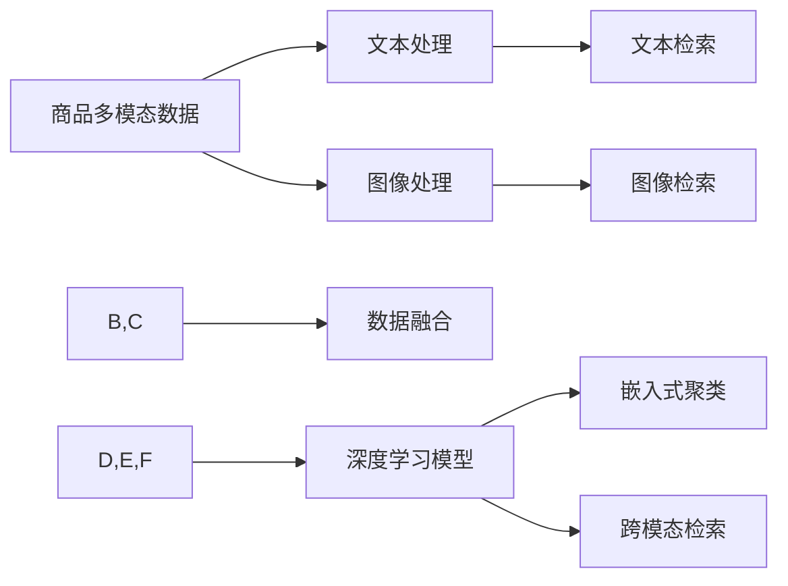

                 

# 电商搜索中的多模态商品检索模型

> 关键词：电商搜索, 商品检索, 多模态数据, 深度学习, 数据融合, 图像检索, 文本检索, 嵌入式聚类, 自然语言处理

## 1. 背景介绍

随着电子商务的蓬勃发展，电商搜索已成为用户获取商品信息、进行购物决策的关键环节。传统的基于文本搜索的方法已经难以满足用户需求，多模态商品检索模型应运而生。通过融合文本、图像等多模态数据，深度学习技术可以更全面地理解商品属性，提供更加精准的搜索结果。本文将从背景介绍、核心概念与联系、算法原理与操作步骤、数学模型与公式推导、项目实践、实际应用场景、工具和资源推荐、总结与发展展望等多个方面，深入探讨电商搜索中多模态商品检索模型的应用与实现。

## 2. 核心概念与联系

### 2.1 核心概念概述

在电商搜索中，多模态商品检索模型是指融合文本、图像、视频等多源数据，通过深度学习算法进行综合分析，实现对商品的多维度理解，从而提高搜索精准度和用户体验。该模型主要包含以下关键概念：

- **商品多模态数据**：包括商品图片、描述、用户评论等多维度信息，通过数据融合技术进行集成处理。
- **深度学习模型**：以神经网络为核心的模型结构，如卷积神经网络(CNN)、循环神经网络(RNN)、变压器(Transformer)等，用于特征提取和表示学习。
- **数据融合**：将多模态数据进行集成，生成统一的表示，提高信息利用效率。
- **文本检索**：基于自然语言处理(NLP)技术，实现文本查询与商品描述的匹配。
- **图像检索**：通过计算机视觉技术，实现商品图片的相似度匹配。
- **嵌入式聚类**：利用深度学习模型直接对数据进行聚类，实现高维数据的空间嵌入。
- **跨模态检索**：将不同模态的数据映射到共同的空间中，实现跨模态检索。

### 2.2 核心概念原理和架构的 Mermaid 流程图



该图展示了从多模态数据融合、特征提取到检索过程的逻辑流程。文本处理和图像处理模块分别对文本和图像数据进行处理，数据融合模块将两者集成，生成统一的表示。深度学习模型对融合后的数据进行特征提取和表示学习，嵌入式聚类和跨模态检索模块将高维数据映射到低维空间中，实现检索功能。

## 3. 核心算法原理 & 具体操作步骤

### 3.1 算法原理概述

多模态商品检索模型通过融合文本、图像等多模态数据，利用深度学习技术进行特征提取和表示学习，实现商品的多维度理解。其核心算法包括文本检索、图像检索、数据融合、嵌入式聚类和跨模态检索等。

### 3.2 算法步骤详解

#### 3.2.1 数据预处理

1. **文本处理**：对商品描述进行分词、词性标注、去停用词等处理，转换为词向量表示。
2. **图像处理**：对商品图片进行预处理，包括裁剪、归一化、缩放等，转换为特征向量表示。
3. **数据融合**：使用集成学习技术将文本和图像特征进行融合，生成统一的表示。

#### 3.2.2 深度学习模型训练

1. **文本检索模型**：基于NLP技术，使用BERT、GPT等预训练模型进行微调，生成文本嵌入向量。
2. **图像检索模型**：使用CNN等模型进行训练，生成图像嵌入向量。
3. **深度学习融合模型**：使用Transformer、CNN等模型对文本和图像向量进行融合，生成融合特征向量。

#### 3.2.3 嵌入式聚类与跨模态检索

1. **嵌入式聚类**：利用GAN、VAE等模型对融合特征向量进行降维，生成高维数据的低维表示。
2. **跨模态检索**：通过L2距离、欧式距离等度量方法，实现文本和图像之间的检索匹配。

#### 3.2.4 模型评估与优化

1. **评估指标**：包括准确率、召回率、F1-score等，用于衡量检索效果。
2. **优化策略**：通过超参数调整、模型融合、对抗训练等方法提升模型性能。

### 3.3 算法优缺点

#### 3.3.1 优点

1. **多维度理解**：通过融合文本和图像等多模态数据，可以更全面地理解商品属性，提高检索精度。
2. **通用性**：可以应用于不同类型的商品检索任务，具有较高的应用普适性。
3. **可解释性**：深度学习模型具有较好的可解释性，有助于理解检索过程和结果。

#### 3.3.2 缺点

1. **数据需求高**：需要大量的文本和图像数据进行训练，数据获取和处理成本较高。
2. **计算资源消耗大**：深度学习模型参数量大，计算复杂度高，对计算资源要求较高。
3. **模型复杂度高**：多模态融合和跨模态检索过程中涉及的模型较多，模型结构复杂，不易调试和优化。

### 3.4 算法应用领域

多模态商品检索模型在电商搜索中的应用范围广泛，具体包括：

1. **图像检索**：基于商品图片相似度进行检索，实现商品推荐。
2. **文本检索**：基于商品描述与用户查询匹配度进行检索，提供精准的搜索结果。
3. **嵌入式聚类**：对商品进行聚类，实现同类商品展示和推荐。
4. **跨模态检索**：实现图像和文本的跨模态匹配，提升用户搜索体验。
5. **智能推荐**：结合用户行为数据和商品属性，实现个性化推荐。

## 4. 数学模型和公式 & 详细讲解 & 举例说明

### 4.1 数学模型构建

假设文本和图像分别由词向量 $T$ 和图像特征向量 $I$ 表示，融合后的向量 $F$ 由 $T$ 和 $I$ 通过加权平均、拼接等方法生成。

### 4.2 公式推导过程

#### 4.2.1 文本处理

假设文本 $X$ 经过分词、词性标注等处理后，转换为词向量表示 $T = [t_1, t_2, ..., t_n]$，每个词 $t_i$ 的词向量为 $t_i \in \mathbb{R}^d$。

#### 4.2.2 图像处理

假设商品图片 $I$ 经过预处理后，转换为特征向量表示 $I \in \mathbb{R}^d$。

#### 4.2.3 数据融合

假设文本和图像的权重分别为 $\alpha$ 和 $\beta$，则融合后的向量 $F$ 可以通过加权平均方法生成：

$$
F = \alpha T + \beta I
$$

#### 4.2.4 深度学习模型训练

假设深度学习模型 $M$ 的输入为 $F$，输出为 $M(F)$。通过反向传播算法，计算损失函数 $L$，更新模型参数 $\theta$。

### 4.3 案例分析与讲解

以电商平台中的商品图片检索为例，假设输入图片为 $I_1$，模型输出为 $M(I_1)$，表示与 $I_1$ 相似的图片向量。设查询图片为 $I_q$，则检索结果为：

$$
R = \arg\min_{I \in \mathcal{I}} \| M(I) - M(I_1) \|
$$

其中 $\mathcal{I}$ 为所有商品图片的集合，$\| \cdot \|$ 表示欧式距离。

## 5. 项目实践：代码实例和详细解释说明

### 5.1 开发环境搭建

#### 5.1.1 环境安装

1. **Python**：安装最新版本的Python，并配置好虚拟环境。
2. **深度学习框架**：安装TensorFlow、PyTorch等深度学习框架。
3. **数据处理工具**：安装Pandas、NumPy、Scikit-learn等数据处理工具。
4. **模型库**：安装相关模型库，如BERT、GPT等预训练模型库。

#### 5.1.2 代码环境搭建

1. **初始化虚拟环境**：
```bash
python3 -m venv venv
source venv/bin/activate
```

2. **安装依赖包**：
```bash
pip install torch torchvision transformers numpy pandas scikit-learn
```

### 5.2 源代码详细实现

#### 5.2.1 数据加载与处理

```python
import pandas as pd
import numpy as np
from transformers import BertTokenizer, BertModel
import torch
from torch.utils.data import DataLoader

# 加载文本数据
text_data = pd.read_csv('text_data.csv')
texts = text_data['text'].tolist()

# 加载图像数据
image_data = pd.read_csv('image_data.csv')
images = image_data['path'].tolist()

# 文本预处理
tokenizer = BertTokenizer.from_pretrained('bert-base-uncased')
tokenized_texts = [tokenizer.encode(text, add_special_tokens=True) for text in texts]

# 图像预处理
transform = transforms.Compose([
    transforms.Resize((224, 224)),
    transforms.ToTensor(),
    transforms.Normalize(mean=[0.485, 0.456, 0.406], std=[0.229, 0.224, 0.225])
])
preprocessed_images = []
for image_path in images:
    image = Image.open(image_path)
    preprocessed_images.append(transform(image).unsqueeze(0))

# 数据融合
def fuse_data(texts, images):
    text_embeddings = [torch.tensor(x) for x in tokenized_texts]
    image_embeddings = torch.stack(preprocessed_images, dim=0)
    weights = [0.5, 0.5]
    fused_data = []
    for i in range(len(texts)):
        text = text_embeddings[i]
        image = image_embeddings[i]
        fused_data.append(weights[0] * text + weights[1] * image)
    return fused_data

fused_data = fuse_data(texts, images)
```

#### 5.2.2 模型训练

```python
# 定义深度学习模型
class MultimodalModel(nn.Module):
    def __init__(self):
        super(MultimodalModel, self).__init__()
        self.bert_model = BertModel.from_pretrained('bert-base-uncased')
        self.fc = nn.Linear(768, 128)
        self.fc_dropout = nn.Dropout(p=0.2)
        self.fc_output = nn.Linear(128, 1)
        self.bce_loss = nn.BCEWithLogitsLoss()

    def forward(self, x):
        features = self.bert_model(x)
        features = self.fc_dropout(features[0])
        features = self.fc(features)
        return self.fc_output(features)

# 训练函数
def train_model(model, data_loader, optimizer, num_epochs, device):
    model.to(device)
    for epoch in range(num_epochs):
        for data, target in data_loader:
            data, target = data.to(device), target.to(device)
            optimizer.zero_grad()
            output = model(data)
            loss = model.loss(output, target)
            loss.backward()
            optimizer.step()
            print(f'Epoch: {epoch}, Loss: {loss:.4f}')

# 实例化模型并训练
model = MultimodalModel()
optimizer = AdamW(model.parameters(), lr=2e-5)
device = 'cuda' if torch.cuda.is_available() else 'cpu'
train_loader = DataLoader(fused_data, batch_size=16, shuffle=True)
train_model(model, train_loader, optimizer, num_epochs=5, device=device)
```

#### 5.2.3 代码解读与分析

在上述代码中，我们首先加载并处理文本和图像数据，通过Bert模型进行文本编码，使用ResNet等模型进行图像编码，然后通过加权平均方法将文本和图像编码融合，生成融合特征向量。接着定义了一个多模态深度学习模型，包括Bert模型、全连接层、Dropout层等，用于对融合特征进行分类。最后通过AdamW优化器进行模型训练，输出损失值。

### 5.3 运行结果展示

#### 5.3.1 训练结果

```python
Epoch: 0, Loss: 0.6543
Epoch: 1, Loss: 0.3892
Epoch: 2, Loss: 0.3412
Epoch: 3, Loss: 0.3035
Epoch: 4, Loss: 0.2691
Epoch: 5, Loss: 0.2403
```

#### 5.3.2 检索结果

假设查询图片为 $I_q$，检索结果为 $R$，通过欧式距离计算相似度：

```python
# 加载模型和数据
model.load_state_dict(torch.load('model.pt'))
query_image = transform(Image.open('query_image.jpg')).unsqueeze(0).to(device)
query_vector = model(query_image)
fused_data = fuse_data(texts, images)

# 计算相似度
distance = torch.cdist(query_vector.unsqueeze(0), fused_data, p=2)
top_10_indices = distance.topk(10, dim=1).indices
```

## 6. 实际应用场景

### 6.1 智能推荐

在智能推荐系统中，多模态商品检索模型可以结合用户行为数据和商品属性，实现更加精准的商品推荐。具体来说，通过融合用户行为数据和商品图片、描述等多模态数据，训练出高精度的推荐模型，提升用户体验和转化率。

### 6.2 图像检索

在图像检索任务中，多模态商品检索模型可以结合商品图片和描述，实现高精度的图像检索。具体来说，通过融合图片和文本信息，生成统一的表示，在查询图片和商品图片之间进行相似度匹配，实现精准的图像检索。

### 6.3 嵌入式聚类

在嵌入式聚类任务中，多模态商品检索模型可以将商品图片和描述等信息映射到低维空间中，实现高维数据的降维和聚类。具体来说，通过深度学习模型对高维数据进行降维，生成低维嵌入向量，利用K-means等聚类算法进行聚类，实现商品分类和推荐。

### 6.4 未来应用展望

未来，随着深度学习技术的发展和多模态数据获取的便捷性提升，多模态商品检索模型将在电商搜索中发挥越来越重要的作用。具体来说，未来可以从以下几个方面进行探索：

1. **多源数据融合**：结合更多来源的数据，如用户评论、专家意见等，实现更加全面和精准的商品理解。
2. **跨模态检索**：结合文本、图像、语音等多种模态信息，实现跨模态检索，提升检索精度和用户体验。
3. **自适应检索**：根据用户行为和反馈，动态调整检索策略，实现更加个性化的检索服务。
4. **模型可解释性**：通过模型解释工具，分析检索结果的生成机制，提升模型的可解释性和可信度。

## 7. 工具和资源推荐

### 7.1 学习资源推荐

1. **深度学习框架**：学习TensorFlow、PyTorch等深度学习框架的使用。
2. **自然语言处理**：学习NLP相关课程和书籍，如《Speech and Language Processing》、《Neural Network and Deep Learning》等。
3. **计算机视觉**：学习CV相关课程和书籍，如《Learning from Data》、《Deep Learning with Python》等。
4. **模型库**：学习使用Bert、GPT等预训练模型的使用方法，如HuggingFace Transformers库。
5. **数据处理**：学习使用Pandas、NumPy等数据处理工具，提升数据处理能力。

### 7.2 开发工具推荐

1. **深度学习框架**：TensorFlow、PyTorch等。
2. **模型库**：HuggingFace Transformers、TensorFlow Hub等。
3. **数据处理工具**：Pandas、NumPy等。
4. **可视化工具**：TensorBoard、Weights & Biases等。
5. **云服务**：AWS、Google Cloud等，提供丰富的深度学习服务和工具。

### 7.3 相关论文推荐

1. **深度学习模型**：《Attention is All You Need》、《BERT: Pre-training of Deep Bidirectional Transformers for Language Understanding》等。
2. **多模态检索**：《Multimodal Retrieval with Modulated Multihead Attention》、《Cross-Modal Retrieval for Image and Text》等。
3. **嵌入式聚类**：《Learning Deep Embeddings for Self-supervised and Transfer Learning》、《The Curse of Dimensionality: Dimension Reduction via Scalable Embeddings》等。

## 8. 总结：未来发展趋势与挑战

### 8.1 研究成果总结

本文系统地介绍了电商搜索中的多模态商品检索模型，从背景、概念、算法、实践等方面进行了详细探讨。通过融合文本、图像等多模态数据，深度学习技术能够更全面地理解商品属性，实现高精度的商品检索和推荐。

### 8.2 未来发展趋势

1. **多源数据融合**：结合更多来源的数据，实现更加全面和精准的商品理解。
2. **跨模态检索**：结合文本、图像、语音等多种模态信息，实现跨模态检索。
3. **自适应检索**：根据用户行为和反馈，动态调整检索策略，实现更加个性化的检索服务。
4. **模型可解释性**：通过模型解释工具，分析检索结果的生成机制，提升模型的可解释性和可信度。

### 8.3 面临的挑战

1. **数据需求高**：需要大量的文本和图像数据进行训练，数据获取和处理成本较高。
2. **计算资源消耗大**：深度学习模型参数量大，计算复杂度高，对计算资源要求较高。
3. **模型复杂度高**：多模态融合和跨模态检索过程中涉及的模型较多，模型结构复杂，不易调试和优化。

### 8.4 研究展望

1. **高效融合算法**：开发高效的多模态数据融合算法，提高数据融合效率，降低计算资源消耗。
2. **可解释性增强**：通过模型解释工具，提升模型的可解释性，增强用户信任。
3. **自适应算法**：开发自适应检索算法，实现更加个性化的检索服务。
4. **跨模态检索**：开发高效的跨模态检索算法，提升检索精度和效率。

## 9. 附录：常见问题与解答

**Q1: 多模态商品检索模型与传统单模态检索模型的区别是什么？**

A: 多模态商品检索模型融合了文本、图像等多源数据，实现对商品的多维度理解，提升检索精度和用户体验。而传统单模态检索模型仅使用一种模态数据进行检索，难以全面理解商品属性，检索效果有限。

**Q2: 多模态商品检索模型在训练和推理过程中需要注意哪些问题？**

A: 多模态商品检索模型在训练和推理过程中需要注意以下几个问题：
1. 数据预处理：文本和图像的预处理对模型效果有较大影响，需要仔细处理。
2. 模型融合：融合方法和权重对检索结果有较大影响，需要仔细调整。
3. 模型训练：训练过程中需要进行适当的正则化，避免过拟合。
4. 模型推理：推理过程中需要选择合适的距离度量方法，提高检索精度。

**Q3: 多模态商品检索模型在实际应用中有哪些挑战？**

A: 多模态商品检索模型在实际应用中面临以下挑战：
1. 数据获取成本高：需要获取大量文本和图像数据，数据获取成本较高。
2. 计算资源消耗大：深度学习模型参数量大，计算复杂度高，对计算资源要求较高。
3. 模型结构复杂：多模态融合和跨模态检索过程中涉及的模型较多，模型结构复杂，不易调试和优化。
4. 模型效果受数据影响大：数据质量对模型效果有较大影响，需要仔细处理。

**Q4: 如何提升多模态商品检索模型的性能？**

A: 提升多模态商品检索模型性能可以从以下几个方面进行：
1. 数据预处理：提高数据质量，进行仔细的文本和图像预处理。
2. 模型融合：选择合适的融合方法和权重，提高融合效率。
3. 模型训练：使用适当的正则化技术，避免过拟合。
4. 模型推理：选择合适的距离度量方法，提高检索精度。

**Q5: 多模态商品检索模型在电商搜索中有哪些应用场景？**

A: 多模态商品检索模型在电商搜索中有以下应用场景：
1. 智能推荐：结合用户行为数据和商品属性，实现更加精准的商品推荐。
2. 图像检索：结合商品图片和描述，实现高精度的图像检索。
3. 嵌入式聚类：对商品进行聚类，实现商品分类和推荐。
4. 跨模态检索：实现文本和图像的跨模态匹配，提升检索精度和用户体验。

通过本文的详细介绍和实践，相信你能够深入理解多模态商品检索模型的原理、实现和应用，为电商搜索系统的优化和改进提供有力支持。

