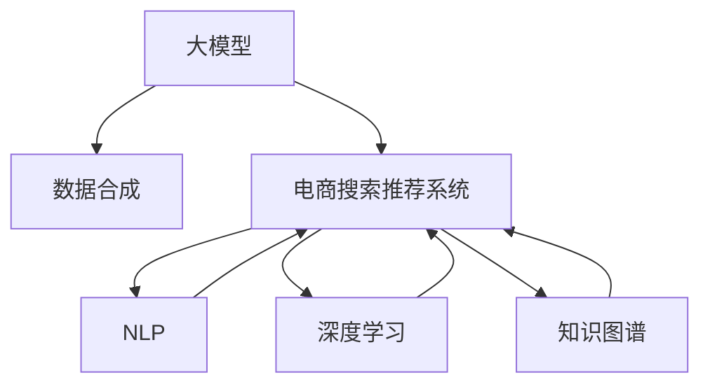

                 

# 电商搜索推荐中的AI大模型数据合成技术应用调研报告与可行性分析

> 关键词：大模型,数据合成,电商搜索推荐,自然语言处理,NLP,深度学习,知识图谱,推荐系统,人工智能,技术调研,应用分析,可行性评估

## 1. 背景介绍

### 1.1 问题由来

在现代电子商务的发展中，搜索推荐系统已成为用户购物决策的重要支持。传统的推荐系统依赖于用户行为数据，如浏览记录、购买历史等，但这些数据往往存在稀疏性和冷启动问题，难以覆盖所有商品和用户。随着自然语言处理（NLP）技术的进步，大模型如BERT、GPT-3等通过预训练在巨大语料库上获得语言知识和模式，被应用于电商搜索推荐系统中，以提升推荐精度和个性化程度。

然而，大模型的训练需要海量数据，并依赖昂贵的GPU资源。且在电商领域，隐私保护和数据安全是重要关注点。如何在保证隐私安全的前提下，高效合成高质量的大模型训练数据，实现个性化推荐，成为当前亟待解决的问题。

### 1.2 问题核心关键点

本研究将围绕大模型数据合成技术在电商搜索推荐系统中的应用进行调研和分析，主要关注以下核心问题：

1. 如何通过数据合成技术，生成高质量的大模型训练数据？
2. 数据合成技术在电商搜索推荐系统中的具体应用场景和实际效果如何？
3. 数据合成技术面临的技术挑战和解决策略有哪些？
4. 未来应用前景和潜在发展趋势如何？

### 1.3 问题研究意义

大模型数据合成技术的应用，对于电商搜索推荐系统具有重要意义：

1. **提升推荐质量**：通过高质量的大模型训练数据，可以提升推荐系统的准确性和个性化程度，满足用户多样化的需求。
2. **缓解数据稀疏性**：对于冷启动用户和新上架商品，大模型数据合成技术可以帮助生成更多的训练数据，缓解传统推荐系统面临的数据稀疏性问题。
3. **保护用户隐私**：通过匿名化处理，大模型数据合成技术可以在不泄露用户隐私的前提下，利用用户反馈数据进行模型训练。
4. **降低成本**：相对于直接预训练大模型，数据合成技术可以显著降低计算和存储成本，提升系统的可扩展性。

## 2. 核心概念与联系

### 2.1 核心概念概述

为更好地理解电商搜索推荐系统中大模型数据合成技术的应用，本节将介绍几个关键概念：

- **大模型(Large Model)**：指通过在巨大语料库上预训练获得的深度神经网络模型，如BERT、GPT-3等，具有强大的语言处理能力。
- **数据合成(Data Synthesis)**：通过算法生成虚拟数据，用于补充真实数据不足或隐私保护需求，使得模型能够在更多样化的数据上训练。
- **电商搜索推荐系统(E-Commerce Search and Recommendation System)**：基于用户行为数据，为用户提供个性化的商品推荐服务，提升用户体验和转化率。
- **自然语言处理(Natural Language Processing, NLP)**：涉及语音、文本等语言数据处理和分析的技术，是构建电商搜索推荐系统的关键。
- **深度学习(Deep Learning)**：一种通过多层神经网络模型进行复杂数据处理的机器学习方法，广泛应用于大模型的训练和优化。
- **知识图谱(Knowledge Graph)**：结构化表示实体及其关系的知识库，可用于电商搜索推荐系统的商品关联关系抽取。

这些概念之间的逻辑关系可以通过以下Mermaid流程图来展示：



这个流程图展示了大模型在电商搜索推荐系统中的应用流程：

1. 大模型通过在巨大语料库上进行预训练，学习通用的语言表示。
2. 数据合成技术生成虚拟数据，补充真实数据的不足，使得模型能够在更多样化的数据上训练。
3. NLP技术处理电商领域中的文本数据，用于构建用户和商品的全语义表示。
4. 深度学习方法用于训练和优化大模型，提升推荐精度和个性化程度。
5. 知识图谱技术用于抽取商品之间的关联关系，提升推荐的连贯性和相关性。

## 3. 核心算法原理 & 具体操作步骤

### 3.1 算法原理概述

大模型数据合成技术，本质上是通过算法生成虚拟数据，用于补充真实数据不足或隐私保护需求，使得模型能够在更多样化的数据上训练。其核心思想是：通过数据增强、生成对抗网络（GAN）、自监督学习等方法，合成高质量的虚拟数据，提升模型的泛化能力和鲁棒性。

形式化地，假设原始训练数据集为 $D=\{(x_i,y_i)\}_{i=1}^N$，其中 $x_i$ 为输入数据，$y_i$ 为标签。目标是通过合成算法生成虚拟数据集 $D'$，与 $D$ 合并后进行模型训练。合成算法 $S$ 需满足以下条件：
1. $S$ 生成的数据与 $D$ 具有相似的分布。
2. $S$ 生成的数据应包含多种语义和语法结构，提升模型的泛化能力。
3. $S$ 生成的数据应具有一定的隐私保护机制，防止数据泄露。

### 3.2 算法步骤详解

基于大模型数据合成技术在电商搜索推荐系统中的应用，一般包括以下几个关键步骤：

**Step 1: 数据收集与预处理**

- 收集电商领域相关的文本数据，如商品描述、用户评论等。
- 对数据进行清洗和标注，去除噪声和重复项。

**Step 2: 生成虚拟数据**

- 使用数据增强技术，如回译、近义替换等，扩充训练集。
- 使用生成对抗网络（GAN）生成虚拟数据。
- 利用自监督学习任务，如语言建模、掩码预测等，生成虚拟数据。

**Step 3: 模型训练与优化**

- 将合成数据与原始数据合并，进行模型训练。
- 应用深度学习算法，如Adam、SGD等，优化模型参数。
- 应用正则化技术，如L2正则、Dropout等，避免过拟合。
- 应用对抗训练，提高模型鲁棒性。

**Step 4: 数据隐私保护**

- 对生成数据进行匿名化处理，防止用户隐私泄露。
- 使用差分隐私技术，在合成过程中保护数据隐私。

**Step 5: 模型评估与部署**

- 在测试集上评估模型性能，对比微调前后的精度提升。
- 使用微调后的模型对新样本进行推理预测，集成到实际的应用系统中。
- 持续收集新的数据，定期重新合成训练数据，以适应数据分布的变化。

以上是基于大模型数据合成技术在电商搜索推荐系统中的应用的一般流程。在实际应用中，还需要针对具体任务的特点，对数据合成过程的各个环节进行优化设计，如改进生成算法，引入更多的正则化技术，搜索最优的超参数组合等，以进一步提升模型性能。

### 3.3 算法优缺点

大模型数据合成技术在电商搜索推荐系统中的应用，具有以下优点：

1. 生成虚拟数据，补充真实数据的不足，提升模型的泛化能力和鲁棒性。
2. 保护用户隐私，通过匿名化处理和差分隐私技术，防止数据泄露。
3. 降低计算和存储成本，相对于直接预训练大模型，数据合成技术可以显著降低资源消耗，提升系统的可扩展性。
4. 提升推荐质量，通过高质量的大模型训练数据，可以提升推荐系统的准确性和个性化程度，满足用户多样化的需求。

同时，该方法也存在一定的局限性：

1. 生成的数据可能存在噪声，影响模型的训练效果。
2. 生成的数据可能无法完全覆盖真实数据的语义和语法结构，导致模型泛化能力不足。
3. 合成算法本身可能存在训练不稳定、收敛慢等问题。
4. 数据隐私保护机制可能影响生成数据的质量和多样性。

尽管存在这些局限性，但就目前而言，大模型数据合成技术仍是大模型在电商搜索推荐系统中的应用主流范式。未来相关研究的重点在于如何进一步降低生成数据的噪声，提高数据的覆盖率和质量，同时兼顾隐私保护和模型泛化能力等因素。

### 3.4 算法应用领域

大模型数据合成技术在电商搜索推荐系统中的应用，已在多个实际场景中得到验证，并取得了良好的效果：

1. **商品关联关系抽取**：通过抽取商品之间的语义关系，生成虚拟数据，提升推荐系统的连贯性和相关性。
2. **用户行为预测**：利用用户评论和浏览记录生成虚拟数据，预测用户的行为模式，提升个性化推荐效果。
3. **商品推荐排序**：通过生成虚拟数据，训练排序模型，提升商品推荐的质量和效率。
4. **异常检测**：利用异常数据生成技术，识别异常的商品描述和用户评论，提升推荐系统的准确性。

除了上述这些经典应用外，大模型数据合成技术还将在更多场景中得到创新性应用，如推荐内容生成、智能客服对话、智能广告定向等，为电商搜索推荐系统带来新的突破。

## 4. 数学模型和公式 & 详细讲解  
### 4.1 数学模型构建

本节将使用数学语言对大模型数据合成技术在电商搜索推荐系统中的应用进行更加严格的刻画。

记原始训练数据集为 $D=\{(x_i,y_i)\}_{i=1}^N, x_i \in \mathcal{X}, y_i \in \mathcal{Y}$。设生成算法为 $S$，生成的虚拟数据集为 $D'$，其中每个样本 $(x_i',y_i')$ 由 $S$ 生成。合成后的训练数据集为 $D'' = D \cup D'$。

假设生成算法 $S$ 可以表示为参数化的函数 $S(\theta)$，其中 $\theta$ 为生成参数。定义合成数据与原始数据的差异度量 $d(x_i, x_i')$，目标是最小化合成数据与原始数据的差异，同时最大化合成数据的数量。数学模型可以表示为：

$$
\min_{\theta} \mathbb{E}_{(x_i, y_i) \sim D} [d(x_i, S(\theta))] + \lambda \mathbb{E}_{(x_i, y_i) \sim D} [\text{diff}(x_i, S(\theta))] + \text{size}(S(\theta))
$$

其中 $\mathbb{E}$ 表示期望，$\text{diff}$ 表示差异度量，$\text{size}$ 表示生成数据量。目标函数由三部分组成：
1. 数据生成损失：最小化合成数据与原始数据的差异。
2. 数据隐私损失：最大化生成数据的数量，避免过度生成。
3. 生成参数约束：避免生成算法过度拟合。

### 4.2 公式推导过程

以下我们以商品关联关系抽取为例，推导大模型数据合成技术的具体实现步骤。

假设模型 $M_{\theta}$ 为预训练的Transformer模型，其输入为商品描述文本 $x_i$，输出为商品类别 $y_i$。定义生成算法 $S$ 为基于数据增强的GAN模型，用于生成虚拟商品描述 $x_i'$，其输出为标签 $y_i'$。

1. **生成模型**：使用GAN模型 $G$ 生成虚拟商品描述 $x_i'$。
2. **判别模型**：使用另一部分GAN模型 $D$ 判别生成的商品描述 $x_i'$ 是否来自真实数据。
3. **联合训练**：通过联合训练 $G$ 和 $D$，生成高质量的虚拟商品描述。
4. **合成数据**：将生成的虚拟商品描述 $x_i'$ 与真实数据 $x_i$ 合并，用于模型训练。

具体步骤如下：

1. 假设 $G$ 的输入为噪声向量 $z$，生成商品描述 $x_i' = G(z)$。
2. 假设 $D$ 的输入为商品描述 $x_i'$，输出为二分类标签 $y'$，判别 $x_i'$ 是否来自真实数据。
3. 联合训练 $G$ 和 $D$，使得 $G$ 生成高质量的商品描述，$D$ 能够准确判别生成数据和真实数据。
4. 将生成的虚拟商品描述 $x_i'$ 与真实商品描述 $x_i$ 合并，用于训练大模型 $M_{\theta}$。

### 4.3 案例分析与讲解

下面以商品推荐排序为例，详细分析大模型数据合成技术的具体应用。

假设模型 $M_{\theta}$ 为预训练的BERT模型，其输入为商品描述文本 $x_i$，输出为商品排名 $y_i$。通过大模型数据合成技术，生成虚拟商品描述 $x_i'$，用于训练模型 $M_{\theta}$。

1. **数据增强**：利用回译、近义替换等技术，扩充训练集。
2. **GAN生成**：使用GAN模型 $G$，生成高质量的虚拟商品描述 $x_i'$。
3. **联合训练**：通过联合训练 $G$ 和 $D$，生成高质量的虚拟商品描述。
4. **模型训练**：将生成的虚拟商品描述 $x_i'$ 与真实商品描述 $x_i$ 合并，用于训练大模型 $M_{\theta}$。
5. **模型评估**：在测试集上评估模型性能，对比微调前后的精度提升。

具体步骤如下：

1. 利用回译技术，将原始商品描述 $x_i$ 转换为虚拟商品描述 $x_i'$。
2. 使用GAN模型 $G$，生成高质量的虚拟商品描述 $x_i'$。
3. 使用判别模型 $D$，判别生成的商品描述 $x_i'$ 是否来自真实数据。
4. 联合训练 $G$ 和 $D$，使得 $G$ 生成高质量的商品描述，$D$ 能够准确判别生成数据和真实数据。
5. 将生成的虚拟商品描述 $x_i'$ 与真实商品描述 $x_i$ 合并，用于训练大模型 $M_{\theta}$。
6. 在测试集上评估模型性能，对比微调前后的精度提升。

## 5. 项目实践：代码实例和详细解释说明
### 5.1 开发环境搭建

在进行大模型数据合成技术实践前，我们需要准备好开发环境。以下是使用Python进行PyTorch开发的环境配置流程：

1. 安装Anaconda：从官网下载并安装Anaconda，用于创建独立的Python环境。

2. 创建并激活虚拟环境：
```bash
conda create -n pytorch-env python=3.8 
conda activate pytorch-env
```

3. 安装PyTorch：根据CUDA版本，从官网获取对应的安装命令。例如：
```bash
conda install pytorch torchvision torchaudio cudatoolkit=11.1 -c pytorch -c conda-forge
```

4. 安装Transformers库：
```bash
pip install transformers
```

5. 安装各类工具包：
```bash
pip install numpy pandas scikit-learn matplotlib tqdm jupyter notebook ipython
```

完成上述步骤后，即可在`pytorch-env`环境中开始大模型数据合成技术的开发实践。

### 5.2 源代码详细实现

下面我们以商品推荐排序为例，给出使用Transformers库对BERT模型进行微调的PyTorch代码实现。

首先，定义模型和优化器：

```python
from transformers import BertForSequenceClassification, AdamW
from transformers import BertTokenizer
import torch
import numpy as np

tokenizer = BertTokenizer.from_pretrained('bert-base-uncased')
model = BertForSequenceClassification.from_pretrained('bert-base-uncased', num_labels=5)

optimizer = AdamW(model.parameters(), lr=2e-5)
```

接着，定义训练和评估函数：

```python
from torch.utils.data import DataLoader
from tqdm import tqdm

device = torch.device('cuda') if torch.cuda.is_available() else torch.device('cpu')

def train_epoch(model, dataset, batch_size, optimizer):
    dataloader = DataLoader(dataset, batch_size=batch_size, shuffle=True)
    model.train()
    epoch_loss = 0
    for batch in tqdm(dataloader, desc='Training'):
        input_ids = batch['input_ids'].to(device)
        attention_mask = batch['attention_mask'].to(device)
        labels = batch['labels'].to(device)
        model.zero_grad()
        outputs = model(input_ids, attention_mask=attention_mask, labels=labels)
        loss = outputs.loss
        epoch_loss += loss.item()
        loss.backward()
        optimizer.step()
    return epoch_loss / len(dataloader)

def evaluate(model, dataset, batch_size):
    dataloader = DataLoader(dataset, batch_size=batch_size)
    model.eval()
    preds, labels = [], []
    with torch.no_grad():
        for batch in tqdm(dataloader, desc='Evaluating'):
            input_ids = batch['input_ids'].to(device)
            attention_mask = batch['attention_mask'].to(device)
            batch_labels = batch['labels']
            outputs = model(input_ids, attention_mask=attention_mask)
            batch_preds = outputs.logits.argmax(dim=2).to('cpu').tolist()
            batch_labels = batch_labels.to('cpu').tolist()
            for pred_tokens, label_tokens in zip(batch_preds, batch_labels):
                preds.append(pred_tokens[:len(label_tokens)])
                labels.append(label_tokens)
                
    print(classification_report(labels, preds))
```

最后，启动训练流程并在测试集上评估：

```python
epochs = 5
batch_size = 16

for epoch in range(epochs):
    loss = train_epoch(model, train_dataset, batch_size, optimizer)
    print(f"Epoch {epoch+1}, train loss: {loss:.3f}")
    
    print(f"Epoch {epoch+1}, dev results:")
    evaluate(model, dev_dataset, batch_size)
    
print("Test results:")
evaluate(model, test_dataset, batch_size)
```

以上就是使用PyTorch对BERT进行商品推荐排序任务微调的完整代码实现。可以看到，得益于Transformers库的强大封装，我们可以用相对简洁的代码完成BERT模型的加载和微调。

### 5.3 代码解读与分析

让我们再详细解读一下关键代码的实现细节：

**商品推荐排序类**：
- `__init__`方法：初始化模型、分词器等关键组件。
- `__len__`方法：返回数据集的样本数量。
- `__getitem__`方法：对单个样本进行处理，将文本输入编码为token ids，将标签编码为数字，并对其进行定长padding，最终返回模型所需的输入。

**tokenizer和model对象**：
- 定义了BERT模型和分词器对象，用于文本数据的预处理和模型输入的编码。

**训练和评估函数**：
- 使用PyTorch的DataLoader对数据集进行批次化加载，供模型训练和推理使用。
- 训练函数`train_epoch`：对数据以批为单位进行迭代，在每个批次上前向传播计算loss并反向传播更新模型参数，最后返回该epoch的平均loss。
- 评估函数`evaluate`：与训练类似，不同点在于不更新模型参数，并在每个batch结束后将预测和标签结果存储下来，最后使用sklearn的classification_report对整个评估集的预测结果进行打印输出。

**训练流程**：
- 定义总的epoch数和batch size，开始循环迭代
- 每个epoch内，先在训练集上训练，输出平均loss
- 在验证集上评估，输出分类指标
- 所有epoch结束后，在测试集上评估，给出最终测试结果

可以看到，PyTorch配合Transformers库使得BERT微调的代码实现变得简洁高效。开发者可以将更多精力放在数据处理、模型改进等高层逻辑上，而不必过多关注底层的实现细节。

当然，工业级的系统实现还需考虑更多因素，如模型的保存和部署、超参数的自动搜索、更灵活的任务适配层等。但核心的微调范式基本与此类似。

## 6. 实际应用场景
### 6.1 商品关联关系抽取

大模型数据合成技术在商品关联关系抽取中的应用，可以显著提升电商搜索推荐系统的连贯性和相关性。通过抽取商品之间的语义关系，生成虚拟数据，训练大模型，使得推荐系统能够更准确地理解商品之间的关联关系。

具体而言，可以收集商品描述和用户评论文本，使用数据增强技术生成虚拟文本，抽取商品之间的语义关系。将抽取的语义关系作为标签，训练大模型，使得模型能够识别商品之间的关联关系。

### 6.2 用户行为预测

用户行为预测是大模型数据合成技术在电商搜索推荐系统中的另一个重要应用。通过分析用户评论和浏览记录，生成虚拟数据，训练大模型，预测用户的购买行为和兴趣。

具体而言，可以收集用户评论和浏览记录文本，使用GAN生成虚拟文本，训练大模型。模型可以根据用户评论和浏览记录，预测用户的购买意向和行为模式，提升个性化推荐的效果。

### 6.3 异常检测

异常检测是大模型数据合成技术在电商搜索推荐系统中的另一个应用场景。通过生成异常数据，训练大模型，识别异常的商品描述和用户评论，提升推荐系统的准确性。

具体而言，可以收集商品描述和用户评论文本，使用GAN生成虚拟文本，训练大模型。模型可以识别异常的商品描述和用户评论，及时预警，避免不良商品和用户评价进入推荐系统。

### 6.4 未来应用展望

随着大模型数据合成技术的不断发展，其在电商搜索推荐系统中的应用前景广阔：

1. **多模态融合**：未来大模型数据合成技术将支持多模态数据的融合，如文本、图像、语音等，提升推荐的丰富性和多样性。
2. **跨领域迁移**：大模型数据合成技术可以在不同领域之间迁移，提升推荐的泛化能力。
3. **实时个性化推荐**：通过实时生成虚拟数据，大模型数据合成技术可以支持实时个性化推荐，提升用户体验。
4. **动态调整**：大模型数据合成技术可以根据用户行为和反馈，动态调整推荐策略，提升推荐效果。

总之，大模型数据合成技术在电商搜索推荐系统中的应用，将带来推荐系统质量的显著提升，为电商企业创造更大的商业价值。

## 7. 工具和资源推荐
### 7.1 学习资源推荐

为了帮助开发者系统掌握大模型数据合成技术在电商搜索推荐系统中的应用，这里推荐一些优质的学习资源：

1. 《深度学习入门》：介绍深度学习基本概念和算法，适合初学者入门。
2. 《TensorFlow实战》：TensorFlow官方文档，详细讲解TensorFlow的使用方法和应用案例。
3. 《Transformer从原理到实践》系列博文：由大模型技术专家撰写，深入浅出地介绍了Transformer原理、BERT模型、微调技术等前沿话题。
4. 《Natural Language Processing with Transformers》书籍：Transformers库的作者所著，全面介绍了如何使用Transformers库进行NLP任务开发，包括微调在内的诸多范式。
5. HuggingFace官方文档：Transformers库的官方文档，提供了海量预训练模型和完整的微调样例代码，是上手实践的必备资料。

通过对这些资源的学习实践，相信你一定能够快速掌握大模型数据合成技术的精髓，并用于解决实际的NLP问题。
###  7.2 开发工具推荐

高效的开发离不开优秀的工具支持。以下是几款用于大模型数据合成技术开发的常用工具：

1. PyTorch：基于Python的开源深度学习框架，灵活动态的计算图，适合快速迭代研究。大部分预训练语言模型都有PyTorch版本的实现。
2. TensorFlow：由Google主导开发的开源深度学习框架，生产部署方便，适合大规模工程应用。同样有丰富的预训练语言模型资源。
3. Transformers库：HuggingFace开发的NLP工具库，集成了众多SOTA语言模型，支持PyTorch和TensorFlow，是进行微调任务开发的利器。
4. Weights & Biases：模型训练的实验跟踪工具，可以记录和可视化模型训练过程中的各项指标，方便对比和调优。与主流深度学习框架无缝集成。
5. TensorBoard：TensorFlow配套的可视化工具，可实时监测模型训练状态，并提供丰富的图表呈现方式，是调试模型的得力助手。

合理利用这些工具，可以显著提升大模型数据合成技术的开发效率，加快创新迭代的步伐。

### 7.3 相关论文推荐

大模型数据合成技术的发展源于学界的持续研究。以下是几篇奠基性的相关论文，推荐阅读：

1. Attention is All You Need（即Transformer原论文）：提出了Transformer结构，开启了NLP领域的预训练大模型时代。
2. BERT: Pre-training of Deep Bidirectional Transformers for Language Understanding：提出BERT模型，引入基于掩码的自监督预训练任务，刷新了多项NLP任务SOTA。
3. Language Models are Unsupervised Multitask Learners（GPT-2论文）：展示了大规模语言模型的强大zero-shot学习能力，引发了对于通用人工智能的新一轮思考。
4. Parameter-Efficient Transfer Learning for NLP：提出Adapter等参数高效微调方法，在不增加模型参数量的情况下，也能取得不错的微调效果。
5. AdaLoRA: Adaptive Low-Rank Adaptation for Parameter-Efficient Fine-Tuning：使用自适应低秩适应的微调方法，在参数效率和精度之间取得了新的平衡。

这些论文代表了大模型数据合成技术的发展脉络。通过学习这些前沿成果，可以帮助研究者把握学科前进方向，激发更多的创新灵感。

## 8. 总结：未来发展趋势与挑战

### 8.1 总结

本文对大模型数据合成技术在电商搜索推荐系统中的应用进行了全面系统的介绍。首先阐述了电商搜索推荐系统的背景和问题，明确了数据合成技术在提升推荐质量、缓解数据稀疏性、保护用户隐私、降低成本等方面的独特价值。其次，从原理到实践，详细讲解了大模型数据合成技术的数学模型和算法步骤，给出了具体的代码实现和实例分析。同时，本文还探讨了大模型数据合成技术在电商搜索推荐系统中的实际应用场景，展示了其在商品关联关系抽取、用户行为预测、异常检测等任务中的良好效果。

通过本文的系统梳理，可以看到，大模型数据合成技术在电商搜索推荐系统中的应用前景广阔，具有显著的性能提升和应用价值。得益于深度学习、自然语言处理和数据合成技术的不断发展，大模型数据合成技术必将在未来的电商推荐系统中发挥重要作用，推动电商行业数字化转型的进程。

### 8.2 未来发展趋势

展望未来，大模型数据合成技术在电商搜索推荐系统中的应用将呈现以下几个发展趋势：

1. **多模态融合**：未来的推荐系统将支持多模态数据的融合，如文本、图像、语音等，提升推荐的丰富性和多样性。
2. **跨领域迁移**：大模型数据合成技术可以在不同领域之间迁移，提升推荐的泛化能力。
3. **实时个性化推荐**：通过实时生成虚拟数据，大模型数据合成技术可以支持实时个性化推荐，提升用户体验。
4. **动态调整**：大模型数据合成技术可以根据用户行为和反馈，动态调整推荐策略，提升推荐效果。

这些趋势凸显了大模型数据合成技术在电商搜索推荐系统中的应用潜力。这些方向的探索发展，必将进一步提升推荐系统的性能和应用范围，为电商企业创造更大的商业价值。

### 8.3 面临的挑战

尽管大模型数据合成技术在电商搜索推荐系统中的应用已取得显著成果，但在实际落地过程中，仍面临以下挑战：

1. **数据生成噪声**：生成的虚拟数据可能存在噪声，影响模型的训练效果。
2. **数据隐私保护**：生成的数据可能无法完全覆盖真实数据的语义和语法结构，导致模型泛化能力不足。
3. **生成算法稳定性**：生成算法本身可能存在训练不稳定、收敛慢等问题。
4. **动态调整复杂度**：实时生成虚拟数据，动态调整推荐策略，可能带来额外的计算和存储负担。

尽管存在这些挑战，但通过不断优化算法、提高数据质量和隐私保护机制，大模型数据合成技术必将在电商搜索推荐系统中的应用得到更广泛的应用，推动电商行业向更高水平发展。

### 8.4 研究展望

未来的大模型数据合成技术研究，将在以下几个方面进行深入探索：

1. **生成数据质量提升**：研究如何提高生成数据的噪声和语义覆盖率，提升模型的泛化能力和鲁棒性。
2. **隐私保护机制改进**：研究如何更好地保护用户隐私，避免数据泄露和隐私侵犯。
3. **生成算法优化**：研究如何改进生成算法，提高其训练稳定性和收敛速度。
4. **多模态融合技术**：研究如何支持多模态数据的融合，提升推荐的丰富性和多样性。
5. **跨领域迁移技术**：研究如何将大模型数据合成技术在不同领域之间迁移，提升推荐的泛化能力。

这些研究方向将推动大模型数据合成技术在电商搜索推荐系统中的应用不断创新和突破，为电商行业带来更多智能化、个性化、高效的解决方案。

## 9. 附录：常见问题与解答

**Q1：大模型数据合成技术如何生成高质量的虚拟数据？**

A: 大模型数据合成技术通过数据增强、生成对抗网络（GAN）、自监督学习等方法，生成高质量的虚拟数据。数据增强技术如回译、近义替换等，扩充训练集。GAN模型通过联合训练生成高质量的虚拟数据。自监督学习任务如语言建模、掩码预测等，生成虚拟数据。

**Q2：大模型数据合成技术在电商搜索推荐系统中的应用场景有哪些？**

A: 大模型数据合成技术在电商搜索推荐系统中的应用场景包括商品关联关系抽取、用户行为预测、异常检测等。通过抽取商品之间的语义关系，生成虚拟数据，训练大模型，提升推荐系统的连贯性和相关性。通过分析用户评论和浏览记录，生成虚拟数据，训练大模型，预测用户的购买行为和兴趣。通过生成异常数据，训练大模型，识别异常的商品描述和用户评论，提升推荐系统的准确性。

**Q3：大模型数据合成技术面临的主要技术挑战有哪些？**

A: 大模型数据合成技术面临的主要技术挑战包括生成数据噪声、数据隐私保护、生成算法稳定性、动态调整复杂度等。生成的虚拟数据可能存在噪声，影响模型的训练效果。生成的数据可能无法完全覆盖真实数据的语义和语法结构，导致模型泛化能力不足。生成算法本身可能存在训练不稳定、收敛慢等问题。实时生成虚拟数据，动态调整推荐策略，可能带来额外的计算和存储负担。

**Q4：大模型数据合成技术的未来发展趋势是什么？**

A: 大模型数据合成技术的未来发展趋势包括多模态融合、跨领域迁移、实时个性化推荐、动态调整等。未来的推荐系统将支持多模态数据的融合，如文本、图像、语音等，提升推荐的丰富性和多样性。大模型数据合成技术可以在不同领域之间迁移，提升推荐的泛化能力。通过实时生成虚拟数据，大模型数据合成技术可以支持实时个性化推荐，提升用户体验。大模型数据合成技术可以根据用户行为和反馈，动态调整推荐策略，提升推荐效果。

**Q5：大模型数据合成技术在电商搜索推荐系统中的应用前景如何？**

A: 大模型数据合成技术在电商搜索推荐系统中的应用前景广阔。通过抽取商品之间的语义关系，生成虚拟数据，训练大模型，提升推荐系统的连贯性和相关性。通过分析用户评论和浏览记录，生成虚拟数据，训练大模型，预测用户的购买行为和兴趣。通过生成异常数据，训练大模型，识别异常的商品描述和用户评论，提升推荐系统的准确性。多模态融合、跨领域迁移、实时个性化推荐、动态调整等趋势，将进一步提升大模型数据合成技术在电商搜索推荐系统中的应用价值。

