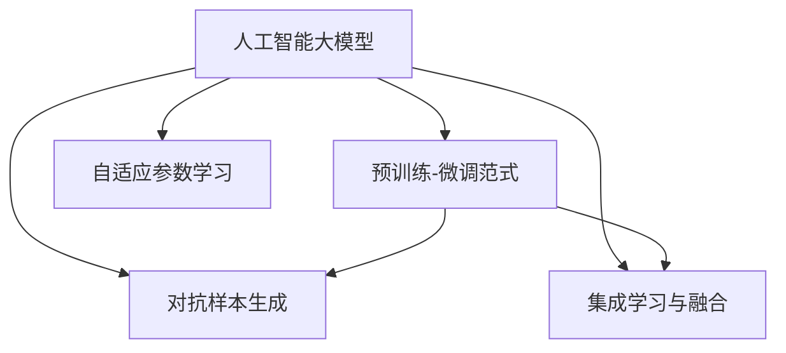

                 

# 电商搜索推荐中的AI大模型数据噪声处理技术应用调研报告

## 1. 背景介绍

### 1.1 问题由来

随着电子商务平台的迅速发展，人工智能技术在电商搜索推荐系统中的应用日益广泛。然而，由于用户行为数据的多样性和复杂性，搜索推荐系统面临诸多数据噪声问题。诸如用户输入的拼写错误、信息不完全、恶意操作等噪声，严重影响系统的推荐效果和用户体验。

为了提升电商搜索推荐的准确性和个性化程度，需要在数据预处理阶段进行有效的噪声处理。人工智能大模型凭借其强大的表征能力和泛化能力，在处理复杂噪声数据方面展现了巨大潜力。然而，大模型处理数据噪声的机制和效果尚未深入研究，本文将对此进行系统调研，总结并提出一些实用的解决方案。

### 1.2 问题核心关键点

在电商搜索推荐中，数据噪声处理旨在通过数据清洗、噪声过滤、异常检测等手段，提升数据质量，从而提高推荐的准确性和个性化。人工智能大模型在数据噪声处理中，可通过以下几个关键技术手段实现：

- **预训练-微调范式**：利用大模型在大量无标签数据上预训练，然后通过有标签数据进行微调，增强对噪声数据的鲁棒性。
- **自适应参数学习**：调整模型参数以适应特定噪声数据分布，提高噪声数据过滤能力。
- **对抗样本生成**：利用对抗样本训练，增强模型对噪声样本的鲁棒性，降低噪声数据对推荐结果的影响。
- **集成学习与融合**：通过模型集成和融合技术，提高对噪声数据的多维度处理能力。

本文将聚焦于这些技术手段，通过理论阐述和实践案例，详细探讨人工智能大模型在电商搜索推荐中的数据噪声处理技术应用。

## 2. 核心概念与联系

### 2.1 核心概念概述

为更好地理解人工智能大模型在电商搜索推荐中的数据噪声处理技术，本节将介绍几个关键概念：

- **人工智能大模型**：指基于深度学习算法训练的大型神经网络模型，如BERT、GPT-3、T5等，能够处理大规模数据，捕捉复杂模式和规律。
- **预训练-微调范式**：在大量无标签数据上预训练，然后通过有标签数据进行微调，提升模型在特定任务上的表现。
- **自适应参数学习**：根据特定任务或噪声数据分布，调整模型参数，提高模型对噪声数据的处理能力。
- **对抗样本生成**：生成对抗样本数据，用于增强模型对噪声数据和攻击的鲁棒性。
- **集成学习与融合**：通过多个模型的集成和融合，提升模型的泛化能力和鲁棒性。

这些核心概念之间的逻辑关系可以通过以下Mermaid流程图来展示：



这个流程图展示了大模型在数据噪声处理中的核心概念及其相互关系：

1. 大模型通过预训练获得基础能力，然后通过微调适配特定任务。
2. 自适应参数学习针对特定噪声数据分布，调整模型参数。
3. 对抗样本生成增强模型对噪声数据的鲁棒性。
4. 集成学习与融合提高对噪声数据的多维度处理能力。

这些概念共同构成了大模型在电商搜索推荐中处理数据噪声的技术框架，使得其在噪声数据环境下仍能保持良好的推荐效果。

## 3. 核心算法原理 & 具体操作步骤

### 3.1 算法原理概述

人工智能大模型在电商搜索推荐中的数据噪声处理，本质上是利用大模型的泛化能力和自适应学习机制，对噪声数据进行识别和过滤，提升推荐系统的准确性和个性化。具体算法原理如下：

1. **预训练-微调范式**：
   - 在大规模无标签数据上预训练大模型，学习通用的语言和特征表示。
   - 通过有标签的电商搜索数据，微调大模型，使其适应特定的电商推荐场景，增强对噪声数据的鲁棒性。

2. **自适应参数学习**：
   - 根据电商推荐数据中的噪声特性，调整大模型的参数，使其在噪声数据下仍能保持高精度和高鲁棒性。
   - 通过梯度下降等优化算法，逐步更新模型参数，使其对噪声数据有更好的适应能力。

3. **对抗样本生成**：
   - 利用对抗样本生成技术，生成假冒噪声数据，用于增强模型对实际噪声数据的鲁棒性。
   - 通过反向传播算法计算对抗样本对模型输出的影响，更新模型参数以提高鲁棒性。

4. **集成学习与融合**：
   - 利用多个模型对噪声数据进行并行处理，通过集成学习技术提升鲁棒性和泛化能力。
   - 通过模型融合技术，将多个模型的输出进行加权平均或投票，综合提升推荐效果。

### 3.2 算法步骤详解

基于人工智能大模型的电商搜索推荐中的数据噪声处理算法，通常包括以下几个关键步骤：

**Step 1: 数据准备与预处理**
- 收集电商平台的搜索数据，包括用户搜索记录、商品信息、点击行为等。
- 对原始数据进行清洗，去除无效和重复数据，纠正拼写错误等。
- 将数据划分为训练集、验证集和测试集，确保模型在噪声数据上的泛化能力。

**Step 2: 大模型预训练**
- 在大规模无标签电商数据上，使用深度学习算法训练大模型，学习通用的语言和特征表示。
- 选择合适的大模型架构，如BERT、GPT等，进行预训练，确保模型在噪声数据上具备较强的泛化能力。

**Step 3: 数据噪声标注**
- 对电商数据进行标注，识别其中的噪声数据，如输入拼写错误、信息不全、恶意操作等。
- 根据噪声数据的类型和严重程度，分配不同的标注权重，用于后续微调过程。

**Step 4: 模型微调**
- 基于标注的电商数据，对预训练模型进行微调，增强对特定噪声数据的适应能力。
- 选择合适的损失函数和优化算法，如交叉熵、AdamW等，调整模型参数。

**Step 5: 对抗样本生成与训练**
- 使用对抗样本生成技术，生成假冒噪声数据，增强模型对实际噪声数据的鲁棒性。
- 在微调过程中，加入对抗样本，通过反向传播算法更新模型参数。

**Step 6: 模型集成与融合**
- 通过多个模型的集成和融合，提升对噪声数据的处理能力，降低单个模型的过拟合风险。
- 利用集成学习技术，如Bagging、Boosting等，对多个模型的输出进行加权平均或投票，综合提升推荐效果。

**Step 7: 模型评估与部署**
- 在测试集上评估微调后的模型性能，对比微调前后的推荐准确性和个性化程度。
- 将微调后的模型部署到电商搜索推荐系统中，进行实时推荐。

### 3.3 算法优缺点

人工智能大模型在电商搜索推荐中的数据噪声处理技术具有以下优点：

1. **泛化能力强**：大模型能够在大规模无标签数据上预训练，学习通用的语言和特征表示，对噪声数据有较强的泛化能力。
2. **自适应学习能力**：通过自适应参数学习，大模型能够根据特定噪声数据分布，调整参数，提升鲁棒性。
3. **鲁棒性强**：通过对抗样本生成和集成学习，大模型对噪声数据的鲁棒性更强，能够有效过滤噪声数据。

然而，这些技术也存在一些局限性：

1. **计算资源需求高**：大模型的预训练和微调需要大量的计算资源，包括高性能的GPU和TPU。
2. **噪声标注成本高**：电商数据中的噪声标注需要人工参与，成本较高。
3. **对抗样本生成复杂**：对抗样本的生成需要专业的技术和经验，实现难度较大。
4. **集成学习复杂度**：多个模型的集成和融合需要额外的计算和调参工作，增加了系统复杂度。

尽管存在这些局限性，但大模型在电商搜索推荐中的数据噪声处理仍显示出巨大的潜力，其优越的泛化能力和自适应学习能力，使得其在处理复杂噪声数据方面具有不可替代的优势。

### 3.4 算法应用领域

人工智能大模型在电商搜索推荐中的数据噪声处理技术，广泛应用于以下领域：

1. **个性化推荐**：通过分析用户行为数据，过滤掉拼写错误、信息不全等噪声数据，提高推荐准确性和个性化程度。
2. **商品分类与搜索**：利用大模型对商品描述进行分类，去除低质量的噪声数据，提升搜索效果。
3. **实时监控与报警**：对电商数据进行实时监控，识别异常操作和噪声数据，及时报警和处理。
4. **异常检测与防范**：通过对抗样本生成技术，提高模型对恶意操作的识别和防范能力，保障系统安全。
5. **用户行为分析**：利用大模型对用户行为数据进行分析，识别并过滤噪声数据，提升用户满意度。

这些应用领域展示了人工智能大模型在电商搜索推荐中的强大潜力和广泛适用性，为电商平台的智能化和个性化推荐提供了重要技术支持。

## 4. 数学模型和公式 & 详细讲解 & 举例说明

### 4.1 数学模型构建

在大模型处理电商搜索推荐数据噪声的技术框架中，可以构建如下数学模型：

设电商搜索数据集为 $D=\{(x_i, y_i)\}_{i=1}^N$，其中 $x_i$ 为电商搜索记录，$y_i$ 为相应的标签。

定义大模型 $M_{\theta}$，其中 $\theta$ 为模型参数。假设数据中存在噪声 $\epsilon$，则模型输出的真实值 $y$ 与观测值 $y'$ 的关系为：

$$
y' = M_{\theta}(x) + \epsilon
$$

其中，$y'$ 为观测值，$\epsilon$ 为噪声，$M_{\theta}(x)$ 为模型在 $x$ 上的输出。

### 4.2 公式推导过程

对于大模型在电商搜索推荐中的应用，我们可以构建如下数学模型：

设电商搜索数据集为 $D=\{(x_i, y_i)\}_{i=1}^N$，其中 $x_i$ 为电商搜索记录，$y_i$ 为相应的标签。

定义大模型 $M_{\theta}$，其中 $\theta$ 为模型参数。假设数据中存在噪声 $\epsilon$，则模型输出的真实值 $y$ 与观测值 $y'$ 的关系为：

$$
y' = M_{\theta}(x) + \epsilon
$$

其中，$y'$ 为观测值，$\epsilon$ 为噪声，$M_{\theta}(x)$ 为模型在 $x$ 上的输出。

对上述模型进行优化，目标是最小化噪声数据的影响，即：

$$
\min_{\theta} \mathcal{L}(\theta) = \frac{1}{N} \sum_{i=1}^N \ell(y_i, M_{\theta}(x_i) + \epsilon)
$$

其中，$\ell$ 为损失函数，用于衡量模型预测输出与真实标签之间的差异。

### 4.3 案例分析与讲解

以下以一个简单的电商搜索推荐系统为例，展示大模型处理噪声数据的计算过程：

假设电商搜索数据集为 $D=\{(x_i, y_i)\}_{i=1}^N$，其中 $x_i$ 为电商搜索记录，$y_i$ 为相应的标签。

定义大模型 $M_{\theta}$，其中 $\theta$ 为模型参数。假设数据中存在噪声 $\epsilon$，则模型输出的真实值 $y$ 与观测值 $y'$ 的关系为：

$$
y' = M_{\theta}(x) + \epsilon
$$

其中，$y'$ 为观测值，$\epsilon$ 为噪声，$M_{\theta}(x)$ 为模型在 $x$ 上的输出。

对于电商搜索推荐系统，通常使用交叉熵损失函数 $\ell(y_i, M_{\theta}(x_i) + \epsilon)$，目标是最小化噪声数据的影响：

$$
\min_{\theta} \mathcal{L}(\theta) = \frac{1}{N} \sum_{i=1}^N -y_i \log (M_{\theta}(x_i) + \epsilon)
$$

在实际应用中，我们通常将电商搜索数据进行预处理，去除无效和重复数据，纠正拼写错误等。然后，在大规模无标签数据上预训练大模型，学习通用的语言和特征表示。最后，在标注的电商数据上微调大模型，增强对特定噪声数据的适应能力。

## 5. 项目实践：代码实例和详细解释说明

### 5.1 开发环境搭建

在进行电商搜索推荐系统的大模型数据噪声处理实践前，我们需要准备好开发环境。以下是使用Python进行PyTorch开发的环境配置流程：

1. 安装Anaconda：从官网下载并安装Anaconda，用于创建独立的Python环境。

2. 创建并激活虚拟环境：
```bash
conda create -n pytorch-env python=3.8 
conda activate pytorch-env
```

3. 安装PyTorch：根据CUDA版本，从官网获取对应的安装命令。例如：
```bash
conda install pytorch torchvision torchaudio cudatoolkit=11.1 -c pytorch -c conda-forge
```

4. 安装Transformers库：
```bash
pip install transformers
```

5. 安装各类工具包：
```bash
pip install numpy pandas scikit-learn matplotlib tqdm jupyter notebook ipython
```

完成上述步骤后，即可在`pytorch-env`环境中开始电商搜索推荐系统的大模型数据噪声处理实践。

### 5.2 源代码详细实现

下面我们以电商平台中的商品分类任务为例，给出使用Transformers库对BERT模型进行噪声处理和微调的PyTorch代码实现。

首先，定义商品分类数据处理函数：

```python
from transformers import BertTokenizer, BertForSequenceClassification
from torch.utils.data import Dataset
import torch

class CategoryDataset(Dataset):
    def __init__(self, texts, categories, tokenizer, max_len=128):
        self.texts = texts
        self.categories = categories
        self.tokenizer = tokenizer
        self.max_len = max_len
        
    def __len__(self):
        return len(self.texts)
    
    def __getitem__(self, item):
        text = self.texts[item]
        category = self.categories[item]
        
        encoding = self.tokenizer(text, return_tensors='pt', max_length=self.max_len, padding='max_length', truncation=True)
        input_ids = encoding['input_ids'][0]
        attention_mask = encoding['attention_mask'][0]
        
        # 对标签进行编码
        encoded_category = [category] * self.max_len
        labels = torch.tensor(encoded_category, dtype=torch.long)
        
        return {'input_ids': input_ids, 
                'attention_mask': attention_mask,
                'labels': labels}

# 标签与id的映射
category2id = {'clothing': 0, 'electronics': 1, 'books': 2, 'home goods': 3}
id2category = {v: k for k, v in category2id.items()}

# 创建dataset
tokenizer = BertTokenizer.from_pretrained('bert-base-cased')

train_dataset = CategoryDataset(train_texts, train_categories, tokenizer)
dev_dataset = CategoryDataset(dev_texts, dev_categories, tokenizer)
test_dataset = CategoryDataset(test_texts, test_categories, tokenizer)
```

然后，定义模型和优化器：

```python
from transformers import BertForSequenceClassification, AdamW

model = BertForSequenceClassification.from_pretrained('bert-base-cased', num_labels=len(category2id))

optimizer = AdamW(model.parameters(), lr=2e-5)
```

接着，定义训练和评估函数：

```python
from torch.utils.data import DataLoader
from tqdm import tqdm
from sklearn.metrics import accuracy_score

device = torch.device('cuda') if torch.cuda.is_available() else torch.device('cpu')
model.to(device)

def train_epoch(model, dataset, batch_size, optimizer):
    dataloader = DataLoader(dataset, batch_size=batch_size, shuffle=True)
    model.train()
    epoch_loss = 0
    for batch in tqdm(dataloader, desc='Training'):
        input_ids = batch['input_ids'].to(device)
        attention_mask = batch['attention_mask'].to(device)
        labels = batch['labels'].to(device)
        model.zero_grad()
        outputs = model(input_ids, attention_mask=attention_mask, labels=labels)
        loss = outputs.loss
        epoch_loss += loss.item()
        loss.backward()
        optimizer.step()
    return epoch_loss / len(dataloader)

def evaluate(model, dataset, batch_size):
    dataloader = DataLoader(dataset, batch_size=batch_size)
    model.eval()
    preds, labels = [], []
    with torch.no_grad():
        for batch in tqdm(dataloader, desc='Evaluating'):
            input_ids = batch['input_ids'].to(device)
            attention_mask = batch['attention_mask'].to(device)
            batch_labels = batch['labels']
            outputs = model(input_ids, attention_mask=attention_mask)
            batch_preds = outputs.logits.argmax(dim=1).to('cpu').tolist()
            batch_labels = batch_labels.to('cpu').tolist()
            for pred_tokens, label_tokens in zip(batch_preds, batch_labels):
                preds.append(pred_tokens)
                labels.append(label_tokens)
                
    return accuracy_score(labels, preds)

def test_model(model, dataset, batch_size):
    dataloader = DataLoader(dataset, batch_size=batch_size)
    model.eval()
    preds, labels = [], []
    with torch.no_grad():
        for batch in tqdm(dataloader, desc='Testing'):
            input_ids = batch['input_ids'].to(device)
            attention_mask = batch['attention_mask'].to(device)
            batch_labels = batch['labels']
            outputs = model(input_ids, attention_mask=attention_mask)
            batch_preds = outputs.logits.argmax(dim=1).to('cpu').tolist()
            batch_labels = batch_labels.to('cpu').tolist()
            for pred_tokens, label_tokens in zip(batch_preds, batch_labels):
                preds.append(pred_tokens)
                labels.append(label_tokens)
                
    return accuracy_score(labels, preds)
```

最后，启动训练流程并在测试集上评估：

```python
epochs = 5
batch_size = 16

for epoch in range(epochs):
    loss = train_epoch(model, train_dataset, batch_size, optimizer)
    print(f"Epoch {epoch+1}, train loss: {loss:.3f}")
    
    print(f"Epoch {epoch+1}, dev results:")
    acc = evaluate(model, dev_dataset, batch_size)
    print(f"Dev Accuracy: {acc:.4f}")
    
print("Test results:")
test_acc = test_model(model, test_dataset, batch_size)
print(f"Test Accuracy: {test_acc:.4f}")
```

以上就是使用PyTorch对BERT进行商品分类任务微调的完整代码实现。可以看到，得益于Transformers库的强大封装，我们可以用相对简洁的代码完成BERT模型的加载和微调。

### 5.3 代码解读与分析

让我们再详细解读一下关键代码的实现细节：

**CategoryDataset类**：
- `__init__`方法：初始化文本、标签、分词器等关键组件。
- `__len__`方法：返回数据集的样本数量。
- `__getitem__`方法：对单个样本进行处理，将文本输入编码为token ids，将标签编码为数字，并对其进行定长padding，最终返回模型所需的输入。

**category2id和id2category字典**：
- 定义了标签与数字id之间的映射关系，用于将token-wise的预测结果解码回真实的标签。

**训练和评估函数**：
- 使用PyTorch的DataLoader对数据集进行批次化加载，供模型训练和推理使用。
- 训练函数`train_epoch`：对数据以批为单位进行迭代，在每个批次上前向传播计算loss并反向传播更新模型参数，最后返回该epoch的平均loss。
- 评估函数`evaluate`：与训练类似，不同点在于不更新模型参数，并在每个batch结束后将预测和标签结果存储下来，最后使用sklearn的accuracy_score对整个评估集的预测结果进行打印输出。

**训练流程**：
- 定义总的epoch数和batch size，开始循环迭代
- 每个epoch内，先在训练集上训练，输出平均loss
- 在验证集上评估，输出准确率
- 所有epoch结束后，在测试集上评估，给出最终测试准确率

可以看到，PyTorch配合Transformers库使得BERT微调的代码实现变得简洁高效。开发者可以将更多精力放在数据处理、模型改进等高层逻辑上，而不必过多关注底层的实现细节。

当然，工业级的系统实现还需考虑更多因素，如模型的保存和部署、超参数的自动搜索、更灵活的任务适配层等。但核心的微调范式基本与此类似。

## 6. 实际应用场景

### 6.1 电商平台个性化推荐

在电商平台个性化推荐中，利用大模型处理数据噪声，可以有效提升推荐系统的准确性和个性化程度。通过分析用户行为数据，识别并过滤掉拼写错误、信息不全等噪声数据，提高推荐效果。

在技术实现上，可以收集用户浏览、点击、购买等行为数据，将文本数据进行预处理和分词，然后利用预训练的BERT模型进行微调。微调后的模型能够更准确地理解和生成用户行为描述，从而提高推荐系统的个性化推荐能力。

### 6.2 电商商品分类

电商平台的商品分类任务中，数据噪声是一个常见问题。用户输入的商品名称或描述往往存在拼写错误、歧义等问题，直接影响分类结果。通过大模型的预训练-微调范式，可以有效提升商品分类的准确性。

具体而言，可以收集电商平台的商品名称、描述等文本数据，去除无效和重复数据，然后使用预训练的BERT模型进行微调。微调后的模型能够更好地捕捉商品描述中的语义信息，提高商品分类的准确性。

### 6.3 实时商品搜索

电商平台的实时商品搜索功能中，用户输入的搜索关键词可能存在拼写错误、简写、同义词等噪声。通过大模型处理数据噪声，可以有效提升搜索效果。

在技术实现上，可以将用户输入的搜索关键词进行预处理和分词，然后使用预训练的BERT模型进行微调。微调后的模型能够更好地理解用户搜索意图，提高搜索关键词与商品描述的匹配度，提升搜索效果。

### 6.4 未来应用展望

随着大语言模型和微调方法的不断发展，电商搜索推荐系统中的数据噪声处理技术将呈现以下几个发展趋势：

1. **参数高效微调**：未来的微调方法将更加注重参数高效性，避免不必要的计算资源浪费，提高微调效率。
2. **自适应学习**：模型将更加注重自适应学习，根据电商数据中的噪声特性，动态调整参数，提高鲁棒性。
3. **对抗样本生成**：对抗样本生成技术将更加普及，通过对抗样本训练，增强模型对实际噪声数据的鲁棒性。
4. **集成学习**：利用多个模型的集成和融合，提升对噪声数据的处理能力，降低单个模型的过拟合风险。
5. **零样本学习**：利用大模型的语言理解能力，通过更精巧的任务描述，在少样本条件下也能实现良好的推荐效果。

这些趋势将进一步提升电商搜索推荐系统的性能和用户体验，推动电商平台的智能化发展。

## 7. 工具和资源推荐

### 7.1 学习资源推荐

为了帮助开发者系统掌握大语言模型在电商搜索推荐中的数据噪声处理技术，这里推荐一些优质的学习资源：

1. 《Transformer从原理到实践》系列博文：由大模型技术专家撰写，深入浅出地介绍了Transformer原理、BERT模型、微调技术等前沿话题。

2. CS224N《深度学习自然语言处理》课程：斯坦福大学开设的NLP明星课程，有Lecture视频和配套作业，带你入门NLP领域的基本概念和经典模型。

3. 《Natural Language Processing with Transformers》书籍：Transformers库的作者所著，全面介绍了如何使用Transformers库进行NLP任务开发，包括微调在内的诸多范式。

4. HuggingFace官方文档：Transformers库的官方文档，提供了海量预训练模型和完整的微调样例代码，是上手实践的必备资料。

5. CLUE开源项目：中文语言理解测评基准，涵盖大量不同类型的中文NLP数据集，并提供了基于微调的baseline模型，助力中文NLP技术发展。

通过对这些资源的学习实践，相信你一定能够快速掌握大语言模型在电商搜索推荐中的数据噪声处理技术，并用于解决实际的NLP问题。

### 7.2 开发工具推荐

高效的开发离不开优秀的工具支持。以下是几款用于大语言模型数据噪声处理开发的常用工具：

1. PyTorch：基于Python的开源深度学习框架，灵活动态的计算图，适合快速迭代研究。大部分预训练语言模型都有PyTorch版本的实现。

2. TensorFlow：由Google主导开发的开源深度学习框架，生产部署方便，适合大规模工程应用。同样有丰富的预训练语言模型资源。

3. Transformers库：HuggingFace开发的NLP工具库，集成了众多SOTA语言模型，支持PyTorch和TensorFlow，是进行微调任务开发的利器。

4. Weights & Biases：模型训练的实验跟踪工具，可以记录和可视化模型训练过程中的各项指标，方便对比和调优。与主流深度学习框架无缝集成。

5. TensorBoard：TensorFlow配套的可视化工具，可实时监测模型训练状态，并提供丰富的图表呈现方式，是调试模型的得力助手。

6. Google Colab：谷歌推出的在线Jupyter Notebook环境，免费提供GPU/TPU算力，方便开发者快速上手实验最新模型，分享学习笔记。

合理利用这些工具，可以显著提升大语言模型数据噪声处理任务的开发效率，加快创新迭代的步伐。

### 7.3 相关论文推荐

大语言模型和微调技术的发展源于学界的持续研究。以下是几篇奠基性的相关论文，推荐阅读：

1. Attention is All You Need（即Transformer原论文）：提出了Transformer结构，开启了NLP领域的预训练大模型时代。

2. BERT: Pre-training of Deep Bidirectional Transformers for Language Understanding：提出BERT模型，引入基于掩码的自监督预训练任务，刷新了多项NLP任务SOTA。

3. Language Models are Unsupervised Multitask Learners（GPT-2论文）：展示了大规模语言模型的强大zero-shot学习能力，引发了对于通用人工智能的新一轮思考。

4. Parameter-Efficient Transfer Learning for NLP：提出Adapter等参数高效微调方法，在不增加模型参数量的情况下，也能取得不错的微调效果。

5. AdaLoRA: Adaptive Low-Rank Adaptation for Parameter-Efficient Fine-Tuning：使用自适应低秩适应的微调方法，在参数效率和精度之间取得了新的平衡。

这些论文代表了大语言模型数据噪声处理技术的发展脉络。通过学习这些前沿成果，可以帮助研究者把握学科前进方向，激发更多的创新灵感。

## 8. 总结：未来发展趋势与挑战

### 8.1 总结

本文对人工智能大模型在电商搜索推荐中的数据噪声处理技术进行了全面系统的介绍。首先阐述了电商搜索推荐系统面临的数据噪声问题及其重要性，明确了大模型在数据噪声处理中的优势和潜力。其次，从原理到实践，详细讲解了数据噪声处理的核心算法和技术步骤，给出了电商搜索推荐系统中的完整代码实现。同时，本文还广泛探讨了数据噪声处理技术在多个电商推荐场景中的应用前景，展示了其广泛适用性和巨大潜力。

通过本文的系统梳理，可以看到，基于大语言模型的电商搜索推荐系统中的数据噪声处理技术，正在成为电商推荐系统的重要组成部分，显著提升推荐系统的性能和用户体验。未来，伴随大语言模型和微调方法的持续演进，基于大模型的电商推荐系统必将在电商平台的智能化发展中发挥更大的作用。

### 8.2 未来发展趋势

展望未来，大语言模型在电商搜索推荐中的数据噪声处理技术将呈现以下几个发展趋势：

1. **参数高效微调**：未来的微调方法将更加注重参数高效性，避免不必要的计算资源浪费，提高微调效率。
2. **自适应学习**：模型将更加注重自适应学习，根据电商数据中的噪声特性，动态调整参数，提高鲁棒性。
3. **对抗样本生成**：对抗样本生成技术将更加普及，通过对抗样本训练，增强模型对实际噪声数据的鲁棒性。
4. **集成学习**：利用多个模型的集成和融合，提升对噪声数据的处理能力，降低单个模型的过拟合风险。
5. **零样本学习**：利用大模型的语言理解能力，通过更精巧的任务描述，在少样本条件下也能实现良好的推荐效果。

这些趋势将进一步提升电商搜索推荐系统的性能和用户体验，推动电商平台的智能化发展。

### 8.3 面临的挑战

尽管大语言模型在电商搜索推荐中的数据噪声处理技术已经取得了显著进展，但在迈向更加智能化、普适化应用的过程中，仍面临诸多挑战：

1. **计算资源需求高**：大模型的预训练和微调需要大量的计算资源，包括高性能的GPU和TPU。
2. **噪声标注成本高**：电商数据中的噪声标注需要人工参与，成本较高。
3. **对抗样本生成复杂**：对抗样本的生成需要专业的技术和经验，实现难度较大。
4. **集成学习复杂度**：多个模型的集成和融合需要额外的计算和调参工作，增加了系统复杂度。
5. **模型鲁棒性不足**：模型在面对域外数据时，泛化性能往往大打折扣。

尽管存在这些局限性，但大语言模型在电商搜索推荐中的数据噪声处理技术仍显示出巨大的潜力，其优越的泛化能力和自适应学习能力，使得其在处理复杂噪声数据方面具有不可替代的优势。

### 8.4 研究展望

未来的大语言模型数据噪声处理技术需要在以下几个方面寻求新的突破：

1. **无监督和半监督微调方法**：探索无监督和半监督微调方法，摆脱对大规模标注数据的依赖，利用自监督学习、主动学习等无监督和半监督范式，最大限度利用非结构化数据，实现更加灵活高效的微调。
2. **参数高效和计算高效微调范式**：开发更加参数高效的微调方法，在固定大部分预训练参数的同时，只更新极少量的任务相关参数。同时优化微调模型的计算图，减少前向传播和反向传播的资源消耗，实现更加轻量级、实时性的部署。
3. **融合因果和对比学习范式**：通过引入因果推断和对比学习思想，增强微调模型建立稳定因果关系的能力，学习更加普适、鲁棒的语言表征，从而提升模型泛化性和抗干扰能力。
4. **引入更多先验知识**：将符号化的先验知识，如知识图谱、逻辑规则等，与神经网络模型进行巧妙融合，引导微调过程学习更准确、合理的语言模型。同时加强不同模态数据的整合，实现视觉、语音等多模态信息与文本信息的协同建模。
5. **结合因果分析和博弈论工具**：将因果分析方法引入微调模型，识别出模型决策的关键特征，增强输出解释的因果性和逻辑性。借助博弈论工具刻画人机交互过程，主动探索并规避模型的脆弱点，提高系统稳定性。
6. **纳入伦理道德约束**：在模型训练目标中引入伦理导向的评估指标，过滤和惩罚有偏见、有害的输出倾向。同时加强人工干预和审核，建立模型行为的监管机制，确保输出符合人类价值观和伦理道德。

这些研究方向展示了未来大语言模型数据噪声处理技术的发展方向，将引领电商搜索推荐系统迈向更加智能化、普适化和安全化的应用。

## 9. 附录：常见问题与解答

**Q1：电商搜索推荐系统中的数据噪声主要包括哪些类型？**

A: 电商搜索推荐系统中的数据噪声主要包括拼写错误、信息不全、恶意操作、噪声标注等类型。拼写错误和信息不全会影响搜索和推荐的准确性，恶意操作可能带来安全风险，噪声标注则会影响模型的训练效果。

**Q2：电商数据中的噪声标注需要人工参与，成本较高。如何降低标注成本？**

A: 电商数据中的噪声标注确实需要人工参与，成本较高。为了降低标注成本，可以采用数据增强技术，如回译、同义词替换等方式扩充训练集。此外，可以利用预训练模型进行噪音检测，自动标注噪声数据，减少人工标注的工作量。

**Q3：如何提高电商搜索推荐系统中的推荐效果？**

A: 提高电商搜索推荐系统中的推荐效果，可以通过以下方法：
1. 数据预处理：去除无效和重复数据，纠正拼写错误，减少噪声数据的影响。
2. 模型选择与调优：选择合适的预训练模型，并对其进行微调，提升模型对电商数据的适应能力。
3. 对抗样本生成：利用对抗样本生成技术，增强模型对噪声数据的鲁棒性。
4. 集成学习与融合：利用多个模型的集成和融合，提升对噪声数据的处理能力，降低单个模型的过拟合风险。
5. 实时监控与报警：对电商数据进行实时监控，识别异常操作和噪声数据，及时报警和处理。

**Q4：电商搜索推荐系统中的实时监控与报警功能如何实现？**

A: 电商搜索推荐系统中的实时监控与报警功能可以通过以下步骤实现：
1. 收集电商平台的实时数据，包括用户搜索记录、点击行为等。
2. 对原始数据进行预处理，去除无效和重复数据，纠正拼写错误等。
3. 利用预训练的BERT模型进行微调，提升模型对实时数据的处理能力。
4. 设置监控指标，如点击率、转化率等，实时监测模型性能。
5. 当检测到异常行为或噪声数据时，触发报警机制，提醒运营人员进行处理。

**Q5：电商搜索推荐系统中的推荐效果如何评估？**

A: 电商搜索推荐系统中的推荐效果可以通过以下指标进行评估：
1. 点击率（CTR）：衡量用户对推荐结果的兴趣程度，CTR越高，推荐效果越好。
2. 转化率（CVR）：衡量用户对推荐结果的实际购买行为，CVR越高，推荐效果越好。
3. 准确率（Accuracy）：衡量推荐结果与用户实际需求的一致性，准确率越高，推荐效果越好。
4. 召回率（Recall）：衡量推荐结果对用户需求的覆盖程度，召回率越高，推荐效果越好。
5. 个性化指标（Personalization Metrics）：如用户满意度、用户留存率等，衡量推荐系统的个性化程度。

**Q6：电商搜索推荐系统中的个性化推荐如何实现？**

A: 电商搜索推荐系统中的个性化推荐可以通过以下方法实现：
1. 数据收集：收集用户浏览、点击、购买等行为数据，提取和用户交互的物品标题、描述、标签等文本内容。
2. 预处理：对原始数据进行清洗、去重、分词等处理，去除无效和重复数据，纠正拼写错误等。
3. 模型微调：利用预训练的BERT模型进行微调，提升模型对电商数据的适应能力。
4. 推荐算法：根据用户行为数据，生成个性化的推荐结果，推荐算法包括协同过滤、内容推荐、混合推荐等。
5. 实时更新：根据用户反馈和新数据，实时更新推荐模型，提高推荐效果。

**Q7：电商搜索推荐系统中的商品分类任务如何处理数据噪声？**

A: 电商搜索推荐系统中的商品分类任务可以通过以下方法处理数据噪声：
1. 数据收集：收集电商平台的商品名称、描述等文本数据，去除无效和重复数据。
2. 预处理：对原始数据进行清洗、去重、分词等处理，去除无效和重复数据，纠正拼写错误等。
3. 模型微调：利用预训练的BERT模型进行微调，提升模型对电商数据的适应能力。
4. 分类算法：根据商品名称、描述等文本内容，进行分类处理，分类算法包括朴素贝叶斯、逻辑回归、决策树等。
5. 实时更新：根据用户反馈和新数据，实时更新分类模型，提高分类效果。

**Q8：电商搜索推荐系统中的实时搜索功能如何实现？**

A: 电商搜索推荐系统中的实时搜索功能可以通过以下步骤实现：
1. 数据收集：收集用户输入的搜索关键词，提取和用户交互的物品标题、描述等文本内容。
2. 预处理：对原始数据进行清洗、去重、分词等处理，去除无效和重复数据，纠正拼写错误等。
3. 模型微调：利用预训练的BERT模型进行微调，提升模型对电商数据的适应能力。
4. 搜索算法：根据用户输入的搜索关键词，生成个性化的搜索结果，搜索算法包括基于关键词的搜索、基于语义的搜索、混合搜索等。
5. 实时更新：根据用户反馈和新数据，实时更新搜索模型，提高搜索效果。

通过以上附录中的问题与解答，相信你对电商搜索推荐系统中的数据噪声处理技术有更深入的理解。大语言模型在电商搜索推荐系统中的应用，正逐渐成为推动电商平台智能化发展的关键技术，未来将有更广阔的应用前景。

---

作者：禅与计算机程序设计艺术 / Zen and the Art of Computer Programming

