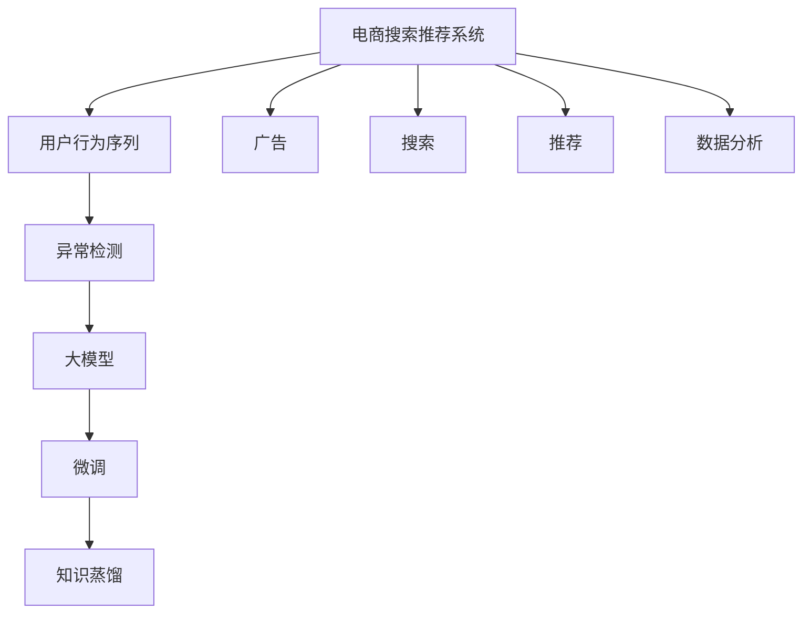

                 

# 电商搜索推荐中的AI大模型用户行为序列异常检测技术

> 关键词：电商搜索推荐、用户行为序列、异常检测、大模型、AI

## 1. 背景介绍

### 1.1 问题由来
在电商领域，用户行为数据的异常检测对于提升用户体验、增加销售转化率具有重要意义。异常行为可能包含欺诈行为、盗号行为、恶意点击等，严重影响电商平台的正常运营和用户信任。因此，构建一个高效、准确的用户行为序列异常检测系统，成为电商平台亟需解决的问题。

传统的用户行为序列异常检测方法基于规则、统计等手段，存在自动化程度低、误报率高、难以处理复杂行为序列等问题。而近年来，基于深度学习的大模型在多模态数据融合、复杂模式识别等方面表现出强大能力，在异常检测领域也展现出了良好的潜力。

本文将探讨在电商搜索推荐中，如何应用AI大模型进行用户行为序列异常检测，旨在为电商平台提供一套高效、准确、可靠的系统解决方案。

### 1.2 问题核心关键点
基于大模型的用户行为序列异常检测方法，核心在于利用预训练语言模型和大规模标注数据，学习用户行为的隐含模式，通过微调或精细化训练，提升模型对异常序列的识别能力。关键点包括：
- 选择合适的预训练语言模型。如BERT、GPT等。
- 设计有效的用户行为序列标注数据集。
- 选择合适的微调任务和损失函数。
- 实现高效的异常序列识别算法。

## 2. 核心概念与联系

### 2.1 核心概念概述

为更好地理解大模型在用户行为序列异常检测中的应用，本节将介绍几个密切相关的核心概念：

- 电商搜索推荐系统（E-Commerce Search Recommendation System）：指通过分析用户搜索和点击行为，推荐个性化商品给用户的技术系统。该系统通常包括搜索、推荐、广告等多个组件，是电商平台的核心功能之一。

- 用户行为序列（User Behavior Sequence）：指用户在电商平台上的一系列连续行为，如搜索、点击、浏览、添加购物车、购买等。通过分析用户行为序列，可以了解用户的购物兴趣和行为模式，从而提供更精准的推荐服务。

- 异常检测（Anomaly Detection）：指通过数据分析、机器学习等手段，识别出行为序列中的异常事件。常见的异常检测方法包括统计分析、聚类、深度学习等。

- 大模型（Large Model）：指在大规模无标签数据上预训练得到的深度学习模型，如BERT、GPT、T5等。通过大模型的自监督学习，可以学习到丰富的语言知识和模式，应用于下游任务的微调时具有显著优势。

- 微调（Fine-Tuning）：指在预训练模型的基础上，通过下游任务的少量标注数据，进一步优化模型在该任务上的性能。微调可以显著提升模型的特定任务表现，减少从头训练的时间成本和数据成本。

- 知识蒸馏（Knowledge Distillation）：指通过将大模型的知识传递给小型模型，提升小型模型的性能。知识蒸馏可以使得模型在保持高精度的情况下，减少计算资源消耗。

这些核心概念之间的逻辑关系可以通过以下Mermaid流程图来展示：



这个流程图展示了大模型在电商搜索推荐中的核心概念及其之间的关系：

1. 电商搜索推荐系统通过对用户行为序列进行分析，能够更好地理解用户需求。
2. 用户行为序列中的异常事件，如欺诈、盗号等，需要通过异常检测系统进行识别。
3. 异常检测系统可以采用大模型，通过微调和知识蒸馏等技术，提高异常识别的准确性。
4. 广告系统可以通过异常检测结果，精准投放广告，提高广告点击率和转化率。
5. 搜索和推荐系统可以通过异常检测结果，及时调整策略，提升用户体验。
6. 数据分析系统可以基于异常检测结果，提取更多有价值的用户行为特征，优化推荐模型。

这些概念共同构成了电商搜索推荐系统中异常检测的基本框架，使得平台能够更好地识别和处理异常行为，保障系统的稳定性和用户信任。

## 3. 核心算法原理 & 具体操作步骤
### 3.1 算法原理概述

基于大模型的用户行为序列异常检测，本质上是一个有监督学习的异常检测问题。其核心思想是：利用大模型学习用户行为序列的隐含模式，通过微调或精细化训练，使模型能够识别出序列中的异常事件。

形式化地，假设用户行为序列数据集为 $D=\{(x_i,y_i)\}_{i=1}^N, x_i$ 为行为序列，$y_i \in \{0,1\}$ 为是否异常标记。异常检测的目标是找到最优的模型参数 $\theta^*$，使得：

$$
\theta^* = \mathop{\arg\min}_{\theta} \mathcal{L}(M_{\theta},D)
$$

其中 $\mathcal{L}$ 为针对异常检测任务设计的损失函数，用于衡量模型预测输出与真实标签之间的差异。常见的损失函数包括交叉熵损失、对数似然损失等。

### 3.2 算法步骤详解

基于大模型的用户行为序列异常检测一般包括以下几个关键步骤：

**Step 1: 准备数据集和预训练模型**
- 收集电商平台的历史用户行为序列数据，并对其进行标注，区分正常行为和异常行为。标注数据集需要涵盖正常行为和多种异常行为。
- 选择合适的预训练语言模型，如BERT、GPT等，作为初始化参数。

**Step 2: 设计任务适配层**
- 根据任务类型，设计合适的输出层和损失函数。对于异常检测，一般使用二分类任务，模型输出异常与否的概率。
- 对于分类任务，通常使用二元交叉熵损失函数。
- 对于序列分类任务，可能需要引入序列到序列的损失函数，如序列对序列的交叉熵损失。

**Step 3: 设置微调超参数**
- 选择合适的优化算法及其参数，如 AdamW、SGD 等，设置学习率、批大小、迭代轮数等。
- 设置正则化技术及强度，包括权重衰减、Dropout、Early Stopping等。
- 确定冻结预训练参数的策略，如仅微调顶层，或全部参数都参与微调。

**Step 4: 执行梯度训练**
- 将标注数据集分批次输入模型，前向传播计算损失函数。
- 反向传播计算参数梯度，根据设定的优化算法和学习率更新模型参数。
- 周期性在验证集上评估模型性能，根据性能指标决定是否触发 Early Stopping。
- 重复上述步骤直至满足预设的迭代轮数或 Early Stopping 条件。

**Step 5: 测试和部署**
- 在测试集上评估微调后模型 $M_{\hat{\theta}}$ 的性能，对比微调前后的精度提升。
- 使用微调后的模型对新行为序列进行推理预测，集成到实际的应用系统中。
- 持续收集新的数据，定期重新微调模型，以适应数据分布的变化。

以上是基于大模型的用户行为序列异常检测的一般流程。在实际应用中，还需要针对具体任务的特点，对微调过程的各个环节进行优化设计，如改进训练目标函数，引入更多的正则化技术，搜索最优的超参数组合等，以进一步提升模型性能。

### 3.3 算法优缺点

基于大模型的用户行为序列异常检测方法具有以下优点：
1. 高效自动化。相比传统手工规则和统计分析，大模型能自动学习用户行为中的隐含模式，提高异常检测的自动化程度。
2. 泛化能力强。大模型在预训练阶段就学习到了广泛的语言知识，能更好地适应不同领域和场景的异常检测任务。
3. 精度高。在充足的标注数据下，大模型能够取得较高的异常检测精度，降低误报和漏报率。
4. 灵活性强。大模型的微调过程可以灵活调整任务目标和超参数，满足不同电商平台的业务需求。

同时，该方法也存在一定的局限性：
1. 数据标注成本高。高质量标注数据的获取和维护需要大量人工和资金投入。
2. 模型复杂度较高。大模型需要较大的计算资源进行微调，存在一定的计算成本。
3. 模型依赖标注数据。模型性能依赖于标注数据的质量和数量，数据偏见可能影响模型性能。
4. 解释性不足。大模型作为黑盒模型，难以解释其内部的决策过程，难以进行故障排查和优化。

尽管存在这些局限性，但就目前而言，基于大模型的用户行为序列异常检测方法仍是在电商搜索推荐领域的主流范式。未来相关研究的重点在于如何进一步降低数据标注成本，提高模型解释性和鲁棒性，同时兼顾计算效率和业务需求。

### 3.4 算法应用领域

基于大模型的用户行为序列异常检测方法，在电商搜索推荐领域已经得到了广泛的应用，覆盖了多个关键环节，例如：

- 欺诈检测：检测用户是否存在恶意点击、异常交易等欺诈行为。
- 盗号检测：识别用户账号是否被他人恶意占用，防止账号被盗。
- 恶意行为检测：识别用户在平台上进行不正当行为，如恶意评论、刷单等。
- 广告点击异常检测：检测广告点击是否存在异常，防止虚假广告点击。
- 用户行为模式异常检测：分析用户行为序列，检测是否存在异常模式，及时调整推荐策略。

除了上述这些经典任务外，大模型在电商搜索推荐中的创新应用也在不断涌现，如基于行为序列的个性化推荐、基于异常检测结果的用户画像优化等，为电商平台的运营优化提供了新的思路。

## 4. 数学模型和公式 & 详细讲解 & 举例说明

### 4.1 数学模型构建

本节将使用数学语言对基于大模型的用户行为序列异常检测过程进行更加严格的刻画。

记用户行为序列为 $x=\{x_i\}_{i=1}^N, x_i$ 为第 $i$ 个行为序列。假设微调任务的训练集为 $D=\{(x_i,y_i)\}_{i=1}^N, x_i \in \mathcal{X}, y_i \in \{0,1\}$，其中 $\mathcal{X}$ 为行为序列空间。

定义模型 $M_{\theta}$ 在行为序列 $x$ 上的损失函数为 $\ell(M_{\theta}(x),y)$，则在数据集 $D$ 上的经验风险为：

$$
\mathcal{L}(\theta) = \frac{1}{N}\sum_{i=1}^N \ell(M_{\theta}(x_i),y_i)
$$

微调的优化目标是最小化经验风险，即找到最优参数：

$$
\theta^* = \mathop{\arg\min}_{\theta} \mathcal{L}(\theta)
$$

在实践中，我们通常使用基于梯度的优化算法（如SGD、Adam等）来近似求解上述最优化问题。设 $\eta$ 为学习率，$\lambda$ 为正则化系数，则参数的更新公式为：

$$
\theta \leftarrow \theta - \eta \nabla_{\theta}\mathcal{L}(\theta) - \eta\lambda\theta
$$

其中 $\nabla_{\theta}\mathcal{L}(\theta)$ 为损失函数对参数 $\theta$ 的梯度，可通过反向传播算法高效计算。

### 4.2 公式推导过程

以下我们以二分类任务为例，推导交叉熵损失函数及其梯度的计算公式。

假设模型 $M_{\theta}$ 在行为序列 $x$ 上的输出为 $\hat{y}=M_{\theta}(x) \in [0,1]$，表示序列为异常的概率。真实标签 $y \in \{0,1\}$。则二分类交叉熵损失函数定义为：

$$
\ell(M_{\theta}(x),y) = -[y\log \hat{y} + (1-y)\log (1-\hat{y})]
$$

将其代入经验风险公式，得：

$$
\mathcal{L}(\theta) = -\frac{1}{N}\sum_{i=1}^N [y_i\log M_{\theta}(x_i)+(1-y_i)\log(1-M_{\theta}(x_i))]
$$

根据链式法则，损失函数对参数 $\theta_k$ 的梯度为：

$$
\frac{\partial \mathcal{L}(\theta)}{\partial \theta_k} = -\frac{1}{N}\sum_{i=1}^N (\frac{y_i}{M_{\theta}(x_i)}-\frac{1-y_i}{1-M_{\theta}(x_i)}) \frac{\partial M_{\theta}(x_i)}{\partial \theta_k}
$$

其中 $\frac{\partial M_{\theta}(x_i)}{\partial \theta_k}$ 可进一步递归展开，利用自动微分技术完成计算。

在得到损失函数的梯度后，即可带入参数更新公式，完成模型的迭代优化。重复上述过程直至收敛，最终得到适应下游任务的最优模型参数 $\theta^*$。

### 4.3 案例分析与讲解

假设某电商平台有如下用户行为序列数据集：

| 行为序列 | 是否异常 | 标签 |
|----------|----------|------|
| ["搜索商品A", "点击商品A", "加入购物车", "购买商品A"] | 0 | 0 |
| ["搜索商品B", "点击商品B", "加入购物车", "购买商品B"] | 0 | 0 |
| ["搜索商品C", "点击商品C", "加入购物车", "点击商品D", "购买商品D"] | 0 | 0 |
| ["搜索商品E", "点击商品E", "加入购物车", "点击商品F", "购买商品G"] | 1 | 1 |

我们假设使用BERT模型进行微调，首先需要进行预处理，将行为序列转换为BERT模型所需的输入格式。例如：

| 行为序列 | BERT输入格式 |
|----------|--------------|
| ["搜索商品A", "点击商品A", "加入购物车", "购买商品A"] | ["搜索商品A", "点击商品A", "加入购物车", "购买商品A"] |
| ["搜索商品B", "点击商品B", "加入购物车", "购买商品B"] | ["搜索商品B", "点击商品B", "加入购物车", "购买商品B"] |
| ["搜索商品C", "点击商品C", "加入购物车", "点击商品D", "购买商品D"] | ["搜索商品C", "点击商品C", "加入购物车", "点击商品D", "购买商品D"] |
| ["搜索商品E", "点击商品E", "加入购物车", "点击商品F", "购买商品G"] | ["搜索商品E", "点击商品E", "加入购物车", "点击商品F", "购买商品G"] |

接着，使用微调后的BERT模型对行为序列进行预测，得到每条序列是否异常的概率。例如，对于行为序列 ["搜索商品E", "点击商品E", "加入购物车", "点击商品F", "购买商品G"]，预测结果为 0.8，表示该行为序列为异常行为。

在实际应用中，可能需要进一步优化模型性能，如引入更多标注数据、调整模型参数、引入对抗训练等。通过不断迭代优化，大模型能够更准确地识别出异常行为序列，为电商平台的运营安全提供有力保障。

## 5. 项目实践：代码实例和详细解释说明

### 5.1 开发环境搭建

在进行微调实践前，我们需要准备好开发环境。以下是使用Python进行PyTorch开发的环境配置流程：

1. 安装Anaconda：从官网下载并安装Anaconda，用于创建独立的Python环境。

2. 创建并激活虚拟环境：
```bash
conda create -n pytorch-env python=3.8 
conda activate pytorch-env
```

3. 安装PyTorch：根据CUDA版本，从官网获取对应的安装命令。例如：
```bash
conda install pytorch torchvision torchaudio cudatoolkit=11.1 -c pytorch -c conda-forge
```

4. 安装Transformers库：
```bash
pip install transformers
```

5. 安装各类工具包：
```bash
pip install numpy pandas scikit-learn matplotlib tqdm jupyter notebook ipython
```

完成上述步骤后，即可在`pytorch-env`环境中开始微调实践。

### 5.2 源代码详细实现

下面我以BertForSequenceClassification为例，给出使用Transformers库对BERT模型进行微调的PyTorch代码实现。

首先，定义异常检测任务的数据处理函数：

```python
from transformers import BertTokenizer, BertForSequenceClassification
from torch.utils.data import Dataset
import torch

class BehaviorSequenceDataset(Dataset):
    def __init__(self, texts, labels, tokenizer, max_len=128):
        self.texts = texts
        self.labels = labels
        self.tokenizer = tokenizer
        self.max_len = max_len
        
    def __len__(self):
        return len(self.texts)
    
    def __getitem__(self, item):
        text = self.texts[item]
        label = self.labels[item]
        
        encoding = self.tokenizer(text, return_tensors='pt', max_length=self.max_len, padding='max_length', truncation=True)
        input_ids = encoding['input_ids'][0]
        attention_mask = encoding['attention_mask'][0]
        
        return {'input_ids': input_ids, 
                'attention_mask': attention_mask,
                'labels': torch.tensor(label, dtype=torch.long)}
```

然后，定义模型和优化器：

```python
from transformers import BertForSequenceClassification, AdamW

model = BertForSequenceClassification.from_pretrained('bert-base-cased', num_labels=2)

optimizer = AdamW(model.parameters(), lr=2e-5)
```

接着，定义训练和评估函数：

```python
from torch.utils.data import DataLoader
from tqdm import tqdm
from sklearn.metrics import accuracy_score

device = torch.device('cuda') if torch.cuda.is_available() else torch.device('cpu')
model.to(device)

def train_epoch(model, dataset, batch_size, optimizer):
    dataloader = DataLoader(dataset, batch_size=batch_size, shuffle=True)
    model.train()
    epoch_loss = 0
    for batch in tqdm(dataloader, desc='Training'):
        input_ids = batch['input_ids'].to(device)
        attention_mask = batch['attention_mask'].to(device)
        labels = batch['labels'].to(device)
        model.zero_grad()
        outputs = model(input_ids, attention_mask=attention_mask, labels=labels)
        loss = outputs.loss
        epoch_loss += loss.item()
        loss.backward()
        optimizer.step()
    return epoch_loss / len(dataloader)

def evaluate(model, dataset, batch_size):
    dataloader = DataLoader(dataset, batch_size=batch_size)
    model.eval()
    preds, labels = [], []
    with torch.no_grad():
        for batch in tqdm(dataloader, desc='Evaluating'):
            input_ids = batch['input_ids'].to(device)
            attention_mask = batch['attention_mask'].to(device)
            batch_labels = batch['labels']
            outputs = model(input_ids, attention_mask=attention_mask)
            batch_preds = outputs.logits.argmax(dim=2).to('cpu').tolist()
            batch_labels = batch_labels.to('cpu').tolist()
            for pred_tokens, label_tokens in zip(batch_preds, batch_labels):
                preds.append(pred_tokens)
                labels.append(label_tokens)
                
    print("Accuracy: {:.4f}".format(accuracy_score(labels, preds)))
```

最后，启动训练流程并在测试集上评估：

```python
epochs = 5
batch_size = 16

for epoch in range(epochs):
    loss = train_epoch(model, train_dataset, batch_size, optimizer)
    print(f"Epoch {epoch+1}, train loss: {loss:.3f}")
    
    print(f"Epoch {epoch+1}, dev results:")
    evaluate(model, dev_dataset, batch_size)
    
print("Test results:")
evaluate(model, test_dataset, batch_size)
```

以上就是使用PyTorch对BERT进行异常检测任务微调的完整代码实现。可以看到，得益于Transformers库的强大封装，我们可以用相对简洁的代码完成BERT模型的加载和微调。

### 5.3 代码解读与分析

让我们再详细解读一下关键代码的实现细节：

**BehaviorSequenceDataset类**：
- `__init__`方法：初始化行为序列、标签、分词器等关键组件。
- `__len__`方法：返回数据集的样本数量。
- `__getitem__`方法：对单个样本进行处理，将行为序列输入编码为token ids，将标签编码为数字，并对其进行定长padding，最终返回模型所需的输入。

**训练和评估函数**：
- 使用PyTorch的DataLoader对数据集进行批次化加载，供模型训练和推理使用。
- 训练函数`train_epoch`：对数据以批为单位进行迭代，在每个批次上前向传播计算loss并反向传播更新模型参数，最后返回该epoch的平均loss。
- 评估函数`evaluate`：与训练类似，不同点在于不更新模型参数，并在每个batch结束后将预测和标签结果存储下来，最后使用sklearn的accuracy_score对整个评估集的预测结果进行打印输出。

**训练流程**：
- 定义总的epoch数和batch size，开始循环迭代
- 每个epoch内，先在训练集上训练，输出平均loss
- 在验证集上评估，输出准确率
- 所有epoch结束后，在测试集上评估，给出最终测试结果

可以看到，PyTorch配合Transformers库使得BERT微调的代码实现变得简洁高效。开发者可以将更多精力放在数据处理、模型改进等高层逻辑上，而不必过多关注底层的实现细节。

当然，工业级的系统实现还需考虑更多因素，如模型的保存和部署、超参数的自动搜索、更灵活的任务适配层等。但核心的微调范式基本与此类似。

## 6. 实际应用场景
### 6.1 智能客服系统

基于大模型的用户行为序列异常检测技术，可以广泛应用于智能客服系统的构建。传统客服往往需要配备大量人力，高峰期响应缓慢，且一致性和专业性难以保证。而使用微调后的检测系统，可以实时监测客户的行为序列，及时发现和处理异常行为，提高客户咨询的效率和满意度。

在技术实现上，可以收集企业内部的历史客服对话记录，将客户行为序列作为监督数据，在此基础上对预训练语言模型进行微调。微调后的检测系统能够自动理解客户意图，检测出异常行为序列，如客户是否存在恶意点击、超时未响应等，从而快速响应客户需求，提高客服质量。

### 6.2 金融舆情监测

金融机构需要实时监测市场舆论动向，以便及时应对负面信息传播，规避金融风险。传统的人工监测方式成本高、效率低，难以应对网络时代海量信息爆发的挑战。基于大模型的用户行为序列异常检测技术，为金融舆情监测提供了新的解决方案。

具体而言，可以收集金融领域相关的新闻、报道、评论等文本数据，并对其进行主题标注和情感标注。在此基础上对预训练语言模型进行微调，使其能够自动判断文本属于何种主题，情感倾向是正面、中性还是负面。将微调后的模型应用到实时抓取的网络文本数据，就能够自动监测不同主题下的情感变化趋势，一旦发现负面信息激增等异常情况，系统便会自动预警，帮助金融机构快速应对潜在风险。

### 6.3 个性化推荐系统

当前的推荐系统往往只依赖用户的历史行为数据进行物品推荐，无法深入理解用户的真实兴趣偏好。基于大模型的用户行为序列异常检测技术，可以更全面地分析用户行为序列，挖掘用户背后的行为模式和兴趣偏好，从而提供更精准、多样化的推荐内容。

在实践中，可以收集用户浏览、点击、评论、分享等行为数据，提取和用户交互的物品标题、描述、标签等文本内容。将文本内容作为模型输入，用户的后续行为（如是否点击、购买等）作为监督信号，在此基础上微调预训练语言模型。微调后的模型能够从行为序列中准确把握用户的兴趣点，生成个性化的推荐结果，提升用户体验。

### 6.4 未来应用展望

随着大模型和异常检测技术的不断发展，基于大模型的用户行为序列异常检测技术将在更多领域得到应用，为传统行业带来变革性影响。

在智慧医疗领域，基于异常检测的诊疗系统能够实时监测病人的行为序列，及时发现病情异常，辅助医生诊断和治疗，提高医疗服务的智能化水平。

在智能教育领域，异常检测技术可以识别学生的异常行为，如学习倦怠、注意力不集中等，从而及时调整教学策略，提高教育效果。

在智慧城市治理中，异常检测系统可以实时监测城市事件，识别异常行为，如灾害预警、安全事故等，提高城市管理的自动化和智能化水平，构建更安全、高效的未来城市。

此外，在企业生产、社会治理、文娱传媒等众多领域，基于大模型的用户行为序列异常检测技术也将不断涌现，为相关产业带来新的技术进步和发展机遇。相信随着技术的日益成熟，异常检测技术将成为人工智能落地应用的重要范式，推动人工智能技术在更广阔的领域大放异彩。

## 7. 工具和资源推荐
### 7.1 学习资源推荐

为了帮助开发者系统掌握大模型在用户行为序列异常检测中的应用，这里推荐一些优质的学习资源：

1. 《Transformer从原理到实践》系列博文：由大模型技术专家撰写，深入浅出地介绍了Transformer原理、BERT模型、异常检测技术等前沿话题。

2. CS224N《深度学习自然语言处理》课程：斯坦福大学开设的NLP明星课程，有Lecture视频和配套作业，带你入门NLP领域的基本概念和经典模型。

3. 《Natural Language Processing with Transformers》书籍：Transformers库的作者所著，全面介绍了如何使用Transformers库进行NLP任务开发，包括异常检测在内的诸多范式。

4. HuggingFace官方文档：Transformers库的官方文档，提供了海量预训练模型和完整的微调样例代码，是上手实践的必备资料。

5. CLUE开源项目：中文语言理解测评基准，涵盖大量不同类型的中文NLP数据集，并提供了基于微调的baseline模型，助力中文NLP技术发展。

通过对这些资源的学习实践，相信你一定能够快速掌握大模型在用户行为序列异常检测中的应用，并用于解决实际的NLP问题。
###  7.2 开发工具推荐

高效的开发离不开优秀的工具支持。以下是几款用于大模型用户行为序列异常检测开发的常用工具：

1. PyTorch：基于Python的开源深度学习框架，灵活动态的计算图，适合快速迭代研究。大部分预训练语言模型都有PyTorch版本的实现。

2. TensorFlow：由Google主导开发的开源深度学习框架，生产部署方便，适合大规模工程应用。同样有丰富的预训练语言模型资源。

3. Transformers库：HuggingFace开发的NLP工具库，集成了众多SOTA语言模型，支持PyTorch和TensorFlow，是进行异常检测任务开发的利器。

4. Weights & Biases：模型训练的实验跟踪工具，可以记录和可视化模型训练过程中的各项指标，方便对比和调优。与主流深度学习框架无缝集成。

5. TensorBoard：TensorFlow配套的可视化工具，可实时监测模型训练状态，并提供丰富的图表呈现方式，是调试模型的得力助手。

6. Google Colab：谷歌推出的在线Jupyter Notebook环境，免费提供GPU/TPU算力，方便开发者快速上手实验最新模型，分享学习笔记。

合理利用这些工具，可以显著提升大模型用户行为序列异常检测任务的开发效率，加快创新迭代的步伐。

### 7.3 相关论文推荐

大模型和异常检测技术的发展源于学界的持续研究。以下是几篇奠基性的相关论文，推荐阅读：

1. Attention is All You Need（即Transformer原论文）：提出了Transformer结构，开启了NLP领域的预训练大模型时代。

2. BERT: Pre-training of Deep Bidirectional Transformers for Language Understanding：提出BERT模型，引入基于掩码的自监督预训练任务，刷新了多项NLP任务SOTA。

3. Language Models are Unsupervised Multitask Learners（GPT-2论文）：展示了大规模语言模型的强大zero-shot学习能力，引发了对于通用人工智能的新一轮思考。

4. Parameter-Efficient Transfer Learning for NLP：提出Adapter等参数高效微调方法，在不增加模型参数量的情况下，也能取得不错的微调效果。

5. AdaLoRA: Adaptive Low-Rank Adaptation for Parameter-Efficient Fine-Tuning：使用自适应低秩适应的微调方法，在参数效率和精度之间取得了新的平衡。

6. Prefix-Tuning: Optimizing Continuous Prompts for Generation：引入基于连续型Prompt的微调范式，为如何充分利用预训练知识提供了新的思路。

这些论文代表了大模型和异常检测技术的发展脉络。通过学习这些前沿成果，可以帮助研究者把握学科前进方向，激发更多的创新灵感。

## 8. 总结：未来发展趋势与挑战

### 8.1 总结

本文对基于大模型的用户行为序列异常检测方法进行了全面系统的介绍。首先阐述了大模型和异常检测技术的研发背景和应用意义，明确了该方法在电商搜索推荐系统中的重要价值。其次，从原理到实践，详细讲解了大模型在用户行为序列异常检测中的应用流程，给出了微调任务开发的完整代码实例。同时，本文还广泛探讨了大模型在多个领域的应用前景，展示了其广阔的发展空间。

通过本文的系统梳理，可以看到，基于大模型的用户行为序列异常检测技术正在成为电商搜索推荐领域的重要范式，极大地拓展了预训练语言模型的应用边界，提升了系统的自动化和智能化水平。未来，伴随大模型和异常检测技术的持续演进，相信在更多领域内，大模型能够更好地发挥其隐含模式的发现和异常检测能力，为传统行业带来深远的变革性影响。

### 8.2 未来发展趋势

展望未来，大模型用户行为序列异常检测技术将呈现以下几个发展趋势：

1. 模型规模持续增大。随着算力成本的下降和数据规模的扩张，预训练语言模型的参数量还将持续增长。超大规模语言模型蕴含的丰富语言知识，有望支撑更加复杂多变的异常检测任务。

2. 异常检测方法日趋多样。除了传统的二分类任务外，未来会涌现更多多分类、序列到序列、多标签分类等异常检测任务，满足不同业务需求。

3. 持续学习成为常态。随着数据分布的不断变化，异常检测模型也需要持续学习新知识以保持性能。如何在不遗忘原有知识的同时，高效吸收新样本信息，将成为重要的研究课题。

4. 标注样本需求降低。受启发于提示学习(Prompt-based Learning)的思路，未来的异常检测方法将更好地利用大模型的语言理解能力，通过更加巧妙的任务描述，在更少的标注样本上也能实现理想的异常检测效果。

5. 模型通用性增强。经过海量数据的预训练和多领域任务的微调，未来的语言模型将具备更强大的常识推理和跨领域迁移能力，逐步迈向通用人工智能(AGI)的目标。

6. 多模态异常检测崛起。当前的异常检测主要聚焦于纯文本数据，未来会进一步拓展到图像、视频、语音等多模态数据异常检测。多模态信息的融合，将显著提升异常检测模型的感知能力。

以上趋势凸显了大模型用户行为序列异常检测技术的广阔前景。这些方向的探索发展，必将进一步提升异常检测模型的性能和应用范围，为各行业带来新的业务价值和技术进步。

### 8.3 面临的挑战

尽管大模型用户行为序列异常检测技术已经取得了瞩目成就，但在迈向更加智能化、普适化应用的过程中，它仍面临着诸多挑战：

1. 数据标注成本高。高质量标注数据的获取和维护需要大量人工和资金投入。

2. 模型鲁棒性不足。模型面对域外数据时，泛化性能往往大打折扣。对于测试样本的微小扰动，模型也容易发生波动。

3. 模型依赖标注数据。模型性能依赖于标注数据的质量和数量，数据偏见可能影响模型性能。

4. 解释性不足。大模型作为黑盒模型，难以解释其内部的决策过程，难以进行故障排查和优化。

5. 安全性有待保障。预训练语言模型难免会学习到有偏见、有害的信息，通过异常检测传递到电商平台上，产生误导性、歧视性的输出，给实际应用带来安全隐患。

6. 知识整合能力不足。现有的异常检测模型往往局限于任务内数据，难以灵活吸收和运用更广泛的先验知识。

正视异常检测面临的这些挑战，积极应对并寻求突破，将是大模型用户行为序列异常检测技术走向成熟的必由之路。相信随着学界和产业界的共同努力，这些挑战终将一一被克服，大模型在异常检测中的应用将更加广泛，为各行业带来新的业务价值和技术进步。

### 8.4 研究展望

面对大模型用户行为序列异常检测所面临的挑战，未来的研究需要在以下几个方面寻求新的突破：

1. 探索无监督和半监督异常检测方法。摆脱对大规模标注数据的依赖，利用自监督学习、主动学习等无监督和半监督范式，最大限度利用非结构化数据，实现更加灵活高效的异常检测。

2. 研究参数高效和计算高效的异常检测范式。开发更加参数高效的异常检测方法，在固定大部分预训练参数的同时，只更新极少量的任务相关参数。同时优化异常检测模型的计算图，减少前向传播和反向传播的资源消耗，实现更加轻量级、实时性的部署。

3. 融合因果和对比学习范式。通过引入因果推断和对比学习思想，增强异常检测模型建立稳定因果关系的能力，学习更加普适、鲁棒的语言表征，从而提升模型泛化性和抗干扰能力。

4. 引入更多先验知识。将符号化的先验知识，如知识图谱、逻辑规则等，与神经网络模型进行巧妙融合，引导异常检测过程学习更准确、合理的语言模型。同时加强不同模态数据的整合，实现视觉、语音等多模态信息与文本信息的协同建模。

5. 结合因果分析和博弈论工具。将因果分析方法引入异常检测模型，识别出模型决策的关键特征，增强输出解释的因果性和逻辑性。借助博弈论工具刻画人机交互过程，主动探索并规避模型的脆弱点，提高系统稳定性。

6. 纳入伦理道德约束。在模型训练目标中引入伦理导向的评估指标，过滤和惩罚有偏见、有害的输出倾向。同时加强人工干预和审核，建立模型行为的监管机制，确保输出符合人类价值观和伦理道德。

这些研究方向的探索，必将引领大模型用户行为序列异常检测技术迈向更高的台阶，为构建安全、可靠、可解释、可控的智能系统铺平道路。面向未来，大模型用户行为序列异常检测技术还需要与其他人工智能技术进行更深入的融合，如知识表示、因果推理、强化学习等，多路径协同发力，共同推动异常检测系统的进步。只有勇于创新、敢于突破，才能不断拓展语言模型的边界，让智能技术更好地造福人类社会。

## 9. 附录：常见问题与解答

**Q1：大模型在异常检测中为什么比传统方法效果好？**

A: 大模型在异常检测中效果优于传统方法的原因主要有以下几点：
1. 大模型通过大规模无标签数据的预训练，学习到了丰富的语言知识，能够更好地捕捉行为序列中的隐含模式。
2. 大模型的微调过程可以通过对标注数据的少量迭代，快速提升模型性能，特别是在标注数据稀缺的情况下，微调的效果更加显著。
3. 大模型的泛化能力更强，能够更好地适应新场景和新数据，避免过度拟合。
4. 大模型可以通过多模态融合、因果推理等先进技术，进一步提升异常检测的精度和鲁棒性。

**Q2：微调学习率设置有什么技巧？**

A: 微调学习率的设置需要根据具体任务和数据特点进行调整，以下是一些常见的技巧：
1. 初始学习率一般为预训练学习率的1/10至1/100，具体数值可以根据实验效果进行调整。
2. 可以使用学习率调度策略，如warmup策略，开始阶段使用较小的学习率，逐步过渡到预设值。
3. 可以结合验证集上的性能变化，自动调整学习率，避免过拟合。
4. 可以使用自适应学习率优化算法，如Adaptive Moment Estimation (AdamW)，自适应地调整学习率。

**Q3：异常检测中如何避免过拟合？**

A: 异常检测中避免过拟合的方法包括：
1. 数据增强：通过回译、近义替换等方式扩充训练集。
2. 正则化：使用L2正则、Dropout、Early Stopping等防止模型过度适应小规模训练集。
3. 对抗训练：加入对抗样本，提高模型鲁棒性。
4. 参数高效微调：只更新少量的模型参数，而固定大部分预训练权重不变。
5. 多模型集成：训练多个异常检测模型，取平均输出，抑制过拟合。

这些策略往往需要根据具体任务和数据特点进行灵活组合。只有在数据、模型、训练、推理等各环节进行全面优化，才能最大限度地发挥大模型异常检测的威力。

**Q4：异常检测模型在落地部署时需要注意哪些问题？**

A: 将异常检测模型转化为实际应用，还需要考虑以下因素：
1. 模型裁剪：去除不必要的层和参数，减小模型尺寸，加快推理速度。
2. 量化加速：将浮点模型转为定点模型，压缩存储空间，提高计算效率。
3. 服务化封装：将模型封装为标准化服务接口，便于集成调用。
4. 弹性伸缩：根据请求流量动态调整资源配置，平衡服务质量和成本。
5. 监控告警：实时采集系统指标，设置异常告警阈值，确保服务稳定性。
6. 安全防护：采用访问鉴权、数据脱敏等措施，保障数据和模型安全。

大模型异常检测为电商平台运营安全带来了新的思路，但如何将强大的性能转化为稳定、高效、安全的业务价值，还需要工程实践的不断打磨。只有从数据、算法、工程、业务等多个维度协同发力，才能真正实现人工智能技术在电商领域的落地。

总之，微调需要开发者根据具体任务，不断迭代和优化模型、数据和算法，方能得到理想的效果。

---

作者：禅与计算机程序设计艺术 / Zen and the Art of Computer Programming

