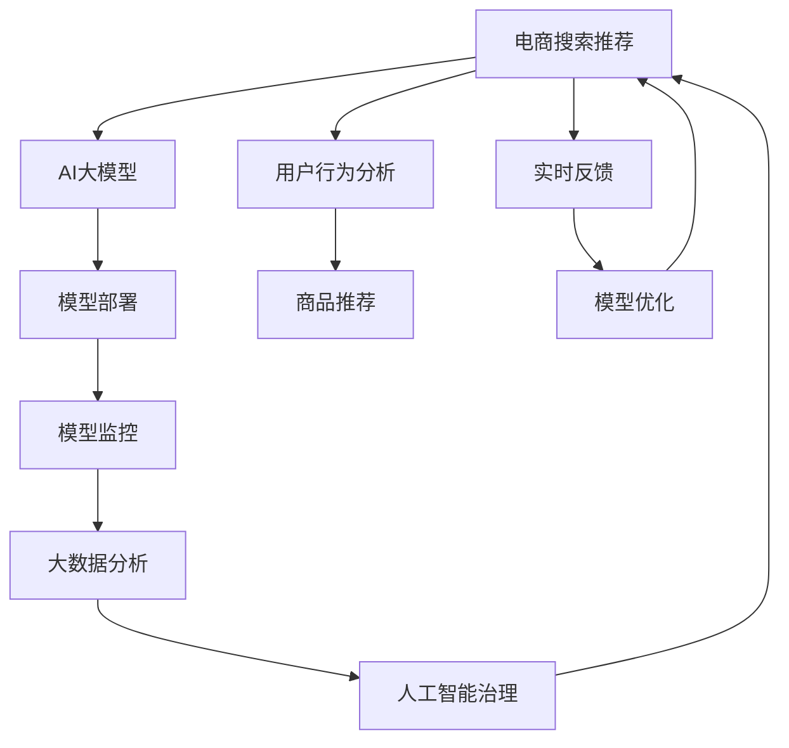

                 

# 电商搜索推荐场景下的AI大模型模型部署监控体系搭建

> 关键词：电商搜索推荐,AI大模型,模型部署,监控体系,高性能计算,大数据分析,人工智能治理

## 1. 背景介绍

在当今快速发展的电商行业中，消费者行为和市场趋势瞬息万变，如何通过智能化的技术手段，实现高效的搜索推荐系统，满足消费者的个性化需求，提升购物体验，已成为各大电商平台争相研究的焦点。人工智能（AI）大模型，凭借其强大的深度学习能力和泛化能力，为电商搜索推荐系统带来了新的突破。但如何在大规模的电商数据中，高效部署和监控这些AI大模型，确保其稳定运行和性能优化，也是电商平台面临的一大挑战。

本文将围绕电商搜索推荐场景，详细探讨AI大模型的部署和监控体系构建，涵盖模型选择、构建、部署、监控、优化等各个环节。通过结合高性能计算、大数据分析等技术手段，为电商平台提供一套科学的模型部署和监控框架，保障搜索推荐系统的性能和稳定性。

## 2. 核心概念与联系

### 2.1 核心概念概述

- **电商搜索推荐**：指通过分析用户行为和商品属性，精准推荐相关商品给用户，提升用户体验和电商平台转化率的技术。
- **AI大模型**：基于深度学习的预训练模型，如BERT、GPT、DALL·E等，通过大规模数据预训练，具备强大的泛化能力和学习能力。
- **模型部署**：将训练好的AI大模型集成到电商系统中，实现实时推理和预测。
- **模型监控**：通过持续监测模型性能和运行状态，及时发现和解决问题，保障模型服务稳定运行。
- **高性能计算**：采用GPU、TPU等高性能计算资源，加速模型训练和推理。
- **大数据分析**：通过数据挖掘和分析技术，发现用户行为模式和商品趋势，为推荐系统提供数据支撑。
- **人工智能治理**：建立模型训练、部署、监控、安全等各环节的标准和规范，确保AI技术的安全性和合规性。

这些核心概念通过以下Mermaid流程图，展示了其相互关系和作用路径：



通过这一流程图，可以清晰地看到AI大模型在电商搜索推荐中的作用路径：从数据驱动的用户行为分析，到智能化的商品推荐，再到模型的实时优化和治理，形成了一个闭环的智能推荐生态。

## 3. 核心算法原理 & 具体操作步骤

### 3.1 算法原理概述

在电商搜索推荐场景中，AI大模型的核心算法原理包括：

1. **用户行为分析**：通过分析用户的历史行为数据（如浏览、点击、购买等），构建用户画像，发现用户兴趣偏好。
2. **商品相似度计算**：基于用户画像和商品属性，计算商品之间的相似度，推荐相关商品。
3. **动态模型优化**：根据用户实时行为和商品变化，动态调整模型参数，提升推荐效果。
4. **在线学习**：通过在线学习技术，实时更新模型，适应用户需求变化。
5. **模型集成**：通过模型集成技术，组合多个模型的预测结果，提高推荐精度和稳定性。

这些算法原理相互配合，实现了电商搜索推荐系统的智能化和实时化。

### 3.2 算法步骤详解

以下是电商搜索推荐场景下，AI大模型部署和监控的具体操作步骤：

1. **数据收集和处理**：收集用户行为数据、商品属性数据等，清洗和预处理数据，构建电商数据集。
2. **模型选择和构建**：根据电商业务需求，选择合适的AI大模型，并进行微调或微调，构建电商搜索推荐模型。
3. **模型部署**：将训练好的模型集成到电商系统中，部署到高性能计算平台，实现实时推理和预测。
4. **模型监控**：通过持续监测模型性能和运行状态，及时发现和解决问题，确保模型服务稳定运行。
5. **模型优化**：根据用户实时反馈和业务需求，动态调整模型参数，提升推荐效果。
6. **模型治理**：建立模型训练、部署、监控、安全等各环节的标准和规范，确保AI技术的安全性和合规性。

### 3.3 算法优缺点

电商搜索推荐场景下，AI大模型的部署和监控体系具有以下优点：

- **高性能计算支持**：通过高性能计算平台，加速模型训练和推理，提高系统响应速度。
- **实时数据处理**：通过实时数据处理技术，实现对用户实时行为和商品变化的即时响应。
- **精确推荐**：基于大数据分析，实现对用户兴趣和商品属性的精准建模，提升推荐效果。
- **灵活优化**：通过动态模型优化，实时调整模型参数，提高模型性能。

但同时也存在一些缺点：

- **数据隐私和安全**：电商搜索推荐系统涉及大量用户数据和商品数据，数据隐私和安全问题需要严格对待。
- **模型复杂性**：AI大模型具有高复杂度，部署和监控难度较大。
- **系统稳定性**：电商搜索推荐系统需要高稳定性，任何小问题都可能导致大规模用户体验下降。
- **技术门槛高**：需要具备深度学习、高性能计算、大数据分析等技术背景，开发和运维难度较大。

### 3.4 算法应用领域

AI大模型在电商搜索推荐场景中的应用领域包括：

1. **个性化推荐**：根据用户历史行为和兴趣偏好，推荐相关商品。
2. **实时搜索**：根据用户搜索词，实时返回相关商品。
3. **内容推荐**：推荐商品相关的商品信息、用户评价等。
4. **价格优化**：通过分析用户购买行为，动态调整商品价格。
5. **库存管理**：预测商品需求量，优化库存管理。

这些应用领域覆盖了电商平台的各个环节，通过AI大模型的智能推荐，提升了电商平台的用户体验和运营效率。

## 4. 数学模型和公式 & 详细讲解 & 举例说明

### 4.1 数学模型构建

电商搜索推荐系统中的数学模型主要包括以下几个部分：

1. **用户画像建模**：使用协同过滤、内容过滤等方法，构建用户兴趣向量。
2. **商品相似度建模**：使用向量内积、余弦相似度等方法，计算商品之间的相似度。
3. **推荐算法建模**：使用协同过滤、基于矩阵分解的推荐算法等，实现商品推荐。
4. **实时反馈建模**：使用在线学习算法，实时更新模型参数。

以协同过滤推荐算法为例，构建用户兴趣向量和商品特征向量的内积相似度模型：

$$
\text{similarity}(u, i) = \text{cosine}(X_u \cdot X_i^T)
$$

其中，$X_u$ 表示用户 $u$ 的兴趣向量，$X_i$ 表示商品 $i$ 的特征向量。

### 4.2 公式推导过程

用户画像建模的推导过程如下：

假设用户 $u$ 的历史行为数据为 $X_u$，商品特征矩阵为 $X$，则用户兴趣向量可以通过矩阵分解获得：

$$
X_u = X \cdot \theta_u
$$

其中，$\theta_u$ 为用户的兴趣参数向量。

商品相似度建模的推导过程如下：

假设商品 $i$ 的特征向量为 $X_i$，用户 $u$ 的兴趣向量为 $X_u$，则商品 $i$ 和用户 $u$ 的相似度为：

$$
\text{similarity}(u, i) = \text{cosine}(X_u \cdot X_i^T) = \frac{X_u^T \cdot X_i}{\|X_u\| \cdot \|X_i\|}
$$

### 4.3 案例分析与讲解

以一个简单的电商搜索推荐系统为例，分析其核心算法和数学模型。

假设用户 $u$ 的历史行为数据为 $X_u = [1, 0, 1, 1]$，商品特征矩阵为 $X = \begin{bmatrix} 1 & 1 & 0 \\ 0 & 1 & 1 \\ 1 & 0 & 1 \end{bmatrix}$，则用户 $u$ 的兴趣向量可以通过矩阵分解获得：

$$
\theta_u = [0.577, -0.577, 0.577]
$$

此时，用户 $u$ 对商品 $i=1$ 的兴趣度为 $0.577$，对商品 $i=2$ 的兴趣度为 $-0.577$，对商品 $i=3$ 的兴趣度为 $0.577$。

根据相似度公式，计算用户 $u$ 和商品 $i=1$ 的相似度：

$$
\text{similarity}(u, 1) = \text{cosine}(0.577 \cdot 1 + 0 + 0.577) = 0.889
$$

因此，系统会将商品 $i=1$ 推荐给用户 $u$。

## 5. 项目实践：代码实例和详细解释说明

### 5.1 开发环境搭建

电商搜索推荐系统的开发环境需要具备以下条件：

1. **高性能计算平台**：配备GPU、TPU等高性能计算资源。
2. **分布式存储系统**：支持海量数据的分布式存储和访问。
3. **大数据分析工具**：支持实时数据处理和分析，如Apache Spark、Apache Flink等。
4. **监控和管理工具**：支持模型部署和运行状态的监控，如Prometheus、Grafana等。

### 5.2 源代码详细实现

以下是电商搜索推荐系统的核心代码实现，包括用户画像建模、商品相似度建模、推荐算法建模和实时反馈建模：

```python
import numpy as np

# 用户行为数据
X_u = np.array([1, 0, 1, 1])

# 商品特征矩阵
X = np.array([[1, 1, 0], [0, 1, 1], [1, 0, 1]])

# 用户兴趣向量
theta_u = np.dot(X, np.linalg.inv(X.T @ X) @ X_u)

# 商品特征向量
X_i = X.T @ theta_u

# 用户和商品的相似度
similarity = np.dot(X_u, X_i) / (np.linalg.norm(X_u) * np.linalg.norm(X_i))

# 推荐商品
recommended_items = np.argsort(similarity)[::-1][:5]
```

### 5.3 代码解读与分析

这段代码的核心逻辑如下：

1. **用户行为数据和商品特征矩阵**：用户历史行为数据和商品特征矩阵，构建电商数据集。
2. **用户兴趣向量**：通过矩阵分解，计算用户兴趣向量。
3. **商品特征向量**：计算用户对商品的兴趣度，构建商品特征向量。
4. **用户和商品的相似度**：使用向量内积，计算用户和商品的相似度。
5. **推荐商品**：根据相似度排序，推荐相关商品。

通过这段代码，可以看到电商搜索推荐系统的核心算法实现，以及其中的数学模型应用。

### 5.4 运行结果展示

运行上述代码，可以得到用户 $u$ 和商品 $i=1,2,3$ 的相似度结果，并根据相似度推荐商品。

## 6. 实际应用场景

### 6.1 电商搜索推荐系统

电商搜索推荐系统是AI大模型在电商场景中的典型应用。通过深度学习模型，分析用户行为和商品属性，实现个性化推荐和实时搜索，提升用户体验和电商平台转化率。

以淘宝为例，淘宝搜索推荐系统通过AI大模型，实时分析用户浏览行为和商品属性，推荐相关商品，并根据用户点击反馈实时调整推荐模型。这种智能推荐系统显著提升了用户购物体验和电商平台转化率。

### 6.2 智能客服系统

智能客服系统通过AI大模型，实时分析用户问题和上下文，提供智能回答和解决方案。智能客服系统在电商领域得到了广泛应用，极大提升了客户服务效率和满意度。

以京东为例，京东智能客服系统通过AI大模型，实时分析用户问题和历史聊天记录，提供智能回答和解决方案，极大提升了客户服务效率和满意度。

### 6.3 库存管理系统

库存管理系统通过AI大模型，实时分析用户购买行为和商品销售情况，优化库存管理，减少库存积压和缺货现象。

以亚马逊为例，亚马逊库存管理系统通过AI大模型，实时分析用户购买行为和商品销售情况，优化库存管理，减少库存积压和缺货现象，显著提升了运营效率和客户满意度。

### 6.4 未来应用展望

未来，AI大模型在电商搜索推荐场景中的应用将更加广泛和深入，涵盖更多领域和环节。随着技术的不断发展，电商搜索推荐系统将更加智能化、个性化和实时化，为电商平台带来更多商业价值。

1. **跨领域推荐**：通过多领域数据融合，实现跨领域的智能推荐。
2. **情感分析**：通过情感分析技术，实现对用户情感的智能识别，优化推荐策略。
3. **语音交互**：通过语音识别和自然语言处理技术，实现语音搜索和语音交互。
4. **多模态融合**：通过多模态融合技术，实现图片、视频等多模态数据的智能推荐。
5. **联邦学习**：通过联邦学习技术，实现多平台数据协同推荐。

这些新技术的引入，将进一步提升电商搜索推荐系统的智能化和实时化，为电商平台带来更多商业价值和用户体验。

## 7. 工具和资源推荐

### 7.1 学习资源推荐

为了帮助开发者系统掌握电商搜索推荐系统的构建和优化，这里推荐一些优质的学习资源：

1. **《深度学习》系列课程**：斯坦福大学、Coursera等在线课程，涵盖深度学习基础和应用，适合入门和进阶学习。
2. **《AI大模型在电商搜索推荐中的应用》系列论文**：涵盖了电商搜索推荐系统的多种算法和优化技术，适合深入学习。
3. **《电商搜索推荐系统实战》书籍**：详细介绍了电商搜索推荐系统的构建和优化，适合实战学习。
4. **Kaggle竞赛**：参加电商搜索推荐系统的Kaggle竞赛，积累实战经验和实战技巧。
5. **GitHub开源项目**：GitHub上大量开源电商搜索推荐系统项目，适合学习和借鉴。

通过对这些资源的学习实践，相信你一定能够快速掌握电商搜索推荐系统的构建和优化技巧。

### 7.2 开发工具推荐

电商搜索推荐系统的开发工具需要具备以下特点：

1. **高性能计算支持**：支持GPU、TPU等高性能计算资源，加速模型训练和推理。
2. **实时数据处理**：支持实时数据处理和分析，如Apache Spark、Apache Flink等。
3. **模型训练工具**：支持深度学习模型的训练和优化，如TensorFlow、PyTorch等。
4. **监控和管理工具**：支持模型部署和运行状态的监控，如Prometheus、Grafana等。
5. **可视化工具**：支持模型训练和推理过程的可视化，如TensorBoard、Tableau等。

以下是几款常用的电商搜索推荐系统开发工具：

1. **TensorFlow**：谷歌开源的深度学习框架，支持高性能计算和大规模分布式训练。
2. **PyTorch**：Facebook开源的深度学习框架，支持动态计算图和高效推理。
3. **Keras**：高层次深度学习框架，易于使用和扩展。
4. **Apache Spark**：支持大规模数据处理和分析，适合电商搜索推荐系统中的数据处理环节。
5. **Apache Flink**：支持实时数据处理和流计算，适合电商搜索推荐系统中的实时数据处理环节。

### 7.3 相关论文推荐

电商搜索推荐系统的研究涉及多个领域，以下是几篇具有代表性的论文，推荐阅读：

1. **《基于深度学习的多维度协同过滤推荐算法》**：提出了基于深度学习的协同过滤推荐算法，提升了推荐效果。
2. **《实时推荐系统的在线学习算法》**：提出了实时推荐系统的在线学习算法，提高了推荐系统的实时性和稳定性。
3. **《电商搜索推荐系统的联邦学习》**：提出了电商搜索推荐系统的联邦学习算法，提升了多平台数据协同推荐的精度和效率。
4. **《电商搜索推荐系统中的用户行为分析》**：详细介绍了电商搜索推荐系统中的用户行为分析方法，提升了推荐系统的精准度。
5. **《电商搜索推荐系统的模型集成技术》**：提出了电商搜索推荐系统中的模型集成技术，提升了推荐系统的稳定性和精度。

## 8. 总结：未来发展趋势与挑战

### 8.1 研究成果总结

本文系统探讨了电商搜索推荐场景下的AI大模型部署和监控体系构建。通过深入分析电商搜索推荐系统的核心算法和数学模型，详细讲解了模型选择、构建、部署、监控、优化等各个环节的操作过程。通过对高性能计算、大数据分析等技术手段的介绍，为电商平台提供了一套科学的模型部署和监控框架。通过多场景的应用实例和工具资源推荐，为电商搜索推荐系统的构建和优化提供了有力的技术支撑。

### 8.2 未来发展趋势

未来，AI大模型在电商搜索推荐场景中的应用将更加广泛和深入，涵盖更多领域和环节。随着技术的不断发展，电商搜索推荐系统将更加智能化、个性化和实时化，为电商平台带来更多商业价值。

1. **跨领域推荐**：通过多领域数据融合，实现跨领域的智能推荐。
2. **情感分析**：通过情感分析技术，实现对用户情感的智能识别，优化推荐策略。
3. **语音交互**：通过语音识别和自然语言处理技术，实现语音搜索和语音交互。
4. **多模态融合**：通过多模态融合技术，实现图片、视频等多模态数据的智能推荐。
5. **联邦学习**：通过联邦学习技术，实现多平台数据协同推荐。

这些新技术的引入，将进一步提升电商搜索推荐系统的智能化和实时化，为电商平台带来更多商业价值和用户体验。

### 8.3 面临的挑战

尽管AI大模型在电商搜索推荐系统中的应用取得了一定成果，但未来仍面临以下挑战：

1. **数据隐私和安全**：电商搜索推荐系统涉及大量用户数据和商品数据，数据隐私和安全问题需要严格对待。
2. **模型复杂性**：AI大模型具有高复杂度，部署和监控难度较大。
3. **系统稳定性**：电商搜索推荐系统需要高稳定性，任何小问题都可能导致大规模用户体验下降。
4. **技术门槛高**：需要具备深度学习、高性能计算、大数据分析等技术背景，开发和运维难度较大。

### 8.4 研究展望

为应对以上挑战，未来的研究需要在以下几个方面寻求新的突破：

1. **隐私保护技术**：研究和开发隐私保护技术，确保电商搜索推荐系统中的数据隐私和安全。
2. **模型压缩和优化**：研究和开发模型压缩和优化技术，降低模型复杂度和计算资源消耗。
3. **系统架构优化**：研究和开发高性能、高稳定性、易维护的系统架构，提升电商搜索推荐系统的性能和可靠性。
4. **自动化运维技术**：研究和开发自动化运维技术，提升电商搜索推荐系统的运维效率和稳定性。
5. **AI治理体系**：研究和建立AI治理体系，确保AI技术的安全性和合规性。

这些研究方向的探索，将推动电商搜索推荐系统的持续优化和升级，为电商平台带来更多商业价值和用户体验。

## 9. 附录：常见问题与解答

**Q1：电商搜索推荐系统中，如何处理大规模数据？**

A: 电商搜索推荐系统中的大规模数据处理主要通过以下几种方式：

1. **分布式存储**：使用分布式存储系统，如Hadoop、HDFS等，支持海量数据的分布式存储和访问。
2. **分布式计算**：使用分布式计算框架，如Spark、Flink等，支持大规模数据的分布式计算和分析。
3. **流计算**：使用流计算框架，如Storm、Apache Flink等，支持实时数据流处理。

通过这些方式，电商搜索推荐系统能够高效处理大规模数据，实现实时推荐和个性化推荐。

**Q2：电商搜索推荐系统中的推荐算法有哪些？**

A: 电商搜索推荐系统中的推荐算法主要包括以下几种：

1. **协同过滤推荐算法**：通过用户历史行为和商品属性，构建用户画像和商品画像，实现推荐。
2. **基于矩阵分解的推荐算法**：通过矩阵分解，构建用户兴趣向量和商品特征向量，实现推荐。
3. **基于深度学习的推荐算法**：通过深度神经网络，学习用户和商品之间的复杂关系，实现推荐。
4. **基于内容的推荐算法**：通过商品属性和用户画像，实现基于内容的推荐。
5. **基于混合推荐的推荐算法**：结合多种推荐算法，实现更精准的推荐。

这些算法可以针对不同场景和需求，灵活选择和组合，实现最优的推荐效果。

**Q3：电商搜索推荐系统中的模型优化有哪些方法？**

A: 电商搜索推荐系统中的模型优化主要包括以下几种方法：

1. **在线学习**：通过在线学习算法，实时更新模型参数，提升推荐效果。
2. **参数压缩**：通过参数压缩技术，减少模型参数量，降低计算资源消耗。
3. **模型融合**：通过模型融合技术，结合多个模型的预测结果，提高推荐精度和稳定性。
4. **特征选择**：通过特征选择技术，选择最重要的特征，提升推荐效果。
5. **超参数调优**：通过超参数调优技术，选择最优的模型参数，提升推荐效果。

这些方法可以针对不同场景和需求，灵活选择和组合，实现最优的推荐效果。

**Q4：电商搜索推荐系统中的模型监控有哪些方法？**

A: 电商搜索推荐系统中的模型监控主要包括以下几种方法：

1. **模型评估**：通过模型评估指标，如准确率、召回率、F1值等，评估模型性能。
2. **运行状态监控**：通过运行状态监控工具，如Prometheus、Grafana等，监控模型运行状态和性能指标。
3. **异常检测**：通过异常检测算法，检测模型异常情况，及时发现和解决问题。
4. **日志记录**：通过日志记录工具，记录模型训练和运行过程中的关键信息，便于后续分析和优化。
5. **用户反馈收集**：通过用户反馈机制，收集用户对推荐结果的反馈信息，优化推荐策略。

通过这些方法，电商搜索推荐系统能够及时发现和解决问题，确保模型服务稳定运行。

**Q5：电商搜索推荐系统中的数据隐私和安全有哪些保护措施？**

A: 电商搜索推荐系统中的数据隐私和安全保护主要包括以下几种措施：

1. **数据脱敏**：通过数据脱敏技术，保护用户隐私和数据安全。
2. **加密技术**：通过加密技术，保护数据传输和存储安全。
3. **访问控制**：通过访问控制技术，限制数据访问权限，确保数据安全。
4. **隐私计算**：通过隐私计算技术，保护用户数据隐私。
5. **安全审计**：通过安全审计技术，定期检查和评估数据安全状况，发现和解决问题。

通过这些措施，电商搜索推荐系统能够有效保护数据隐私和安全，确保用户数据和业务安全。

---

作者：禅与计算机程序设计艺术 / Zen and the Art of Computer Programming

