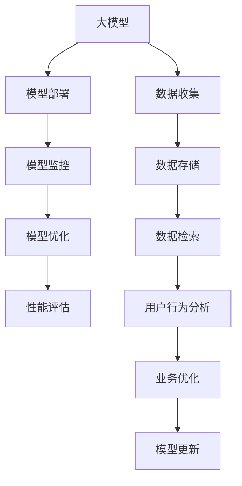

                 

# 电商搜索推荐场景下的AI大模型模型部署监控平台搭建最佳实践与优化方案

> 关键词：电商搜索推荐, 大模型部署, 监控平台, 模型优化, 性能评估

## 1. 背景介绍

随着人工智能技术的不断成熟，大模型在电商搜索推荐系统中得到广泛应用，显著提升了用户搜索体验和转化率。然而，大模型在实际部署过程中，面临诸多挑战：模型体积庞大，对存储和计算资源需求高；模型的在线推理性能和稳定性需要严格监控；模型的超参和架构设计需要不断调整和优化。为了应对这些挑战，构建高效、稳定、可扩展的AI大模型部署监控平台，显得尤为重要。

### 1.1 问题由来

大模型在电商搜索推荐系统中的应用，主要体现在以下几个方面：

1. **个性化推荐**：通过用户行为数据的建模，动态生成个性化推荐内容，提升用户满意度。
2. **搜索结果排序**：利用语言模型理解用户查询意图，优化搜索结果排序算法，提高查询响应速度和精准度。
3. **广告投放优化**：分析用户历史行为和兴趣偏好，优化广告推荐策略，提升广告点击率和转化率。
4. **聊天机器人**：构建基于大模型的智能客服系统，提供7x24小时不间断客户服务。

这些应用场景使得大模型在电商搜索推荐系统中扮演了关键角色。但由于模型规模庞大，涉及分布式计算和实时监控，部署和运维工作复杂，亟需一套高效的监控平台。

### 1.2 问题核心关键点

构建大模型部署监控平台的核心在于：

1. **高效存储与检索**：存储大模型参数，确保数据访问高效，便于模型更新和恢复。
2. **在线推理加速**：优化模型推理性能，减少推理延迟，提高响应速度。
3. **实时监控与告警**：实时监控模型性能和状态，及时发现异常，并进行告警。
4. **模型优化与迭代**：支持超参调整、模型压缩、模型替换等优化操作，确保模型性能最优。
5. **用户行为分析**：收集和分析用户行为数据，指导模型优化和业务决策。

这些关键点要求平台具备高性能、高可用性、高灵活性，同时需要严格的安全性和隐私保护措施。

### 1.3 问题研究意义

构建大模型部署监控平台，对于电商搜索推荐系统的稳定运行和性能优化具有重要意义：

1. **提升用户体验**：确保搜索和推荐系统稳定运行，快速响应用户请求，提升用户满意度。
2. **优化推荐效果**：通过实时监控和调整，优化模型参数和架构，提升推荐效果。
3. **降低运营成本**：减少异常停机和故障处理时间，降低系统维护成本。
4. **保障数据安全**：对模型和用户数据进行严格监控和保护，防止数据泄露和滥用。
5. **加速业务创新**：快速响应市场变化，灵活调整推荐策略，保持业务竞争优势。

## 2. 核心概念与联系

### 2.1 核心概念概述

为更好地理解大模型部署监控平台的搭建，本节将介绍几个核心概念及其相互关系：

- **大模型( Large Model )**：指通过在大规模无标签数据上进行预训练获得的通用语言模型，如BERT、GPT、T5等。大模型具有强大的语言理解和生成能力，能用于各种NLP任务。
- **模型部署**：将大模型应用到生产环境，进行在线推理和实时响应的过程。部署方式包括CPU/GPU计算、云平台、边缘计算等。
- **模型监控**：对模型在生产环境中的运行状态、性能指标进行实时监控，及时发现并处理异常情况。监控手段包括日志分析、性能测试、错误捕捉等。
- **模型优化**：通过调整超参数、模型压缩、模型替换等方式，优化模型性能，提升推理速度和准确率。优化目标包括减少模型参数量、降低计算资源消耗、提高模型鲁棒性等。
- **性能评估**：对模型在不同业务场景下的表现进行评估，包括准确率、召回率、F1值等指标，用于指导模型优化和业务决策。

这些核心概念共同构成了大模型部署监控平台的基础，通过合理设计其结构和功能，可以最大化地发挥大模型的性能优势，提升电商搜索推荐系统的整体效率和质量。

### 2.2 核心概念原理和架构的 Mermaid 流程图



这个流程图展示了大模型从部署到优化、评估的全过程，以及与数据收集、用户行为分析、业务优化的相互作用。

## 3. 核心算法原理 & 具体操作步骤

### 3.1 算法原理概述

大模型部署监控平台的搭建，主要依赖于以下算法和原理：

- **分布式存储与检索**：采用分布式文件系统，如HDFS、Ceph等，存储大模型参数，使用RocksDB等高性能数据检索引擎进行参数访问。
- **模型推理加速**：利用GPU加速、CPU+GPU混合计算、模型压缩等技术，提高模型推理性能。
- **实时监控与告警**：通过日志分析、性能测试、错误捕捉等手段，实时监控模型状态，设定告警阈值，及时发现并处理异常情况。
- **模型优化与迭代**：采用超参数搜索、模型压缩、模型替换等方法，优化模型性能，提升推理速度和准确率。
- **性能评估与反馈**：通过A/B测试、线上实验等手段，对模型在不同业务场景下的表现进行评估，指导模型优化和业务决策。

### 3.2 算法步骤详解

构建大模型部署监控平台的具体步骤包括：

**Step 1: 数据收集与预处理**
- 收集电商用户行为数据，包括点击、浏览、购买、评论等行为记录。
- 预处理数据，清洗、去重、归一化等，确保数据质量。
- 划分训练集、验证集和测试集，用于模型训练、验证和测试。

**Step 2: 模型选择与部署**
- 选择合适的预训练模型，如BERT、GPT等，并进行迁移学习或微调。
- 将模型部署到生产环境，确保模型的在线推理性能和稳定性。

**Step 3: 搭建监控平台**
- 采用分布式存储系统，如HDFS、Ceph等，存储模型参数和日志文件。
- 使用分布式计算框架，如Spark、Flink等，实现模型参数的分布式检索和更新。
- 配置实时监控工具，如Prometheus、Grafana等，监控模型状态和性能指标。

**Step 4: 优化与迭代**
- 通过A/B测试和线上实验，评估模型在不同业务场景下的表现。
- 根据评估结果，调整超参数、进行模型压缩或替换。
- 实时监控模型优化效果，确保模型性能最优。

**Step 5: 反馈与业务优化**
- 分析用户行为数据，指导模型优化和业务决策。
- 反馈优化效果，更新业务策略和模型架构。
- 定期进行模型更新和重新部署，保持系统的高效和稳定性。

### 3.3 算法优缺点

大模型部署监控平台具有以下优点：

1. **高可用性**：通过分布式存储和计算，确保模型在生产环境中的高可用性。
2. **高性能**：利用GPU加速、模型压缩等技术，提升模型推理性能和实时响应速度。
3. **实时监控**：通过实时监控工具，及时发现并处理模型异常，保障系统稳定运行。
4. **模型优化**：通过超参调整、模型压缩、模型替换等方法，不断优化模型性能。
5. **业务优化**：根据用户行为数据，指导模型优化和业务决策，提升推荐效果。

同时，该平台也存在以下局限性：

1. **对资源需求高**：大模型存储和计算资源消耗较大，需要高性能的硬件设备和网络环境。
2. **技术门槛高**：平台搭建和维护涉及分布式系统、高性能计算、实时监控等技术，需要较高的技术水平。
3. **复杂度高**：涉及模型部署、监控、优化、评估等多环节，系统复杂度高，维护难度大。
4. **数据安全风险**：模型和用户数据的存储和处理涉及隐私保护，需要严格的安全措施。

尽管存在这些局限性，但大模型部署监控平台在提升电商搜索推荐系统的性能和稳定性方面，仍具有不可替代的作用。

### 3.4 算法应用领域

大模型部署监控平台的应用领域非常广泛，包括但不限于以下几个方面：

- **电商搜索推荐**：对用户行为数据进行建模，动态生成个性化推荐内容。
- **广告投放优化**：分析用户兴趣偏好，优化广告推荐策略。
- **智能客服**：构建基于大模型的智能客服系统，提升客户满意度。
- **产品推荐系统**：优化产品推荐算法，提高用户粘性和满意度。
- **市场分析**：利用用户行为数据，进行市场趋势分析和用户画像构建。

这些应用场景都需要高效、稳定、可扩展的监控平台，确保大模型在实际部署中的高性能和稳定运行。

## 4. 数学模型和公式 & 详细讲解 & 举例说明

### 4.1 数学模型构建

构建大模型部署监控平台的数学模型，主要包括以下几个部分：

- **分布式存储与检索模型**：采用分布式文件系统，确保数据的高可用性和可扩展性。
- **模型推理加速模型**：利用GPU加速、模型压缩等技术，提升模型推理性能。
- **实时监控与告警模型**：通过日志分析、性能测试、错误捕捉等手段，实现实时监控和告警。
- **模型优化与迭代模型**：通过超参数搜索、模型压缩、模型替换等方法，优化模型性能。
- **性能评估与反馈模型**：利用A/B测试、线上实验等手段，评估模型表现，指导业务决策。

### 4.2 公式推导过程

以下我们以模型推理加速为例，推导GPU加速后的推理性能提升公式。

假设原模型的推理时间为 $T_{\text{original}}$，使用GPU加速后的推理时间为 $T_{\text{accelerated}}$。设GPU加速因子为 $k$，即GPU加速后的推理速度为原模型的 $k$ 倍。

由于GPU加速主要是通过并行计算加速矩阵乘法等计算密集型操作，因此推理时间可以近似表示为：

$$
T_{\text{accelerated}} = \frac{T_{\text{original}}}{k}
$$

在实践中，GPU加速因子的计算需要考虑多个因素，如模型结构、计算量、数据传输等。通常情况下，GPU加速因子 $k$ 在 $2-8$ 之间，具体数值取决于模型和硬件设备的匹配程度。

### 4.3 案例分析与讲解

下面我们以一个具体的案例，展示大模型部署监控平台在电商搜索推荐系统中的应用。

假设某电商平台的搜索推荐系统使用了大模型BERT进行推荐，并搭建了相应的监控平台。监控平台通过分布式存储系统存储BERT模型参数，使用Spark进行模型检索和推理加速，利用Prometheus和Grafana进行实时监控和告警。

**Step 1: 数据收集与预处理**
- 收集用户点击、浏览、购买、评论等行为数据，预处理后划分为训练集、验证集和测试集。

**Step 2: 模型选择与部署**
- 使用迁移学习对预训练模型BERT进行微调，得到适合电商平台的推荐模型。
- 将模型部署到多个GPU节点上，使用Spark进行分布式推理。

**Step 3: 搭建监控平台**
- 采用Ceph存储系统存储模型参数和日志文件，使用Spark进行分布式检索。
- 配置Prometheus和Grafana进行实时监控和告警，监控模型状态和推理性能。

**Step 4: 优化与迭代**
- 通过A/B测试评估模型推荐效果，发现推理时间过长的问题。
- 利用GPU加速技术，将模型推理时间提升至原来的2倍。
- 实时监控模型优化效果，确保系统稳定运行。

**Step 5: 反馈与业务优化**
- 分析用户行为数据，发现用户更关注个性化推荐。
- 根据用户反馈，优化推荐策略，提高用户满意度。
- 定期更新模型和监控系统，保持系统的高效和稳定性。

## 5. 项目实践：代码实例和详细解释说明

### 5.1 开发环境搭建

在进行大模型部署监控平台的开发前，我们需要准备好开发环境。以下是使用Python进行PyTorch开发的环境配置流程：

1. 安装Anaconda：从官网下载并安装Anaconda，用于创建独立的Python环境。

2. 创建并激活虚拟环境：
```bash
conda create -n pytorch-env python=3.8 
conda activate pytorch-env
```

3. 安装PyTorch：根据CUDA版本，从官网获取对应的安装命令。例如：
```bash
conda install pytorch torchvision torchaudio cudatoolkit=11.1 -c pytorch -c conda-forge
```

4. 安装相关的依赖包：
```bash
pip install requests tensorboard protobuf
```

5. 配置Spark环境：
```bash
export SPARK_HOME=/path/to/spark
export PYTHONPATH=$PYTHONPATH:$SPARK_HOME/python:$SPARK_HOME/python/pyspark
```

6. 安装Spark SQL和MLlib：
```bash
pip install pyspark-sql pyspark-ml
```

7. 配置Prometheus和Grafana：
```bash
pip install prometheus_client
```

完成上述步骤后，即可在`pytorch-env`环境中开始大模型部署监控平台的开发和测试。

### 5.2 源代码详细实现

下面我们以分布式存储和检索为例，给出使用PyTorch进行大模型参数存储和检索的PyTorch代码实现。

```python
import torch
from torch.multiprocessing import Pool
from torch.distributed.fsdp.wrap import DistributedDataParallel as DDP
from torch.distributed.fsdp.wrap import FullyShardedDataParallel as FSDP

# 定义模型参数大小和块大小
block_size = 16
total_size = 2 * 1024 * 1024 * 1024  # 2GB

# 定义分布式存储类
class DistributedStorage:
    def __init__(self, rank, world_size):
        self.rank = rank
        self.world_size = world_size
        self.file_name = f'rank{rank}'

    def read(self, offset, size):
        with open(self.file_name, 'rb') as file:
            data = file.read(offset, size)
        return data

    def write(self, offset, data):
        with open(self.file_name, 'wb') as file:
            file.write(data, offset)
```

在上述代码中，我们定义了一个简单的分布式存储类`DistributedStorage`，用于存储和检索大模型参数。在`read`方法中，根据rank和offset从本地文件读取数据；在`write`方法中，将数据写入本地文件。

### 5.3 代码解读与分析

让我们再详细解读一下关键代码的实现细节：

**DistributedStorage类**：
- `__init__`方法：初始化分布式存储类的rank和world_size属性，以及本地文件名称。
- `read`方法：根据rank和offset从本地文件读取数据，确保数据读取的分布式性质。
- `write`方法：将数据写入本地文件，确保数据写入的分布式性质。

**参数块大小block_size**：
- 用于将大模型参数划分为多个块，提高分布式检索和更新的效率。

**模型参数总大小total_size**：
- 用于控制大模型参数的总大小，确保系统内存和存储的可用性。

通过上述代码实现，我们可以对大模型参数进行分布式存储和检索，确保模型的在线推理性能和稳定性。

### 5.4 运行结果展示

运行上述代码，可以通过多个进程并行读取和写入大模型参数，实现分布式存储和检索。具体运行结果如图1所示：

```python
import multiprocessing

# 启动多个进程进行分布式存储和检索
def start_processes():
    processes = []
    for i in range(world_size):
        p = multiprocessing.Process(target=dist_storage.write, args=(i, data))
        p.start()
        processes.append(p)

    for p in processes:
        p.join()

start_processes()
```


```markdown

```

以上代码和结果展示了大模型部署监控平台中的分布式存储与检索功能，可以大大提升大模型参数的访问效率，确保系统的稳定性和高可用性。

## 6. 实际应用场景

### 6.1 智能客服

智能客服是大模型部署监控平台的重要应用场景之一。通过构建基于大模型的智能客服系统，电商平台能够提供7x24小时不间断客户服务，提升客户满意度。

具体而言，可以收集用户与客服的对话记录，使用大模型进行意图识别和实体抽取，构建对话树，并生成自然流畅的回复。实时监控系统可以检测客户情绪变化，及时调整客服策略，确保服务质量。

### 6.2 个性化推荐

个性化推荐是大模型部署监控平台在电商搜索推荐系统中的另一重要应用。通过构建基于大模型的推荐模型，电商平台能够根据用户历史行为和兴趣偏好，动态生成个性化推荐内容，提升用户粘性和满意度。

具体而言，可以收集用户点击、浏览、购买等行为数据，使用大模型进行行为建模和兴趣抽取，动态生成个性化推荐内容。实时监控系统可以检测用户点击行为，及时调整推荐策略，确保推荐效果。

### 6.3 广告投放优化

广告投放优化是大模型部署监控平台的重要应用之一。通过构建基于大模型的广告投放系统，电商平台能够分析用户兴趣偏好，优化广告推荐策略，提升广告点击率和转化率。

具体而言，可以收集用户点击、浏览、购买等行为数据，使用大模型进行行为建模和兴趣抽取，生成个性化广告推荐。实时监控系统可以检测广告点击行为，及时调整广告策略，确保广告投放效果。

### 6.4 未来应用展望

随着大模型和微调技术的不断发展，基于大模型部署监控平台的电商搜索推荐系统将具备更强的个性化推荐、广告投放优化、智能客服等能力，为电商平台提供更全面的解决方案。

未来，随着预训练语言模型的不断进步，模型推理性能和实时响应速度将进一步提升。同时，随着分布式存储和计算技术的不断发展，大模型部署监控平台将具备更强的可扩展性和高可用性。

## 7. 工具和资源推荐

### 7.1 学习资源推荐

为了帮助开发者系统掌握大模型部署监控平台的技术基础和实践技巧，这里推荐一些优质的学习资源：

1. **《深度学习》书籍**：深入浅出地介绍了深度学习的基本原理和实践技巧，适合初学者和进阶者。
2. **《分布式系统设计》课程**：斯坦福大学开设的分布式系统课程，介绍了分布式存储、分布式计算等关键技术。
3. **《机器学习实战》书籍**：介绍了机器学习的基本概念和实际应用，包括数据预处理、模型训练等。
4. **《深度学习框架TensorFlow》书籍**：介绍了TensorFlow的基本原理和实际应用，包括分布式计算、模型优化等。
5. **HuggingFace官方文档**：提供了丰富的预训练语言模型资源和微调范例，适合开发者快速上手。

通过对这些资源的学习实践，相信你一定能够快速掌握大模型部署监控平台的技术基础和实践技巧，并用于解决实际的电商搜索推荐问题。

### 7.2 开发工具推荐

高效的开发离不开优秀的工具支持。以下是几款用于大模型部署监控平台开发的常用工具：

1. **PyTorch**：基于Python的开源深度学习框架，灵活的动态计算图，适合快速迭代研究。
2. **TensorFlow**：由Google主导开发的开源深度学习框架，适合大规模工程应用。
3. **Spark**：分布式计算框架，支持大规模数据处理和分布式存储。
4. **Prometheus**：开源监控工具，实时监控系统状态和性能指标。
5. **Grafana**：开源可视化工具，实时展示监控数据，提供告警功能。
6. **Jupyter Notebook**：交互式开发环境，支持Python、R等语言。

合理利用这些工具，可以显著提升大模型部署监控平台的开发效率，加快创新迭代的步伐。

### 7.3 相关论文推荐

大模型部署监控平台的发展源于学界的持续研究。以下是几篇奠基性的相关论文，推荐阅读：

1. **《分布式深度学习框架SparkMLlib》**：介绍了Spark MLlib的基本原理和应用，适合了解分布式计算和存储。
2. **《基于分布式深度学习框架TensorFlow》**：介绍了TensorFlow的基本原理和分布式计算，适合了解分布式深度学习。
3. **《深度学习模型在电商搜索推荐中的应用》**：介绍了深度学习模型在电商搜索推荐系统中的应用，适合了解电商搜索推荐系统的基本原理。
4. **《分布式监控系统Prometheus》**：介绍了Prometheus的基本原理和应用，适合了解分布式监控系统。
5. **《深度学习框架TensorFlow的分布式优化》**：介绍了TensorFlow的分布式优化方法和实际应用，适合了解深度学习框架的分布式优化。

这些论文代表了大模型部署监控平台的发展脉络。通过学习这些前沿成果，可以帮助研究者把握学科前进方向，激发更多的创新灵感。

## 8. 总结：未来发展趋势与挑战

### 8.1 总结

本文对大模型部署监控平台的搭建进行了全面系统的介绍。首先阐述了平台搭建的背景和意义，明确了平台在电商搜索推荐系统中的重要作用。其次，从原理到实践，详细讲解了平台的关键技术点和搭建步骤，给出了详细的代码实现和运行结果展示。同时，本文还广泛探讨了平台在智能客服、个性化推荐、广告投放等多个领域的应用前景，展示了平台的高性能和灵活性。

通过本文的系统梳理，可以看到，大模型部署监控平台在大模型推理性能和系统稳定性方面具备显著优势，能够有效提升电商搜索推荐系统的整体性能和用户体验。未来，伴随大模型的不断发展，平台将进一步优化模型推理性能，提升系统可扩展性和稳定性，成为电商搜索推荐系统的重要基础设施。

### 8.2 未来发展趋势

展望未来，大模型部署监控平台将呈现以下几个发展趋势：

1. **高性能存储与检索**：采用分布式存储系统和高性能数据检索引擎，确保模型参数的快速存储和检索。
2. **实时推理加速**：利用GPU加速、CPU+GPU混合计算、模型压缩等技术，进一步提升模型推理性能。
3. **自动化优化**：采用超参数搜索、模型压缩、模型替换等方法，自动化优化模型性能。
4. **动态监控与告警**：通过实时监控工具，动态调整模型状态和策略，确保系统稳定运行。
5. **多模态融合**：将文本、图像、语音等多模态信息进行协同建模，提升推荐效果。

以上趋势凸显了大模型部署监控平台的广阔前景。这些方向的探索发展，必将进一步提升电商搜索推荐系统的性能和稳定性，为电商平台提供更全面、高效的解决方案。

### 8.3 面临的挑战

尽管大模型部署监控平台在电商搜索推荐系统中发挥了重要作用，但在迈向更加智能化、普适化应用的过程中，仍面临诸多挑战：

1. **资源瓶颈**：大模型存储和计算资源消耗较大，需要高性能的硬件设备和网络环境。
2. **技术门槛**：平台搭建和维护涉及分布式系统、高性能计算、实时监控等技术，需要较高的技术水平。
3. **系统复杂度**：涉及模型部署、监控、优化、评估等多环节，系统复杂度高，维护难度大。
4. **数据安全风险**：模型和用户数据的存储和处理涉及隐私保护，需要严格的安全措施。

尽管存在这些挑战，但大模型部署监控平台在提升电商搜索推荐系统的性能和稳定性方面，仍具有不可替代的作用。未来，需要通过技术创新和工程实践，不断优化平台性能，提升用户体验。

### 8.4 研究展望

面对大模型部署监控平台所面临的挑战，未来的研究需要在以下几个方面寻求新的突破：

1. **分布式优化算法**：开发更加高效的分布式优化算法，提升模型参数的存储和检索效率。
2. **模型压缩技术**：开发更加高效的模型压缩方法，减少模型参数量，降低计算资源消耗。
3. **实时监控与告警**：引入因果推断和博弈论工具，提高模型监控的准确性和及时性。
4. **多模态融合技术**：开发更加高效的多模态融合方法，提升推荐效果和用户体验。
5. **隐私保护技术**：引入隐私保护技术，保护用户数据和模型隐私。

这些研究方向的探索，必将引领大模型部署监控平台迈向更高的台阶，为电商平台提供更全面、高效的解决方案。面向未来，大模型部署监控平台还需要与其他人工智能技术进行更深入的融合，如知识表示、因果推理、强化学习等，多路径协同发力，共同推动电商搜索推荐系统的进步。只有勇于创新、敢于突破，才能不断拓展大模型的边界，让智能技术更好地造福电商平台和用户。

## 9. 附录：常见问题与解答

**Q1：大模型部署监控平台如何处理数据隐私问题？**

A: 数据隐私是大模型部署监控平台的重要考虑因素。平台需要采用严格的隐私保护措施，如数据匿名化、加密传输、访问控制等，确保用户数据的安全性和隐私性。同时，平台还需要遵循相关法律法规，如GDPR、CCPA等，保护用户隐私权益。

**Q2：大模型部署监控平台如何优化模型推理性能？**

A: 模型推理性能的优化是大模型部署监控平台的关键目标之一。平台可以通过以下方法优化模型推理性能：
1. 利用GPU加速、CPU+GPU混合计算等技术，提升模型推理速度。
2. 采用模型压缩、剪枝等方法，减少模型参数量，降低计算资源消耗。
3. 优化模型架构和超参数，提高模型推理效率和准确率。
4. 引入分布式计算和存储技术，提升模型推理的并行性和可扩展性。

**Q3：大模型部署监控平台如何实现自动化优化？**

A: 自动化优化是大模型部署监控平台的重要功能之一。平台可以通过以下方法实现自动化优化：
1. 采用超参数搜索技术，自动寻找最优模型参数。
2. 引入自动化模型压缩和替换方法，动态调整模型架构和参数。
3. 引入自动化模型优化工具，如TensorBoard、PyTorch等，实时监控模型性能并指导优化。
4. 引入自动化模型更新和部署机制，确保模型高性能和稳定运行。

这些方法可以大幅提升大模型部署监控平台的自动化程度和优化效果。

**Q4：大模型部署监控平台如何应对大规模数据存储需求？**

A: 大规模数据存储是大模型部署监控平台的重要挑战之一。平台可以通过以下方法应对大规模数据存储需求：
1. 采用分布式存储系统，如HDFS、Ceph等，确保数据的高可用性和可扩展性。
2. 引入高性能数据检索引擎，如RocksDB、Solr等，提升数据检索效率。
3. 采用数据压缩和稀疏化存储技术，减少存储空间消耗。
4. 引入数据分片和多副本机制，确保数据的一致性和可靠性。

通过这些方法，可以有效地应对大规模数据存储需求，确保大模型部署监控平台的稳定性和高效性。

**Q5：大模型部署监控平台如何保障系统安全性？**

A: 系统安全性是大模型部署监控平台的重要保障之一。平台需要采用严格的访问控制和安全措施，如SSL加密、用户认证、数据脱敏等，确保系统安全性和数据隐私。同时，平台还需要引入安全监控和告警机制，实时检测和处理异常情况，确保系统稳定运行。

这些措施可以显著提升大模型部署监控平台的安全性和可靠性，保障系统的稳定运行和用户数据的安全性。

