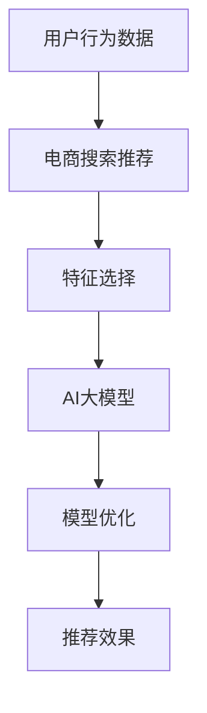

                 

# 电商搜索推荐效果优化中的AI大模型特征选择技巧

> 关键词：电商搜索推荐, 大模型, 特征选择, AI, 优化效果

## 1. 背景介绍

随着电子商务的飞速发展，电商搜索推荐系统作为用户获取商品的重要渠道，其推荐效果直接影响到用户的购物体验和平台的用户留存率。当前电商推荐系统普遍采用深度学习算法，其中AI大模型在处理大规模数据和复杂特征方面展现出强大的能力，成为提升推荐效果的重要手段。然而，大模型的高维特征空间和海量参数增加了算法的复杂度，导致训练和推理过程中的时间和资源消耗大幅增加。如何在大模型框架下有效选择和利用特征，优化推荐效果，成为电商搜索推荐系统亟需解决的重要问题。

本文将详细介绍AI大模型在电商搜索推荐系统中的特征选择技巧，旨在帮助开发者通过优化特征选择策略，提高模型性能，降低计算成本。

## 2. 核心概念与联系

### 2.1 核心概念概述

为了更好地理解AI大模型在电商搜索推荐系统中的应用，本文将介绍几个核心概念：

- **AI大模型**：以自回归或自编码结构为基础，通过大规模预训练学习到的复杂语言模型。在电商推荐中，大模型能够处理用户行为、商品属性等多维特征，输出高质量的推荐结果。

- **电商搜索推荐**：通过分析用户行为数据，预测用户可能感兴趣的商品，并通过算法优化推荐顺序，提升用户满意度和购物体验的推荐系统。

- **特征选择**：在构建模型之前，从原始数据中选择最相关和最有信息的特征，减少计算复杂度，提升模型性能。

- **模型优化**：通过调整模型参数、选择合适的网络结构等手段，提升模型在新数据上的泛化能力，优化推荐效果。

- **推荐效果**：推荐系统实际推荐的效果，通常由点击率、转化率、销售额等指标来评估。

这些核心概念之间的关系可以概括为：AI大模型通过对电商搜索推荐系统中海量的用户行为和商品属性数据进行处理，通过特征选择和模型优化，最终提升推荐效果，为用户提供更精准的推荐服务。

### 2.2 核心概念原理和架构的 Mermaid 流程图



这个流程图展示了电商搜索推荐系统中的核心流程：用户行为数据首先经过特征选择过程，筛选出对推荐有贡献的特征；然后通过AI大模型对这些特征进行处理，生成推荐结果；最后，对模型进行优化，最终提升推荐效果。

## 3. 核心算法原理 & 具体操作步骤

### 3.1 算法原理概述

基于AI大模型的电商搜索推荐系统，其特征选择主要涉及以下两个步骤：

1. **特征提取**：从原始数据中提取最具代表性和相关性的特征，并使用大模型对这些特征进行处理。
2. **特征融合**：将提取的特征融合到模型的输入中，并通过训练模型来优化特征的权重，最终提升推荐效果。

### 3.2 算法步骤详解

#### 3.2.1 特征提取

特征提取通常包括以下几个步骤：

- **数据预处理**：对原始数据进行清洗、归一化、缺失值填充等预处理操作，确保数据质量。
- **特征工程**：构建新的特征，如基于时间序列的用户行为特征、商品属性特征等。
- **特征选择**：使用统计方法或机器学习方法，选择与推荐效果最相关的特征。

常用的特征选择方法包括：

- **基于统计的方法**：如方差、信息增益、卡方检验等，通过计算特征与推荐结果之间的统计关系，选择最相关特征。
- **基于机器学习的方法**：如随机森林、Lasso回归、Adaboost等，通过构建模型预测推荐结果，选择影响最大的特征。

#### 3.2.2 特征融合

特征融合是指将提取的特征组合成一个输入向量，输入到大模型中进行处理。常用的特征融合方法包括：

- **拼接融合**：将不同特征拼接成一个长向量，作为模型的输入。
- **加权融合**：对每个特征进行加权，根据其重要性决定权重，然后进行融合。

### 3.3 算法优缺点

基于AI大模型的特征选择方法具有以下优点：

- **处理能力**：大模型能够处理高维特征空间，无需担心维度灾难问题。
- **泛化能力**：通过预训练，大模型学习到通用的特征表示，适应性更强。
- **优化效果**：自动优化特征权重，提高推荐效果。

但其缺点也不容忽视：

- **计算成本高**：大模型参数量大，训练和推理消耗时间长。
- **过拟合风险**：特征选择不当可能导致模型过拟合，降低泛化能力。
- **模型解释困难**：大模型结构复杂，特征选择和融合的每一步都难以解释。

### 3.4 算法应用领域

基于AI大模型的特征选择技巧，已经被广泛应用于多个电商推荐场景中，包括：

- **商品推荐**：通过分析用户历史购买行为和浏览记录，推荐用户可能感兴趣的商品。
- **个性化推荐**：根据用户画像，推荐个性化的商品和优惠活动。
- **促销活动推荐**：根据用户行为和季节性促销数据，推荐优惠活动。
- **库存管理**：预测商品销量，优化库存水平，减少缺货或过剩。

## 4. 数学模型和公式 & 详细讲解

### 4.1 数学模型构建

假设电商搜索推荐系统中的用户行为数据为 $D=\{(x_i,y_i)\}_{i=1}^N$，其中 $x_i$ 为用户的浏览记录、购买历史等行为数据，$y_i$ 为推荐的商品ID。

特征选择过程可以看作是从原始特征 $x_i$ 中筛选出相关特征 $x_i'$，并输入到大模型 $M_{\theta}$ 中进行处理，最终输出推荐结果 $y_i$。模型训练的目标是最小化预测误差 $L$：

$$
L = \frac{1}{N} \sum_{i=1}^N (y_i - M_{\theta}(x_i'))^2
$$

### 4.2 公式推导过程

以一个简单的加权拼接融合方法为例，假设提取的特征数量为 $k$，则拼接后的输入向量 $X$ 为：

$$
X = [x_1', x_2', ..., x_k']
$$

模型的输入为 $X$，输出为 $y$，模型的参数为 $\theta$。根据最小二乘法，模型的预测误差 $L$ 可以表示为：

$$
L = \frac{1}{N} \sum_{i=1}^N (y_i - M_{\theta}(X_i))^2
$$

使用随机梯度下降法进行模型优化，每次迭代更新模型参数 $\theta$：

$$
\theta \leftarrow \theta - \eta \nabla_{\theta}L
$$

其中 $\eta$ 为学习率，$\nabla_{\theta}L$ 为损失函数对模型参数的梯度，可以通过反向传播算法计算。

### 4.3 案例分析与讲解

以下是一个基于AI大模型的电商推荐系统特征选择案例：

**案例背景**：某电商平台希望通过用户浏览记录和购买历史预测用户可能感兴趣的商品。

**特征提取**：从用户浏览记录中提取特征，如浏览时间、浏览次数、点击次数等；从用户购买历史中提取特征，如购买时间、购买次数、购买金额等。

**特征融合**：对浏览特征和购买特征进行加权拼接，生成最终的输入向量 $X$。

**模型训练**：使用随机梯度下降法训练大模型，最小化预测误差 $L$。

**结果分析**：模型训练完成后，对新的用户行为数据进行预测，评估推荐效果。

## 5. 项目实践：代码实例和详细解释说明

### 5.1 开发环境搭建

要搭建基于AI大模型的电商推荐系统，需要以下开发环境：

- **编程语言**：Python
- **深度学习框架**：TensorFlow或PyTorch
- **数据处理库**：Pandas、NumPy等
- **模型库**：TensorFlow、PyTorch、Transformers等
- **可视化工具**：TensorBoard、Matplotlib等

**安装步骤**：

1. 安装Python及其相关依赖。
2. 安装深度学习框架和模型库。
3. 安装数据处理库和可视化工具。

### 5.2 源代码详细实现

以下是一个基于TensorFlow的电商推荐系统特征选择的示例代码：

```python
import tensorflow as tf
import pandas as pd
import numpy as np

# 数据准备
data = pd.read_csv('data.csv')
# 特征提取
features = extract_features(data)
# 特征选择
selected_features = select_features(features)
# 特征融合
fusion_features = fuse_features(selected_features)
# 模型训练
model = build_model(fusion_features)
model.compile(optimizer='adam', loss='mse')
model.fit(x_train, y_train, epochs=10, batch_size=32)
```

**代码解读与分析**：

- **特征提取**：根据具体业务需求，从原始数据中提取用户行为特征，如浏览时间、浏览次数、购买次数等。
- **特征选择**：使用统计方法或机器学习方法，筛选出与推荐效果最相关的特征。
- **特征融合**：将选定的特征进行拼接或加权融合，生成最终的输入向量。
- **模型训练**：使用TensorFlow构建大模型，进行模型训练和预测。

### 5.3 运行结果展示

在模型训练完成后，对新的用户行为数据进行预测，并评估推荐效果。以下是代码示例：

```python
test_data = pd.read_csv('test_data.csv')
test_features = extract_features(test_data)
test_fusion_features = fuse_features(test_features)
predictions = model.predict(test_fusion_features)
```

运行结果将给出预测商品的ID，这些商品ID可以根据实际业务需求进行评估，如点击率、转化率等指标。

## 6. 实际应用场景

### 6.1 个性化推荐

电商平台的个性化推荐系统，通过分析用户的浏览和购买历史，推荐用户可能感兴趣的商品。使用基于AI大模型的特征选择技巧，可以提升推荐系统的精准度和个性化程度。

### 6.2 促销活动推荐

电商平台根据用户行为数据和季节性促销信息，推荐个性化的优惠活动。通过特征选择，可以优化促销活动推荐的效果，提升活动转化率。

### 6.3 库存管理

电商平台通过预测商品销量，优化库存水平，减少缺货或过剩。使用基于AI大模型的特征选择技巧，可以更准确地预测销量，优化库存管理。

### 6.4 未来应用展望

基于AI大模型的特征选择技巧，将在未来的电商推荐系统中发挥越来越重要的作用。未来，我们有望实现以下突破：

- **多模态融合**：结合用户行为数据、商品属性、用户画像等多种信息，提升推荐效果。
- **实时推荐**：通过流数据处理和模型优化，实现实时推荐，提升用户体验。
- **跨域推荐**：将不同平台或应用场景中的推荐数据进行融合，提升推荐系统的通用性。

## 7. 工具和资源推荐

### 7.1 学习资源推荐

为了帮助开发者系统掌握基于AI大模型的特征选择技巧，这里推荐一些优质的学习资源：

- **深度学习基础课程**：如斯坦福大学的CS231n《深度学习》课程，系统介绍深度学习基础知识和算法。
- **大模型实践指南**：如Google的《TensorFlow机器学习实战》，详细讲解TensorFlow在大模型中的应用。
- **特征选择和模型优化**：如Coursera的《机器学习基础》课程，重点介绍特征选择和模型优化方法。

### 7.2 开发工具推荐

以下是几款用于基于AI大模型的电商推荐系统开发的常用工具：

- **TensorFlow**：由Google主导开发的深度学习框架，支持分布式训练和推理。
- **PyTorch**：Facebook开源的深度学习框架，支持动态计算图和GPU加速。
- **Keras**：基于TensorFlow和Theano的高级深度学习库，简化模型构建和训练。
- **Scikit-Learn**：Python中的机器学习库，提供简单易用的机器学习算法和工具。
- **Jupyter Notebook**：交互式Python开发环境，方便进行数据处理和模型实验。

### 7.3 相关论文推荐

大模型在电商推荐系统中的应用，是近年来研究的热点领域。以下是几篇代表性论文，推荐阅读：

- **Attention is All You Need**：Google提出的Transformer结构，成为大模型研究的基石。
- **BERT: Pre-training of Deep Bidirectional Transformers for Language Understanding**：Google提出的BERT模型，通过预训练和微调提升了NLP任务的性能。
- **Large-Scale Image Recognition from Scratch**：Google的InceptionV3模型，通过大规模数据训练实现了高精度的图像识别任务。

## 8. 总结：未来发展趋势与挑战

### 8.1 研究成果总结

本文对基于AI大模型的电商搜索推荐系统特征选择技巧进行了系统介绍。通过详细的步骤和案例分析，帮助开发者理解特征选择的原理和实现方法，提升模型性能和用户体验。

### 8.2 未来发展趋势

展望未来，基于AI大模型的特征选择技巧将呈现以下几个发展趋势：

- **多模态融合**：结合图像、文本、音频等多种数据源，提升推荐系统的精准度和个性化程度。
- **实时推荐**：通过流数据处理和模型优化，实现实时推荐，提升用户体验。
- **跨域推荐**：将不同平台或应用场景中的推荐数据进行融合，提升推荐系统的通用性。
- **强化学习**：结合强化学习算法，优化推荐策略，提升推荐效果。

### 8.3 面临的挑战

尽管基于AI大模型的特征选择技巧已经取得了一些进展，但在实际应用中仍然面临以下挑战：

- **计算资源消耗大**：大模型参数量庞大，训练和推理消耗时间长，需要高效的计算资源。
- **特征选择复杂**：特征选择方法需要根据具体业务场景进行调整，难以通用化。
- **模型解释困难**：大模型结构复杂，特征选择和融合的每一步都难以解释，影响用户信任。
- **过拟合风险**：特征选择不当可能导致模型过拟合，降低泛化能力。

### 8.4 研究展望

面向未来，基于AI大模型的特征选择技巧还需要在以下几个方面进行深入研究：

- **高效特征选择**：开发高效的特征选择算法，降低计算成本。
- **模型解释**：研究如何更好地解释模型决策过程，提升用户信任。
- **跨领域应用**：将特征选择方法应用于其他领域，如医疗、金融等，提升模型性能。
- **多模态融合**：结合图像、文本、音频等多种数据源，提升推荐系统的精准度和个性化程度。

通过这些研究，我们可以进一步提升基于AI大模型的电商推荐系统性能，为电商用户提供更精准、个性化的推荐服务。

## 9. 附录：常见问题与解答

**Q1：大模型在电商推荐中有什么优势？**

A: 大模型通过大规模预训练学习到丰富的特征表示，能够处理高维特征空间，提升推荐效果。同时，大模型具有较强的泛化能力，适应性更强。

**Q2：特征选择的方法有哪些？**

A: 特征选择方法包括基于统计的方法，如方差、信息增益、卡方检验等；基于机器学习的方法，如随机森林、Lasso回归、Adaboost等。

**Q3：如何评估特征选择的效果？**

A: 特征选择的效果可以通过交叉验证、ROC曲线、AUC等指标进行评估，选择最优的特征组合。

**Q4：模型优化的方法有哪些？**

A: 模型优化的方法包括超参数调优、正则化、对抗训练等，通过调整模型参数和结构，提升模型性能。

**Q5：如何在电商推荐中实现实时推荐？**

A: 通过流数据处理和模型优化，可以实现实时推荐。具体方法包括使用Streaming TensorFlow、实时模型更新等技术。

---

作者：禅与计算机程序设计艺术 / Zen and the Art of Computer Programming

