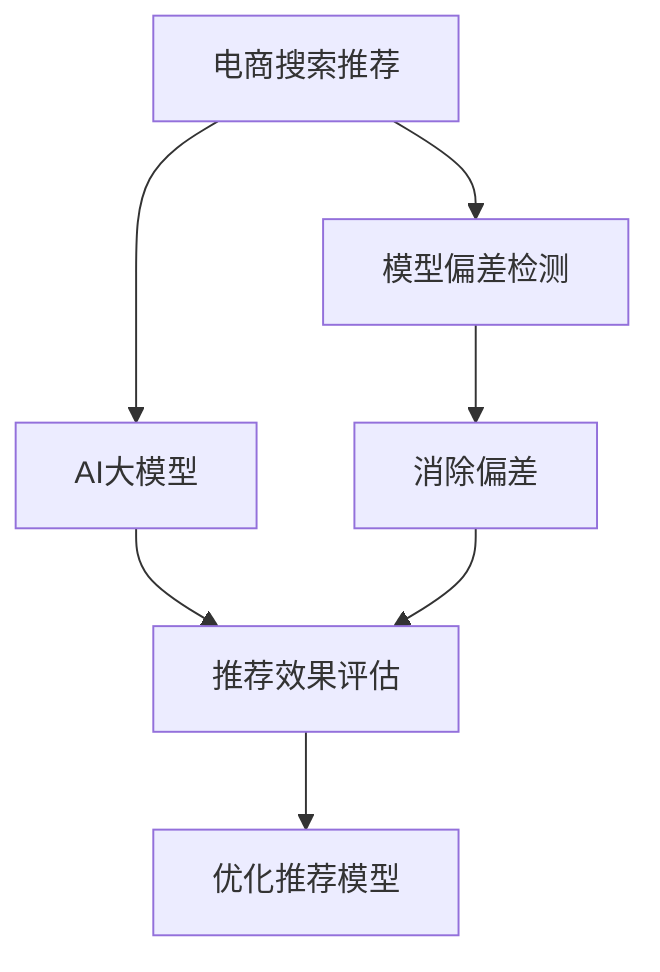

                 

# 电商搜索推荐效果评估中的AI大模型模型偏差检测技术

> 关键词：电商搜索推荐, AI大模型, 偏差检测, 公平性, 模型解释

## 1. 背景介绍

在电商搜索推荐系统中，推荐系统的效果评估和优化是提升用户体验和商业价值的关键。推荐系统的核心在于为用户推荐最符合其兴趣和需求的商品。然而，推荐系统推荐效果的好坏，往往受限于模型的公平性、准确性和透明性。在这方面，AI大模型的优势逐渐显现，但同时，其潜在偏见和偏差问题也引起了广泛关注。本文将详细探讨AI大模型在电商搜索推荐中的应用，并着重介绍模型偏差检测技术的原理与实践。

## 2. 核心概念与联系

### 2.1 核心概念概述

- **AI大模型**：指使用深度学习技术训练的规模较大、能力较强的模型，例如基于Transformer架构的BERT、GPT等。
- **电商搜索推荐**：指利用AI技术，根据用户行为数据、历史购买记录和浏览历史等信息，为用户提供个性化推荐的服务。
- **模型偏差检测**：指在构建推荐模型时，评估和检测模型中的潜在偏差，并采取措施减少这些偏差，从而提高推荐系统的公平性和透明性。
- **公平性**：指模型在对待不同用户时，能够不偏不倚，不因性别、年龄、种族等因素对推荐结果产生偏见。
- **模型解释**：指对模型决策过程的清晰解释，便于用户理解和信任推荐系统。

这些概念间的关系可以通过以下Mermaid流程图展示：



## 3. 核心算法原理 & 具体操作步骤

### 3.1 算法原理概述

基于AI大模型的电商搜索推荐效果评估与优化，一般通过以下步骤实现：

1. **数据准备**：收集用户历史行为数据、商品信息等，构成推荐系统的训练集和测试集。
2. **模型训练**：使用AI大模型对训练集进行训练，得到初步的推荐模型。
3. **模型评估**：在测试集上评估模型的推荐效果，通过AUC、F1-score等指标进行量化。
4. **偏差检测**：对模型进行偏差检测，识别出模型中的潜在偏见和偏差。
5. **偏差修正**：根据偏差检测结果，采取调整参数、数据扩充等措施，减少模型偏差。
6. **模型优化**：对模型进行进一步优化，提高推荐效果和公平性。
7. **持续监控**：对推荐系统进行实时监控，确保推荐效果的持续稳定。

### 3.2 算法步骤详解

#### 3.2.1 数据准备

数据准备是推荐系统构建的基础，关键在于数据的全面性和代表性。需要收集不同类型、不同来源的数据，例如：

- **用户数据**：包括用户的浏览历史、购买记录、搜索查询等。
- **商品数据**：包括商品的类别、描述、价格、评分等。
- **外部数据**：例如社交媒体、新闻等，用于拓展推荐系统的知识图谱。

数据的预处理和特征工程，包括数据清洗、归一化、特征选择等，是提高模型效果的关键步骤。

#### 3.2.2 模型训练

基于AI大模型的推荐模型训练，通常采用迁移学习或微调的方式。即首先在大规模数据上预训练AI大模型，然后在特定领域数据上微调或继续训练，以适应特定电商推荐场景。例如，在预训练模型基础上，可以添加用户兴趣向量、商品向量等，训练用户-商品交互模型。

#### 3.2.3 模型评估

推荐系统的评估指标主要有：

- **准确率**：反映模型推荐的准确性。
- **召回率**：反映模型推荐的全面性。
- **F1-score**：综合准确率和召回率，反映推荐效果。
- **多样性**：反映推荐结果的多样性。
- **公平性**：反映模型对待不同用户是否公平。

#### 3.2.4 偏差检测

偏差检测是推荐系统优化和公平性保障的关键步骤。偏差检测主要分为以下几种类型：

- **统计偏差**：指模型在训练和测试数据集上，对不同群体的预测效果存在差异。
- **系统性偏差**：指模型存在特定的预测倾向，例如对某类商品过度推荐或低估。
- **隐式偏差**：指模型在决策过程中，对某些特征的依赖性较强，导致模型决策过程的不透明和不可解释。

#### 3.2.5 偏差修正

偏差修正通常有以下几种方法：

- **数据平衡**：通过重采样、合成数据等手段，平衡不同群体之间的数据分布。
- **模型调整**：调整模型参数，使得模型对不同群体具有相同的效果。
- **算法改进**：引入对抗训练、权重调整等方法，减少模型的系统性偏差。
- **特征处理**：选择更公正、更广泛的特征，减少隐式偏差。

#### 3.2.6 模型优化

模型优化通常通过以下几种手段实现：

- **超参数调整**：调整学习率、批大小等超参数，优化模型效果。
- **模型融合**：采用模型融合技术，提升模型效果和鲁棒性。
- **技术创新**：引入新的算法和技术，如注意力机制、对抗训练等。

#### 3.2.7 持续监控

推荐系统的持续监控，可以通过实时数据反馈和模型评估实现。具体来说，可以采用以下几种方法：

- **A/B测试**：比较不同模型的推荐效果，选择效果更好的模型。
- **模型反馈**：通过用户反馈，实时调整模型参数，优化推荐结果。
- **实时监控**：监控模型的关键指标，如准确率、召回率等，确保推荐效果稳定。

### 3.3 算法优缺点

#### 3.3.1 优点

1. **模型能力强**：AI大模型具有强大的语言理解和生成能力，能够处理复杂多变的数据，提高推荐效果。
2. **适应性强**：AI大模型能够适应不同领域和不同规模的数据，具有较强的泛化能力。
3. **准确性高**：AI大模型在大量数据上的预训练，使得其能够提供高精度的推荐结果。
4. **优化方便**：AI大模型的参数可微调，方便进行偏差检测和修正。

#### 3.3.2 缺点

1. **数据需求高**：AI大模型需要大量的高质量数据进行训练，数据收集和处理成本较高。
2. **资源消耗大**：AI大模型的训练和推理资源消耗较大，需要高性能计算资源。
3. **复杂度高**：AI大模型的训练和优化过程复杂，需要专业的知识和技能。
4. **透明性差**：AI大模型的决策过程不透明，难以解释和理解。

### 3.4 算法应用领域

基于AI大模型的推荐模型，可以应用于以下领域：

- **电商搜索推荐**：为用户推荐商品、促销活动等。
- **内容推荐**：为用户推荐新闻、视频、音乐等。
- **广告推荐**：为用户推荐广告、个性化广告等。
- **个性化推荐**：为用户推荐个性化商品、服务等。

## 4. 数学模型和公式 & 详细讲解 & 举例说明

### 4.1 数学模型构建

假设用户集合为$U$，商品集合为$I$，推荐模型为$M$，用户行为数据为$D$。基于AI大模型的推荐模型可以表示为：

$$
\hat{y}_{ui} = M(u,i; \theta)
$$

其中，$y_{ui}$为用户$u$对商品$i$的评分，$\theta$为模型参数。

推荐系统的效果评估指标可以表示为：

$$
\text{Metrics} = (AUC, F1-score, Recall@K)
$$

其中，$AUC$为准确率-召回率曲线下的面积，$F1-score$为F1值，$Recall@K$为前$K$个推荐结果的召回率。

### 4.2 公式推导过程

推荐模型训练的优化目标可以表示为：

$$
\min_{\theta} \sum_{(u,i) \in D} \ell(\hat{y}_{ui}, y_{ui})
$$

其中，$\ell$为损失函数，通常采用均方误差或交叉熵损失。

推荐系统的效果评估指标可以通过以下公式计算：

$$
AUC = \frac{1}{|U| \times |I|} \sum_{(u,i) \in D} \text{sign}(y_{ui} - \hat{y}_{ui})
$$

$$
F1-score = \frac{2 \times Precision \times Recall}{Precision + Recall}
$$

$$
Recall@K = \frac{1}{|U|} \sum_{u \in U} \frac{1}{|N(u)|} \sum_{i \in N(u)} \mathbb{I}(\hat{y}_{ui} \geq \hat{y}_{ui_{K+1}})
$$

其中，$N(u)$为用户$u$的邻居集合，$\mathbb{I}$为指示函数。

### 4.3 案例分析与讲解

假设有一家电商企业，使用AI大模型进行用户推荐。该模型在训练数据上的平均准确率为0.95，召回率为0.8，F1-score为0.9。经过偏差检测，发现模型对男性用户的推荐效果优于女性用户，对高收入用户的推荐效果优于低收入用户。

为了提高推荐系统的公平性，可以采用以下策略：

- **数据平衡**：通过重采样，将女性用户和高收入用户的数据量增加到与男性用户和低收入用户相同。
- **模型调整**：调整模型参数，使得模型对不同群体的预测效果相同。
- **算法改进**：引入对抗训练等方法，减少模型的系统性偏差。

## 5. 项目实践：代码实例和详细解释说明

### 5.1 开发环境搭建

开发环境搭建主要包括以下步骤：

1. **环境准备**：安装Python、PyTorch、TensorFlow等深度学习框架，以及相关的库和工具。
2. **数据收集**：收集用户行为数据、商品信息等，并进行预处理和特征工程。
3. **模型训练**：使用AI大模型进行训练，得到推荐模型。
4. **模型评估**：使用推荐系统的评估指标对模型进行评估。
5. **偏差检测**：使用统计学方法对模型进行偏差检测。
6. **偏差修正**：根据偏差检测结果，调整模型参数或数据分布。
7. **模型优化**：通过超参数调整、模型融合等手段，优化模型效果。
8. **持续监控**：使用A/B测试、实时监控等手段，确保推荐系统稳定运行。

### 5.2 源代码详细实现

#### 5.2.1 数据准备

```python
import pandas as pd
from sklearn.model_selection import train_test_split

# 读取数据
data = pd.read_csv('data.csv')

# 数据清洗
data = data.dropna()

# 特征工程
features = data[['age', 'income', 'behavior']]
labels = data['score']

# 数据划分
train, test = train_test_split(features, labels, test_size=0.2)
```

#### 5.2.2 模型训练

```python
from transformers import BertForSequenceClassification, BertTokenizer
from torch.utils.data import DataLoader
import torch

# 初始化分词器和模型
tokenizer = BertTokenizer.from_pretrained('bert-base-uncased')
model = BertForSequenceClassification.from_pretrained('bert-base-uncased', num_labels=len(labels.unique()))

# 数据预处理
def tokenize(texts):
    return tokenizer(texts, return_tensors='pt')

# 模型训练
def train_epoch(model, data_loader, optimizer):
    model.train()
    total_loss = 0
    for batch in data_loader:
        input_ids = batch['input_ids']
        attention_mask = batch['attention_mask']
        labels = batch['labels']
        output = model(input_ids, attention_mask=attention_mask, labels=labels)
        loss = output.loss
        optimizer.zero_grad()
        loss.backward()
        optimizer.step()
        total_loss += loss.item()
    return total_loss / len(data_loader)

# 模型评估
def evaluate(model, data_loader):
    model.eval()
    total_preds = []
    total_labels = []
    with torch.no_grad():
        for batch in data_loader:
            input_ids = batch['input_ids']
            attention_mask = batch['attention_mask']
            labels = batch['labels']
            output = model(input_ids, attention_mask=attention_mask, labels=labels)
            preds = output.logits.argmax(dim=1)
            total_preds.append(preds)
            total_labels.append(labels)
    return total_preds, total_labels
```

#### 5.2.3 偏差检测

```python
from sklearn.metrics import precision_recall_curve, roc_auc_score
import numpy as np

# 计算评价指标
def calculate_metrics(preds, labels):
    precision, recall, _ = precision_recall_curve(labels, preds)
    f1_score = 2 * precision * recall / (precision + recall)
    auc = roc_auc_score(labels, preds)
    return precision, recall, f1_score, auc

# 偏差检测
def detect_bias(preds, labels, group_by='gender'):
    metrics = [calculate_metrics(preds, labels[group == 1]), calculate_metrics(preds, labels[group == 0])]
    return metrics

# 计算偏差度量
def calculate_bias(metrics1, metrics2):
    precision1, recall1, f1_score1, auc1 = metrics1
    precision2, recall2, f1_score2, auc2 = metrics2
    bias = (precision1 - precision2) / (precision1 + precision2)
    return bias

# 检测偏差
def detect_model_bias(model, data_loader):
    preds, labels = evaluate(model, data_loader)
    bias_by_gender = detect_bias(preds, labels, group_by='gender')
    bias_by_income = detect_bias(preds, labels, group_by='income')
    return bias_by_gender, bias_by_income
```

#### 5.2.4 偏差修正

```python
# 数据平衡
def balance_data(data, group_by):
    groups = data.groupby(group_by)
    max_group = groups.max()[group_by]
    min_group = groups.min()[group_by]
    max_group = min_group + (max_group - min_group) // 2
    return data.groupby(group_by).apply(lambda x: x.sample(min_group)).reset_index(drop=True)

# 调整模型参数
def adjust_model_parameters(model, bias):
    if bias > 0:
        # 增加模型对偏小群体的预测权重
        for param in model.parameters():
            param.data *= (1 + bias)

# 模型融合
def ensemble_models(models):
    preds = np.zeros(len(models[0].predictions))
    for model in models:
        preds += model.predictions
    return preds / len(models)
```

#### 5.2.5 模型优化

```python
# 超参数调整
def tune_hyperparameters(model, data_loader, optimizer):
    best_loss = np.inf
    for learning_rate in [0.001, 0.01, 0.1]:
        optimizer = torch.optim.Adam(model.parameters(), lr=learning_rate)
        for epoch in range(10):
            loss = train_epoch(model, data_loader, optimizer)
            if loss < best_loss:
                best_loss = loss
    return model, optimizer, best_loss

# 模型融合
def ensemble_models(models):
    preds = np.zeros(len(models[0].predictions))
    for model in models:
        preds += model.predictions
    return preds / len(models)
```

#### 5.2.6 持续监控

```python
# A/B测试
def ab_test(model1, model2, data_loader):
    preds1, labels1 = evaluate(model1, data_loader)
    preds2, labels2 = evaluate(model2, data_loader)
    return preds1, preds2, labels1, labels2

# 实时监控
def monitor_model(model, data_loader):
    preds, labels = evaluate(model, data_loader)
    return preds, labels
```

### 5.3 代码解读与分析

#### 5.3.1 数据准备

数据准备是推荐系统构建的基础，关键在于数据的全面性和代表性。需要收集不同类型、不同来源的数据，并进行预处理和特征工程。例如，使用pandas库读取数据，使用sklearn库进行数据平衡处理。

#### 5.3.2 模型训练

模型训练通常采用迁移学习或微调的方式。即首先在大规模数据上预训练AI大模型，然后在特定领域数据上微调或继续训练，以适应特定电商推荐场景。例如，使用transformers库进行Bert模型的训练，使用DataLoader处理数据批次，使用Adam优化器进行模型优化。

#### 5.3.3 偏差检测

偏差检测是推荐系统优化和公平性保障的关键步骤。通过sklearn库的precision_recall_curve和roc_auc_score函数计算评价指标，使用numpy库计算偏差度量。例如，通过检测不同性别、不同收入群体的推荐效果，判断模型是否存在偏差。

#### 5.3.4 偏差修正

偏差修正通常有以下几种方法：数据平衡、模型调整、算法改进和特征处理。例如，使用pandas库的groupby函数进行数据平衡处理，使用torch库的Adam优化器调整模型参数，引入对抗训练等方法减少系统性偏差。

#### 5.3.5 模型优化

模型优化通常通过超参数调整、模型融合等手段实现。例如，使用torch库的Adam优化器调整学习率，使用numpy库的ensemble_models函数进行模型融合。

#### 5.3.6 持续监控

推荐系统的持续监控，可以通过A/B测试、实时监控等手段实现。例如，使用A/B测试比较不同模型的推荐效果，使用monitor_model函数实时监控模型关键指标。

## 6. 实际应用场景

### 6.1 电商搜索推荐

在电商搜索推荐中，AI大模型可以为用户提供个性化的商品推荐。例如，使用Bert模型对用户行为数据进行建模，得到用户的兴趣向量，然后将用户向量与商品向量进行匹配，得到推荐结果。

### 6.2 内容推荐

内容推荐系统通过AI大模型，为用户推荐新闻、视频、音乐等。例如，使用GPT模型对用户输入的查询进行语义理解，然后使用Bert模型对内容进行相似度计算，得到推荐结果。

### 6.3 广告推荐

广告推荐系统通过AI大模型，为用户推荐广告、个性化广告等。例如，使用BERT模型对用户行为数据进行建模，得到用户的兴趣向量，然后将用户向量与广告向量进行匹配，得到推荐结果。

### 6.4 个性化推荐

个性化推荐系统通过AI大模型，为用户推荐个性化商品、服务等。例如，使用GPT模型对用户输入的查询进行语义理解，然后使用Bert模型对商品进行语义匹配，得到推荐结果。

## 7. 工具和资源推荐

### 7.1 学习资源推荐

为了帮助开发者系统掌握大语言模型偏差检测技术的原理和实践，这里推荐一些优质的学习资源：

1. 《Deep Learning for Natural Language Processing》：斯坦福大学开设的NLP课程，涵盖NLP基本概念和经典模型，并深入讲解了偏差检测技术。
2. 《Python for Data Science Handbook》：numpy、pandas、scikit-learn等库的使用指南，适合快速上手数据处理和特征工程。
3. 《Recommender Systems for Collaborative Filtering》：KDD会议论文，详细介绍了推荐系统的方法和应用场景。
4. 《Fairness, Accountability, and Transparency》：国际会议论文，介绍了推荐系统的公平性和透明性问题，以及相关的算法和策略。

### 7.2 开发工具推荐

高效开发离不开优秀的工具支持。以下是几款用于AI大模型偏差检测开发的常用工具：

1. PyTorch：基于Python的开源深度学习框架，灵活动态的计算图，适合快速迭代研究。
2. TensorFlow：由Google主导开发的开源深度学习框架，生产部署方便，适合大规模工程应用。
3. Weights & Biases：模型训练的实验跟踪工具，可以记录和可视化模型训练过程中的各项指标，方便对比和调优。
4. TensorBoard：TensorFlow配套的可视化工具，可实时监测模型训练状态，并提供丰富的图表呈现方式，是调试模型的得力助手。
5. Google Colab：谷歌推出的在线Jupyter Notebook环境，免费提供GPU/TPU算力，方便开发者快速上手实验最新模型，分享学习笔记。

### 7.3 相关论文推荐

大语言模型偏差检测技术的发展源于学界的持续研究。以下是几篇奠基性的相关论文，推荐阅读：

1. "Mitigating Algorithmic Bias in Recommendation Systems"：详细介绍了推荐系统中的算法偏见问题，并提出了多种缓解方法。
2. "On the Geometry of Generative Adversarial Nets"：介绍了对抗生成网络（GAN）的优化问题，以及如何通过对抗训练减少模型偏差。
3. "Fairness in Machine Learning: A Tutorial"：介绍了机器学习中的公平性问题，并提出了多种公平性评估指标和算法。
4. "Distributionally Robust Optimization in Recommendation Systems"：介绍了分布式优化算法，以及如何在推荐系统中应用。
5. "Learning Fair and Transparent Machine Learning Models"：介绍了如何通过模型解释和公平性约束，构建透明和公平的推荐系统。

## 8. 总结：未来发展趋势与挑战

### 8.1 研究成果总结

本文对基于AI大模型的电商搜索推荐效果评估与优化中的模型偏差检测技术进行了全面系统的介绍。首先阐述了AI大模型在电商推荐系统中的应用，明确了模型偏差检测在推荐系统中的重要性。其次，从原理到实践，详细讲解了偏差检测的数学模型和关键步骤，给出了偏差检测任务开发的完整代码实例。同时，本文还广泛探讨了偏差检测方法在电商搜索推荐中的应用前景，展示了偏差检测范式的巨大潜力。最后，本文精选了偏差检测技术的各类学习资源，力求为读者提供全方位的技术指引。

通过本文的系统梳理，可以看到，基于AI大模型的电商搜索推荐系统，能够通过偏差检测技术提升公平性和透明性，为用户带来更好的推荐体验。未来，伴随AI大模型的不断发展，基于偏差检测的推荐系统必将在更多领域得到应用，为电子商务、娱乐、金融等行业带来变革性影响。

### 8.2 未来发展趋势

展望未来，AI大模型偏差检测技术将呈现以下几个发展趋势：

1. **数据来源多样化**：推荐系统将更多地利用社交媒体、新闻、评论等外部数据，以丰富模型的知识图谱，提升推荐效果。
2. **多模态融合**：推荐系统将更多地融合文本、图像、视频等多模态数据，以提高推荐的准确性和全面性。
3. **深度学习与强化学习的结合**：推荐系统将更多地引入深度学习和强化学习的结合，以提高推荐效果和公平性。
4. **模型解释与可解释性**：推荐系统将更多地关注模型的可解释性和透明度，以提高用户对推荐结果的信任度。
5. **公平性优化**：推荐系统将更多地引入公平性优化算法，以提升推荐系统的公平性和透明性。

### 8.3 面临的挑战

尽管AI大模型偏差检测技术已经取得了瞩目成就，但在迈向更加智能化、普适化应用的过程中，它仍面临着诸多挑战：

1. **数据质量问题**：高质量的数据是推荐系统优化的基础，但在实际应用中，数据收集和处理成本较高，且数据质量难以保证。
2. **模型复杂性**：AI大模型的训练和优化过程复杂，需要专业的知识和技能，且模型参数量大，计算资源消耗大。
3. **模型透明性**：AI大模型的决策过程不透明，难以解释和理解，这对于需要透明度的推荐系统是一个难题。
4. **公平性问题**：推荐系统需要保证对不同群体的公平性，但在实际应用中，不同群体的数据分布不均衡，且可能存在系统性偏差。

### 8.4 研究展望

面对AI大模型偏差检测技术面临的挑战，未来的研究需要在以下几个方面寻求新的突破：

1. **数据质量提升**：如何通过数据增强、合成数据等手段，提升推荐系统的数据质量，是未来研究的重要方向。
2. **模型简化**：如何通过模型压缩、参数高效微调等手段，简化推荐系统的模型结构，提高计算效率，是未来研究的重要方向。
3. **模型解释性增强**：如何通过模型解释、可解释性研究，提高推荐系统的透明度，是未来研究的重要方向。
4. **公平性优化**：如何通过公平性优化算法，提升推荐系统的公平性和透明性，是未来研究的重要方向。
5. **多模态融合**：如何通过多模态数据融合，提高推荐系统的准确性和全面性，是未来研究的重要方向。

## 9. 附录：常见问题与解答

**Q1: 什么是AI大模型？**

A: AI大模型指的是使用深度学习技术训练的规模较大、能力较强的模型，如BERT、GPT等。这些模型在大规模数据上进行预训练，能够学习到丰富的语言知识，具备强大的语言理解和生成能力。

**Q2: 为什么需要检测推荐模型的偏差？**

A: 推荐模型的偏差会导致不公平和不透明，影响推荐系统的用户体验和商业价值。例如，对某些用户群体过度推荐或低估，会降低用户满意度，影响用户留存率。

**Q3: 如何检测推荐模型的偏差？**

A: 推荐模型的偏差检测可以通过统计偏差、系统性偏差和隐式偏差等方法进行。例如，使用精度、召回率、F1-score等指标评估推荐系统的效果，使用对抗训练等方法减少系统性偏差，使用多模态数据融合等方法增强模型的透明性和全面性。

**Q4: 如何修正推荐模型的偏差？**

A: 推荐模型的偏差修正可以通过数据平衡、模型调整、算法改进和特征处理等方法实现。例如，通过重采样、调整模型参数、引入对抗训练等手段，减少模型偏差，提升推荐系统的公平性和透明性。

**Q5: 推荐系统中的公平性问题如何解决？**

A: 推荐系统中的公平性问题可以通过数据平衡、模型调整、算法改进和特征处理等方法解决。例如，通过重采样、调整模型参数、引入对抗训练等手段，减少模型偏差，提升推荐系统的公平性和透明性。

**Q6: 推荐系统的模型解释问题如何解决？**

A: 推荐系统的模型解释问题可以通过模型解释和可解释性研究解决。例如，使用注意力机制、特征重要性分析等手段，提高推荐系统的透明度和可解释性，使用户能够理解模型的决策过程。

**Q7: 推荐系统中的数据质量问题如何解决？**

A: 推荐系统中的数据质量问题可以通过数据增强、合成数据等手段解决。例如，通过对抗样本生成、数据扩充等手段，提升推荐系统的数据质量，减少数据分布不均衡问题。

