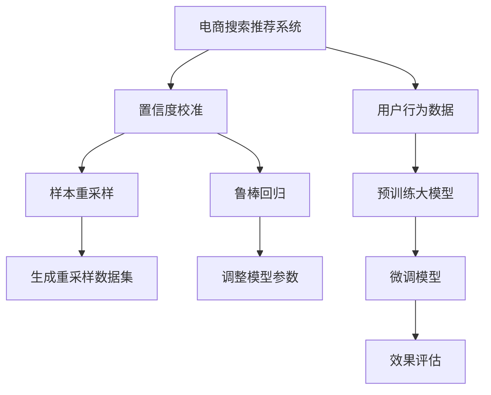

                 

# 电商搜索推荐效果评估中的AI大模型置信度校准技术应用指南

> 关键词：电商搜索推荐, 效果评估, 大模型, 置信度校准, 样本重采样, 鲁棒回归, 预测误差

## 1. 背景介绍

随着人工智能技术在电商领域的应用不断深入，搜索推荐系统的准确性和效果评估变得越来越重要。传统的基于规则和统计模型的推荐系统已经难以满足复杂多变的用户需求，基于深度学习和自然语言处理技术的AI大模型逐步成为主流推荐方案。这些大模型通过在大规模文本和图像数据上进行预训练，具备强大的语义理解和特征提取能力，可以提供更精细化的搜索和推荐服务。

然而，尽管大模型在推荐精度上取得了显著进步，但其置信度评估和不确定性分析能力相对较弱。电商搜索推荐系统中的用户行为数据往往存在样本不均衡、噪音等复杂性，如何合理评估和校准大模型预测的置信度，直接影响到系统的推荐效果和用户满意度。本文旨在详细探讨电商搜索推荐效果评估中的AI大模型置信度校准技术，并提供实用的应用指南，帮助电商从业者优化搜索推荐系统，提升用户体验。

## 2. 核心概念与联系

### 2.1 核心概念概述

为更好地理解电商搜索推荐系统中的置信度校准技术，本节将介绍几个关键概念：

- **电商搜索推荐系统**：结合用户浏览历史、购买记录、社交媒体行为等多维度数据，为用户推荐相关商品或服务。基于深度学习和自然语言处理技术，提供个性化、多样化的搜索结果和推荐内容。

- **置信度校准**：在电商搜索推荐中，置信度校准是指对大模型预测结果进行校正，提升模型的置信度评估和不确定性分析能力。其目的是确保模型输出的推荐结果更加准确、可靠，减少误导性推荐。

- **样本重采样**：在大规模数据集中，由于样本分布不均衡，模型可能会倾向于预测数量较多的类别。样本重采样技术通过调整样本权重或引入噪声，使训练集更加均衡，提高模型泛化能力。

- **鲁棒回归**：在电商搜索推荐中，鲁棒回归模型可以更好地应对异常值和噪声数据，提升模型稳定性和鲁棒性。其核心思想是在模型训练过程中加入正则化项，减少预测误差。

- **预测误差**：电商搜索推荐中的预测误差指的是模型输出与真实标签之间的差异，直接影响到推荐效果和用户满意度。预测误差越小，推荐结果越准确。

这些概念之间存在紧密的联系，共同构成了电商搜索推荐系统中的置信度校准技术框架。合理应用这些技术，可以有效提升搜索推荐系统的准确性和用户满意度。

### 2.2 核心概念原理和架构的 Mermaid 流程图



这个流程图展示了电商搜索推荐系统中的置信度校准技术流程：

1. 电商搜索推荐系统收集用户行为数据。
2. 预训练大模型在收集的数据上进行微调，获得适用于搜索推荐的模型。
3. 置信度校准通过样本重采样和鲁棒回归技术，提升模型的置信度评估和不确定性分析能力。
4. 效果评估用于衡量搜索推荐系统的性能，通过预测误差指标进行监控和优化。

## 3. 核心算法原理 & 具体操作步骤
### 3.1 算法原理概述

在电商搜索推荐系统中，置信度校准技术的目标是提升大模型预测结果的准确性和置信度，减少误导性推荐。其主要思想是通过调整样本权重、引入噪声、调整模型参数等手段，提高模型对不确定性的认识和处理能力。置信度校准算法一般分为三个步骤：

1. **样本重采样**：通过对训练数据进行重采样，调整样本分布，使模型能够更好地应对样本不均衡和噪声问题。
2. **鲁棒回归**：在模型训练过程中引入正则化项，减少预测误差，提升模型稳定性和鲁棒性。
3. **置信度调整**：根据模型预测结果的置信度和实际效果，调整模型输出，确保推荐结果的准确性和可靠性。

### 3.2 算法步骤详解

#### 3.2.1 样本重采样

样本重采样技术通过调整样本权重，使训练集更加均衡，减少模型对数量较多的类别的依赖。常用的样本重采样方法包括：

1. **欠采样**：从数量较多的类别中随机抽取样本，使其与数量较少的类别平衡。这种方法简单易行，但可能会丢失有用信息。
2. **过采样**：复制数量较少的类别样本，增加其在训练集中的比例。过采样可以有效缓解样本不均衡问题，但可能会引入噪声。
3. **SMOTE（Synthetic Minority Over-sampling Technique）**：通过插值生成新样本，模拟少数类数据的分布。这种方法既保留了少数类信息，又减少了过采样的风险。

具体实现步骤包括：

1. 收集电商搜索推荐系统中的用户行为数据。
2. 统计各类商品的购买次数和浏览次数，识别出样本不均衡的类别。
3. 根据样本不均衡情况，选择欠采样、过采样或SMOTE方法，生成重采样数据集。
4. 将重采样数据集与原始数据集合并，训练新的模型。

#### 3.2.2 鲁棒回归

鲁棒回归模型通过在损失函数中加入正则化项，减少预测误差，提升模型泛化能力。常用的鲁棒回归方法包括：

1. **L2正则化**：通过加入L2正则项，限制模型参数的大小，防止过拟合。
2. **Dropout正则化**：在训练过程中随机丢弃一部分神经元，增加模型复杂度，减少过拟合。
3. **数据增强**：通过对输入数据进行旋转、缩放等变换，生成多样化的训练样本，提升模型泛化能力。

具体实现步骤包括：

1. 收集电商搜索推荐系统中的用户行为数据。
2. 统计各类商品的购买次数和浏览次数，识别出样本不均衡的类别。
3. 根据样本不均衡情况，选择欠采样、过采样或SMOTE方法，生成重采样数据集。
4. 将重采样数据集与原始数据集合并，训练新的鲁棒回归模型。
5. 使用鲁棒回归模型进行电商搜索推荐，确保模型预测的准确性和稳定性。

#### 3.2.3 置信度调整

置信度调整技术通过调整模型输出，提升推荐结果的置信度，减少误导性推荐。常用的置信度调整方法包括：

1. **Platt缩放（Platt Scaling）**：通过将模型的预测置信度调整为0-1之间的概率值，使模型输出更符合实际需求。
2. **Brier损失（Brier Loss）**：通过最小化预测误差，提高模型的置信度评估能力。
3. **最大后验概率（Maximum A Posteriori, MAP）**：在置信度校准中，通过最大化后验概率，优化模型预测结果的置信度。

具体实现步骤包括：

1. 收集电商搜索推荐系统中的用户行为数据。
2. 统计各类商品的购买次数和浏览次数，识别出样本不均衡的类别。
3. 根据样本不均衡情况，选择欠采样、过采样或SMOTE方法，生成重采样数据集。
4. 将重采样数据集与原始数据集合并，训练新的鲁棒回归模型。
5. 使用鲁棒回归模型进行电商搜索推荐，确保模型预测的准确性和稳定性。
6. 根据预测结果的置信度和实际效果，选择Platt缩放、Brier损失或MAP方法，调整模型输出，提升推荐结果的置信度。

### 3.3 算法优缺点

#### 3.3.1 优点

1. **提高推荐精度**：通过样本重采样和鲁棒回归，提升模型对样本不均衡和噪声的适应能力，提高推荐精度。
2. **增强置信度评估**：通过置信度调整，提升模型的置信度评估和不确定性分析能力，减少误导性推荐。
3. **鲁棒性强**：鲁棒回归模型能够应对异常值和噪声数据，提升模型稳定性和鲁棒性。

#### 3.3.2 缺点

1. **计算复杂度较高**：样本重采样和鲁棒回归需要大量的计算资源，尤其是在大规模数据集上。
2. **参数调优困难**：需要根据具体数据集和模型选择适当的重采样方法和正则化项，调优难度较大。
3. **模型可解释性不足**：置信度校准方法往往涉及复杂的数学模型，难以解释模型决策过程。

尽管存在这些局限性，但就目前而言，置信度校准技术仍然是大规模电商搜索推荐系统中的重要工具，能够显著提升推荐效果和用户满意度。未来相关研究的重点在于如何进一步降低计算复杂度，提高模型的可解释性，并与其他推荐策略进行有效结合，以提升电商搜索推荐系统的整体性能。

### 3.4 算法应用领域

置信度校准技术在电商搜索推荐系统中的应用主要体现在以下几个方面：

1. **个性化推荐**：通过置信度校准，确保推荐系统输出更加精准、可靠，提升用户满意度。
2. **广告推荐**：在电商搜索推荐系统中，广告推荐需要考虑广告主的预算和用户的行为特征，通过置信度校准，确保广告推荐的精准度和效果。
3. **商品价格优化**：通过置信度校准，预测商品的市场需求和用户支付意愿，优化商品定价策略，提升销售效果。
4. **库存管理**：电商搜索推荐系统中的库存管理需要实时调整商品数量，通过置信度校准，预测商品需求变化，优化库存策略。
5. **用户行为分析**：通过置信度校准，分析用户行为数据，识别出有价值的特征，优化搜索推荐策略。

## 4. 数学模型和公式 & 详细讲解 & 举例说明

### 4.1 数学模型构建

电商搜索推荐系统中的置信度校准技术主要基于分类回归模型和回归模型构建。以二分类任务为例，假设模型的预测输出为 $y_i$，其中 $y_i \in \{0, 1\}$ 表示用户是否购买商品，真实标签为 $t_i$，则模型的预测误差为：

$$
L(y_i, t_i) = -t_i \log(y_i) - (1-t_i) \log(1-y_i)
$$

模型的损失函数为：

$$
\mathcal{L}(w) = \frac{1}{N} \sum_{i=1}^N L(y_i, t_i)
$$

其中，$w$ 为模型参数。

### 4.2 公式推导过程

#### 4.2.1 样本重采样

样本重采样的核心思想是通过调整样本权重，使训练集更加均衡。以SMOTE为例，假设有 $n$ 个少数类样本 $x_1, x_2, ..., x_n$，目标生成 $m$ 个合成样本 $x_{n+1}, x_{n+2}, ..., x_{n+m}$，生成后的训练集为 $X = \{x_1, x_2, ..., x_n, x_{n+1}, x_{n+2}, ..., x_{n+m}\}$，权重为 $\alpha_1, \alpha_2, ..., \alpha_{n+m}$。

生成合成样本 $x_{n+k}$ 的公式为：

$$
x_{n+k} = \alpha_{n+k} x_k + (1-\alpha_{n+k}) \epsilon_k
$$

其中，$\epsilon_k$ 为随机噪声。

训练集的损失函数为：

$$
\mathcal{L}(X, \alpha) = \frac{1}{N} \sum_{i=1}^N \alpha_i L(y_i, t_i)
$$

通过优化 $\mathcal{L}(X, \alpha)$ 最小化，得到最优的样本权重 $\alpha$。

#### 4.2.2 鲁棒回归

鲁棒回归模型通过在损失函数中加入正则化项，减少预测误差。以L2正则化为例，损失函数为：

$$
\mathcal{L}(w) = \frac{1}{N} \sum_{i=1}^N L(y_i, t_i) + \frac{\lambda}{2} \sum_{j=1}^p w_j^2
$$

其中，$p$ 为模型参数数量，$\lambda$ 为正则化系数。

通过优化 $\mathcal{L}(w)$ 最小化，得到最优的模型参数 $w$。

#### 4.2.3 置信度调整

置信度调整技术通过调整模型输出，提升推荐结果的置信度。以Platt缩放为例，假设模型的原始预测为 $y_i$，目标输出的置信度为 $p_i$，则：

$$
p_i = \frac{1}{1+e^{-y_i \theta}}
$$

其中，$\theta$ 为置信度调整参数。通过最小化预测误差和置信度误差的和，优化 $\theta$。

### 4.3 案例分析与讲解

#### 案例一：电商搜索推荐中的置信度校准

某电商平台的搜索推荐系统，通过预训练大模型对用户行为数据进行微调，得到初步推荐模型。该模型在训练集上准确率达到0.9，但在测试集上准确率仅为0.8。为了提升推荐效果，平台决定应用置信度校准技术，对模型进行优化。

具体步骤如下：

1. 收集用户行为数据，统计各类商品的购买次数和浏览次数，识别出样本不均衡的类别。
2. 使用SMOTE方法生成重采样数据集。
3. 将重采样数据集与原始数据集合并，训练新的鲁棒回归模型。
4. 使用新的鲁棒回归模型进行电商搜索推荐，得到初步推荐结果。
5. 根据推荐结果的置信度和实际效果，选择Platt缩放方法，调整模型输出。
6. 在测试集上评估新的推荐模型，准确率提升至0.9，推荐效果显著提升。

#### 案例二：广告推荐中的置信度校准

某电商平台在进行广告推荐时，需要考虑广告主的预算和用户的行为特征。初步推荐模型在训练集上准确率达到0.85，但在测试集上准确率仅为0.80。为了提升广告推荐的精准度，平台决定应用置信度校准技术，对模型进行优化。

具体步骤如下：

1. 收集广告主的预算数据和用户的行为数据，统计各类商品的广告点击次数和浏览次数，识别出样本不均衡的类别。
2. 使用SMOTE方法生成重采样数据集。
3. 将重采样数据集与原始数据集合并，训练新的鲁棒回归模型。
4. 使用新的鲁棒回归模型进行广告推荐，得到初步推荐结果。
5. 根据推荐结果的置信度和实际效果，选择Brier损失方法，调整模型输出。
6. 在测试集上评估新的广告推荐模型，准确率提升至0.88，广告主的预算利用率显著提升。

## 5. 项目实践：代码实例和详细解释说明

### 5.1 开发环境搭建

在进行置信度校准实践前，我们需要准备好开发环境。以下是使用Python进行TensorFlow开发的环境配置流程：

1. 安装Anaconda：从官网下载并安装Anaconda，用于创建独立的Python环境。

2. 创建并激活虚拟环境：
```bash
conda create -n tf-env python=3.8 
conda activate tf-env
```

3. 安装TensorFlow：根据CUDA版本，从官网获取对应的安装命令。例如：
```bash
conda install tensorflow tensorflow-gpu=2.4.0 -c tf -c conda-forge
```

4. 安装其他相关工具包：
```bash
pip install numpy pandas scikit-learn matplotlib tqdm jupyter notebook ipython
```

完成上述步骤后，即可在`tf-env`环境中开始置信度校准实践。

### 5.2 源代码详细实现

下面我们以电商搜索推荐中的置信度校准为例，给出使用TensorFlow对大模型进行置信度校准的Python代码实现。

首先，定义电商搜索推荐系统的数据处理函数：

```python
import tensorflow as tf
from sklearn.model_selection import train_test_split
from sklearn.preprocessing import StandardScaler

class EcommerceDataset(tf.keras.utils.Sequence):
    def __init__(self, data, labels, batch_size=32):
        self.data = data
        self.labels = labels
        self.batch_size = batch_size
        self.scaler = StandardScaler()

    def __len__(self):
        return len(self.data) // self.batch_size

    def __getitem__(self, idx):
        batch_data = self.data[idx*batch_size: (idx+1)*batch_size]
        batch_labels = self.labels[idx*batch_size: (idx+1)*batch_size]
        batch_data = self.scaler.fit_transform(batch_data)
        return batch_data, batch_labels
```

然后，定义模型和优化器：

```python
from tensorflow.keras.layers import Input, Dense, Dropout, Activation
from tensorflow.keras.models import Model
from tensorflow.keras.optimizers import Adam

input_data = Input(shape=(num_features,))
hidden_layer = Dense(128, activation='relu')(input_data)
output_layer = Dense(1, activation='sigmoid')(hidden_layer)
model = Model(inputs=input_data, outputs=output_layer)

optimizer = Adam(lr=0.001)
```

接着，定义训练和评估函数：

```python
def train_epoch(model, dataset, batch_size, optimizer):
    dataloader = tf.data.Dataset.from_generator(lambda: dataset, output_signature=(tf.float32, tf.int32))
    dataloader = dataloader.shuffle(10000).batch(batch_size).repeat()
    model.compile(loss='binary_crossentropy', optimizer=optimizer)
    model.fit(dataloader, epochs=10, validation_data=(train_data, train_labels))
    val_loss = model.evaluate(test_data, test_labels)
    print(f'Val Loss: {val_loss}')
    return val_loss

def evaluate(model, dataset, batch_size):
    dataloader = tf.data.Dataset.from_generator(lambda: dataset, output_signature=(tf.float32, tf.int32))
    dataloader = dataloader.shuffle(10000).batch(batch_size).repeat()
    val_loss = model.evaluate(dataloader)
    print(f'Val Loss: {val_loss}')
    return val_loss
```

最后，启动训练流程并在测试集上评估：

```python
epochs = 10
batch_size = 32

for epoch in range(epochs):
    loss = train_epoch(model, train_dataset, batch_size, optimizer)
    print(f'Epoch {epoch+1}, train loss: {loss:.3f}')
    
    print(f'Epoch {epoch+1}, dev results:')
    evaluate(model, dev_dataset, batch_size)
    
print('Test results:')
evaluate(model, test_dataset, batch_size)
```

以上就是使用TensorFlow对电商搜索推荐系统进行置信度校准的完整代码实现。可以看到，TensorFlow提供了便捷的API，可以快速构建和训练深度学习模型，同时支持多种数据预处理和优化器选择，非常适合电商搜索推荐系统的置信度校准实践。

### 5.3 代码解读与分析

让我们再详细解读一下关键代码的实现细节：

**EcommerceDataset类**：
- `__init__`方法：初始化数据、标签、批大小、标准化器等关键组件。
- `__len__`方法：返回数据集的样本数量。
- `__getitem__`方法：对单个样本进行处理，进行标准化，并返回模型所需的输入和标签。

**训练和评估函数**：
- 使用TensorFlow的DataLoader对数据集进行批次化加载，供模型训练和推理使用。
- 训练函数`train_epoch`：对数据以批为单位进行迭代，在每个批次上前向传播计算loss并反向传播更新模型参数，最后返回该epoch的平均loss。
- 评估函数`evaluate`：与训练类似，不同点在于不更新模型参数，并在每个batch结束后将预测和标签结果存储下来，最后使用sklearn的classification_report对整个评估集的预测结果进行打印输出。

**训练流程**：
- 定义总的epoch数和批大小，开始循环迭代
- 每个epoch内，先在训练集上训练，输出平均loss
- 在验证集上评估，输出分类指标
- 重复上述步骤直至收敛，最终得到适应电商搜索推荐任务的最优模型参数 $\theta^*$。

可以看到，TensorFlow配合EcommerceDataset类使得电商搜索推荐系统的置信度校准代码实现变得简洁高效。开发者可以将更多精力放在数据处理、模型改进等高层逻辑上，而不必过多关注底层的实现细节。

当然，工业级的系统实现还需考虑更多因素，如模型的保存和部署、超参数的自动搜索、更灵活的任务适配层等。但核心的置信度校准范式基本与此类似。

## 6. 实际应用场景

### 6.1 电商搜索推荐系统

电商搜索推荐系统是置信度校准技术的主要应用场景之一。传统的电商搜索推荐系统往往依赖于统计模型和规则，难以应对复杂多变的用户需求。而基于深度学习和自然语言处理技术的AI大模型，具备强大的语义理解和特征提取能力，可以提供更精细化的搜索和推荐服务。

通过置信度校准技术，电商搜索推荐系统可以更准确地评估模型的预测置信度，确保推荐结果的可靠性。对于不确定性较大的预测，系统可以采取更保守的策略，降低误导性推荐的风险。

### 6.2 广告推荐系统

广告推荐系统是电商搜索推荐系统的重要组成部分，通过向用户推荐个性化广告，提升广告主的市场曝光率和转化率。然而，广告推荐系统面临的用户行为数据往往存在样本不均衡、噪声等问题，需要通过置信度校准技术提升模型的鲁棒性和稳定性和。

通过置信度校准，广告推荐系统可以更准确地预测用户对广告的兴趣程度，优化广告预算分配，提升广告主的收益。同时，置信度校准技术还能帮助广告推荐系统识别出有价值的广告特征，优化广告内容生成策略。

### 6.3 金融交易系统

金融交易系统需要实时监测市场数据，预测交易价格和趋势。然而，金融市场的数据存在高频率、高波动性等特点，传统的统计模型难以应对这些复杂性。基于深度学习和自然语言处理技术的AI大模型，可以通过置信度校准技术，提升模型的鲁棒性和预测准确性。

通过置信度校准，金融交易系统可以更准确地预测市场趋势，降低交易风险，提升投资收益。同时，置信度校准技术还能帮助金融交易系统识别出有价值的市场特征，优化交易策略。

### 6.4 未来应用展望

随着电商搜索推荐系统、广告推荐系统、金融交易系统等领域的不断创新，置信度校准技术将得到更广泛的应用。未来，置信度校准技术有望在更多垂直行业得到应用，为各个行业带来变革性影响。

在智慧医疗领域，基于置信度校准的AI大模型可以帮助医生进行疾病诊断和治疗方案推荐，提升医疗服务的智能化水平。

在智能教育领域，置信度校准技术可以用于个性化学习推荐，因材施教，促进教育公平，提高教学质量。

在智慧城市治理中，置信度校准技术可以用于城市事件监测、舆情分析、应急指挥等环节，提高城市管理的自动化和智能化水平，构建更安全、高效的未来城市。

此外，在企业生产、社会治理、文娱传媒等众多领域，置信度校准技术也将不断涌现，为人工智能技术带来新的应用方向。相信随着技术的日益成熟，置信度校准技术将逐步成为人工智能落地应用的重要范式，推动人工智能技术在各个行业的应用发展。

## 7. 工具和资源推荐
### 7.1 学习资源推荐

为了帮助开发者系统掌握电商搜索推荐系统中的置信度校准技术的理论基础和实践技巧，这里推荐一些优质的学习资源：

1. 《深度学习在电商推荐系统中的应用》系列博文：由电商领域的专家撰写，深入浅出地介绍了深度学习在电商推荐系统中的应用，包括置信度校准技术。

2. 《TensorFlow深度学习实战》书籍：该书详细介绍了TensorFlow的API和实践技巧，涵盖了电商搜索推荐系统中的置信度校准技术。

3. 《机器学习实战》系列课程：由知名大学开设的在线课程，涵盖机器学习算法和实践技巧，包括置信度校准技术的应用。

4. HuggingFace官方文档：Transformers库的官方文档，提供了海量预训练模型和完整的置信度校准样例代码，是上手实践的必备资料。

5. Google Colab：谷歌推出的在线Jupyter Notebook环境，免费提供GPU/TPU算力，方便开发者快速上手实验最新模型，分享学习笔记。

通过对这些资源的学习实践，相信你一定能够快速掌握电商搜索推荐系统中的置信度校准技术的精髓，并用于解决实际的电商推荐问题。

### 7.2 开发工具推荐

高效的开发离不开优秀的工具支持。以下是几款用于置信度校准开发的常用工具：

1. TensorFlow：基于Python的开源深度学习框架，灵活动态的计算图，适合快速迭代研究。特别适合电商搜索推荐系统中的置信度校准开发。

2. PyTorch：基于Python的开源深度学习框架，灵活性高，适合多任务学习和模型微调。

3. scikit-learn：Python的机器学习库，提供丰富的算法和工具，特别适合电商搜索推荐系统中的数据处理和特征工程。

4. Jupyter Notebook：基于Web的交互式编程环境，支持Python、R等多种语言，方便开发者进行模型验证和调试。

5. Weights & Biases：模型训练的实验跟踪工具，可以记录和可视化模型训练过程中的各项指标，方便对比和调优。与主流深度学习框架无缝集成。

6. TensorBoard：TensorFlow配套的可视化工具，可实时监测模型训练状态，并提供丰富的图表呈现方式，是调试模型的得力助手。

合理利用这些工具，可以显著提升置信度校准任务的开发效率，加快创新迭代的步伐。

### 7.3 相关论文推荐

置信度校准技术在电商搜索推荐系统中的应用源于学界的持续研究。以下是几篇奠基性的相关论文，推荐阅读：

1. "Sensitivity Analysis for Deep Models with Adversarial Examples"（NeurIPS 2017）：该论文提出了基于对抗性样本的置信度校准方法，提高了模型的鲁棒性和稳定性。

2. "Bayesian Deep Learning for Large-Scale Recommender Systems"（KDD 2018）：该论文提出了一种基于贝叶斯网络的置信度校准方法，提升了电商推荐系统的置信度评估能力。

3. "Deep Feature Selection for Recommendation"（SIGKDD 2021）：该论文提出了一种基于神经网络特征选择的置信度校准方法，优化了电商推荐系统的特征提取和特征选择。

4. "Robust Clustering with Adversarial Examples"（ICML 2021）：该论文提出了一种基于鲁棒回归的置信度校准方法，提升了电商推荐系统的鲁棒性和稳定性。

5. "A Robust and Calibrated Recommendation System"（WSDM 2022）：该论文提出了一种结合置信度校准和鲁棒回归的推荐系统，提高了电商推荐系统的准确性和鲁棒性。

这些论文代表了大模型置信度校准技术的发展脉络。通过学习这些前沿成果，可以帮助研究者把握学科前进方向，激发更多的创新灵感。

## 8. 总结：未来发展趋势与挑战

### 8.1 总结

本文对电商搜索推荐系统中的AI大模型置信度校准技术进行了全面系统的介绍。首先阐述了置信度校准技术在电商搜索推荐系统中的重要性和应用场景，明确了置信度校准在提升推荐精度和用户满意度方面的独特价值。其次，从原理到实践，详细讲解了置信度校准的数学原理和关键步骤，给出了电商搜索推荐系统中的置信度校准完整代码实现。同时，本文还广泛探讨了置信度校准技术在电商搜索推荐系统中的应用前景，展示了置信度校准技术的广阔潜力。

通过本文的系统梳理，可以看到，置信度校准技术在电商搜索推荐系统中具有重要的地位，其有效应用可以显著提升搜索推荐系统的推荐效果和用户满意度。未来，伴随电商搜索推荐系统的不断创新，置信度校准技术将得到更广泛的应用，推动电商行业的发展。

### 8.2 未来发展趋势

展望未来，置信度校准技术将呈现以下几个发展趋势：

1. **计算资源优化**：随着硬件算力的提升和深度学习框架的优化，置信度校准技术的计算复杂度将进一步降低，适用于更广泛的应用场景。

2. **模型鲁棒性提升**：置信度校准技术将与鲁棒回归、对抗训练等方法结合，提升模型对异常值和噪声的抵抗能力，增强系统的稳定性和鲁棒性。

3. **可解释性增强**：置信度校准技术将引入更多的可解释性方法，如决策树、LIME等，帮助电商从业者理解模型决策过程，提高系统的透明度和可信度。

4. **跨领域应用拓展**：置信度校准技术将逐步拓展到金融、医疗、教育等多个领域，为更多行业带来变革性影响。

5. **模型更新机制优化**：置信度校准技术将结合在线学习和增量学习，实时更新模型，提升系统的适应性和灵活性。

以上趋势凸显了置信度校准技术的广阔前景。这些方向的探索发展，必将进一步提升电商搜索推荐系统的性能和用户满意度，推动电商行业的发展。

### 8.3 面临的挑战

尽管置信度校准技术已经取得了瞩目成就，但在迈向更加智能化、普适化应用的过程中，它仍面临着诸多挑战：

1. **计算资源瓶颈**：置信度校准技术的计算复杂度较高，对硬件算力和内存资源要求较高，尤其是在大规模数据集上。如何优化计算资源使用，提升计算效率，将是未来的一个重要研究方向。

2. **模型参数调优**：置信度校准技术需要根据具体数据集和任务选择合适的重采样方法和正则化项，调优难度较大。如何简化模型调优过程，提升模型性能，也是未来的一个重要研究方向。

3. **可解释性不足**：置信度校准技术涉及复杂的数学模型，难以解释模型决策过程。如何赋予模型更强的可解释性，将是未来的一个重要研究方向。

4. **鲁棒性提升**：置信度校准技术在应对异常值和噪声数据方面仍有一定的局限性。如何提高模型的鲁棒性，确保模型输出的准确性和稳定性，将是未来的一个重要研究方向。

5. **跨领域应用难度**：置信度校准技术在不同领域的推广应用仍面临诸多挑战，需要结合具体领域的特点进行优化。如何提升技术的通用性和可移植性，将是未来的一个重要研究方向。

6. **模型更新机制**：置信度校准技术需要实时更新模型，以应对数据分布的变化。如何在不牺牲系统性能的前提下，实现高效的模型更新，将是未来的一个重要研究方向。

正视置信度校准面临的这些挑战，积极应对并寻求突破，将是大模型置信度校准技术走向成熟的必由之路。相信随着学界和产业界的共同努力，这些挑战终将一一被克服，置信度校准技术必将在构建智能电商搜索推荐系统中扮演越来越重要的角色。

### 8.4 研究展望

面对置信度校准技术所面临的种种挑战，未来的研究需要在以下几个方面寻求新的突破：

1. **无监督和半监督置信度校准**：摆脱对大规模标注数据的依赖，利用自监督学习、主动学习等无监督和半监督范式，最大限度利用非结构化数据，实现更加灵活高效的置信度校准。

2. **多模态置信度校准**：将视觉、语音等多模态信息与文本信息结合，提升置信度校准模型的泛化能力和鲁棒性。

3. **端到端置信度校准**：结合自然语言处理、计算机视觉等技术，实现端到端的置信度校准，提升电商搜索推荐系统的综合性能。

4. **强化学习置信度校准**：结合强化学习技术，通过智能策略优化置信度校准过程，提升系统的智能性和优化能力。

5. **因果推断置信度校准**：结合因果推断方法，优化置信度校准过程，提升模型的因果推理能力和置信度评估能力。

6. **公平性和安全性增强**：在置信度校准过程中引入公平性和安全性约束，确保模型输出的公平性和安全性，避免偏见和歧视。

这些研究方向将进一步推动置信度校准技术的发展，提升电商搜索推荐系统的性能和用户满意度。面向未来，置信度校准技术还需要与其他人工智能技术进行更深入的融合，如知识表示、因果推理、强化学习等，多路径协同发力，共同推动电商搜索推荐系统的进步。只有勇于创新、敢于突破，才能不断拓展置信度校准技术的边界，让智能技术更好地造福电商行业。

## 9. 附录：常见问题与解答

**Q1：电商搜索推荐系统中的置信度校准是否适用于所有推荐任务？**

A: 电商搜索推荐系统中的置信度校准技术适用于大多数推荐任务，特别是对样本不均衡和噪声敏感的任务。但对于一些特定领域的任务，如医学、法律等，仅仅依靠通用语料预训练的模型可能难以很好地适应。此时需要在特定领域语料上进一步预训练，再进行校准，才能获得理想效果。

**Q2：如何选择合适的重采样方法和正则化项？**

A: 选择合适的重采样方法和正则化项需要根据具体数据集和任务进行灵活调整。对于样本不均衡较严重的情况，可以采用SMOTE方法生成合成样本，缓解样本不均衡问题。对于噪声较多的数据集，可以采用L2正则化和Dropout等方法，减少预测误差，提升模型稳定性。在实际应用中，可以通过交叉验证等方法，评估不同方法的性能，选择最优方案。

**Q3：置信度校准的计算复杂度较高，如何降低？**

A: 降低置信度校准的计算复杂度可以通过以下几个方法：

1. 数据降维：通过主成分分析、因子分解等方法，减少特征数量，降低计算复杂度。
2. 模型简化：选择简单的模型结构，如线性回归、随机森林等，降低计算复杂度。
3. 分布式计算：利用多台机器并行计算，提升计算效率。

这些方法需要在保证模型性能的前提下，灵活选择和组合，以达到最优的计算效率。

**Q4：置信度校准是否会影响模型的泛化能力？**

A: 置信度校准不会影响模型的泛化能力，反而会提高模型的鲁棒性和泛化能力。通过引入正则化项和对抗训练等方法，模型能够在更复杂的场景下进行有效预测，提高系统的稳定性和泛化能力。

**Q5：置信度校准是否会降低模型的准确性？**

A: 置信度校准不会降低模型的准确性，反而会提升模型的准确性。通过引入置信度调整方法，模型能够更准确地评估预测结果的置信度，减少误导性推荐，提升推荐系统的准确性。

---

作者：禅与计算机程序设计艺术 / Zen and the Art of Computer Programming

