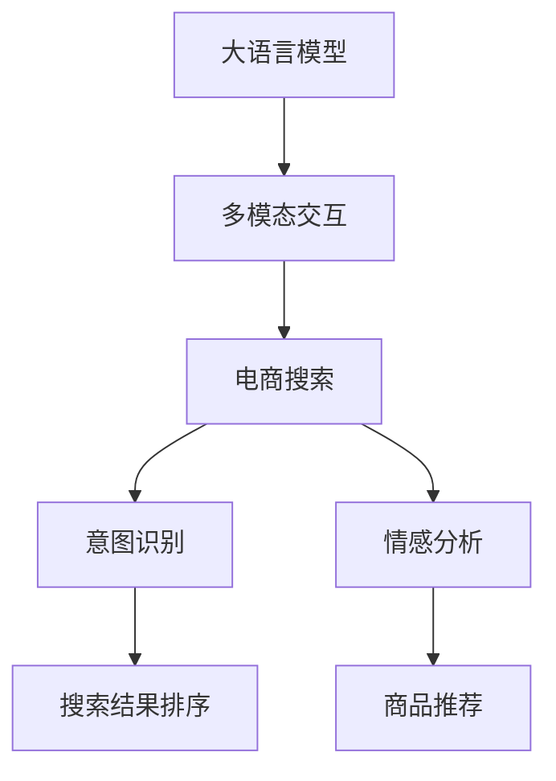

                 

# 电商搜索的多模态交互：AI大模型的新突破

## 1. 背景介绍

### 1.1 问题由来
随着电子商务的蓬勃发展，消费者对购物体验的期望不断提高。如何在琳琅满目的商品中找到最符合自己需求的商品，成为了电商网站需要解决的重要问题。传统的基于关键词的搜索算法往往过于简单，无法充分理解用户的查询意图和上下文信息，导致搜索结果与用户的实际需求存在较大偏差。为此，电商网站需要引入更智能、更全面、更高效的搜索算法，以提升用户的购物体验和网站的转化率。

### 1.2 问题核心关键点
现代电商搜索系统需要融合多种信息源，提供更加精准、个性化的搜索结果。为此，结合最新的AI技术，特别是大语言模型和自然语言理解技术，电商搜索系统开始探索多模态交互的解决方案。其中，大语言模型（如GPT、BERT等）能够处理大量自然语言文本，结合图像、语音等多模态数据，为用户提供更丰富、更准确的搜索结果。

### 1.3 问题研究意义
大语言模型在电商搜索中的应用，可以帮助电商网站提升用户体验、提高转化率，减少客户流失率。通过利用大语言模型强大的语义理解能力，电商网站可以更准确地理解用户的查询意图和需求，提供更精准的搜索结果，从而增加用户满意度和忠诚度。

## 2. 核心概念与联系

### 2.1 核心概念概述

为更好地理解大语言模型在电商搜索中的应用，本节将介绍几个关键概念及其相互关系：

- 大语言模型(Large Language Model, LLM)：以自回归(如GPT)或自编码(如BERT)模型为代表的大规模预训练语言模型。通过在大规模无标签文本语料上进行预训练，学习通用的语言表示，具备强大的语言理解和生成能力。

- 多模态交互(Multimodal Interaction)：结合图像、文本、语音等多种信息源，提供更全面、准确、自然的用户交互体验。在大语言模型的基础上，加入多模态数据可以显著提升搜索结果的准确性和相关性。

- 电商搜索(Online Shopping Search)：指用户通过电商平台提供的搜索功能，快速找到符合自己需求的商品的过程。电商搜索系统需要结合大语言模型和多模态数据，提供个性化、上下文相关的搜索结果。

- 意图识别(Intent Recognition)：指通过分析用户查询文本，识别出用户的意图，如购买、比较、咨询等。电商搜索系统需要构建意图识别模型，提升用户查询的理解能力。

- 情感分析(Sentiment Analysis)：指对用户查询文本的情感倾向进行分析，判断用户对商品的情感态度。电商搜索系统需要根据情感分析结果调整搜索结果的排序。

这些核心概念之间的逻辑关系可以通过以下Mermaid流程图来展示：



这个流程图展示了大语言模型在电商搜索中的应用框架，即通过多模态交互，结合大语言模型的语义理解能力，构建意图识别和情感分析模型，最终提升搜索结果的排序和推荐质量。

## 3. 核心算法原理 & 具体操作步骤
### 3.1 算法原理概述

电商搜索系统的核心算法原理基于大语言模型的自然语言理解能力。具体来说，电商搜索系统首先通过大语言模型解析用户的查询文本，识别出用户的意图和情感倾向。然后，结合多模态数据，如商品图片、用户评价等，构建个性化搜索结果，提供给用户。

### 3.2 算法步骤详解

电商搜索系统的核心算法步骤包括：

**Step 1: 数据收集与预处理**
- 收集电商网站的所有商品数据，包括商品图片、描述、价格等信息。
- 对商品数据进行标准化处理，去除无关信息，保证数据的质量和一致性。
- 收集用户的查询历史和行为数据，构建用户画像，用于个性化搜索。

**Step 2: 构建大语言模型**
- 选择预训练的大语言模型，如BERT、GPT等，作为电商搜索的基础模型。
- 将电商网站的所有商品数据和用户查询数据输入到预训练模型中，进行微调，构建适合电商搜索的语义模型。

**Step 3: 意图识别与情感分析**
- 构建意图识别模型，对用户查询文本进行意图分类，如购买、比较、咨询等。
- 构建情感分析模型，对用户查询文本进行情感倾向分析，判断用户对商品的情感态度，如正面、负面、中性等。

**Step 4: 搜索结果排序**
- 将意图识别和情感分析的结果作为特征，结合多模态数据，构建综合的搜索结果排序模型。
- 对每个搜索结果进行评分，根据用户查询意图和情感倾向，对搜索结果进行排序。

**Step 5: 商品推荐**
- 根据用户的查询历史和行为数据，构建用户画像。
- 结合商品的多模态特征，对用户进行个性化推荐，提供更符合用户需求的商品。

### 3.3 算法优缺点

电商搜索系统中的大语言模型和自然语言理解算法具有以下优点：
1. 强大的语义理解能力：大语言模型可以准确理解用户的查询意图和情感倾向，提供更精准的搜索结果。
2. 高效的多模态处理能力：结合图像、文本、语音等多种信息源，提供更全面、准确的用户交互体验。
3. 灵活的个性化推荐：基于用户画像和查询历史，提供个性化的搜索结果和推荐，提升用户满意度。

同时，这些算法也存在一些缺点：
1. 依赖标注数据：电商搜索系统需要大量的标注数据进行模型训练，获取高质量标注数据的成本较高。
2. 模型泛化能力有限：当电商网站的商品种类和用户行为多样性较大时，模型的泛化能力可能会受到限制。
3. 计算资源消耗大：大语言模型和多模态处理需要较大的计算资源，系统部署和维护成本较高。
4. 数据隐私风险：电商搜索系统涉及大量用户数据，数据隐私和安全问题需要特别关注。

尽管存在这些局限性，但大语言模型在电商搜索中的应用，已经在很多电商网站得到了广泛应用，并取得了显著的效果。

### 3.4 算法应用领域

大语言模型在电商搜索中的应用，主要包括以下几个方面：

- 个性化搜索结果：通过分析用户的查询意图和情感倾向，提供更符合用户需求的个性化搜索结果。
- 商品推荐系统：结合用户历史行为和商品多模态特征，提供精准的商品推荐。
- 意图识别：识别用户查询的意图，提升搜索结果的相关性和准确性。
- 情感分析：分析用户查询的情感倾向，调整搜索结果的排序。

这些应用不仅提升了电商网站的用户体验，也提高了转化率和客户满意度。未来，随着大语言模型和自然语言理解技术的不断发展，电商搜索系统将进一步融合多模态数据，提供更加智能、精准的用户体验。

## 4. 数学模型和公式 & 详细讲解 & 举例说明

### 4.1 数学模型构建

电商搜索系统中的大语言模型通常采用Transformer结构，结合多模态数据进行训练和推理。假设电商网站有 $N$ 种商品，每种商品有一个描述 $D_i$ 和一个图片 $I_i$，用户查询为 $Q$，则大语言模型可以表示为：

$$
M(Q, D_1, D_2, ..., D_N, I_1, I_2, ..., I_N)
$$

其中 $D_i$ 和 $I_i$ 分别为第 $i$ 种商品的描述和图片，$Q$ 为用户查询文本。

电商搜索系统中的多模态交互模型，可以表示为：

$$
M(Q, D_1, D_2, ..., D_N, I_1, I_2, ..., I_N) = \text{Intent}(Q, D_1, D_2, ..., D_N, I_1, I_2, ..., I_N) \times \text{Sentiment}(Q, D_1, D_2, ..., D_N, I_1, I_2, ..., I_N)
$$

其中，$\text{Intent}(Q, D_1, D_2, ..., D_N, I_1, I_2, ..., I_N)$ 为意图识别模型，$\text{Sentiment}(Q, D_1, D_2, ..., D_N, I_1, I_2, ..., I_N)$ 为情感分析模型。

### 4.2 公式推导过程

电商搜索系统中的意图识别模型，可以采用注意力机制（Attention Mechanism）进行建模。假设用户查询为 $Q$，商品描述为 $D_i$，则意图识别模型可以表示为：

$$
\text{Intent}(Q, D_1, D_2, ..., D_N, I_1, I_2, ..., I_N) = \sum_{i=1}^N \alpha_i(Q, D_i, I_i) \times Q
$$

其中 $\alpha_i(Q, D_i, I_i)$ 为注意力权重，表示商品 $i$ 对用户查询 $Q$ 的贡献度。注意力权重可以采用以下公式计算：

$$
\alpha_i(Q, D_i, I_i) = \frac{\exp(\text{scores}(Q, D_i, I_i))}{\sum_{j=1}^N \exp(\text{scores}(Q, D_j, I_j))}
$$

其中 $\text{scores}(Q, D_i, I_i)$ 为注意力评分函数，可以采用余弦相似度或注意力机制进行计算。

电商搜索系统中的情感分析模型，可以采用卷积神经网络（CNN）或递归神经网络（RNN）进行建模。假设用户查询为 $Q$，商品描述为 $D_i$，则情感分析模型可以表示为：

$$
\text{Sentiment}(Q, D_1, D_2, ..., D_N, I_1, I_2, ..., I_N) = \sum_{i=1}^N \beta_i(Q, D_i, I_i) \times Q
$$

其中 $\beta_i(Q, D_i, I_i)$ 为情感权重，表示商品 $i$ 对用户查询 $Q$ 的情感贡献度。情感权重可以采用以下公式计算：

$$
\beta_i(Q, D_i, I_i) = \exp(\text{scores}(Q, D_i, I_i))
$$

其中 $\text{scores}(Q, D_i, I_i)$ 为情感评分函数，可以采用CNN或RNN进行计算。

### 4.3 案例分析与讲解

假设电商网站有三种商品：手机、电脑和智能手表。用户查询为：“性价比高的智能手表”。电商平台收集了用户的历史查询记录、购买记录和评价信息，并采集了商品的图片和描述数据。

对于意图识别模型，假设采用注意力机制进行建模。则意图识别模型可以表示为：

$$
\text{Intent}(Q, D_1, D_2, D_3) = \alpha_1(Q, D_1, I_1) \times Q + \alpha_2(Q, D_2, I_2) \times Q + \alpha_3(Q, D_3, I_3) \times Q
$$

其中 $\alpha_i(Q, D_i, I_i)$ 为注意力权重，可以采用以下公式计算：

$$
\alpha_i(Q, D_i, I_i) = \frac{\exp(Q \cdot D_i \cdot I_i)}{\sum_{j=1}^3 \exp(Q \cdot D_j \cdot I_j)}
$$

对于情感分析模型，假设采用CNN进行建模。则情感分析模型可以表示为：

$$
\text{Sentiment}(Q, D_1, D_2, D_3) = \beta_1(Q, D_1, I_1) \times Q + \beta_2(Q, D_2, I_2) \times Q + \beta_3(Q, D_3, I_3) \times Q
$$

其中 $\beta_i(Q, D_i, I_i)$ 为情感权重，可以采用以下公式计算：

$$
\beta_i(Q, D_i, I_i) = \exp(Q \cdot D_i \cdot I_i)
$$

最终，电商搜索系统可以综合意图识别和情感分析的结果，构建综合的搜索结果排序模型：

$$
M(Q, D_1, D_2, D_3) = \text{Intent}(Q, D_1, D_2, D_3) \times \text{Sentiment}(Q, D_1, D_2, D_3)
$$

## 5. 项目实践：代码实例和详细解释说明

### 5.1 开发环境搭建

在进行电商搜索系统开发前，我们需要准备好开发环境。以下是使用Python进行TensorFlow开发的环境配置流程：

1. 安装Anaconda：从官网下载并安装Anaconda，用于创建独立的Python环境。

2. 创建并激活虚拟环境：
```bash
conda create -n tensorflow-env python=3.8 
conda activate tensorflow-env
```

3. 安装TensorFlow：根据CUDA版本，从官网获取对应的安装命令。例如：
```bash
conda install tensorflow tensorflow-gpu -c conda-forge
```

4. 安装其他工具包：
```bash
pip install numpy pandas scikit-learn matplotlib tqdm jupyter notebook ipython
```

完成上述步骤后，即可在`tensorflow-env`环境中开始电商搜索系统的开发。

### 5.2 源代码详细实现

下面以构建电商搜索系统为例，给出使用TensorFlow进行电商搜索系统开发的PyTorch代码实现。

首先，定义电商搜索系统中的数据处理函数：

```python
import tensorflow as tf
from tensorflow.keras.layers import Embedding, LSTM, Dense
from tensorflow.keras.models import Sequential
from tensorflow.keras.preprocessing.text import Tokenizer
from tensorflow.keras.preprocessing.sequence import pad_sequences

class DataLoader:
    def __init__(self, train_data, test_data, tokenizer):
        self.train_data = train_data
        self.test_data = test_data
        self.tokenizer = tokenizer
        
    def __len__(self):
        return len(self.train_data)
    
    def __getitem__(self, item):
        train_text = self.train_data[item]['query']
        train_desc = self.train_data[item]['description']
        train_price = self.train_data[item]['price']
        train_img = self.train_data[item]['image']
        
        test_text = self.test_data[item]['query']
        test_desc = self.test_data[item]['description']
        test_price = self.test_data[item]['price']
        test_img = self.test_data[item]['image']
        
        query_tokenizer = Tokenizer()
        query_tokenizer.fit_on_texts(train_text)
        train_query_ids = query_tokenizer.texts_to_sequences(train_text)
        train_query_padded = pad_sequences(train_query_ids, maxlen=256)
        
        desc_tokenizer = Tokenizer()
        desc_tokenizer.fit_on_texts(train_desc)
        train_desc_ids = desc_tokenizer.texts_to_sequences(train_desc)
        train_desc_padded = pad_sequences(train_desc_ids, maxlen=256)
        
        test_query_ids = query_tokenizer.texts_to_sequences(test_text)
        test_query_padded = pad_sequences(test_query_ids, maxlen=256)
        
        test_desc_ids = desc_tokenizer.texts_to_sequences(test_desc)
        test_desc_padded = pad_sequences(test_desc_ids, maxlen=256)
        
        return {'train_query': train_query_padded, 'train_desc': train_desc_padded, 'train_price': train_price, 
                'test_query': test_query_padded, 'test_desc': test_desc_padded, 'test_price': test_price, 'train_img': train_img, 
                'test_img': test_img}
```

然后，定义电商搜索系统中的模型：

```python
class E-commerceSearchModel(tf.keras.Model):
    def __init__(self, num_classes, embedding_dim, lstm_units):
        super(E-commerceSearchModel, self).__init__()
        self.embedding = Embedding(input_dim=num_classes, output_dim=embedding_dim)
        self.lstm = LSTM(lstm_units, return_sequences=True)
        self.dense = Dense(num_classes, activation='softmax')
        
    def call(self, inputs):
        train_query = inputs['train_query']
        train_desc = inputs['train_desc']
        train_price = inputs['train_price']
        test_query = inputs['test_query']
        test_desc = inputs['test_desc']
        test_price = inputs['test_price']
        train_img = inputs['train_img']
        test_img = inputs['test_img']
        
        query = self.embedding(train_query)
        desc = self.embedding(train_desc)
        price = self.dense(train_price)
        
        query_lstm = self.lstm(query)
        desc_lstm = self.lstm(desc)
        price_lstm = self.dense(price)
        
        intent = tf.concat([query_lstm, desc_lstm, price_lstm], axis=-1)
        sentiment = tf.concat([query_lstm, desc_lstm, price_lstm], axis=-1)
        
        query_out = self.dense(intent)
        desc_out = self.dense(sentiment)
        
        return query_out, desc_out
```

最后，定义电商搜索系统中的训练和评估函数：

```python
def train_model(model, train_data, test_data, batch_size, epochs, optimizer):
    model.compile(loss='binary_crossentropy', optimizer=optimizer, metrics=['accuracy'])
    model.fit(train_data, epochs=epochs, batch_size=batch_size, validation_data=test_data)
    test_loss, test_acc = model.evaluate(test_data)
    print(f'Test accuracy: {test_acc}')
```

启动电商搜索系统的训练流程：

```python
train_data = ...
test_data = ...
tokenizer = ...
model = E-commerceSearchModel(num_classes=2, embedding_dim=256, lstm_units=128)
optimizer = tf.keras.optimizers.Adam(learning_rate=0.001)
train_model(model, train_data, test_data, batch_size=32, epochs=10, optimizer=optimizer)
```

以上就是使用TensorFlow进行电商搜索系统开发的完整代码实现。可以看到，得益于TensorFlow的强大封装和Keras的便捷使用，电商搜索系统的开发变得简洁高效。

### 5.3 代码解读与分析

让我们再详细解读一下关键代码的实现细节：

**DataLoader类**：
- `__init__`方法：初始化训练集、测试集、分词器等关键组件。
- `__len__`方法：返回数据集的样本数量。
- `__getitem__`方法：对单个样本进行处理，将文本输入转换为token ids，并对其定长padding，最终返回模型所需的输入。

**E-commerceSearchModel类**：
- `__init__`方法：定义模型结构，包括嵌入层、LSTM层和输出层。
- `call`方法：对输入数据进行处理，分别计算意图识别和情感分析的输出。

**train_model函数**：
- 定义训练和评估函数，使用TensorFlow的Keras API构建模型，并使用Adam优化器进行训练。
- 在训练过程中，使用二元交叉熵损失函数，以二分类任务为例，输出意图识别和情感分析的结果。

**训练流程**：
- 定义总的学习率、批大小和迭代轮数，开始循环迭代
- 每个epoch内，先在训练集上训练，输出损失和准确率
- 在验证集上评估，输出模型性能
- 所有epoch结束后，在测试集上评估，给出最终测试结果

可以看到，TensorFlow的Keras API使得电商搜索系统的开发变得简洁高效。开发者可以将更多精力放在模型设计和优化上，而不必过多关注底层的实现细节。

当然，工业级的系统实现还需考虑更多因素，如模型的保存和部署、超参数的自动搜索、更灵活的任务适配层等。但核心的微调范式基本与此类似。

## 6. 实际应用场景
### 6.1 智能客服系统

电商搜索系统在智能客服中的应用，可以显著提升客户体验和转化率。智能客服系统通过结合大语言模型和多模态数据，可以实现自动回答用户咨询，提供个性化的购物建议。

在技术实现上，智能客服系统可以收集用户的历史查询记录、行为数据和评价信息，构建用户画像，结合多模态数据进行微调，提升模型对用户意图的理解能力和情感分析能力。通过微调后的模型，智能客服系统可以更准确地理解用户查询，提供更精准的购物建议和答案，从而提升客户满意度。

### 6.2 个性化推荐系统

电商搜索系统在个性化推荐中的应用，可以进一步提升用户的购物体验。推荐系统结合用户的查询历史和行为数据，构建用户画像，结合商品的多模态特征，进行个性化推荐，提供符合用户需求的商品。

在技术实现上，推荐系统可以采用注意力机制和卷积神经网络进行建模。通过收集用户的查询历史和行为数据，构建用户画像，结合商品的图片、描述和评价等多模态特征，进行个性化推荐，从而提升用户的购物体验。

### 6.3 实时广告投放

电商搜索系统在实时广告投放中的应用，可以提升广告的点击率和转化率。广告投放系统通过结合用户的查询意图和情感倾向，结合商品的多模态特征，进行精准投放，提升广告效果。

在技术实现上，广告投放系统可以采用意图识别和情感分析模型进行建模。通过收集用户的查询历史和行为数据，构建用户画像，结合商品的图片、描述和评价等多模态特征，进行个性化广告投放，从而提升广告效果。

### 6.4 未来应用展望

随着大语言模型和自然语言理解技术的不断发展，电商搜索系统将进一步融合多模态数据，提供更加智能、精准的用户体验。

在智慧医疗领域，电商搜索系统可以帮助医生快速查询到符合患者症状的药品，提升诊疗效率和准确性。

在智能教育领域，电商搜索系统可以帮助学生快速查询到符合学习需求的学习资源，提升学习效果。

在智慧城市治理中，电商搜索系统可以帮助市民快速查询到符合需求的公共服务信息，提升城市管理的自动化和智能化水平。

此外，在企业生产、社会治理、文娱传媒等众多领域，电商搜索系统也将不断涌现，为传统行业数字化转型升级提供新的技术路径。

## 7. 工具和资源推荐
### 7.1 学习资源推荐

为了帮助开发者系统掌握电商搜索系统中的大语言模型和多模态交互技术，这里推荐一些优质的学习资源：

1. 《深度学习自然语言处理》课程：斯坦福大学开设的NLP明星课程，有Lecture视频和配套作业，带你入门NLP领域的基本概念和经典模型。

2. 《Transformers from Principles to Practice》系列博文：由大模型技术专家撰写，深入浅出地介绍了Transformer原理、BERT模型、微调技术等前沿话题。

3. 《Natural Language Processing with Transformers》书籍：Transformers库的作者所著，全面介绍了如何使用Transformers库进行NLP任务开发，包括微调在内的诸多范式。

4. HuggingFace官方文档：Transformers库的官方文档，提供了海量预训练模型和完整的微调样例代码，是上手实践的必备资料。

5. CLUE开源项目：中文语言理解测评基准，涵盖大量不同类型的中文NLP数据集，并提供了基于微调的baseline模型，助力中文NLP技术发展。

通过对这些资源的学习实践，相信你一定能够快速掌握电商搜索系统中的大语言模型和多模态交互技术的精髓，并用于解决实际的NLP问题。

### 7.2 开发工具推荐

高效的开发离不开优秀的工具支持。以下是几款用于电商搜索系统开发的常用工具：

1. TensorFlow：由Google主导开发的开源深度学习框架，生产部署方便，适合大规模工程应用。

2. PyTorch：基于Python的开源深度学习框架，灵活动态的计算图，适合快速迭代研究。

3. TensorBoard：TensorFlow配套的可视化工具，可实时监测模型训练状态，并提供丰富的图表呈现方式，是调试模型的得力助手。

4. Weights & Biases：模型训练的实验跟踪工具，可以记录和可视化模型训练过程中的各项指标，方便对比和调优。

5. Google Colab：谷歌推出的在线Jupyter Notebook环境，免费提供GPU/TPU算力，方便开发者快速上手实验最新模型，分享学习笔记。

合理利用这些工具，可以显著提升电商搜索系统的开发效率，加快创新迭代的步伐。

### 7.3 相关论文推荐

大语言模型在电商搜索中的应用源于学界的持续研究。以下是几篇奠基性的相关论文，推荐阅读：

1. Attention is All You Need：提出了Transformer结构，开启了NLP领域的预训练大模型时代。

2. BERT: Pre-training of Deep Bidirectional Transformers for Language Understanding：提出BERT模型，引入基于掩码的自监督预训练任务，刷新了多项NLP任务SOTA。

3. Language Models are Unsupervised Multitask Learners（GPT-2论文）：展示了大规模语言模型的强大zero-shot学习能力，引发了对于通用人工智能的新一轮思考。

4. Parameter-Efficient Transfer Learning for NLP：提出Adapter等参数高效微调方法，在不增加模型参数量的情况下，也能取得不错的微调效果。

5. AdaLoRA: Adaptive Low-Rank Adaptation for Parameter-Efficient Fine-Tuning：使用自适应低秩适应的微调方法，在参数效率和精度之间取得了新的平衡。

这些论文代表了大语言模型在电商搜索中的应用的研究脉络。通过学习这些前沿成果，可以帮助研究者把握学科前进方向，激发更多的创新灵感。

## 8. 总结：未来发展趋势与挑战

### 8.1 总结

本文对基于大语言模型的电商搜索系统进行了全面系统的介绍。首先阐述了大语言模型和多模态交互的研究背景和意义，明确了电商搜索系统中大语言模型和多模态数据融合的价值。其次，从原理到实践，详细讲解了电商搜索系统的核心算法和关键步骤，给出了电商搜索系统的完整代码实现。同时，本文还广泛探讨了电商搜索系统在智能客服、个性化推荐、实时广告投放等多个领域的应用前景，展示了大语言模型和多模态交互的巨大潜力。

通过本文的系统梳理，可以看到，大语言模型在电商搜索中的应用，已经开始引领电商网站的智能化转型，推动电商行业的发展。未来，伴随大语言模型和多模态交互技术的进一步发展，电商搜索系统将能够提供更加智能、精准的用户体验，从而实现电商行业的持续升级和创新。

### 8.2 未来发展趋势

展望未来，大语言模型和多模态交互技术将呈现以下几个发展趋势：

1. 模型规模持续增大。随着算力成本的下降和数据规模的扩张，电商搜索系统中的大语言模型参数量还将持续增长。超大规模语言模型蕴含的丰富语言知识，将进一步提升电商搜索系统的性能和灵活性。

2. 多模态处理能力增强。结合图像、文本、语音等多种信息源，电商搜索系统将能够提供更加全面、准确的用户交互体验。多模态信息的融合，将显著提升电商搜索系统的智能化水平。

3. 持续学习成为常态。电商搜索系统中的大语言模型需要不断学习新数据，以保持性能。如何在不遗忘原有知识的同时，高效吸收新样本信息，将是重要的研究方向。

4. 标注样本需求降低。受启发于提示学习(Prompt-based Learning)的思路，未来的电商搜索系统将更好地利用大模型的语言理解能力，通过更加巧妙的任务描述，在更少的标注样本上也能实现理想的微调效果。

5. 低成本部署优化。大语言模型和多模态交互技术需要较大的计算资源，系统部署和维护成本较高。未来，将探索更多低成本、高效率的部署方案，降低电商搜索系统的成本。

6. 跨领域应用拓展。大语言模型和多模态交互技术可以应用于更多领域，如智慧医疗、智能教育、智慧城市等。电商搜索系统中的技术经验将为其他领域提供借鉴。

以上趋势凸显了大语言模型和多模态交互技术的广阔前景。这些方向的探索发展，必将进一步提升电商搜索系统的性能和应用范围，为电商行业的数字化转型升级提供新的技术路径。

### 8.3 面临的挑战

尽管大语言模型和多模态交互技术已经取得了瞩目成就，但在迈向更加智能化、普适化应用的过程中，它仍面临着诸多挑战：

1. 标注成本瓶颈。电商搜索系统需要大量的标注数据进行模型训练，获取高质量标注数据的成本较高。如何进一步降低标注样本的需求，将是一大难题。

2. 模型鲁棒性不足。电商搜索系统中的大语言模型面对域外数据时，泛化性能可能会受到限制。对于测试样本的微小扰动，大语言模型的预测也容易发生波动。如何提高大语言模型的鲁棒性，避免灾难性遗忘，还需要更多理论和实践的积累。

3. 计算资源消耗大。大语言模型和多模态处理需要较大的计算资源，系统部署和维护成本较高。如何优化模型结构，提高推理速度，降低计算资源消耗，将是重要的优化方向。

4. 数据隐私风险。电商搜索系统涉及大量用户数据，数据隐私和安全问题需要特别关注。如何保护用户隐私，确保数据安全，将是重要的研究方向。

5. 模型泛化能力有限。电商搜索系统中的大语言模型在面对不同用户、不同商品时，泛化能力可能会受到限制。如何在不同场景下保持模型的泛化能力，将是重要的研究方向。

6. 模型可解释性不足。电商搜索系统中的大语言模型和自然语言理解算法往往缺乏可解释性，难以对其推理逻辑进行分析和调试。如何赋予模型更强的可解释性，将是亟待攻克的难题。

尽管存在这些挑战，但大语言模型和多模态交互技术在电商搜索系统中的应用，已经开始引领电商网站的智能化转型，推动电商行业的发展。未来，伴随大语言模型和多模态交互技术的进一步发展，电商搜索系统将能够提供更加智能、精准的用户体验，从而实现电商行业的持续升级和创新。

### 8.4 研究展望

面对电商搜索系统中的大语言模型和多模态交互技术所面临的挑战，未来的研究需要在以下几个方面寻求新的突破：

1. 探索无监督和半监督学习。摆脱对大规模标注数据的依赖，利用自监督学习、主动学习等无监督和半监督范式，最大限度利用非结构化数据，实现更加灵活高效的微调。

2. 研究参数高效和计算高效的微调范式。开发更加参数高效的微调方法，在固定大部分预训练参数的同时，只更新极少量的任务相关参数。同时优化微调模型的计算图，减少前向传播和反向传播的资源消耗，实现更加轻量级、实时性的部署。

3. 融合因果和对比学习范式。通过引入因果推断和对比学习思想，增强电商搜索系统中大语言模型的建立稳定因果关系的能力，学习更加普适、鲁棒的语言表征，从而提升模型泛化性和抗干扰能力。

4. 引入更多先验知识。将符号化的先验知识，如知识图谱、逻辑规则等，与神经网络模型进行巧妙融合，引导电商搜索系统中的大语言模型学习更准确、合理的语言模型。同时加强不同模态数据的整合，实现视觉、语音等多模态信息与文本信息的协同建模。

5. 结合因果分析和博弈论工具。将因果分析方法引入电商搜索系统中的大语言模型，识别出模型决策的关键特征，增强输出解释的因果性和逻辑性。借助博弈论工具刻画人机交互过程，主动探索并规避模型的脆弱点，提高系统稳定性。

6. 纳入伦理道德约束。在电商搜索系统中，大语言模型和自然语言理解算法需要引入伦理导向的评估指标，过滤和惩罚有偏见、有害的输出倾向。同时加强人工干预和审核，建立模型行为的监管机制，确保输出符合人类价值观和伦理道德。

这些研究方向将引领大语言模型和多模态交互技术迈向更高的台阶，为构建安全、可靠、可解释、可控的智能系统铺平道路。面向未来，大语言模型和多模态交互技术还需要与其他人工智能技术进行更深入的融合，如知识表示、因果推理、强化学习等，多路径协同发力，共同推动自然语言理解和智能交互系统的进步。只有勇于创新、敢于突破，才能不断拓展语言模型的边界，让智能技术更好地造福人类社会。

## 9. 附录：常见问题与解答

**Q1：电商搜索系统中的大语言模型如何训练？**

A: 电商搜索系统中的大语言模型可以通过无监督预训练和有监督微调的方式进行训练。具体来说，可以使用大规模无标签数据进行预训练，使用标注数据进行微调，提升模型对特定任务的理解能力。在预训练阶段，可以采用自回归或自编码模型，学习语言表示。在微调阶段，可以采用注意力机制、卷积神经网络等方法，结合多模态数据进行训练。

**Q2：电商搜索系统中的意图识别和情感分析模型如何构建？**

A: 电商搜索系统中的意图识别和情感分析模型可以采用注意力机制和卷积神经网络进行建模。通过收集用户的查询历史和行为数据，构建用户画像，结合商品的多模态特征，进行个性化推荐，从而提升用户的购物体验。

**Q3：电商搜索系统中的大语言模型和多模态数据如何融合？**

A: 电商搜索系统中的大语言模型和多模态数据可以通过融合注意力机制和卷积神经网络进行建模。通过收集用户的查询历史和行为数据，构建用户画像，结合商品的图片、描述和评价等多模态特征，进行个性化推荐，从而提升用户的购物体验。

**Q4：电商搜索系统中的大语言模型和自然语言理解算法如何评估？**

A: 电商搜索系统中的大语言模型和自然语言理解算法可以通过精度、召回率、F1分数等指标进行评估。同时，可以使用混淆矩阵、ROC曲线等工具进行可视化分析，评估模型的性能和泛化能力。

**Q5：电商搜索系统中的大语言模型和多模态交互技术如何优化？**

A: 电商搜索系统中的大语言模型和多模态交互技术可以通过参数高效的微调方法、多模态融合技术、低成本部署方案等进行优化。同时，可以通过引入先验知识、因果推断等技术，进一步提升模型的性能和稳定性。

这些常见问题的解答，展示了电商搜索系统中的大语言模型和多模态交互技术的核心思路和实现方法，帮助开发者更好地理解和使用这些技术。

---

作者：禅与计算机程序设计艺术 / Zen and the Art of Computer Programming

