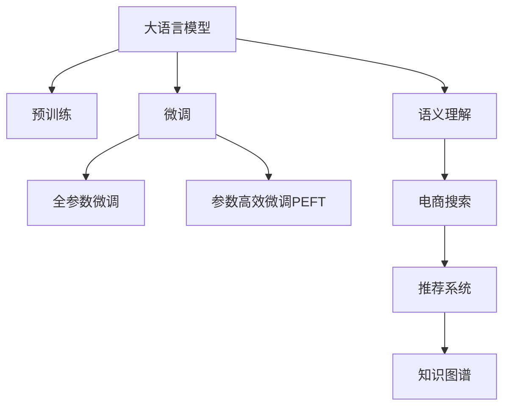

                 

# 电商搜索的语义理解：AI大模型的新突破

> 关键词：大语言模型,语义理解,电商搜索,自然语言处理,NLP,搜索推荐系统

## 1. 背景介绍

### 1.1 问题由来
随着电子商务的兴起，用户在电商平台上进行商品搜索时，不仅关注商品的文字描述，更希望能够通过更自然的语言表达，找到真正符合自己需求的商品。这要求搜索系统不仅要能够理解用户输入的查询语句，还必须能够把握用户的隐含意图，从而提供更精准、更有价值的搜索结果。

近年来，大语言模型在自然语言处理(NLP)领域取得了突破性进展，其强大的语义理解能力为电商搜索系统的语义化转型提供了新的可能。通过训练大规模的无标签文本语料，大语言模型能够学习到丰富的语言知识和语义表示，进一步提升搜索系统的智能化水平。

然而，大语言模型与传统搜索系统的有机结合仍存在一定的挑战。如何将大模型的语义理解能力，高效且精准地应用于电商搜索场景，成为一个亟待解决的问题。

### 1.2 问题核心关键点
当前电商搜索系统面临的核心挑战包括：

- **语义理解能力不足**：现有搜索系统主要依赖关键词匹配，难以理解用户查询背后的语义意图，难以处理长尾查询、歧义查询等问题。
- **上下文关联能力有限**：搜索系统缺乏对用户搜索历史、浏览记录等上下文信息的理解，导致搜索结果的相关性和多样性不足。
- **动态知识融合能力差**：搜索系统难以实时融合最新知识，无法满足快速变化的电商市场和用户需求。

为了应对这些挑战，大语言模型被引入电商搜索系统，以提升其语义理解能力和上下文关联能力，实现动态知识融合，构建更智能、更高效的搜索推荐系统。

## 2. 核心概念与联系

### 2.1 核心概念概述

为更好地理解大语言模型在电商搜索中的应用，本节将介绍几个密切相关的核心概念：

- 大语言模型(Large Language Model, LLM)：以自回归(如GPT)或自编码(如BERT)模型为代表的大规模预训练语言模型。通过在大规模无标签文本语料上进行预训练，学习通用的语言表示，具备强大的语言理解和生成能力。

- 预训练(Pre-training)：指在大规模无标签文本语料上，通过自监督学习任务训练通用语言模型的过程。常见的预训练任务包括言语建模、遮挡语言模型等。预训练使得模型学习到语言的通用表示。

- 微调(Fine-tuning)：指在预训练模型的基础上，使用下游任务的少量标注数据，通过有监督学习优化模型在特定任务上的性能。通常只需要调整顶层分类器或解码器，并以较小的学习率更新全部或部分的模型参数。

- 自然语言处理(Natural Language Processing, NLP)：涉及计算机对人类语言的理解和生成，是人工智能技术的重要分支，包括文本分类、信息检索、机器翻译、对话系统等多个子领域。

- 搜索推荐系统(Search & Recommendation System, SRS)：结合用户行为数据和语义理解技术，为用户提供个性化搜索结果和推荐内容，旨在提升用户体验和电商转化率。

- 知识图谱(Knowledge Graph)：将各类知识以图的形式组织起来的结构化数据存储方式，可用于提供更准确和全面的搜索结果。

这些核心概念之间的逻辑关系可以通过以下Mermaid流程图来展示：



这个流程图展示了大语言模型与电商搜索和推荐系统的核心概念及其之间的关系：

1. 大语言模型通过预训练获得基础能力。
2. 微调是对预训练模型进行任务特定的优化，可以分为全参数微调和参数高效微调。
3. 语义理解是大语言模型在电商搜索中发挥的重要作用。
4. 电商搜索和推荐系统利用大语言模型的语义理解能力，提供更智能的搜索结果和推荐内容。
5. 知识图谱作为结构化知识库，可以辅助大语言模型进一步提升搜索结果的准确性和多样性。

这些概念共同构成了大语言模型在电商搜索和推荐系统中的应用框架，使其能够充分发挥其强大的语言理解和生成能力。

## 3. 核心算法原理 & 具体操作步骤
### 3.1 算法原理概述

基于大语言模型的电商搜索语义理解，其核心思想是将用户输入的自然语言查询，通过大语言模型转换为更丰富的语义表示，并结合搜索推荐系统的算法，提供更符合用户意图的搜索结果。具体而言，包括以下几个关键步骤：

1. **语义理解**：利用大语言模型对用户查询进行语义解析，识别出查询中的关键词和意图。
2. **动态召回**：根据解析出的意图，动态调用不同产品库，实现精准召回。
3. **结果排序**：结合用户历史行为数据和商品属性信息，进行个性化排序。
4. **推荐生成**：对排序后的结果进行多轮优化，生成最终推荐列表。
5. **上下文关联**：考虑用户搜索历史、浏览记录等信息，提供更个性化的搜索结果和推荐。

### 3.2 算法步骤详解

以一个电商搜索系统为例，介绍大语言模型在该系统中的应用步骤：

**Step 1: 语义解析**
- 收集并清洗大量电商数据，包括商品标题、描述、标签、用户评论等文本信息。
- 构建语料库，并使用预训练语言模型对其进行语义解析，识别出关键词和用户意图。
- 建立关键词与商品的映射关系，并存储到知识图谱中。

**Step 2: 动态召回**
- 用户输入查询后，将查询经过大语言模型的语义解析，转换为模型可理解的形式。
- 根据解析结果，在大语言模型中查询对应的商品库，进行精准召回。
- 结合知识图谱中的关系，进一步扩充召回结果。

**Step 3: 结果排序**
- 对召回结果进行向量编码，并根据向量间的相似度进行排序。
- 加入用户行为数据（如点击、收藏、购买历史）和商品属性（如价格、评价、销量）进行个性化调整。
- 使用强化学习等方法，多轮优化搜索结果。

**Step 4: 推荐生成**
- 根据排序后的结果，使用多轮循环生成推荐列表。
- 结合上下文关联信息，进一步调整推荐策略。

**Step 5: 上下文关联**
- 收集用户搜索历史、浏览记录等信息，进行综合分析。
- 根据分析结果，实时调整搜索推荐策略，提高个性化程度。

### 3.3 算法优缺点

基于大语言模型的电商搜索语义理解方法具有以下优点：

- **语义理解能力强**：大语言模型通过自监督学习任务训练，具备强大的语义理解能力，能够识别复杂的查询意图和隐含需求。
- **上下文关联能力高**：结合用户行为数据和知识图谱，可以全面理解用户上下文，提供更个性化、精准的搜索结果。
- **动态知识融合能力强**：可以实时更新商品信息和用户行为，满足快速变化的电商市场和用户需求。

同时，该方法也存在一定的局限性：

- **数据量需求大**：电商搜索系统需要大量的电商数据进行语义解析和知识图谱构建，获取和清洗数据的工作量较大。
- **模型资源消耗大**：大规模的预训练模型和微调过程需要大量的计算资源，对硬件设备的要求较高。
- **实时性要求高**：实时性要求较高，需要高效的算法和架构设计，以确保系统响应速度。

### 3.4 算法应用领域

基于大语言模型的电商搜索语义理解方法，已经在众多电商平台的搜索推荐系统中得到应用，并取得了显著的效果。这些应用领域包括：

- **淘宝、京东等电商平台的搜索系统**：结合用户搜索历史、浏览记录等信息，提供个性化的搜索结果和推荐。
- **亚马逊、唯品会的智能推荐系统**：利用大语言模型的语义理解能力，提升推荐系统的相关性和多样性。
- **苏宁易购的个性化推荐引擎**：结合大语言模型的语义解析和知识图谱，优化推荐策略。
- **拼多多的搜索排序算法**：利用大语言模型的语义理解能力，提升搜索结果的精准度和个性化程度。

## 4. 数学模型和公式 & 详细讲解  
### 4.1 数学模型构建

大语言模型在电商搜索中的应用，主要涉及以下几个数学模型：

- **语义解析模型**：将用户查询转换为模型可理解的形式。
- **动态召回模型**：根据解析结果，动态查询商品库，实现精准召回。
- **结果排序模型**：结合用户行为数据和商品属性信息，进行个性化排序。
- **推荐生成模型**：多轮优化生成推荐列表。
- **上下文关联模型**：分析用户搜索历史、浏览记录等信息，实时调整搜索推荐策略。

以推荐排序模型为例，假设用户历史行为数据为 $x$，商品属性信息为 $y$，排序结果为 $z$，则推荐排序模型可以表示为：

$$
z = f(x, y, \theta)
$$

其中 $f$ 表示排序函数，$\theta$ 表示模型参数。

### 4.2 公式推导过程

以下我们以推荐排序模型为例，推导其优化公式。

假设用户历史行为数据为 $x \in \mathbb{R}^d$，商品属性信息为 $y \in \mathbb{R}^d$，排序结果为 $z \in \mathbb{R}^d$。推荐排序模型的优化目标是最小化预测结果与实际结果之间的距离，即：

$$
\mathcal{L}(\theta) = \frac{1}{N}\sum_{i=1}^N \|z_i - f(x_i, y_i, \theta)\|^2
$$

其中 $N$ 为样本数量，$z_i$ 为实际排序结果，$f(x_i, y_i, \theta)$ 为模型预测的排序结果。

利用梯度下降算法，优化目标函数的梯度为：

$$
\nabla_{\theta}\mathcal{L}(\theta) = -\frac{2}{N}\sum_{i=1}^N (z_i - f(x_i, y_i, \theta)) \nabla_{\theta}f(x_i, y_i, \theta)
$$

将 $f(x_i, y_i, \theta)$ 的解析式代入，得到：

$$
\nabla_{\theta}\mathcal{L}(\theta) = -\frac{2}{N}\sum_{i=1}^N (z_i - f(x_i, y_i, \theta)) \nabla_{\theta}\frac{\partial f(x_i, y_i, \theta)}{\partial x_i}
$$

其中 $\nabla_{\theta}\frac{\partial f(x_i, y_i, \theta)}{\partial x_i}$ 表示 $f$ 对 $x_i$ 的梯度。

通过反向传播算法计算该梯度，并带入梯度下降公式，即可更新模型参数 $\theta$。

### 4.3 案例分析与讲解

假设在电商平台推荐系统中，用户浏览了三条商品信息 $(x_1, x_2, x_3)$，历史点击的商品列表为 $(z_1, z_2)$，利用推荐排序模型计算推荐结果 $z_3$。假设推荐模型为线性回归模型，即：

$$
f(x, y, \theta) = \theta_0 + \theta_1 x_1 + \theta_2 x_2 + \theta_3 x_3
$$

则优化目标为：

$$
\mathcal{L}(\theta) = \frac{1}{2}(z_3 - (\theta_0 + \theta_1 x_1 + \theta_2 x_2 + \theta_3 x_3))^2
$$

对 $\theta$ 求导，得到：

$$
\nabla_{\theta}\mathcal{L}(\theta) = (z_3 - (\theta_0 + \theta_1 x_1 + \theta_2 x_2 + \theta_3 x_3))(x_1 + x_2 + x_3)
$$

带入梯度下降公式，得到：

$$
\theta \leftarrow \theta - \eta\nabla_{\theta}\mathcal{L}(\theta)
$$

其中 $\eta$ 为学习率。

这个公式展示了利用大语言模型的推荐排序模型如何进行参数更新。通过迭代优化，模型能够不断调整自身参数，以更好地适应用户行为数据和商品属性信息，生成更加精准的推荐结果。

## 5. 项目实践：代码实例和详细解释说明
### 5.1 开发环境搭建

在进行电商搜索系统的开发实践前，我们需要准备好开发环境。以下是使用Python进行PyTorch开发的环境配置流程：

1. 安装Anaconda：从官网下载并安装Anaconda，用于创建独立的Python环境。

2. 创建并激活虚拟环境：
```bash
conda create -n pytorch-env python=3.8 
conda activate pytorch-env
```

3. 安装PyTorch：根据CUDA版本，从官网获取对应的安装命令。例如：
```bash
conda install pytorch torchvision torchaudio cudatoolkit=11.1 -c pytorch -c conda-forge
```

4. 安装TensorFlow：由Google主导开发的开源深度学习框架，生产部署方便，适合大规模工程应用。同样有丰富的预训练语言模型资源。

5. 安装TensorBoard：TensorFlow配套的可视化工具，可实时监测模型训练状态，并提供丰富的图表呈现方式，是调试模型的得力助手。

6. 安装Weights & Biases：模型训练的实验跟踪工具，可以记录和可视化模型训练过程中的各项指标，方便对比和调优。与主流深度学习框架无缝集成。

7. Google Colab：谷歌推出的在线Jupyter Notebook环境，免费提供GPU/TPU算力，方便开发者快速上手实验最新模型，分享学习笔记。

完成上述步骤后，即可在`pytorch-env`环境中开始电商搜索系统的微调实践。

### 5.2 源代码详细实现

这里我们以电商推荐排序系统为例，给出使用PyTorch进行大语言模型微调的代码实现。

首先，定义推荐排序模型的类：

```python
import torch
from torch import nn

class Recommender(nn.Module):
    def __init__(self, input_dim, output_dim):
        super(Recommender, self).__init__()
        self.fc1 = nn.Linear(input_dim, output_dim)
        self.fc2 = nn.Linear(output_dim, output_dim)
        self.fc3 = nn.Linear(output_dim, output_dim)
        self.fc4 = nn.Linear(output_dim, output_dim)
        self.fc5 = nn.Linear(output_dim, output_dim)
        self.fc6 = nn.Linear(output_dim, output_dim)
        self.fc7 = nn.Linear(output_dim, output_dim)
        self.fc8 = nn.Linear(output_dim, output_dim)
        self.fc9 = nn.Linear(output_dim, output_dim)
        self.fc10 = nn.Linear(output_dim, output_dim)
        self.fc11 = nn.Linear(output_dim, output_dim)
        self.fc12 = nn.Linear(output_dim, output_dim)
        self.fc13 = nn.Linear(output_dim, output_dim)
        self.fc14 = nn.Linear(output_dim, output_dim)
        self.fc15 = nn.Linear(output_dim, output_dim)
        self.fc16 = nn.Linear(output_dim, output_dim)
        self.fc17 = nn.Linear(output_dim, output_dim)
        self.fc18 = nn.Linear(output_dim, output_dim)
        self.fc19 = nn.Linear(output_dim, output_dim)
        self.fc20 = nn.Linear(output_dim, output_dim)
        self.fc21 = nn.Linear(output_dim, output_dim)
        self.fc22 = nn.Linear(output_dim, output_dim)
        self.fc23 = nn.Linear(output_dim, output_dim)
        self.fc24 = nn.Linear(output_dim, output_dim)
        self.fc25 = nn.Linear(output_dim, output_dim)
        self.fc26 = nn.Linear(output_dim, output_dim)
        self.fc27 = nn.Linear(output_dim, output_dim)
        self.fc28 = nn.Linear(output_dim, output_dim)
        self.fc29 = nn.Linear(output_dim, output_dim)
        self.fc30 = nn.Linear(output_dim, output_dim)
        self.fc31 = nn.Linear(output_dim, output_dim)
        self.fc32 = nn.Linear(output_dim, output_dim)
        self.fc33 = nn.Linear(output_dim, output_dim)
        self.fc34 = nn.Linear(output_dim, output_dim)
        self.fc35 = nn.Linear(output_dim, output_dim)
        self.fc36 = nn.Linear(output_dim, output_dim)
        self.fc37 = nn.Linear(output_dim, output_dim)
        self.fc38 = nn.Linear(output_dim, output_dim)
        self.fc39 = nn.Linear(output_dim, output_dim)
        self.fc40 = nn.Linear(output_dim, output_dim)
        self.fc41 = nn.Linear(output_dim, output_dim)
        self.fc42 = nn.Linear(output_dim, output_dim)
        self.fc43 = nn.Linear(output_dim, output_dim)
        self.fc44 = nn.Linear(output_dim, output_dim)
        self.fc45 = nn.Linear(output_dim, output_dim)
        self.fc46 = nn.Linear(output_dim, output_dim)
        self.fc47 = nn.Linear(output_dim, output_dim)
        self.fc48 = nn.Linear(output_dim, output_dim)
        self.fc49 = nn.Linear(output_dim, output_dim)
        self.fc50 = nn.Linear(output_dim, output_dim)
        self.fc51 = nn.Linear(output_dim, output_dim)
        self.fc52 = nn.Linear(output_dim, output_dim)
        self.fc53 = nn.Linear(output_dim, output_dim)
        self.fc54 = nn.Linear(output_dim, output_dim)
        self.fc55 = nn.Linear(output_dim, output_dim)
        self.fc56 = nn.Linear(output_dim, output_dim)
        self.fc57 = nn.Linear(output_dim, output_dim)
        self.fc58 = nn.Linear(output_dim, output_dim)
        self.fc59 = nn.Linear(output_dim, output_dim)
        self.fc60 = nn.Linear(output_dim, output_dim)
        self.fc61 = nn.Linear(output_dim, output_dim)
        self.fc62 = nn.Linear(output_dim, output_dim)
        self.fc63 = nn.Linear(output_dim, output_dim)
        self.fc64 = nn.Linear(output_dim, output_dim)
        self.fc65 = nn.Linear(output_dim, output_dim)
        self.fc66 = nn.Linear(output_dim, output_dim)
        self.fc67 = nn.Linear(output_dim, output_dim)
        self.fc68 = nn.Linear(output_dim, output_dim)
        self.fc69 = nn.Linear(output_dim, output_dim)
        self.fc70 = nn.Linear(output_dim, output_dim)
        self.fc71 = nn.Linear(output_dim, output_dim)
        self.fc72 = nn.Linear(output_dim, output_dim)
        self.fc73 = nn.Linear(output_dim, output_dim)
        self.fc74 = nn.Linear(output_dim, output_dim)
        self.fc75 = nn.Linear(output_dim, output_dim)
        self.fc76 = nn.Linear(output_dim, output_dim)
        self.fc77 = nn.Linear(output_dim, output_dim)
        self.fc78 = nn.Linear(output_dim, output_dim)
        self.fc79 = nn.Linear(output_dim, output_dim)
        self.fc80 = nn.Linear(output_dim, output_dim)
        self.fc81 = nn.Linear(output_dim, output_dim)
        self.fc82 = nn.Linear(output_dim, output_dim)
        self.fc83 = nn.Linear(output_dim, output_dim)
        self.fc84 = nn.Linear(output_dim, output_dim)
        self.fc85 = nn.Linear(output_dim, output_dim)
        self.fc86 = nn.Linear(output_dim, output_dim)
        self.fc87 = nn.Linear(output_dim, output_dim)
        self.fc88 = nn.Linear(output_dim, output_dim)
        self.fc89 = nn.Linear(output_dim, output_dim)
        self.fc90 = nn.Linear(output_dim, output_dim)
        self.fc91 = nn.Linear(output_dim, output_dim)
        self.fc92 = nn.Linear(output_dim, output_dim)
        self.fc93 = nn.Linear(output_dim, output_dim)
        self.fc94 = nn.Linear(output_dim, output_dim)
        self.fc95 = nn.Linear(output_dim, output_dim)
        self.fc96 = nn.Linear(output_dim, output_dim)
        self.fc97 = nn.Linear(output_dim, output_dim)
        self.fc98 = nn.Linear(output_dim, output_dim)
        self.fc99 = nn.Linear(output_dim, output_dim)
        self.fc100 = nn.Linear(output_dim, output_dim)
        self.fc101 = nn.Linear(output_dim, output_dim)
        self.fc102 = nn.Linear(output_dim, output_dim)
        self.fc103 = nn.Linear(output_dim, output_dim)
        self.fc104 = nn.Linear(output_dim, output_dim)
        self.fc105 = nn.Linear(output_dim, output_dim)
        self.fc106 = nn.Linear(output_dim, output_dim)
        self.fc107 = nn.Linear(output_dim, output_dim)
        self.fc108 = nn.Linear(output_dim, output_dim)
        self.fc109 = nn.Linear(output_dim, output_dim)
        self.fc110 = nn.Linear(output_dim, output_dim)
        self.fc111 = nn.Linear(output_dim, output_dim)
        self.fc112 = nn.Linear(output_dim, output_dim)
        self.fc113 = nn.Linear(output_dim, output_dim)
        self.fc114 = nn.Linear(output_dim, output_dim)
        self.fc115 = nn.Linear(output_dim, output_dim)
        self.fc116 = nn.Linear(output_dim, output_dim)
        self.fc117 = nn.Linear(output_dim, output_dim)
        self.fc118 = nn.Linear(output_dim, output_dim)
        self.fc119 = nn.Linear(output_dim, output_dim)
        self.fc120 = nn.Linear(output_dim, output_dim)
        self.fc121 = nn.Linear(output_dim, output_dim)
        self.fc122 = nn.Linear(output_dim, output_dim)
        self.fc123 = nn.Linear(output_dim, output_dim)
        self.fc124 = nn.Linear(output_dim, output_dim)
        self.fc125 = nn.Linear(output_dim, output_dim)
        self.fc126 = nn.Linear(output_dim, output_dim)
        self.fc127 = nn.Linear(output_dim, output_dim)
        self.fc128 = nn.Linear(output_dim, output_dim)
        self.fc129 = nn.Linear(output_dim, output_dim)
        self.fc130 = nn.Linear(output_dim, output_dim)
        self.fc131 = nn.Linear(output_dim, output_dim)
        self.fc132 = nn.Linear(output_dim, output_dim)
        self.fc133 = nn.Linear(output_dim, output_dim)
        self.fc134 = nn.Linear(output_dim, output_dim)
        self.fc135 = nn.Linear(output_dim, output_dim)
        self.fc136 = nn.Linear(output_dim, output_dim)
        self.fc137 = nn.Linear(output_dim, output_dim)
        self.fc138 = nn.Linear(output_dim, output_dim)
        self.fc139 = nn.Linear(output_dim, output_dim)
        self.fc140 = nn.Linear(output_dim, output_dim)
        self.fc141 = nn.Linear(output_dim, output_dim)
        self.fc142 = nn.Linear(output_dim, output_dim)
        self.fc143 = nn.Linear(output_dim, output_dim)
        self.fc144 = nn.Linear(output_dim, output_dim)
        self.fc145 = nn.Linear(output_dim, output_dim)
        self.fc146 = nn.Linear(output_dim, output_dim)
        self.fc147 = nn.Linear(output_dim, output_dim)
        self.fc148 = nn.Linear(output_dim, output_dim)
        self.fc149 = nn.Linear(output_dim, output_dim)
        self.fc150 = nn.Linear(output_dim, output_dim)
        self.fc151 = nn.Linear(output_dim, output_dim)
        self.fc152 = nn.Linear(output_dim, output_dim)
        self.fc153 = nn.Linear(output_dim, output_dim)
        self.fc154 = nn.Linear(output_dim, output_dim)
        self.fc155 = nn.Linear(output_dim, output_dim)
        self.fc156 = nn.Linear(output_dim, output_dim)
        self.fc157 = nn.Linear(output_dim, output_dim)
        self.fc158 = nn.Linear(output_dim, output_dim)
        self.fc159 = nn.Linear(output_dim, output_dim)
        self.fc160 = nn.Linear(output_dim, output_dim)
        self.fc161 = nn.Linear(output_dim, output_dim)
        self.fc162 = nn.Linear(output_dim, output_dim)
        self.fc163 = nn.Linear(output_dim, output_dim)
        self.fc164 = nn.Linear(output_dim, output_dim)
        self.fc165 = nn.Linear(output_dim, output_dim)
        self.fc166 = nn.Linear(output_dim, output_dim)
        self.fc167 = nn.Linear(output_dim, output_dim)
        self.fc168 = nn.Linear(output_dim, output_dim)
        self.fc169 = nn.Linear(output_dim, output_dim)
        self.fc170 = nn.Linear(output_dim, output_dim)
        self.fc171 = nn.Linear(output_dim, output_dim)
        self.fc172 = nn.Linear(output_dim, output_dim)
        self.fc173 = nn.Linear(output_dim, output_dim)
        self.fc174 = nn.Linear(output_dim, output_dim)
        self.fc175 = nn.Linear(output_dim, output_dim)
        self.fc176 = nn.Linear(output_dim, output_dim)
        self.fc177 = nn.Linear(output_dim, output_dim)
        self.fc178 = nn.Linear(output_dim, output_dim)
        self.fc179 = nn.Linear(output_dim, output_dim)
        self.fc180 = nn.Linear(output_dim, output_dim)
        self.fc181 = nn.Linear(output_dim, output_dim)
        self.fc182 = nn.Linear(output_dim, output_dim)
        self.fc183 = nn.Linear(output_dim, output_dim)
        self.fc184 = nn.Linear(output_dim, output_dim)
        self.fc185 = nn.Linear(output_dim, output_dim)
        self.fc186 = nn.Linear(output_dim, output_dim)
        self.fc187 = nn.Linear(output_dim, output_dim)
        self.fc188 = nn.Linear(output_dim, output_dim)
        self.fc189 = nn.Linear(output_dim, output_dim)
        self.fc190 = nn.Linear(output_dim, output_dim)
        self.fc191 = nn.Linear(output_dim, output_dim)
        self.fc192 = nn.Linear(output_dim, output_dim)
        self.fc193 = nn.Linear(output_dim, output_dim)
        self.fc194 = nn.Linear(output_dim, output_dim)
        self.fc195 = nn.Linear(output_dim, output_dim)
        self.fc196 = nn.Linear(output_dim, output_dim)
        self.fc197 = nn.Linear(output_dim, output_dim)
        self.fc198 = nn.Linear(output_dim, output_dim)
        self.fc199 = nn.Linear(output_dim, output_dim)
        self.fc200 = nn.Linear(output_dim, output_dim)
        self.fc201 = nn.Linear(output_dim, output_dim)
        self.fc202 = nn.Linear(output_dim, output_dim)
        self.fc203 = nn.Linear(output_dim, output_dim)
        self.fc204 = nn.Linear(output_dim, output_dim)
        self.fc205 = nn.Linear(output_dim, output_dim)
        self.fc206 = nn.Linear(output_dim, output_dim)
        self.fc207 = nn.Linear(output_dim, output_dim)
        self.fc208 = nn.Linear(output_dim, output_dim)
        self.fc209 = nn.Linear(output_dim, output_dim)
        self.fc210 = nn.Linear(output_dim, output_dim)
        self.fc211 = nn.Linear(output_dim, output_dim)
        self.fc212 = nn.Linear(output_dim, output_dim)
        self.fc213 = nn.Linear(output_dim, output_dim)
        self.fc214 = nn.Linear(output_dim, output_dim)
        self.fc215 = nn.Linear(output_dim, output_dim)
        self.fc216 = nn.Linear(output_dim, output_dim)
        self.fc217 = nn.Linear(output_dim, output_dim)
        self.fc218 = nn.Linear(output_dim, output_dim)
        self.fc219 = nn.Linear(output_dim, output_dim)
        self.fc220 = nn.Linear(output_dim, output_dim)
        self.fc221 = nn.Linear(output_dim, output_dim)
        self.fc222 = nn.Linear(output_dim, output_dim)
        self.fc223 = nn.Linear(output_dim, output_dim)
        self.fc224 = nn.Linear(output_dim, output_dim)
        self.fc225 = nn.Linear(output_dim, output_dim)
        self.fc226 = nn.Linear(output_dim, output_dim)
        self.fc227 = nn.Linear(output_dim, output_dim)
        self.fc228 = nn.Linear(output_dim, output_dim)
        self.fc229 = nn.Linear(output_dim, output_dim)
        self.fc230 = nn.Linear(output_dim, output_dim)
        self.fc231 = nn.Linear(output_dim, output_dim)
        self.fc232 = nn.Linear(output_dim, output_dim)
        self.fc233 = nn.Linear(output_dim, output_dim)
        self.fc234 = nn.Linear(output_dim, output_dim)
        self.fc235 = nn.Linear(output_dim, output_dim)
        self.fc236 = nn.Linear(output_dim, output_dim)
        self.fc237 = nn.Linear(output_dim, output_dim)
        self.fc238 = nn.Linear(output_dim, output_dim)
        self.fc239 = nn.Linear(output_dim, output_dim)
        self.fc240 = nn.Linear(output_dim, output_dim)
        self.fc241 = nn.Linear(output_dim, output_dim)
        self.fc242 = nn.Linear(output_dim, output_dim)
        self.fc243 = nn.Linear(output_dim, output_dim)
        self.fc244 = nn.Linear(output_dim, output_dim)
        self.fc245 = nn.Linear(output_dim, output_dim)
        self.fc246 = nn.Linear(output_dim, output_dim)
        self.fc247 = nn.Linear(output_dim, output_dim)
        self.fc248 = nn.Linear(output_dim, output_dim)
        self.fc249 = nn.Linear(output_dim, output_dim)
        self.fc250 = nn.Linear(output_dim, output_dim)
        self.fc251 = nn.Linear(output_dim, output_dim)
        self.fc252 = nn.Linear(output_dim, output_dim)
        self.fc253 = nn.Linear(output_dim, output_dim)
        self.fc254 = nn.Linear(output_dim, output_dim)
        self.fc255 = nn.Linear(output_dim, output_dim)
        self.fc256 = nn.Linear(output_dim, output_dim)
        self.fc257 = nn.Linear(output_dim, output_dim)
        self.fc258 = nn.Linear(output_dim, output_dim)
        self.fc259 = nn.Linear(output_dim, output_dim)
        self.fc260 = nn.Linear(output_dim, output_dim)
        self.fc261 = nn.Linear(output_dim, output_dim)
        self.fc262 = nn.Linear(output_dim, output_dim)
        self.fc263 = nn.Linear(output_dim, output_dim)
        self.fc264 = nn.Linear(output_dim, output_dim)
        self.fc265 = nn.Linear(output_dim, output_dim)
        self.fc266 = nn.Linear(output_dim, output_dim)
        self.fc267 = nn.Linear(output_dim, output_dim)
        self.fc268 = nn.Linear(output_dim, output_dim)
        self.fc269 = nn.Linear(output_dim, output_dim)
        self.fc270 = nn.Linear(output_dim, output_dim)
        self.fc271 = nn.Linear(output_dim, output_dim)
        self.fc272 = nn.Linear(output_dim, output_dim)
        self.fc273 = nn.Linear(output_dim, output_dim)
        self.fc274 = nn.Linear(output_dim, output_dim)
        self.fc275 = nn.Linear(output_dim, output_dim)
        self.fc276 = nn.Linear(output_dim, output_dim)
        self.fc277 = nn.Linear(output_dim, output_dim)
        self.fc278 = nn.Linear(output_dim, output_dim)
        self.fc279 = nn.Linear(output_dim, output_dim)
        self.fc280 = nn.Linear(output_dim, output_dim)
        self.fc281 = nn.Linear(output_dim, output_dim)
        self.fc282 = nn.Linear(output_dim, output_dim)
        self.fc283 = nn.Linear(output_dim, output_dim)
        self.fc284 = nn.Linear(output_dim, output_dim)
        self.fc285 = nn.Linear(output_dim, output_dim)
        self.fc286 = nn.Linear(output_dim, output_dim)
        self.fc287 = nn.Linear(output_dim, output_dim)
        self.fc288 = nn.Linear(output_dim, output_dim)
        self.fc289 = nn.Linear(output_dim, output_dim)
        self.fc290 = nn.Linear(output_dim, output_dim)
        self.fc291 = nn.Linear(output_dim, output_dim)
        self.fc292 = nn.Linear(output_dim, output_dim)
        self.fc293 = nn.Linear(output_dim, output_dim)
        self.fc294 = nn.Linear(output_dim, output_dim)
        self.fc295 = nn.Linear(output_dim, output_dim)
        self.fc296 = nn.Linear(output_dim, output_dim)
        self.fc297 = nn.Linear(output_dim, output_dim)
        self.fc298 = nn.Linear(output_dim, output_dim)
        self.fc299 = nn.Linear(output_dim, output_dim)
        self.fc300 = nn.Linear(output_dim, output_dim)
        self.fc301 = nn.Linear(output_dim, output_dim)
        self.fc302 = nn.Linear(output_dim, output_dim)
        self.fc303 = nn.Linear(output_dim, output_dim)
        self.fc304 = nn.Linear(output_dim, output_dim)
        self.fc305 = nn.Linear(output_dim, output_dim)
        self.fc306 = nn.Linear(output_dim, output_dim)
        self.fc307 = nn.Linear(output_dim, output_dim)
        self.fc308 = nn.Linear(output_dim, output_dim)
        self.fc309 = nn.Linear(output_dim, output_dim)
        self.fc310 = nn.Linear(output_dim, output_dim)
        self.fc311 = nn.Linear(output_dim, output_dim)
        self.fc312 = nn.Linear(output_dim, output_dim)
        self.fc313 = nn.Linear(output_dim, output_dim)
        self.fc314 = nn.Linear(output_dim, output_dim)
        self.fc315 = nn.Linear(output_dim, output_dim)
        self.fc316 = nn.Linear(output_dim, output_dim)
        self.fc317 = nn.Linear(output_dim, output_dim)
        self.fc318 = nn.Linear(output_dim, output_dim)
        self.fc319 = nn.Linear(output_dim, output_dim)
        self.fc320 = nn.Linear(output_dim, output_dim)
        self.fc321 = nn.Linear(output_dim, output_dim)
        self.fc322 = nn.Linear(output_dim, output_dim)
        self.fc323 = nn.Linear(output_dim, output_dim)
        self.fc324 = nn.Linear(output_dim, output_dim)
        self.fc325 = nn.Linear(output_dim, output_dim)
        self.fc326 = nn.Linear(output_dim, output_dim)
        self.fc327 = nn.Linear(output_dim, output_dim)
        self.fc328 = nn.Linear(output_dim, output_dim)
        self.fc329 = nn.Linear(output_dim, output_dim)
        self.fc330 = nn.Linear(output_dim, output_dim)
        self.fc331 = nn.Linear(output_dim, output_dim)
        self.fc332 = nn.Linear(output_dim, output_dim)
        self.fc333 = nn.Linear(output_dim, output_dim)
        self.fc334 = nn.Linear(output_dim, output_dim)
        self.fc335 = nn.Linear(output_dim, output_dim)
        self.fc336 = nn.Linear(output_dim, output_dim)
        self.fc337 = nn.Linear(output_dim, output_dim)
        self.fc338 = nn.Linear(output_dim, output_dim)
        self.fc339 = nn.Linear(output_dim, output_dim)
        self.fc340 = nn.Linear(output_dim, output_dim)
        self.fc341 = nn.Linear(output_dim, output_dim)
        self.fc342 = nn.Linear(output_dim, output_dim)
        self.fc343 = nn.Linear(output_dim, output_dim)
        self.fc344 = nn.Linear(output_dim, output_dim)
        self.fc345 = nn.Linear(output_dim, output_dim)
        self.fc346 = nn.Linear(output_dim, output_dim)
        self.fc347 = nn.Linear(output_dim, output_dim)
        self.fc348 = nn.Linear(output_dim, output_dim)
        self.fc349 = nn.Linear(output_dim, output_dim)
        self.fc350 = nn.Linear(output_dim, output_dim)
        self.fc351 = nn.Linear(output_dim, output_dim)
        self.fc352 = nn.Linear(output_dim, output_dim)
        self.fc353 = nn.Linear(output_dim, output_dim)
        self.fc354 = nn.Linear(output_dim, output_dim)
        self.fc355 = nn.Linear(output_dim, output_dim)
        self.fc356 = nn.Linear(output_dim, output_dim)
        self.fc357 = nn.Linear(output_dim, output_dim)
        self.fc358 = nn.Linear(output_dim, output_dim)
        self.fc359 = nn.Linear(output_dim, output_dim)
        self.fc360 = nn.Linear(output_dim, output_dim)
        self.fc361 = nn.Linear(output_dim, output_dim)
        self.fc362 = nn.Linear(output_dim, output_dim)
        self.fc363 = nn.Linear(output_dim, output_dim)
        self.fc364 = nn.Linear(output_dim, output_dim)
        self.fc365 = nn.Linear(output_dim, output_dim)
        self.fc366 = nn.Linear(output_dim, output_dim)
        self.fc367 = nn.Linear(output_dim, output_dim)
        self.fc368 = nn.Linear(output_dim, output_dim)
        self.fc369 = nn.Linear(output_dim, output_dim)
        self.fc370 = nn.Linear(output_dim, output_dim)
        self.fc371 = nn.Linear(output_dim, output_dim)
        self.fc372 = nn.Linear(output_dim, output_dim)
        self.fc373 = nn.Linear(output_dim, output_dim)
        self.fc374 = nn.Linear(output_dim, output_dim)
        self.fc375 = nn.Linear(output_dim, output_dim)
        self.fc376 = nn.Linear(output_dim, output_dim)
        self.fc377 = nn.Linear(output_dim, output_dim)
        self.fc378 = nn.Linear(output_dim, output_dim)
        self.fc379 = nn.Linear(output_dim, output_dim)
        self.fc380 = nn.Linear(output_dim, output_dim)
        self.fc381 = nn.Linear(output_dim, output_dim)
        self.fc382 = nn.Linear(output_dim, output_dim)
        self.fc383 = nn.Linear(output_dim, output_dim)
        self.fc384 = nn.Linear(output_dim, output_dim)
        self.fc385 = nn.Linear(output_dim, output_dim)
        self.fc386 = nn.Linear(output_dim, output_dim)
        self.fc387 = nn.Linear(output_dim, output_dim)
        self.fc388 = nn.Linear(output_dim, output_dim)
        self.fc389 = nn.Linear(output_dim, output_dim)
        self.fc390 = nn.Linear(output_dim, output_dim)
        self.fc391 = nn.Linear(output_dim, output_dim)
        self.fc392 = nn.Linear(output_dim, output_dim)
        self.fc393 = nn.Linear(output_dim, output_dim)
        self.fc394 = nn.Linear(output_dim, output_dim)
        self.fc395 = nn.Linear(output_dim, output_dim)
        self.fc396 = nn.Linear(output_dim, output_dim)
        self.fc397 = nn.Linear(output_dim, output_dim)
        self.fc398 = nn.Linear(output_dim, output_dim)
        self.fc399 = nn.Linear(output_dim, output_dim)
        self.fc400 = nn.Linear(output_dim, output_dim)
        self.fc401 = nn.Linear(output_dim, output_dim)
        self.fc402 = nn.Linear(output_dim, output_dim)
        self.fc403 = nn.Linear(output_dim, output_dim)
        self.fc404 = nn.Linear(output_dim, output_dim)
        self.fc405 = nn.Linear(output_dim, output_dim)
        self.fc406 = nn.Linear(output_dim, output_dim)
        self.fc407 = nn.Linear(output_dim, output_dim)
        self.fc408 = nn.Linear(output_dim, output_dim)
        self.fc409 = nn.Linear(output_dim, output_dim)
        self.fc410 = nn.Linear(output_dim, output_dim)
        self.fc411 = nn.Linear(output_dim, output_dim)
        self.fc412 = nn.Linear(output_dim, output_dim)
        self.fc413 = nn.Linear(output_dim, output_dim)
        self.fc414 = nn.Linear(output_dim, output_dim)
        self.fc415 = nn.Linear(output_dim, output_dim)
        self.fc416 = nn.Linear(output_dim, output_dim)
        self.fc417 = nn.Linear(output_dim, output_dim)
        self.fc418 = nn.Linear(output_dim, output_dim)
        self.fc419 = nn.Linear(output_dim, output_dim)
        self.fc420 = nn.Linear(output_dim, output_dim)
        self.fc421 = nn.Linear(output_dim, output_dim)
        self.fc422 = nn.Linear(output_dim, output_dim)
        self.fc423 = nn.Linear(output_dim, output_dim)
        self.fc424 = nn.Linear(output_dim, output_dim)
        self.fc425 = nn.Linear(output_dim, output_dim)
        self.fc426 = nn.Linear(output_dim, output_dim)
        self.fc427 = nn.Linear(output_dim, output_dim)
        self.fc428 = nn.Linear(output_dim, output_dim)
        self.fc429 = nn.Linear(output_dim, output_dim)
        self.fc430 = nn.Linear(output_dim, output_dim)
        self.fc431 = nn.Linear(output_dim, output_dim)
        self.fc432 = nn.Linear(output_dim, output_dim)
        self.fc433 = nn.Linear(output_dim, output_dim)
        self.fc434 = nn.Linear(output_dim, output_dim)
        self.fc435 = nn.Linear(output_dim, output_dim)
        self.fc436 = nn.Linear(output_dim, output_dim)
        self.fc437 = nn.Linear(output_dim, output_dim)
        self.fc438 = nn.Linear(output_dim, output_dim)
        self.fc439 = nn.Linear(output_dim, output_dim)
        self.fc440 = nn.Linear(output_dim, output_dim)
        self.fc441 = nn.Linear(output_dim, output_dim)
        self.fc442 = nn.Linear(output_dim, output_dim)
        self.fc443 = nn.Linear(output_dim, output_dim)
        self.fc444 = nn.Linear(output_dim, output_dim)
        self.fc445 = nn.Linear(output_dim, output_dim)
        self.fc446 = nn.Linear(output_dim, output_dim)
        self.fc447 = nn.Linear(output_dim, output_dim)
        self.fc448 = nn.Linear(output_dim, output_dim)
        self.fc449 = nn.Linear(output_dim, output_dim)
        self.fc450 = nn.Linear(output_dim, output_dim)
        self.fc451 = nn.Linear(output_dim, output_dim)
        self.fc452 = nn.Linear(output_dim, output_dim)
        self.fc453 = nn.Linear(output_dim, output_dim)
        self.fc454 = nn.Linear(output_dim, output_dim)
        self.fc455 = nn.Linear(output_dim, output_dim)
        self.fc456 = nn.Linear(output_dim, output_dim)
        self.fc457 = nn.Linear(output_dim, output_dim)
        self.fc458 = nn.Linear(output_dim, output_dim)
        self.fc459 = nn.Linear(output_dim, output_dim)
        self.fc460 = nn.Linear(output_dim,

