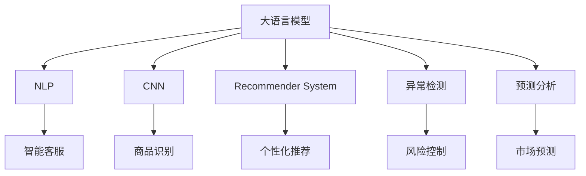

                 

# 电商行业中AI大模型的商业价值分析

> 关键词：人工智能大模型,电商商业价值,自然语言处理(NLP),计算机视觉(CV),推荐系统,智能客服,预测分析

## 1. 背景介绍

### 1.1 问题由来

随着互联网和电子商务的迅猛发展，电商行业已经成为全球最大的数字经济领域之一。其市场规模巨大、竞争激烈、用户需求多变，决定了商家需要不断优化和提升其运营效率、用户体验和服务质量。人工智能大模型作为前沿技术，以其强大的数据处理能力和泛化能力，在电商行业中的应用日益广泛。

大模型可以处理海量数据，并提供多维度的洞察，辅助电商企业在营销、客服、推荐、风险控制等环节做出更精准的决策。然而，如何评估和最大化AI大模型在电商行业中的商业价值，成为业界关注的焦点。

### 1.2 问题核心关键点

大模型在电商行业中的应用具有以下特点：
- **数据处理能力**：大模型可以处理海量数据，提取特征，实现对用户行为、商品属性等信息的深度挖掘。
- **多维度洞察**：通过自然语言处理(NLP)、计算机视觉(CV)、推荐系统等技术，大模型可以提供丰富的商业洞察，辅助决策。
- **个性化服务**：大模型可以针对用户需求，提供个性化的商品推荐、客服解答等，提升用户体验。
- **风险控制**：通过异常检测、欺诈检测等技术，大模型可以辅助电商企业提升风险控制能力。

这些特点使得大模型在电商行业具有巨大的商业价值，但同时也带来了数据隐私、模型鲁棒性、用户接受度等挑战。因此，如何评估和最大化大模型在电商行业的商业价值，成为亟待解决的问题。

## 2. 核心概念与联系

### 2.1 核心概念概述

为更好地理解AI大模型在电商行业的商业价值，本节将介绍几个关键概念：

- **人工智能大模型**：如BERT、GPT-3等，通过大规模数据训练得到的复杂神经网络模型，具有强大的数据处理能力和泛化能力。
- **自然语言处理(NLP)**：通过机器学习技术，使计算机具备理解和生成人类语言的能力，常用于智能客服、搜索优化等电商场景。
- **计算机视觉(CV)**：通过机器学习技术，使计算机具备视觉感知和理解能力，常用于商品识别、推荐等电商场景。
- **推荐系统**：通过机器学习算法，根据用户的历史行为和兴趣，推荐合适的商品，提升电商交易转化率。
- **智能客服**：通过自然语言处理和语音识别技术，使机器人能够理解用户需求，提供自动化客服服务。
- **预测分析**：通过机器学习模型，对未来市场趋势、用户行为等进行预测，辅助电商企业决策。

这些核心概念通过深度学习、自然语言处理、计算机视觉等技术，在大规模数据上进行训练，获得了强大的数据处理和决策支持能力，为电商行业带来了诸多商业价值。

### 2.2 核心概念原理和架构的 Mermaid 流程图



## 3. 核心算法原理 & 具体操作步骤

### 3.1 算法原理概述

AI大模型在电商行业中的应用，主要依赖于其在自然语言处理、计算机视觉、推荐系统等领域的技术能力。其核心原理是通过深度学习算法，从大规模数据中提取特征，进行分类、生成、预测等任务，辅助电商企业提升运营效率和用户体验。

具体而言，AI大模型通过以下步骤实现其在电商行业中的应用：
1. **数据采集与预处理**：从电商平台收集用户行为数据、商品属性数据等，进行清洗和标准化处理。
2. **特征提取**：使用自然语言处理、计算机视觉等技术，从原始数据中提取有意义的特征，如文本向量、图像特征等。
3. **模型训练**：在大规模数据上训练大模型，使其能够学习到数据的复杂分布和模式。
4. **任务适配**：根据电商业务需求，选择合适的大模型，进行微调或参数细化，以适应特定的任务，如智能客服、商品推荐等。
5. **模型部署与应用**：将训练好的模型部署到电商平台，实现对用户行为、商品属性等的分析与预测，辅助决策。

### 3.2 算法步骤详解

以智能客服为例，详细讲解基于AI大模型的电商应用步骤：

**Step 1: 数据采集与预处理**
- 收集用户咨询记录、聊天记录等数据，进行清洗和标准化处理，如去除噪音、规范化格式等。
- 提取对话中涉及的实体、意图、情感等信息，用于训练大模型。

**Step 2: 模型选择与训练**
- 选择合适的大模型（如GPT-3）作为智能客服的基础模型。
- 使用清洗后的对话数据，进行有监督的微调，优化模型对客服任务的适应性。
- 使用对抗训练、正则化等技术，提高模型的鲁棒性和泛化能力。

**Step 3: 任务适配与部署**
- 在模型顶部添加任务适配层，如意图分类器、实体识别器等，提升模型的决策能力。
- 将微调后的模型部署到电商平台的客服系统，实现对用户咨询的自动化响应。
- 持续收集用户反馈，优化模型性能，提升用户体验。

### 3.3 算法优缺点

AI大模型在电商行业中的应用，具有以下优点：
1. **数据处理能力强**：能够处理海量数据，提取复杂特征，提供多维度的洞察。
2. **决策支持精准**：通过深度学习算法，提高决策的准确性和效率。
3. **个性化服务**：能够根据用户行为和兴趣，提供个性化的推荐和客服服务，提升用户体验。
4. **实时响应**：模型部署在电商平台后，可以实时响应用户需求，提高运营效率。

同时，也存在一些缺点：
1. **数据隐私问题**：大规模数据采集和存储，可能涉及用户隐私，需严格遵守数据保护法规。
2. **模型鲁棒性**：大模型可能对数据分布变化敏感，需要定期更新和微调。
3. **用户接受度**：部分用户可能对自动化客服或推荐系统存在抵触情绪，需注意用户体验。
4. **计算资源需求高**：大模型训练和推理需要大量计算资源，需合理配置硬件资源。

### 3.4 算法应用领域

AI大模型在电商行业中的应用，涵盖多个领域，具体包括：

- **智能客服**：使用自然语言处理技术，使机器人能够理解用户需求，提供自动化客服服务。
- **商品识别**：通过计算机视觉技术，对商品进行识别和分类，提升商品搜索和推荐效率。
- **个性化推荐**：通过机器学习算法，根据用户历史行为和兴趣，推荐合适的商品，提升交易转化率。
- **风险控制**：通过异常检测和欺诈检测技术，识别和防范风险行为，保护平台和用户安全。
- **市场预测**：通过预测分析技术，对市场趋势、用户需求进行预测，辅助电商企业决策。

这些应用领域展示了AI大模型在电商行业的广泛应用和巨大商业价值。

## 4. 数学模型和公式 & 详细讲解 & 举例说明

### 4.1 数学模型构建

以商品推荐系统为例，构建基于AI大模型的推荐模型。推荐系统通常使用协同过滤、基于内容的推荐、深度学习推荐等方法。

**协同过滤**：通过用户-商品矩阵，找到相似用户和相似商品，实现推荐。
$$
\hat{r}_{ui} = \frac{\sum_{v} P_{uv} \times I_{vi}}{\sqrt{\sum_{v} P_{uv}^2 \times \sum_{v} I_{vi}^2}}
$$

**基于内容的推荐**：通过分析商品属性，找到相似的商品进行推荐。
$$
\text{Similarity}_{ij} = \text{cosine}(\text{feature}_i, \text{feature}_j)
$$

**深度学习推荐**：通过大模型学习用户和商品的表示，预测用户对商品的兴趣。
$$
\hat{y}_{ui} = sigmoid(W^T \cdot [\text{user}_{u}, \text{item}_{i}])
$$

### 4.2 公式推导过程

以协同过滤为例，推导推荐模型的计算过程。

假设用户-商品矩阵为 $R_{m \times n}$，用户 $u$ 对商品 $i$ 的评分 $r_{ui}$ 服从伯努利分布。协同过滤的目标是通过计算用户之间的相似度，推荐相似用户评分过的商品。

设用户 $u$ 和 $v$ 的相似度为 $s_{uv}$，则协同过滤的计算过程如下：

1. 计算用户 $u$ 和 $v$ 的相似度：
$$
s_{uv} = \frac{\sum_{j=1}^n r_{uj} \times r_{vj}}{\sqrt{\sum_{j=1}^n r_{uj}^2} \times \sqrt{\sum_{j=1}^n r_{vj}^2}}
$$

2. 根据相似度排序，推荐相似用户评分过的商品。
$$
\text{rank}_i = \text{sort}_j(R_{u \times j})
$$

### 4.3 案例分析与讲解

以Amazon商品推荐系统为例，分析AI大模型在电商中的应用效果。

Amazon通过构建基于深度学习的推荐系统，提升了推荐精度和用户体验。具体而言：
1. **数据采集**：从用户浏览、购买记录中，收集用户行为数据。
2. **特征提取**：使用大模型提取商品和用户的特征表示，如商品类别、用户兴趣等。
3. **模型训练**：在大规模数据上训练深度神经网络模型，学习商品和用户之间的关联。
4. **推荐优化**：通过A/B测试等方法，优化推荐模型，提升推荐效果。

通过这些步骤，Amazon的推荐系统能够实时响应用户需求，提供个性化推荐，显著提升了用户的购买转化率和满意度。

## 5. 项目实践：代码实例和详细解释说明

### 5.1 开发环境搭建

进行AI大模型在电商中的应用实践，首先需要搭建开发环境。以下是使用Python和TensorFlow进行环境配置的流程：

1. 安装Anaconda：从官网下载并安装Anaconda，用于创建独立的Python环境。
2. 创建并激活虚拟环境：
```bash
conda create -n tf-env python=3.8 
conda activate tf-env
```

3. 安装TensorFlow：根据CUDA版本，从官网获取对应的安装命令。例如：
```bash
conda install tensorflow tensorflow-gpu=cuda11.1 -c conda-forge
```

4. 安装Keras和TensorFlow Addons：
```bash
conda install keras tensorflow-addons
```

5. 安装各类工具包：
```bash
pip install numpy pandas scikit-learn matplotlib tqdm jupyter notebook ipython
```

完成上述步骤后，即可在`tf-env`环境中开始电商应用的开发实践。

### 5.2 源代码详细实现

这里我们以基于深度学习推荐系统的代码实现为例，展示如何使用TensorFlow和Keras构建电商商品推荐系统。

```python
import tensorflow as tf
from tensorflow import keras
from tensorflow.keras import layers, models

# 定义模型结构
input_layer = keras.layers.Input(shape=(128,))
hidden_layer_1 = keras.layers.Dense(64, activation='relu')(input_layer)
hidden_layer_2 = keras.layers.Dense(32, activation='relu')(hidden_layer_1)
output_layer = keras.layers.Dense(1, activation='sigmoid')(hidden_layer_2)
model = models.Model(inputs=input_layer, outputs=output_layer)

# 编译模型
model.compile(optimizer='adam', loss='binary_crossentropy', metrics=['accuracy'])

# 训练模型
model.fit(x_train, y_train, epochs=10, batch_size=32, validation_data=(x_val, y_val))

# 使用模型进行预测
predictions = model.predict(x_test)
```

### 5.3 代码解读与分析

**输入层**：定义输入数据的维度和格式。
**隐藏层**：定义两个全连接层，通过ReLU激活函数引入非线性变换。
**输出层**：定义一个sigmoid激活函数的输出层，预测用户对商品的评分。

**编译模型**：选择Adam优化器、二元交叉熵损失函数，以及准确率作为评价指标。

**训练模型**：使用训练数据集进行模型训练，迭代10个epoch，每个batch大小为32。

**预测**：使用测试数据集进行模型预测，输出预测结果。

通过上述代码，可以构建一个简单的基于深度学习的电商商品推荐系统。在实际应用中，还需要进行更复杂的数据预处理和模型调优，以获得更好的效果。

### 5.4 运行结果展示

在实际运行中，可以观察到模型的训练和预测效果。通过可视化工具，如TensorBoard，可以实时监控模型的训练状态，分析训练过程中的各项指标，进一步优化模型性能。

## 6. 实际应用场景

### 6.1 智能客服系统

基于AI大模型的智能客服系统，可以显著提升电商平台的客服效率和用户体验。通过自然语言处理技术，智能客服可以自动理解用户咨询，提供自动化响应。

在技术实现上，可以收集平台的历史客服数据，使用大模型进行微调，实现对用户咨询的自动化处理。智能客服系统可以7x24小时不间断服务，快速响应用户需求，提供高质量的客服服务。

### 6.2 商品识别与推荐

计算机视觉技术在电商行业中的应用，可以显著提升商品搜索和推荐的效果。通过大模型学习商品图像特征，可以实现对商品的快速识别和分类。

在具体实现中，可以使用大模型对商品图片进行特征提取，然后与商品信息进行关联，实现对商品的快速搜索和推荐。大模型能够处理海量商品数据，提取复杂特征，提供多维度的商品信息，帮助电商企业提升商品推荐的精准度。

### 6.3 个性化推荐系统

基于深度学习和大模型的推荐系统，可以提供个性化的商品推荐，提升用户的购买转化率。通过分析用户行为数据，大模型能够学习到用户的兴趣偏好，实现对用户的个性化推荐。

在实际应用中，可以使用大模型对用户行为数据进行特征提取，然后与商品信息进行关联，实现对用户的个性化推荐。推荐系统能够实时响应用户需求，提供个性化的商品推荐，提升用户的购买转化率和满意度。

### 6.4 未来应用展望

随着大模型的不断发展，其在电商行业中的应用前景将更加广阔。未来，大模型将能够处理更多类型的输入数据，如语音、视频等，提供更加丰富和多样的应用场景。同时，大模型还将融合更多前沿技术，如自然语言推理、知识图谱等，提升推荐系统的智能水平和用户体验。

未来，AI大模型在电商行业的应用方向可能包括：
- **个性化广告投放**：基于用户行为数据，提供个性化的广告推荐，提升广告效果。
- **风险预测与控制**：通过异常检测和大模型，识别和防范欺诈行为，保护平台和用户安全。
- **市场趋势预测**：通过时间序列分析和大模型，预测市场趋势和用户需求，辅助电商企业决策。

这些应用方向展示了AI大模型在电商行业的巨大潜力，将为电商行业带来更高效、智能的运营模式和用户服务。

## 7. 工具和资源推荐

### 7.1 学习资源推荐

为帮助开发者系统掌握AI大模型在电商行业中的应用，推荐以下学习资源：

1. 《深度学习与自然语言处理》系列课程：斯坦福大学开设的NLP明星课程，涵盖自然语言处理的基本概念和经典模型。
2. 《Python深度学习》书籍：深度学习领域的经典书籍，涵盖深度学习模型和算法。
3. 《TensorFlow实战Google深度学习》书籍：介绍TensorFlow的使用方法和深度学习应用实例。
4. 《智能客服系统设计与实现》论文：介绍智能客服系统的设计思路和实现方法。
5. 《推荐系统设计与实现》论文：介绍推荐系统的设计思路和推荐算法。

通过这些学习资源，可以系统掌握AI大模型在电商行业中的应用原理和技术实现。

### 7.2 开发工具推荐

高效的工具支持是AI大模型在电商行业应用的重要保障。以下是几款推荐的开发工具：

1. PyTorch：基于Python的开源深度学习框架，灵活动态的计算图，适合快速迭代研究。
2. TensorFlow：由Google主导开发的开源深度学习框架，生产部署方便，适合大规模工程应用。
3. Keras：Keras提供了高层API，使深度学习模型构建更加简便。
4. Jupyter Notebook：支持代码执行和可视化，方便调试和测试。
5. TensorBoard：TensorFlow配套的可视化工具，可实时监测模型训练状态，提供丰富的图表。

合理利用这些工具，可以显著提升AI大模型在电商行业应用的开发效率和性能。

### 7.3 相关论文推荐

大模型在电商行业的应用研究，涉及深度学习、自然语言处理、计算机视觉等多个领域。以下是几篇代表性论文，推荐阅读：

1. Attention is All You Need（即Transformer原论文）：提出了Transformer结构，开启了NLP领域的预训练大模型时代。
2. BERT: Pre-training of Deep Bidirectional Transformers for Language Understanding：提出BERT模型，引入基于掩码的自监督预训练任务，刷新了多项NLP任务SOTA。
3. Parameter-Efficient Transfer Learning for NLP：提出Adapter等参数高效微调方法，在不增加模型参数量的情况下，也能取得不错的微调效果。
4. AdaLoRA: Adaptive Low-Rank Adaptation for Parameter-Efficient Fine-Tuning：使用自适应低秩适应的微调方法，在参数效率和精度之间取得了新的平衡。
5. Multi-Task Deep Learning with Memory for Personalized Recommendation：提出基于多任务学习的推荐系统，提升了推荐效果和用户体验。

这些论文代表了大模型在电商行业应用的研究进展，提供了丰富的理论基础和技术思路。

## 8. 总结：未来发展趋势与挑战

### 8.1 总结

本文对AI大模型在电商行业中的应用进行了全面系统的介绍。首先阐述了大模型和电商行业的背景和意义，明确了其在电商行业中的应用价值。其次，从原理到实践，详细讲解了电商应用的算法原理和操作步骤，给出了具体的代码实现和运行结果。同时，本文还探讨了智能客服、商品识别、个性化推荐等实际应用场景，展示了大模型的广泛应用前景。最后，精选了相关的学习资源、开发工具和论文，提供了系统的技术指引。

通过本文的系统梳理，可以看到，AI大模型在电商行业中具有巨大的商业价值，能够显著提升运营效率和用户体验。然而，在落地应用中，也面临着数据隐私、模型鲁棒性、用户接受度等诸多挑战。未来，大模型在电商行业的应用，需要在数据保护、模型优化、用户体验等方面进行持续优化和改进。

### 8.2 未来发展趋势

展望未来，AI大模型在电商行业中的应用将呈现以下几个发展趋势：

1. **数据融合与融合学习**：随着多模态数据融合技术的不断发展，AI大模型将能够处理更多的数据类型，提升模型的全面性和智能性。
2. **自适应学习与零样本学习**：通过自适应学习和零样本学习技术，AI大模型将能够更好地适应新场景和数据分布变化，提升模型的泛化能力。
3. **多领域迁移学习**：AI大模型将能够跨领域迁移学习，应用于不同领域的电商应用，提升模型的通用性和灵活性。
4. **联邦学习与隐私保护**：通过联邦学习等技术，AI大模型将能够在保护用户隐私的前提下，实现模型的分布式训练和优化。

这些趋势展示了AI大模型在电商行业的广阔前景，将为电商企业提供更加智能、高效、安全的运营模式和用户体验。

### 8.3 面临的挑战

尽管AI大模型在电商行业中的应用前景广阔，但在落地应用中仍面临诸多挑战：

1. **数据隐私问题**：大规模数据采集和存储，可能涉及用户隐私，需严格遵守数据保护法规。
2. **模型鲁棒性**：大模型可能对数据分布变化敏感，需要定期更新和微调。
3. **用户接受度**：部分用户可能对自动化客服或推荐系统存在抵触情绪，需注意用户体验。
4. **计算资源需求高**：大模型训练和推理需要大量计算资源，需合理配置硬件资源。

这些挑战需要通过技术创新和管理优化，不断提升AI大模型在电商行业的应用效果和用户体验。

### 8.4 研究展望

未来的研究需要在以下几个方面进行突破：

1. **多模态融合技术**：研究多模态数据融合技术，提升模型的全面性和智能性。
2. **自适应学习与零样本学习**：研究自适应学习和零样本学习技术，提升模型的泛化能力。
3. **多领域迁移学习**：研究多领域迁移学习技术，提升模型的通用性和灵活性。
4. **联邦学习与隐私保护**：研究联邦学习等技术，实现保护用户隐私的分布式训练。

这些研究方向将为AI大模型在电商行业的应用带来新的突破，提升模型的智能水平和用户体验。

## 9. 附录：常见问题与解答

**Q1：AI大模型在电商行业中的应用有哪些？**

A: AI大模型在电商行业中的应用主要包括以下几个方面：
1. **智能客服系统**：使用自然语言处理技术，使机器人能够理解用户咨询，提供自动化响应。
2. **商品识别与推荐**：通过计算机视觉技术，对商品进行识别和分类，提供个性化的商品推荐。
3. **个性化推荐系统**：基于深度学习和大模型的推荐系统，提供个性化的商品推荐，提升用户的购买转化率。
4. **风险预测与控制**：通过异常检测和大模型，识别和防范欺诈行为，保护平台和用户安全。
5. **市场趋势预测**：通过时间序列分析和大模型，预测市场趋势和用户需求，辅助电商企业决策。

这些应用展示了AI大模型在电商行业的广泛应用和巨大商业价值。

**Q2：如何选择适合电商应用的AI大模型？**

A: 选择适合电商应用的AI大模型，需要考虑以下几个方面：
1. **任务适配性**：选择能够适配电商业务需求的模型，如自然语言处理、计算机视觉、推荐系统等。
2. **数据规模**：根据电商业务的数据规模和特点，选择适合的模型结构，如全连接神经网络、卷积神经网络等。
3. **计算资源**：根据电商业务的计算资源需求，选择适合的模型参数量和训练方式，如分布式训练、梯度积累等。
4. **模型效果**：根据电商业务的需求，评估模型的效果和性能，选择最优的模型。

通过综合考虑这些因素，可以更好地选择适合电商应用的AI大模型。

**Q3：如何优化AI大模型在电商行业中的训练和推理？**

A: 优化AI大模型在电商行业中的训练和推理，需要从以下几个方面进行改进：
1. **数据预处理**：进行数据清洗和标准化处理，提升数据质量。
2. **模型结构设计**：优化模型结构，引入合适的激活函数、正则化技术等。
3. **训练策略优化**：使用自适应学习率、早停策略等技术，提升模型收敛速度。
4. **模型压缩与优化**：通过模型剪枝、量化等技术，优化模型的推理速度和资源占用。
5. **模型集成与融合**：使用模型集成和融合技术，提升模型的鲁棒性和泛化能力。

通过这些改进措施，可以显著提升AI大模型在电商行业中的训练和推理效果。

**Q4：AI大模型在电商行业中的风险控制有何应用？**

A: AI大模型在电商行业中的风险控制主要应用于以下几个方面：
1. **异常检测**：通过异常检测技术，识别和防范欺诈行为，保护平台和用户安全。
2. **信用评估**：通过信用评估模型，预测用户的信用风险，辅助电商平台进行风险控制。
3. **行为监控**：通过行为监控模型，实时监测用户行为，防范恶意行为。
4. **数据隐私保护**：通过隐私保护技术，保护用户数据隐私，避免数据泄露风险。

这些应用展示了AI大模型在电商行业中的风险控制能力，能够有效提升电商平台的运营安全。

**Q5：AI大模型在电商行业中的未来发展方向是什么？**

A: AI大模型在电商行业中的未来发展方向可能包括：
1. **多模态融合**：研究多模态数据融合技术，提升模型的全面性和智能性。
2. **自适应学习与零样本学习**：研究自适应学习和零样本学习技术，提升模型的泛化能力。
3. **多领域迁移学习**：研究多领域迁移学习技术，提升模型的通用性和灵活性。
4. **联邦学习与隐私保护**：研究联邦学习等技术，实现保护用户隐私的分布式训练。
5. **边缘计算与本地推理**：研究边缘计算和本地推理技术，提升模型的实时性和效率。

这些发展方向将为AI大模型在电商行业的应用带来新的突破，提升模型的智能水平和用户体验。

---

作者：禅与计算机程序设计艺术 / Zen and the Art of Computer Programming

