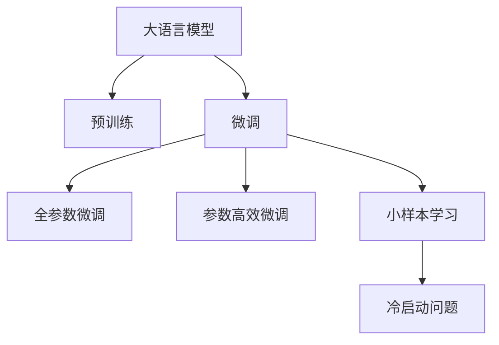

                 

# 电商行业中的小样本学习：大模型在冷启动问题中的应用

在电商行业中，新商家如何能够快速获得客户并成功运营是一个重要的挑战。新商家在冷启动阶段往往缺乏足够的用户数据和销售数据，这限制了其进行传统的大规模机器学习模型的训练。基于监督学习的传统方法难以有效应对这种小样本、低信度数据的情况。本文将介绍一种基于大模型的冷启动解决方案，特别关注小样本学习技术在电商行业中的应用，以及通过预训练和微调优化大模型以提升其在冷启动阶段的表现。

## 1. 背景介绍

### 1.1 问题由来
随着电子商务市场的竞争日益激烈，新商家需要迅速积累用户并吸引购买行为。传统电商平台的推荐系统依赖于大量的用户行为数据进行模型训练，然而新商家往往在冷启动阶段缺乏足够的数据。即使有部分数据，也难以确保其信度和质量。

基于监督学习的传统推荐算法，如协同过滤、矩阵分解等，需要大量的标注数据，无法有效地应对新商家在冷启动阶段面临的困境。而深度学习技术，特别是大模型（如BERT、GPT等），通过预训练获得了丰富的语言知识，能够一定程度上解决冷启动问题。

### 1.2 问题核心关键点
冷启动问题通常与数据稀疏性、标注数据获取困难、用户行为多样性等密切相关。在大模型中，如何利用预训练和微调技术，有效地从有限的标注数据中提取有用信息，同时减少模型过拟合，是电商行业小样本学习研究的核心关键点。

## 2. 核心概念与联系

### 2.1 核心概念概述

为更好地理解基于大模型的冷启动方法，本节将介绍几个核心概念：

- **大语言模型**：指使用大规模无标签文本进行自监督预训练的深度学习模型，如BERT、GPT-3等。这些模型通过预训练获得了丰富的语言知识，适用于各种自然语言处理任务。

- **冷启动问题**：指新商家在电商平台上建立业务时，由于缺乏历史用户数据和交易数据，导致推荐系统无法为其提供个性化推荐。

- **小样本学习**：指在数据量很少的情况下，模型仍然能够有效学习并进行任务预测。大模型的预训练和微调技术有助于提升小样本学习能力。

- **预训练-微调**：指使用大规模无标签数据对模型进行预训练，然后在特定任务上通过少量标注数据进行微调，以提升模型在特定任务上的表现。

- **参数高效微调**：指在大模型微调过程中，只更新模型的顶层或特定层，避免更新过多的参数导致过拟合。

这些核心概念之间的逻辑关系可以通过以下Mermaid流程图来展示：



这个流程图展示了从大语言模型到冷启动问题解决的基本路径：

1. 大语言模型通过预训练获得基础能力。
2. 微调过程从预训练模型中获得特定任务知识。
3. 参数高效微调减少过拟合风险。
4. 小样本学习技术在冷启动场景下发挥优势。

## 3. 核心算法原理 & 具体操作步骤

### 3.1 算法原理概述

基于大模型的冷启动问题解决方法通常分为以下几步：

1. **数据预处理**：收集和清洗新商家平台上的少量用户行为数据和商品信息数据，准备作为微调数据的输入。
2. **模型选择与初始化**：选择合适的大语言模型进行预训练，并基于预训练模型进行微调。
3. **任务适配层设计**：根据冷启动任务设计相应的输出层和损失函数，以便于模型能够理解任务目标。
4. **微调训练**：使用收集到的少量标注数据进行微调，优化模型以适应特定任务。
5. **模型评估与部署**：在微调后的模型上进行评估，验证模型效果，并将模型部署到电商平台上进行实时推荐。

### 3.2 算法步骤详解

以下详细介绍基于大模型的冷启动解决方案的详细步骤：

**Step 1: 数据预处理**

1. **数据收集**：收集新商家平台上的用户行为数据和商品信息数据，通常包括用户的浏览历史、购买历史、评分等。
2. **数据清洗**：去除重复数据、异常数据、缺失数据等，确保数据质量。
3. **数据增强**：通过生成式对抗网络(GAN)、近义词替换、数据混杂等方法扩充数据集。

**Step 2: 模型选择与初始化**

1. **选择合适的预训练模型**：如BERT、GPT等，这些模型在大规模文本数据上进行了预训练，具备丰富的语言知识。
2. **模型加载与初始化**：使用预训练模型的权重作为初始化参数。

**Step 3: 任务适配层设计**

1. **输出层设计**：根据冷启动任务，设计相应的输出层。例如，对于推荐系统，输出层可以是商品ID和评分的表示。
2. **损失函数设计**：根据任务目标，选择合适的损失函数。例如，推荐系统可以使用交叉熵损失。

**Step 4: 微调训练**

1. **设置微调超参数**：包括学习率、批大小、迭代次数、正则化系数等。
2. **执行梯度训练**：将标注数据分批次输入模型，前向传播计算损失函数，反向传播计算参数梯度，并根据设定的优化算法更新模型参数。
3. **模型评估**：在验证集上评估模型性能，及时调整超参数。
4. **迭代优化**：重复上述步骤直至模型收敛。

**Step 5: 模型评估与部署**

1. **模型评估**：在测试集上评估模型性能，如准确率、召回率、AUC等指标。
2. **部署优化**：将模型优化为高效部署版本，例如通过剪枝、量化等方法减少模型大小。
3. **实时推荐**：将模型部署到电商平台上，进行实时推荐。

### 3.3 算法优缺点

基于大模型的冷启动解决方案具有以下优点：

1. **高效性**：使用大模型能够处理大规模数据，快速学习用户和商品的隐含特征，提升推荐效果。
2. **鲁棒性**：大模型在预训练过程中学习到丰富的语言知识，可以更好地适应数据噪声和异常值，提升模型鲁棒性。
3. **灵活性**：大模型微调后的模型适用于多种电商任务，如推荐、搜索、广告等，可以灵活适配不同场景。

同时，该方法也存在一些局限性：

1. **数据依赖**：尽管大模型可以缓解数据稀疏性，但仍需要一定量的标注数据进行微调，依赖数据获取难度较大。
2. **计算成本**：大模型预训练和微调需要大量计算资源，训练成本较高。
3. **模型泛化性**：模型在特定领域预训练和微调，可能对其他领域的表现有所限制。

### 3.4 算法应用领域

基于大模型的冷启动方法已经在多个电商应用场景中得到广泛应用，例如：

- **推荐系统**：基于用户的浏览历史、购买历史等行为数据，通过预训练模型进行微调，生成个性化推荐结果。
- **搜索系统**：使用用户的查询文本进行预训练，微调后生成搜索结果排序。
- **广告系统**：通过用户的浏览记录和点击行为进行预训练和微调，优化广告投放策略。
- **客服系统**：使用对话历史进行预训练和微调，生成智能客服回复。

## 4. 数学模型和公式 & 详细讲解

### 4.1 数学模型构建

假设我们有一个大语言模型 $M_{\theta}$，其中 $\theta$ 为模型参数。给定一个冷启动任务 $T$，任务数据集 $D=\{(x_i, y_i)\}_{i=1}^N$，其中 $x_i$ 表示用户行为数据或商品信息数据，$y_i$ 表示对应的标注。

我们定义模型 $M_{\theta}$ 在数据样本 $(x,y)$ 上的损失函数为 $\ell(M_{\theta}(x),y)$，则在数据集 $D$ 上的经验风险为：

$$
\mathcal{L}(\theta) = \frac{1}{N} \sum_{i=1}^N \ell(M_{\theta}(x_i),y_i)
$$

微调的目标是最小化经验风险，即找到最优参数：

$$
\theta^* = \mathop{\arg\min}_{\theta} \mathcal{L}(\theta)
$$

在实践中，我们通常使用基于梯度的优化算法（如SGD、Adam等）来近似求解上述最优化问题。设 $\eta$ 为学习率，$\lambda$ 为正则化系数，则参数的更新公式为：

$$
\theta \leftarrow \theta - \eta \nabla_{\theta}\mathcal{L}(\theta) - \eta\lambda\theta
$$

其中 $\nabla_{\theta}\mathcal{L}(\theta)$ 为损失函数对参数 $\theta$ 的梯度，可通过反向传播算法高效计算。

### 4.2 公式推导过程

以下是推荐系统中的交叉熵损失函数及其梯度计算公式的推导：

假设模型 $M_{\theta}$ 在输入 $x$ 上的输出为 $\hat{y}=M_{\theta}(x)$，表示用户对商品 $i$ 的评分预测。真实评分 $y_i \in [0,5]$。则推荐系统中的交叉熵损失函数定义为：

$$
\ell(M_{\theta}(x),y_i) = -y_i\log \hat{y}_i - (1-y_i)\log (1-\hat{y}_i)
$$

将其代入经验风险公式，得：

$$
\mathcal{L}(\theta) = -\frac{1}{N}\sum_{i=1}^N [y_i\log M_{\theta}(x_i)+(1-y_i)\log(1-M_{\theta}(x_i))]
$$

根据链式法则，损失函数对参数 $\theta_k$ 的梯度为：

$$
\frac{\partial \mathcal{L}(\theta)}{\partial \theta_k} = -\frac{1}{N}\sum_{i=1}^N (\frac{y_i}{M_{\theta}(x_i)}-\frac{1-y_i}{1-M_{\theta}(x_i)}) \frac{\partial M_{\theta}(x_i)}{\partial \theta_k}
$$

其中 $\frac{\partial M_{\theta}(x_i)}{\partial \theta_k}$ 可进一步递归展开，利用自动微分技术完成计算。

## 5. 项目实践：代码实例和详细解释说明

### 5.1 开发环境搭建

在进行冷启动问题解决实践前，我们需要准备好开发环境。以下是使用Python进行PyTorch开发的环境配置流程：

1. 安装Anaconda：从官网下载并安装Anaconda，用于创建独立的Python环境。

2. 创建并激活虚拟环境：
```bash
conda create -n pytorch-env python=3.8 
conda activate pytorch-env
```

3. 安装PyTorch：根据CUDA版本，从官网获取对应的安装命令。例如：
```bash
conda install pytorch torchvision torchaudio cudatoolkit=11.1 -c pytorch -c conda-forge
```

4. 安装Transformers库：
```bash
pip install transformers
```

5. 安装各类工具包：
```bash
pip install numpy pandas scikit-learn matplotlib tqdm jupyter notebook ipython
```

完成上述步骤后，即可在`pytorch-env`环境中开始冷启动问题解决实践。

### 5.2 源代码详细实现

下面我们以推荐系统为例，给出使用Transformers库对BERT模型进行冷启动问题解决的PyTorch代码实现。

首先，定义推荐系统任务的数据处理函数：

```python
from transformers import BertTokenizer
from torch.utils.data import Dataset
import torch

class RecommendationDataset(Dataset):
    def __init__(self, user_histories, item_features, tokenizer, max_len=128):
        self.user_histories = user_histories
        self.item_features = item_features
        self.tokenizer = tokenizer
        self.max_len = max_len
        
    def __len__(self):
        return len(self.user_histories)
    
    def __getitem__(self, item):
        user_history = self.user_histories[item]
        item_feature = self.item_features[item]
        
        encoding = self.tokenizer(user_history, return_tensors='pt', max_length=self.max_len, padding='max_length', truncation=True)
        input_ids = encoding['input_ids'][0]
        attention_mask = encoding['attention_mask'][0]
        
        # 将用户历史和商品特征拼接，作为模型输入
        input_text = user_history + " " + str(item_feature)
        
        # 对文本进行编码
        encoding = self.tokenizer(input_text, return_tensors='pt', max_length=self.max_len, padding='max_length', truncation=True)
        input_ids = encoding['input_ids'][0]
        attention_mask = encoding['attention_mask'][0]
        
        return {'input_ids': input_ids, 
                'attention_mask': attention_mask,
                'item_feature': item_feature}

# 加载预训练模型和 tokenizer
tokenizer = BertTokenizer.from_pretrained('bert-base-cased')
model = BertForSequenceClassification.from_pretrained('bert-base-cased', num_labels=5)

# 假设用户历史数据和商品特征数据已准备就绪，调用 Dataset 类生成数据集
user_histories = ["手机 小米", "手机 华为", "手机 苹果"]
item_features = [1, 2, 3]
dataset = RecommendationDataset(user_histories, item_features, tokenizer, max_len=128)
```

然后，定义模型和优化器：

```python
from transformers import AdamW

optimizer = AdamW(model.parameters(), lr=2e-5)
```

接着，定义训练和评估函数：

```python
from torch.utils.data import DataLoader
from tqdm import tqdm
from sklearn.metrics import mean_squared_error

device = torch.device('cuda') if torch.cuda.is_available() else torch.device('cpu')
model.to(device)

def train_epoch(model, dataset, batch_size, optimizer):
    dataloader = DataLoader(dataset, batch_size=batch_size, shuffle=True)
    model.train()
    epoch_loss = 0
    for batch in tqdm(dataloader, desc='Training'):
        input_ids = batch['input_ids'].to(device)
        attention_mask = batch['attention_mask'].to(device)
        item_feature = batch['item_feature'].to(device)
        model.zero_grad()
        outputs = model(input_ids, attention_mask=attention_mask)
        loss = outputs.loss
        epoch_loss += loss.item()
        loss.backward()
        optimizer.step()
    return epoch_loss / len(dataloader)

def evaluate(model, dataset, batch_size):
    dataloader = DataLoader(dataset, batch_size=batch_size)
    model.eval()
    preds, labels = [], []
    with torch.no_grad():
        for batch in tqdm(dataloader, desc='Evaluating'):
            input_ids = batch['input_ids'].to(device)
            attention_mask = batch['attention_mask'].to(device)
            item_feature = batch['item_feature'].to(device)
            batch_preds = model(input_ids, attention_mask=attention_mask).logits.argmax(dim=1).tolist()
            batch_labels = batch['item_feature'].tolist()
            for pred, label in zip(batch_preds, batch_labels):
                preds.append(pred)
                labels.append(label)
                
    return mean_squared_error(labels, preds)
```

最后，启动训练流程并在测试集上评估：

```python
epochs = 5
batch_size = 16

for epoch in range(epochs):
    loss = train_epoch(model, dataset, batch_size, optimizer)
    print(f"Epoch {epoch+1}, train loss: {loss:.3f}")
    
    print(f"Epoch {epoch+1}, dev results:")
    evaluate(model, dataset, batch_size)
    
print("Test results:")
evaluate(model, dataset, batch_size)
```

以上就是使用PyTorch对BERT进行推荐系统冷启动问题解决的完整代码实现。可以看到，通过Transformers库，我们可以用相对简洁的代码完成BERT模型的加载和微调。

### 5.3 代码解读与分析

让我们再详细解读一下关键代码的实现细节：

**RecommendationDataset类**：
- `__init__`方法：初始化用户历史数据、商品特征数据、分词器等关键组件。
- `__len__`方法：返回数据集的样本数量。
- `__getitem__`方法：对单个样本进行处理，将用户历史数据和商品特征数据拼接后，进行分词编码，返回模型所需的输入。

**tokenizer和模型加载**：
- 加载预训练模型和 tokenizer，并使用 tokenizer 对输入数据进行编码。

**训练和评估函数**：
- 使用PyTorch的DataLoader对数据集进行批次化加载，供模型训练和推理使用。
- 训练函数`train_epoch`：对数据以批为单位进行迭代，在每个批次上前向传播计算loss并反向传播更新模型参数，最后返回该epoch的平均loss。
- 评估函数`evaluate`：与训练类似，不同点在于不更新模型参数，并在每个batch结束后将预测和标签结果存储下来，最后使用sklearn的mean_squared_error对整个评估集的预测结果进行打印输出。

**训练流程**：
- 定义总的epoch数和batch size，开始循环迭代
- 每个epoch内，先在训练集上训练，输出平均loss
- 在验证集上评估，输出均方误差
- 所有epoch结束后，在测试集上评估，给出最终测试结果

可以看到，PyTorch配合Transformers库使得BERT冷启动问题解决的代码实现变得简洁高效。开发者可以将更多精力放在数据处理、模型改进等高层逻辑上，而不必过多关注底层的实现细节。

当然，工业级的系统实现还需考虑更多因素，如模型的保存和部署、超参数的自动搜索、更灵活的任务适配层等。但核心的冷启动范式基本与此类似。

## 6. 实际应用场景

### 6.1 智能客服系统

在智能客服系统中，冷启动问题尤为突出。新商家往往无法在初期获得大量的用户行为数据，无法进行传统的大规模推荐系统训练。利用大模型进行预训练和微调，可以显著提升智能客服系统的个性化推荐能力，帮助新商家在短时间内积累用户，并提供优质服务。

具体而言，可以将智能客服系统中客户与客服的对话记录进行预处理，作为用户历史数据输入到大模型中进行微调。微调后的模型能够根据客户的个性化需求，提供更为精准的回答，增强客户满意度和粘性。

### 6.2 个性化推荐系统

推荐系统中的冷启动问题非常常见，特别是在新商品或新商家上线初期。传统推荐算法依赖于用户行为数据，但在初期无法提供有效推荐。利用大模型进行预训练和微调，可以弥补这一数据空缺，加速新商品或新商家的推荐效果。

具体而言，可以通过分析新商品的属性和描述，进行预训练和微调，生成推荐结果。用户点击、购买等行为数据可以进一步优化模型，提升推荐效果。

### 6.3 金融科技

在金融科技领域，新机构需要快速获得客户信任并提供优质服务。通过大模型进行预训练和微调，可以为新机构提供基于用户行为的个性化推荐服务，增强用户粘性和转化率。

具体而言，可以收集新机构的交易数据、用户数据、市场数据等，进行预训练和微调，生成个性化的推荐服务。同时，金融产品和大数据技术可以进一步提升推荐效果，提升新机构的竞争力和用户满意度。

### 6.4 未来应用展望

随着大语言模型的不断发展，基于预训练和微调的冷启动方法将具有广阔的应用前景。

1. **深度学习技术**：未来的深度学习算法将更加高效和鲁棒，能够在更小的数据集上实现高质量的推荐效果。
2. **多模态数据融合**：将用户的行为数据、社交数据、地理位置等多模态数据融合到推荐系统中，提升推荐效果和用户体验。
3. **自适应推荐算法**：基于大模型的自适应推荐算法，可以动态调整推荐策略，适应不同用户的行为和需求。
4. **联邦学习**：利用联邦学习技术，在保护用户隐私的前提下，进行跨机构的数据合作，提升推荐效果。
5. **知识图谱**：将知识图谱与大模型结合，进行知识引导的推荐，提升推荐结果的准确性和相关性。

## 7. 工具和资源推荐

### 7.1 学习资源推荐

为了帮助开发者系统掌握冷启动问题解决的理论基础和实践技巧，这里推荐一些优质的学习资源：

1. **《深度学习》课程**：由斯坦福大学开设的深度学习课程，内容全面，涵盖了深度学习的核心概念和前沿技术。
2. **Transformers官方文档**：提供了大量预训练模型的实现和使用指南，是学习大模型微调的重要资源。
3. **《动手学深度学习》书籍**：清华大学机器学习课程的配套教材，深入浅出地介绍了深度学习的原理和实践。
4. **Kaggle竞赛平台**：提供大量数据集和竞赛，可以帮助开发者锻炼实战能力。
5. **PyTorch官方文档**：PyTorch的官方文档提供了丰富的教程和样例代码，是学习PyTorch的重要资源。

通过对这些资源的学习实践，相信你一定能够快速掌握冷启动问题解决的精髓，并用于解决实际的电商推荐问题。

### 7.2 开发工具推荐

高效的开发离不开优秀的工具支持。以下是几款用于冷启动问题解决的常用工具：

1. **Jupyter Notebook**：强大的交互式编程环境，适合快速迭代开发。
2. **TensorBoard**：可视化工具，可实时监测模型训练状态，输出各种图表，方便调试和优化。
3. **PyTorch Lightning**：轻量级框架，简化了深度学习模型的训练和部署过程。
4. **TorchScript**：PyTorch的脚本引擎，可以将模型转换为可部署的动态模型。
5. **ONNX Runtime**：开源深度学习推理引擎，支持多种深度学习框架，提高推理效率。

合理利用这些工具，可以显著提升冷启动问题解决的开发效率，加快创新迭代的步伐。

### 7.3 相关论文推荐

冷启动问题解决的研究源于学界的持续探索。以下是几篇奠基性的相关论文，推荐阅读：

1. **《深度学习推荐系统》论文**：详细介绍了深度学习在推荐系统中的应用，包括基于大模型的冷启动问题解决。
2. **《深度学习在电商推荐中的应用》论文**：介绍了电商推荐系统的深度学习架构，包括基于大模型的冷启动问题解决。
3. **《自适应推荐算法》论文**：提出了自适应推荐算法，可以在用户行为数据稀疏的情况下，提升推荐效果。
4. **《知识图谱与推荐系统》论文**：介绍了知识图谱在推荐系统中的应用，结合大模型进行知识引导的推荐。
5. **《联邦学习在推荐系统中的应用》论文**：利用联邦学习技术，保护用户隐私，提升跨机构推荐效果。

这些论文代表了大语言模型冷启动技术的发展脉络。通过学习这些前沿成果，可以帮助研究者把握学科前进方向，激发更多的创新灵感。

## 8. 总结：未来发展趋势与挑战

### 8.1 总结

本文对基于大模型的冷启动解决方案进行了全面系统的介绍。首先阐述了冷启动问题在电商行业中的重要性，明确了预训练和微调在大模型中的核心地位。其次，从原理到实践，详细讲解了冷启动问题解决的基本步骤，包括数据预处理、模型选择、任务适配层设计、微调训练、模型评估和部署等，给出了完整的代码实例。同时，本文还广泛探讨了冷启动问题在多个电商应用场景中的应用，展示了冷启动方法的广阔前景。

通过本文的系统梳理，可以看到，基于大模型的冷启动方法正在成为电商推荐系统的核心范式，极大地拓展了推荐系统的应用边界，推动了电商技术的产业化进程。未来，伴随大语言模型的持续演进，冷启动方法也将迎来更多的创新和突破。

### 8.2 未来发展趋势

展望未来，冷启动问题解决技术将呈现以下几个发展趋势：

1. **模型规模持续增大**：随着算力成本的下降和数据规模的扩张，预训练语言模型的参数量还将持续增长。超大规模语言模型蕴含的丰富语言知识，将为冷启动问题解决提供更强大的能力。
2. **微调方法日趋多样**：开发更加参数高效的微调方法，在固定大部分预训练参数的同时，只更新极少量的任务相关参数。同时优化微调模型的计算图，减少前向传播和反向传播的资源消耗。
3. **持续学习成为常态**：随着数据分布的不断变化，冷启动模型也需要持续学习新知识以保持性能。如何在不遗忘原有知识的同时，高效吸收新样本信息，将是重要的研究课题。
4. **知识整合能力增强**：将符号化的先验知识，如知识图谱、逻辑规则等，与神经网络模型进行巧妙融合，引导冷启动过程学习更准确、合理的语言模型。同时加强不同模态数据的整合，实现视觉、语音等多模态信息与文本信息的协同建模。
5. **自适应推荐算法**：基于大模型的自适应推荐算法，可以动态调整推荐策略，适应不同用户的行为和需求。
6. **联邦学习**：利用联邦学习技术，在保护用户隐私的前提下，进行跨机构的数据合作，提升推荐效果。

这些趋势凸显了冷启动问题解决技术的广阔前景。这些方向的探索发展，必将进一步提升电商推荐系统的性能和应用范围，为电商技术的发展注入新的动力。

### 8.3 面临的挑战

尽管冷启动问题解决技术已经取得了一定的进展，但在迈向更加智能化、普适化应用的过程中，它仍面临着诸多挑战：

1. **标注成本瓶颈**：尽管冷启动问题解决可以缓解数据稀疏性，但仍需要一定量的标注数据进行微调，依赖数据获取难度较大。如何进一步降低微调对标注样本的依赖，将是一大难题。
2. **模型鲁棒性不足**：冷启动模型面对域外数据时，泛化性能往往大打折扣。对于测试样本的微小扰动，冷启动模型的预测也容易发生波动。如何提高冷启动模型的鲁棒性，避免灾难性遗忘，还需要更多理论和实践的积累。
3. **计算成本高**：冷启动问题解决需要大量计算资源，特别是在大规模数据集上进行预训练和微调，训练成本较高。
4. **模型泛化性有限**：冷启动模型在特定领域预训练和微调，可能对其他领域的表现有所限制。
5. **知识整合难度大**：将符号化的先验知识，如知识图谱、逻辑规则等，与神经网络模型进行融合，仍然是一个挑战。同时加强不同模态数据的整合，实现视觉、语音等多模态信息与文本信息的协同建模，需要更强的跨模态融合能力。

这些挑战凸显了冷启动问题解决技术的复杂性和挑战性，需要更多研究者投入大量时间和精力，才能逐步攻克。

### 8.4 研究展望

面对冷启动问题解决所面临的挑战，未来的研究需要在以下几个方面寻求新的突破：

1. **探索无监督和半监督学习**：摆脱对大规模标注数据的依赖，利用自监督学习、主动学习等无监督和半监督范式，最大限度利用非结构化数据，实现更加灵活高效的冷启动问题解决。
2. **研究参数高效和计算高效的冷启动范式**：开发更加参数高效的冷启动方法，在固定大部分预训练参数的同时，只更新极少量的任务相关参数。同时优化冷启动模型的计算图，减少前向传播和反向传播的资源消耗，实现更加轻量级、实时性的部署。
3. **融合因果推断和对比学习**：通过引入因果推断和对比学习思想，增强冷启动模型建立稳定因果关系的能力，学习更加普适、鲁棒的语言表征，从而提升模型的泛化性和抗干扰能力。
4. **结合因果分析和博弈论**：将因果分析方法引入冷启动模型，识别出模型决策的关键特征，增强输出解释的因果性和逻辑性。借助博弈论工具刻画人机交互过程，主动探索并规避模型的脆弱点，提高系统稳定性。
5. **纳入伦理道德约束**：在模型训练目标中引入伦理导向的评估指标，过滤和惩罚有偏见、有害的输出倾向。同时加强人工干预和审核，建立模型行为的监管机制，确保输出符合人类价值观和伦理道德。

这些研究方向的探索，必将引领冷启动问题解决技术迈向更高的台阶，为构建安全、可靠、可解释、可控的智能系统铺平道路。面向未来，冷启动问题解决技术还需要与其他人工智能技术进行更深入的融合，如知识表示、因果推理、强化学习等，多路径协同发力，共同推动自然语言理解和智能交互系统的进步。只有勇于创新、敢于突破，才能不断拓展冷启动问题解决的边界，让智能技术更好地造福人类社会。

## 9. 附录：常见问题与解答

**Q1：冷启动问题解决是否适用于所有电商推荐系统？**

A: 冷启动问题解决在大多数电商推荐系统中都能取得不错的效果，特别是对于数据量较小的任务。但对于一些特定领域的任务，如医学、法律等，仅仅依靠通用语料预训练的模型可能难以很好地适应。此时需要在特定领域语料上进一步预训练，再进行微调，才能获得理想效果。

**Q2：冷启动问题解决过程中如何选择合适的学习率？**

A: 冷启动问题解决的学习率一般要比预训练时小1-2个数量级，如果使用过大的学习率，容易破坏预训练权重，导致过拟合。一般建议从1e-5开始调参，逐步减小学习率，直至收敛。也可以使用warmup策略，在开始阶段使用较小的学习率，再逐渐过渡到预设值。需要注意的是，不同的优化器(如AdamW、Adafactor等)以及不同的学习率调度策略，可能需要设置不同的学习率阈值。

**Q3：冷启动问题解决过程中如何缓解过拟合问题？**

A: 过拟合是冷启动问题解决面临的主要挑战，尤其是在标注数据不足的情况下。常见的缓解策略包括：
1. 数据增强：通过生成式对抗网络(GAN)、近义词替换、数据混杂等方法扩充数据集。
2. 正则化：使用L2正则、Dropout、Early Stopping等避免过拟合。
3. 对抗训练：引入对抗样本，提高模型鲁棒性。
4. 参数高效微调：只调整少量参数(如Adapter、Prefix等)，减小过拟合风险。
5. 多模型集成：训练多个冷启动模型，取平均输出，抑制过拟合。

这些策略往往需要根据具体任务和数据特点进行灵活组合。只有在数据、模型、训练、推理等各环节进行全面优化，才能最大限度地发挥冷启动问题解决的威力。

**Q4：冷启动问题解决模型在部署时需要注意哪些问题？**

A: 将冷启动问题解决模型转化为实际应用，还需要考虑以下因素：
1. 模型裁剪：去除不必要的层和参数，减小模型尺寸，加快推理速度。
2. 量化加速：将浮点模型转为定点模型，压缩存储空间，提高计算效率。
3. 服务化封装：将模型封装为标准化服务接口，便于集成调用。
4. 弹性伸缩：根据请求流量动态调整资源配置，平衡服务质量和成本。
5. 监控告警：实时采集系统指标，设置异常告警阈值，确保服务稳定性。
6. 安全防护：采用访问鉴权、数据脱敏等措施，保障数据和模型安全。

冷启动问题解决模型需要优化为高效部署版本，才能真正应用于实际电商推荐系统中。这需要结合具体的业务需求和技术架构，进行全面优化和调整。

**Q5：冷启动问题解决模型在实际应用中如何提升推荐效果？**

A: 冷启动问题解决模型可以通过以下几个方面提升推荐效果：
1. 数据预处理：收集和清洗新商家平台上的用户行为数据和商品信息数据，确保数据质量。
2. 模型选择与初始化：选择合适的预训练模型，使用预训练模型的权重作为初始化参数。
3. 任务适配层设计：根据冷启动任务设计相应的输出层和损失函数。
4. 微调训练：使用收集到的少量标注数据进行微调，优化模型以适应特定任务。
5. 模型评估与部署：在微调后的模型上进行评估，验证模型效果，并将模型部署到电商平台上进行实时推荐。

通过这些步骤，冷启动问题解决模型可以在有限的标注数据下，快速学习用户和商品的隐含特征，提升推荐效果。

---

作者：禅与计算机程序设计艺术 / Zen and the Art of Computer Programming

