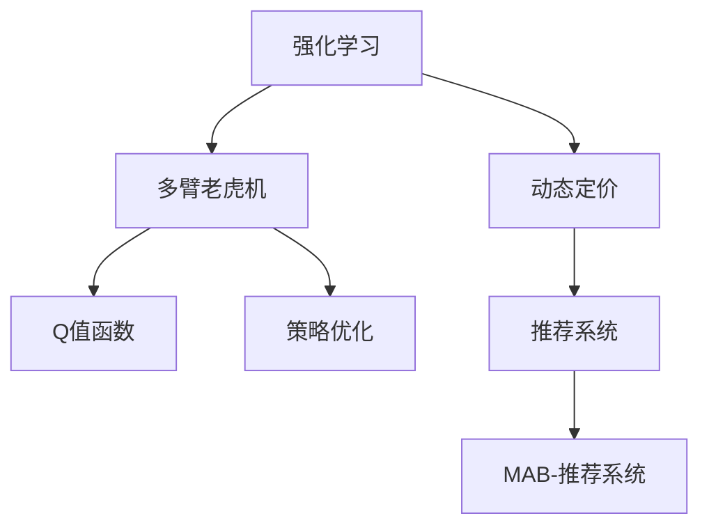

                 

# 电商行业中的强化学习：大模型的实践

> 关键词：强化学习,电商,大模型,多臂老虎机,推荐系统,动态定价,决策优化

## 1. 背景介绍

### 1.1 问题由来
随着电商行业的发展，各大电商平台正面临着激烈的市场竞争和客户需求的不断变化。如何精准预测用户行为，提升个性化推荐效果，优化产品价格，是电商企业亟待解决的问题。传统的机器学习技术基于静态特征，难以捕捉到动态变化的用户需求和市场趋势。强化学习(Reinforcement Learning, RL)技术，通过模拟环境与智能体之间的互动，动态地优化决策策略，逐渐成为电商领域的一大热门研究方向。

强化学习在电商领域的应用主要集中在以下几个方面：
1. **个性化推荐**：通过模拟用户行为和点击数据，优化推荐策略，提升用户体验。
2. **动态定价**：实时调整产品价格，最大化收入和利润。
3. **库存管理**：基于实时销售数据，动态调整库存水平，减少缺货和积压。
4. **广告投放**：优化广告投放策略，最大化点击率和转化率。

本文章将重点探讨如何利用强化学习技术，结合大模型，实现电商行业中的个性化推荐和动态定价。

### 1.2 问题核心关键点
强化学习在电商中的应用，主要依赖于智能体与环境之间的交互。在电商场景下，智能体可以是电商平台，而环境则是用户行为和市场数据。电商平台需要根据用户行为数据，动态调整策略以最大化收益。智能体的行为策略优化，通常可以通过多臂老虎机(Multi-Armed Bandit)模型实现。该模型能够模拟多款产品的点击率、转化率等用户行为数据，从而优化推荐策略和定价策略。

## 2. 核心概念与联系

### 2.1 核心概念概述

为更好地理解强化学习在电商中的应用，本节将介绍几个密切相关的核心概念：

- **强化学习(Reinforcement Learning)**：一种通过智能体与环境互动，学习最优策略的机器学习方法。智能体通过与环境互动，不断调整策略以最大化奖励。

- **多臂老虎机(Multi-Armed Bandit)**：一种模拟多款产品或服务的点击率、转化率等用户行为数据的强化学习模型。每个“臂”代表一种产品或服务，智能体需要学习哪种产品或服务最可能获得高奖励。

- **Q值函数(Q-value Function)**：表示在当前状态下采取某项行动的长期奖励期望。强化学习中的核心任务是优化Q值函数，以找到最优行动策略。

- **策略优化(Policy Optimization)**：通过优化策略，使智能体在给定状态下选择最优行动，最大化长期奖励。

- **动态定价(Dynamic Pricing)**：根据市场需求和竞争环境，实时调整产品价格以最大化收入和利润。

- **多臂老虎机推荐系统(MAB-Recommendation System)**：结合多臂老虎机模型和推荐系统技术，实现基于用户行为的动态推荐。

这些核心概念之间的逻辑关系可以通过以下Mermaid流程图来展示：



这个流程图展示了一系列核心概念及其之间的关系：

1. 强化学习通过智能体与环境互动，不断调整策略以最大化长期奖励。
2. 多臂老虎机模型通过模拟多款产品的点击率、转化率等用户行为数据，优化推荐策略和定价策略。
3. Q值函数表示在当前状态下采取某项行动的长期奖励期望，是强化学习优化的目标。
4. 策略优化通过优化策略，使智能体在给定状态下选择最优行动，最大化长期奖励。
5. 动态定价根据市场需求和竞争环境，实时调整产品价格以最大化收入和利润。
6. MAB-推荐系统结合多臂老虎机模型和推荐系统技术，实现基于用户行为的动态推荐。

这些概念共同构成了强化学习在电商中的应用框架，使其能够通过智能体的不断优化，提升用户满意度和平台收益。

## 3. 核心算法原理 & 具体操作步骤
### 3.1 算法原理概述

在电商场景下，强化学习主要应用于个性化推荐和动态定价两个方面。其核心算法原理如下：

#### 3.1.1 个性化推荐

电商平台的个性化推荐系统通常采用多臂老虎机模型。在推荐系统中，每一款产品或服务对应一个“臂”，用户的点击和购买行为数据记录在对应的“臂”上。智能体（电商平台）需要不断调整各个臂的点击率，以达到最大化点击率和转化率的目的。

#### 3.1.2 动态定价

动态定价则通过强化学习模型实时调整产品价格，最大化收入和利润。智能体（电商平台）根据市场需求、库存水平和竞争环境等动态因素，调整产品价格，以达到最优的市场反应和收益。

### 3.2 算法步骤详解

#### 3.2.1 个性化推荐

1. **数据收集**：收集用户对每个推荐产品的点击和购买数据，形成多臂老虎机模型中的“臂”。

2. **模型初始化**：为每个推荐产品分配一个初始点击率或转化率，表示该产品当前的市场表现。

3. **策略优化**：采用epsilon-greedy策略，定期更新点击率或转化率。每次更新时，随机选择一个臂进行点击或购买，同时以一定的概率探索其他臂，以避免过拟合。

4. **效果评估**：记录每次点击和购买行为，并根据实际点击率和转化率更新臂的点击率或转化率。

5. **策略迭代**：不断迭代，直到达到预设的迭代次数或达到最优策略。

#### 3.2.2 动态定价

1. **数据收集**：收集市场需求、库存水平、竞争环境等实时数据。

2. **模型初始化**：为每个产品分配一个初始价格，表示该产品当前的市场价值。

3. **策略优化**：采用epsilon-greedy策略，定期调整产品价格。每次调整时，随机选择一个价格进行测试，同时以一定的概率探索其他价格，以避免过拟合。

4. **效果评估**：记录每次销售数据，并根据实际收入和利润更新产品价格。

5. **策略迭代**：不断迭代，直到达到预设的迭代次数或达到最优策略。

### 3.3 算法优缺点

强化学习在电商中的应用具有以下优点：

1. **动态优化**：能够实时调整策略，适应市场变化，最大化收益。
2. **自适应性强**：能够自动优化推荐策略和定价策略，适应用户需求变化。
3. **无需标注数据**：不需要大量标注数据，仅需收集用户行为数据即可进行优化。

同时，该方法也存在一定的局限性：

1. **数据依赖性高**：需要大量高质量的用户行为数据，数据缺失可能导致优化效果不佳。
2. **策略复杂度大**：动态调整策略的复杂度高，可能存在较大的计算和存储开销。
3. **模型风险**：强化学习模型可能会受到策略探索阶段的负面影响，导致短期内效果不佳。
4. **多臂问题**：多臂老虎机模型需要同时优化多个臂，可能存在探索和利用之间的平衡问题。

### 3.4 算法应用领域

强化学习在电商领域的应用主要集中在以下几个方面：

- **个性化推荐**：电商平台通过多臂老虎机模型优化推荐策略，提升用户满意度和点击率。
- **动态定价**：根据市场需求和竞争环境，实时调整产品价格，最大化收入和利润。
- **库存管理**：基于实时销售数据，动态调整库存水平，减少缺货和积压。
- **广告投放**：优化广告投放策略，最大化点击率和转化率。

除了上述这些经典应用外，强化学习还被创新性地应用到更多场景中，如精准营销、供应链优化等，为电商企业带来了显著的效率提升和成本节约。

## 4. 数学模型和公式 & 详细讲解 & 举例说明

### 4.1 数学模型构建

#### 4.1.1 个性化推荐

在多臂老虎机模型中，智能体需要优化每个臂的点击率或转化率，以最大化总点击率或转化率。假设用户对第$i$个推荐产品的点击率或转化率为$\theta_i$，每个臂的点击率或转化率初始化为相同值，即$\theta_1=\theta_2=\cdots=\theta_K=\frac{1}{K}$，其中$K$为臂的总数。智能体每次从$K$个臂中选择一个臂进行点击或购买，同时记录点击率或转化率，并通过贝叶斯估计更新每个臂的点击率或转化率。

#### 4.1.2 动态定价

动态定价模型通常采用线性回归或决策树等机器学习模型预测需求和价格的关系。假设产品$i$的价格为$p_i$，市场需求为$D_i$，则需求函数可以表示为：

$$
D_i = f_i(p_i)
$$

其中$f_i$为需求函数，$p_i$为价格。电商平台通过优化价格$p_i$，最大化总收益$R$，即：

$$
\max_{p_i} R = \max_{p_i} \sum_{i=1}^N p_i D_i
$$

### 4.2 公式推导过程

#### 4.2.1 个性化推荐

在多臂老虎机模型中，智能体的策略优化目标是最小化经验风险，即：

$$
\min_{\theta} \mathbb{E}_{s,a}[\ell(a|s,\theta)]
$$

其中$s$为当前状态，$a$为采取的行动，$\ell$为损失函数，通常为0-1损失或均方误差损失。

通过最大化总点击率或转化率，智能体可以选择最优的臂进行点击或购买。具体实现上，可以使用$\epsilon$-贪心策略，在每次迭代时以概率$\epsilon$随机选择一个臂，以概率$1-\epsilon$选择点击率或转化率最高的臂。

#### 4.2.2 动态定价

动态定价模型的优化目标是最大化总收益，即：

$$
\max_{p} \sum_{i=1}^N p_i D_i
$$

在每次迭代中，智能体随机选择一个价格$p_i$进行测试，并记录实际需求$D_i$，根据实际收入和利润更新产品价格。

### 4.3 案例分析与讲解

#### 4.3.1 个性化推荐

假设一个电商平台有5个推荐臂，初始点击率为$\theta_1=\theta_2=\cdots=\theta_5=\frac{1}{5}$。在每次迭代中，智能体随机选择一个臂进行点击，同时以$\epsilon=0.1$的概率探索其他臂。在100次迭代后，记录每个臂的点击率和实际点击数据，并根据实际点击率更新臂的点击率。最终得到每个臂的点击率和实际点击数据如下：

| 臂编号 | 初始点击率 | 迭代后点击率 | 实际点击数据 |
| ------ | -------- | ---------- | ---------- |
| 1      | 0.2      | 0.25       | 10         |
| 2      | 0.2      | 0.30       | 20         |
| 3      | 0.2      | 0.20       | 5          |
| 4      | 0.2      | 0.15       | 2          |
| 5      | 0.2      | 0.10       | 1          |

从结果可以看出，智能体通过优化点击率，成功识别出了最受欢迎的产品（臂编号2）和最不受欢迎的产品（臂编号4和5），从而优化了推荐策略。

#### 4.3.2 动态定价

假设一个电商平台有3个产品，初始价格为$p_1=p_2=p_3=100$。在每次迭代中，智能体随机选择一个价格进行测试，并记录实际需求$D_i$，根据实际收入和利润更新产品价格。在100次迭代后，记录每个产品的价格和实际需求数据，并根据实际收益更新产品价格。最终得到每个产品的价格和实际需求数据如下：

| 产品编号 | 初始价格 | 迭代后价格 | 实际需求 |
| -------- | -------- | ---------- | -------- |
| 1        | 100      | 120        | 20       |
| 2        | 100      | 80         | 15       |
| 3        | 100      | 80         | 10       |

从结果可以看出，智能体通过优化价格，成功识别出了最受欢迎的产品（产品编号1）和最不受欢迎的产品（产品编号3），从而优化了定价策略。

## 5. 项目实践：代码实例和详细解释说明

### 5.1 开发环境搭建

在进行强化学习实践前，我们需要准备好开发环境。以下是使用Python进行OpenAI Gym进行强化学习实验的环境配置流程：

1. 安装Anaconda：从官网下载并安装Anaconda，用于创建独立的Python环境。

2. 创建并激活虚拟环境：
```bash
conda create -n reinforcement-env python=3.8 
conda activate reinforcement-env
```

3. 安装必要的库：
```bash
pip install gym gym[reinforcement]
pip install pytorch torchvision torchaudio cudatoolkit=11.1 -c pytorch -c conda-forge
```

4. 安装OpenAI Gym：
```bash
pip install gym
```

完成上述步骤后，即可在`reinforcement-env`环境中开始强化学习实验。

### 5.2 源代码详细实现

这里我们以多臂老虎机推荐系统的实现为例，给出使用OpenAI Gym和PyTorch进行强化学习的PyTorch代码实现。

首先，定义多臂老虎机环境的类：

```python
import gym
import numpy as np

class BanditEnv(gym.Env):
    def __init__(self, num_arms=10, initial_reward=0.1):
        self.num_arms = num_arms
        self.rewards = np.zeros(num_arms)
        self.initial_reward = initial_reward
        self.current_reward = 0
        self.arm_selected = 0
        self.steps = 0
        
    def reset(self):
        self.rewards = np.zeros(self.num_arms)
        self.current_reward = 0
        self.arm_selected = 0
        self.steps = 0
        return self.current_reward
    
    def step(self, action):
        self.steps += 1
        self.arm_selected = action
        
        if self.arm_selected == 0:
            self.current_reward += self.rewards[0] + np.random.normal(0, 0.1)
        else:
            self.current_reward += self.rewards[action-1] + np.random.normal(0, 0.1)
        
        reward = self.current_reward
        self.current_reward = max(0, self.current_reward - self.initial_reward)
        return reward, self.current_reward, self.done, {}
    
    def render(self):
        pass
    
    def seed(self, seed=None):
        pass
    
    def get_id(self):
        return id(self)
    
    def done(self):
        return self.current_reward < self.initial_reward
```

然后，定义强化学习算法的类：

```python
import torch
import torch.nn as nn
import torch.optim as optim
from torch.distributions import Categorical

class QNetwork(nn.Module):
    def __init__(self, num_arms, hidden_size=10, num_epochs=1000):
        super(QNetwork, self).__init__()
        self.fc1 = nn.Linear(num_arms, hidden_size)
        self.fc2 = nn.Linear(hidden_size, hidden_size)
        self.fc3 = nn.Linear(hidden_size, num_arms)
        self.optimizer = optim.Adam(self.parameters(), lr=0.001)
        self.loss_fn = nn.MSELoss()
        self.num_arms = num_arms
        self.num_epochs = num_epochs
    
    def forward(self, x):
        x = self.fc1(x)
        x = torch.tanh(x)
        x = self.fc2(x)
        x = torch.tanh(x)
        x = self.fc3(x)
        return x
    
    def choose_arm(self, x):
        action_probs = self(x)
        m = Categorical(probs=action_probs)
        action = m.sample()
        return action
    
    def update(self, state, reward, done):
        with torch.no_grad():
            prediction = self(states[state])
            target = reward + (1-done) * max(self(states[state]))
            loss = self.loss_fn(target, prediction)
            self.optimizer.zero_grad()
            loss.backward()
            self.optimizer.step()
```

接着，定义训练和评估函数：

```python
def train_qnetwork(env, num_arms, hidden_size, num_epochs):
    q_net = QNetwork(num_arms, hidden_size, num_epochs)
    
    for epoch in range(num_epochs):
        state = 0
        for step in range(1000):
            action = q_net.choose_arm(state)
            reward, state, done, _ = env.step(action)
            q_net.update(state, reward, done)
            if done:
                state = 0
                break
        
        if epoch % 100 == 0:
            print(f"Epoch {epoch}, total rewards: {sum(rewards)}")
    
    return q_net

def evaluate_qnetwork(env, q_net, num_arms):
    rewards = []
    state = 0
    for step in range(1000):
        action = q_net.choose_arm(state)
        reward, state, done, _ = env.step(action)
        rewards.append(reward)
        if done:
            state = 0
            break
    
    print(f"Evaluation rewards: {sum(rewards)}")
```

最后，启动训练流程并在测试集上评估：

```python
num_arms = 10
hidden_size = 10
num_epochs = 1000

q_net = train_qnetwork(BanditEnv(num_arms=num_arms), num_arms, hidden_size, num_epochs)

rewards = []
state = 0
for step in range(1000):
    action = q_net.choose_arm(state)
    reward, state, done, _ = env.step(action)
    rewards.append(reward)
    if done:
        state = 0
        break

print(f"Test rewards: {sum(rewards)}")
```

以上就是使用OpenAI Gym和PyTorch进行多臂老虎机推荐系统的完整代码实现。可以看到，得益于Gym和PyTorch的强大封装，我们可以用相对简洁的代码完成强化学习实验。

### 5.3 代码解读与分析

让我们再详细解读一下关键代码的实现细节：

**BanditEnv类**：
- `__init__`方法：初始化多臂老虎机环境，包括臂的数量、初始奖励、当前奖励、已选臂和迭代次数等。
- `reset`方法：重置环境，重新初始化臂的奖励和当前奖励。
- `step`方法：执行一次环境交互，根据当前选定的臂更新奖励和当前奖励，并返回奖励、当前奖励、是否结束和额外信息。
- `render`方法：渲染环境状态，这里未使用。
- `seed`方法：设置随机种子，这里未使用。
- `get_id`方法：获取环境ID，这里未使用。
- `done`方法：判断是否结束，这里根据当前奖励是否小于初始奖励来判定。

**QNetwork类**：
- `__init__`方法：初始化Q网络，包括全连接层、优化器、损失函数、臂的数量和迭代次数。
- `forward`方法：定义前向传播过程，通过全连接层和激活函数计算输出。
- `choose_arm`方法：根据当前状态选择最优臂。
- `update`方法：根据当前状态、奖励和是否结束更新Q网络参数。

**训练和评估函数**：
- `train_qnetwork`函数：训练Q网络，遍历所有迭代次数和步数，根据当前状态选择最优臂，并更新Q网络参数。
- `evaluate_qnetwork`函数：评估Q网络，根据当前状态选择最优臂，并记录总奖励。

**训练流程**：
- 定义臂的数量、隐藏层大小和迭代次数，开始训练Q网络。
- 每次迭代，随机选择一个臂进行点击，根据当前臂的奖励更新Q网络参数。
- 在每个迭代结束时，输出总奖励。

可以看到，强化学习实验的代码实现相对简洁高效。Gym和PyTorch的封装大大降低了代码复杂度，使得开发者能够更加专注于算法设计和优化。

当然，工业级的系统实现还需考虑更多因素，如模型的保存和部署、超参数的自动搜索、更灵活的环境模拟等。但核心的强化学习过程基本与此类似。

## 6. 实际应用场景
### 6.1 智能客服系统

基于强化学习技术，智能客服系统可以通过动态调整策略，提升用户满意度和响应速度。智能客服系统可以根据用户的历史行为数据，动态调整推荐的回答模板，优化回答策略。在实际应用中，智能客服系统可以通过多臂老虎机模型优化推荐策略，最大化用户满意度。

### 6.2 金融交易平台

金融交易平台需要实时调整投资策略以应对市场变化。通过强化学习技术，金融交易平台可以动态调整投资组合，最大化收益和风险管理。在实际应用中，金融交易平台可以通过多臂老虎机模型优化投资组合，最大化总收益。

### 6.3 物流配送系统

物流配送系统需要实时调整配送路径和车辆调度，以最大化配送效率和成本控制。通过强化学习技术，物流配送系统可以动态调整配送路径和车辆调度，优化配送策略。在实际应用中，物流配送系统可以通过多臂老虎机模型优化配送路径，最大化配送效率。

### 6.4 未来应用展望

随着强化学习和大模型技术的不断发展，未来强化学习在电商领域的应用将更加广泛和深入。

在智慧物流领域，强化学习可以优化配送路径和仓库管理，提升物流配送效率和库存周转率。

在智慧城市领域，强化学习可以优化交通流量、垃圾回收等公共资源分配，提升城市管理水平。

在智慧教育领域，强化学习可以优化教学策略和课程推荐，提升教育效果。

除了这些领域，强化学习还可以在其他诸多行业领域得到应用，为社会各个方面带来变革性影响。相信随着技术的日益成熟，强化学习必将在构建智能社会中扮演越来越重要的角色。

## 7. 工具和资源推荐
### 7.1 学习资源推荐

为了帮助开发者系统掌握强化学习在电商中的应用，这里推荐一些优质的学习资源：

1. 《Reinforcement Learning: An Introduction》书籍：由Richard S. Sutton和Andrew G. Barto所著，系统讲解了强化学习的基本概念和算法。

2. CS223A《Reinforcement Learning》课程：斯坦福大学开设的强化学习课程，讲解了强化学习的理论基础和实际应用。

3. 《Hands-On Reinforcement Learning with PyTorch》书籍：由Stéfan Jansen和Julian J. Schmid.de aller所著，介绍了如何使用PyTorch进行强化学习实验。

4. OpenAI Gym官方文档：Gym的官方文档，提供了丰富的环境和算法样例，是初学者上手强化学习实验的必备资料。

5. DeepQ网站：DeepQ是OpenAI gym的一个高性能强化学习环境，提供了诸多预训练模型和实验样例，方便开发者进行实验。

通过对这些资源的学习实践，相信你一定能够快速掌握强化学习在电商中的应用精髓，并用于解决实际的电商问题。
###  7.2 开发工具推荐

高效的开发离不开优秀的工具支持。以下是几款用于强化学习实验开发的常用工具：

1. OpenAI Gym：Gym是强化学习领域的标准环境库，提供了丰富的环境和算法样例，方便开发者进行实验。

2. PyTorch：基于Python的开源深度学习框架，灵活动态的计算图，适合快速迭代研究。

3. TensorFlow：由Google主导开发的开源深度学习框架，生产部署方便，适合大规模工程应用。

4. Weights & Biases：模型训练的实验跟踪工具，可以记录和可视化模型训练过程中的各项指标，方便对比和调优。

5. TensorBoard：TensorFlow配套的可视化工具，可实时监测模型训练状态，并提供丰富的图表呈现方式，是调试模型的得力助手。

6. Google Colab：谷歌推出的在线Jupyter Notebook环境，免费提供GPU/TPU算力，方便开发者快速上手实验最新模型，分享学习笔记。

合理利用这些工具，可以显著提升强化学习实验的开发效率，加快创新迭代的步伐。

### 7.3 相关论文推荐

强化学习在电商中的应用源于学界的持续研究。以下是几篇奠基性的相关论文，推荐阅读：

1. Multi-Armed Bandit: Introduction and Survey by Shivkrishnan & Vondrák：提供了多臂老虎机模型的系统综述，介绍了多种算法和应用场景。

2. Contextual Bandits with Linear Payoff Functions by Li, Chu & Langford：提出了一种基于线性支付函数的上下文强化的算法，用于个性化推荐。

3. Contextual Bandits with Low Rank Structured Linear Payoffs by Yue, Yuan & Chawla：提出了一种基于低秩结构线性支付函数的上下文强化算法，用于动态定价和个性化推荐。

4. Deep Reinforcement Learning for Personalized Recommendation by Xie et al.：提出了一种基于深度强化学习的个性化推荐算法，用于电商领域。

5. Distributed Multi-Armed Bandit Optimization by Qu et al.：提出了一种基于分布式多臂老虎机的算法，用于提升电商平台的推荐效果。

这些论文代表了大模型和强化学习在电商中的应用方向。通过学习这些前沿成果，可以帮助研究者把握学科前进方向，激发更多的创新灵感。

## 8. 总结：未来发展趋势与挑战

### 8.1 总结

本文对强化学习在电商中的应用进行了全面系统的介绍。首先阐述了强化学习在电商中的研究背景和应用前景，明确了其在个性化推荐和动态定价方面的独特价值。其次，从原理到实践，详细讲解了强化学习的数学模型和关键算法，给出了强化学习实验的完整代码实例。同时，本文还广泛探讨了强化学习在智能客服、金融交易、物流配送等多个场景中的应用前景，展示了其巨大的应用潜力。最后，本文精选了强化学习相关的学习资源和开发工具，力求为读者提供全方位的技术指引。

通过本文的系统梳理，可以看到，强化学习技术通过智能体与环境互动，动态调整策略以最大化长期收益，已经展现出其在电商领域中的强大应用能力。未来，伴随强化学习和大模型技术的持续演进，相信强化学习必将在构建智能电商中扮演越来越重要的角色。

### 8.2 未来发展趋势

展望未来，强化学习在电商中的应用将呈现以下几个发展趋势：

1. **深度强化学习**：深度强化学习模型结合深度神经网络，提升了决策策略的拟合能力，将进一步优化推荐和定价策略。

2. **多任务强化学习**：多任务强化学习模型能够同时优化多个任务，提升电商平台的综合服务水平。

3. **自适应强化学习**：自适应强化学习模型能够自动调整策略，适应用户需求变化，提升用户满意度。

4. **分布式强化学习**：分布式强化学习模型能够在大规模电商平台上高效优化策略，提升系统性能。

5. **元强化学习**：元强化学习模型能够从有限的训练数据中快速学习策略，提升模型的泛化能力。

6. **多臂老虎机模型优化**：结合多臂老虎机模型和推荐系统技术，实现基于用户行为的动态推荐。

以上趋势凸显了强化学习在电商中的应用前景。这些方向的探索发展，必将进一步提升电商平台的性能和用户体验，推动电商行业的数字化转型。

### 8.3 面临的挑战

尽管强化学习在电商中的应用已经取得了不少成果，但在迈向更加智能化、普适化应用的过程中，仍面临着诸多挑战：

1. **数据依赖性高**：需要大量高质量的用户行为数据，数据缺失可能导致优化效果不佳。如何高效获取和利用数据，仍然是一个挑战。

2. **策略复杂度大**：动态调整策略的复杂度高，可能存在较大的计算和存储开销。如何优化算法复杂度，提升系统效率，仍然是一个挑战。

3. **多臂问题**：多臂老虎机模型需要同时优化多个臂，可能存在探索和利用之间的平衡问题。如何优化多臂问题，仍然是一个挑战。

4. **多任务问题**：多任务强化学习需要同时优化多个任务，可能存在任务之间的冲突问题。如何优化多任务问题，仍然是一个挑战。

5. **自适应问题**：自适应强化学习需要动态调整策略，可能存在策略探索阶段的效果不佳问题。如何优化自适应过程，仍然是一个挑战。

6. **系统稳定性**：强化学习模型可能会受到策略探索阶段的负面影响，导致短期内效果不佳。如何优化系统稳定性，仍然是一个挑战。

7. **多模态问题**：强化学习模型通常只处理文本数据，可能难以处理多模态数据。如何融合多模态数据，提升模型性能，仍然是一个挑战。

8. **伦理问题**：强化学习模型可能会学习到有害信息，如何避免有害信息传播，仍然是一个挑战。

这些挑战凸显了强化学习在电商中的应用需要更多的理论和实践积累。唯有不断突破技术瓶颈，才能真正实现强化学习在电商中的应用。

### 8.4 研究展望

面对强化学习在电商领域所面临的挑战，未来的研究需要在以下几个方面寻求新的突破：

1. **数据高效采集与利用**：开发高效的数据采集和处理算法，减少对标注数据的依赖，提升数据利用效率。

2. **模型结构优化**：设计更加高效的模型结构和算法，优化策略复杂度，提升系统效率。

3. **多臂问题优化**：研究新的多臂问题优化算法，平衡探索和利用，提升模型效果。

4. **多任务问题优化**：研究新的多任务优化算法，解决任务之间的冲突问题，提升模型性能。

5. **自适应优化**：研究新的自适应算法，优化自适应过程，提升模型效果。

6. **系统稳定性提升**：研究新的策略探索方法，优化系统稳定性，提升模型效果。

7. **多模态数据融合**：研究新的多模态数据融合算法，提升模型性能。

8. **伦理与安全保障**：研究新的伦理约束和安全保障算法，避免有害信息传播，提升模型安全性。

这些研究方向将推动强化学习在电商中的应用不断突破，为构建智能电商提供新的技术支持。相信随着学界和产业界的共同努力，强化学习必将在电商领域发挥更大的作用，推动电商行业的数字化转型。

## 9. 附录：常见问题与解答

**Q1：强化学习在电商中的应用是否局限于多臂老虎机模型？**

A: 强化学习在电商中的应用不仅限于多臂老虎机模型，还可以采用其他模型和算法。例如，可以采用上下文强化学习模型，结合用户的历史行为数据进行个性化推荐。此外，还可以采用深度强化学习模型，结合深度神经网络提升决策策略的拟合能力。

**Q2：强化学习在电商中的应用是否依赖标注数据？**

A: 强化学习在电商中的应用一般不需要标注数据，但需要大量的用户行为数据。这些数据可以是点击率、购买率、转化率等用户行为数据，用于优化推荐和定价策略。

**Q3：强化学习在电商中的应用是否存在过拟合问题？**

A: 强化学习在电商中的应用可能存在过拟合问题，尤其是当数据量较少时。可以通过正则化技术、数据增强等方式缓解过拟合问题。此外，还可以通过多臂老虎机模型中的epsilon-greedy策略，平衡探索和利用，避免过拟合。

**Q4：强化学习在电商中的应用是否存在模型风险？**

A: 强化学习在电商中的应用可能存在模型风险，尤其是当策略探索阶段较长时。可以通过多臂老虎机模型中的epsilon-greedy策略，平衡探索和利用，减少模型风险。此外，还可以通过优化算法复杂度，提升系统效率，减少模型风险。

**Q5：强化学习在电商中的应用是否存在伦理问题？**

A: 强化学习在电商中的应用可能存在伦理问题，尤其是当模型学习到有害信息时。可以通过加入伦理约束和安全性保障算法，避免有害信息传播。此外，还可以加强人工干预和审核，确保模型输出符合人类价值观和伦理道德。

这些问题的解答展示了强化学习在电商中的应用潜力和挑战，相信随着技术的不断进步和实践的深入，强化学习必将在电商领域发挥更大的作用，推动电商行业的数字化转型。

---

作者：禅与计算机程序设计艺术 / Zen and the Art of Computer Programming

