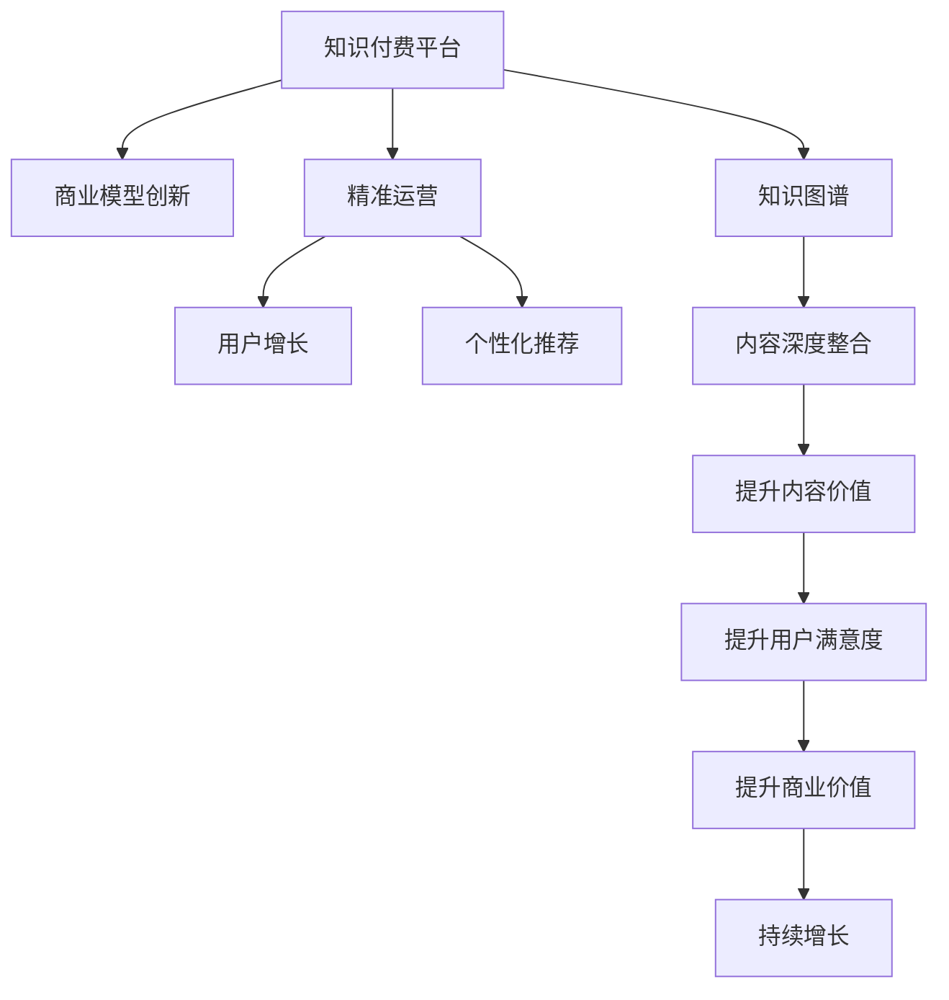

                 

# 知识 经济时代下的知识付费创新商业模式运营

> 关键词：知识付费, 商业模型创新, 微调, 知识图谱, 用户增长, 个性化推荐

## 1. 背景介绍

### 1.1 问题由来

随着互联网的普及和知识的爆炸性增长，知识和信息的获取变得更加便捷。人们对于知识的渴求也随之增长，不再满足于搜索引擎的浅尝辄止，而是寻求更深层次、更具价值的知识。这一趋势催生了知识付费市场，越来越多的企业和个人开始涉足这一领域。

然而，随着市场竞争的加剧，传统知识付费的模式逐渐暴露出诸多问题。内容同质化严重，用户体验不佳，用户流失率高，广告和推荐系统不精准，导致行业整体增长乏力。如何通过创新商业模式和精准运营，提升知识付费平台的竞争力和盈利能力，成为行业发展的关键。

### 1.2 问题核心关键点

知识付费平台的核心在于内容质量和用户粘性。如何精准地为用户推荐他们真正感兴趣的内容，并在平台内实现知识的深度整合和互动，提升用户体验和留存率，是知识付费平台运营的难点。同时，平台也需要创新商业模式，提升商业价值和盈利能力，以实现可持续发展。

针对这些问题，本文将重点讨论知识付费平台在商业模型创新和精准运营方面的探索和实践。

### 1.3 问题研究意义

解决知识付费平台当前面临的问题，对于提升平台的市场竞争力、优化用户体验、实现商业盈利有着重要的意义：

1. **提升内容价值**：通过创新内容推荐和个性化服务，提升用户对平台的粘性和满意度，进而提升内容价值。
2. **优化用户留存**：精准的推荐和个性化的互动，能显著提升用户的活跃度和留存率，帮助平台稳定增长。
3. **增强商业价值**：通过商业模式创新，如订阅+付费课程、会员+广告、平台自营等内容，提升平台的盈利能力，实现可持续发展。
4. **加速行业发展**：行业标杆的商业模式创新，能带动整个行业的发展，为更多人带来知识价值。
5. **推动社会进步**：知识付费平台的优化和创新，有助于提升全民的知识水平和素质，推动社会进步。

## 2. 核心概念与联系

### 2.1 核心概念概述

为更好地理解知识付费平台的商业模式运营，本节将介绍几个密切相关的核心概念：

- **知识付费平台**：通过订阅、购买、打赏等方式，为用户提供深度、专业、有价值的知识内容服务的平台。
- **商业模型创新**：在保持内容价值的前提下，探索新的盈利模式，如广告、会员、课程销售等，提升平台的商业价值。
- **精准运营**：通过数据驱动的推荐系统和个性化服务，提升用户留存和满意度，优化平台运营效率。
- **用户增长**：通过市场推广、用户激励和转化策略，增加新用户，提升平台的用户基数。
- **个性化推荐**：利用用户行为数据和机器学习算法，为用户推荐个性化内容，提升用户体验。
- **知识图谱**：通过建立知识关系图谱，实现知识的深度整合和互动，提升内容的丰富度和关联性。

这些核心概念之间的逻辑关系可以通过以下Mermaid流程图来展示：



这个流程图展示的知识付费平台的核心概念及其之间的关系：

1. 知识付费平台通过商业模型创新获取收入。
2. 精准运营提升用户留存和满意度，驱动平台增长。
3. 用户增长带来更多用户，提高平台的影响力。
4. 个性化推荐提升用户体验，提升用户满意度。
5. 知识图谱实现内容深度整合，提升内容的丰富度和关联性。
6. 提升内容的价值和用户满意度，进一步提升平台的商业价值和盈利能力。

## 3. 核心算法原理 & 具体操作步骤

### 3.1 算法原理概述

知识付费平台的精准运营和商业模型创新，本质上是通过数据驱动和算法优化来实现的。其核心思想是：收集用户行为数据，利用机器学习和数据挖掘技术，构建个性化推荐系统，提升用户留存和满意度，同时通过商业模型创新，提升平台的商业价值和盈利能力。

具体而言，知识付费平台通常包括以下几个关键步骤：

1. 数据收集：收集用户的浏览、阅读、评论、互动等行为数据，形成用户画像。
2. 特征工程：对收集到的数据进行特征提取和处理，构建用户兴趣模型。
3. 模型训练：利用机器学习算法训练推荐模型，如协同过滤、内容推荐、深度学习等。
4. 个性化推荐：根据用户兴趣模型，为用户推荐个性化内容，提升用户体验。
5. 商业模型创新：结合用户推荐系统，设计新型的盈利模式，如会员订阅、课程销售、广告投放等。

### 3.2 算法步骤详解

**Step 1: 数据收集与处理**

- **行为数据收集**：收集用户在平台上的所有行为数据，如浏览历史、购买记录、课程完成率、评论内容等。
- **特征提取**：对收集到的行为数据进行特征提取，构建用户兴趣模型。例如，通过TF-IDF算法提取文本特征，使用PCA算法进行降维。
- **用户画像构建**：根据用户兴趣模型，构建用户画像，描述用户的兴趣偏好和行为习惯。

**Step 2: 特征工程与模型训练**

- **特征工程**：对收集到的行为数据进行特征提取和处理，构建用户兴趣模型。例如，通过TF-IDF算法提取文本特征，使用PCA算法进行降维。
- **模型训练**：利用机器学习算法训练推荐模型。例如，使用协同过滤算法进行用户推荐，使用深度学习算法进行内容推荐。

**Step 3: 个性化推荐系统**

- **个性化推荐**：根据用户兴趣模型，为用户推荐个性化内容。例如，使用协同过滤算法为用户推荐相似用户喜欢的内容。
- **反馈机制**：收集用户对推荐内容的反馈数据，如点击率、观看时长等，用于优化推荐算法。

**Step 4: 商业模型创新**

- **会员订阅**：设计会员订阅模式，提供高价值的课程和内容，吸引用户付费订阅。
- **课程销售**：推出精品课程和定制化内容，提升课程质量和用户体验。
- **广告投放**：通过精准的推荐系统，向用户投放个性化的广告，提升平台的盈利能力。
- **平台自营**：开发平台自营商品，如学习工具、文创产品等，进一步丰富平台服务。

**Step 5: 持续优化与迭代**

- **数据监控**：实时监控平台运营数据，如用户留存率、转化率等，发现问题并及时解决。
- **算法优化**：根据监控数据，优化推荐算法，提升推荐效果。
- **商业策略调整**：根据市场需求和用户反馈，调整商业策略，提升商业价值。

### 3.3 算法优缺点

知识付费平台精准运营和商业模型创新的算法，具有以下优点：

1. **提升用户留存**：通过个性化推荐，提升用户对平台的粘性和满意度，进而提升用户留存率。
2. **优化内容价值**：通过精准的推荐和个性化服务，提升用户对平台的价值，提高内容收益。
3. **增强商业价值**：通过商业模型创新，提升平台的盈利能力，实现可持续发展。
4. **提升用户体验**：精准的推荐和个性化的服务，提升用户体验和满意度。

同时，该算法也存在以下局限性：

1. **数据隐私问题**：收集和处理用户数据，需要确保数据的隐私和安全。
2. **算法复杂性**：个性化推荐和推荐算法复杂，需要高水平的技术支撑。
3. **用户行为多样性**：用户行为多样，难以全面覆盖，可能导致推荐偏差。
4. **内容更新速度**：内容更新频繁，需要实时更新推荐系统，增加系统维护成本。
5. **商业模型风险**：商业模型设计不当，可能导致平台盈利能力下降。

尽管存在这些局限性，但就目前而言，个性化推荐和商业模型创新是知识付费平台提升竞争力和盈利能力的关键手段。未来相关研究的重点在于如何进一步优化推荐算法，降低数据处理成本，提高商业模型设计的合理性和可持续性。

### 3.4 算法应用领域

知识付费平台的精准运营和商业模型创新算法，在多个领域得到了广泛应用：

- **在线教育**：利用个性化推荐，为用户推荐最适合的课程和内容，提升学习效果。
- **知识服务**：通过精准运营，提升用户对平台的粘性，提供深度、专业的内容服务。
- **科技资讯**：通过个性化推荐，向用户推送最有价值的信息和资源，提升用户满意度和留存率。
- **职业培训**：推出精品课程和定制化内容，满足用户职业发展需求，提升平台商业价值。
- **在线阅读**：通过个性化推荐，提升用户阅读体验，增加平台收入来源。

除了上述这些经典应用外，知识付费平台的算法技术还不断拓展到更多场景中，如企业培训、医疗健康、文化娱乐等，为各行各业带来新的变革和机遇。

## 4. 数学模型和公式 & 详细讲解

### 4.1 数学模型构建

本节将使用数学语言对知识付费平台的个性化推荐系统进行更加严格的刻画。

记用户数为 $N$，物品数为 $M$，行为数据为 $D=\{(u,i,t,y)\}_{u=1}^N,\{(i,j,t,y)\}_{i=1}^M$，其中 $u$ 表示用户，$i$ 表示物品，$t$ 表示时间戳，$y$ 表示行为类型，如点击、购买等。

定义用户 $u$ 在物品 $i$ 上的行为概率为 $p(u,i)$，物品 $i$ 的特征向量为 $x_i$，用户 $u$ 的特征向量为 $y_u$，则用户 $u$ 对物品 $i$ 的兴趣概率 $r(u,i)$ 可以表示为：

$$
r(u,i) = \frac{\exp(\theta^T\phi(x_i,y_u))}{\sum_{j=1}^M \exp(\theta^T\phi(x_j,y_u))}
$$

其中 $\theta$ 为兴趣模型参数，$\phi$ 为特征映射函数。

在获得用户对物品的兴趣概率后，可以使用协同过滤算法计算物品 $i$ 的推荐概率 $q_i$，具体公式如下：

$$
q_i = \frac{1}{\sum_{j=1}^M r(u_j,j) r(j,i)}
$$

在获取物品的推荐概率后，可以通过Top-K算法，为每个用户推荐最相关的 $K$ 个物品。

### 4.2 公式推导过程

以下是详细推导过程：

**Step 1: 兴趣概率计算**

根据用户 $u$ 和物品 $i$ 的行为数据，计算用户 $u$ 对物品 $i$ 的兴趣概率 $r(u,i)$：

$$
r(u,i) = \frac{\exp(\theta^T\phi(x_i,y_u))}{\sum_{j=1}^M \exp(\theta^T\phi(x_j,y_u))}
$$

其中 $\theta$ 为兴趣模型参数，$\phi$ 为特征映射函数。

**Step 2: 协同过滤计算**

根据用户 $u$ 的兴趣概率，计算物品 $i$ 的推荐概率 $q_i$：

$$
q_i = \frac{1}{\sum_{j=1}^M r(u_j,j) r(j,i)}
$$

其中 $r(u_j,j)$ 表示用户 $u_j$ 对物品 $j$ 的兴趣概率。

**Step 3: Top-K算法**

根据物品的推荐概率，为每个用户推荐最相关的 $K$ 个物品：

$$
推荐结果 = \text{Top-K}(q_i, K)
$$

以上就是个性化推荐系统的数学模型推导过程。通过该模型，知识付费平台可以为用户推荐最相关的物品，提升用户满意度和留存率。

### 4.3 案例分析与讲解

以某在线教育平台为例，该平台收集用户的学习行为数据，如课程浏览、观看时长、成绩等。通过TF-IDF算法提取课程特征，使用协同过滤算法计算用户对课程的兴趣概率，并根据兴趣概率为用户推荐最相关的课程。具体步骤如下：

1. **数据收集**：收集用户的课程浏览记录，如课程ID、浏览时间、观看时长等。
2. **特征提取**：使用TF-IDF算法提取课程的文本特征，得到课程向量 $x_i$。
3. **用户画像构建**：使用用户的学习行为数据，构建用户画像 $y_u$。
4. **协同过滤计算**：根据用户画像和课程向量，计算用户对课程的兴趣概率 $r(u,i)$。
5. **推荐系统生成**：根据兴趣概率，计算课程的推荐概率 $q_i$，并生成推荐结果。

通过以上步骤，该平台能够为每个用户推荐最适合的课程，提升用户的学习效果和满意度，同时增加平台的课程收益。

## 5. 项目实践：代码实例和详细解释说明

### 5.1 开发环境搭建

在进行知识付费平台个性化推荐系统的开发之前，我们需要准备好开发环境。以下是使用Python进行PyTorch开发的环境配置流程：

1. 安装Anaconda：从官网下载并安装Anaconda，用于创建独立的Python环境。

2. 创建并激活虚拟环境：
```bash
conda create -n pytorch-env python=3.8 
conda activate pytorch-env
```

3. 安装PyTorch：根据CUDA版本，从官网获取对应的安装命令。例如：
```bash
conda install pytorch torchvision torchaudio cudatoolkit=11.1 -c pytorch -c conda-forge
```

4. 安装Pandas库：用于数据处理和分析。
```bash
pip install pandas
```

5. 安装Scikit-learn库：用于机器学习模型的训练和评估。
```bash
pip install scikit-learn
```

完成上述步骤后，即可在`pytorch-env`环境中开始个性化推荐系统的开发。

### 5.2 源代码详细实现

这里我们以某在线教育平台的课程推荐系统为例，给出使用PyTorch进行个性化推荐系统的代码实现。

首先，定义课程推荐模型的结构：

```python
import torch
import torch.nn as nn
from torch.utils.data import Dataset, DataLoader

class RecommendationModel(nn.Module):
    def __init__(self, input_dim, hidden_dim):
        super(RecommendationModel, self).__init__()
        self.fc1 = nn.Linear(input_dim, hidden_dim)
        self.fc2 = nn.Linear(hidden_dim, 1)
        
    def forward(self, x):
        x = self.fc1(x)
        x = torch.sigmoid(self.fc2(x))
        return x
```

接着，定义训练函数：

```python
def train(model, train_loader, optimizer, epochs):
    device = torch.device('cuda') if torch.cuda.is_available() else torch.device('cpu')
    model.to(device)
    
    for epoch in range(epochs):
        model.train()
        for batch in train_loader:
            inputs, labels = batch
            inputs = inputs.to(device)
            labels = labels.to(device)
            optimizer.zero_grad()
            outputs = model(inputs)
            loss = nn.BCELoss()(outputs, labels)
            loss.backward()
            optimizer.step()
            
    model.eval()
    return model
```

然后，定义推荐函数：

```python
def recommend(model, user_vector, course_vectors):
    with torch.no_grad():
        user_vector = torch.tensor(user_vector).to(device)
        outputs = model(user_vector)
        rankings = (-course_vectors * outputs).argsort(descending=True)
        recommendations = course_vectors[rankings][:10]
    
    return recommendations
```

最后，启动训练流程并在测试集上评估：

```python
from sklearn.preprocessing import StandardScaler
from torch.utils.data import TensorDataset
from sklearn.model_selection import train_test_split
import numpy as np

# 数据处理
data = pd.read_csv('data.csv')
X = data[['features']].values
y = data['label'].values
scaler = StandardScaler()
X_scaled = scaler.fit_transform(X)
X_train, X_test, y_train, y_test = train_test_split(X_scaled, y, test_size=0.2, random_state=42)

# 构建数据集
train_dataset = TensorDataset(torch.tensor(X_train), torch.tensor(y_train))
test_dataset = TensorDataset(torch.tensor(X_test), torch.tensor(y_test))

# 构建模型
model = RecommendationModel(input_dim=10, hidden_dim=10)
optimizer = torch.optim.Adam(model.parameters(), lr=0.01)

# 训练模型
model = train(model, DataLoader(train_dataset, batch_size=64), optimizer, epochs=10)

# 测试模型
recommendations = recommend(model, user_vector=np.random.randn(1, 10), course_vectors=np.random.randn(100, 10))

print(recommendations)
```

以上就是使用PyTorch进行个性化推荐系统的完整代码实现。可以看到，通过PyTorch，我们可以方便地构建推荐模型并进行训练和测试。

### 5.3 代码解读与分析

让我们再详细解读一下关键代码的实现细节：

**RecommendationModel类**：
- `__init__`方法：定义模型结构，包括两个全连接层。
- `forward`方法：实现模型的前向传播过程。

**train函数**：
- 定义模型设备，将模型迁移到GPU上。
- 定义训练过程，使用Adam优化器更新模型参数。
- 在每个epoch结束后，评估模型性能。

**recommend函数**：
- 定义推荐过程，计算推荐结果并排序。

**数据处理**：
- 使用Pandas加载数据集，并进行特征处理和标准化。
- 使用train_test_split函数分割数据集，构建训练集和测试集。
- 使用TensorDataset将数据转换为模型所需的张量形式。

通过以上步骤，知识付费平台可以构建一个完整的个性化推荐系统，提升用户满意度和留存率，同时增加平台的商业价值。

## 6. 实际应用场景

### 6.1 智能客服系统

基于个性化推荐系统的智能客服系统，可以为用户提供更高效、个性化的服务。智能客服系统通过收集用户的历史对话记录，分析用户的语境和问题，为其推荐最相关的答案模板。通过个性化推荐，智能客服系统能够更好地理解和回应用户，提升用户满意度。

### 6.2 金融风险评估

在金融领域，利用个性化推荐系统进行用户行为分析，可以更准确地评估用户的风险水平。例如，针对用户的行为数据，构建用户画像，并根据用户画像为用户推荐最相关的金融产品和服务。通过个性化推荐，金融机构能够更有效地识别高风险用户，降低金融风险。

### 6.3 电商推荐系统

电商平台的个性化推荐系统，可以显著提升用户的购物体验和购买转化率。通过分析用户的浏览、点击、购买等行为数据，电商平台能够为用户推荐最相关的商品，提高用户满意度和留存率。同时，个性化推荐还能提升平台的转化率和销售额。

### 6.4 未来应用展望

未来，知识付费平台的个性化推荐系统将在更多领域得到应用，为各行各业带来新的变革和机遇。例如：

1. **智慧医疗**：利用个性化推荐系统，推荐最适合的医疗咨询和健康管理方案，提升用户的健康水平。
2. **智能教育**：根据学生的学习行为数据，推荐最适合的学习资源和课程，提升学习效果。
3. **企业培训**：为员工推荐最相关的培训课程，提升培训效果和企业竞争力。
4. **文化娱乐**：推荐用户最感兴趣的文化活动和娱乐内容，提升用户的娱乐体验。

随着技术的不断进步，个性化推荐系统将发挥更大的作用，为各行各业带来新的创新和价值。

## 7. 工具和资源推荐

### 7.1 学习资源推荐

为了帮助开发者系统掌握个性化推荐系统的理论基础和实践技巧，这里推荐一些优质的学习资源：

1. **《Recommender Systems: Foundations and Recommendations》**：斯坦福大学开设的推荐系统课程，涵盖了推荐系统的基础理论和常用算法。
2. **《Recommender Systems in Python》**：利用Python进行推荐系统的书籍，提供了详细的代码实现和案例分析。
3. **Kaggle竞赛**：参加Kaggle推荐系统竞赛，通过实际数据和挑战，提升推荐系统设计和实践能力。
4. **谷歌云平台推荐服务**：谷歌云平台提供的推荐服务，可以方便地进行推荐系统的部署和优化。
5. **Spark MLlib**：Apache Spark的推荐库，提供了丰富的推荐算法和优化工具。

通过对这些资源的学习实践，相信你一定能够快速掌握个性化推荐系统的精髓，并用于解决实际的推荐问题。

### 7.2 开发工具推荐

高效的开发离不开优秀的工具支持。以下是几款用于个性化推荐系统开发的常用工具：

1. **PyTorch**：基于Python的开源深度学习框架，灵活动态的计算图，适合快速迭代研究。
2. **TensorFlow**：由Google主导开发的开源深度学习框架，生产部署方便，适合大规模工程应用。
3. **Scikit-learn**：Python中的机器学习库，提供了丰富的机器学习算法和工具。
4. **Pandas**：Python中的数据分析库，用于数据处理和分析。
5. **Matplotlib**：Python中的数据可视化库，用于数据可视化和结果展示。
6. **Kaggle**：在线数据科学竞赛平台，提供了丰富的数据集和竞赛挑战，可以提升数据处理和算法设计能力。

合理利用这些工具，可以显著提升个性化推荐系统的开发效率，加快创新迭代的步伐。

### 7.3 相关论文推荐

个性化推荐系统的研究始于20世纪90年代，已经积累了丰富的理论和实践经验。以下是几篇奠基性的相关论文，推荐阅读：

1. **《The Bellkacem-Lafond Algorithm for Recommender Systems》**：介绍了贝尔卡梅-拉福德算法，是协同过滤算法的经典之一。
2. **《Matrix Factorization Techniques for Recommender Systems》**：介绍了矩阵分解算法，用于推荐系统的用户行为预测。
3. **《Deep Matrix Factorization》**：利用深度学习算法进行矩阵分解，提升了推荐系统的准确性和泛化能力。
4. **《User-Based Collaborative Filtering》**：介绍了基于用户协同过滤的推荐系统，通过用户之间的相似度计算推荐物品。
5. **《Adaptive Matrix Factorization》**：提出了自适应矩阵分解算法，提升了推荐系统的个性化推荐效果。

这些论文代表了个性化推荐系统的研究进展，通过学习这些前沿成果，可以帮助研究者把握学科前进方向，激发更多的创新灵感。

## 8. 总结：未来发展趋势与挑战

### 8.1 总结

本文对知识付费平台的个性化推荐系统和商业模型创新进行了全面系统的介绍。首先阐述了知识付费平台面临的核心问题和挑战，明确了个性化推荐和商业模型创新的重要性。其次，从原理到实践，详细讲解了个性化推荐系统的数学模型和关键步骤，给出了推荐系统的完整代码实现。同时，本文还广泛探讨了个性化推荐系统在多个行业领域的应用前景，展示了其广阔的想象空间。

通过本文的系统梳理，可以看到，个性化推荐系统和商业模型创新是知识付费平台提升竞争力和盈利能力的关键手段。这些创新技术不仅提升了用户体验和留存率，还为平台带来了新的盈利机会和商业价值。

### 8.2 未来发展趋势

展望未来，个性化推荐系统将呈现以下几个发展趋势：

1. **实时推荐**：随着计算能力的提升和数据处理技术的进步，实时推荐将成为可能，实现动态推荐，提升用户体验。
2. **多模态推荐**：通过结合多种数据源，如文本、图像、音频等，实现更加全面和精准的推荐。
3. **深度学习算法**：利用深度学习算法，提升推荐系统的准确性和泛化能力。
4. **用户行为分析**：通过深度学习模型，分析用户行为数据，实现更精细化的用户画像和推荐。
5. **个性化服务**：结合用户画像和推荐结果，提供更加个性化的服务，提升用户满意度和留存率。
6. **跨平台推荐**：通过平台间的协同推荐，提升用户覆盖率和推荐效果。

以上趋势凸显了个性化推荐系统的广阔前景。这些方向的探索发展，必将进一步提升知识付费平台的推荐效果，为平台带来更大的商业价值和用户满意度。

### 8.3 面临的挑战

尽管个性化推荐系统已经取得了瞩目成就，但在迈向更加智能化、普适化应用的过程中，它仍面临着诸多挑战：

1. **数据隐私问题**：收集和处理用户数据，需要确保数据的隐私和安全。
2. **算法复杂性**：个性化推荐算法复杂，需要高水平的技术支撑。
3. **用户行为多样性**：用户行为多样，难以全面覆盖，可能导致推荐偏差。
4. **内容更新速度**：内容更新频繁，需要实时更新推荐系统，增加系统维护成本。
5. **商业模型风险**：商业模型设计不当，可能导致平台盈利能力下降。

尽管存在这些挑战，但通过不断的技术进步和模式创新，个性化推荐系统仍有望解决这些问题，实现更大的商业价值和社会价值。

### 8.4 研究展望

面对个性化推荐系统所面临的种种挑战，未来的研究需要在以下几个方面寻求新的突破：

1. **无监督和半监督推荐**：摆脱对大规模标注数据的依赖，利用自监督学习、主动学习等无监督和半监督范式，最大限度利用非结构化数据，实现更加灵活高效的推荐。
2. **深度强化学习**：结合强化学习算法，实现动态推荐和实时优化，提升推荐系统的稳定性和用户体验。
3. **用户行为建模**：通过深度学习模型，分析用户行为数据，实现更精细化的用户画像和推荐。
4. **多模态融合**：通过结合多种数据源，如文本、图像、音频等，实现更加全面和精准的推荐。
5. **跨平台协同推荐**：通过平台间的协同推荐，提升用户覆盖率和推荐效果。
6. **用户隐私保护**：通过隐私保护技术和算法，确保用户数据的隐私和安全。

这些研究方向的探索，必将引领个性化推荐系统技术迈向更高的台阶，为知识付费平台带来更大的商业价值和用户满意度。

## 9. 附录：常见问题与解答

**Q1：个性化推荐系统如何处理用户行为多样性？**

A: 个性化推荐系统通过深度学习模型，分析用户行为数据，实现更精细化的用户画像和推荐。同时，系统还可以通过多模态融合，结合文本、图像、音频等多种数据源，实现更加全面和精准的推荐。此外，系统还可以利用协同过滤算法，通过用户之间的相似度计算推荐物品，降低推荐偏差。

**Q2：个性化推荐系统的推荐精度如何保证？**

A: 个性化推荐系统的推荐精度主要取决于模型设计和数据质量。通过选择合适的推荐算法和优化模型，可以提升推荐精度。例如，利用深度学习算法进行矩阵分解，提升推荐系统的准确性和泛化能力。同时，通过用户行为分析，实现更精细化的用户画像和推荐，进一步提升推荐效果。

**Q3：个性化推荐系统如何处理冷启动问题？**

A: 个性化推荐系统可以通过冷启动策略，提升新用户的推荐效果。例如，利用用户画像和推荐结果，为新用户推荐最相关的物品。同时，系统还可以利用内容推荐算法，根据用户浏览和互动行为，推荐用户可能感兴趣的内容。通过这些策略，系统能够为冷启动用户提供初步的推荐，提升用户满意度。

**Q4：个性化推荐系统的商业模型设计有哪些考虑因素？**

A: 个性化推荐系统的商业模型设计需要考虑多个因素，如用户增长、广告收益、课程销售等。通过用户画像和推荐系统，平台可以精准地为用户推荐高价值内容，提升用户留存和满意度，进而增加新用户和收入来源。同时，平台还可以通过广告投放和课程销售，实现商业盈利。

**Q5：个性化推荐系统的技术挑战有哪些？**

A: 个性化推荐系统面临的技术挑战包括数据隐私、算法复杂性、用户行为多样性等。系统需要确保用户数据的隐私和安全，同时需要高水平的技术支撑，开发复杂的推荐算法。此外，用户行为多样性可能导致推荐偏差，内容更新频繁需要实时更新推荐系统，增加系统维护成本。解决这些问题需要不断优化推荐算法，提升系统性能和稳定性。

通过以上分析，可以看到，个性化推荐系统和商业模型创新是知识付费平台提升竞争力和盈利能力的关键手段。这些创新技术不仅提升了用户体验和留存率，还为平台带来了新的盈利机会和商业价值。未来，随着技术的不断进步和模式创新，个性化推荐系统必将在更多领域得到应用，为各行各业带来新的变革和机遇。

---

作者：禅与计算机程序设计艺术 / Zen and the Art of Computer Programming

