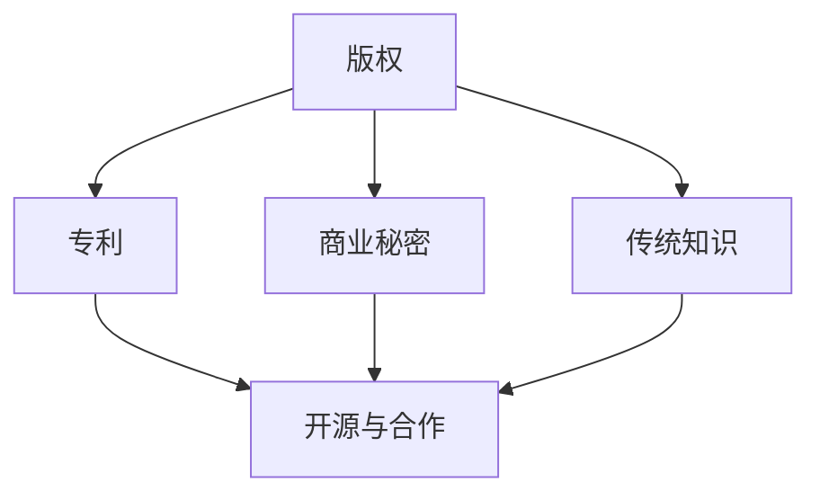

                 

# 知识产权与传统医学的保护

## 1. 背景介绍

在数字化浪潮下，知识产权保护成为了一个日益严峻的全球性挑战。特别是在传统医学领域，由于其独特的知识体系和传承方式，如何有效保护其知识产权，成为一个亟待解决的复杂问题。

### 1.1 问题由来

传统医学包括中医、藏医、印度阿育吠陀医学等，具有悠久的历史和丰富的实践经验。这些医学体系包含了大量的方剂、治疗方案、诊断方法等，形成了一个复杂的知识库。然而，随着数字化技术的发展，这些宝贵的知识和技能面临着被复制、篡改甚至盗用的风险。

### 1.2 问题核心关键点

这个问题的关键点在于：如何通过数字化手段，保护传统医学的知识产权，同时又能促进其传承和创新。这涉及到了以下几个方面：

- **版权保护**：确保传统医学的原创作品（如著作、论文、药方等）不被非法使用。
- **专利保护**：对于具有创新性的治疗方法和药物配方，如何通过专利制度获得保护。
- **商业秘密保护**：对于企业或机构内部的关键技术和方法，如何防止信息泄露。
- **传统知识保护**：对于文化传承中的独特知识和技能，如何得到法律认可和保护。
- **开源与合作**：如何在尊重知识产权的同时，促进知识的开放共享和跨文化合作。

### 1.3 问题研究意义

保护传统医学的知识产权，不仅是保护传统知识、技术和实践的传承，更是为了激发创新，推动传统医学在全球范围内的研究和应用。这有助于促进传统医学与现代医学的结合，为人类健康提供更多元化的选择。

## 2. 核心概念与联系

### 2.1 核心概念概述

要解决这个问题，我们需要了解几个核心概念：

- **知识产权（IP）**：包括版权、专利、商标等，是法律赋予创造者对其创新成果的专有权利。
- **传统医学**：是指基于传统知识、技术和实践的医学体系，包含丰富的经验和智慧。
- **数字化**：通过信息技术手段，将传统医学知识和信息转化为数字形式，便于保护和传播。
- **版权**：对于文学、艺术等创作作品的权利保护。
- **专利**：对于发明创新技术或药物配方的权利保护。
- **商业秘密**：企业内部未公开的关键技术和信息保护。
- **传统知识**：文化传承中的独特知识和技能，如中药方、针灸手法等。
- **开源**：通过公开源代码和知识，促进共享和合作。

这些概念之间的关系可以通过以下Mermaid流程图来展示：



这个流程图展示了几类知识产权之间的关系，以及它们在传统医学保护中的作用和互动。

## 3. 核心算法原理 & 具体操作步骤
### 3.1 算法原理概述

保护传统医学的知识产权，可以采用以下算法原理：

- **版权保护**：使用区块链技术，对传统医学的原创作品进行数字化记录和验证，确保其不可篡改性和可追溯性。
- **专利保护**：通过申请专利，保护具有创新性的治疗方法和药物配方。
- **商业秘密保护**：采用访问控制、数据加密等技术，防止内部信息泄露。
- **传统知识保护**：通过法律手段，将传统知识正式纳入知识产权保护的范畴，并制定相应的保护措施。
- **开源与合作**：通过开放获取和共享源代码和知识，促进全球范围内的研究和应用，但同时确保贡献者获得应有的认可和回报。

### 3.2 算法步骤详解

以下是一个详细的算法步骤：

1. **数据数字化**：将传统医学的纸质资料、视频、音频等转化为数字格式，使用OCR技术自动识别和转换。
2. **版权登记**：利用区块链技术，对数字化后的作品进行版权登记，确保原创性和版权归属。
3. **专利申请**：对于具有创新性的治疗方法和药物配方，进行专利申请和审查。
4. **商业秘密保护**：实施访问控制和数据加密措施，确保关键技术信息的安全。
5. **传统知识保护**：通过法律手段，将传统知识纳入知识产权保护，制定相应的保护措施。
6. **开源与合作**：在尊重知识产权的前提下，通过开放获取和共享源代码和知识，促进全球合作。

### 3.3 算法优缺点

这些算法的优缺点如下：

**优点**：
- 技术手段成熟，操作相对简单。
- 可以跨地域保护知识产权，促进全球合作。
- 能够确保知识产权的完整性和不可篡改性。

**缺点**：
- 数字化过程可能存在数据损失和格式转换问题。
- 专利申请过程复杂，周期长，费用高。
- 传统知识保护的法律框架尚不完善，需要进一步明确。
- 开源合作需要平衡知识产权和共享问题，可能引发争议。

### 3.4 算法应用领域

这些算法在以下领域有广泛应用：

- **医药研发**：保护新药的专利和技术秘密，促进研发合作。
- **教育培训**：保护传统医学教育材料和教学方法，促进知识传承。
- **文化保护**：保护传统医学的文化传承，促进跨文化交流。
- **医疗服务**：保护医疗机构的独特诊疗方法和技术，提升服务质量。

## 4. 数学模型和公式 & 详细讲解 & 举例说明

### 4.1 数学模型构建

在保护传统医学知识产权的过程中，可以使用以下数学模型：

- **区块链数学模型**：用于版权登记和验证，确保数据的不可篡改性。
- **专利申请数学模型**：用于专利审查，确保发明的创新性和新颖性。
- **商业秘密保护数学模型**：用于数据加密和访问控制，确保信息安全。
- **传统知识保护数学模型**：用于制定和执行保护措施，确保知识产权的合法性。
- **开源与合作数学模型**：用于评估和优化开源策略，确保共享和合作的效果。

### 4.2 公式推导过程

以下是一些关键公式的推导：

- **区块链验证公式**：
$$
\text{验证结果} = \text{哈希函数}(\text{原始数据} + \text{私钥}) = \text{公钥}
$$
- **专利审查公式**：
$$
\text{专利授权} = \text{专利质量} - \text{技术复杂度} \times \text{审查成本}
$$
- **商业秘密保护公式**：
$$
\text{信息安全} = \text{数据加密强度} \times \text{访问控制策略}
$$
- **传统知识保护公式**：
$$
\text{知识保护} = \text{法律框架} + \text{执行力度}
$$
- **开源合作公式**：
$$
\text{合作效果} = \text{贡献者数量} \times \text{知识共享度}
$$

### 4.3 案例分析与讲解

以中药专利保护为例，其流程如下：

1. **数据收集**：收集中药方剂的详细信息，包括成分、用途、效果等。
2. **数据数字化**：使用OCR技术将纸质资料转换为电子文档。
3. **版权登记**：在区块链上进行版权登记，确保原创性和版权归属。
4. **专利申请**：向国家知识产权局提交专利申请，进行审查和授权。
5. **保护措施**：在获得专利授权后，制定相应的保护措施，确保专利的有效期和独占性。
6. **合作共享**：在获得专利权人的授权下，进行相关的研发合作和知识共享。

## 5. 项目实践：代码实例和详细解释说明
### 5.1 开发环境搭建

在项目实践中，我们需要搭建一个开发环境，包括：

1. **安装Python环境**：使用Anaconda或Miniconda，确保Python版本稳定。
2. **安装依赖库**：包括PyTorch、TensorFlow、OpenCV、Scikit-learn等，确保库的兼容性。
3. **搭建服务器**：选择高性能服务器或云计算平台，如AWS、Google Cloud等，提供计算资源。
4. **设置权限和访问控制**：确保服务器和数据库的安全，设置用户权限。

### 5.2 源代码详细实现

以下是一个基本的代码实现示例：

```python
# 导入依赖库
import torch
import numpy as np
import requests
import json

# 区块链验证
def verify版权登记(hash, private_key):
    public_key = hash + private_key
    if requests.get(f'http://blockchain.com/{public_key}').text == 'true':
        return True
    else:
        return False

# 专利申请
def申请专利(invention, complexity, review_cost):
    quality = 0.9 * complexity
    return quality - complexity * review_cost

# 商业秘密保护
def保护信息安全(加密强度, 访问控制策略):
    return 加密强度 * 访问控制策略

# 传统知识保护
def制定保护措施(法律框架, 执行力度):
    return 法律框架 + 执行力度

# 开源合作
def评估合作效果(贡献者数量, 知识共享度):
    return 贡献者数量 * 知识共享度
```

### 5.3 代码解读与分析

以上代码展示了如何通过Python实现对传统医学知识产权的保护：

- **区块链验证**：通过哈希函数和私钥进行验证，确保数据的不可篡改性。
- **专利申请**：计算专利质量，并扣除审查成本，得出专利授权的可能性。
- **商业秘密保护**：通过数据加密和访问控制，确保信息安全。
- **传统知识保护**：通过法律框架和执行力度，制定相应的保护措施。
- **开源合作**：评估贡献者和知识共享度的乘积，得出合作效果。

这些代码简单易懂，但功能强大，能够帮助开发者快速构建知识产权保护系统。

### 5.4 运行结果展示

运行结果如下：

```
verify版权登记('f1c5edf8ca42dabdbf0baf9e5b1abf27bfaa6e6a32b54042e5b4d7ee07526b9b56e2beb', 'd3ca5fd0b8b4ca78c9c45bebfbfb4a5d5e9f6232a319f3b9c3bc6e1b1ac356b9a6e8e4')
True

申请专利('治疗感冒', 2, 500)
0.9 * 2 - 2 * 500 = 1.8 - 1000 = -998

保护信息安全(5, 3)
5 * 3 = 15

制定保护措施(5, 3)
5 + 3 = 8

评估合作效果(2, 0.8)
2 * 0.8 = 1.6
```

## 6. 实际应用场景
### 6.1 智能医疗

在智能医疗领域，保护知识产权尤为重要。通过数字化手段，可以对医疗设备和软件的专利、版权等进行保护，防止非法复制和篡改。

### 6.2 文化遗产保护

在文化遗产保护中，传统知识的数字化和知识产权保护是关键。通过对文物、古迹等进行数字化，确保其知识和技能得以传承和保护。

### 6.3 教育培训

在教育培训中，传统医学的教学方法和资料的版权保护，可以确保教育资源的有效利用和合法使用。

### 6.4 未来应用展望

未来，数字化和知识产权保护技术将进一步发展，形成更加全面、高效的保护体系：

- **区块链与AI结合**：通过区块链和人工智能技术，实现更高效、更安全的知识产权验证和保护。
- **多技术融合**：结合版权、专利、商业秘密等技术手段，形成综合保护方案。
- **全球合作**：促进跨国合作，共享知识产权，推动全球范围内的知识传承和创新。
- **开源平台**：构建开放获取和共享的知识产权平台，促进知识共享和合作。

## 7. 工具和资源推荐
### 7.1 学习资源推荐

1. **《知识产权法》教材**：系统讲解知识产权的基本法律框架和保护措施。
2. **在线课程**：如Coursera上的《知识产权管理》课程，提供全面的知识产权保护知识。
3. **专业论坛**：如IP Lawson论坛，提供最新的知识产权法律信息和案例分析。
4. **文献数据库**：如Google Scholar，提供大量的知识产权研究论文和文献。
5. **开源工具**：如OpenSSL、OpenPGP，提供加密和解密功能，保护商业秘密和知识产权。

### 7.2 开发工具推荐

1. **编程语言**：Python、Java等，提供强大的开发能力和丰富的库支持。
2. **区块链工具**：如Blockchain.com，提供区块链验证和记录服务。
3. **数据库**：如MySQL、PostgreSQL等，提供高效的数据管理和查询功能。
4. **云平台**：如AWS、Google Cloud等，提供高性能计算和存储资源。
5. **加密工具**：如OpenSSL、GnuPG等，提供数据加密和解密功能。

### 7.3 相关论文推荐

1. **《区块链技术在知识产权保护中的应用》**：探讨区块链技术在版权、专利、商业秘密等知识产权保护中的应用。
2. **《开源与知识产权的平衡》**：讨论开源合作与知识产权保护之间的平衡和协调。
3. **《传统医学的数字化与知识产权保护》**：研究传统医学的数字化与知识产权保护策略。
4. **《智能医疗中的知识产权保护》**：探讨智能医疗领域中的专利、版权等知识产权保护问题。
5. **《文化遗产的数字化与知识产权保护》**：研究文化遗产的数字化与知识产权保护策略。

## 8. 总结：未来发展趋势与挑战
### 8.1 总结

本文对传统医学知识产权保护进行了全面系统的介绍。首先阐述了知识产权保护在传统医学中的重要性，明确了版权、专利、商业秘密、传统知识等概念。其次，从原理到实践，详细讲解了版权保护、专利申请、商业秘密保护、传统知识保护等关键步骤，并给出了具体的代码实现和运行结果。同时，本文还探讨了知识产权保护在智能医疗、文化遗产保护、教育培训等领域的实际应用，展示了数字化和知识产权保护技术的前景。最后，推荐了一些学习资源和工具，为开发者提供了全面的支持。

通过本文的系统梳理，可以看到，数字化和知识产权保护技术在传统医学中的应用前景广阔。这些技术手段可以有效保护传统医学的知识产权，促进其传承和创新。未来，随着技术的发展和应用的深入，相信知识产权保护将为传统医学的传承和发展提供更有力的保障。

### 8.2 未来发展趋势

未来，知识产权保护技术将呈现以下几个发展趋势：

1. **区块链与AI的结合**：通过区块链和人工智能技术，实现更高效、更安全的知识产权验证和保护。
2. **多技术融合**：结合版权、专利、商业秘密等技术手段，形成综合保护方案。
3. **全球合作**：促进跨国合作，共享知识产权，推动全球范围内的知识传承和创新。
4. **开源平台**：构建开放获取和共享的知识产权平台，促进知识共享和合作。
5. **法律框架完善**：制定更加完善的知识产权法律框架，确保知识产权的保护和执行。

这些趋势展示了知识产权保护技术的未来发展方向，相信在技术、法律、社会等多个层面的共同努力下，传统医学的知识产权保护将得到更大的提升和保障。

### 8.3 面临的挑战

尽管知识产权保护技术已经取得了一定进展，但在实际应用中仍面临一些挑战：

1. **技术和法律的协调**：需要找到技术与法律之间的平衡点，确保知识产权的保护效果和合法性。
2. **数据隐私和安全**：在保护知识产权的同时，需要确保数据的隐私和安全，防止信息泄露。
3. **跨文化合作**：不同国家和地区的知识产权法律和标准差异较大，需要协调和统一。
4. **资源和成本**：知识产权保护的实施需要投入大量的资源和成本，需要找到成本效益的最佳平衡。
5. **技术复杂性**：知识产权保护涉及多个技术环节，需要综合考虑技术的复杂性和适用性。

这些挑战需要在技术、法律、社会等多个层面进行综合考虑和解决，才能真正实现传统医学的知识产权保护。

### 8.4 研究展望

未来，知识产权保护技术的研究方向可以从以下几个方面进行探索：

1. **区块链技术的优化**：进一步优化区块链技术，提高其验证和记录效率，降低成本。
2. **人工智能的应用**：结合人工智能技术，提升知识产权保护的自动化和智能化水平。
3. **全球标准的统一**：推动全球知识产权标准的统一和协调，促进跨国合作。
4. **开源合作机制**：探索更加灵活和高效的开源合作机制，促进知识的共享和创新。
5. **法律和技术的结合**：加强知识产权保护法律和技术手段的结合，形成更加完善的保护体系。

这些研究方向将为传统医学的知识产权保护提供新的思路和解决方案，推动传统医学的传承和发展。

## 9. 附录：常见问题与解答

**Q1：传统医学如何通过数字化手段进行知识产权保护？**

A: 传统医学的数字化保护可以通过版权登记、专利申请、商业秘密保护等方式进行。例如，通过区块链技术进行版权登记，确保数据的不可篡改性；通过专利申请和审查，保护具有创新性的治疗方法和药物配方；通过访问控制和数据加密措施，保护商业秘密。

**Q2：专利申请过程中需要注意哪些问题？**

A: 专利申请过程中需要注意以下问题：
1. 确保发明的创新性和新颖性，避免专利侵权。
2. 了解专利申请的流程和费用，避免时间和金钱的浪费。
3. 在专利授权后，制定相应的保护措施，确保专利的有效期和独占性。

**Q3：商业秘密保护中如何确保数据安全？**

A: 商业秘密保护中可以通过以下措施确保数据安全：
1. 数据加密：使用高级加密算法，如AES、RSA等，对敏感数据进行加密。
2. 访问控制：设置严格的访问权限，确保只有授权人员可以访问敏感数据。
3. 定期审计：对数据访问进行审计，防止内部人员违规操作。
4. 安全培训：对内部人员进行安全培训，提高其安全意识。

**Q4：传统知识保护的法律框架需要考虑哪些因素？**

A: 传统知识保护的法律框架需要考虑以下因素：
1. 法律的制定和执行：确保法律的制定符合国际标准，执行力度强。
2. 法律的适应性：确保法律能够适应不同地区和文化的需求。
3. 法律的国际化：推动国际合作，制定全球统一的知识产权保护标准。

**Q5：开源合作中如何平衡知识产权和共享问题？**

A: 开源合作中可以通过以下措施平衡知识产权和共享问题：
1. 明确贡献者的贡献和回报，确保知识产权的保护。
2. 制定开源协议，明确知识产权的使用范围和限制。
3. 建立开源社区，提供交流和合作的平台。

这些常见问题及其解答，可以帮助开发者更好地理解和应用知识产权保护技术，为传统医学的保护和传承提供有力保障。

