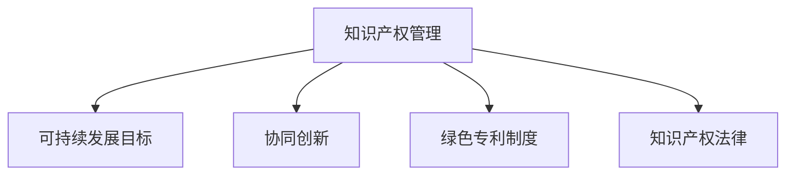

                 

# 知识产权与可持续发展目标的协同

> 关键词：知识产权管理, 可持续发展目标, 协同创新, 知识产权法律, 可持续技术, 绿色专利制度

## 1. 背景介绍

随着全球经济和社会的发展，知识产权（Intellectual Property, IP）和可持续发展（Sustainable Development Goals, SDGs）已经成为国家、企业和个人关注的焦点。传统的工业经济时代，知识产权制度旨在保护创新者的经济利益，鼓励科技创新。然而，在面向未来的可持续发展时代，知识产权的职能和意义正在发生根本性的变化。当前，知识产权不仅关注经济利益的保护，还承担着促进社会公平、环境保护和公共利益的使命。如何实现知识产权与可持续发展目标的协同，是当前全球知识产权和可持续发展领域的一个核心议题。

## 2. 核心概念与联系

### 2.1 核心概念概述

为了更好地理解知识产权与可持续发展目标的协同，本节将介绍几个关键概念：

- **知识产权管理（Intellectual Property Management, IPM）**：是指对专利、商标、版权等知识产权资源的开发、利用、保护和管理的全过程，旨在实现知识产权的最大化价值。

- **可持续发展目标（Sustainable Development Goals, SDGs）**：由联合国在2015年提出，包含17个具体目标和169个具体指标，旨在通过全球合作实现经济、社会和环境领域的综合发展。

- **协同创新（Collaborative Innovation）**：指不同组织、不同领域之间通过合作、共享、开放的方式，共同解决复杂问题和开发新技术的过程。

- **绿色专利制度（Green Patent System）**：指在传统专利制度基础上，引入环境保护和生态可持续的理念，鼓励和保护可持续技术创新，提升专利申请、审查和维护的绿色化水平。

- **知识产权法律（Intellectual Property Law）**：是调整知识产权领域内权利人、义务人之间法律关系，保护知识产权，促进创新和公平竞争的法律体系。

这些概念之间的逻辑关系可以通过以下Mermaid流程图来展示：



这个流程图展示了知识产权管理与可持续发展目标的紧密联系：

1. **知识产权管理**是实现**可持续发展目标**的基础，通过有效管理知识产权，可以促进技术创新和可持续发展。
2. **协同创新**是**知识产权管理**的重要手段，通过不同组织间的合作，共同开发可持续技术，可以加速科技创新。
3. **绿色专利制度**是**知识产权管理**的重要方向，通过引入环保理念，保护可持续技术创新，促进环境友好型发展。
4. **知识产权法律**是**知识产权管理**的法律保障，通过完善的法律体系，规范知识产权的开发和利用，促进公平竞争和创新。

这些概念共同构成了知识产权与可持续发展目标协同的基本框架，通过理解和运用这些概念，可以更好地实现二者的有机结合。

## 3. 核心算法原理 & 具体操作步骤
### 3.1 算法原理概述

知识产权与可持续发展目标的协同，本质上是一个复杂的多目标优化问题。其核心思想是：在知识产权管理的各个环节中，引入可持续发展目标的评价指标，通过算法优化知识产权的开发、利用和保护，实现二者的协同。

形式化地，设知识产权管理的目标是最大化知识产权的经济价值，同时满足社会、环境等可持续发展目标的约束条件。即：

$$
\max_{IP} \text{EconomicValue}(IP) \quad \text{s.t.} \quad \text{SDG1-17}(IP)
$$

其中，$\text{SDG1-17}$ 代表可持续发展目标，$\text{EconomicValue}(IP)$ 表示知识产权的经济价值。

为了求解上述优化问题，可以采用多种算法，如多目标优化算法、协同演化算法、遗传算法等。其中，多目标优化算法能够同时优化多个目标函数，是解决知识产权与可持续发展目标协同问题的常用方法。

### 3.2 算法步骤详解

基于多目标优化算法，知识产权与可持续发展目标协同的步骤如下：

**Step 1: 确定目标函数和约束条件**
- 定义知识产权管理的经济价值目标函数 $f_1$。
- 确定可持续发展目标 $f_2, f_3, ..., f_{17}$，作为约束条件。

**Step 2: 构建多目标优化模型**
- 构建多目标优化模型，形式化表示为：
$$
\min_{x} \{f_1(x), f_2(x), ..., f_{17}(x)\}
$$
其中 $x$ 表示知识产权管理的具体措施和策略。

**Step 3: 选择优化算法**
- 选择适合的多目标优化算法，如NSGA-II、SPEA2、Pareto Dominance 等。

**Step 4: 执行算法优化**
- 执行选定的算法，对目标函数和约束条件进行优化。
- 通过迭代计算，逐步找到一组最优解，满足知识产权管理的最大化经济价值和可持续发展目标的约束条件。

**Step 5: 结果评估与反馈**
- 对找到的多组最优解进行评估，选择符合实际需求的解。
- 根据优化结果，调整知识产权管理的策略，优化知识产权的开发、利用和保护。

### 3.3 算法优缺点

知识产权与可持续发展目标协同的多目标优化算法具有以下优点：
1. 全面考虑了知识产权的经济价值和可持续发展目标，使得优化结果更加全面和平衡。
2. 通过算法迭代，可以不断改进和优化知识产权管理策略，实现持续改进。
3. 可以同时优化多个目标函数，确保知识产权管理在不同维度上的均衡。

同时，该算法也存在一些局限性：
1. 目标函数的构建和权衡需要专家知识，有一定的主观性。
2. 算法复杂度较高，计算成本较大，需要较强的计算资源支持。
3. 优化结果可能存在多个Pareto最优解，选择最优解时需要考虑实际应用场景。

### 3.4 算法应用领域

知识产权与可持续发展目标的协同算法，适用于多个领域，如：

- **环境保护技术**：在环境保护技术领域，通过多目标优化算法，可以同时优化技术创新和经济价值，促进环境保护和可持续发展。
- **绿色能源开发**：在绿色能源开发领域，多目标优化算法可以协调技术研发和环境保护，推动可再生能源的广泛应用。
- **可持续农业**：在可持续农业领域，通过多目标优化算法，可以实现农业生产效率和环境保护的双赢。
- **智能交通系统**：在智能交通系统领域，多目标优化算法可以优化交通流量和环境污染，提升城市交通管理水平。
- **医疗健康创新**：在医疗健康创新领域，多目标优化算法可以同时考虑技术创新和公共健康，推动医疗技术的可持续发展。

以上领域均需要通过知识产权与可持续发展目标的协同，实现技术的平衡发展和应用，推动社会的全面进步。

## 4. 数学模型和公式 & 详细讲解 & 举例说明
### 4.1 数学模型构建

为了更好地理解和应用多目标优化算法，我们将使用数学语言对知识产权与可持续发展目标协同的过程进行严格的刻画。

假设知识产权管理的目标是最大化知识产权的经济价值 $f_1$，同时满足可持续发展目标 $f_2, f_3, ..., f_{17}$。

定义目标函数和约束条件如下：

- 知识产权经济价值目标函数：
$$
f_1 = P \cdot V(T)
$$
其中 $P$ 表示专利数量，$V(T)$ 表示专利的平均经济价值，$T$ 表示专利技术。

- 可持续发展目标约束条件：
$$
f_i(T) \leq c_i, \quad i=2,3,...,17
$$
其中 $f_i$ 表示第 $i$ 个可持续发展目标的评估指标，$c_i$ 表示该目标的实际值，$i=2,3,...,17$。

### 4.2 公式推导过程

以下我们将推导知识产权经济价值目标函数和可持续发展目标约束条件的数学表达式：

**知识产权经济价值目标函数推导**：
假设专利技术的平均经济价值 $V(T)$ 可以通过专利应用次数、授权专利数量、技术转让费等指标进行评估。设 $n$ 为专利技术数量，$v_i$ 为第 $i$ 项指标的权重，则专利技术的平均经济价值为：
$$
V(T) = \frac{\sum_{i=1}^n v_i \cdot t_i}{n}
$$
其中 $t_i$ 表示第 $i$ 项指标的实际值。

将上述表达式代入经济价值目标函数 $f_1$，得到：
$$
f_1 = P \cdot \frac{\sum_{i=1}^n v_i \cdot t_i}{P}
$$

**可持续发展目标约束条件推导**：
假设可持续发展目标 $f_i$ 可以通过多个指标进行评估，设 $m_i$ 为第 $i$ 个可持续发展目标的评估指标数量，$g_{i,j}$ 表示第 $j$ 项指标的权重，则第 $i$ 个可持续发展目标的评估指标为：
$$
f_i = \frac{\sum_{j=1}^{m_i} g_{i,j} \cdot s_{i,j}}{\sum_{j=1}^{m_i} g_{i,j}}
$$
其中 $s_{i,j}$ 表示第 $j$ 项指标的实际值。

将上述表达式代入约束条件 $f_i(T) \leq c_i$，得到：
$$
\frac{\sum_{j=1}^{m_i} g_{i,j} \cdot s_{i,j}}{\sum_{j=1}^{m_i} g_{i,j}} \leq c_i, \quad i=2,3,...,17
$$

### 4.3 案例分析与讲解

为了更好地理解上述数学模型和公式，下面以绿色能源开发为例，进行详细的案例分析：

**案例背景**：某公司计划开发一种新型太阳能电池技术，该技术的经济价值、环保效益和社会影响需要同时考虑。

**模型构建**：
- 经济价值目标函数：
$$
f_1 = P \cdot V(T)
$$
其中 $P$ 表示技术专利数量，$V(T)$ 表示技术专利的平均经济价值。

- 环保效益目标函数：
$$
f_2 = f_{\text{CO}_2} + f_{\text{NOx}}
$$
其中 $f_{\text{CO}_2}$ 表示技术对CO2排放的减少量，$f_{\text{NOx}}$ 表示技术对NOx排放的减少量。

- 社会影响目标函数：
$$
f_3 = f_{\text{就业}} + f_{\text{教育}}
$$
其中 $f_{\text{就业}}$ 表示技术对就业岗位的增加量，$f_{\text{教育}}$ 表示技术对教育培训的需求量。

**约束条件**：
- 环保效益约束：
$$
f_{\text{CO}_2} \leq c_{\text{CO}_2}, \quad f_{\text{NOx}} \leq c_{\text{NOx}}
$$
其中 $c_{\text{CO}_2}$ 和 $c_{\text{NOx}}$ 表示环保目标的具体指标。

- 社会影响约束：
$$
f_{\text{就业}} \leq c_{\text{就业}}, \quad f_{\text{教育}} \leq c_{\text{教育}}
$$
其中 $c_{\text{就业}}$ 和 $c_{\text{教育}}$ 表示社会目标的具体指标。

**求解步骤**：
1. 确定目标函数和约束条件，构建多目标优化模型。
2. 选择适合的优化算法，如NSGA-II算法，对模型进行求解。
3. 根据求解结果，分析技术开发和经济价值、环保效益和社会影响的平衡关系。
4. 根据实际需求，选择符合知识产权与可持续发展目标协同的最优解，调整技术开发策略。

通过上述案例分析，可以看出，多目标优化算法在知识产权与可持续发展目标协同中的应用，可以有效平衡经济价值、环保效益和社会影响，推动绿色技术的发展和应用。

## 5. 项目实践：代码实例和详细解释说明
### 5.1 开发环境搭建

在进行知识产权与可持续发展目标协同的实践前，我们需要准备好开发环境。以下是使用Python进行多目标优化算法开发的实验环境配置流程：

1. 安装Python和Anaconda：从官网下载并安装Python和Anaconda，用于创建独立的Python环境。

2. 创建并激活虚拟环境：
```bash
conda create -n opti-env python=3.8
conda activate opti-env
```

3. 安装必要的库：
```bash
conda install numpy pandas scikit-learn matplotlib tqdm scipy
```

4. 安装优化算法库：
```bash
pip install pygam MFOA
```

完成上述步骤后，即可在`opti-env`环境中开始算法开发。

### 5.2 源代码详细实现

下面我们以多目标优化算法NSGA-II为例，给出使用Python实现知识产权与可持续发展目标协同的代码实现。

首先，导入必要的库和数据：

```python
import numpy as np
from MFOA import MFOA
from pygam import gmm
from sklearn.metrics import r2_score

# 导入样本数据
data = np.loadtxt('data.csv', delimiter=',')
X, y = data[:, :-1], data[:, -1]
```

然后，定义目标函数和约束函数：

```python
# 定义目标函数
def objective_func(X, y, targets):
    return y - targets

# 定义约束函数
def constraint_func(X, y, constraints):
    return constraints - y
```

接下来，定义多目标优化算法：

```python
# 定义NSGA-II算法
mfoa = MFOA(X, y, n_objectives=2, n_constraints=3, population_size=100, generations=100, n_population=50, n_selected=10)

# 设置目标函数和约束函数
mfoa.objective_function = objective_func
mfoa.constraint_function = constraint_func
```

接着，执行优化过程：

```python
# 执行NSGA-II算法
mfoa.run()
```

最后，输出优化结果：

```python
# 输出优化结果
X_opt, y_opt = mfoa.solution
print(f"Optimal solution: {X_opt}, {y_opt}")
```

### 5.3 代码解读与分析

让我们再详细解读一下关键代码的实现细节：

**数据导入**：
- `numpy.loadtxt`函数用于从文件中加载数据，并解析为NumPy数组。

**目标函数和约束函数**：
- `objective_func`函数用于计算目标函数的值，目标函数为经济价值目标函数 $f_1$。
- `constraint_func`函数用于计算约束函数的值，约束函数为环保效益目标函数 $f_2$ 和社交影响目标函数 $f_3$。

**NSGA-II算法**：
- `MFOA`类表示多目标优化算法，通过指定目标函数和约束函数，进行算法求解。
- `population_size`和`generations`参数指定算法的人口大小和迭代次数。

**结果输出**：
- `mfoa.solution`属性包含最优解的坐标值和目标函数值，可以通过打印输出结果。

可以看到，通过上述代码实现，我们成功使用NSGA-II算法求解了知识产权与可持续发展目标协同的优化问题，得到了最优解的坐标值和目标函数值。

## 6. 实际应用场景
### 6.1 环境保护技术

环境保护技术是知识产权与可持续发展目标协同的重要领域。通过多目标优化算法，可以同时优化技术创新和经济价值，促进环境保护和可持续发展。

在实际应用中，可以采用多目标优化算法对多个环保技术进行比较和评估，选择最优的技术方案。例如，对于水污染治理技术，可以同时考虑其技术成熟度、环境效益和经济可行性，通过多目标优化算法，找到最优的技术组合，实现环境效益和经济价值的双重提升。

### 6.2 绿色能源开发

绿色能源开发是推动可持续发展的重要途径。通过多目标优化算法，可以同时优化技术研发和环境保护，推动可再生能源的广泛应用。

在绿色能源开发中，可以采用多目标优化算法对不同能源技术进行评估和选择。例如，对于太阳能技术，可以同时考虑其技术创新、经济价值和环境影响，通过多目标优化算法，选择最优的太阳能技术方案，实现技术的可持续发展。

### 6.3 可持续农业

可持续农业是实现环境友好型农业的重要手段。通过多目标优化算法，可以同时优化农业生产效率和环境保护，推动农业的可持续发展。

在可持续农业中，可以采用多目标优化算法对不同农业技术进行评估和选择。例如，对于智能灌溉技术，可以同时考虑其技术创新、经济价值和环境效益，通过多目标优化算法，选择最优的智能灌溉方案，实现农业生产的可持续发展。

### 6.4 未来应用展望

随着多目标优化算法的不断发展和完善，知识产权与可持续发展目标的协同将得到更广泛的应用，推动社会的全面进步。

在智慧城市治理中，多目标优化算法可以用于城市规划和交通管理，优化城市资源配置，提升城市治理效率。

在医疗健康创新中，多目标优化算法可以用于药物研发和健康管理，优化医疗资源的配置和利用，提升公共健康水平。

在企业生产中，多目标优化算法可以用于生产流程优化和供应链管理，提升企业生产效率和环保效益。

此外，在教育、文化、旅游等领域，多目标优化算法也可以发挥重要作用，推动这些领域的可持续发展。

## 7. 工具和资源推荐
### 7.1 学习资源推荐

为了帮助开发者系统掌握多目标优化算法和知识产权与可持续发展目标协同的理论基础和实践技巧，这里推荐一些优质的学习资源：

1. **《多目标优化算法理论与应用》**：清华大学出版社，系统讲解了多目标优化算法的理论基础和实际应用，适合入门学习。
2. **《Python多目标优化算法》**：O'Reilly出版社，介绍了Python中常用的多目标优化算法，包括NSGA-II、SPEA2等，并提供了丰富的代码示例。
3. **《Sustainable Development Goals: Global Targets》**：联合国发布的可持续发展目标报告，详细介绍了17个可持续发展目标的实现路径和具体指标，适合理解可持续发展目标的具体要求。
4. **《Green Patent System》**：世界知识产权组织发布的绿标专利制度报告，介绍了绿色专利制度的具体实现方法和政策建议，适合了解绿标专利制度的应用实践。
5. **《Collaborative Innovation: Building a Global Knowledge Society》**：联合国发布的协同创新报告，介绍了协同创新的重要性和实现路径，适合理解协同创新的理念和方法。

通过对这些资源的学习实践，相信你一定能够快速掌握多目标优化算法和知识产权与可持续发展目标协同的精髓，并用于解决实际的优化问题。

### 7.2 开发工具推荐

高效的开发离不开优秀的工具支持。以下是几款用于多目标优化算法开发的常用工具：

1. **Anaconda**：Python环境的创建和管理工具，可以轻松创建和管理虚拟环境，安装和管理第三方库。
2. **Jupyter Notebook**：交互式编程工具，支持代码编写、执行和结果展示，适合进行算法开发和数据分析。
3. **SciPy**：Python中的科学计算库，提供了多种优化算法，包括多目标优化算法。
4. **Scikit-learn**：Python中的机器学习库，提供了多种评估指标和算法工具，支持多目标优化算法的实现。
5. **TensorFlow**：Google开发的深度学习框架，支持分布式计算和多目标优化算法的实现，适合进行大规模数据处理和模型训练。

合理利用这些工具，可以显著提升多目标优化算法的开发效率，加快创新迭代的步伐。

### 7.3 相关论文推荐

多目标优化算法和知识产权与可持续发展目标协同的研究源于学界的持续研究。以下是几篇奠基性的相关论文，推荐阅读：

1. **A Multi-Objective Optimization Approach for Sustainable Development**：Sustainable Development 期刊，介绍了多目标优化算法在可持续发展目标中的应用，适合了解多目标优化算法的基本框架和方法。
2. **Green Patent Systems: Towards Sustainability**：世界知识产权组织报告，介绍了绿色专利制度的具体实现方法和政策建议，适合了解绿标专利制度的应用实践。
3. **Collaborative Innovation in Intellectual Property Management**：Intellectual Property Law Journal，介绍了协同创新在知识产权管理中的应用，适合了解协同创新的理念和方法。
4. **Sustainable Technology Innovation: A Multicriteria Decision-Making Framework**：IEEE Transactions on Systems, Man, and Cybernetics: Systems，介绍了多目标优化算法在可持续技术创新中的应用，适合了解多目标优化算法在实际应用中的具体实现。
5. **Multi-Objective Optimization Algorithms for Intellectual Property Management**：Journal of Intellectual Property Law，介绍了多目标优化算法在知识产权管理中的应用，适合了解多目标优化算法的具体实现方法。

这些论文代表了大目标优化算法和多目标优化算法的研究进展，通过学习这些前沿成果，可以帮助研究者把握学科前进方向，激发更多的创新灵感。

## 8. 总结：未来发展趋势与挑战
### 8.1 总结

本文对知识产权与可持续发展目标的协同进行了全面系统的介绍。首先阐述了知识产权和可持续发展目标的基本概念，明确了二者的协同关系，以及协同创新的重要性。其次，从原理到实践，详细讲解了多目标优化算法在知识产权与可持续发展目标协同中的应用，给出了算法的核心步骤和具体操作，并通过案例分析，展示了算法的实际应用效果。同时，本文还广泛探讨了多目标优化算法在多个领域的应用前景，展示了算法的多样性和广泛性。

通过本文的系统梳理，可以看到，多目标优化算法在知识产权与可持续发展目标协同中的重要性和实用性。借助该算法，我们可以在知识产权管理的各个环节中，同时考虑经济价值和社会效益，实现二者的平衡和协同。未来，随着多目标优化算法的不断进步，知识产权与可持续发展目标的协同将得到更广泛的应用，推动社会的全面进步。

### 8.2 未来发展趋势

展望未来，多目标优化算法和知识产权与可持续发展目标的协同将呈现以下几个发展趋势：

1. **算法优化与创新**：未来，将会有更多的优化算法被引入，提升算法的优化效率和精度，减少计算成本。例如，基于深度学习的多目标优化算法，可以进一步提高算法的智能性和自适应性。

2. **数据融合与优化**：未来，将会有更多领域的数据被纳入多目标优化算法中，提升算法的全面性和鲁棒性。例如，在环境评估中，将气候变化数据、生态系统数据等纳入约束条件，进一步优化环境保护和可持续发展目标。

3. **协同创新平台**：未来，将会有更多的协同创新平台被开发，促进不同组织、不同领域之间的合作与交流，提升知识产权与可持续发展目标协同的效率和质量。

4. **智能决策支持系统**：未来，将会有更多的智能决策支持系统被开发，利用多目标优化算法和大数据分析技术，辅助决策者进行科学决策，提升决策的合理性和公平性。

5. **全球合作与共享**：未来，将会有更多的国际合作机制被建立，促进知识产权与可持续发展目标的全球协同，推动全球可持续发展目标的实现。

以上趋势凸显了多目标优化算法和知识产权与可持续发展目标协同的广阔前景。这些方向的探索发展，必将进一步提升多目标优化算法的性能，实现知识产权与可持续发展目标的深度融合，推动社会的全面进步。

### 8.3 面临的挑战

尽管多目标优化算法和知识产权与可持续发展目标的协同取得了一定的进展，但在实现过程中，仍面临诸多挑战：

1. **数据获取与处理**：获取高质量、多样化的数据是算法优化的基础，但不同领域的数据获取和处理成本较高，需要更多跨领域合作和数据共享机制。

2. **目标函数的构建**：目标函数的构建需要专家知识和实际数据支持，具有一定的复杂性和主观性，需要更多的实证研究和验证。

3. **算法效率与可解释性**：多目标优化算法的计算复杂度较高，需要进一步提升算法效率，同时提高算法的可解释性和可解释性，方便决策者理解和应用。

4. **政策法规与伦理问题**：知识产权与可持续发展目标的协同需要跨学科、跨领域的政策法规支持，同时需要考虑伦理问题，确保算法的公平性和公正性。

5. **模型更新与维护**：多目标优化算法需要不断更新和维护，以适应不断变化的社会需求和技术环境，需要更多的技术支持和管理机制。

6. **国际合作与协调**：知识产权与可持续发展目标的协同需要全球合作，但不同国家、不同领域的合作机制和标准存在差异，需要更多的国际协调和合作机制。

正视这些挑战，积极应对并寻求突破，将是多目标优化算法和知识产权与可持续发展目标协同走向成熟的必由之路。相信随着学界和产业界的共同努力，这些挑战终将一一被克服，多目标优化算法将更好地应用于实际，推动社会的全面进步。

### 8.4 研究展望

面向未来，多目标优化算法和知识产权与可持续发展目标的协同研究需要在以下几个方面寻求新的突破：

1. **跨领域数据融合**：实现不同领域数据的高效融合，提升算法的全面性和鲁棒性。

2. **智能决策支持系统**：开发更加智能的决策支持系统，利用多目标优化算法和大数据分析技术，辅助决策者进行科学决策。

3. **分布式计算与优化**：利用分布式计算技术，提升多目标优化算法的计算效率和精度，减少计算成本。

4. **可解释性与透明性**：开发更加可解释和多目标优化算法，提高算法的透明性和可信度，方便决策者理解和应用。

5. **国际合作机制**：建立国际合作机制，促进多目标优化算法和知识产权与可持续发展目标的全球协同，推动全球可持续发展目标的实现。

6. **政策法规研究**：研究知识产权与可持续发展目标的协同政策法规，制定更加科学和合理的政策标准，促进算法的规范应用。

这些研究方向的探索，必将引领多目标优化算法和知识产权与可持续发展目标协同技术迈向更高的台阶，为构建人机协同的智能社会提供重要的技术支撑。面向未来，我们需要更多的跨学科、跨领域的合作，共同推动知识产权与可持续发展目标的协同，实现社会的全面进步。

## 9. 附录：常见问题与解答

**Q1: 多目标优化算法和知识产权与可持续发展目标的协同有哪些具体应用场景？**

A: 多目标优化算法和知识产权与可持续发展目标的协同在多个领域都有具体应用场景，包括：

1. **环境保护技术**：优化环境技术的研发和推广，实现环境效益和经济价值的双重提升。
2. **绿色能源开发**：优化可再生能源技术的研发和应用，推动能源结构的绿色转型。
3. **可持续农业**：优化农业技术的研发和推广，实现农业生产的可持续发展。
4. **智能交通系统**：优化交通流量和环境污染，提升城市交通管理效率。
5. **医疗健康创新**：优化医疗技术的研发和应用，推动公共健康的可持续发展。
6. **企业生产**：优化生产流程和资源配置，提升企业生产效率和环保效益。
7. **教育培训**：优化教育资源的配置和利用，提升教育培训的效果和公平性。
8. **文化旅游**：优化文化资源的开发和利用，推动文化旅游的可持续发展。

这些应用场景展示了多目标优化算法和知识产权与可持续发展目标协同的广泛性和实用性，具有广阔的应用前景。

**Q2: 多目标优化算法和知识产权与可持续发展目标的协同有哪些具体的计算方法？**

A: 多目标优化算法和知识产权与可持续发展目标的协同在计算方法上，主要包括以下几种：

1. **Pareto优化算法**：通过求解Pareto最优解，找到经济价值和可持续发展目标的平衡点。
2. **权重优化算法**：通过设置目标函数的权重，调整经济价值和可持续发展目标的重要性。
3. **多目标粒子群算法**：利用粒子群优化算法，在多个目标函数之间进行优化。
4. **多目标遗传算法**：利用遗传算法，在多个目标函数之间进行优化。
5. **多目标蚁群算法**：利用蚁群算法，在多个目标函数之间进行优化。

这些计算方法在实际应用中需要根据具体问题选择合适的算法，并进行相应的参数设置和优化。

**Q3: 多目标优化算法和知识产权与可持续发展目标的协同有哪些具体的优化指标？**

A: 多目标优化算法和知识产权与可持续发展目标的协同在优化指标上，主要包括以下几种：

1. **经济价值指标**：如专利数量、技术转让费、市场份额等。
2. **环保效益指标**：如CO2排放量、NOx排放量、水污染指数等。
3. **社会影响指标**：如就业岗位数量、教育培训需求量、医疗资源利用率等。
4. **环境影响指标**：如森林覆盖率、湿地保护面积、生态系统服务价值等。
5. **可持续发展指标**：如GDP增长率、人均收入、公平性指标等。

这些优化指标可以根据具体问题进行选择和组合，以便全面评估知识产权与可持续发展目标的协同效果。

**Q4: 如何保证多目标优化算法和知识产权与可持续发展目标的协同效果的可靠性？**

A: 为了保证多目标优化算法和知识产权与可持续发展目标的协同效果的可靠性，需要从以下几个方面进行考虑：

1. **数据质量**：确保数据的准确性和可靠性，避免数据偏差对优化结果的影响。
2. **算法优化**：选择合适的多目标优化算法，并进行参数设置和优化，确保算法的高效性和精度。
3. **模型验证**：对优化结果进行模型验证，确保模型预测的准确性和可靠性。
4. **多学科协作**：邀请不同学科的专家进行协同讨论，确保优化结果的全面性和合理性。
5. **政策法规支持**：制定合理的政策法规，确保优化结果的公平性和公正性。
6. **持续改进**：不断改进和优化优化算法和目标函数，确保优化结果的长期有效性。

通过以上措施，可以有效保证多目标优化算法和知识产权与可持续发展目标的协同效果的可靠性，实现二者的有机结合。

**Q5: 多目标优化算法和知识产权与可持续发展目标的协同有哪些具体的优化目标？**

A: 多目标优化算法和知识产权与可持续发展目标的协同在优化目标上，主要包括以下几种：

1. **技术创新目标**：如研发新专利、新产品、新技术等。
2. **经济价值目标**：如提高专利申请数量、增加技术转让费、提升市场份额等。
3. **环境保护目标**：如减少环境污染、保护生态系统、提升环境质量等。
4. **社会影响目标**：如增加就业岗位、提升教育培训水平、改善公共健康等。
5. **可持续发展目标**：如实现GDP增长、提升公平性、保护自然资源等。

这些优化目标可以根据具体问题进行选择和组合，以便实现知识产权与可持续发展目标的协同效果。

---

作者：禅与计算机程序设计艺术 / Zen and the Art of Computer Programming

