                 

# 知识产权与数字经济的融合

> 关键词：知识产权,数字经济,数字化转型,版权保护,区块链,数字版权管理,智能合约

## 1. 背景介绍

### 1.1 问题由来

随着数字技术的迅速发展，全球经济正在经历深刻变革。数字经济成为新时期经济发展的重要动力，其规模和影响力日益凸显。而知识产权，作为创意和创新成果的法律保护，是推动数字经济发展的核心因素之一。因此，知识产权与数字经济的融合，既是挑战也是机遇。

知识产权的数字化转型是大势所趋。传统版权保护和知识产权管理方式无法满足数字时代的需求，亟需创新手段来应对。数字经济为知识产权保护提供了新的技术工具和商业模式，但也带来了诸如侵权行为难以界定、知识产权交易成本高昂、权利保护与分享平衡难等问题。因此，深入研究知识产权与数字经济的融合，是当下亟待解决的重要课题。

### 1.2 问题核心关键点

实现知识产权与数字经济的深度融合，需要从以下几个关键点入手：

1. **技术创新与知识产权保护**：如何利用区块链、人工智能、大数据等技术，实现知识产权的数字化保护和管理？
2. **数字版权交易与版权市场**：数字时代如何构建高效的版权交易市场，降低交易成本，提高交易效率？
3. **智能合约与数字版权自动执行**：如何通过智能合约技术，自动执行数字版权交易，减少人为干预，确保交易的透明度和可追溯性？
4. **版权监测与侵权行为识别**：如何构建基于AI的版权监测系统，及时发现和打击侵权行为？

### 1.3 问题研究意义

深入研究知识产权与数字经济的融合，对于推进数字化转型，保护创新成果，构建公平竞争的市场环境，具有重要意义：

1. **促进创新驱动发展**：知识产权的保护激励了技术创新，为数字经济提供了丰富的创意资源。
2. **提升版权交易效率**：数字化版权管理减少了中间环节，降低了版权交易成本，提高了交易效率。
3. **保障版权所有者权益**：通过智能合约和区块链等技术，确保版权交易的透明性和可追溯性，保护版权所有者权益。
4. **构建公平竞争环境**：数字时代版权保护的新工具和新方法，为所有参与者提供了公平竞争的平台。

## 2. 核心概念与联系

### 2.1 核心概念概述

为更好地理解知识产权与数字经济的融合，本节将介绍几个密切相关的核心概念：

- **知识产权（Intellectual Property, IP）**：包括专利权、商标权、著作权（版权）等，是创意和创新成果的法律保护。
- **数字经济（Digital Economy）**：基于数字技术，以信息流和数据流为重要生产要素的经济形态，涵盖信息技术、电子商务、数字内容等。
- **数字化转型（Digital Transformation）**：通过数字技术，对传统业务模式和流程进行革新，提升效率和竞争力。
- **版权保护（Copyright Protection）**：对文学、艺术、音乐等作品的创作者提供的法律保护，防止未经授权使用。
- **区块链（Blockchain）**：一种去中心化的分布式账本技术，通过加密和共识算法确保数据的安全性和不可篡改性。
- **数字版权管理（Digital Rights Management, DRM）**：通过技术手段，管理和保护数字作品的版权，防止非法复制和分发。
- **智能合约（Smart Contracts）**：基于区块链技术的自动化合约，无需第三方中介，实现自动执行和执行结果的智能验证。

这些核心概念之间的逻辑关系可以通过以下Mermaid流程图来展示：

```mermaid
graph TB
    A[Intellectual Property] --> B[Digital Economy]
    A --> C[Digital Transformation]
    B --> D[Digital Content]
    B --> E[Internet of Things, IoT]
    C --> F[Information Technology]
    C --> G[Data Analytics]
    C --> H[Artificial Intelligence]
    C --> I[Machine Learning]
    D --> J[Copyright Protection]
    D --> K[Digital Rights Management]
    D --> L[Blockchain]
    D --> M[Intellectual Property Rights]
    F --> N[Software as a Service, SaaS]
    F --> O[Cloud Computing]
    F --> P[Artificial Intelligence]
    F --> Q[Big Data]
    G --> R[Internet of Things, IoT]
    G --> S[Internet of Things, IoT]
    G --> T[Internet of Things, IoT]
    H --> U[Artificial Intelligence]
    H --> V[Machine Learning]
    H --> W[Data Analytics]
    H --> X[Artificial Intelligence]
    I --> Y[Machine Learning]
    I --> Z[Data Analytics]
    I --> AA[Artificial Intelligence]
    J --> BB[Copyright Protection]
    J --> CC[Digital Rights Management]
    J --> DD[Blockchain]
    J --> EE[Intellectual Property Rights]
    K --> FF[Copyright Protection]
    K --> GG[Digital Rights Management]
    K --> HH[Blockchain]
    K --> II[Intellectual Property Rights]
    L --> JJ[Copyright Protection]
    L --> KK[Digital Rights Management]
    L --> LL[Blockchain]
    L --> MM[Intellectual Property Rights]
    M --> NN[Copyright Protection]
    M --> OO[Digital Rights Management]
    M --> PP[Blockchain]
    M --> QQ[Intellectual Property Rights]
```



这个流程图展示了大语言模型与微调技术在数字经济中的应用：

1. 知识产权通过数字化转型，利用区块链、智能合约等技术实现有效保护。
2. 数字内容通过版权保护和数字版权管理，确保版权所有者的权益。
3. 版权所有者通过智能合约和区块链等技术，实现高效的版权交易。

这些概念共同构成了知识产权与数字经济融合的基础框架，为其深度合作提供了理论支持。

## 3. 核心算法原理 & 具体操作步骤
### 3.1 算法原理概述

知识产权与数字经济的融合，本质上是一个通过技术手段，提升知识产权保护和管理效率的过程。其核心在于：

- **数字版权的自动认证与分发**：利用区块链技术，对数字内容的创建、分发和使用的全生命周期进行自动认证和管理。
- **智能合约的自动执行**：通过智能合约，实现数字内容的自动分发和版权交易，确保交易过程的透明性和可追溯性。
- **版权监测与侵权行为识别**：基于人工智能和大数据分析，构建版权监测系统，及时发现和打击侵权行为。

### 3.2 算法步骤详解

实现知识产权与数字经济的融合，通常包括以下几个关键步骤：

**Step 1: 版权作品的数字化**

- 将传统版权作品（如书籍、音乐、电影等）转换为数字形式。
- 使用区块链技术，对数字内容进行加密和签名，确保内容的完整性和来源的可追溯性。
- 利用人工智能和大数据分析，对数字内容的特征进行提取和分析，以便后续的版权管理和分发。

**Step 2: 数字版权的自动认证与分发**

- 使用智能合约技术，自动生成数字版权证书，记录内容创建者、分发渠道、授权使用情况等信息。
- 通过区块链网络，实时更新和验证版权证书的有效性。
- 利用智能合约，实现版权的自动分发和授权，减少人为干预。

**Step 3: 版权交易的智能合约**

- 构建基于区块链的智能合约，定义版权交易的规则和条件。
- 确保交易各方身份的真实性和交易的透明度，防止欺诈和侵权。
- 自动执行交易条款，如授权使用费、侵权赔偿等，确保交易的公平性和高效性。

**Step 4: 版权监测与侵权行为识别**

- 使用人工智能和大数据分析，构建版权监测系统，实时监测网络上的侵权行为。
- 利用深度学习技术，训练版权监测模型，自动识别和报警侵权行为。
- 通过智能合约和区块链，记录和追溯侵权行为，便于后续的法律追诉。

### 3.3 算法优缺点

基于区块链、智能合约和大数据分析技术的知识产权与数字经济的融合，具有以下优点：

1. **自动化与透明性**：智能合约和区块链技术实现了版权管理和交易的自动化和透明性，减少了人为干预。
2. **不可篡改性**：区块链技术确保了版权证书和交易记录的不可篡改性，增强了版权的可靠性。
3. **高效性与成本节约**：自动化和智能合约减少了版权管理和交易的中间环节，降低了成本。
4. **可追溯性与追踪性**：通过区块链技术，可以实时追踪数字内容的来源和使用情况，保障版权所有者的权益。

但该方法也存在一些局限性：

1. **技术依赖性**：高度依赖区块链、智能合约和大数据分析等技术，技术门槛较高。
2. **隐私问题**：数字内容的使用和分发涉及大量个人信息，需注意隐私保护。
3. **标准化问题**：当前数字版权管理缺乏统一标准，不同平台和系统间的互操作性不足。
4. **法律风险**：技术手段不能完全替代法律保护，仍需通过法律手段解决部分问题。

尽管存在这些局限性，但基于技术手段的知识产权与数字经济的融合，仍是大势所趋。通过不断优化和完善技术框架，有望实现更高效、更公平、更透明的知识产权保护和管理。

### 3.4 算法应用领域

知识产权与数字经济的融合，已经在多个领域得到应用：

1. **出版与传媒**：通过区块链和智能合约，实现版权的自动认证和分发，减少版权交易成本。
2. **音乐与视频**：构建版权管理系统，实现版权的自动化管理和高效分发。
3. **影视与游戏**：通过智能合约和区块链，保护版权所有者的权益，促进作品的分发和授权。
4. **软件开发与硬件**：利用区块链和智能合约，实现软件和硬件产品的数字版权管理和保护。
5. **教育与培训**：构建版权管理系统，保护教育资源和培训内容，促进知识的共享和传播。

随着技术的不断进步，知识产权与数字经济的融合将覆盖更多领域，为数字经济的发展注入新的动力。

## 4. 数学模型和公式 & 详细讲解  
### 4.1 数学模型构建

本节将使用数学语言对知识产权与数字经济的融合进行更加严格的刻画。

记版权作品为 $W$，版权证书为 $C$，版权管理平台为 $P$，智能合约为 $S$，版权交易为 $T$，侵权行为为 $I$。版权管理的数学模型为：

$$
\begin{aligned}
&\min_{P, S, T} \quad \mathcal{L}(P, S, T) \\
&\text{s.t.} \quad P(C) = C \\
&\quad S(C) = \text{authenticity}(C) \\
&\quad T(W, C) = \text{legal}(C) \\
&\quad I(W, C) = \text{illegal}(C)
\end{aligned}
$$

其中，$\mathcal{L}$ 为版权管理的损失函数，$\text{authenticity}(C)$ 为版权证书的认证有效性，$\text{legal}(C)$ 为版权交易的合法性，$\text{illegal}(C)$ 为侵权行为的非法性。

### 4.2 公式推导过程

以下我们以版权保护为例，推导区块链技术的数学模型。

假设版权作品 $W$ 经过区块链技术加密和签名后，生成版权证书 $C$。版权证书 $C$ 包含版权作品的哈希值、版权所有者的公钥、时间戳等信息。设版权证书 $C$ 的认证有效性为 $\text{authenticity}(C)$，其认证有效性取决于以下几个因素：

- 版权作品的完整性和未篡改性
- 版权所有者的身份验证
- 时间戳的准确性和不可回溯性

因此，版权证书的认证有效性可以表示为：

$$
\text{authenticity}(C) = f(H(W), \text{verify}(P, K_A, P_S), T_S)
$$

其中，$H(W)$ 为版权作品 $W$ 的哈希值，$\text{verify}(P, K_A, P_S)$ 为对版权证书 $C$ 的验证过程，$T_S$ 为时间戳的准确性和不可回溯性。

版权证书的认证有效性越高，其可信度越高，版权保护的效果也越好。

### 4.3 案例分析与讲解

以音乐版权的保护为例，分析区块链技术的应用。

1. **版权作品的数字化**

   - 将音乐作品 $W$ 转换为数字文件 $W_{\text{digital}}$。
   - 对数字文件 $W_{\text{digital}}$ 进行哈希运算，得到哈希值 $H(W_{\text{digital}})$。
   - 版权所有者使用自己的公钥 $K_A$ 对版权证书 $C$ 进行签名，确保版权证书的不可篡改性。

2. **版权证书的生成**

   - 在区块链上发布版权证书 $C$，记录版权所有者信息、作品名称、时间戳等信息。
   - 版权证书 $C$ 包含版权作品的哈希值 $H(W_{\text{digital}})$ 和版权所有者的公钥 $K_A$。

3. **版权的自动分发**

   - 通过智能合约，实现版权的自动分发和授权。
   - 智能合约自动检查版权证书 $C$ 的合法性，确保只有版权所有者授权的作品才能被分发。

4. **版权监测与侵权行为识别**

   - 利用人工智能和大数据分析，实时监测网络上的侵权行为。
   - 训练版权监测模型，自动识别和报警侵权行为，并记录侵权证据。
   - 通过智能合约和区块链，记录和追溯侵权行为，便于后续的法律追诉。

## 5. 项目实践：代码实例和详细解释说明
### 5.1 开发环境搭建

在进行项目实践前，我们需要准备好开发环境。以下是使用Python进行区块链开发的开发环境配置流程：

1. 安装Python：从官网下载并安装Python，选择最新版本。
2. 安装PyBlockchain：使用pip安装PyBlockchain库，使用教程中的代码示例。
3. 安装Ethereum环境：安装Ethereum开发工具，如Truffle、Remix IDE等。
4. 安装Solidity编译器：安装Solidity编译器，用于智能合约的编写和编译。
5. 安装Web3.js：使用npm安装Web3.js库，用于连接Ethereum区块链。

完成上述步骤后，即可在Python环境中开始区块链项目的开发。

### 5.2 源代码详细实现

下面我们以区块链版权保护系统为例，给出使用Python和PyBlockchain进行开发的代码实现。

```python
from pyblockchain import Blockchain
from pyblockchain.account import Account
from pyblockchain.transaction import Transaction
from pyblockchain.transaction import TransactionInput
from pyblockchain.transaction import TransactionOutput
from pyblockchain.transaction import OutputScript

class CopyrightSystem:
    def __init__(self):
        self.blockchain = Blockchain()

    def register_copyright(self, author, work):
        # 生成版权证书
        work_hash = self.blockchain.hash(work)
        author_public_key = self.blockchain.generate_key()

        # 创建交易输入
        tx_input = TransactionInput(self.blockchain.get_address(author), 10)

        # 创建交易输出
        tx_output = TransactionOutput(self.blockchain.get_address(author), 10)

        # 创建交易
        transaction = Transaction(tx_input, tx_output)

        # 添加版权证书到区块链
        self.blockchain.add_block(transaction)

    def verify_copyright(self, author, work, certificate):
        # 验证版权证书
        work_hash = self.blockchain.hash(work)
        author_public_key = self.blockchain.get_public_key(certificate[0])
        timestamp = certificate[1]

        if self.blockchain.verify_certificate(author_public_key, work_hash, timestamp):
            return True
        else:
            return False

# 实例化版权系统
copyright_system = CopyrightSystem()

# 注册版权
copyright_system.register_copyright('Alice', 'My Song')

# 验证版权
print(copyright_system.verify_copyright('Alice', 'My Song', ['<KEY>', '2023-01-01']))
```

### 5.3 代码解读与分析

让我们再详细解读一下关键代码的实现细节：

**CopyrightSystem类**：
- `__init__`方法：初始化区块链，并设置版权系统。
- `register_copyright`方法：注册版权，生成版权证书，并添加到区块链中。
- `verify_copyright`方法：验证版权证书的有效性。

**区块链的基本操作**：
- `hash`方法：对数据进行哈希运算，确保数据完整性。
- `generate_key`方法：生成公钥，用于加密和签名。
- `get_address`方法：获取地址。
- `add_block`方法：将交易添加到区块链中。
- `verify_certificate`方法：验证版权证书的合法性。

**代码实现**：
- 通过`register_copyright`方法，生成版权证书，并将其添加到区块链中。
- 通过`verify_copyright`方法，验证版权证书的有效性。

可以看到，利用PyBlockchain库，实现版权保护系统的代码非常简洁高效。开发者可以将更多精力放在业务逻辑的设计和优化上，而不必过多关注底层的实现细节。

当然，工业级的系统实现还需考虑更多因素，如扩展性、安全性、用户接口等。但核心的版权保护逻辑基本与此类似。

## 6. 实际应用场景
### 6.1 出版与传媒

基于区块链的版权保护系统，可以广泛应用于出版与传媒行业。传统出版和传媒行业，版权保护和交易流程繁琐，容易发生版权侵权和侵权行为难以追溯的问题。通过区块链技术，可以实时监测和管理版权作品的分发和使用情况，保障版权所有者的权益。

例如，一个出版公司可以使用区块链版权保护系统，记录和管理所有出版的书籍、文章、音频等作品的版权信息。当需要分发作品时，通过智能合约自动执行版权授权，确保只有授权的用户才能获取作品。一旦发现侵权行为，可以迅速追踪到侵权来源，并采取法律行动。

### 6.2 音乐与视频

音乐和视频版权保护是数字经济中的重要领域。传统版权保护和分发方式存在诸多问题，如盗版猖獗、版权纠纷等。通过区块链技术，可以实现音乐和视频的自动分发和授权，确保版权所有者的权益。

例如，一个音乐平台可以使用区块链版权保护系统，记录和管理所有上架的音乐作品的版权信息。当用户下载音乐时，智能合约自动执行版权授权，确保只有授权的用户才能获取音乐。一旦发现盗版行为，可以迅速追踪到侵权来源，并采取法律行动。

### 6.3 影视与游戏

影视和游戏版权保护也是数字经济中的重要领域。影视和游戏作品的版权管理复杂，涉及众多版权方和授权方。通过区块链技术，可以实现影视和游戏作品的自动分发和授权，确保版权所有者的权益。

例如，一个游戏公司可以使用区块链版权保护系统，记录和管理所有上架的游戏作品的版权信息。当用户下载游戏时，智能合约自动执行版权授权，确保只有授权的用户才能获取游戏。一旦发现侵权行为，可以迅速追踪到侵权来源，并采取法律行动。

### 6.4 软件开发与硬件

软件开发和硬件作品也是数字经济中的重要领域。传统的软件开发和硬件作品版权管理存在诸多问题，如侵权行为难以追溯、版权纠纷等。通过区块链技术，可以实现软件开发和硬件作品的自动分发和授权，确保版权所有者的权益。

例如，一个软件开发公司可以使用区块链版权保护系统，记录和管理所有开发的软件作品的版权信息。当用户下载软件时，智能合约自动执行版权授权，确保只有授权的用户才能获取软件。一旦发现侵权行为，可以迅速追踪到侵权来源，并采取法律行动。

## 7. 工具和资源推荐
### 7.1 学习资源推荐

为了帮助开发者系统掌握区块链和智能合约技术，这里推荐一些优质的学习资源：

1. 《Blockchain Basics with Python》：由区块链技术专家撰写，通过Python实现区块链基础功能的入门教程。
2. 《Solidity Smart Contracts》：由Ethereum开发者撰写，介绍Solidity智能合约的开发和应用。
3. 《Blockchain and Cryptocurrency Technology》：介绍区块链技术的原理和应用，适合深入学习。
4. 《Programming the Blockchain》：通过Python实现区块链的开发和应用，适合实战练习。
5. 《Mastering Bitcoin》：比特币开发者撰写，介绍比特币和区块链技术的底层原理。

通过对这些资源的学习实践，相信你一定能够快速掌握区块链和智能合约技术，并用于解决实际的版权保护问题。

### 7.2 开发工具推荐

高效的开发离不开优秀的工具支持。以下是几款用于区块链开发常用的工具：

1. PyBlockchain：Python实现的区块链库，简单易用，适合入门学习。
2. Ethereum：领先的区块链平台，提供智能合约开发和部署环境。
3. Solidity：Ethereum的编程语言，用于智能合约的开发。
4. Web3.js：用于连接Ethereum区块链的JavaScript库。
5. Truffle：Ethereum开发工具，提供智能合约测试和部署环境。
6. Remix IDE：Ethereum的智能合约开发和测试环境。

合理利用这些工具，可以显著提升区块链项目的开发效率，加快创新迭代的步伐。

### 7.3 相关论文推荐

区块链和智能合约技术的发展源于学界的持续研究。以下是几篇奠基性的相关论文，推荐阅读：

1. Satoshi Nakamoto. Bitcoin: A Peer-to-Peer Electronic Cash System. 2008.
2. Vitalik Buterin. Smart Contracts Made Simple. 2013.
3. Nick Szabo. Smart Contracts: Digital Rights and Contracts on the Blockchain. 1997.
4. Gavin Wood. Ethereum Whitepaper. 2013.
5. Andreas Antonopoulos. Mastering Bitcoin. 2017.
6. Daniel Larimer. EOS.IO Block Protocol White Paper. 2017.

这些论文代表了大语言模型微调技术的发展脉络。通过学习这些前沿成果，可以帮助研究者把握学科前进方向，激发更多的创新灵感。

## 8. 总结：未来发展趋势与挑战

### 8.1 总结

本文对基于区块链技术的知识产权与数字经济的融合进行了全面系统的介绍。首先阐述了数字经济时代知识产权保护的背景和意义，明确了区块链技术在实现版权保护和自动化的优势。其次，从原理到实践，详细讲解了区块链版权保护和智能合约自动执行的数学模型和操作步骤，给出了区块链版权保护系统的代码实例。同时，本文还广泛探讨了区块链技术在出版、音乐、影视、软件开发等多个行业领域的应用前景，展示了区块链技术在版权保护中的巨大潜力。此外，本文精选了区块链技术的各类学习资源，力求为读者提供全方位的技术指引。

通过本文的系统梳理，可以看到，基于区块链技术的知识产权与数字经济的融合，正在成为数字经济保护知识产权的重要手段。区块链技术通过分布式账本和智能合约等机制，实现了版权保护和自动化的新突破，为数字经济的发展注入了新的活力。未来，伴随区块链技术的不断成熟和普及，基于区块链的知识产权保护和管理将广泛应用于各个领域，推动数字经济的发展。

### 8.2 未来发展趋势

展望未来，基于区块链技术的知识产权与数字经济的融合，将呈现以下几个发展趋势：

1. **普及化和标准化**：区块链技术将逐步普及到各个行业领域，成为数字经济的基础设施。同时，行业标准和规范也将逐步完善，提升区块链的互操作性和实用性。
2. **去中心化和自主化**：区块链技术的去中心化特性将进一步增强，实现版权保护和管理的自主化，减少中间环节和人为干预。
3. **智能合约自动化**：智能合约技术将进一步发展，实现版权交易和管理的自动化，提高效率和公平性。
4. **跨链互操作**：不同区块链平台之间的互操作性将不断提升，实现版权数据的跨链共享和协同管理。
5. **隐私保护与匿名化**：区块链技术的隐私保护和匿名化将得到进一步提升，保障用户和版权所有者的权益。

这些趋势凸显了区块链技术在知识产权与数字经济融合中的广阔前景。通过不断优化和完善区块链技术框架，有望实现更高效、更公平、更透明的版权保护和管理。

### 8.3 面临的挑战

尽管区块链技术在知识产权保护方面已经取得了一定的进展，但在迈向更加智能化、普适化应用的过程中，它仍面临诸多挑战：

1. **技术复杂性**：区块链技术的复杂性较高，需要大量技术储备和实践经验。
2. **隐私和安全问题**：区块链技术的隐私保护和安全性问题，需要不断优化和改进。
3. **法律和监管问题**：区块链技术的法律和监管框架尚未完善，需要政府和行业协同推动。
4. **性能瓶颈**：当前区块链技术的性能瓶颈，如交易速度、网络拥堵等，需要进一步优化。
5. **用户教育和接受度**：区块链技术需要用户教育和市场接受度，才能实现大规模应用。

这些挑战凸显了区块链技术在知识产权与数字经济融合中的现实难题。需要通过技术创新、政策引导和市场推广，逐步克服这些挑战，推动区块链技术的广泛应用。

### 8.4 研究展望

面对区块链技术在知识产权与数字经济融合中面临的挑战，未来的研究需要在以下几个方面寻求新的突破：

1. **区块链与人工智能结合**：将区块链技术与人工智能结合，提升版权监测和侵权行为的识别能力。
2. **去中心化与联邦学习**：利用联邦学习技术，实现区块链的去中心化和自主化管理，提升数据隐私和安全性。
3. **跨链互操作性**：构建跨链互操作框架，实现不同区块链平台之间的数据共享和协同管理。
4. **隐私保护技术**：研究和开发更先进的隐私保护技术，确保用户和版权所有者的权益。
5. **法律法规的完善**：推动区块链技术的法律法规完善，提供法律和监管保障。

这些研究方向的探索，必将引领区块链技术在知识产权与数字经济融合中的进步，为构建安全、可靠、高效的版权保护系统铺平道路。面向未来，区块链技术需要与其他人工智能技术进行更深入的融合，协同发力，共同推动数字经济的持续健康发展。

## 9. 附录：常见问题与解答

**Q1：如何选择合适的区块链平台？**

A: 选择合适的区块链平台，需要考虑以下几个因素：
1. 平台的安全性和可靠性。
2. 平台的扩展性和可扩展性。
3. 平台的社区支持和生态系统。
4. 平台的智能合约支持。
5. 平台的隐私保护和匿名化能力。

常用的区块链平台包括Ethereum、Hyperledger Fabric、Polkadot等，需要根据具体应用场景和需求进行选择。

**Q2：区块链技术在版权保护中的优势和劣势？**

A: 区块链技术在版权保护中的优势包括：
1. 去中心化：区块链技术实现了去中心化，减少了中间环节和人为干预。
2. 不可篡改性：区块链技术的不可篡改性，确保了版权证书和交易记录的完整性和真实性。
3. 透明度：区块链技术的透明性，使得版权管理过程公开透明，便于监督和审计。
4. 自动化：智能合约实现了版权管理的自动化，提高了效率和公平性。

但区块链技术也存在以下劣势：
1. 技术复杂性：区块链技术复杂性较高，需要大量技术储备和实践经验。
2. 性能瓶颈：当前区块链技术的性能瓶颈，如交易速度、网络拥堵等，需要进一步优化。
3. 法律和监管问题：区块链技术的法律和监管框架尚未完善，需要政府和行业协同推动。

需要综合考虑其优势和劣势，根据具体应用场景进行选择。

**Q3：如何防范区块链系统中的智能合约漏洞？**

A: 防范区块链系统中的智能合约漏洞，需要从以下几个方面入手：
1. 代码审计：对智能合约进行详细的代码审计，确保代码逻辑正确性。
2. 自动化测试：利用自动化测试工具，对智能合约进行全面的测试，发现潜在的漏洞。
3. 安全最佳实践：遵循安全最佳实践，如限制权限、验证交易等，提升智能合约的安全性。
4. 持续更新：不断更新智能合约，修复已知漏洞，提升系统的安全性。

合理利用这些方法，可以有效防范区块链系统中的智能合约漏洞，确保系统的安全性和可靠性。

**Q4：如何平衡区块链系统中的隐私保护和透明度？**

A: 平衡区块链系统中的隐私保护和透明度，需要从以下几个方面入手：
1. 匿名化：利用匿名化技术，保护用户和版权所有者的隐私。
2. 访问控制：通过访问控制机制，确保只有授权的用户才能访问敏感信息。
3. 数据加密：对敏感数据进行加密，防止信息泄露。
4. 智能合约设计：设计智能合约时，充分考虑隐私保护和透明度，确保系统的公平性和透明性。

通过这些方法，可以平衡区块链系统中的隐私保护和透明度，保障用户和版权所有者的权益。

---

作者：禅与计算机程序设计艺术 / Zen and the Art of Computer Programming

