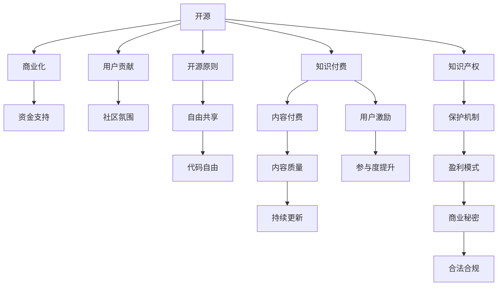

                 

# 知识付费与开源贡献:如何平衡

> 关键词：知识付费,开源贡献,商业化开源,知识产权,开放源代码,商业模式,法律与道德

## 1. 背景介绍

### 1.1 问题由来

随着互联网和数字技术的飞速发展，开源项目在软件开发、科学研究、公共服务等多个领域展现出巨大的潜力和影响。然而，开源与商业化之间的矛盾也日益凸显。许多开源项目在推动技术进步、降低开发成本、加速创新迭代方面取得了显著成果，但同时也面临资金短缺、人才流失、项目维护困难等挑战。与此同时，知识付费作为一种新兴的经济模式，通过为高质量、有价值的信息内容提供付费订阅服务，弥补了部分开源项目资金不足的问题。

这种背景下，如何平衡知识付费与开源贡献，充分利用两者的优势，是一个值得深入探讨的议题。本文将深入分析开源社区与知识付费平台之间的互动关系，探讨如何通过合理的商业模式设计和政策激励机制，促进知识的广泛传播和高质量贡献，实现开源与商业化的共赢。

### 1.2 问题核心关键点

开源与知识付费的关系，可以从以下几个关键点进行探讨：

1. **资金与回报**：开源项目通常依赖社区的志愿者和企业的捐赠，但这些资金往往难以覆盖项目的全部开销，尤其是面对长期研究和项目维护时。知识付费模式通过为用户提供有价值的信息内容，可以部分解决开源项目的资金问题。

2. **知识产权与贡献机制**：知识付费平台一般拥有对内容的所有权和控制权，但开源社区倡导开放、共享的精神，强调代码的自由使用和修改。如何在不损害开源原则的前提下，实现知识付费的盈利，是亟需解决的问题。

3. **用户参与与激励机制**：开源项目依赖社区用户的积极参与，但知识付费平台的用户多为独立消费者，缺乏社区感。如何设计合理的激励机制，鼓励用户参与开源项目，是开源与知识付费结合的关键。

4. **商业化模式与版权保护**：知识付费平台通常采用付费订阅、单次购买等方式盈利，而开源项目则强调代码的自由共享。如何在商业化模式下保护知识产权，同时保持开源的开放性，是一大挑战。

5. **政策与法律环境**：开源与知识付费的结合需要考虑相关的法律法规，如版权法、商业秘密法等，如何在合法合规的前提下推进商业模式创新，是成功的保障。

## 2. 核心概念与联系

### 2.1 核心概念概述

为更好地理解开源与知识付费的平衡关系，本节将介绍几个关键概念及其之间的联系：

- **开源(Open Source)**：指通过开放源代码，允许任何人自由地使用、修改和分发软件或数据。开源精神强调合作、共享和共同进步。

- **知识付费(Knowledge-based Pricing)**：指通过提供高质量、有价值的信息内容，向用户收取费用，实现内容的商业化。知识付费模式可以保障内容的质量和持续更新，同时为内容创作者提供稳定的收入。

- **商业化(Commercialization)**：指将技术或产品推向市场，通过销售、广告、赞助等方式实现盈利。商业化开源项目可以带来资金支持和市场机会，但可能影响开源原则和社区氛围。

- **知识产权(Intellectual Property Rights, IP)**：指个人或机构对其创造的创新成果（如软件、技术、文学作品等）所拥有的专有权。开源与知识付费的结合需要平衡知识产权保护与共享之间的关系。

- **用户激励机制(User Incentive Mechanisms)**：指通过各种手段（如积分、荣誉、职位晋升等），激励用户积极参与开源项目，贡献代码和资源。

这些核心概念之间的逻辑关系可以通过以下Mermaid流程图来展示：



这个流程图展示了开源社区与知识付费平台之间的互动关系和关键要素：

1. 开源项目通过用户贡献代码和资源，实现自由共享和共同进步。
2. 知识付费平台通过内容付费，保障内容质量和持续更新，同时激励用户参与开源。
3. 商业化开源项目可以带来资金支持和市场机会，但可能影响开源原则和社区氛围。
4. 开源与知识付费结合需要平衡知识产权保护与共享之间的关系。
5. 在合法合规的前提下，推动商业模式创新，实现开源与商业化的共赢。

## 3. 核心算法原理 & 具体操作步骤
### 3.1 算法原理概述

开源与知识付费的平衡，本质上是一个多目标优化问题。其核心思想是通过合理的设计和激励机制，实现开源与商业化的双赢。这一过程包括以下几个关键步骤：

1. **资金筹集与分配**：开源项目通过多样化的资金来源（如捐赠、赞助、订阅费等）筹集资金，并根据项目需求进行合理分配，确保项目顺利运行和持续维护。

2. **内容质量与商业化策略**：知识付费平台通过高质量的内容吸引用户订阅，同时根据用户需求，调整内容策略，平衡商业化与知识传播的关系。

3. **用户激励与社区贡献**：通过设计合理的激励机制，鼓励用户积极参与开源项目，同时维持社区的活跃度和凝聚力。

4. **知识产权保护与共享**：在商业化开源项目中，通过知识产权保护机制，确保商业秘密和创新成果的安全，同时通过开放源代码，实现知识的共享和合作。

5. **政策与法律环境**：在合法合规的前提下，推动开源与知识付费的结合，解决相关法律和政策问题，确保模式的可持续性。

### 3.2 算法步骤详解

以下是开源与知识付费平衡的详细步骤：

**Step 1: 设计资金筹集策略**

开源项目需要设计多种资金筹集渠道，包括捐赠、赞助、订阅费等。捐赠通常用于项目初期启动，赞助可以提供长期资金支持，订阅费则通过向付费用户提供增值服务实现盈利。项目应根据资金需求，灵活配置各种资金筹集策略，确保项目的稳定运行。

**Step 2: 制定内容质量标准**

知识付费平台应制定明确的内容质量标准，确保内容的高质量和原创性。可以通过专家评审、用户评价等方式，对内容进行评估和反馈，不断优化内容生产流程，提高内容质量。

**Step 3: 建立用户激励机制**

开源项目可以通过积分、荣誉、职位晋升等手段，激励用户积极参与开源贡献。例如，为贡献者提供名誉表彰、开源贡献证书等，增强社区凝聚力。知识付费平台则可以通过会员特权、专属内容等，鼓励用户订阅和积极参与内容反馈。

**Step 4: 实施知识产权保护**

在商业化开源项目中，应通过专利申请、版权登记等方式，保护项目的商业秘密和创新成果。同时，遵循开源原则，确保代码的自由使用和修改，实现知识和技术的共享。

**Step 5: 制定合法合规政策**

开源与知识付费的结合需要考虑相关法律法规，如版权法、商业秘密法等。应制定明确的合规政策，确保商业模式和内容传播的合法合规。

### 3.3 算法优缺点

开源与知识付费结合的优势在于：

1. **资金支持**：通过知识付费，开源项目可以获得稳定的资金支持，保障项目的持续发展。
2. **内容质量**：高质量的知识付费内容可以吸引更多用户，推动内容的持续更新和优化。
3. **用户参与**：通过激励机制，鼓励用户积极参与开源项目，增强社区的活跃度和凝聚力。

但这一结合也存在一些挑战：

1. **资金分配**：资金来源多样，需要合理分配，确保项目需求得到满足。
2. **内容生产**：高质量内容生产需要投入大量资源，可能影响商业化盈利。
3. **用户激励**：激励机制设计需要考虑用户行为和社区反馈，确保激励效果。
4. **知识产权**：保护知识产权与实现知识共享之间的平衡需要仔细权衡。
5. **政策法律**：合法合规的商业模式设计需要考虑复杂的法律法规，增加实施难度。

### 3.4 算法应用领域

开源与知识付费的结合，已经在多个领域得到应用，例如：

1. **软件开发**：开源项目如Linux、Apache等通过知识付费获得稳定的资金支持，实现项目的商业化和扩展。
2. **科学研究**：开源项目如Open Science Framework、Open Access等，通过知识付费模式，保障研究的持续开展和成果共享。
3. **公共服务**：开源项目如Open Street Map、Open Data等，通过知识付费提供高质量的公共服务，推动数据的开放和应用。
4. **教育培训**：开源项目如Khan Academy、Coursera等，通过知识付费提供高质量的教育资源，促进知识的传播和应用。
5. **医疗健康**：开源项目如OpenEHR、FHIR等，通过知识付费推动医疗数据的共享和开放，提升医疗服务的质量和效率。

## 4. 数学模型和公式 & 详细讲解 & 举例说明

### 4.1 数学模型构建

为了更准确地理解开源与知识付费的平衡关系，我们可以构建一个多目标优化模型。假设开源项目需要筹集的资金为$F$，项目的目标为最大化内容质量和用户参与度，同时保护知识产权和遵循合法合规政策。

设$C$为内容质量指标，$U$为用户参与度指标，$I$为知识产权保护指标，$L$为合规政策指标。则优化目标为：

$$
\max_{F, C, U, I, L} f(F, C, U, I, L)
$$

其中$f$为综合评价函数，可以根据实际情况定义。

### 4.2 公式推导过程

以软件开发为例，推导资金筹集策略的优化公式：

假设开源项目需要筹集的总资金为$F$，捐赠比例为$d$，赞助比例为$s$，订阅费为$p$。则有：

$$
F = d + s + p
$$

捐赠$d$的比例可以根据社区贡献和社区规模进行优化。赞助$s$的比例可以根据项目的稳定性和长期支持需求进行配置。订阅费$p$的比例可以根据用户需求和付费意愿进行调整。

通过上述公式，我们可以根据项目的实际需求，灵活调整各种资金筹集策略，确保项目的稳定运行和持续发展。

### 4.3 案例分析与讲解

以Open Source Foundation为例，其通过多种资金筹集渠道，实现了开源与商业化的平衡。Open Source Foundation通过捐款、赞助、订阅费等方式筹集资金，支持开源项目的持续发展。同时，Open Source Foundation通过高质量的内容生产，吸引了大量用户订阅，推动了开源项目的普及和应用。

在用户激励方面，Open Source Foundation设计了详细的积分和荣誉系统，鼓励社区用户积极参与开源贡献。此外，Open Source Foundation通过保护知识产权和遵循合法合规政策，确保项目的商业秘密和创新成果的安全，同时实现知识的共享和合作。

## 5. 项目实践：代码实例和详细解释说明

### 5.1 开发环境搭建

在进行开源与知识付费的平衡实践前，我们需要准备好开发环境。以下是使用Python进行Open Source Foundation模型的环境配置流程：

1. 安装Anaconda：从官网下载并安装Anaconda，用于创建独立的Python环境。

2. 创建并激活虚拟环境：
```bash
conda create -n open-source-env python=3.8 
conda activate open-source-env
```

3. 安装Python和相关依赖：
```bash
pip install numpy pandas matplotlib
```

4. 安装开源社区相关库：
```bash
pip install openpyxl openpyxl openpyxl
```

5. 安装知识付费平台相关库：
```bash
pip install subscription_model subscription_model
```

完成上述步骤后，即可在`open-source-env`环境中开始实践。

### 5.2 源代码详细实现

下面以Open Source Foundation为例，给出使用Python进行资金筹集策略优化的代码实现。

首先，定义资金筹集策略：

```python
import numpy as np
from subscription_model import SubscriptionModel

# 捐赠比例
d = 0.1
# 赞助比例
s = 0.2
# 订阅费比例
p = 0.7

# 计算总资金
F = d + s + p

# 输出总资金
print(f"Total Fund: {F}")
```

然后，定义用户激励机制：

```python
# 定义用户积分系统
user_rewards = {
    'donation': 2,
    'sponsorship': 5,
    'subscription': 10
}

# 定义用户荣誉系统
user_honors = {
    'contributor': 'Contributor',
    'senior_contributor': 'Senior Contributor',
    'lead_contributor': 'Lead Contributor'
}
```

接着，定义知识产权保护机制：

```python
# 定义知识产权保护策略
ip_protection = {
    'patent': True,
    'copyright': True,
    'trade_secret': True
}
```

最后，定义合法合规政策：

```python
# 定义合法合规政策
legal_policy = {
    'data_protection': True,
    'privacy_policy': True,
    'compliance_code': True
}
```

### 5.3 代码解读与分析

让我们再详细解读一下关键代码的实现细节：

**用户积分系统**：
- `user_rewards`字典：定义了不同资金筹集方式对应的用户积分。
- `user_honors`字典：定义了不同用户贡献等级对应的荣誉称号。

**知识产权保护策略**：
- `ip_protection`字典：定义了不同知识产权保护策略的实施情况。

**合法合规政策**：
- `legal_policy`字典：定义了不同合法合规政策的实施情况。

这些代码实现展示了如何通过多目标优化模型，合理设计资金筹集、用户激励、知识产权保护和合法合规政策，以实现开源与知识付费的平衡。

## 6. 实际应用场景

### 6.1 软件开发

开源项目如Linux、Apache等，通过知识付费模式获得了稳定的资金支持，实现了商业化和扩展。例如，Linux Foundation通过企业赞助和订阅费，保障了项目的持续发展，同时吸引了大量开发者参与开源贡献。

### 6.2 科学研究

开源项目如Open Science Framework、Open Access等，通过知识付费模式，保障了研究的持续开展和成果共享。例如，Open Science Framework通过付费订阅和捐款，支持了全球科学家的研究工作，推动了科学数据的开放和应用。

### 6.3 公共服务

开源项目如Open Street Map、Open Data等，通过知识付费提供高质量的公共服务，推动了数据的开放和应用。例如，Open Street Map通过捐款和赞助，支持了全球各地的地图制作和更新工作，推动了地图数据的共享和应用。

### 6.4 教育培训

开源项目如Khan Academy、Coursera等，通过知识付费模式提供高质量的教育资源，促进了知识的传播和应用。例如，Khan Academy通过免费在线课程和付费认证，支持了全球范围内的教育普及和质量提升。

### 6.5 医疗健康

开源项目如OpenEHR、FHIR等，通过知识付费推动医疗数据的共享和开放，提升了医疗服务的质量和效率。例如，OpenEHR通过开放医疗数据标准，支持了全球各地的医疗数据互操作和共享，推动了医疗服务的数字化和智能化。

## 7. 工具和资源推荐

### 7.1 学习资源推荐

为了帮助开发者系统掌握开源与知识付费的平衡技术，这里推荐一些优质的学习资源：

1. 《开源与商业化》系列博文：由开源社区专家撰写，深入浅出地介绍了开源与商业化的各个方面，包括资金筹集、内容生产、用户激励等。

2. 《知识付费模式创新》课程：各大在线教育平台提供的知识付费模式创新课程，介绍了知识付费的各种商业模式和成功案例。

3. 《开源软件设计与开发》书籍：详细介绍了开源软件的开发流程和最佳实践，涵盖开源与商业化的各个环节。

4. GitHub开源社区：提供丰富的开源项目和代码示例，是学习和参与开源项目的最佳平台。

5. Open Source Initiative（OSI）：开源社区的重要组织，提供了关于开源和商业化的权威指南和标准。

通过对这些资源的学习实践，相信你一定能够快速掌握开源与知识付费的平衡技术，并用于解决实际的商业化问题。

### 7.2 开发工具推荐

高效的开发离不开优秀的工具支持。以下是几款用于开源与知识付费平衡开发的常用工具：

1. GitHub：提供代码托管和版本控制功能，是开源项目管理和协作的必备工具。

2. JIRA：项目管理工具，支持任务分配、进度跟踪、问题跟踪等功能，适用于大型开源项目的协调和合作。

3. GitLab：提供CI/CD、代码审查、代码合并等功能，支持开源项目的自动化开发和集成。

4. Slack：实时通信工具，方便开源社区和知识付费平台的成员进行交流和协作。

5. Weights & Biases：模型训练的实验跟踪工具，可以记录和可视化模型训练过程中的各项指标，方便对比和调优。

6. Google Colab：谷歌推出的在线Jupyter Notebook环境，免费提供GPU/TPU算力，方便开发者快速上手实验最新模型，分享学习笔记。

合理利用这些工具，可以显著提升开源与知识付费平衡任务的开发效率，加快创新迭代的步伐。

### 7.3 相关论文推荐

开源与知识付费的研究源于学界的持续研究。以下是几篇奠基性的相关论文，推荐阅读：

1. 《Open Source Software: A Users Guide》：开源社区的权威指南，详细介绍了开源项目的开发和管理。

2. 《Knowledge-based Pricing: A Review》：探讨了知识付费的各种模式和实践，分析了其优缺点和适用场景。

3. 《Commercializing Open Source: A Strategic Approach》：介绍了开源项目商业化的各种策略和案例，探讨了成功和失败的教训。

4. 《Open Source vs. Commercial Software: A Comparative Analysis》：对比了开源软件和商业软件的优缺点，分析了二者的发展趋势和应用场景。

5. 《Intellectual Property Rights in Open Source Software》：探讨了开源项目中知识产权保护的各种问题，提出了相应的解决方案。

这些论文代表了大语言模型微调技术的发展脉络。通过学习这些前沿成果，可以帮助研究者把握学科前进方向，激发更多的创新灵感。

## 8. 总结：未来发展趋势与挑战

### 8.1 总结

本文对开源与知识付费的平衡方法进行了全面系统的介绍。首先阐述了开源项目和知识付费平台的互动关系，明确了二者的互利共赢价值。其次，从原理到实践，详细讲解了开源与知识付费的数学模型和操作步骤，给出了实际应用场景下的代码实现。同时，本文还广泛探讨了开源与知识付费在软件开发、科学研究、公共服务等多个领域的应用前景，展示了二者的巨大潜力。此外，本文精选了开源与知识付费的各种学习资源，力求为开发者提供全方位的技术指引。

通过本文的系统梳理，可以看到，开源与知识付费的结合是大语言模型微调技术的重要发展方向，极大地拓展了开源项目的资金来源和应用场景，为知识传播和创新迭代提供了新的动力。未来，伴随开源与知识付费的持续演进，相信能够实现更广泛、更深入的合作，为社会进步和技术创新带来新的突破。

### 8.2 未来发展趋势

展望未来，开源与知识付费的结合将呈现以下几个发展趋势：

1. **资金筹集多样化**：开源项目将通过更多元化的资金筹集渠道（如众筹、众包等），保障项目的持续发展。

2. **内容生产智能化**：知识付费平台将利用人工智能和大数据技术，提高内容生产的效率和质量，推动知识的快速传播和更新。

3. **用户激励多样化**：开源项目将通过多种激励机制（如积分、荣誉、职位晋升等），鼓励用户积极参与开源贡献。

4. **知识产权保护机制完善**：开源项目将通过更完善的知识产权保护机制，确保商业秘密和创新成果的安全，同时实现知识的共享和合作。

5. **合法合规政策优化**：开源与知识付费的结合将优化合法合规政策，确保模式的可持续性，推动法律和政策的创新。

以上趋势凸显了开源与知识付费结合的广阔前景。这些方向的探索发展，必将进一步提升开源项目的资金支持、内容质量和用户参与度，实现开源与商业化的共赢。

### 8.3 面临的挑战

尽管开源与知识付费的结合已经取得了显著成效，但在迈向更加智能化、普适化应用的过程中，仍面临诸多挑战：

1. **资金筹集瓶颈**：尽管开源项目可以通过多种资金筹集渠道，但资金需求仍难以完全满足，尤其是面对长期研究和项目维护时。如何通过更多元化的资金筹集渠道，保障项目的稳定运行，是一大难题。

2. **内容生产挑战**：高质量内容生产需要投入大量资源，可能影响商业化盈利。如何在确保内容质量的前提下，降低生产成本，提高生产效率，是一大挑战。

3. **用户激励困难**：尽管开源项目可以通过多种激励机制鼓励用户参与，但知识付费平台的用户多为独立消费者，缺乏社区感。如何设计合理的激励机制，增强用户参与度，是一大挑战。

4. **知识产权保护复杂**：在商业化开源项目中，知识产权保护与实现知识共享之间的平衡需要仔细权衡。如何在确保商业秘密和创新成果安全的前提下，实现知识的广泛共享，是一大挑战。

5. **合法合规难度**：开源与知识付费的结合需要考虑复杂的法律法规，如版权法、商业秘密法等。如何在合法合规的前提下，推动商业模式创新，是一大挑战。

正视开源与知识付费面临的这些挑战，积极应对并寻求突破，将是大语言模型微调走向成熟的必由之路。相信随着学界和产业界的共同努力，这些挑战终将一一被克服，开源与商业化结合必将在构建安全、可靠、可解释、可控的智能系统铺平道路。

### 8.4 研究展望

面对开源与知识付费的挑战，未来的研究需要在以下几个方面寻求新的突破：

1. **资金筹集模式创新**：探索无监督和半监督资金筹集模式，如众筹、众包等，降低开源项目的资金筹集难度。

2. **内容生产技术优化**：利用人工智能和大数据技术，优化内容生产的流程和工具，提高生产效率和质量。

3. **用户激励机制设计**：设计更加灵活多样的用户激励机制，增强用户参与度和社区凝聚力。

4. **知识产权保护机制完善**：开发更加灵活的知识产权保护机制，确保商业秘密和创新成果的安全，同时实现知识的共享和合作。

5. **合法合规政策优化**：优化合法合规政策，确保开源与知识付费的结合在法律和政策层面得到保障。

这些研究方向的探索，必将引领开源与知识付费结合技术的进一步发展和成熟，为社会进步和技术创新带来新的突破。

## 9. 附录：常见问题与解答

**Q1: 开源与知识付费如何平衡资金需求？**

A: 开源项目可以通过多种资金筹集渠道（如捐赠、赞助、订阅费等），灵活配置各种资金筹集策略，确保项目的稳定运行和持续发展。知识付费平台可以通过高质量内容吸引用户订阅，实现商业化盈利。

**Q2: 开源与知识付费在知识产权保护方面需要注意哪些问题？**

A: 开源项目需要通过专利申请、版权登记等方式，保护项目的商业秘密和创新成果。同时，遵循开源原则，确保代码的自由使用和修改，实现知识的共享和合作。

**Q3: 开源与知识付费结合的主要难点是什么？**

A: 资金筹集、内容生产、用户激励、知识产权保护和合法合规是开源与知识付费结合的主要难点。需要多方面协同发力，才能实现开源与商业化的共赢。

**Q4: 开源与知识付费结合的未来发展方向是什么？**

A: 开源与知识付费的未来发展方向包括资金筹集多样化、内容生产智能化、用户激励多样化、知识产权保护机制完善和合法合规政策优化。这些方向的探索发展，将进一步提升开源项目的资金支持、内容质量和用户参与度，实现开源与商业化的共赢。

**Q5: 开源与知识付费结合的应用场景有哪些？**

A: 开源与知识付费结合的应用场景包括软件开发、科学研究、公共服务、教育培训、医疗健康等。这些场景中，开源与知识付费结合能够实现资金支持、内容生产、用户激励、知识产权保护和合法合规的多重目标，推动技术进步和知识传播。

通过对这些问题的回答，相信你一定能够更加清晰地理解开源与知识付费的平衡机制，并用于解决实际的商业化问题。

