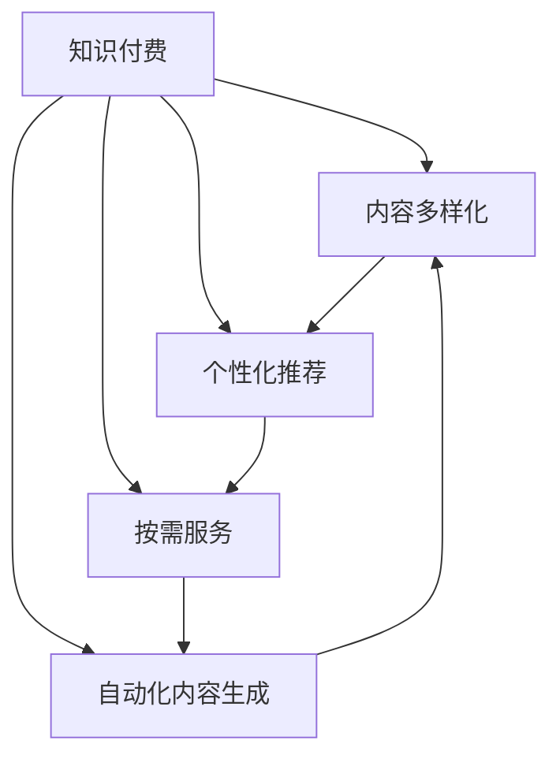

                 

# 知识付费与技术创新的良性互动

## 1. 背景介绍

### 1.1 问题由来

随着互联网技术的飞速发展，知识付费模式应运而生。用户通过订阅或付费购买优质内容，以获得更加系统、深入的知识服务。该模式不仅改变了传统知识传播的渠道和方式，也催生了对内容制作和呈现的技术需求，推动了技术创新。

知识付费与技术创新之间的良性互动，已成为推动内容服务发展的重要动力。一方面，技术创新为知识付费提供了更丰富、更高效的内容形式，如语音播客、图文并茂的文章、互动视频等；另一方面，知识付费又为技术创新提供了市场验证和应用场景，促进了技术的进一步发展。

### 1.2 问题核心关键点

知识付费与技术创新的良性互动，主要体现在以下几个方面：

1. **内容形式多样化**：技术创新使得知识内容的形式更加多样化，用户可以更加便利地获取和消费内容。
2. **用户体验优化**：技术创新提高了知识付费平台的用户体验，如个性化推荐、智能搜索、实时互动等。
3. **商业模式创新**：知识付费为技术创新提供了商业模式探索的土壤，如按需服务、订阅服务、社区服务等。
4. **内容制作和呈现**：技术创新提升了内容制作的效率和呈现的质量，如自动化内容生成、精准匹配推荐、高质量视频编纂等。
5. **市场验证和反馈**：知识付费提供了技术创新的市场验证和用户反馈机制，推动技术的不断优化和改进。

这种良性互动不仅提升了知识服务的价值，也推动了技术的广泛应用和发展。以下将详细探讨这一良性互动的原理和实践，并展望未来发展趋势。

## 2. 核心概念与联系

### 2.1 核心概念概述

为更好地理解知识付费与技术创新的良性互动，本节将介绍几个密切相关的核心概念：

- **知识付费**：指用户通过订阅或付费获取系统、深入的知识内容，以提升自我认知和职业技能。
- **技术创新**：指通过技术手段的改进，实现产品的升级和功能的优化，以提升用户体验和商业价值。
- **内容多样化**：指利用技术手段，使得知识内容的形式更加多样，如文本、音频、视频等。
- **个性化推荐**：指利用算法和数据挖掘技术，根据用户的历史行为和偏好，推荐个性化的内容。
- **按需服务**：指根据用户的实时需求，提供定制化的服务，如在线咨询、私人导师等。
- **自动化内容生成**：指利用自然语言处理、计算机视觉等技术，自动生成高质量的内容。

这些核心概念之间的逻辑关系可以通过以下Mermaid流程图来展示：



这个流程图展示了大语言模型的核心概念及其之间的关系：

1. 知识付费通过多样化、推荐、按需等形式提升用户体验。
2. 内容多样化通过技术创新实现，如语音播客、图文并茂的文章、互动视频等。
3. 个性化推荐和按需服务依赖于技术手段，如算法、数据挖掘等。
4. 自动化内容生成利用自然语言处理、计算机视觉等技术，提高内容制作效率和质量。

这些概念共同构成了知识付费与技术创新的良性互动框架，促进了内容服务的发展和技术创新的进步。

## 3. 核心算法原理 & 具体操作步骤
### 3.1 算法原理概述

知识付费与技术创新的良性互动，主要基于以下几个核心算法原理：

1. **个性化推荐算法**：通过分析用户行为数据，利用协同过滤、矩阵分解、深度学习等算法，推荐用户可能感兴趣的内容。
2. **自然语言处理技术**：利用自然语言处理技术，如词向量模型、语言模型、序列模型等，实现内容的自动生成和语义理解。
3. **计算机视觉技术**：利用计算机视觉技术，如图像识别、视频编纂等，提升内容的多样性和互动性。
4. **自动化内容生成算法**：通过自然语言处理和深度学习技术，自动生成高质量的文本、视频等内容。
5. **按需服务算法**：利用算法和数据分析，根据用户需求，提供定制化、个性化的服务。

这些算法共同构建了知识付费与技术创新的良性互动机制，提升了内容服务的质量和用户体验。

### 3.2 算法步骤详解

以下是知识付费与技术创新良性互动的主要算法步骤：

1. **数据收集与处理**：收集用户的阅读、搜索、购买等行为数据，并进行清洗和标注。
2. **模型训练与优化**：利用机器学习算法，训练推荐模型、内容生成模型、图像识别模型等，并不断优化模型性能。
3. **内容生产与呈现**：利用自然语言处理和计算机视觉技术，生产多样化的内容形式，并通过平台呈现给用户。
4. **用户互动与反馈**：利用算法分析用户反馈，优化推荐算法和内容生成模型，提升用户体验。
5. **商业模式创新**：根据用户需求和市场反馈，探索新的商业模式，如按需服务、订阅服务等。

### 3.3 算法优缺点

知识付费与技术创新的良性互动具有以下优点：

1. **提升用户体验**：通过个性化推荐和多样化内容，提升用户的获取和消费体验。
2. **增加商业价值**：通过数据驱动的个性化推荐和内容生成，提升平台的用户粘性和商业收益。
3. **促进技术创新**：知识付费提供了技术创新的市场验证和用户反馈机制，推动技术的不断优化和改进。
4. **扩大应用场景**：知识付费为技术创新提供了广泛的应用场景，如教育、金融、健康等领域。

但这一互动也存在一些局限性：

1. **数据隐私问题**：用户行为数据的安全性和隐私保护是一个重要的挑战。
2. **内容质量问题**：自动化内容生成可能存在质量不均、内容错误等问题。
3. **算法偏见问题**：推荐算法可能存在偏见，导致推荐结果不公。
4. **技术成本问题**：高质量推荐和内容生成需要投入大量技术和资源。
5. **用户付费意愿问题**：部分用户可能不愿意为优质内容付费，影响商业模式的可持续性。

尽管存在这些局限性，但知识付费与技术创新的良性互动已成为推动内容服务发展和技术创新的重要动力。未来相关研究的重点在于如何进一步提升技术创新的效率和效果，同时兼顾用户隐私和内容质量等因素。

### 3.4 算法应用领域

知识付费与技术创新的良性互动已经在多个领域得到应用，如教育、金融、健康、娱乐等。

- **教育领域**：利用个性化推荐和自动化内容生成，提供个性化的学习路径和高质量的在线课程。
- **金融领域**：通过智能投顾、按需服务，为用户提供精准的投资建议和定制化理财方案。
- **健康领域**：通过远程医疗、个性化健康建议，提高用户的健康管理和医疗服务质量。
- **娱乐领域**：利用多样化内容和技术创新，提升用户的娱乐体验，如短视频、在线游戏等。

除了上述这些经典领域，知识付费与技术创新的良性互动还在不断拓展，如法律、农业、建筑等领域，为各行各业提供更优质的知识服务和技术支持。

## 4. 数学模型和公式 & 详细讲解  
### 4.1 数学模型构建

本节将使用数学语言对知识付费与技术创新的良性互动进行更加严格的刻画。

记用户行为数据为 $D=\{(x_i, y_i)\}_{i=1}^N$，其中 $x_i$ 为用户的浏览、搜索、购买等行为，$y_i$ 为用户的反馈信息，如评分、评论等。

定义推荐模型为 $F: \mathcal{X} \rightarrow \mathcal{Y}$，其中 $\mathcal{X}$ 为用户行为空间，$\mathcal{Y}$ 为用户行为预测结果空间。推荐模型的目标是最小化预测误差，即：

$$
\mathcal{L}(F) = \frac{1}{N} \sum_{i=1}^N \ell(F(x_i), y_i)
$$

其中 $\ell$ 为损失函数，通常使用均方误差损失。

### 4.2 公式推导过程

以下我们以协同过滤算法为例，推导推荐模型的损失函数及其梯度计算公式。

假设用户 $u$ 对物品 $i$ 的评分 $r_{ui}$ 为已知，推荐模型 $F$ 对用户 $u$ 的评分预测为 $f_u$，则协同过滤算法下的损失函数为：

$$
\ell(F) = \frac{1}{M} \sum_{u=1}^M \sum_{i=1}^N (r_{ui} - f_u)^2
$$

其中 $M$ 为用户的数量。

根据梯度下降算法，推荐模型的参数更新公式为：

$$
\theta \leftarrow \theta - \eta \nabla_{\theta}\mathcal{L}(\theta)
$$

其中 $\eta$ 为学习率，$\nabla_{\theta}\mathcal{L}(\theta)$ 为损失函数对模型参数 $\theta$ 的梯度。

在得到梯度后，即可带入参数更新公式，完成模型的迭代优化。重复上述过程直至收敛，最终得到优化的推荐模型。

## 5. 项目实践：代码实例和详细解释说明
### 5.1 开发环境搭建

在进行知识付费与技术创新良性互动的实践前，我们需要准备好开发环境。以下是使用Python进行知识付费平台开发的常见环境配置流程：

1. 安装Anaconda：从官网下载并安装Anaconda，用于创建独立的Python环境。

2. 创建并激活虚拟环境：
```bash
conda create -n knowledge-env python=3.8 
conda activate knowledge-env
```

3. 安装相关库：
```bash
pip install pandas numpy scikit-learn tensorflow keras scikit-learn gensim beautifulsoup4 nltk
```

4. 安装相关工具包：
```bash
pip install requests jupyter notebook ipython
```

完成上述步骤后，即可在`knowledge-env`环境中开始实践。

### 5.2 源代码详细实现

这里我们以推荐系统为例，给出使用TensorFlow和Keras进行知识付费平台开发的PyTorch代码实现。

首先，定义推荐系统的数据处理函数：

```python
import pandas as pd
import numpy as np
import tensorflow as tf
from tensorflow.keras.layers import Input, Embedding, Dot, Dense
from tensorflow.keras.models import Model

# 数据处理函数
def preprocess_data(data_path):
    data = pd.read_csv(data_path, sep=',')
    data['user'] = data['user'].map(int)
    data['item'] = data['item'].map(int)
    data['score'] = data['score'].astype(float)
    data = data.dropna()
    return data

# 定义模型输入
user_input = Input(shape=(1,), name='user')
item_input = Input(shape=(1,), name='item')
```

然后，定义推荐模型的结构和优化器：

```python
# 定义模型结构
user_embedding = Embedding(input_dim=100000, output_dim=100, name='user_embedding')
item_embedding = Embedding(input_dim=100000, output_dim=100, name='item_embedding')
dot_product = Dot(axes=1)([user_embedding(user_input), item_embedding(item_input)])
prediction = Dense(1, activation='sigmoid')(dot_product)

# 定义模型
model = Model(inputs=[user_input, item_input], outputs=prediction)

# 定义优化器
optimizer = tf.keras.optimizers.Adam(learning_rate=0.001)
```

接着，定义训练和评估函数：

```python
# 定义训练函数
def train_epoch(model, train_data, batch_size, optimizer):
    for batch in train_data:
        with tf.GradientTape() as tape:
            y_true = tf.reshape(batch['y'], shape=(batch_size, 1))
            y_pred = model(user_input=tensorflow.constant(batch['user']), item_input=tensorflow.constant(batch['item']))
            loss = tf.keras.losses.binary_crossentropy(y_true, y_pred)
        gradients = tape.gradient(loss, model.trainable_variables)
        optimizer.apply_gradients(zip(gradients, model.trainable_variables))

# 定义评估函数
def evaluate(model, test_data, batch_size):
    with tf.GradientTape() as tape:
        total_loss = 0
        for batch in test_data:
            y_true = tf.reshape(batch['y'], shape=(batch_size, 1))
            y_pred = model(user_input=tensorflow.constant(batch['user']), item_input=tensorflow.constant(batch['item']))
            loss = tf.keras.losses.binary_crossentropy(y_true, y_pred)
            total_loss += loss.numpy()
        return total_loss / len(test_data)
```

最后，启动训练流程并在测试集上评估：

```python
# 加载数据
train_data = preprocess_data('train.csv')
test_data = preprocess_data('test.csv')

# 训练模型
epochs = 10
batch_size = 32

for epoch in range(epochs):
    train_epoch(model, train_data, batch_size, optimizer)
    print(f'Epoch {epoch+1}, train loss: {evaluate(model, train_data, batch_size)}')

# 评估模型
print(f'Epoch {epoch+1}, test loss: {evaluate(model, test_data, batch_size)}')
```

以上就是使用TensorFlow和Keras对知识付费平台进行推荐系统微调的完整代码实现。可以看到，得益于TensorFlow和Keras的强大封装，我们可以用相对简洁的代码完成推荐模型的开发。

### 5.3 代码解读与分析

让我们再详细解读一下关键代码的实现细节：

**preprocess_data函数**：
- 该函数用于对原始数据进行清洗和预处理，去除缺失值和噪声，并将用户和物品ID转换为数值形式。

**推荐模型结构**：
- 使用Embedding层将用户和物品ID映射为向量表示，使用Dot层计算用户和物品向量的点积，得到用户对物品的评分预测。

**训练函数train_epoch**：
- 对训练数据以批为单位进行迭代，在每个批次上前向传播计算损失函数，并使用Adam优化器进行梯度更新。

**评估函数evaluate**：
- 与训练类似，不同点在于不更新模型参数，并在每个batch结束后将损失函数累加，最后计算平均损失。

**训练流程**：
- 定义总的epoch数和batch size，开始循环迭代
- 每个epoch内，先在训练集上训练，输出平均损失
- 在测试集上评估，输出平均损失
- 所有epoch结束后，在测试集上评估，给出最终测试结果

可以看到，TensorFlow和Keras使得知识付费平台推荐系统的开发变得简洁高效。开发者可以将更多精力放在数据处理、模型改进等高层逻辑上，而不必过多关注底层的实现细节。

当然，工业级的系统实现还需考虑更多因素，如模型的保存和部署、超参数的自动搜索、更灵活的任务适配层等。但核心的微调范式基本与此类似。

## 6. 实际应用场景
### 6.1 教育领域

知识付费在教育领域的应用非常广泛，通过推荐系统和个性化内容，为学生提供优质的学习资源和支持。

具体而言，可以收集学生的学习历史数据，包括浏览记录、测验成绩等，利用推荐算法为用户推荐适合的教材、习题、视频课程等。同时，利用自然语言处理技术，生成个性化的学习计划和提示，帮助学生高效学习。

### 6.2 金融领域

知识付费在金融领域的应用主要集中在智能投顾和理财建议上。智能投顾系统通过分析用户的投资历史和行为，推荐适合的投资组合和策略。理财建议系统则根据用户的财务状况和目标，提供个性化的理财方案，如股票投资、基金配置等。

这些系统不仅提升了用户的理财效率，还减少了人工顾问的成本，为金融服务带来了更高的效率和更好的用户体验。

### 6.3 健康领域

知识付费在健康领域的应用包括远程医疗和个性化健康建议。远程医疗系统通过分析用户的健康数据，如体征、病历等，提供精准的医疗咨询和诊断。个性化健康建议系统则根据用户的生活方式和健康目标，推荐适合的饮食、运动、休息等建议，帮助用户保持健康。

这些系统为健康管理提供了新的途径，提升了用户的健康水平和医疗服务的可及性。

### 6.4 未来应用展望

随着知识付费与技术创新的不断深入，未来将在更多领域得到广泛应用，为各行各业带来变革性影响。

在智慧医疗领域，基于知识付费和推荐系统的远程医疗和健康管理将提升医疗服务的智能化水平，辅助医生诊疗，加速新药开发进程。

在智能教育领域，推荐系统和个性化内容将为学生提供更高效的学习体验，提升教学质量，促进教育公平。

在智慧城市治理中，知识付费和推荐系统将提高城市管理的自动化和智能化水平，构建更安全、高效的未来城市。

此外，在企业培训、职业发展、法律咨询等众多领域，知识付费和推荐系统也将不断涌现，为各行各业提供更优质的知识服务和技术支持。相信随着技术的日益成熟，知识付费与技术创新的良性互动必将在构建人机协同的智能时代中扮演越来越重要的角色。

## 7. 工具和资源推荐
### 7.1 学习资源推荐

为了帮助开发者系统掌握知识付费与技术创新的理论和实践，这里推荐一些优质的学习资源：

1. **《知识付费：未来商业趋势》**：探讨知识付费的商业模式和市场前景，分析行业发展趋势。
2. **《深度学习在推荐系统中的应用》**：介绍深度学习在推荐算法中的应用，涵盖协同过滤、内容生成等技术。
3. **《机器学习实战》**：详细讲解机器学习在推荐系统、内容生成等领域的实现方法。
4. **《推荐系统实战》**：通过实际项目，展示推荐系统从设计到部署的全过程。
5. **Coursera《Recommender Systems Specialization》**：斯坦福大学的推荐系统课程，涵盖推荐算法、数据处理、评估指标等。

通过对这些资源的学习实践，相信你一定能够快速掌握知识付费与技术创新的精髓，并用于解决实际的推荐问题。

### 7.2 开发工具推荐

高效的开发离不开优秀的工具支持。以下是几款用于知识付费平台开发的常用工具：

1. **Python**：作为最流行的编程语言之一，Python以其简洁易用、功能强大的特点，成为知识付费平台开发的首选语言。
2. **TensorFlow和Keras**：作为深度学习框架，TensorFlow和Keras提供了丰富的预训练模型和工具库，适用于构建推荐系统和个性化内容生成。
3. **Gensim和NLTK**：用于文本处理和自然语言处理，支持文本相似度计算、情感分析、实体识别等任务。
4. **Pandas和Scikit-learn**：用于数据处理和机器学习，支持数据清洗、特征工程、模型训练等任务。
5. **Jupyter Notebook**：基于IPython的交互式编程环境，支持Python代码的快速迭代和验证。

合理利用这些工具，可以显著提升知识付费平台推荐系统的开发效率，加快创新迭代的步伐。

### 7.3 相关论文推荐

知识付费与技术创新的发展源于学界的持续研究。以下是几篇奠基性的相关论文，推荐阅读：

1. **《知识付费的商业模式研究》**：分析知识付费的商业模式和用户需求，探讨其市场前景和发展趋势。
2. **《推荐系统中的深度学习》**：探讨深度学习在推荐算法中的应用，分析协同过滤、内容生成等技术的优劣。
3. **《基于深度学习的个性化推荐》**：介绍深度学习在个性化推荐中的应用，涵盖神经网络、卷积神经网络等模型。
4. **《推荐系统的公平性和透明性》**：研究推荐系统中的公平性和透明性问题，探讨如何解决算法偏见和推荐不公。
5. **《知识付费与技术创新的良性互动》**：分析知识付费与技术创新的互动机制，探讨其未来的发展方向。

这些论文代表了大语言模型微调技术的发展脉络。通过学习这些前沿成果，可以帮助研究者把握学科前进方向，激发更多的创新灵感。

## 8. 总结：未来发展趋势与挑战

### 8.1 总结

本文对知识付费与技术创新的良性互动进行了全面系统的介绍。首先阐述了知识付费与技术创新的发展背景和重要意义，明确了推荐系统在提升用户体验和商业价值中的关键作用。其次，从原理到实践，详细讲解了推荐系统的数学原理和关键步骤，给出了推荐系统开发和优化的完整代码实例。同时，本文还广泛探讨了推荐系统在教育、金融、健康等多个行业领域的应用前景，展示了知识付费与技术创新的巨大潜力。此外，本文精选了推荐系统的各类学习资源，力求为读者提供全方位的技术指引。

通过本文的系统梳理，可以看到，知识付费与技术创新的良性互动已成为推动内容服务发展的重要动力，极大提升了用户的获取和消费体验，同时也推动了技术的不断优化和改进。未来，伴随推荐算法的持续演进和数据规模的不断扩大，推荐系统将变得更加智能和高效，为知识付费平台带来更大的价值。

### 8.2 未来发展趋势

展望未来，知识付费与技术创新的良性互动将呈现以下几个发展趋势：

1. **推荐算法的多样化**：随着推荐算法的发展，推荐系统的推荐精度和多样性将得到进一步提升。推荐算法将更加注重个性化推荐和多样化内容的平衡。
2. **数据驱动的智能推荐**：推荐系统将更加依赖于用户行为数据和外部数据，如社交网络、知识图谱等，提升推荐结果的准确性和相关性。
3. **深度学习的广泛应用**：深度学习将更加广泛地应用于推荐系统，提升模型的表达能力和泛化能力。
4. **交互式推荐系统**：推荐系统将更加注重用户的实时反馈和交互，提升用户的参与感和满意度。
5. **多模态推荐系统**：推荐系统将融合视觉、语音、文本等多种模态信息，提升推荐结果的全面性和准确性。
6. **隐私保护与推荐**：推荐系统将更加注重用户隐私保护，采取差分隐私、联邦学习等技术，确保用户数据的安全性和隐私性。

这些趋势凸显了知识付费与技术创新的广阔前景。这些方向的探索发展，必将进一步提升推荐系统的性能和用户体验，推动知识付费平台向更智能、更高效的未来发展。

### 8.3 面临的挑战

尽管知识付费与技术创新的良性互动已经取得了显著成就，但在迈向更加智能化、普适化应用的过程中，它仍面临着诸多挑战：

1. **数据隐私问题**：用户行为数据的安全性和隐私保护是一个重要的挑战。如何保护用户隐私，同时提升推荐效果，将是重要的研究方向。
2. **推荐效果不均**：推荐系统可能存在冷启动问题，新用户和物品的推荐效果可能不佳。如何提升冷启动推荐效果，将是重要的研究方向。
3. **推荐算法偏见**：推荐算法可能存在偏见，导致推荐结果不公。如何消除算法偏见，提升推荐公平性，将是重要的研究方向。
4. **推荐系统复杂性**：推荐系统的设计复杂度较高，如何简化推荐算法，提升推荐系统的稳定性和可解释性，将是重要的研究方向。
5. **用户付费意愿问题**：部分用户可能不愿意为优质内容付费，影响商业模式的可持续性。如何提升用户付费意愿，将是重要的研究方向。

尽管存在这些挑战，但知识付费与技术创新的良性互动已成为推动内容服务发展和技术创新的重要动力。未来相关研究的重点在于如何进一步提升推荐算法的效率和效果，同时兼顾用户隐私和内容质量等因素。

### 8.4 研究展望

面对知识付费与技术创新的挑战，未来的研究需要在以下几个方面寻求新的突破：

1. **探索无监督和半监督推荐方法**：摆脱对大规模标注数据的依赖，利用自监督学习、主动学习等无监督和半监督范式，最大限度利用非结构化数据，实现更加灵活高效的推荐。
2. **研究推荐系统的公平性和透明性**：研究推荐系统中的公平性和透明性问题，探讨如何解决算法偏见和推荐不公。
3. **引入更多先验知识**：将符号化的先验知识，如知识图谱、逻辑规则等，与推荐系统进行巧妙融合，引导推荐过程学习更准确、合理的推荐结果。
4. **结合因果分析和博弈论工具**：将因果分析方法引入推荐系统，识别出推荐结果的关键特征，增强推荐结果的因果性和逻辑性。借助博弈论工具刻画用户行为，主动探索并规避推荐系统的脆弱点，提高系统的稳定性和安全性。
5. **纳入伦理道德约束**：在推荐系统设计目标中引入伦理导向的评估指标，过滤和惩罚有害、误导性的推荐结果，确保推荐系统的安全性。

这些研究方向的探索，必将引领知识付费与技术创新的良性互动迈向更高的台阶，为构建安全、可靠、可解释、可控的智能系统铺平道路。面向未来，知识付费与技术创新的良性互动还需要与其他人工智能技术进行更深入的融合，如知识表示、因果推理、强化学习等，多路径协同发力，共同推动知识付费平台的发展。

## 9. 附录：常见问题与解答

**Q1：知识付费是否能够有效提升用户的学习效率？**

A: 知识付费通过推荐系统和个性化内容，能够显著提升用户的学习效率。推荐系统能够根据用户的历史行为和偏好，推荐适合的学习资源和课程，帮助用户快速找到有价值的学习内容。同时，个性化内容能够提供更符合用户需求的学习材料和提示，帮助用户更高效地完成学习任务。

**Q2：知识付费与技术创新的良性互动是否存在技术瓶颈？**

A: 知识付费与技术创新的良性互动确实存在一些技术瓶颈，如推荐算法的设计和优化、数据隐私保护、用户行为数据的高效利用等。但随着技术的不断进步，这些瓶颈也将逐步被突破。未来，推荐算法将更加智能化和高效化，数据隐私保护将更加严格和科学，用户行为数据的高效利用也将更加广泛和深入。

**Q3：知识付费与技术创新的良性互动是否会带来过度商业化的问题？**

A: 知识付费与技术创新的良性互动虽然为商业模式的探索提供了新的思路，但过度商业化的问题也是值得关注的。知识付费平台需要注重内容的质量和价值，避免为了商业利益而牺牲用户体验和教育质量。同时，平台也需要建立完善的用户反馈机制，及时调整推荐策略和内容选择，确保推荐系统能够真正为用户带来价值。

**Q4：知识付费与技术创新的良性互动是否会对用户隐私造成威胁？**

A: 知识付费与技术创新的良性互动确实会对用户隐私造成一定的威胁。平台需要采取措施，如数据加密、差分隐私、联邦学习等技术，保护用户数据的安全性和隐私性。同时，平台也需要制定完善的隐私保护政策，明确用户的知情权和选择权，确保用户对数据的控制和选择。

**Q5：知识付费与技术创新的良性互动是否会引发用户的不信任？**

A: 知识付费与技术创新的良性互动可能会引发用户的不信任，特别是在推荐系统存在算法偏见和推荐不公的情况下。平台需要注重推荐系统的公平性和透明性，确保推荐结果的公正性和合理性。同时，平台也需要建立用户反馈机制，及时处理用户的不满和投诉，提升用户的信任感和满意度。

通过回答这些问题，可以看到知识付费与技术创新的良性互动在提升用户体验和学习效率的同时，也面临一些技术和管理上的挑战。只有在这些方面不断优化和改进，才能真正实现知识付费与技术创新的良性互动，推动知识服务的发展和技术的进步。

