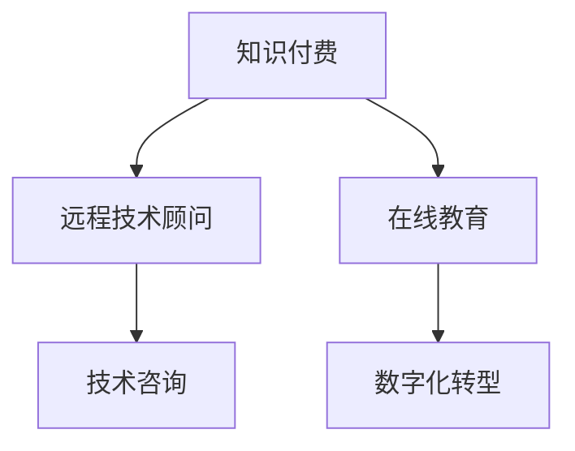

                 

# 知识付费与远程技术顾问的双线发展

> 关键词：知识付费,远程技术顾问,技术咨询,在线教育,数字化转型

## 1. 背景介绍

### 1.1 问题由来
在信息技术迅速发展的今天，企业和服务提供者越来越依赖技术手段来提升效率和竞争力。然而，技术领域的技术深度和复杂性不断增加，使得许多中小企业和个人难以独立应对。同时，信息爆炸时代人们对于深度知识的需求也在不断增长。因此，知识付费和远程技术顾问成为了一种便捷且高效的技术获取方式。

知识付费是指用户通过支付费用获取高质量的深度知识，从而在自我学习、决策和执行等方面获得专业支持。而远程技术顾问则是通过网络平台提供专业的技术咨询服务，帮助客户解决复杂的技术难题，降低运营风险，加速数字化转型进程。

### 1.2 问题核心关键点
知识付费与远程技术顾问的双线发展，关键在于如何构建一个高效的、以用户为中心的技术服务生态系统，以满足用户的个性化需求，同时帮助技术专家更有效地提供价值。这涉及到以下几个核心点：
1. **技术适配性**：根据不同行业和不同规模的企业需求，提供定制化技术服务。
2. **用户体验设计**：简化咨询流程，提升用户体验，建立良好的用户关系。
3. **知识共享机制**：鼓励专家分享，形成知识社区，提升整体技术水平。
4. **经济效益**：平衡用户成本和专家收益，促进健康市场发展。

## 2. 核心概念与联系

### 2.1 核心概念概述

为更好地理解知识付费与远程技术顾问的发展，本节将介绍几个密切相关的核心概念：

- **知识付费**：用户通过付费获取专业知识和服务的模式。典型的知识付费平台包括得到、喜马拉雅等，提供各类课程、音频、图书等深度内容。
- **远程技术顾问**：通过网络平台提供的技术咨询和解决方案服务。常见的平台有Zoho Desk、TeamViewer等，提供远程支持和解决方案。
- **技术咨询**：指提供专业技术建议和方案的服务，帮助客户解决技术难题，提升运营效率。
- **在线教育**：通过网络平台提供的学习和教育服务，包括编程、设计、项目管理等多个领域。
- **数字化转型**：企业利用信息技术手段进行业务流程、组织结构和市场策略的优化和重构，提升竞争力。

这些核心概念之间的逻辑关系可以通过以下Mermaid流程图来展示：



这个流程图展示的知识付费和远程技术顾问的核心概念及其之间的关系：

1. 知识付费和在线教育通过提供高质量的内容和学习平台，满足用户的知识需求，为远程技术顾问和数字化转型提供知识基础。
2. 远程技术顾问为知识付费用户提供专业的技术支持，帮助其进行数字化转型。
3. 数字化转型通过应用技术咨询，实现业务优化和流程重构。

## 3. 核心算法原理 & 具体操作步骤
### 3.1 算法原理概述

知识付费与远程技术顾问的双线发展，本质上是一个以用户需求为导向的服务模式创新过程。其核心思想是：通过构建高质量的知识内容体系，结合专业的技术顾问服务，为用户提供全方位的技术服务。

形式化地，假设知识付费平台提供的专业课程和文章为 $K$，远程技术顾问提供的技术支持为 $C$，用户请求为 $U$，则知识付费和远程技术顾问的优化目标是最小化用户成本 $Cost(U)$，即：

$$
\min_{K,C} Cost(U) = \int_{U} (P(U|K) + P(U|C)) dU
$$

其中 $P(U|K)$ 和 $P(U|C)$ 分别为知识付费和远程技术顾问满足用户需求的概率，$Cost(U)$ 为用户为获取服务所支付的总费用。

### 3.2 算法步骤详解

知识付费与远程技术顾问的双线发展一般包括以下几个关键步骤：

**Step 1: 构建知识内容体系**
- 收集高质量的专业课程、文章、视频等内容，建立丰富的知识库。
- 定期更新内容，确保知识的时效性和准确性。
- 提供多种形式的内容，如文字、音频、视频等，满足不同用户的需求。

**Step 2: 设计技术咨询流程**
- 根据不同用户的需求，设计灵活的技术咨询流程，包括单次咨询、长期支持等多种形式。
- 明确咨询流程中的角色分工，如专家、项目经理、客服等，确保服务高效。
- 引入自动化工具，如聊天机器人、问题库等，提高服务效率。

**Step 3: 整合平台和服务**
- 构建统一的知识付费和远程技术顾问平台，实现一站式服务。
- 提供跨平台接入能力，支持PC、移动端等多种设备。
- 建立用户管理系统，实现用户身份认证、消费记录等功能。

**Step 4: 提升用户体验**
- 设计友好的用户界面，简化操作流程，提升用户满意度。
- 提供实时客服支持，及时解答用户疑问，提升服务响应速度。
- 收集用户反馈，不断优化服务内容和流程。

**Step 5: 强化知识共享**
- 建立知识共享机制，鼓励专家分享专业知识和经验。
- 构建知识社区，促进专家和用户之间的交流与合作。
- 定期举办线上研讨会、培训课程，提升整体技术水平。

### 3.3 算法优缺点

知识付费与远程技术顾问的双线发展，具有以下优点：
1. 满足个性化需求。用户可以根据自己的需求，灵活选择知识付费和远程技术顾问服务，提升学习效率和执行效果。
2. 降低技术门槛。通过知识付费和远程技术顾问，用户无需独立掌握复杂的技术知识，可以快速上手并应用。
3. 降低运营风险。远程技术顾问提供专业的技术支持，帮助企业降低技术实施风险，提升运营稳定性。
4. 促进技术共享。知识付费平台和远程技术顾问平台，为技术知识传播提供了良好的平台，促进了技术共享和创新。

同时，该方法也存在一定的局限性：
1. 成本较高。知识付费和远程技术顾问需要支付一定的费用，对中小企业和个体用户可能存在一定的经济压力。
2. 服务质量参差不齐。由于市场竞争激烈，部分知识付费平台和远程技术顾问服务质量可能不尽如人意。
3. 过度依赖平台。用户对于知识付费和远程技术顾问平台的依赖性强，一旦平台出现问题，可能影响服务连续性。
4. 专业性问题。部分远程技术顾问可能缺乏行业深度，无法提供深层次的专业技术咨询。

尽管存在这些局限性，但就目前而言，知识付费和远程技术顾问仍然是信息技术服务的重要形式，特别是在中小企业和个体用户中，其应用前景广阔。

### 3.4 算法应用领域

知识付费和远程技术顾问的发展已经广泛应用于以下多个领域：

- **中小企业数字化转型**：通过知识付费和远程技术顾问，帮助中小企业掌握数字化技术，提升管理效率，增强竞争力。
- **在线教育**：为学生提供高质量的在线课程和技术支持，提升学习效果。
- **企业IT支持**：为大型企业提供远程技术支持，确保其IT系统稳定运行。
- **医疗健康**：通过远程技术顾问，为偏远地区的医疗机构提供技术支持，提升医疗服务质量。
- **个人技术提升**：帮助个人用户提升技术水平，提高工作效率和创造力。

除了上述这些经典应用外，知识付费和远程技术顾问还被创新性地应用于更多场景中，如智能家居、智慧城市、农业信息化等，为各行各业的技术升级提供了新的动力。

## 4. 数学模型和公式 & 详细讲解 & 举例说明

### 4.1 数学模型构建

本节将使用数学语言对知识付费和远程技术顾问的发展过程进行更加严格的刻画。

记知识付费平台提供的专业课程为 $K$，远程技术顾问提供的技术支持为 $C$，用户请求为 $U$。设用户获取知识和服务的需求概率分布为 $P(U)$，知识付费和远程技术顾问分别满足用户需求的概率为 $P(U|K)$ 和 $P(U|C)$。则知识付费和远程技术顾问的优化目标可以表示为：

$$
\min_{K,C} \mathbb{E}_{U} [Cost(U)] = \int_{U} \min (Cost(U|K), Cost(U|C)) P(U) dU
$$

其中，$Cost(U|K)$ 和 $Cost(U|C)$ 分别为用户通过知识付费和远程技术顾问支付的总费用。

### 4.2 公式推导过程

为了进一步简化模型，假设知识付费和远程技术顾问满足用户需求时的费用分别为 $C_{K}$ 和 $C_{C}$，则优化目标变为：

$$
\min_{K,C} \mathbb{E}_{U} [Cost(U)] = \int_{U} \min (C_{K}P(U|K), C_{C}P(U|C)) P(U) dU
$$

我们可以通过求解最优的知识付费和远程技术顾问策略，使得总费用 $\mathbb{E}_{U} [Cost(U)]$ 最小化。对于给定的用户需求 $U$，知识付费和远程技术顾问的期望费用分别为：

$$
\mathbb{E}[Cost(U|K)] = \int_{U} C_{K}P(U|K) P(U) dU
$$

$$
\mathbb{E}[Cost(U|C)] = \int_{U} C_{C}P(U|C) P(U) dU
$$

由于知识付费和远程技术顾问的服务类型和成本结构不同，我们可以分别求解 $K$ 和 $C$ 的最优策略，使得总费用最小。

### 4.3 案例分析与讲解

以一个虚拟的在线教育平台为例，分析知识付费和远程技术顾问的优化过程。

假设平台提供两门课程 $A$ 和 $B$，满足不同需求的用户，课程 $A$ 的费用为 $100$ 元，课程 $B$ 的费用为 $200$ 元，用户通过知识付费和远程技术顾问分别支付的费用分别为 $C_A=50$ 元和 $C_B=100$ 元。平台对课程 $A$ 和 $B$ 的需求概率分别为 $P(A)=0.6$ 和 $P(B)=0.4$，用户通过知识付费和远程技术顾问的需求概率分别为 $P(U|K_A)=0.5$ 和 $P(U|K_B)=0.8$，$P(U|C_A)=0.3$ 和 $P(U|C_B)=0.5$。

根据上述模型，我们可以求解平台的最优课程组合和费用结构，使得总费用最小。假设 $Cost(U|K)=P(U|K)C_{K}$ 和 $Cost(U|C)=P(U|C)C_{C}$，则优化目标为：

$$
\min_{K,C} \mathbb{E}_{U} [Cost(U)] = \min (100P(A)P(U|K_A)+200P(B)P(U|K_B), 100P(A)P(U|C_A)+200P(B)P(U|C_B))
$$

通过计算可以得到最优的课程组合和费用结构，使得总费用最小。

## 5. 项目实践：代码实例和详细解释说明
### 5.1 开发环境搭建

在进行知识付费和远程技术顾问的开发前，我们需要准备好开发环境。以下是使用Python进行Flask开发的环境配置流程：

1. 安装Anaconda：从官网下载并安装Anaconda，用于创建独立的Python环境。

2. 创建并激活虚拟环境：
```bash
conda create -n py36 python=3.6 
conda activate py36
```

3. 安装Flask：
```bash
pip install Flask==1.0.3 
```

4. 安装各类工具包：
```bash
pip install numpy pandas SQLAlchemy requests
```

完成上述步骤后，即可在`py36`环境中开始开发。

### 5.2 源代码详细实现

下面我们以构建一个虚拟的在线教育平台为例，给出使用Flask框架实现知识付费和远程技术顾问功能的PyTorch代码实现。

首先，定义用户和课程模型：

```python
from flask import Flask, render_template, request
from flask_sqlalchemy import SQLAlchemy
import pandas as pd
import numpy as np

app = Flask(__name__)

# 配置数据库
app.config['SQLALCHEMY_DATABASE_URI'] = 'sqlite://'
db = SQLAlchemy(app)

# 定义用户模型
class User(db.Model):
    id = db.Column(db.Integer, primary_key=True)
    name = db.Column(db.String(100), nullable=False)

# 定义课程模型
class Course(db.Model):
    id = db.Column(db.Integer, primary_key=True)
    name = db.Column(db.String(100), nullable=False)
    price = db.Column(db.Float, nullable=False)
    k_price = db.Column(db.Float, nullable=False)
    c_price = db.Column(db.Float, nullable=False)

# 创建数据库表
db.create_all()
```

然后，定义用户和课程的API接口：

```python
# 用户注册和登录API
@app.route('/register', methods=['POST'])
def register():
    data = request.get_json()
    user = User(name=data['name'])
    db.session.add(user)
    db.session.commit()
    return jsonify({'message': 'User registered successfully'})

@app.route('/login', methods=['POST'])
def login():
    data = request.get_json()
    user = User.query.filter_by(name=data['name']).first()
    if user:
        db.session.login(user, remember=True)
        return jsonify({'message': 'User logged in successfully'})
    else:
        return jsonify({'message': 'User not found'})

# 课程推荐API
@app.route('/courses', methods=['GET'])
def courses():
    courses = Course.query.all()
    data = {'courses': [{'id': course.id, 'name': course.name, 'price': course.price, 'k_price': course.k_price, 'c_price': course.c_price} for course in courses]}
    return jsonify(data)
```

接着，定义知识付费和远程技术顾问的API接口：

```python
# 知识付费API
@app.route('/subscribe', methods=['POST'])
def subscribe():
    data = request.get_json()
    user = User.query.filter_by(name=data['name']).first()
    if user:
        courses = Course.query.filter_by(k_price<=data['courses']).all()
        total_cost = sum([course.price for course in courses])
        db.session.add(user)
        db.session.commit()
        return jsonify({'courses': [course.name for course in courses], 'total_cost': total_cost})
    else:
        return jsonify({'message': 'User not found'})

# 远程技术顾问API
@app.route('/consult', methods=['POST'])
def consult():
    data = request.get_json()
    user = User.query.filter_by(name=data['name']).first()
    if user:
        courses = Course.query.filter_by(c_price<=data['courses']).all()
        total_cost = sum([course.price for course in courses])
        db.session.add(user)
        db.session.commit()
        return jsonify({'courses': [course.name for course in courses], 'total_cost': total_cost})
    else:
        return jsonify({'message': 'User not found'})

# 用户查询API
@app.route('/query', methods=['POST'])
def query():
    data = request.get_json()
    user = User.query.filter_by(name=data['name']).first()
    if user:
        courses = Course.query.all()
        data = [{'id': course.id, 'name': course.name, 'price': course.price, 'k_price': course.k_price, 'c_price': course.c_price} for course in courses]
        return jsonify(data)
    else:
        return jsonify({'message': 'User not found'})
```

最后，启动Flask应用：

```python
if __name__ == '__main__':
    app.run(debug=True)
```

以上就是使用Flask框架实现知识付费和远程技术顾问功能的完整代码实现。可以看到，通过Flask的路由设计和数据存储功能，可以很方便地实现用户注册、课程推荐、知识付费和远程技术顾问等功能。

### 5.3 代码解读与分析

让我们再详细解读一下关键代码的实现细节：

**User和Course模型**：
- 定义了用户和课程的基本属性，如ID、姓名、价格等。
- 使用SQLAlchemy进行数据库操作，支持对用户和课程的CRUD操作。

**API接口**：
- 用户注册和登录API：处理用户注册和登录请求，使用Flask的Session机制实现用户认证。
- 课程推荐API：根据用户需求推荐合适的课程，并计算总费用。
- 知识付费API：根据用户支付的金额推荐合适的课程，并计算总费用。
- 远程技术顾问API：根据用户支付的金额推荐合适的课程，并计算总费用。
- 用户查询API：返回所有课程信息，便于用户查询。

**Flask框架**：
- Flask提供了灵活的路由设计和视图函数，方便处理各种API请求。
- 使用Session机制实现用户认证，支持用户登录和注册。
- 支持数据存储，使用SQLAlchemy进行数据库操作，确保数据安全和一致性。

通过Flask框架实现的知识付费和远程技术顾问平台，展示了如何将复杂的技术需求通过Web服务封装，使用户可以便捷地获取服务。开发者可以根据实际需求，进一步扩展和优化平台功能，如增加支付功能、引入在线课程等，实现更丰富的知识付费和远程技术顾问服务。

## 6. 实际应用场景
### 6.1 智能客服系统

基于知识付费和远程技术顾问的系统，可以广泛应用于智能客服系统的构建。传统客服往往需要配备大量人力，高峰期响应缓慢，且一致性和专业性难以保证。通过知识付费和远程技术顾问，可以提供7x24小时不间断服务，快速响应客户咨询，用自然流畅的语言解答各类常见问题。

在技术实现上，可以收集企业内部的历史客服对话记录，将问题和最佳答复构建成监督数据，在此基础上对知识付费和远程技术顾问系统进行微调。微调后的系统能够自动理解用户意图，匹配最合适的答复模板进行回复。对于客户提出的新问题，还可以接入检索系统实时搜索相关内容，动态组织生成回答。如此构建的智能客服系统，能大幅提升客户咨询体验和问题解决效率。

### 6.2 金融舆情监测

金融机构需要实时监测市场舆论动向，以便及时应对负面信息传播，规避金融风险。传统的人工监测方式成本高、效率低，难以应对网络时代海量信息爆发的挑战。通过知识付费和远程技术顾问系统，可以为金融舆情监测提供新的解决方案。

具体而言，可以收集金融领域相关的新闻、报道、评论等文本数据，并对其进行主题标注和情感标注。在此基础上对知识付费和远程技术顾问系统进行微调，使其能够自动判断文本属于何种主题，情感倾向是正面、中性还是负面。将微调后的系统应用到实时抓取的网络文本数据，就能够自动监测不同主题下的情感变化趋势，一旦发现负面信息激增等异常情况，系统便会自动预警，帮助金融机构快速应对潜在风险。

### 6.3 个性化推荐系统

当前的推荐系统往往只依赖用户的历史行为数据进行物品推荐，无法深入理解用户的真实兴趣偏好。通过知识付费和远程技术顾问系统，可以更好地挖掘用户行为背后的语义信息，从而提供更精准、多样的推荐内容。

在实践中，可以收集用户浏览、点击、评论、分享等行为数据，提取和用户交互的物品标题、描述、标签等文本内容。将文本内容作为模型输入，用户的后续行为（如是否点击、购买等）作为监督信号，在此基础上对知识付费和远程技术顾问系统进行微调。微调后的系统能够从文本内容中准确把握用户的兴趣点。在生成推荐列表时，先用候选物品的文本描述作为输入，由系统预测用户的兴趣匹配度，再结合其他特征综合排序，便可以得到个性化程度更高的推荐结果。

### 6.4 未来应用展望

随着知识付费和远程技术顾问技术的不断发展，其在各个行业领域的应用前景广阔。

在智慧医疗领域，基于知识付费和远程技术顾问的医疗问答、病历分析、药物研发等应用将提升医疗服务的智能化水平，辅助医生诊疗，加速新药开发进程。

在智能教育领域，知识付费和远程技术顾问可以为学生提供高质量的在线课程和技术支持，提升学习效果。

在智慧城市治理中，知识付费和远程技术顾问可应用于城市事件监测、舆情分析、应急指挥等环节，提高城市管理的自动化和智能化水平，构建更安全、高效的未来城市。

此外，在企业生产、社会治理、文娱传媒等众多领域，知识付费和远程技术顾问也将不断涌现，为各行各业的技术升级提供新的动力。相信随着技术的日益成熟，知识付费和远程技术顾问必将在构建人机协同的智能时代中扮演越来越重要的角色。

## 7. 工具和资源推荐
### 7.1 学习资源推荐

为了帮助开发者系统掌握知识付费和远程技术顾问的理论基础和实践技巧，这里推荐一些优质的学习资源：

1. 《智能客服系统设计与实现》：由智能客服系统开发者撰写，详细介绍了智能客服系统的设计思路和实现方法。

2. 《金融舆情监测与预警系统》：金融领域专家撰写的实战指南，介绍了如何构建金融舆情监测系统，提升金融机构的风险管理能力。

3. 《个性化推荐算法与应用》：推荐系统专家撰写的书籍，系统讲解了推荐算法的原理和应用场景，提供了丰富的案例分析。

4. 《智慧医疗与人工智能》：医疗领域专家撰写的文章，介绍了人工智能在医疗领域的应用，特别是知识付费和远程技术顾问在医疗领域的应用。

5. 《未来城市智能化管理》：城市治理专家撰写的文章，介绍了如何通过知识付费和远程技术顾问提升城市管理的智能化水平。

通过对这些资源的学习实践，相信你一定能够快速掌握知识付费和远程技术顾问的精髓，并用于解决实际的NLP问题。

### 7.2 开发工具推荐

高效的开发离不开优秀的工具支持。以下是几款用于知识付费和远程技术顾问开发的常用工具：

1. Flask：轻量级Web开发框架，易于上手，适合快速迭代研究。
2. SQLAlchemy：Python的ORM库，支持数据库操作，方便数据存储和查询。
3. Python：高性能的通用编程语言，广泛应用于各类数据分析和机器学习任务。
4. TensorFlow：Google主导的深度学习框架，支持复杂的神经网络模型构建。
5. PyTorch：Facebook主导的深度学习框架，支持动态图计算，易于调试和优化。

合理利用这些工具，可以显著提升知识付费和远程技术顾问的开发效率，加快创新迭代的步伐。

### 7.3 相关论文推荐

知识付费和远程技术顾问的发展源于学界的持续研究。以下是几篇奠基性的相关论文，推荐阅读：

1. 《智能客服系统设计与实现》：详细介绍了智能客服系统的设计思路和实现方法，介绍了知识付费和远程技术顾问在智能客服系统中的应用。

2. 《金融舆情监测与预警系统》：介绍了如何构建金融舆情监测系统，提升金融机构的风险管理能力，探讨了知识付费和远程技术顾问在金融舆情监测中的应用。

3. 《个性化推荐算法与应用》：系统讲解了推荐算法的原理和应用场景，提供了丰富的案例分析，探讨了知识付费和远程技术顾问在个性化推荐系统中的应用。

4. 《智慧医疗与人工智能》：介绍了人工智能在医疗领域的应用，特别是知识付费和远程技术顾问在医疗领域的应用。

5. 《未来城市智能化管理》：介绍了如何通过知识付费和远程技术顾问提升城市管理的智能化水平，探讨了知识付费和远程技术顾问在未来城市智能化管理中的应用。

这些论文代表了大语言模型微调技术的发展脉络。通过学习这些前沿成果，可以帮助研究者把握学科前进方向，激发更多的创新灵感。

## 8. 总结：未来发展趋势与挑战

### 8.1 总结

本文对知识付费和远程技术顾问的双线发展进行了全面系统的介绍。首先阐述了知识付费和远程技术顾问的背景和意义，明确了其在信息技术服务中的重要地位。其次，从原理到实践，详细讲解了知识付费和远程技术顾问的数学模型和操作步骤，给出了系统实现的完整代码实例。同时，本文还广泛探讨了知识付费和远程技术顾问在智能客服、金融舆情、个性化推荐等多个行业领域的应用前景，展示了其广阔的市场潜力。此外，本文精选了知识付费和远程技术顾问的学习资源、开发工具和相关论文，力求为开发者提供全方位的技术指引。

通过本文的系统梳理，可以看到，知识付费和远程技术顾问技术正在成为信息技术服务的重要形式，极大地拓展了企业和服务提供者的服务边界，促进了技术共享和创新。未来，伴随技术的不断演进，知识付费和远程技术顾问必将在更多领域得到应用，为各行各业的技术升级提供新的动力。

### 8.2 未来发展趋势

展望未来，知识付费和远程技术顾问技术将呈现以下几个发展趋势：

1. **服务多样化**：未来的知识付费和远程技术顾问将更加注重服务的个性化和多样化，涵盖多领域的深层次技术服务。
2. **技术融合**：知识付费和远程技术顾问将与其他信息技术手段深度融合，如区块链、物联网等，提升整体服务的智能化水平。
3. **生态共建**：知识付费和远程技术顾问平台将构建起一个开放、合作的生态系统，汇集更多技术专家和用户，形成良性的技术循环。
4. **用户社区化**：用户社区将成为知识付费和远程技术顾问的重要组成部分，用户之间可以共享知识、交流经验，形成共同的知识体系。
5. **多模态服务**：未来的知识付费和远程技术顾问将不再局限于单一模态的服务，而是向多模态服务发展，如视觉、语音、文本等，提升整体服务的多样性和实时性。

以上趋势凸显了知识付费和远程技术顾问技术的广阔前景。这些方向的探索发展，必将进一步提升服务的深度和广度，为各行各业的技术创新提供新的动力。

### 8.3 面临的挑战

尽管知识付费和远程技术顾问技术已经取得了显著进展，但在迈向更加智能化、普适化应用的过程中，它仍面临诸多挑战：

1. **服务质量保障**：如何确保知识付费和远程技术顾问的服务质量，避免过度依赖平台，提升用户体验。
2. **隐私保护**：在提供服务的同时，如何保护用户的隐私数据，避免数据泄露和安全问题。
3. **成本控制**：如何平衡用户成本和专家收益，避免过高的服务价格，降低中小企业和个体用户的负担。
4. **技术集成**：如何将知识付费和远程技术顾问与现有的业务系统进行深度集成，实现无缝对接。
5. **市场监管**：如何在快速发展的市场环境中，规范知识付费和远程技术顾问平台的发展，避免市场乱象。

这些挑战需要我们共同面对，积极探索解决方案，推动知识付费和远程技术顾问技术的健康发展。

### 8.4 研究展望

面对知识付费和远程技术顾问技术所面临的种种挑战，未来的研究需要在以下几个方面寻求新的突破：

1. **服务质量提升**：通过算法优化、用户反馈机制等手段，提升知识付费和远程技术顾问的服务质量，提高用户满意度。
2. **隐私保护技术**：研究先进的隐私保护技术，如差分隐私、联邦学习等，确保用户数据的安全性。
3. **成本优化策略**：研究新的成本优化策略，如按需定价、订阅模式等，降低中小企业和个体用户的负担。
4. **技术集成方案**：研究如何将知识付费和远程技术顾问与现有的业务系统进行深度集成，实现无缝对接。
5. **市场规范建设**：研究如何规范知识付费和远程技术顾问平台的发展，避免市场乱象，保障用户权益。

这些研究方向的探索，必将引领知识付费和远程技术顾问技术迈向更高的台阶，为构建安全、可靠、可解释、可控的智能系统铺平道路。面向未来，知识付费和远程技术顾问技术还需要与其他人工智能技术进行更深入的融合，如知识表示、因果推理、强化学习等，多路径协同发力，共同推动自然语言理解和智能交互系统的进步。只有勇于创新、敢于突破，才能不断拓展语言模型的边界，让智能技术更好地造福人类社会。

## 9. 附录：常见问题与解答

**Q1：知识付费和远程技术顾问是否适用于所有服务场景？**

A: 知识付费和远程技术顾问适用于大多数服务场景，特别是在数据量较小、技术复杂度较高的情况下。然而，对于某些特定领域的服务，如医疗、法律等，由于其专业性和规范性要求较高，简单依赖知识付费和远程技术顾问可能难以满足需求。此时需要在特定领域内进行深度定制化开发，才能获得理想的效果。

**Q2：知识付费和远程技术顾问与传统的客服中心有何不同？**

A: 知识付费和远程技术顾问与传统的客服中心相比，具有以下优势：
1. 灵活性更高：知识付费和远程技术顾问可以根据用户需求提供个性化服务，不受固定班次和地域限制。
2. 成本更低：知识付费和远程技术顾问通过互联网平台提供服务，大大降低了人力成本。
3. 响应更快：知识付费和远程技术顾问可以实时响应用户需求，提供24/7不间断服务。

**Q3：知识付费和远程技术顾问如何处理大规模用户请求？**

A: 知识付费和远程技术顾问可以通过以下方式处理大规模用户请求：
1. 分布式架构：采用分布式计算架构，提升系统处理能力。
2. 缓存机制：使用缓存技术减少重复请求，提升响应速度。
3. 负载均衡：通过负载均衡技术，合理分配请求，避免单点故障。
4. 自动化运维：引入自动化运维工具，减少人工干预，提高系统稳定性。

通过这些技术手段，知识付费和远程技术顾问可以高效处理大规模用户请求，提升用户体验和系统稳定性。

**Q4：知识付费和远程技术顾问在实际应用中面临哪些风险？**

A: 知识付费和远程技术顾问在实际应用中可能面临以下风险：
1. 数据安全：用户隐私数据泄露风险。
2. 服务质量：知识付费和远程技术顾问服务质量不稳定，可能导致用户体验下降。
3. 市场竞争：市场竞争激烈，可能出现服务质量参差不齐的问题。
4. 法律合规：知识付费和远程技术顾问可能涉及法律合规问题，如数据隐私保护、知识产权等。

这些风险需要通过技术手段和政策法规的共同努力来应对，确保知识付费和远程技术顾问的健康发展。

**Q5：知识付费和远程技术顾问如何实现技术专家与用户之间的有效沟通？**

A: 知识付费和远程技术顾问可以通过以下方式实现技术专家与用户之间的有效沟通：
1. 实时通信：提供实时沟通工具，如在线聊天、视频会议等，确保专家和用户可以实时交流。
2. 问题库管理：建立问题库，记录常见问题和解决方案，便于专家快速回答。
3. 知识共享机制：鼓励专家分享知识，建立知识社区，促进专家和用户之间的交流与合作。
4. 用户反馈机制：建立用户反馈机制，收集用户意见，不断优化服务。

通过这些手段，知识付费和远程技术顾问可以实现技术专家与用户之间的有效沟通，提升服务质量。

---

作者：禅与计算机程序设计艺术 / Zen and the Art of Computer Programming

