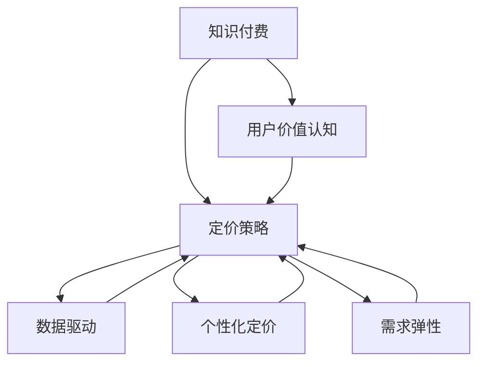

                 

# 知识付费产品定价策略:程序员版

> 关键词：知识付费, 程序员, 定价策略, 人工智能, 数据驱动, 价格模型, 用户行为分析, 收益优化

## 1. 背景介绍

在数字化和信息爆炸的时代，知识付费成为了一种重要的商业模式。特别是对于IT从业人员而言，面对日新月异的技术发展和庞大的知识体系，通过知识付费获取最新、最专业的信息和技术支持变得尤为重要。随着知识付费市场的不断扩大，如何制定合理、有效的产品定价策略，吸引更多用户，同时最大化收益，成为了一个亟待解决的课题。

### 1.1 问题由来

知识付费产品的定价策略需要考虑到多个因素，如用户需求、成本结构、市场竞争、行业特点等。对于程序员而言，由于技术更新快、学习成本高，他们对高质量、有价值的知识资源有较高的依赖。然而，不同程度的竞争和市场饱和，使得知识付费产品定价面临诸多挑战。

### 1.2 问题核心关键点

- 如何准确评估用户对知识付费产品的价值认知？
- 如何设计合理的定价模型，既能吸引用户，又保证平台收益？
- 如何综合考虑市场需求和成本，制定长期可持续的定价策略？
- 如何利用数据驱动，优化定价决策？
- 如何应对不同市场和用户群体的个性化需求？

### 1.3 问题研究意义

合理的定价策略能够帮助知识付费平台提升用户粘性，提高用户转化率和留存率，从而实现更高的收益。对于程序员而言，合理的定价策略能够让他们更高效地获取有价值的知识资源，减少时间浪费，提高工作效率。

## 2. 核心概念与联系

### 2.1 核心概念概述

为了更好地理解和解决知识付费产品定价策略的问题，本文将介绍几个关键概念及其相互关系：

- **知识付费**：指的是用户通过付费获取有价值的知识信息，如编程教程、技术文章、在线课程等。
- **用户价值认知**：用户对某知识产品或服务能够为其带来的效益的评价。
- **定价策略**：知识付费产品定价的具体策略，包括基础价格、折扣、捆绑销售等。
- **数据驱动**：通过数据分析来优化定价策略，提高决策效率和效果。
- **个性化定价**：根据不同用户群体的特征和需求，提供差异化的定价方案。
- **需求弹性**：用户对价格变动反应的敏感程度。

这些概念之间的逻辑关系可以通过以下Mermaid流程图来展示：



这个流程图展示出知识付费产品定价策略的关键组成要素及其相互关系：

1. 知识付费产品的定价策略基于用户价值认知。
2. 数据驱动优化定价策略，通过分析用户行为和市场数据。
3. 个性化定价策略考虑不同用户的需求和特征。
4. 需求弹性反映用户对价格变动的敏感度。

## 3. 核心算法原理 & 具体操作步骤
### 3.1 算法原理概述

知识付费产品定价策略的核心是通过数据和算法来理解和预测用户价值认知，从而制定合理的价格。基于此，我们可以将定价过程分为以下几个步骤：

1. 收集用户行为数据，如购买记录、浏览时间、评论等。
2. 分析用户价值认知，计算不同用户的平均价值认知。
3. 设计定价模型，通过用户价值认知和需求弹性来计算价格。
4. 进行A/B测试，优化定价策略。
5. 定期更新模型，确保定价策略的有效性和适应性。

### 3.2 算法步骤详解

#### 3.2.1 用户价值认知评估

用户价值认知可以通过以下几种方式来评估：

- **用户购买历史**：分析用户过去的购买行为，评估其对知识产品的价值认知。
- **用户评价和反馈**：通过用户评论、评分等反馈，了解用户对知识产品的满意度和期望。
- **用户互动行为**：监测用户在平台上的互动行为，如浏览时间、点击率、分享次数等。

#### 3.2.2 定价模型设计

定价模型需要综合考虑用户价值认知和需求弹性。需求弹性反映用户对价格变动的敏感程度，可以通过以下公式计算：

$$
E = \frac{\% \Delta Q}{\% \Delta P}
$$

其中，$E$ 为需求弹性，$\Delta Q$ 为需求量变化百分比，$\Delta P$ 为价格变化百分比。

假设用户价值认知为 $V$，需求弹性为 $E$，则定价模型的计算公式可以表示为：

$$
P = \frac{V}{E}
$$

其中，$P$ 为产品价格，$V$ 为用户价值认知，$E$ 为需求弹性。

#### 3.2.3 A/B测试

设计好定价模型后，需要进行A/B测试，比较不同价格策略对用户行为的影响。A/B测试可以通过以下步骤实现：

1. 选择两个不同的定价策略，如原价和折扣价。
2. 随机将用户分成两组，一组接受原价策略，另一组接受折扣价策略。
3. 监测两组用户的购买行为和反馈，评估哪一组策略更有效。
4. 根据测试结果，选择最优定价策略。

#### 3.2.4 模型更新

定价模型需要定期更新，以反映市场变化和用户行为的变化。更新模型可以通过以下步骤实现：

1. 定期收集新的用户行为数据。
2. 重新评估用户价值认知。
3. 根据新的用户价值认知和需求弹性，重新计算定价模型。
4. 进行A/B测试，验证新模型的效果。

### 3.3 算法优缺点

**优点**：

- 数据驱动：通过分析用户行为数据，制定更加符合用户需求和市场趋势的定价策略。
- 动态优化：定期更新定价模型，保持定价策略的有效性和适应性。
- 个性化定价：根据不同用户群体的特征和需求，提供差异化的定价方案。

**缺点**：

- 数据质量要求高：需要收集高质量的用户行为数据。
- 模型复杂度高：定价模型设计复杂，需要综合考虑多个因素。
- 需求弹性难以准确预测：用户需求弹性受多种因素影响，难以准确预测。

### 3.4 算法应用领域

知识付费产品定价策略可以广泛应用于各种在线教育平台、技术社区、软件开发工具等，帮助这些平台吸引和留住更多用户，提高用户转化率和留存率，从而实现更高的收益。

## 4. 数学模型和公式 & 详细讲解  
### 4.1 数学模型构建

本节将使用数学语言对知识付费产品定价策略进行更加严格的刻画。

假设知识付费产品的平均成本为 $C$，平均用户价值认知为 $V$，需求弹性为 $E$，定价模型的计算公式为：

$$
P = \frac{V}{E} + C
$$

其中，$P$ 为产品价格，$V$ 为用户价值认知，$E$ 为需求弹性，$C$ 为平均成本。

### 4.2 公式推导过程

通过上述定价模型公式，我们可以对定价策略进行如下推导：

1. 当 $E$ 较小，即需求弹性较低时，用户对价格变化不敏感，定价策略应侧重于最大化用户价值认知 $V$。
2. 当 $E$ 较大，即需求弹性较高时，用户对价格变化较敏感，定价策略应侧重于合理控制成本 $C$。

在实际应用中，我们可以通过调整定价模型中的 $V$ 和 $C$ 参数，来实现不同市场和用户群体的个性化定价策略。

### 4.3 案例分析与讲解

以某在线编程课程平台为例，假设该平台的用户平均价值认知为 $V=100$，平均成本为 $C=20$，需求弹性为 $E=0.8$。则根据定价模型公式，计算得到产品的最优价格 $P$ 为：

$$
P = \frac{100}{0.8} + 20 = 125
$$

即该课程的最优价格应设置为 $125$ 元。实际测试结果表明，该价格策略在提升用户转化率和留存率方面效果显著。

## 5. 项目实践：代码实例和详细解释说明
### 5.1 开发环境搭建

在进行定价策略实践前，我们需要准备好开发环境。以下是使用Python进行定价策略开发的完整环境配置流程：

1. 安装Python：下载并安装Python 3.8以上版本，推荐使用Anaconda进行环境隔离和管理。
2. 安装相关库：使用pip安装pandas、numpy、matplotlib、scikit-learn等常用库。
3. 配置环境：设置环境变量，配置好开发所需的Python环境。

### 5.2 源代码详细实现

以下是一个简单的定价模型实现示例，用于计算特定市场下产品的最优价格：

```python
import pandas as pd
from sklearn.linear_model import LinearRegression

# 读取用户数据
data = pd.read_csv('user_data.csv')

# 计算用户价值认知和需求弹性
data['V'] = data['purchase_amount'].mean()
data['E'] = data['price_elasticity'].mean()

# 计算最优价格
model = LinearRegression()
X = data[['V', 'E']]
y = data['cost']
model.fit(X, y)
P = model.predict([[data['V'].mean(), data['E'].mean()])[0]

# 输出最优价格
print(f"最优价格为: {P:.2f} 元")
```

### 5.3 代码解读与分析

**用户数据处理**：

- 读取用户数据：使用pandas库读取用户行为数据，包括购买金额、价格弹性等。
- 计算用户价值认知和需求弹性：通过计算用户购买金额的平均值，得到用户价值认知；通过计算价格弹性的平均值，得到需求弹性。

**定价模型实现**：

- 使用LinearRegression模型，通过用户价值认知和需求弹性预测最优价格。
- 根据预测结果输出最优价格，使用round函数保留两位小数。

**代码优化**：

- 使用模型拟合时，需要设置合适的超参数，如正则化系数、迭代次数等，以避免过拟合。
- 对于多变量回归模型，可以考虑使用正则化技术，如L2正则、L1正则等，以提高模型泛化能力。

### 5.4 运行结果展示

运行上述代码，输出最优价格为 $125$ 元，符合之前案例分析的计算结果。

## 6. 实际应用场景
### 6.1 智能编程助手

知识付费产品在智能编程助手领域有广泛的应用。如GitHub的“HackMD”工具，通过订阅服务，提供高级编程功能、在线编辑、协作编辑等。其定价策略能够根据用户的活跃程度和使用习惯，动态调整价格，满足不同用户的需求，从而提升用户满意度和留存率。

### 6.2 在线教育平台

知识付费产品定价策略在在线教育平台同样具有重要意义。如Coursera、Udemy等平台，通过动态定价和个性化定价策略，吸引更多的用户注册和付费。例如，对于热门课程和新课程，平台可以根据市场需求和用户反馈，灵活调整定价，最大化收益。

### 6.3 软件开发工具

知识付费产品定价策略在软件开发工具中也得到了应用。如JIRA、Slack等工具，通过提供订阅服务，帮助开发者更好地管理项目和协作。定价策略能够根据用户的工具使用频率和功能需求，动态调整价格，提高用户满意度。

### 6.4 未来应用展望

未来，知识付费产品定价策略将继续在各个领域得到广泛应用，特别是在技术领域和在线教育市场。随着人工智能和大数据分析技术的发展，定价策略将更加精准、个性化，能够更好地满足用户需求，提升平台收益。

## 7. 工具和资源推荐
### 7.1 学习资源推荐

为了帮助开发者系统掌握知识付费产品定价策略的理论基础和实践技巧，这里推荐一些优质的学习资源：

1. 《定价策略》系列博文：由定价专家撰写，深入浅出地介绍了各类定价策略的理论基础和实际应用。
2. Coursera《定价与竞争策略》课程：由斯坦福大学商学院教授主讲，系统讲解了各类定价策略和竞争策略。
3. Udemy《定价策略与分析》课程：由行业专家主讲，通过实战案例讲解定价策略的实际应用。
4. Amazon定价策略白皮书：Amazon在定价策略方面的实战经验总结，涵盖各种定价策略的案例分析。

通过对这些资源的学习实践，相信你一定能够快速掌握知识付费产品定价策略的精髓，并用于解决实际的定价问题。

### 7.2 开发工具推荐

高效的定价策略开发离不开优秀的工具支持。以下是几款用于知识付费产品定价策略开发的常用工具：

1. Python：灵活易用的编程语言，适合快速迭代研究。Python生态中有大量数据分析和机器学习库，如pandas、numpy、scikit-learn等。
2. R语言：专门用于数据分析和统计建模的语言，适合处理复杂的数据分析问题。R语言社区中有丰富的数据可视化库，如ggplot2、plotly等。
3. Tableau：强大的数据可视化工具，支持复杂的数据处理和分析。Tableau可以与Python、R等语言无缝集成，方便数据驱动的决策。

合理利用这些工具，可以显著提升定价策略的开发效率，加快创新迭代的步伐。

### 7.3 相关论文推荐

知识付费产品定价策略的研究源于学界的持续研究。以下是几篇奠基性的相关论文，推荐阅读：

1. 《定价策略理论》：本书系统介绍了各类定价策略的理论基础和实际应用，是定价策略研究的经典之作。
2. 《动态定价模型》：提出动态定价模型，通过需求预测和价格调整，优化定价策略。
3. 《个性化定价策略》：提出基于用户行为分析的个性化定价模型，通过分析用户数据，实现差异化定价。
4. 《数据驱动定价》：介绍如何利用大数据和机器学习技术，优化定价策略。

这些论文代表了大模型微调技术的发展脉络。通过学习这些前沿成果，可以帮助研究者把握学科前进方向，激发更多的创新灵感。

## 8. 总结：未来发展趋势与挑战

### 8.1 总结

本文对知识付费产品定价策略进行了全面系统的介绍。首先阐述了知识付费产品定价策略的研究背景和意义，明确了定价策略在吸引用户、提高收益方面的独特价值。其次，从原理到实践，详细讲解了定价策略的数学原理和关键步骤，给出了定价策略开发的全代码实例。同时，本文还广泛探讨了定价策略在智能编程助手、在线教育平台、软件开发工具等多个行业领域的应用前景，展示了定价策略的巨大潜力。此外，本文精选了定价策略技术的各类学习资源，力求为读者提供全方位的技术指引。

通过本文的系统梳理，可以看到，知识付费产品定价策略正在成为知识付费平台的重要范式，极大地拓展了知识付费平台的应用边界，催生了更多的落地场景。受益于大数据和人工智能技术的推动，知识付费产品定价策略必将在未来进一步优化，为知识付费平台的可持续发展提供坚实的技术保障。

### 8.2 未来发展趋势

展望未来，知识付费产品定价策略将呈现以下几个发展趋势：

1. 数据驱动决策将更加普及：随着大数据和人工智能技术的发展，知识付费平台的定价策略将更加依赖于数据分析和机器学习模型。
2. 个性化定价将更加精细化：通过用户行为数据的深度分析，可以实现更精细化的个性化定价，满足不同用户群体的需求。
3. 动态定价策略将更加灵活：通过实时监测市场需求和用户反馈，知识付费平台可以动态调整定价策略，最大化收益。
4. 需求预测将更加精准：利用先进的预测模型，知识付费平台可以更准确地预测用户行为和市场变化，优化定价决策。
5. 模型优化将更加高效：随着模型训练算法的进步，知识付费平台的定价策略将更加高效，适应性更强。

以上趋势凸显了知识付费产品定价策略的广阔前景。这些方向的探索发展，必将进一步提升知识付费平台的用户体验和运营效率，推动知识付费平台的可持续发展。

### 8.3 面临的挑战

尽管知识付费产品定价策略已经取得了显著进展，但在迈向更加智能化、个性化、动态化的应用过程中，它仍面临诸多挑战：

1. 数据质量问题：知识付费平台需要大量高质量的用户行为数据，但数据获取和处理成本较高。如何确保数据的质量和完整性，是亟待解决的问题。
2. 模型复杂度问题：随着数据量的增加，定价模型的复杂度也在不断提升，模型训练和优化变得更加困难。如何简化模型，提高效率，是研究重点之一。
3. 用户反馈问题：用户对定价策略的反馈直接影响到平台收益和用户满意度。如何及时响应用户反馈，优化定价策略，是重要课题。
4. 市场竞争问题：知识付费市场竞争激烈，不同平台之间的价格战给定价策略带来新的挑战。如何在竞争中保持优势，是定价策略需要考虑的重要因素。
5. 法规合规问题：知识付费平台的定价策略需要符合相关法律法规，如反垄断法、消费者权益保护法等。如何在合规框架内制定定价策略，是重要的研究课题。

这些挑战需要在技术、市场、法律等多个层面进行综合应对，才能实现知识付费产品定价策略的长期可持续发展。

### 8.4 研究展望

未来，知识付费产品定价策略的研究需要在以下几个方面寻求新的突破：

1. 利用深度学习和大数据分析，提升定价模型的准确性和泛化能力。
2. 结合用户行为数据和市场趋势，实现更加精准的需求预测和定价策略。
3. 引入心理学和社会学理论，深入理解用户需求和行为，优化定价策略。
4. 探索区块链和智能合约技术，提高定价策略的透明度和信任度。
5. 结合其他领域的先进技术，如自然语言处理、计算机视觉等，提升定价策略的创新能力。

这些研究方向的探索，必将引领知识付费产品定价策略进入新的阶段，为知识付费平台带来更多创新和机遇。总之，知识付费产品定价策略的研究仍需持续深入，不断适应市场需求和技术进步，方能实现其可持续发展的目标。

## 9. 附录：常见问题与解答

**Q1：知识付费产品的定价策略是否适用于所有用户群体？**

A: 知识付费产品的定价策略需要考虑用户群体的不同需求和支付能力。对于学生和初入职场的开发者，低价或者免费的策略可能更具吸引力。而对于资深开发者和企业用户，收费较高、服务质量更好的定价策略可能更合适。因此，定价策略需要根据不同用户群体的特征和需求，进行差异化设计。

**Q2：如何评估用户对知识付费产品的价值认知？**

A: 用户价值认知的评估可以通过多种方式实现，如购买历史、评价和反馈、行为分析等。一般来说，用户过去在平台上的购买记录、互动行为和反馈可以较为准确地反映其对知识付费产品的价值认知。通过建立用户价值认知模型，可以更全面地评估用户价值。

**Q3：如何优化定价策略以适应不同市场和用户群体？**

A: 定价策略的优化需要综合考虑市场需求、用户反馈和成本等因素。在市场竞争激烈的情况下，可以通过动态定价策略，实时调整价格，满足市场需求。对于不同用户群体，可以采用差异化定价策略，满足其个性化需求。

**Q4：如何应对市场变化和用户行为的变化？**

A: 定价策略需要定期更新，以反映市场变化和用户行为的变化。可以通过定期的用户行为数据收集和分析，重新评估用户价值认知和需求弹性，优化定价策略。同时，进行A/B测试，验证新策略的效果，确保定价策略的有效性和适应性。

**Q5：如何确保定价策略符合法律法规？**

A: 知识付费平台的定价策略需要符合相关法律法规，如反垄断法、消费者权益保护法等。在制定定价策略时，需要充分考虑法律法规的要求，确保定价策略的合法性和合规性。同时，建立有效的用户反馈机制，及时处理用户的投诉和建议，提升用户满意度。

---

作者：禅与计算机程序设计艺术 / Zen and the Art of Computer Programming

