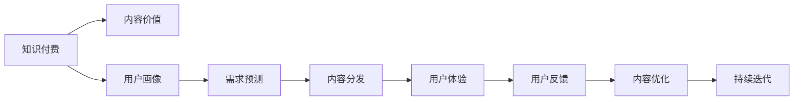

                 

## 1. 背景介绍

在数字化时代，知识付费成为连接创作者和用户的有效方式，为优质内容创作带来了新的机遇和挑战。知识付费平台如得到、喜马拉雅等，通过汇聚各领域专家和专业内容，构建了以用户付费获取知识为核心模式的商业生态。然而，随着内容供给增多，用户需求也日趋多样化和个性化，如何最大化知识内容价值，实现商业模式创新，成为知识付费创业的核心命题。

### 1.1 知识付费的兴起与发展

知识付费兴起于2016年，以分答和知乎Live为代表的平台开创了“1对1付费问答”和“专家讲座”等模式，奠定了知识付费的商业模式。此后，得到、喜马拉雅等平台开始推出专栏、付费音频、课程等形式，逐步建立起成熟的知识付费生态。知识付费的兴起，体现了人们对高质量内容的需求和对专业知识的渴望，为内容创作者提供了新的变现方式，促进了知识分享和传播。

### 1.2 知识付费的挑战与机遇

知识付费虽然发展迅猛，但也面临诸多挑战。主要体现在：

- **内容同质化严重**：许多平台以“爆款”课程和“捷径”知识为噱头，忽视了内容的深度和原创性。
- **用户忠诚度低**：免费资源泛滥，导致用户对付费内容的粘性不足，订阅率难以持续。
- **技术壁垒较低**：技术门槛不高，平台竞争激烈，许多创业公司难以形成差异化竞争优势。

尽管面临挑战，知识付费仍是一个大有可为的领域。随着人们时间成本的提高和对知识获取效率的需求增加，知识付费正处于发展的黄金期，为创作者和平台提供了广阔的市场空间。

## 2. 核心概念与联系

### 2.1 核心概念概述

要最大化知识内容价值，首先需要理解以下核心概念：

- **知识付费**：指用户支付费用以获取专业知识和技能，提升个人或企业能力的一种模式。
- **内容价值**：指内容对用户产生的知识和情感收益，包括知识深度、内容原创性、用户体验等。
- **用户画像**：指通过数据分析构建的用户画像，帮助平台了解用户需求，提供个性化内容。
- **需求预测**：指对用户潜在需求的预测，用于指导内容制作和商业决策。
- **内容分发**：指通过推荐算法等手段将内容推送给目标用户，提升用户粘性和平台价值。

这些概念通过以下Mermaid流程图展示它们之间的联系：



从用户需求出发，通过构建用户画像和需求预测模型，确定内容分发策略，最终提升用户体验和用户粘性，实现内容价值的最大化。

## 3. 核心算法原理 & 具体操作步骤

### 3.1 算法原理概述

最大化知识内容价值的核心算法原理包括用户画像构建、需求预测和内容分发策略制定。这些算法共同作用于平台的内容创作、内容推荐和用户交互过程，确保内容能够精准匹配用户需求，提升用户满意度。

### 3.2 算法步骤详解

#### 3.2.1 用户画像构建

用户画像的构建是知识付费平台运营的基础，通过分析用户行为数据，构建多维度用户画像，帮助平台了解用户需求和行为特征。具体步骤如下：

1. **数据采集**：收集用户在平台上的行为数据，如浏览记录、学习时间、付费行为等。
2. **数据预处理**：对数据进行清洗和特征工程，去除噪声和冗余信息，提取有价值特征。
3. **画像建模**：使用聚类、分类等算法对用户进行画像，形成用户标签和兴趣点。

#### 3.2.2 需求预测

需求预测旨在通过用户画像和历史行为数据，预测用户对特定内容的需求，指导内容制作和推荐。具体步骤如下：

1. **特征提取**：提取用户画像和历史行为数据的关键特征，如学习时间、兴趣爱好等。
2. **模型训练**：使用机器学习算法（如回归、分类、序列预测等）对用户需求进行预测，形成需求模型。
3. **模型评估**：使用交叉验证等方法对模型进行评估，选择预测效果最佳的模型。

#### 3.2.3 内容分发策略

内容分发策略的核心在于如何高效地将内容推送给目标用户，提升用户满意度和平台价值。具体步骤如下：

1. **推荐算法设计**：设计合适的推荐算法，如协同过滤、内容基推荐、混合推荐等，根据用户画像和需求预测结果，生成推荐列表。
2. **内容排序**：根据用户行为和反馈数据，对推荐内容进行排序，优先展示最符合用户需求的内容。
3. **实时调整**：根据用户反馈和行为数据，实时调整推荐策略，提升推荐效果。

### 3.3 算法优缺点

#### 3.3.1 算法优点

1. **精准匹配用户需求**：通过用户画像和需求预测，确保内容能够精准匹配用户需求，提升用户满意度。
2. **提升内容价值**：通过精准推荐，提升用户对内容的价值感知，增强付费意愿。
3. **数据驱动决策**：通过数据分析和机器学习算法，指导内容制作和平台运营决策，提升运营效率。

#### 3.3.2 算法缺点

1. **数据隐私问题**：用户画像和需求预测需要大量用户数据，存在隐私泄露风险。
2. **算法复杂度高**：构建用户画像和需求预测模型需要复杂的算法和数据处理过程，技术门槛高。
3. **用户行为难以预测**：用户行为具有高度不确定性，需求预测模型的准确性难以保证。

### 3.4 算法应用领域

这些算法不仅适用于知识付费平台，还能应用于许多其他领域，如电商推荐、广告定向等，提升用户体验和平台价值。

## 4. 数学模型和公式 & 详细讲解 & 举例说明

### 4.1 数学模型构建

为了最大化内容价值，需要构建数学模型来量化用户需求和内容价值。以下是一个简单的数学模型框架：

1. **用户价值模型**：$V(u)$，表示用户从内容中获得的价值。
2. **内容价值模型**：$V(c)$，表示内容对用户产生的价值。
3. **推荐价值模型**：$V(r)$，表示推荐的价值，通过推荐算法计算。

### 4.2 公式推导过程

假设平台有$N$个用户，每个用户对内容$C$的价值为$V(u, c)$，内容$C$的价值为$V(c)$。根据协同过滤算法，用户$u$对内容$C$的推荐价值$V(r)$可以表示为：

$$
V(r) = \alpha \times \frac{\sum_{v \in U \backslash \{u\}} V(u, c) \times V(v, c)}{\sum_{v \in U \backslash \{u\}} V(v, c)}
$$

其中$U$表示用户集合，$\alpha$为调节因子。

### 4.3 案例分析与讲解

以得到平台为例，分析如何通过算法最大化内容价值：

1. **用户画像构建**：通过分析用户历史行为数据，构建用户画像，包括用户兴趣、学习时间、付费行为等。
2. **需求预测**：使用回归模型预测用户对不同课程的需求，如预测用户对“编程”类课程的需求概率。
3. **内容分发**：通过协同过滤算法，将“编程”类课程推荐给对编程感兴趣的用户，提升用户满意度和平台价值。

## 5. 项目实践：代码实例和详细解释说明

### 5.1 开发环境搭建

为了进行知识付费平台的算法实践，需要搭建相应的开发环境。以下是一个简单的Python开发环境搭建步骤：

1. **安装Python**：选择合适版本的Python，如3.7或3.8。
2. **安装依赖库**：安装必要的依赖库，如NumPy、Pandas、Scikit-learn等。
3. **环境管理**：使用Python的虚拟环境管理工具，如Venv，创建独立的环境。

### 5.2 源代码详细实现

以下是一个简单的Python代码示例，用于构建用户画像和需求预测模型：

```python
import pandas as pd
from sklearn.cluster import KMeans
from sklearn.preprocessing import StandardScaler

# 数据预处理
data = pd.read_csv('user_behavior.csv')
data.fillna(method='ffill', inplace=True)
data.dropna(inplace=True)

# 特征工程
features = ['learn_time', 'interest_score', 'payment_rate']
data = data[features]

# 标准化处理
scaler = StandardScaler()
data = scaler.fit_transform(data)

# 聚类建模
kmeans = KMeans(n_clusters=5)
kmeans.fit(data)
data['user_cluster'] = kmeans.labels_

# 输出用户画像
print(data.groupby('user_cluster')['interest_score'].mean())
```

### 5.3 代码解读与分析

该代码示例中，首先读取用户行为数据，进行缺失值处理和特征选择。然后对特征进行标准化处理，最后使用KMeans算法对用户进行聚类，得到用户画像。

## 6. 实际应用场景

### 6.1 知识付费平台

知识付费平台是算法应用的主要场景之一。通过构建用户画像和需求预测模型，平台能够精准推荐内容，提升用户满意度和平台价值。例如，得到平台的“每天听本书”功能，通过分析用户学习行为和兴趣标签，推荐合适的书籍和作者，提升用户粘性和平台盈利。

### 6.2 广告定向

广告定向是另一个典型应用场景。通过用户画像和需求预测，广告平台能够将广告精准推送给目标用户，提升广告效果和用户体验。例如，通过分析用户的浏览记录和购买行为，预测用户对某类产品的需求，将其推荐给潜在客户，提高广告转化率。

### 6.3 电商推荐

电商推荐也是算法的重要应用场景。通过用户画像和需求预测，电商平台能够推荐用户可能感兴趣的商品，提升用户购物体验和平台销售额。例如，亚马逊通过分析用户的浏览记录和购买历史，推荐相似商品和促销活动，增加用户购买意愿。

## 7. 工具和资源推荐

### 7.1 学习资源推荐

为了掌握算法原理和实现细节，推荐以下学习资源：

1. **机器学习课程**：如斯坦福大学的CS229课程，系统介绍机器学习理论和方法。
2. **深度学习课程**：如吴恩达的Deep Learning Specialization，涵盖深度学习理论和实践。
3. **推荐系统书籍**：如《推荐系统实战》，详细介绍推荐算法和应用。
4. **数据科学工具**：如NumPy、Pandas、Scikit-learn等，用于数据处理和建模。
5. **在线学习平台**：如Coursera、edX等，提供丰富的课程和实践机会。

### 7.2 开发工具推荐

开发工具推荐如下：

1. **IDE**：如PyCharm、Jupyter Notebook等，提供代码编辑和执行环境。
2. **数据库**：如MySQL、MongoDB等，用于存储和管理用户数据。
3. **云平台**：如AWS、Google Cloud等，提供弹性计算和存储资源。
4. **数据可视化工具**：如Tableau、Matplotlib等，用于数据可视化和分析。

### 7.3 相关论文推荐

为了深入理解算法原理和实践细节，推荐以下相关论文：

1. **协同过滤算法**：如《Collaborative Filtering for Implicit Feedback Datasets》，详细介绍协同过滤算法及其应用。
2. **深度学习推荐系统**：如《Deep Interest Evolution for Personalized Recommendation》，探讨深度学习在推荐系统中的应用。
3. **用户画像建模**：如《User Profiling for Recommendation》，介绍用户画像构建的方法和效果。
4. **推荐算法评估**：如《Evaluation Metrics for Recommender Systems》，详细介绍推荐系统评估指标和方法。

## 8. 总结：未来发展趋势与挑战

### 8.1 总结

本文介绍了知识付费平台中内容价值最大化的核心算法原理和具体操作步骤。通过构建用户画像和需求预测模型，提升内容分发策略的精准度，实现了内容价值的最大化。通过案例分析和代码实现，展示了算法的应用效果和实现细节。

### 8.2 未来发展趋势

未来，知识付费平台将继续探索算法创新，提升内容推荐效果和用户体验。主要发展趋势包括：

1. **个性化推荐**：基于用户行为数据和需求预测，提供个性化推荐，提升用户粘性。
2. **实时推荐**：通过实时分析用户行为和反馈，实时调整推荐策略，提升推荐效果。
3. **多模态融合**：将用户画像和需求预测模型与其他数据源（如社交网络、新闻媒体等）融合，提供更全面的推荐。

### 8.3 面临的挑战

尽管算法取得了一些进展，但仍然面临诸多挑战：

1. **数据隐私问题**：用户画像和需求预测需要大量用户数据，存在隐私泄露风险。
2. **算法复杂度高**：算法实现复杂，技术门槛高，需要大量的数据分析和建模工作。
3. **用户行为难以预测**：用户行为具有高度不确定性，需求预测模型的准确性难以保证。

### 8.4 研究展望

未来，知识付费平台需要在以下方面进行探索和创新：

1. **隐私保护**：采用差分隐私、联邦学习等技术，保护用户隐私。
2. **算法优化**：优化推荐算法，提升推荐效果和实时性。
3. **多模态融合**：将多模态数据与用户画像和需求预测模型融合，提升推荐效果。
4. **可解释性**：提高推荐算法的可解释性，增强用户信任和平台透明度。

通过不断创新和优化，知识付费平台将能够最大化内容价值，实现商业模式的创新和可持续发展。

## 9. 附录：常见问题与解答

### 9.1 常见问题与解答

**Q1: 如何构建用户画像？**

A: 用户画像的构建需要分析用户的行为数据，提取关键特征，如学习时间、付费行为、兴趣标签等。可以使用聚类、分类等算法对用户进行画像，形成用户标签和兴趣点。

**Q2: 推荐算法有哪些？**

A: 常见的推荐算法包括协同过滤、基于内容的推荐、混合推荐等。协同过滤算法通过用户行为数据进行推荐，基于内容的推荐则通过物品特征进行推荐，混合推荐则结合多种算法提高推荐效果。

**Q3: 用户画像和需求预测的准确性如何提升？**

A: 可以通过增加数据量、优化特征选择、使用更先进的算法等方法提升用户画像和需求预测的准确性。同时，实时调整推荐策略，根据用户反馈和行为数据不断优化模型。

**Q4: 如何在保证用户隐私的前提下进行推荐？**

A: 可以采用差分隐私、联邦学习等技术，保护用户隐私。例如，差分隐私可以在不泄露个体数据的前提下，保护群体数据统计特性。联邦学习则允许在本地进行模型训练，减少数据传输和隐私泄露风险。

**Q5: 如何提高推荐系统的可解释性？**

A: 可以采用可解释性技术，如LIME、SHAP等，对推荐模型进行解释。同时，提供详细的推荐理由和逻辑，增强用户信任和平台透明度。

作者：禅与计算机程序设计艺术 / Zen and the Art of Computer Programming

