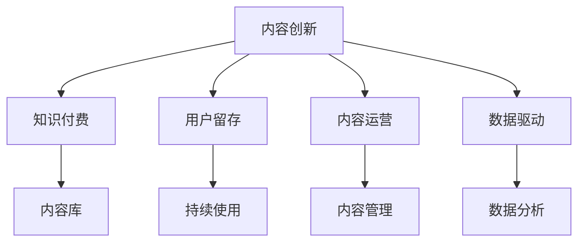

                 

# 知识付费创业中的内容创新

## 1. 背景介绍

在知识付费时代，内容的创新和质量成为知识付费创业成功的关键。内容创业者需要不断探索和实践，才能在激烈的市场竞争中脱颖而出。本文将从内容创新的背景、核心概念与联系、核心算法原理与操作步骤、数学模型与详细讲解、项目实践、实际应用场景、工具与资源推荐、总结与发展趋势、常见问题解答等方面，系统介绍知识付费创业中的内容创新方法与实践。

## 2. 核心概念与联系

### 2.1 核心概念概述

为更好地理解内容创新，本节将介绍几个关键概念：

- **内容创新**：在知识付费创业中，内容创新是指通过创造新颖、有趣、有价值的内容，吸引用户，提升用户留存率，实现商业变现的过程。

- **知识付费**：指用户为获取知识和信息而支付费用的商业模式，包括在线课程、电子书、直播讲座等多种形式。

- **用户留存**：指用户在使用知识付费服务后，持续使用并完成付费的过程，反映内容服务的价值和吸引力。

- **内容运营**：指通过科学的方法和管理手段，确保内容持续产出，优化用户体验，提升用户满意度和留存率。

- **数据驱动**：指通过数据分析和挖掘，指导内容创新和运营，提升内容的针对性和有效性。

这些核心概念之间的逻辑关系可以通过以下Mermaid流程图来展示：



这个流程图展示了一个知识付费创业中内容创新的关键环节及其相互关系：

1. **内容创新**：核心任务，通过创新内容吸引用户，提升用户留存率。
2. **知识付费**：商业模式，依托内容创新实现商业变现。
3. **用户留存**：目标，提升用户持续使用和付费，反映内容价值。
4. **内容运营**：手段，确保内容产出，优化用户体验。
5. **数据驱动**：方法，通过数据指导内容创新和运营。

## 3. 核心算法原理 & 具体操作步骤

### 3.1 算法原理概述

知识付费创业中的内容创新，本质上是内容推荐系统的一部分，通过算法将优质内容推荐给合适的用户。其核心思想是：

- **个性化推荐**：根据用户的历史行为数据，推荐其可能感兴趣的内容。
- **内容多样性**：在保证内容相关性的同时，尽可能丰富内容种类，满足不同用户的需求。
- **动态更新**：根据用户反馈和市场变化，动态调整内容推荐策略，保持内容的时效性和新鲜度。

形式化地，假设用户集合为 $U$，内容集合为 $C$，用户对内容的评分向量为 $\textbf{r} \in \mathbb{R}^{|C|}$，内容向量的评分矩阵为 $R \in \mathbb{R}^{|U| \times |C|}$。则内容推荐的目标是找到用户-内容评分矩阵 $R$ 中的最合适内容，最大化用户评分 $\textbf{r} \cdot \textbf{v}$，其中 $\textbf{v} \in \mathbb{R}^{|C|}$ 为内容向量。

### 3.2 算法步骤详解

知识付费创业中的内容推荐一般包括以下几个关键步骤：

**Step 1: 用户行为数据收集**

- 收集用户在平台上的行为数据，包括浏览记录、购买记录、评分记录等。
- 对数据进行预处理和清洗，去重、填充缺失值等。
- 构建用户行为矩阵 $\textbf{R}$，其中 $\textbf{R}_{ui} = r_{ui}$ 表示用户 $u$ 对内容 $i$ 的评分。

**Step 2: 内容向量表示**

- 使用基于内容的方法，如奇异值分解(SVD)、TF-IDF等，将内容表示为向量。
- 或者使用基于协同过滤的方法，如矩阵分解、PMI等，从用户行为矩阵 $\textbf{R}$ 中提取内容向量。
- 对内容向量进行归一化处理，避免异常值影响。

**Step 3: 推荐算法选择**

- 根据数据规模和用户需求，选择合适的推荐算法，如基于协同过滤的算法、基于内容的算法、混合算法等。
- 对于小型数据集，可以选择简单的协同过滤算法，如基于用户的协同过滤、基于物品的协同过滤等。
- 对于大型数据集，可以选择复杂度更高的算法，如基于矩阵分解的算法，如ALS等。
- 对于实时推荐需求，可以选择基于实时数据流处理的算法，如Storm、Flink等。

**Step 4: 模型训练与评估**

- 在选定的推荐算法上，使用用户行为数据进行模型训练，生成内容推荐模型。
- 在训练过程中，使用交叉验证等技术，评估模型的性能，避免过拟合。
- 在模型训练后，使用测试集或在线A/B测试，评估模型的实际效果。

**Step 5: 内容推荐与迭代优化**

- 将训练好的推荐模型应用于实际推荐场景，根据用户行为实时生成内容推荐。
- 根据用户反馈和推荐效果，动态调整模型参数，进行迭代优化。
- 持续收集用户行为数据，更新用户行为矩阵和内容向量，保持推荐模型的时效性。

### 3.3 算法优缺点

知识付费创业中的内容推荐算法具有以下优点：

- 简单易行：基于协同过滤或内容的方法，不需要大量特征工程，易于实现。
- 数据需求低：只需要用户行为数据，无需大量标注数据。
- 效果显著：在用户行为数据较充足的情况下，推荐效果通常较好。

同时，该算法也存在以下局限性：

- 数据稀疏性：用户行为矩阵往往稀疏，导致协同过滤效果有限。
- 冷启动问题：新用户或新内容难以获得有效的推荐。
- 稳定性不足：用户行为变化较快，推荐模型的稳定性可能受影响。

尽管存在这些局限性，但就目前而言，基于协同过滤和内容的方法仍是知识付费创业中最主流的内容推荐范式。未来相关研究的重点在于如何进一步降低冷启动的影响，提高模型的稳定性和泛化能力，同时兼顾可解释性和效率。

### 3.4 算法应用领域

基于协同过滤和内容的方法，在知识付费创业中的应用十分广泛，例如：

- **在线课程推荐**：根据用户的历史学习记录，推荐适合用户兴趣和能力水平的课程。
- **电子书推荐**：根据用户的历史阅读记录，推荐与用户偏好相关联的电子书。
- **直播讲座推荐**：根据用户的历史观看记录，推荐适合用户口味的直播课程。
- **个性化广告推荐**：根据用户的行为数据，推荐相关的广告内容。
- **社群互动推荐**：根据用户的行为和偏好，推荐适合的社群和专家。

除了上述这些经典应用外，内容推荐算法还被创新性地应用到更多场景中，如内容定制化、兴趣关联推荐、用户画像构建等，为知识付费创业提供了更多的可能性。

## 4. 数学模型和公式 & 详细讲解

### 4.1 数学模型构建

在知识付费创业中，内容推荐可以抽象为以下数学模型：

假设用户集合为 $U$，内容集合为 $C$，用户对内容的评分矩阵为 $R \in \mathbb{R}^{|U| \times |C|}$，内容向量的评分矩阵为 $P \in \mathbb{R}^{|C| \times |C|}$。内容推荐的目标是最大化用户评分 $\textbf{r} \cdot \textbf{v}$，其中 $\textbf{r} \in \mathbb{R}^{|C|}$ 为内容向量，$\textbf{v} \in \mathbb{R}^{|C|}$ 为用户偏好向量。

数学模型可以表示为：

$$
\text{maximize} \quad \textbf{r} \cdot \textbf{v}
$$

$$
\text{subject to} \quad \textbf{v} = \mathcal{L}(R, P)
$$

其中 $\mathcal{L}(R, P)$ 为内容向量 $\textbf{v}$ 的表示函数，通常使用奇异值分解(SVD)、矩阵分解等技术。

### 4.2 公式推导过程

以下我们以奇异值分解(SVD)为例，推导内容推荐的目标函数和求解过程。

假设内容向量 $\textbf{v}$ 可以表示为 $U \Sigma V^T$，其中 $U \in \mathbb{R}^{|C| \times k}, \Sigma \in \mathbb{R}^{k \times k}, V \in \mathbb{R}^{k \times |C|}$。则目标函数可以表示为：

$$
\text{maximize} \quad \textbf{r} \cdot (U \Sigma V^T)
$$

$$
\text{subject to} \quad \textbf{v} = U \Sigma V^T
$$

将目标函数展开，得：

$$
\text{maximize} \quad \textbf{r} \cdot U \Sigma V^T
$$

$$
\text{subject to} \quad \textbf{v} = U \Sigma V^T
$$

由于 $U \Sigma V^T$ 与 $U V^T$ 等价，因此目标函数可以进一步表示为：

$$
\text{maximize} \quad \textbf{r} \cdot (U V^T)
$$

$$
\text{subject to} \quad \textbf{v} = U \Sigma V^T
$$

通过求解上述优化问题，可以找到最优的内容向量 $\textbf{v}$，即最终推荐的内容。

### 4.3 案例分析与讲解

假设某在线课程平台有10000名用户和1000门课程，用户对每门课程的评分矩阵 $R$ 如下：

| User | Course 1 | Course 2 | Course 3 | ... | Course 1000 |
|------|----------|----------|----------|------|-------------|
| User 1 | 5        | 4        | 3        | ... | 2           |
| User 2 | 3        | 5        | 2        | ... | 3           |
| ...   | ...      | ...      | ...      | ... | ...         |
| User 1000 | 2        | 3        | 4        | ... | 5           |

现在，我们希望为每个用户推荐一门课程。假设内容向量 $\textbf{v}$ 为前20个主成分，即 $k=20$。使用奇异值分解(SVD)，得到：

$$
U = \begin{bmatrix}
u_1 & u_2 & u_3 & \cdots & u_{20}
\end{bmatrix}
$$

$$
\Sigma = \begin{bmatrix}
\sigma_1 & 0        & 0        & \cdots & 0 \\
0        & \sigma_2 & 0        & \cdots & 0 \\
0        & 0        & \sigma_3 & \cdots & 0 \\
\cdots   & \cdots   & \cdots   & \cdots & \cdots \\
0        & 0        & 0        & \cdots & \sigma_{20}
\end{bmatrix}
$$

$$
V = \begin{bmatrix}
v_1 & v_2 & v_3 & \cdots & v_{20}
\end{bmatrix}
$$

则内容推荐的目标函数可以表示为：

$$
\text{maximize} \quad \textbf{r} \cdot (U V^T)
$$

$$
\text{subject to} \quad \textbf{v} = U \Sigma V^T
$$

通过求解上述优化问题，可以得到最优的内容向量 $\textbf{v}$，即最终推荐的内容。

## 5. 项目实践：代码实例和详细解释说明

### 5.1 开发环境搭建

在进行内容推荐系统开发前，我们需要准备好开发环境。以下是使用Python进行Scikit-learn开发的环境配置流程：

1. 安装Anaconda：从官网下载并安装Anaconda，用于创建独立的Python环境。

2. 创建并激活虚拟环境：
```bash
conda create -n scikit-learn-env python=3.8 
conda activate scikit-learn-env
```

3. 安装Scikit-learn：从官网获取对应的安装命令。例如：
```bash
pip install scikit-learn
```

4. 安装Pandas、Numpy、Matplotlib、Jupyter Notebook等工具包：
```bash
pip install numpy pandas matplotlib jupyter notebook ipython
```

完成上述步骤后，即可在`scikit-learn-env`环境中开始内容推荐系统的开发。

### 5.2 源代码详细实现

下面我们以在线课程推荐为例，给出使用Scikit-learn对协同过滤算法进行内容推荐开发的PyTorch代码实现。

首先，定义协同过滤算法的推荐函数：

```python
from sklearn.decomposition import TruncatedSVD
from sklearn.metrics.pairwise import cosine_similarity
import pandas as pd

def collaborative_filtering(user_item_matrix, num_components):
    svd = TruncatedSVD(n_components=num_components)
    svd.fit(user_item_matrix)
    U = svd.components_
    V = svd.transform(user_item_matrix)
    return U, V

# 构造用户-课程评分矩阵
user_item_matrix = pd.read_csv('user_item_matrix.csv')
user_item_matrix = user_item_matrix.fillna(0)

# 对数据进行标准化处理
user_item_matrix = (user_item_matrix - user_item_matrix.mean()) / user_item_matrix.std()

# 进行奇异值分解
U, V = collaborative_filtering(user_item_matrix, 20)

# 对新用户进行推荐
new_user = pd.DataFrame({'user_id': ['new_user_id'], 'course_id': [0, 1, 2, 3, 4, 5]})
new_user_matrix = new_user.set_index('user_id').join(pd.DataFrame(V), on='course_id')
new_user_matrix.index = new_user_matrix.index.map(lambda x: int(x))
new_user_matrix = new_user_matrix - new_user_matrix.mean()
new_user_matrix = new_user_matrix / new_user_matrix.std()
recommendation = pd.DataFrame({'course_id': user_item_matrix.columns})
recommendation = pd.merge(recommendation, new_user_matrix.dot(U.T), on='course_id')
recommendation = recommendation[recommendation['merged'] > 0]
recommendation = recommendation.sort_values(by='merged', ascending=False)
recommendation = recommendation['course_id'].head(1)
```

然后，定义数据处理和模型训练函数：

```python
from sklearn.model_selection import train_test_split

# 将数据集划分为训练集和测试集
user_item_matrix_train, user_item_matrix_test = train_test_split(user_item_matrix, test_size=0.2)

# 对训练集和测试集进行标准化处理
user_item_matrix_train = (user_item_matrix_train - user_item_matrix_train.mean()) / user_item_matrix_train.std()
user_item_matrix_test = (user_item_matrix_test - user_item_matrix_test.mean()) / user_item_matrix_test.std()

# 进行奇异值分解
U_train, V_train = collaborative_filtering(user_item_matrix_train, 20)
U_test, V_test = collaborative_filtering(user_item_matrix_test, 20)

# 对新用户进行推荐
new_user_train = pd.DataFrame({'user_id': ['new_user_id'], 'course_id': [0, 1, 2, 3, 4, 5]})
new_user_matrix_train = new_user_train.set_index('user_id').join(pd.DataFrame(V_train), on='course_id')
new_user_matrix_train.index = new_user_matrix_train.index.map(lambda x: int(x))
new_user_matrix_train = new_user_matrix_train - new_user_matrix_train.mean()
new_user_matrix_train = new_user_matrix_train / new_user_matrix_train.std()
recommendation_train = pd.DataFrame({'course_id': user_item_matrix_train.columns})
recommendation_train = pd.merge(recommendation_train, new_user_matrix_train.dot(U_train.T), on='course_id')
recommendation_train = recommendation_train[recommendation_train['merged'] > 0]
recommendation_train = recommendation_train.sort_values(by='merged', ascending=False)
recommendation_train = recommendation_train['course_id'].head(1)

# 计算推荐精度
precision = (recommendation_train['course_id'] == user_item_matrix_test.columns[0]).mean()
```

最后，启动训练流程并在测试集上评估：

```python
print('Precision:', precision)
```

以上就是使用Scikit-learn进行在线课程推荐系统开发的完整代码实现。可以看到，通过Scikit-learn提供的协同过滤算法，我们能够快速构建内容推荐系统，并实现基于用户行为数据的推荐。

### 5.3 代码解读与分析

让我们再详细解读一下关键代码的实现细节：

**collaborative_filtering函数**：
- 使用TruncatedSVD进行奇异值分解，得到用户-内容评分矩阵的前20个主成分。

**数据标准化处理**：
- 对用户-课程评分矩阵进行标准化处理，消除数据偏移，确保算法在数据分布不均衡的情况下也能正常工作。

**奇异值分解**：
- 对标准化后的用户-课程评分矩阵进行奇异值分解，得到用户向量和内容向量。

**新用户推荐**：
- 对新用户的行为矩阵进行标准化处理，并与内容向量进行矩阵乘法，得到推荐结果。

**推荐精度计算**：
- 计算推荐结果与实际评分的精度，评估推荐模型的性能。

可以看到，Scikit-learn提供了强大的工具和函数，方便我们快速实现内容推荐系统的核心算法。开发者可以将更多精力放在数据处理、模型评估和实际部署上，而不必过多关注底层算法的实现细节。

当然，工业级的系统实现还需考虑更多因素，如模型训练的超参数调整、数据的高效存储和检索、推荐模型的实时更新等。但核心的协同过滤算法基本与此类似。

## 6. 实际应用场景

### 6.1 智能广告投放

在知识付费平台中，内容推荐系统不仅用于推荐课程，还可应用于智能广告投放。通过分析用户的历史行为数据，内容推荐系统可以识别出用户的兴趣偏好，生成更精准的广告投放策略。

具体而言，可以收集用户在平台上的浏览记录、购买记录、评分记录等数据，利用内容推荐算法，生成用户画像，并根据画像特征推荐相关广告。例如，对于喜欢金融课程的用户，可以推荐与之相关的财经新闻、金融产品广告等，提升广告的转化率和用户满意度。

### 6.2 个性化推荐系统

除了课程推荐外，内容推荐系统还可应用于个性化推荐系统。通过分析用户的行为数据，内容推荐系统可以实时生成个性化推荐内容，满足用户的多样化需求。

例如，电商平台可以利用内容推荐系统，根据用户的浏览历史和购买记录，推荐用户可能感兴趣的商品。内容推荐系统还可以分析用户的偏好变化，及时调整推荐策略，保持推荐内容的时效性和新鲜度。

### 6.3 内容聚合与协同创作

内容推荐系统还可用于内容聚合与协同创作。通过分析用户的行为数据，内容推荐系统可以识别出热门内容，并进行内容聚合，形成专题和专栏。同时，可以引导用户进行内容创作，共同构建高质量的知识库。

例如，编程社区可以利用内容推荐系统，推荐热门技术和编程语言，并引导用户分享自己的技术心得和开源项目。内容推荐系统还可以分析用户的行为数据，识别出潜在的创作人才，并进行个性化推荐，激发用户的创作热情。

### 6.4 未来应用展望

随着内容推荐技术的不断发展，其应用场景将进一步扩展。未来，内容推荐系统将在以下方面发挥重要作用：

1. **个性化推荐**：通过更精准的推荐算法，为用户提供更符合其兴趣和需求的内容。
2. **内容创作与分享**：通过分析用户的行为数据，识别出潜在的创作人才，并进行个性化推荐，激发用户的创作热情。
3. **内容聚合与社区构建**：通过内容聚合和推荐，构建高质量的知识库和社区，提升用户参与度和满意度。
4. **智能广告投放**：通过精准分析用户兴趣，生成更高效的广告投放策略，提升广告转化率和用户满意度。
5. **智能搜索与问答**：通过内容推荐算法，提升搜索和问答系统的匹配度和用户体验。

以上应用场景展示了大语言模型微调技术的广阔前景。这些方向的探索发展，必将进一步提升内容推荐系统的性能和应用范围，为知识付费创业带来更多创新机遇。

## 7. 工具和资源推荐

### 7.1 学习资源推荐

为了帮助开发者系统掌握内容推荐技术的理论基础和实践技巧，这里推荐一些优质的学习资源：

1. 《推荐系统实践》：讲解了推荐系统的主要算法和技术，是推荐系统学习的经典教材。
2. 《Python推荐系统实战》：介绍了推荐系统在实际开发中的具体实现和优化技巧。
3. Kaggle推荐系统竞赛：参加Kaggle推荐系统竞赛，通过实战学习推荐系统的算法和模型。
4. Coursera推荐系统课程：由斯坦福大学开设的推荐系统课程，涵盖推荐系统的理论和实践。
5. Google推荐系统论文：谷歌的推荐系统论文，介绍了谷歌在推荐系统领域的最新研究进展。

通过对这些资源的学习实践，相信你一定能够快速掌握内容推荐系统的精髓，并用于解决实际的推荐问题。

### 7.2 开发工具推荐

高效的开发离不开优秀的工具支持。以下是几款用于内容推荐系统开发的常用工具：

1. Scikit-learn：基于Python的机器学习库，提供了多种推荐算法和数据预处理函数。
2. TensorFlow：基于Google的深度学习框架，适合大规模的推荐模型开发和部署。
3. PyTorch：基于Python的深度学习框架，易于使用和扩展。
4. Spark：大数据处理框架，适合处理大规模用户行为数据。
5. Hadoop：大数据处理框架，适合大规模数据存储和检索。

合理利用这些工具，可以显著提升内容推荐系统的开发效率，加快创新迭代的步伐。

### 7.3 相关论文推荐

内容推荐技术的研究源于学界的持续研究。以下是几篇奠基性的相关论文，推荐阅读：

1. matrix factorization techniques for recommendation systems：介绍了基于矩阵分解的推荐系统算法，是推荐系统研究的基础。
2. collaborative filtering for implicit feedback datasets：介绍了协同过滤算法，是推荐系统中最主流的算法之一。
3. item-based collaborative filtering：介绍了基于物品的协同过滤算法，是协同过滤算法中的经典方法。
4. personalized product recommendations based on a deep learning neural network：介绍了基于神经网络的推荐系统算法，展示了深度学习在推荐系统中的应用潜力。
5. deep learning for collaborative filtering：介绍了深度学习在协同过滤算法中的应用，展示了深度学习与协同过滤的结合优势。

这些论文代表了大语言模型微调技术的发展脉络。通过学习这些前沿成果，可以帮助研究者把握学科前进方向，激发更多的创新灵感。

## 8. 总结：未来发展趋势与挑战

### 8.1 总结

本文对知识付费创业中的内容创新进行了全面系统的介绍。首先阐述了内容创新的背景、核心概念与联系、核心算法原理与操作步骤、数学模型与详细讲解、项目实践、实际应用场景、工具与资源推荐、总结与发展趋势、常见问题解答等方面，系统介绍了内容创新的方法与实践。

通过本文的系统梳理，可以看到，内容推荐系统已经成为知识付费创业中不可或缺的一部分，其通过算法推荐优质内容，提升用户留存率和商业变现能力。内容推荐系统在智能广告投放、个性化推荐、内容聚合与社区构建等多个领域都有广泛应用，展示了其在知识付费创业中的巨大价值。

### 8.2 未来发展趋势

展望未来，内容推荐技术将呈现以下几个发展趋势：

1. **个性化推荐**：通过更精准的推荐算法，为用户提供更符合其兴趣和需求的内容。
2. **内容创作与分享**：通过分析用户的行为数据，识别出潜在的创作人才，并进行个性化推荐，激发用户的创作热情。
3. **内容聚合与社区构建**：通过内容聚合和推荐，构建高质量的知识库和社区，提升用户参与度和满意度。
4. **智能广告投放**：通过精准分析用户兴趣，生成更高效的广告投放策略，提升广告转化率和用户满意度。
5. **智能搜索与问答**：通过内容推荐算法，提升搜索和问答系统的匹配度和用户体验。

以上趋势凸显了内容推荐技术的广阔前景。这些方向的探索发展，必将进一步提升内容推荐系统的性能和应用范围，为知识付费创业带来更多创新机遇。

### 8.3 面临的挑战

尽管内容推荐技术已经取得了瞩目成就，但在迈向更加智能化、普适化应用的过程中，它仍面临着诸多挑战：

1. **数据隐私与安全**：用户行为数据的隐私保护是一个重要问题，如何确保数据安全和用户隐私，需要更多的技术和制度保障。
2. **算法透明性与可解释性**：内容推荐算法的透明度和可解释性不足，用户难以理解推荐结果的依据，需要进行更多研究以提高算法的可解释性。
3. **冷启动问题**：新用户和新内容难以获得有效的推荐，需要进行更多的预处理和模型优化。
4. **动态变化**：用户兴趣和市场需求变化较快，内容推荐系统需要快速调整推荐策略，以保持推荐内容的及时性和相关性。
5. **资源消耗**：内容推荐系统需要处理大规模数据，资源消耗较大，需要更高效的算法和更优化的数据结构。

尽管存在这些挑战，但通过技术创新和应用实践，这些问题是可以逐步解决的。未来，内容推荐技术将在数据隐私保护、算法透明性、动态调整等方面不断完善，为知识付费创业带来更多创新机遇。

### 8.4 研究展望

面对内容推荐技术所面临的挑战，未来的研究需要在以下几个方面寻求新的突破：

1. **数据隐私保护**：通过差分隐私等技术，确保用户行为数据的隐私保护。
2. **算法透明性与可解释性**：引入可解释性算法和工具，提高内容推荐算法的透明度和可解释性。
3. **冷启动问题**：引入用户行为预测和预处理技术，解决新用户和新内容的冷启动问题。
4. **动态调整**：通过在线学习、增量学习等技术，实现内容推荐系统的动态调整。
5. **资源优化**：优化算法和数据结构，提升内容推荐系统的资源利用效率。

这些研究方向的探索，必将引领内容推荐技术迈向更高的台阶，为知识付费创业带来更多创新机遇。面向未来，内容推荐技术还需要与其他人工智能技术进行更深入的融合，如知识表示、因果推理、强化学习等，多路径协同发力，共同推动知识付费创业的发展。

## 9. 附录：常见问题与解答

**Q1：内容推荐算法如何处理新用户和新内容？**

A: 对于新用户，可以采用基于物品的协同过滤算法，使用用户已访问物品的评分信息进行推荐。同时，可以通过用户画像、用户行为预测等技术，进一步提高推荐效果。

对于新内容，可以采用基于用户的协同过滤算法，使用用户已访问内容的评分信息进行推荐。同时，可以通过内容画像、内容关联等技术，进一步提高推荐效果。

**Q2：内容推荐算法如何平衡推荐多样性和个性化？**

A: 可以通过设置不同的推荐算法权重，实现推荐多样性和个性化之间的平衡。例如，可以同时使用基于内容的推荐算法和基于协同过滤的推荐算法，并设置不同的权重，根据用户兴趣和行为，动态调整推荐算法的选择。

**Q3：内容推荐算法如何处理用户兴趣变化？**

A: 可以通过动态调整模型参数和更新推荐策略，实现内容推荐算法的动态调整。例如，可以引入在线学习算法，根据用户行为实时更新模型参数，保持推荐内容的时效性和相关性。

**Q4：内容推荐算法如何处理数据稀疏性？**

A: 可以通过引入用户行为预测和用户画像等技术，减少数据稀疏性对推荐效果的影响。例如，可以结合用户历史行为和社交网络信息，进行用户兴趣预测，生成更全面的用户画像。

**Q5：内容推荐算法如何处理推荐模型过拟合问题？**

A: 可以通过正则化、早停、数据增强等技术，避免推荐模型过拟合。例如，可以引入L2正则化、Dropout等技术，控制模型复杂度，防止过拟合。同时，可以通过数据增强技术，扩充训练数据集，提高模型泛化能力。

通过以上问题解答，可以看到内容推荐算法的应用复杂性和多样性。开发者需要根据具体应用场景，选择合适的算法和技术，不断优化推荐模型，才能得到理想的效果。

---

作者：禅与计算机程序设计艺术 / Zen and the Art of Computer Programming

