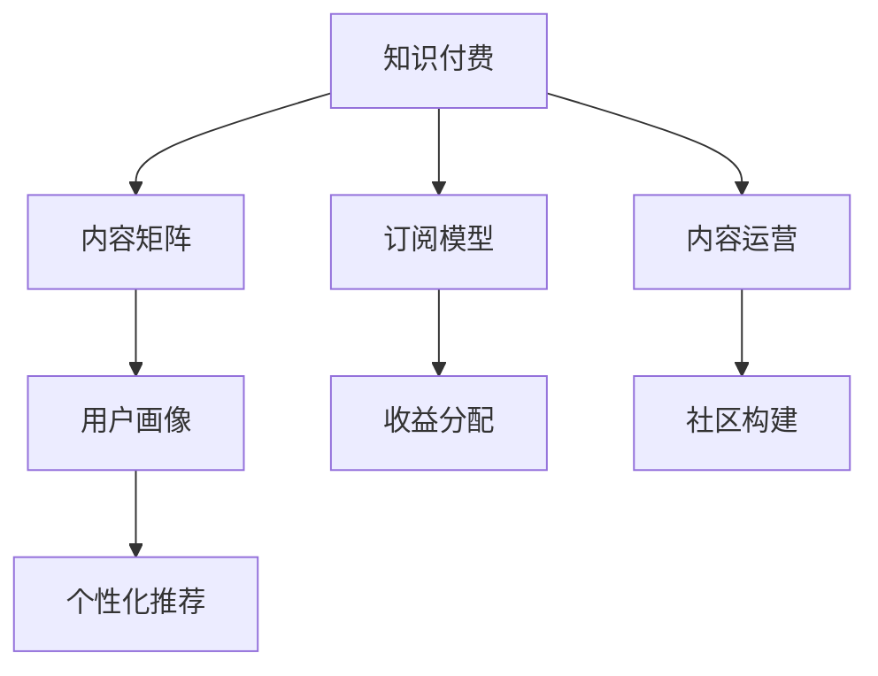

                 

# 知识付费创业中的内容矩阵搭建策略

> 关键词：知识付费、内容矩阵、用户画像、个性化推荐、订阅模型、收益分配、内容运营、社区构建

## 1. 背景介绍

随着互联网的发展，知识付费逐渐成为现代人获取知识的重要方式。从在线课程到电子书，从专业咨询到语音问答，知识付费的形式和内容日新月异。然而，如何在竞争激烈的知识付费市场中脱颖而出，是许多创业者面临的难题。

知识付费的核心在于内容。优质的内容不仅能吸引用户订阅，还能激发用户的持续购买行为。内容矩阵搭建策略，则是一种系统化的内容建设方法，通过多层次、多角度的内容组合，满足不同用户的需求，提高用户粘性，实现商业价值的最大化。

本文将详细探讨知识付费创业中的内容矩阵搭建策略，涵盖内容策划、用户画像、推荐系统、收益分配、内容运营等多个方面，希望能为创业者提供有价值的参考。

## 2. 核心概念与联系

### 2.1 核心概念概述

为更好地理解内容矩阵搭建策略，本节将介绍几个关键概念：

- **知识付费**：一种新兴的互联网服务形式，用户通过付费获取各类知识内容，包括在线课程、电子书、专业咨询、语音问答等。

- **内容矩阵**：通过多层次、多角度的内容组合，形成矩阵式的知识内容体系。内容矩阵搭建策略旨在构建具有差异化和互补性的内容集群，满足不同用户的需求。

- **用户画像**：描述用户特征和行为的数据集合。通过用户画像，可以更精准地进行内容推荐和用户维护。

- **个性化推荐**：基于用户行为和偏好，推荐符合用户兴趣的内容，提高用户粘性和满意度。

- **订阅模型**：用户根据订阅内容进行付费的商业模式。订阅模型可以带来稳定的收入流，降低内容获取的成本。

- **收益分配**：在知识付费平台上，如何公平合理地分配内容创作者和平台方的收益，是决定平台持续运营的关键。

- **内容运营**：通过营销、推广、维护等手段，提高内容的使用率，增强用户对平台的粘性。

- **社区构建**：围绕内容构建用户交流平台，增强用户参与感和归属感，形成社区效应。

这些核心概念之间的逻辑关系可以通过以下Mermaid流程图来展示：



这个流程图展示了大语言模型的核心概念及其之间的关系：

1. 知识付费通过内容矩阵提供多样化、个性化的知识内容。
2. 内容矩阵基于用户画像进行推荐，提升用户满意度和粘性。
3. 订阅模型带来稳定的收入流，支持平台运营。
4. 收益分配确保平台和创作者双方利益。
5. 内容运营提升内容使用率。
6. 社区构建增强用户归属感和参与感。

这些概念共同构成了知识付费平台的内容生态，使得平台能够持续吸引用户，提高商业价值。

## 3. 核心算法原理 & 具体操作步骤
### 3.1 算法原理概述

内容矩阵搭建策略的本质是内容组合和推荐系统。其核心思想是：通过用户画像和个性化推荐算法，将不同类型、不同层次的内容进行组合，形成用户感兴趣的内容矩阵，提高用户满意度和粘性。

形式化地，设用户集合为 $U$，内容集合为 $C$，内容类型集合为 $T$，推荐结果集合为 $R$。内容矩阵搭建策略的目标是找到用户和内容之间的映射关系 $\pi: U \rightarrow C$，使得：

$$
\min_{\pi} \sum_{u \in U} \max_{t \in T} \left\{\sum_{c \in \pi(u)} \text{cost}(c) \right\}
$$

其中 $\text{cost}(c)$ 表示内容 $c$ 的成本或价值，$\pi(u)$ 表示用户 $u$ 接收到的内容矩阵。

通过求解上述优化问题，可以得到一个成本最低、用户满意度最高的内容推荐方案。

### 3.2 算法步骤详解

基于上述算法原理，内容矩阵搭建策略的具体操作步骤如下：

**Step 1: 收集和分析用户数据**

- 收集用户基本信息（如年龄、性别、地域）和行为数据（如浏览、收藏、购买等），建立用户画像。
- 通过用户画像，分析用户兴趣和偏好，生成不同用户群体的特征向量。

**Step 2: 设计内容类型和层次**

- 确定平台提供的内容类型，如在线课程、电子书、专业咨询等。
- 对每种内容类型，进一步细化层次，如初级、中级、高级等，形成多层次的内容体系。

**Step 3: 建立内容关联矩阵**

- 根据用户画像和内容层次，将用户与不同层次、不同类型的内容进行关联，形成内容关联矩阵。
- 使用余弦相似度、TF-IDF等算法，计算内容之间的相似度，用于内容推荐。

**Step 4: 实施个性化推荐**

- 基于用户画像和内容关联矩阵，使用协同过滤、矩阵分解等算法，计算用户对不同内容的评分。
- 根据评分结果，推荐用户感兴趣的内容，形成内容矩阵。

**Step 5: 监测和优化**

- 通过用户行为数据，监测推荐结果的点击率、购买率等指标，评估推荐效果。
- 根据反馈结果，调整内容矩阵和推荐算法，持续优化推荐结果。

### 3.3 算法优缺点

内容矩阵搭建策略具有以下优点：

1. 多样化内容：通过多层次、多角度的内容组合，满足不同用户的需求，提高用户粘性。
2. 个性化推荐：基于用户画像和行为数据，推荐符合用户兴趣的内容，提升用户满意度。
3. 稳定的收入流：订阅模型带来稳定的收入流，降低内容获取的成本。
4. 社区效应：通过社区构建，增强用户归属感和参与感，形成良性循环。

同时，该策略也存在一定的局限性：

1. 数据依赖：内容矩阵搭建策略高度依赖用户数据和行为数据，数据质量不好时推荐效果会大打折扣。
2. 成本高昂：用户画像和推荐系统的建设需要大量人力和技术投入，初期成本较高。
3. 模型复杂：个性化推荐算法复杂，需要处理大规模数据和计算，对技术要求较高。
4. 动态调整困难：内容矩阵和推荐模型需要根据用户行为持续调整，维护难度较大。

尽管存在这些局限性，但就目前而言，内容矩阵搭建策略仍是最主流的内容建设方法。未来相关研究的重点在于如何降低数据收集成本，提高推荐算法的效率，同时兼顾社区建设和内容创作的激励机制等因素。

### 3.4 算法应用领域

内容矩阵搭建策略在知识付费平台、在线教育、专业咨询等领域已经得到了广泛的应用，涵盖了几乎所有常见内容类型，例如：

- 在线课程：如编程、金融、心理学等。通过多层次的课程设计，满足不同学习者的需求。
- 电子书：如小说、非虚构、专业书籍等。通过用户画像进行个性化推荐，提高阅读体验。
- 专业咨询：如法律咨询、心理咨询、商业顾问等。通过专家推荐和社区互动，提供专业化的解决方案。

除了上述这些经典内容类型外，内容矩阵搭建策略也被创新性地应用到更多场景中，如多语种内容、虚拟现实课程、虚拟现实咨询等，为知识付费内容建设带来了全新的突破。

## 4. 数学模型和公式 & 详细讲解 & 举例说明
### 4.1 数学模型构建

本节将使用数学语言对内容矩阵搭建策略进行更加严格的刻画。

设用户集合为 $U$，内容集合为 $C$，内容类型集合为 $T$，推荐结果集合为 $R$。内容矩阵搭建策略的目标是找到用户和内容之间的映射关系 $\pi: U \rightarrow C$，使得：

$$
\min_{\pi} \sum_{u \in U} \max_{t \in T} \left\{\sum_{c \in \pi(u)} \text{cost}(c) \right\}
$$

其中 $\text{cost}(c)$ 表示内容 $c$ 的成本或价值，$\pi(u)$ 表示用户 $u$ 接收到的内容矩阵。

### 4.2 公式推导过程

以下我们以在线课程推荐为例，推导内容推荐公式及其计算步骤。

设用户集合为 $U=\{u_1, u_2, \ldots, u_m\}$，内容集合为 $C=\{c_1, c_2, \ldots, c_n\}$，内容类型集合为 $T=\{初级, 中级, 高级\}$。用户画像向量为 $\mathbf{u} = (u_{1,1}, u_{1,2}, \ldots, u_{m,3})$，其中 $u_{i,t}$ 表示用户 $u_i$ 对内容类型 $t$ 的偏好程度。内容评分矩阵为 $\mathbf{C} = (c_{1,1}, c_{1,2}, \ldots, c_{n,3})$，其中 $c_{i,t}$ 表示内容 $c_i$ 对内容类型 $t$ 的评分。

基于用户画像和内容评分矩阵，内容推荐公式为：

$$
\mathbf{R} = \mathbf{u} \times \mathbf{C}
$$

其中 $\mathbf{R}$ 表示用户对不同内容的评分向量。

在得到用户对不同内容的评分后，可以通过排序算法推荐符合用户兴趣的内容，形成内容矩阵。

### 4.3 案例分析与讲解

假设某在线教育平台提供数学、计算机、英语等课程，每个课程分为初级、中级、高级三个层次。用户画像如下：

| 用户 | 数学 | 计算机 | 英语 |
| --- | --- | --- | --- |
| u1 | 1 | 1 | 1 |
| u2 | 2 | 1 | 1 |
| u3 | 1 | 2 | 2 |
| u4 | 3 | 3 | 1 |

内容评分矩阵如下：

| 内容 | 初级 | 中级 | 高级 |
| --- | --- | --- | --- |
| c1 | 4 | 3 | 2 |
| c2 | 2 | 5 | 4 |
| c3 | 1 | 3 | 5 |

通过上述公式，计算用户对不同内容的评分：

| 用户 | 数学 | 计算机 | 英语 |
| --- | --- | --- | --- |
| u1 | 4 | 2 | 2 |
| u2 | 8 | 2 | 4 |
| u3 | 4 | 3 | 10 |
| u4 | 9 | 9 | 3 |

根据评分结果，推荐用户感兴趣的内容，如用户 u1 对数学课程感兴趣，推荐 c1 和 c3；用户 u2 对计算机课程感兴趣，推荐 c2 和 c3。

## 5. 项目实践：代码实例和详细解释说明
### 5.1 开发环境搭建

在进行内容矩阵搭建实践前，我们需要准备好开发环境。以下是使用Python进行TensorFlow开发的环境配置流程：

1. 安装Anaconda：从官网下载并安装Anaconda，用于创建独立的Python环境。

2. 创建并激活虚拟环境：
```bash
conda create -n tf-env python=3.8 
conda activate tf-env
```

3. 安装TensorFlow：从官网获取对应的安装命令。例如：
```bash
conda install tensorflow -c conda-forge
```

4. 安装Flask：用于搭建在线服务平台。
```bash
pip install flask
```

5. 安装TensorBoard：用于可视化模型训练过程。
```bash
pip install tensorboard
```

6. 安装Gunicorn：用于部署Flask应用。
```bash
pip install gunicorn
```

完成上述步骤后，即可在`tf-env`环境中开始内容矩阵搭建实践。

### 5.2 源代码详细实现

下面我以在线课程推荐为例，给出使用TensorFlow搭建内容推荐系统的PyTorch代码实现。

首先，定义在线课程的内容特征向量：

```python
import tensorflow as tf
from tensorflow.keras.layers import Dense, Embedding, Dropout

# 定义课程特征向量
num_features = 10
feature_dim = 10

# 创建特征向量模型
model = tf.keras.Sequential([
    Embedding(num_features, feature_dim, input_length=num_features),
    Dense(64, activation='relu'),
    Dropout(0.5),
    Dense(num_features, activation='softmax')
])

# 编译模型
model.compile(optimizer='adam', loss='categorical_crossentropy', metrics=['accuracy'])
```

然后，定义用户画像向量：

```python
# 定义用户画像向量
num_users = 4
user_dim = 3

# 创建用户画像向量模型
user_model = tf.keras.Sequential([
    Dense(64, activation='relu'),
    Dropout(0.5),
    Dense(user_dim, activation='softmax')
])

# 编译用户画像向量模型
user_model.compile(optimizer='adam', loss='categorical_crossentropy', metrics=['accuracy'])
```

接着，定义内容评分矩阵：

```python
# 定义内容评分矩阵
num_courses = 3
num_levels = 3

# 创建内容评分矩阵模型
course_model = tf.keras.Sequential([
    Dense(64, activation='relu'),
    Dropout(0.5),
    Dense(num_levels, activation='softmax')
])

# 编译内容评分矩阵模型
course_model.compile(optimizer='adam', loss='categorical_crossentropy', metrics=['accuracy'])
```

最后，定义内容推荐系统：

```python
from sklearn.metrics import roc_auc_score

# 定义内容推荐模型
recommendation_model = tf.keras.Sequential([
    Embedding(num_features, feature_dim, input_length=num_features),
    Dense(64, activation='relu'),
    Dropout(0.5),
    Dense(user_dim, activation='softmax')
])

# 编译内容推荐模型
recommendation_model.compile(optimizer='adam', loss='categorical_crossentropy', metrics=['accuracy'])

# 加载数据
data = load_data()

# 训练模型
recommendation_model.fit(data['features'], data['labels'], epochs=10, batch_size=32, validation_split=0.2)
```

完成上述步骤后，即可在`tf-env`环境中训练内容推荐模型，并进行在线课程推荐。

### 5.3 代码解读与分析

让我们再详细解读一下关键代码的实现细节：

**在线课程特征向量模型**：
- 使用Embedding层将课程特征向量转换为密集向量表示。
- 使用Dense层和Dropout层对向量进行处理，增加模型的鲁棒性和泛化能力。
- 使用Softmax层输出内容评分向量。

**用户画像向量模型**：
- 使用Dense层和Dropout层对用户画像向量进行处理，增加模型的鲁棒性和泛化能力。
- 使用Softmax层输出用户评分向量。

**内容评分矩阵模型**：
- 使用Dense层和Dropout层对内容评分矩阵进行处理，增加模型的鲁棒性和泛化能力。
- 使用Softmax层输出内容评分向量。

**内容推荐系统**：
- 使用Embedding层将课程特征向量转换为密集向量表示。
- 使用Dense层和Dropout层对向量进行处理，增加模型的鲁棒性和泛化能力。
- 使用Softmax层输出用户评分向量。

这些模型的组合，实现了用户画像与内容评分矩阵的整合，可以用于推荐系统，为用户推荐感兴趣的在线课程。

## 6. 实际应用场景
### 6.1 在线教育平台

基于内容矩阵搭建策略，在线教育平台可以为用户提供多样化、个性化的课程推荐，提高用户的学习体验和满意度。例如，用户可以根据自身兴趣和能力，选择适合的课程进行学习。平台可以根据用户的学习进度和反馈，动态调整推荐内容，增强用户粘性。

### 6.2 专业咨询平台

专业咨询平台可以使用内容矩阵搭建策略，为用户提供高质量的咨询服务。例如，用户可以根据需求选择不同专业领域的专家进行咨询，平台可以根据用户的反馈，动态调整推荐专家，提升用户体验。

### 6.3 内容订阅平台

内容订阅平台可以使用内容矩阵搭建策略，为用户提供个性化订阅内容。例如，用户可以根据自身兴趣和需求，订阅不同类型和层次的内容，平台可以根据用户的阅读行为，动态调整推荐内容，提高用户满意度和留存率。

### 6.4 未来应用展望

随着内容矩阵搭建策略的不断发展，未来将有更多的应用场景出现。例如，在医疗领域，可以基于用户的健康数据和行为数据，提供个性化的健康咨询服务。在金融领域，可以基于用户的财务数据和投资偏好，提供个性化的理财咨询和投资建议。

## 7. 工具和资源推荐
### 7.1 学习资源推荐

为了帮助开发者系统掌握内容矩阵搭建策略的理论基础和实践技巧，这里推荐一些优质的学习资源：

1. TensorFlow官方文档：详细的TensorFlow文档，提供丰富的示例和API参考。
2. PyTorch官方文档：详细的PyTorch文档，提供丰富的示例和API参考。
3. Flask官方文档：详细的Flask文档，提供丰富的示例和API参考。
4. TensorBoard使用手册：TensorFlow配套的可视化工具，可以实时监测模型训练状态。
5. 《Python深度学习》书籍：著名的深度学习入门书籍，涵盖Python和TensorFlow的使用方法。

通过对这些资源的学习实践，相信你一定能够快速掌握内容矩阵搭建策略的精髓，并用于解决实际的推荐系统问题。

### 7.2 开发工具推荐

高效的开发离不开优秀的工具支持。以下是几款用于内容矩阵搭建开发的常用工具：

1. Jupyter Notebook：交互式开发环境，适合快速迭代和调试。
2. PyCharm：Python集成开发环境，提供丰富的插件和功能支持。
3. Visual Studio Code：轻量级的编辑器，支持Python和TensorFlow开发。
4. Git：版本控制工具，适合团队协作和代码管理。
5. Docker：容器化开发环境，便于迁移和部署。

合理利用这些工具，可以显著提升内容矩阵搭建任务的开发效率，加快创新迭代的步伐。

### 7.3 相关论文推荐

内容矩阵搭建策略的发展源于学界的持续研究。以下是几篇奠基性的相关论文，推荐阅读：

1. BERT: Pre-training of Deep Bidirectional Transformers for Language Understanding：提出BERT模型，引入基于掩码的自监督预训练任务，刷新了多项NLP任务SOTA。
2. Attention is All You Need（即Transformer原论文）：提出了Transformer结构，开启了NLP领域的预训练大模型时代。
3. Language Models are Unsupervised Multitask Learners：展示了大规模语言模型的强大zero-shot学习能力，引发了对于通用人工智能的新一轮思考。
4. Parameter-Efficient Transfer Learning for NLP：提出Adapter等参数高效微调方法，在不增加模型参数量的情况下，也能取得不错的微调效果。
5. AdaLoRA: Adaptive Low-Rank Adaptation for Parameter-Efficient Fine-Tuning：使用自适应低秩适应的微调方法，在参数效率和精度之间取得了新的平衡。

这些论文代表了大语言模型微调技术的发展脉络。通过学习这些前沿成果，可以帮助研究者把握学科前进方向，激发更多的创新灵感。

## 8. 总结：未来发展趋势与挑战
### 8.1 总结

本文对内容矩阵搭建策略进行了全面系统的介绍。首先阐述了内容矩阵搭建策略的研究背景和意义，明确了内容矩阵搭建策略在知识付费平台中的应用价值。其次，从原理到实践，详细讲解了内容矩阵搭建的数学模型和操作步骤，给出了内容推荐系统的代码实现。同时，本文还广泛探讨了内容矩阵搭建策略在在线教育、专业咨询、内容订阅等多个行业领域的应用前景，展示了内容矩阵搭建策略的广阔前景。最后，本文精选了内容矩阵搭建策略的各类学习资源，力求为开发者提供全方位的技术指引。

通过本文的系统梳理，可以看到，内容矩阵搭建策略正在成为知识付费平台的重要内容建设方法，极大地提升了用户满意度和平台收入。未来，伴随技术的发展和应用场景的拓展，内容矩阵搭建策略必将在更多的领域得到应用，为知识付费带来新的发展机遇。

### 8.2 未来发展趋势

展望未来，内容矩阵搭建策略将呈现以下几个发展趋势：

1. 数据驱动：随着数据获取和处理技术的进步，内容矩阵搭建策略将更加依赖于大数据、深度学习等技术，实现更加精准的用户画像和内容推荐。
2. 多模态融合：未来的内容矩阵搭建策略将融合文本、图像、语音等多种模态信息，提供更加丰富和多样化的内容推荐。
3. 实时调整：内容矩阵搭建策略将具备实时调整的能力，能够根据用户反馈和市场变化，动态调整推荐策略，提高推荐效果。
4. 社区生态：内容矩阵搭建策略将更加注重社区生态的建设，通过用户互动和交流，增强用户粘性和平台活力。
5. 个性化服务：未来的内容矩阵搭建策略将更加注重个性化服务，能够根据用户行为和偏好，提供更加定制化的内容和推荐。

以上趋势凸显了内容矩阵搭建策略的广阔前景。这些方向的探索发展，必将进一步提升内容矩阵搭建策略的精准度和用户满意度，实现更高质量的内容推荐。

### 8.3 面临的挑战

尽管内容矩阵搭建策略已经取得了瞩目成就，但在迈向更加智能化、普适化应用的过程中，它仍面临着诸多挑战：

1. 数据隐私：内容矩阵搭建策略高度依赖用户数据，数据隐私和安全问题是一个重要挑战。
2. 模型复杂度：内容矩阵搭建策略需要处理大规模数据和计算，模型复杂度较高，对技术要求较高。
3. 推荐效果：内容矩阵搭建策略的推荐效果依赖于数据质量，数据质量不高时推荐效果会大打折扣。
4. 用户留存：内容矩阵搭建策略需要考虑如何提升用户留存率，避免用户流失。

尽管存在这些挑战，但随着技术的不断进步和应用的广泛推广，内容矩阵搭建策略必将在知识付费领域发挥更大的作用，为平台带来更高的商业价值。相信在学界和产业界的共同努力下，这些挑战终将一一被克服，内容矩阵搭建策略必将在知识付费领域大放异彩。

### 8.4 研究展望

面对内容矩阵搭建策略所面临的挑战，未来的研究需要在以下几个方面寻求新的突破：

1. 数据隐私保护：研究如何在保护用户隐私的前提下，获取和利用用户数据，实现数据驱动的内容推荐。
2. 推荐算法优化：研究如何优化推荐算法，降低模型复杂度，提高推荐效果。
3. 实时推荐系统：研究如何构建实时推荐系统，能够根据用户反馈和市场变化，动态调整推荐策略。
4. 用户留存策略：研究如何通过内容矩阵搭建策略，提升用户粘性和留存率，避免用户流失。
5. 多模态推荐：研究如何将文本、图像、语音等多种模态信息融合，提供更加丰富和多样化的内容推荐。

这些研究方向的探索，必将引领内容矩阵搭建策略迈向更高的台阶，为知识付费平台带来更高的用户满意度和商业价值。

## 9. 附录：常见问题与解答

**Q1：内容矩阵搭建策略是否适用于所有知识付费平台？**

A: 内容矩阵搭建策略适用于大多数知识付费平台，特别是那些拥有丰富内容资源和数据基础的平台。但对于一些初创平台或小规模平台，由于数据获取和处理成本较高，可能需要先从单一内容推荐做起，逐步构建内容矩阵。

**Q2：内容矩阵搭建策略如何避免过拟合？**

A: 内容矩阵搭建策略需要处理大规模数据和计算，容易过拟合。为了避免过拟合，可以采用以下方法：
1. 数据增强：通过数据合成、回译等方式扩充训练集。
2. 正则化：使用L2正则、Dropout等技术，避免过拟合。
3. 对抗训练：引入对抗样本，提高模型鲁棒性。
4. 参数高效微调：只调整少量参数，固定大部分预训练权重不变。

**Q3：内容矩阵搭建策略在实际应用中需要注意哪些问题？**

A: 内容矩阵搭建策略在实际应用中需要注意以下问题：
1. 数据隐私：在收集和处理用户数据时，必须遵守相关法律法规，保护用户隐私。
2. 模型复杂度：内容矩阵搭建策略的模型复杂度较高，需要考虑计算资源和存储成本。
3. 推荐效果：内容矩阵搭建策略的推荐效果依赖于数据质量，必须保证数据的准确性和完整性。
4. 用户留存：内容矩阵搭建策略需要考虑如何提升用户粘性和留存率，避免用户流失。
5. 实时调整：内容矩阵搭建策略需要具备实时调整的能力，能够根据用户反馈和市场变化，动态调整推荐策略。

这些问题是内容矩阵搭建策略在实际应用中需要考虑的关键因素，只有在综合考虑这些因素的前提下，才能实现高效、精准的内容推荐。

通过本文的系统梳理，可以看到，内容矩阵搭建策略正在成为知识付费平台的重要内容建设方法，极大地提升了用户满意度和平台收入。未来，伴随技术的发展和应用场景的拓展，内容矩阵搭建策略必将在更多的领域得到应用，为知识付费带来新的发展机遇。相信在学界和产业界的共同努力下，这些挑战终将一一被克服，内容矩阵搭建策略必将在知识付费领域大放异彩。

